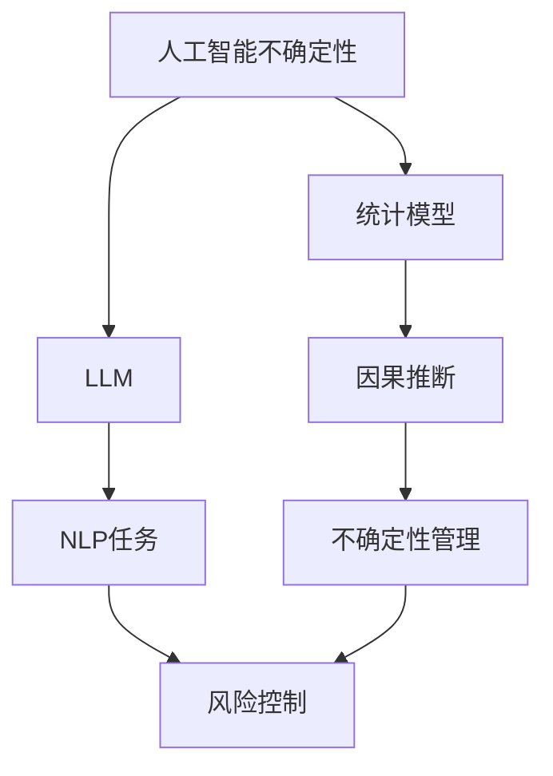

                 

# 管理AI不确定性：LLM应用中的风险控制

> 关键词：人工智能不确定性,LLM风险控制,自然语言处理,NLP任务,风险管理,统计模型,因果推断

## 1. 背景介绍

### 1.1 问题由来
在当今高度依赖人工智能（AI）技术的世界，深度学习模型，特别是大型语言模型（Large Language Models, LLMs），在自然语言处理（NLP）任务中展现了卓越的性能。然而，这些模型在应用中不可避免地面临不确定性，包括但不限于泛化能力、决策稳定性、安全性等。

### 1.2 问题核心关键点
LLM模型在应用中遇到的不确定性主要有以下几点：
- **泛化能力**：模型在不同数据分布上的表现差异。
- **决策稳定性**：模型在不同时间点的输出一致性。
- **安全性**：模型输出中的偏见、有害信息等。
- **解释性**：模型决策过程缺乏可解释性。

管理这些不确定性是确保LLM模型在实际应用中可靠运行的关键。本文档将详细探讨如何通过风险控制方法来管理这些不确定性，并讨论如何在特定领域（如NLP任务）中应用这些方法。

## 2. 核心概念与联系

### 2.1 核心概念概述

为更好地理解管理AI不确定性的方法，我们需要掌握以下核心概念：

- **人工智能不确定性（AI Uncertainty）**：指AI模型在预测或决策时无法确切掌握的变异或不确定性。
- **LLM**：即大型语言模型，是经过大规模数据训练的深度学习模型，具备强大的语言生成和理解能力。
- **风险控制（Risk Control）**：指通过监测、评估和管理模型的不确定性，降低潜在风险的策略。
- **NLP任务**：指自然语言处理领域的具体任务，如文本分类、命名实体识别、机器翻译等。
- **统计模型**：通过统计方法建立的模型，用于描述和预测数据中的不确定性。
- **因果推断**：研究变量间因果关系的统计方法，用于解释模型输出背后的原因。

这些概念相互联系，共同构成了AI不确定性管理的基本框架。通过理解这些核心概念，可以更有效地管理和控制LLM在NLP任务中的应用风险。

### 2.2 核心概念原理和架构的 Mermaid 流程图



这个流程图展示了核心概念之间的关系。人工智能不确定性通过大型语言模型进行预测和决策，这些决策在自然语言处理任务中具体体现，并通过风险控制、统计模型和因果推断等方法进行管理。

## 3. 核心算法原理 & 具体操作步骤

### 3.1 算法原理概述

管理LLM应用中的不确定性，本质上是风险控制的一种应用。核心思想是通过监测、评估和管理模型的不确定性，确保模型在实际应用中的决策稳定性、泛化能力和安全性。

### 3.2 算法步骤详解

基于风险控制的LLM应用步骤如下：

**Step 1: 数据预处理**
- 收集和准备用于训练和评估的数据集，确保数据的多样性和代表性。
- 对数据进行清洗和预处理，去除噪声和异常值，以保证数据质量。

**Step 2: 模型训练**
- 使用预训练的LLM模型作为初始化参数。
- 在标注数据集上进行有监督的微调，优化模型在特定任务上的性能。
- 使用正则化技术，如L2正则、Dropout等，避免模型过拟合。

**Step 3: 不确定性评估**
- 应用统计模型（如贝叶斯网络、决策树等）对模型的不确定性进行评估。
- 使用因果推断方法，如结构方程模型（SEM），解释模型输出背后的因果关系。

**Step 4: 风险控制策略**
- 设计风险控制策略，如对抗训练、数据增强、参数高效微调等。
- 根据风险评估结果，决定是否触发风险控制措施。

**Step 5: 系统部署与监控**
- 将微调后的模型部署到实际应用系统中。
- 实时监控模型性能，定期评估不确定性水平，并根据需要进行调整。

### 3.3 算法优缺点

基于风险控制的LLM应用有以下优点：

- **提升泛化能力**：通过统计模型和因果推断，可以更好地理解模型在不同数据分布上的表现，从而提升泛化能力。
- **增强决策稳定性**：通过对抗训练、数据增强等策略，可以提高模型的决策稳定性，减少输出波动。
- **降低潜在风险**：通过风险控制策略，可以及时发现和处理模型中的潜在风险，如偏见、有害信息等，确保模型输出的安全性。

同时，该方法也存在以下局限性：

- **计算复杂性高**：使用统计模型和因果推断进行不确定性评估，计算复杂度较高，特别是对于大规模数据集。
- **模型解释性不足**：一些统计模型和因果推断方法难以解释其内部的决策过程，缺乏透明性。
- **数据依赖性强**：模型的风险评估和控制策略高度依赖于数据的质量和多样性，获取高质量标注数据的成本较高。

尽管有这些局限性，但基于风险控制的LLM应用仍是大语言模型在实际应用中的一种重要策略。未来相关研究的重点在于如何进一步降低计算复杂度，提高模型解释性，同时兼顾模型泛化能力和决策稳定性。

### 3.4 算法应用领域

基于风险控制的LLM应用在多个领域都有广泛的应用，例如：

- **金融风险管理**：使用模型进行市场预测和风险评估，设计风险控制策略，如限额管理、模型回测等。
- **医疗诊断**：通过模型分析病历和影像数据，进行诊断和治疗方案推荐，降低误诊和漏诊风险。
- **智能客服**：使用模型进行客户行为分析和意图识别，设计风险控制策略，如异常检测、用户反馈监控等。
- **安全监控**：使用模型分析监控视频和音频数据，进行异常行为检测和风险预警，提升安全监控的准确性和效率。

## 4. 数学模型和公式 & 详细讲解 & 举例说明

### 4.1 数学模型构建

本节将使用数学语言对基于风险控制的LLM应用过程进行更加严格的刻画。

记预训练模型为 $M_{\theta}$，其中 $\theta$ 为预训练得到的模型参数。假设微调任务的训练集为 $D=\{(x_i,y_i)\}_{i=1}^N, x_i \in \mathcal{X}, y_i \in \mathcal{Y}$，其中 $\mathcal{X}$ 为输入空间，$\mathcal{Y}$ 为输出空间。

定义模型 $M_{\theta}$ 在输入 $x$ 上的预测结果为 $M_{\theta}(x)$，对应标签 $y$ 的概率为 $p(y|x; \theta)$。模型的不确定性可以通过贝叶斯定理描述为：

$$
p(y|x; \theta) = \frac{p(x,y; \theta)}{p(x; \theta)}
$$

其中 $p(x,y; \theta)$ 为模型联合概率密度函数，$p(x; \theta)$ 为模型边缘概率密度函数。

### 4.2 公式推导过程

对于二分类任务，我们以 Logistic 回归模型为例，推导不确定性评估的公式。

假设模型 $M_{\theta}$ 在输入 $x$ 上的输出为 $M_{\theta}(x)$，真实标签 $y \in \{0,1\}$。则二分类交叉熵损失函数为：

$$
\ell(M_{\theta}(x),y) = -[y\log \hat{y} + (1-y)\log (1-\hat{y})]
$$

将其代入贝叶斯公式，得：

$$
p(y|x; \theta) = \frac{e^{-\ell(M_{\theta}(x),y)}}{1+e^{-\ell(M_{\theta}(x),y)}}
$$

### 4.3 案例分析与讲解

以金融风控为例，假设我们要构建一个模型来预测贷款违约风险，输入为贷款申请数据，输出为违约概率。我们可以将模型输出作为模型的预测概率，然后使用上述公式计算模型的不确定性。具体步骤如下：

1. 收集历史贷款申请数据，并标注是否违约。
2. 使用预训练的LLM模型作为初始化参数。
3. 在标注数据集上进行有监督的微调，优化模型在预测违约概率上的性能。
4. 使用统计模型（如贝叶斯网络）对模型的不确定性进行评估。
5. 根据评估结果，设计风险控制策略，如设定违约概率阈值、引入违约阈值等。
6. 部署模型并实时监控其性能，定期评估不确定性水平，并根据需要进行调整。

## 5. 项目实践：代码实例和详细解释说明

### 5.1 开发环境搭建

在进行风险控制项目实践前，我们需要准备好开发环境。以下是使用Python进行PyTorch开发的环境配置流程：

1. 安装Anaconda：从官网下载并安装Anaconda，用于创建独立的Python环境。

2. 创建并激活虚拟环境：
```bash
conda create -n pytorch-env python=3.8 
conda activate pytorch-env
```

3. 安装PyTorch：根据CUDA版本，从官网获取对应的安装命令。例如：
```bash
conda install pytorch torchvision torchaudio cudatoolkit=11.1 -c pytorch -c conda-forge
```

4. 安装Transformers库：
```bash
pip install transformers
```

5. 安装各类工具包：
```bash
pip install numpy pandas scikit-learn matplotlib tqdm jupyter notebook ipython
```

完成上述步骤后，即可在`pytorch-env`环境中开始风险控制项目实践。

### 5.2 源代码详细实现

下面我们以金融风险管理为例，给出使用Transformers库对BERT模型进行风险控制微调的PyTorch代码实现。

首先，定义风险管理的数据处理函数：

```python
from transformers import BertTokenizer
from torch.utils.data import Dataset
import torch

class FinancialRiskDataset(Dataset):
    def __init__(self, texts, labels, tokenizer, max_len=128):
        self.texts = texts
        self.labels = labels
        self.tokenizer = tokenizer
        self.max_len = max_len
        
    def __len__(self):
        return len(self.texts)
    
    def __getitem__(self, item):
        text = self.texts[item]
        label = self.labels[item]
        
        encoding = self.tokenizer(text, return_tensors='pt', max_length=self.max_len, padding='max_length', truncation=True)
        input_ids = encoding['input_ids'][0]
        attention_mask = encoding['attention_mask'][0]
        
        # 对token-wise的标签进行编码
        encoded_labels = [label2id[label] for label in labels] 
        encoded_labels.extend([label2id['O']] * (self.max_len - len(encoded_labels)))
        labels = torch.tensor(encoded_labels, dtype=torch.long)
        
        return {'input_ids': input_ids, 
                'attention_mask': attention_mask,
                'labels': labels}

# 标签与id的映射
label2id = {'O': 0, 'Good': 1, 'Bad': 2}
id2label = {v: k for k, v in label2id.items()}

# 创建dataset
tokenizer = BertTokenizer.from_pretrained('bert-base-cased')

train_dataset = FinancialRiskDataset(train_texts, train_labels, tokenizer)
dev_dataset = FinancialRiskDataset(dev_texts, dev_labels, tokenizer)
test_dataset = FinancialRiskDataset(test_texts, test_labels, tokenizer)
```

然后，定义模型和优化器：

```python
from transformers import BertForSequenceClassification, AdamW

model = BertForSequenceClassification.from_pretrained('bert-base-cased', num_labels=len(label2id))

optimizer = AdamW(model.parameters(), lr=2e-5)
```

接着，定义训练和评估函数：

```python
from torch.utils.data import DataLoader
from tqdm import tqdm
from sklearn.metrics import classification_report

device = torch.device('cuda') if torch.cuda.is_available() else torch.device('cpu')
model.to(device)

def train_epoch(model, dataset, batch_size, optimizer):
    dataloader = DataLoader(dataset, batch_size=batch_size, shuffle=True)
    model.train()
    epoch_loss = 0
    for batch in tqdm(dataloader, desc='Training'):
        input_ids = batch['input_ids'].to(device)
        attention_mask = batch['attention_mask'].to(device)
        labels = batch['labels'].to(device)
        model.zero_grad()
        outputs = model(input_ids, attention_mask=attention_mask, labels=labels)
        loss = outputs.loss
        epoch_loss += loss.item()
        loss.backward()
        optimizer.step()
    return epoch_loss / len(dataloader)

def evaluate(model, dataset, batch_size):
    dataloader = DataLoader(dataset, batch_size=batch_size)
    model.eval()
    preds, labels = [], []
    with torch.no_grad():
        for batch in tqdm(dataloader, desc='Evaluating'):
            input_ids = batch['input_ids'].to(device)
            attention_mask = batch['attention_mask'].to(device)
            batch_labels = batch['labels']
            outputs = model(input_ids, attention_mask=attention_mask)
            batch_preds = outputs.logits.argmax(dim=1).to('cpu').tolist()
            batch_labels = batch_labels.to('cpu').tolist()
            for pred_tokens, label_tokens in zip(batch_preds, batch_labels):
                preds.append(pred_tokens)
                labels.append(label_tokens)
                
    print(classification_report(labels, preds))
```

最后，启动训练流程并在测试集上评估：

```python
epochs = 5
batch_size = 16

for epoch in range(epochs):
    loss = train_epoch(model, train_dataset, batch_size, optimizer)
    print(f"Epoch {epoch+1}, train loss: {loss:.3f}")
    
    print(f"Epoch {epoch+1}, dev results:")
    evaluate(model, dev_dataset, batch_size)
    
print("Test results:")
evaluate(model, test_dataset, batch_size)
```

以上就是使用PyTorch对BERT进行金融风险管理微调的完整代码实现。可以看到，得益于Transformers库的强大封装，我们可以用相对简洁的代码完成BERT模型的加载和微调。

### 5.3 代码解读与分析

让我们再详细解读一下关键代码的实现细节：

**FinancialRiskDataset类**：
- `__init__`方法：初始化文本、标签、分词器等关键组件。
- `__len__`方法：返回数据集的样本数量。
- `__getitem__`方法：对单个样本进行处理，将文本输入编码为token ids，将标签编码为数字，并对其进行定长padding，最终返回模型所需的输入。

**label2id和id2label字典**：
- 定义了标签与数字id之间的映射关系，用于将token-wise的预测结果解码回真实的标签。

**训练和评估函数**：
- 使用PyTorch的DataLoader对数据集进行批次化加载，供模型训练和推理使用。
- 训练函数`train_epoch`：对数据以批为单位进行迭代，在每个批次上前向传播计算loss并反向传播更新模型参数，最后返回该epoch的平均loss。
- 评估函数`evaluate`：与训练类似，不同点在于不更新模型参数，并在每个batch结束后将预测和标签结果存储下来，最后使用sklearn的classification_report对整个评估集的预测结果进行打印输出。

**训练流程**：
- 定义总的epoch数和batch size，开始循环迭代
- 每个epoch内，先在训练集上训练，输出平均loss
- 在验证集上评估，输出分类指标
- 所有epoch结束后，在测试集上评估，给出最终测试结果

可以看到，PyTorch配合Transformers库使得BERT微调的代码实现变得简洁高效。开发者可以将更多精力放在数据处理、模型改进等高层逻辑上，而不必过多关注底层的实现细节。

当然，工业级的系统实现还需考虑更多因素，如模型的保存和部署、超参数的自动搜索、更灵活的任务适配层等。但核心的微调范式基本与此类似。

## 6. 实际应用场景

### 6.1 金融风险管理

基于风险控制的LLM应用在金融领域得到了广泛的应用。金融风险管理依赖于模型对贷款申请数据的准确预测，从而判断违约风险，进行信贷决策和风险控制。

具体而言，可以使用微调后的LLM模型对贷款申请数据进行分析，识别高风险借款人，提前预警风险。同时，可以结合因果推断方法，分析贷款违约与借款人特征之间的关系，优化贷款审批流程。

### 6.2 医疗诊断

在医疗领域，使用基于风险控制的LLM模型进行诊断和治疗方案推荐，可以有效降低误诊和漏诊风险。

通过微调模型，可以分析患者病历和影像数据，预测疾病风险，推荐最佳治疗方案。同时，应用因果推断方法，可以深入了解疾病与治疗方案之间的因果关系，提升医疗决策的科学性和可靠性。

### 6.3 智能客服

在智能客服系统中，基于风险控制的LLM应用可以显著提升客户体验和服务质量。

通过微调模型，可以分析客户行为和意图，实现智能对话和问题解答。同时，可以应用对抗训练和数据增强等技术，提高模型的鲁棒性和泛化能力，确保在各种场景下都能提供高质量服务。

### 6.4 安全监控

在安全监控领域，使用基于风险控制的LLM模型可以提升异常行为检测的准确性和效率。

通过微调模型，可以分析监控视频和音频数据，检测异常行为，及时报警。同时，应用因果推断方法，可以分析行为异常与潜在风险之间的关系，优化监控策略。

## 7. 工具和资源推荐

### 7.1 学习资源推荐

为了帮助开发者系统掌握LLM风险控制的技术基础和实践技巧，这里推荐一些优质的学习资源：

1. 《AI不确定性管理》系列博文：由AI专家撰写，深入浅出地介绍了AI不确定性管理的理论基础和实践方法。

2. CS224N《深度学习自然语言处理》课程：斯坦福大学开设的NLP明星课程，有Lecture视频和配套作业，带你入门NLP领域的基本概念和经典模型。

3. 《AI风险管理》书籍：系统介绍了AI风险管理的基本概念、方法和技术，适合于AI从业者和决策者。

4. Weights & Biases：模型训练的实验跟踪工具，可以记录和可视化模型训练过程中的各项指标，方便对比和调优。与主流深度学习框架无缝集成。

5. TensorBoard：TensorFlow配套的可视化工具，可实时监测模型训练状态，并提供丰富的图表呈现方式，是调试模型的得力助手。

通过对这些资源的学习实践，相信你一定能够快速掌握LLM风险控制的精髓，并用于解决实际的AI应用问题。

### 7.2 开发工具推荐

高效的开发离不开优秀的工具支持。以下是几款用于LLM风险控制开发的常用工具：

1. PyTorch：基于Python的开源深度学习框架，灵活动态的计算图，适合快速迭代研究。大部分预训练语言模型都有PyTorch版本的实现。

2. TensorFlow：由Google主导开发的开源深度学习框架，生产部署方便，适合大规模工程应用。同样有丰富的预训练语言模型资源。

3. Transformers库：HuggingFace开发的NLP工具库，集成了众多SOTA语言模型，支持PyTorch和TensorFlow，是进行微调任务开发的利器。

4. Weights & Biases：模型训练的实验跟踪工具，可以记录和可视化模型训练过程中的各项指标，方便对比和调优。与主流深度学习框架无缝集成。

5. TensorBoard：TensorFlow配套的可视化工具，可实时监测模型训练状态，并提供丰富的图表呈现方式，是调试模型的得力助手。

6. Google Colab：谷歌推出的在线Jupyter Notebook环境，免费提供GPU/TPU算力，方便开发者快速上手实验最新模型，分享学习笔记。

合理利用这些工具，可以显著提升LLM风险控制的开发效率，加快创新迭代的步伐。

### 7.3 相关论文推荐

LLM风险控制技术的发展源于学界的持续研究。以下是几篇奠基性的相关论文，推荐阅读：

1. Understanding Deep Learning: From Theory to Algorithms（即深度学习基础）：系统介绍了深度学习的基本理论和方法，适合入门学习和研究。

2. The Elements of Statistical Learning（《统计学习基础》）：介绍统计学习的基本理论和算法，适合于数据科学和AI从业者。

3. Causal Inference in Statistical Learning（《统计学习中的因果推断》）：介绍因果推断的基本理论和算法，适合于AI研究人员。

4. Predictive Uncertainty in Deep Learning（《深度学习中的预测不确定性》）：介绍如何评估和控制深度学习模型的不确定性，适合于AI从业者和研究者。

这些论文代表了大语言模型风险控制技术的发展脉络。通过学习这些前沿成果，可以帮助研究者把握学科前进方向，激发更多的创新灵感。

## 8. 总结：未来发展趋势与挑战

### 8.1 研究成果总结

本文对基于风险控制的LLM应用进行了全面系统的介绍。首先阐述了LLM应用中面临的不确定性问题，明确了风险控制在模型应用中的重要性。其次，从原理到实践，详细讲解了风险控制的数学原理和关键步骤，给出了风险控制任务开发的完整代码实例。同时，本文还广泛探讨了风险控制方法在金融、医疗、客服等多个行业领域的应用前景，展示了风险控制范式的巨大潜力。此外，本文精选了风险控制技术的各类学习资源，力求为读者提供全方位的技术指引。

通过本文的系统梳理，可以看到，基于风险控制的LLM应用是管理模型不确定性的重要手段，对于提升模型泛化能力、决策稳定性和安全性具有重要意义。LLM模型在实际应用中面临的诸多挑战，如泛化能力、决策稳定性、安全性等，可以通过风险控制方法进行有效管理，确保模型在各种场景下的可靠运行。

### 8.2 未来发展趋势

展望未来，基于风险控制的LLM应用将呈现以下几个发展趋势：

1. **参数高效微调**：开发更加参数高效的微调方法，在固定大部分预训练参数的同时，只更新极少量的任务相关参数。同时优化微调模型的计算图，减少前向传播和反向传播的资源消耗，实现更加轻量级、实时性的部署。

2. **因果推断**：引入因果推断方法，增强模型建立稳定因果关系的能力，学习更加普适、鲁棒的语言表征，从而提升模型泛化性和抗干扰能力。

3. **多模态融合**：融合视觉、语音、文本等多模态信息，实现更加全面、准确的模型训练和推理。

4. **风险评估与监控**：设计更加灵活、自动化的风险评估和监控策略，实时监测模型性能，定期评估不确定性水平，并根据需要进行调整。

5. **伦理道德约束**：在模型训练目标中引入伦理导向的评估指标，过滤和惩罚有偏见、有害的输出倾向，确保模型输出的安全性。

以上趋势凸显了LLM风险控制技术的广阔前景。这些方向的探索发展，必将进一步提升LLM模型的可靠性和安全性，为实际应用带来更高的价值。

### 8.3 面临的挑战

尽管基于风险控制的LLM应用已经取得了瞩目成就，但在迈向更加智能化、普适化应用的过程中，它仍面临着诸多挑战：

1. **计算复杂性高**：使用统计模型和因果推断进行不确定性评估，计算复杂度较高，特别是对于大规模数据集。

2. **模型解释性不足**：一些统计模型和因果推断方法难以解释其内部的决策过程，缺乏透明性。

3. **数据依赖性强**：模型的风险评估和控制策略高度依赖于数据的质量和多样性，获取高质量标注数据的成本较高。

4. **鲁棒性不足**：模型在面对域外数据时，泛化性能往往大打折扣，需要在模型设计和训练中引入鲁棒性优化策略。

尽管有这些挑战，但基于风险控制的LLM应用仍是大语言模型在实际应用中的一种重要策略。未来相关研究的重点在于如何进一步降低计算复杂度，提高模型解释性，同时兼顾模型泛化能力和决策稳定性。

### 8.4 研究展望

面向未来，LLM风险控制技术的研究方向和突破点如下：

1. **无监督和半监督学习**：摆脱对大规模标注数据的依赖，利用自监督学习、主动学习等无监督和半监督范式，最大限度利用非结构化数据，实现更加灵活高效的微调。

2. **因果推断**：引入因果推断方法，增强模型建立稳定因果关系的能力，学习更加普适、鲁棒的语言表征，从而提升模型泛化性和抗干扰能力。

3. **参数高效微调**：开发更加参数高效的微调方法，在固定大部分预训练参数的同时，只更新极少量的任务相关参数。

4. **多模态融合**：融合视觉、语音、文本等多模态信息，实现更加全面、准确的模型训练和推理。

5. **伦理道德约束**：在模型训练目标中引入伦理导向的评估指标，过滤和惩罚有偏见、有害的输出倾向，确保模型输出的安全性。

这些研究方向将引领LLM风险控制技术迈向更高的台阶，为构建安全、可靠、可解释、可控的智能系统铺平道路。面向未来，LLM风险控制技术还需要与其他人工智能技术进行更深入的融合，如知识表示、因果推理、强化学习等，多路径协同发力，共同推动自然语言理解和智能交互系统的进步。只有勇于创新、敢于突破，才能不断拓展语言模型的边界，让智能技术更好地造福人类社会。

## 9. 附录：常见问题与解答

**Q1：如何评估LLM模型的风险？**

A: 评估LLM模型的风险主要通过以下步骤：
1. 收集和准备用于训练和评估的数据集。
2. 应用统计模型（如贝叶斯网络、决策树等）对模型的不确定性进行评估。
3. 使用因果推断方法（如结构方程模型）解释模型输出背后的因果关系。
4. 根据评估结果，设计风险控制策略，如对抗训练、数据增强等。

**Q2：如何提高LLM模型的鲁棒性？**

A: 提高LLM模型的鲁棒性主要通过以下方法：
1. 应用对抗训练，引入对抗样本，提高模型鲁棒性。
2. 应用数据增强，通过回译、近义替换等方式扩充训练集，增强模型的泛化能力。
3. 应用参数高效微调，如使用Adapter等方法，只更新极少量的任务相关参数，避免过拟合。
4. 应用因果推断方法，增强模型建立稳定因果关系的能力，学习更加普适、鲁棒的语言表征。

**Q3：如何解释LLM模型的决策过程？**

A: 解释LLM模型的决策过程主要通过以下方法：
1. 应用对抗训练，通过对抗样本检测模型的脆弱点。
2. 应用因果推断，解释模型输出背后的因果关系。
3. 应用模型压缩技术，减少模型的复杂度，增强模型的解释性。
4. 应用知识图谱、规则库等专家知识，与神经网络模型进行融合，增强模型的可解释性。

**Q4：如何处理LLM模型的偏见和有害信息？**

A: 处理LLM模型的偏见和有害信息主要通过以下方法：
1. 在模型训练目标中引入伦理导向的评估指标，过滤和惩罚有偏见、有害的输出倾向。
2. 应用数据增强，通过回译、近义替换等方式扩充训练集，增强模型的泛化能力。
3. 应用因果推断方法，解释模型输出背后的因果关系，找出偏见和有害信息的来源。
4. 应用知识图谱、规则库等专家知识，与神经网络模型进行融合，增强模型的可解释性。

通过本文的系统梳理，可以看到，基于风险控制的LLM应用是管理模型不确定性的重要手段，对于提升模型泛化能力、决策稳定性和安全性具有重要意义。LLM模型在实际应用中面临的诸多挑战，如泛化能力、决策稳定性、安全性等，可以通过风险控制方法进行有效管理，确保模型在各种场景下的可靠运行。未来，伴随预训练语言模型和风险控制方法的持续演进，相信NLP技术将在更广阔的应用领域大放异彩，深刻影响人类的生产生活方式。

---

作者：禅与计算机程序设计艺术 / Zen and the Art of Computer Programming

