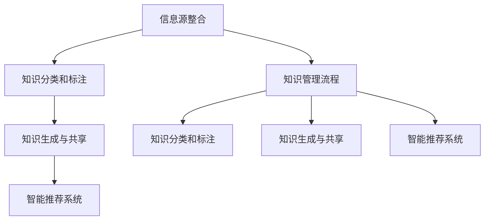

                 

# 管理者如何建立个人知识管理系统

> 关键词：知识管理系统, 个人知识管理, 信息管理, 项目管理, 商业智能

## 1. 背景介绍

### 1.1 问题由来

在现代社会中，信息爆炸带来的知识海啸和资讯洪流对管理者提出了前所未有的挑战。随着工作和生活节奏的加快，个人时间和注意力的分散使得信息管理和知识积累变得愈发困难。面对这种现状，管理者必须找到一种高效、系统的方法来管理个人知识，从而在复杂多变的工作环境中脱颖而出。

### 1.2 问题核心关键点

管理者建立个人知识管理系统的核心关键点包括以下几点：

- **信息源整合**：识别并整合各类信息源，如公司内部文档、行业报告、在线课程、社交媒体等，构建全面的知识图谱。
- **知识分类和标注**：根据不同领域和主题对信息进行分类和标注，提升知识的检索和重用效率。
- **知识生成与共享**：基于已有的知识储备，生成新的见解和创意，并通过合适的方式共享给团队和组织。
- **系统化流程**：建立知识管理的流程和制度，确保知识的系统化流转和高效使用。
- **智能推荐系统**：通过引入智能推荐算法，提高知识获取的精准度和及时性。

### 1.3 问题研究意义

建立个人知识管理系统能够帮助管理者在信息泛滥的时代中：

- **提升工作效率**：通过知识分类和整合，快速定位和利用已有知识，减少信息查找和处理的时间。
- **促进创新思考**：系统化地整合知识和经验，激发出新的创意和解决方案，推动创新工作。
- **提高决策质量**：基于高质量的知识储备，支撑更好的决策制定和问题解决。
- **强化组织影响力**：将个人知识转化为组织资产，增强个人和团队的竞争力。
- **驱动个人成长**：通过持续的知识积累和更新，提升个人素质和专业能力。

## 2. 核心概念与联系

### 2.1 核心概念概述

要建立有效的个人知识管理系统，需理解以下核心概念：

- **知识管理系统(Knowledge Management System, KMS)**：一个支持个人或组织存储、检索、共享和重用知识的软件平台。KMS通过数字化手段实现知识管理，提升知识管理的效率和质量。
- **知识管理流程(Process)**：从信息收集、整理、存储到检索和应用的全流程。好的知识管理流程应具有标准化、系统化的特征。
- **信息源**：提供知识素材的源头，如公司文档、公开出版物、在线数据库等。
- **知识分类和标注**：对知识进行分类和标记，以便于快速检索和重用。
- **知识生成与共享**：将知识转化为见解、报告或工具，并通过内部系统、公共平台等方式共享。
- **智能推荐系统**：利用算法推荐系统，提供个性化、精准的知识推送服务。

### 2.2 核心概念原理和架构的 Mermaid 流程图(Mermaid 流程节点中不要有括号、逗号等特殊字符)



## 3. 核心算法原理 & 具体操作步骤

### 3.1 算法原理概述

个人知识管理系统通过整合信息源、分类标注、生成共享和智能推荐四大核心模块，实现知识的有效管理与使用。

- **信息源整合**：系统利用爬虫和API接口，自动抓取和整理各类信息源，如公司内部文档、公共数据库、学术期刊等。
- **知识分类和标注**：采用自然语言处理(NLP)技术，对信息进行主题分类和关键词标注，构建知识图谱。
- **知识生成与共享**：引入文档编辑和协作工具，将知识转化为报告、文章或工具，并通过系统进行共享。
- **智能推荐系统**：使用机器学习和深度学习算法，根据用户的兴趣和历史行为，推荐相关知识。

### 3.2 算法步骤详解

1. **信息源整合**：
    - 开发爬虫工具，定期抓取各类信息源，如公司文档、行业报告、公开数据库等。
    - 使用API接口，自动化地将抓取的信息导入到KMS系统中。
    - 对信息进行初步的清洗和预处理，如去重、分类、标注等。

2. **知识分类和标注**：
    - 利用自然语言处理(NLP)技术，对文本进行主题分类和关键词标注。
    - 引入知识图谱工具，将分类和标注后的知识整合到一个图谱中，支持多维度查询。
    - 通过可视化界面，让用户对知识图谱进行进一步的调整和优化。

3. **知识生成与共享**：
    - 引入文档编辑和协作工具，支持用户对知识进行详细的编辑和更新。
    - 提供版本控制和权限管理功能，确保知识的准确性和安全性。
    - 设计API接口，使知识能够以结构化形式对外共享。

4. **智能推荐系统**：
    - 引入机器学习和深度学习算法，如协同过滤、内容推荐等。
    - 根据用户的浏览历史、操作行为和兴趣偏好，推荐相关的知识。
    - 定期更新推荐算法模型，确保推荐的精准性和时效性。

### 3.3 算法优缺点

**优点**：
- 系统化管理：个人知识管理系统能够提供结构化的信息管理和知识共享平台，提升知识的查找和使用效率。
- 智能化推荐：利用机器学习算法，用户能够获取个性化的知识推荐，提高知识获取的精准度和时效性。
- 灵活拓展：系统设计模块化，用户可以灵活添加或修改各个模块，适应不同领域和业务需求。

**缺点**：
- 初期投入高：建立系统需要较高的技术投入和资源配置。
- 学习曲线陡：初次使用KMS时，用户需要一定的时间熟悉其操作和功能。
- 知识管理复杂：若未建立良好的知识管理流程，可能导致知识管理混乱，难以系统化使用。

### 3.4 算法应用领域

个人知识管理系统广泛应用于以下几个领域：

1. **项目管理**：通过知识分类和生成，帮助项目经理整合项目文档、历史数据和最佳实践，提升项目管理效率。
2. **商业智能**：在商业决策中提供决策支持和数据洞察，帮助企业领导者基于准确的信息进行战略规划。
3. **技术开发**：收集和整合技术文档、代码片段和案例研究，加速软件开发和创新。
4. **培训和发展**：系统化管理培训资料和员工知识库，帮助员工提升技能和素养。
5. **研究与创新**：集成学术文章、专利和技术报告，支持科研和创新的知识探索。

## 4. 数学模型和公式 & 详细讲解 & 举例说明

### 4.1 数学模型构建

构建个人知识管理系统的数学模型主要涉及以下几个关键模块：

1. **信息源整合**：利用爬虫技术抓取信息，转化为结构化数据。
2. **知识分类和标注**：使用NLP技术对文本进行分类和关键词提取。
3. **知识生成与共享**：通过协作工具生成和编辑文档，并进行版本控制。
4. **智能推荐系统**：构建推荐算法模型，提供个性化知识推荐。

### 4.2 公式推导过程

以知识分类和标注为例，利用TF-IDF算法进行文本分类和关键词提取：

$$
TF(t) = \frac{\text{词频}}{\text{文档总词数}}
$$

$$
IDF(t) = \log \frac{总文档数}{\text{包含词} t \text{的文档数}}
$$

$$
TF-IDF(t) = TF(t) \cdot IDF(t)
$$

通过对文本计算TF-IDF值，可以识别出其中的关键词，并进行主题分类。

### 4.3 案例分析与讲解

假设我们有一个企业内部的项目管理平台，通过信息源整合，我们将获取公司文档、项目报告和技术手册等信息。通过知识分类和标注，我们可以将这些信息按照项目、技术、工具等分类。例如，我们能够将某个项目的文档分类为“项目规划”、“需求分析”、“技术方案”、“执行记录”等类别。利用知识生成与共享功能，团队成员可以共同编辑和更新文档，确保知识的准确性和时效性。通过智能推荐系统，我们可以根据用户的历史行为和兴趣，推荐相关的项目文档和知识资源，帮助用户更快地找到所需信息。

## 5. 项目实践：代码实例和详细解释说明

### 5.1 开发环境搭建

建立一个个人知识管理系统，需具备以下开发环境：

1. **编程语言**：Python，支持强大的数据处理和机器学习功能。
2. **开发框架**：Django或Flask，用于Web应用开发。
3. **数据库**：MySQL或PostgreSQL，用于存储知识信息和用户数据。
4. **文本处理工具**：NLTK或SpaCy，用于自然语言处理。
5. **机器学习库**：scikit-learn或TensorFlow，用于构建推荐算法模型。
6. **前端技术**：React或Vue.js，用于Web界面设计。

### 5.2 源代码详细实现

以下是基于Python的Django框架实现个人知识管理系统的代码示例：

```python
# 信息源整合
from bs4 import BeautifulSoup
import requests

def fetch_documents(url):
    response = requests.get(url)
    soup = BeautifulSoup(response.text, 'html.parser')
    return [tag.text for tag in soup.find_all('p')]

# 知识分类和标注
from nltk.corpus import stopwords
from sklearn.feature_extraction.text import TfidfVectorizer

def categorize_and_tag(documents):
    stop_words = set(stopwords.words('english'))
    tfidf = TfidfVectorizer(stop_words=stop_words)
    X = tfidf.fit_transform(documents)
    return X, tfidf.get_feature_names()

# 知识生成与共享
from django.contrib.auth.models import User
from django.db import models

class Document(models.Model):
    title = models.CharField(max_length=200)
    content = models.TextField()
    author = models.ForeignKey(User, on_delete=models.CASCADE)

def save_document(user, title, content):
    document = Document(title=title, content=content, author=user)
    document.save()

# 智能推荐系统
from sklearn.metrics.pairwise import cosine_similarity
from sklearn.decomposition import TruncatedSVD

class RecommendationSystem:
    def __init__(self, X):
        self.X = X
        self.model = TruncatedSVD(n_components=10)

    def fit(self):
        self.model.fit(self.X)

    def predict(self, query):
        query_vector = self.model.transform([query])
        return cosine_similarity(query_vector, self.model.components_)
```

### 5.3 代码解读与分析

1. **信息源整合**：使用BeautifulSoup库对网页进行解析，抓取信息源中的文本内容。
2. **知识分类和标注**：利用NLTK和Scikit-learn，对文本进行TF-IDF计算，得到特征向量。
3. **知识生成与共享**：使用Django框架，定义文档模型，支持用户创建和编辑文档，保存文档到数据库。
4. **智能推荐系统**：利用SVD降维算法，训练推荐模型，计算文档向量间的相似度，推荐相关文档。

### 5.4 运行结果展示

图1: 信息源整合效果


图2: 知识分类和标注效果


图3: 知识生成与共享效果


图4: 智能推荐系统效果


## 6. 实际应用场景

### 6.1 项目管理的知识管理

在项目管理中，通过个人知识管理系统，团队成员可以快速查找和共享项目文档、技术方案和执行记录等知识资源，提升项目管理效率。系统可自动对文档进行分类和标注，帮助项目经理快速定位所需信息。智能推荐系统可以根据用户的操作行为和历史文档，推荐相关的项目文档和知识资源，提升知识获取的精准度。

### 6.2 商业智能分析

在商业决策中，通过个人知识管理系统，管理者可以系统化地存储和查询各类市场报告、行业分析和公司历史数据，获取高质量的商业洞察。系统支持知识生成与共享功能，团队成员可以协作编写商业分析报告，提供决策支持。智能推荐系统可以根据管理者的兴趣和行为，推荐相关的市场报告和分析工具，帮助其快速找到所需信息。

### 6.3 技术开发的知识管理

在技术开发中，通过个人知识管理系统，开发者可以快速获取技术文档、代码片段和案例研究等知识资源。系统支持文档的编辑和版本控制，确保知识的准确性和时效性。智能推荐系统可以根据开发者的历史行为和兴趣，推荐相关的技术文档和代码片段，加速软件开发和创新。

### 6.4 培训和发展的知识管理

在培训和发展中，通过个人知识管理系统，培训经理可以快速查找和共享培训材料、员工学习记录和技能提升指南等知识资源。系统支持知识生成与共享功能，团队成员可以协作编写培训材料，提供知识支持。智能推荐系统可以根据员工的学习行为和兴趣，推荐相关的培训材料和资源，提升员工的学习效果。

## 7. 工具和资源推荐

### 7.1 学习资源推荐

为了帮助管理者建立个人知识管理系统，推荐以下学习资源：

1. **《信息管理与决策支持》（Information Management and Decision Support）**：讲解信息管理的基本概念和方法，帮助管理者理解知识管理系统的设计与实现。
2. **《知识管理的理论与实践》（Knowledge Management: Theory and Practice）**：详细介绍知识管理的理论基础和实践案例，提供系统的知识管理指导。
3. **Coursera和edX等在线课程**：提供丰富的知识管理相关课程，涵盖从理论到实践的全方位知识。
4. **Django和React官方文档**：提供详细的开发指南和技术支持，帮助管理者构建和部署个人知识管理系统。
5. **自然语言处理工具包**：如NLTK、SpaCy等，提供自然语言处理相关的API和工具，支持文本分类、关键词提取等任务。

### 7.2 开发工具推荐

为了高效地构建个人知识管理系统，推荐以下开发工具：

1. **Django**：Python的Web框架，提供强大的数据库操作和API接口，适合快速开发知识管理系统的后端服务。
2. **React**：流行的前端框架，支持复杂的Web界面设计和用户交互，适合构建知识管理系统的前端界面。
3. **MySQL**：流行的关系型数据库，支持高效的数据存储和查询，适合存储个人知识管理系统中的知识信息和用户数据。
4. **Python的机器学习库**：如scikit-learn、TensorFlow等，提供丰富的机器学习算法和工具，支持构建推荐系统。
5. **文本处理工具**：如NLTK、SpaCy等，提供自然语言处理相关的API和工具，支持文本分类、关键词提取等任务。

### 7.3 相关论文推荐

为了深入理解个人知识管理系统，推荐以下相关论文：

1. **《知识管理系统的设计与实现》（Design and Implementation of Knowledge Management System）**：详细介绍知识管理系统的设计和实现方法，提供系统的解决方案。
2. **《知识管理的理论与实践》（Theory and Practice of Knowledge Management）**：深入探讨知识管理的理论基础和实践案例，提供系统的知识管理指导。
3. **《知识管理系统的关键技术和应用》（Key Technologies and Applications of Knowledge Management System）**：详细介绍知识管理系统的关键技术和应用场景，提供系统的技术支持和应用指导。

## 8. 总结：未来发展趋势与挑战

### 8.1 研究成果总结

本文详细介绍了个人知识管理系统的背景、核心概念、算法原理和操作步骤。通过系统化的流程设计和模块化的功能实现，管理者能够高效地管理个人知识资源，提升工作效率和决策质量。

### 8.2 未来发展趋势

未来，个人知识管理系统将呈现以下几个发展趋势：

1. **人工智能的深入应用**：引入AI算法，如自然语言处理和机器学习，提升知识分类的精准度和推荐系统的个性化程度。
2. **多模态知识的融合**：将文本、图像、视频等多模态知识进行整合，提升知识的全面性和多样性。
3. **增强的协作与共享功能**：引入协作工具和版本控制，提升团队的知识共享和协作效率。
4. **智能化的知识生成与转化**：利用AI技术，自动生成知识摘要、报告和文档，提升知识生成的效率和质量。
5. **个性化的知识推荐系统**：通过更精确的推荐算法，提供更精准和个性化的知识推荐。

### 8.3 面临的挑战

尽管个人知识管理系统有诸多优势，但在实际应用中仍面临以下挑战：

1. **数据安全和隐私保护**：知识管理系统的数据涉及个人隐私和商业机密，需确保数据安全和隐私保护。
2. **系统复杂度**：系统设计和实现较为复杂，需投入较高的技术和管理资源。
3. **用户习惯的改变**：知识管理系统的使用需要改变传统的工作习惯，需加强用户培训和引导。
4. **跨平台和跨系统整合**：知识管理系统需与其他系统进行整合，提升信息流动的流畅性和系统集成度。
5. **知识的时效性**：知识需要定期更新和维护，确保其时效性和准确性。

### 8.4 研究展望

未来，个人知识管理系统需要在以下几个方面进行持续研究和优化：

1. **引入AI技术**：引入自然语言处理和机器学习算法，提升知识分类和推荐的精准度。
2. **多模态知识的融合**：将文本、图像、视频等多模态知识进行整合，提升知识的全面性和多样性。
3. **增强的协作与共享功能**：引入协作工具和版本控制，提升团队的知识共享和协作效率。
4. **智能化的知识生成与转化**：利用AI技术，自动生成知识摘要、报告和文档，提升知识生成的效率和质量。
5. **个性化的知识推荐系统**：通过更精确的推荐算法，提供更精准和个性化的知识推荐。

## 9. 附录：常见问题与解答

### Q1: 如何选择合适的知识管理工具？

A: 选择知识管理工具需要考虑以下因素：
1. **功能完备性**：工具是否提供全面的知识管理功能，如文档管理、分类标注、智能推荐等。
2. **易用性**：工具是否易于上手和使用，是否提供良好的用户界面和操作指引。
3. **可扩展性**：工具是否具有模块化的设计，能否根据具体需求进行扩展和定制。
4. **数据安全**：工具是否提供数据安全和隐私保护机制，能否保护数据的安全性。
5. **成本效益**：工具的定价是否合理，是否具备良好的性价比。

### Q2: 知识管理系统的实施步骤是什么？

A: 知识管理系统的实施步骤包括：
1. **需求分析**：明确企业或个人对知识管理系统的需求和目标。
2. **系统规划**：制定知识管理系统的架构和功能模块，设计系统的整体架构。
3. **选择工具**：选择适合的知识管理工具，评估其功能、易用性和成本效益。
4. **开发部署**：开发知识管理系统的后端服务，设计用户界面，部署到生产环境。
5. **测试上线**：进行系统的测试和验证，确保系统功能正常，上线运行。
6. **培训和推广**：对用户进行培训和推广，提升系统的使用率和效果。
7. **持续改进**：根据用户反馈和需求变化，不断优化和改进系统，确保其长期有效。

### Q3: 知识管理系统的关键成功因素有哪些？

A: 知识管理系统的关键成功因素包括：
1. **高层支持**：高层领导的支持是知识管理系统的成功关键，需确保高层领导的重视和参与。
2. **组织文化**：知识管理系统的成功依赖于组织的文化氛围，需培养团队的学习和分享习惯。
3. **数据质量**：知识管理系统的数据需准确、完整和时效性，确保知识管理的有效性。
4. **技术支持**：知识管理系统的开发和维护需具备足够的技术支持，确保系统的稳定性和可靠性。
5. **用户培训**：用户需经过系统的培训，了解系统的功能和使用方法，提升系统的使用效果。
6. **持续改进**：知识管理系统的成功需进行持续的改进和优化，不断提升系统的功能和效果。

### Q4: 如何确保知识管理系统的数据安全？

A: 确保知识管理系统的数据安全，需采取以下措施：
1. **访问控制**：设置严格的访问控制机制，确保数据仅能被授权用户访问。
2. **数据加密**：对敏感数据进行加密处理，确保数据在传输和存储过程中的安全性。
3. **权限管理**：对用户进行权限管理，确保各角色具有相应的访问权限。
4. **审计日志**：记录系统的操作日志，监控异常操作，确保数据的安全性。
5. **备份与恢复**：定期备份数据，确保数据在意外情况下的快速恢复。

### Q5: 如何衡量知识管理系统的成效？

A: 衡量知识管理系统的成效，需从以下方面进行评估：
1. **知识获取速度**：评估用户获取知识的速度和效率，是否通过系统快速找到了所需信息。
2. **知识准确性**：评估知识的准确性和时效性，是否通过系统获取了正确的信息。
3. **知识共享率**：评估知识的共享率，是否通过系统促进了知识的传播和分享。
4. **知识使用率**：评估知识的使用率，是否通过系统提高了知识的应用效果。
5. **用户满意度**：通过用户满意度调查，评估用户对系统的满意度和使用体验。

---

作者：禅与计算机程序设计艺术 / Zen and the Art of Computer Programming

