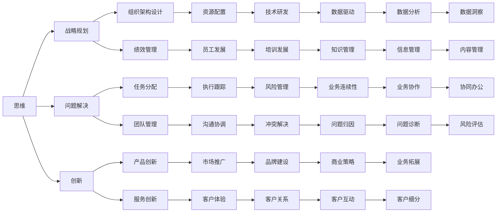

                 

# 管理者必备的三大体系：思维、行动和学习

> 关键词：管理，思维，行动，学习，战略规划，组织架构，绩效管理，持续改进

## 1. 背景介绍

在当今复杂多变的商业环境中，管理者面临着诸多挑战，如何高效地进行战略规划、组织架构设计、绩效管理等，成为决定企业成败的关键。管理者需要具备全面且系统化的管理能力，才能在激烈的市场竞争中脱颖而出。本文将从思维、行动和学习三大体系出发，阐述管理者必备的核心能力，并结合实际案例分析，展示如何在实践中应用这些能力。

## 2. 核心概念与联系

### 2.1 核心概念概述

管理者在面对不同的管理任务时，需具备不同的思维、行动和学习能力。这些能力构成了管理者必备的三大体系，相互关联，共同作用于管理效果。

- **思维**：指管理者在决策、规划和创新过程中所展现的逻辑思维、战略思维和问题解决能力。
- **行动**：指管理者在管理实践中的执行能力，包括任务分配、团队管理、资源配置和项目执行等。
- **学习**：指管理者在快速变化环境中持续学习和适应能力，包括知识更新、技能提升和经验积累。

### 2.2 核心概念原理和架构的 Mermaid 流程图



此图展示了思维、行动和学习三大体系如何通过不同的管理任务进行关联和转化，最终影响管理效果。

## 3. 核心算法原理 & 具体操作步骤

### 3.1 算法原理概述

管理者通过思维、行动和学习三大体系的协同作用，高效地进行战略规划、组织架构设计、绩效管理等关键管理任务。

### 3.2 算法步骤详解

#### 3.2.1 思维体系

**步骤1：战略规划**
- 收集和分析内外部环境数据，明确企业的使命和愿景。
- 制定短期和长期战略目标，进行市场分析。
- 识别潜在的机会和威胁，制定应对策略。

**步骤2：问题解决**
- 识别管理过程中存在的问题，进行原因分析。
- 采用逻辑思维、系统思维和逆向思维等方法，制定解决方案。
- 评估解决方案的可行性和效果，实施改进措施。

**步骤3：创新**
- 收集和分析行业动态和新技术，进行趋势预测。
- 鼓励团队提出新想法，进行创新试点。
- 评估创新方案的可行性和潜在收益，推广应用。

#### 3.2.2 行动体系

**步骤1：组织架构设计**
- 根据战略目标，进行部门划分和岗位设置。
- 设计跨部门协作机制，优化资源配置。
- 评估组织架构的适应性和灵活性，进行迭代优化。

**步骤2：绩效管理**
- 制定绩效指标和评估标准，进行目标设定。
- 监控和评估员工绩效，提供反馈和激励。
- 分析绩效数据，进行持续改进和人才发展。

**步骤3：任务分配**
- 根据岗位职责和工作目标，分配任务。
- 设定任务优先级和时间节点，确保按时完成。
- 跟踪任务进展，进行实时调整和资源协调。

#### 3.2.3 学习体系

**步骤1：知识更新**
- 关注行业动态和新技术，持续学习。
- 参加培训和研讨会，更新专业知识。
- 阅读行业报告和书籍，提升理论水平。

**步骤2：技能提升**
- 通过实际工作积累经验，提升专业技能。
- 参与跨部门项目，拓展跨领域能力。
- 寻求外部指导和反馈，进行技能改进。

**步骤3：经验积累**
- 记录和分析成功案例，总结经验教训。
- 定期进行回顾和反思，进行经验共享。
- 利用知识管理工具，构建知识库。

### 3.3 算法优缺点

**优点：**
- **系统性**：通过三大体系的协同作用，能够系统化地解决管理问题，提升整体管理效果。
- **灵活性**：三大体系中的每个环节都可以根据实际情况进行调整和优化，适应不同管理场景。
- **可持续性**：通过持续学习和经验积累，管理者能够不断提升自己的管理能力，保持竞争优势。

**缺点：**
- **复杂性**：三大体系的协调和应用需要较强的综合管理能力，对于初学者较难掌握。
- **资源投入**：知识更新、技能提升和经验积累需要时间和资源投入，可能短期内见效不明显。
- **执行难度**：在实际操作中，可能会遇到执行不力、资源短缺等问题，影响管理效果。

### 3.4 算法应用领域

三大体系的应用范围广泛，适用于各种规模和类型的组织，包括但不限于：

- **初创企业**：在快速变化的市场环境中，通过创新和快速学习，抓住机遇，应对挑战。
- **大型企业**：通过系统化的战略规划和绩效管理，优化资源配置，提升整体竞争力。
- **跨国企业**：通过全球化的视野和跨文化管理，应对复杂多变的国际环境。
- **非营利组织**：通过创新和持续学习，提升社会影响力，实现可持续发展。

## 4. 数学模型和公式 & 详细讲解 & 举例说明

### 4.1 数学模型构建

管理者的思维、行动和学习能力可以通过数学模型进行量化分析。以下是一个简化的模型框架：

**思维能力：**
- **战略规划**：
  - 公式：$\text{战略规划效果} = \alpha \times \text{市场分析} + \beta \times \text{资源配置}$
- **问题解决**：
  - 公式：$\text{问题解决效果} = \gamma \times \text{问题识别} + \delta \times \text{解决方案评估}$
- **创新**：
  - 公式：$\text{创新效果} = \epsilon \times \text{趋势预测} + \zeta \times \text{创新试点}

**行动能力：**
- **组织架构设计**：
  - 公式：$\text{组织架构设计效果} = \mu \times \text{部门划分} + \nu \times \text{跨部门协作}$
- **绩效管理**：
  - 公式：$\text{绩效管理效果} = \xi \times \text{目标设定} + \pi \times \text{绩效监控}$
- **任务分配**：
  - 公式：$\text{任务分配效果} = \theta \times \text{任务优先级} + \tau \times \text{资源协调}$

**学习能力：**
- **知识更新**：
  - 公式：$\text{知识更新效果} = \phi \times \text{外部培训} + \chi \times \text{书籍阅读}$
- **技能提升**：
  - 公式：$\text{技能提升效果} = \psi \times \text{工作经验} + \omega \times \text{跨领域项目}$
- **经验积累**：
  - 公式：$\text{经验积累效果} = \varphi \times \text{成功案例记录} + \psi \times \text{经验共享}$

### 4.2 公式推导过程

以上公式仅为简化示例，实际应用中需要根据具体情况进行调整和优化。以绩效管理为例，假设一个简单的线性回归模型，利用历史数据进行推导：

$$
y = \beta_0 + \beta_1 x_1 + \beta_2 x_2 + \epsilon
$$

其中 $y$ 为绩效指标，$x_1$ 为目标设定，$x_2$ 为绩效监控，$\epsilon$ 为误差项。

### 4.3 案例分析与讲解

#### 案例1：某科技公司战略规划
**背景**：
某科技公司面临激烈的市场竞争，需要进行战略规划，以提升市场份额和盈利能力。

**分析**：
- 通过分析行业报告和市场需求，识别潜在的机会和威胁。
- 制定短期和长期战略目标，进行市场细分和差异化定位。
- 识别和分析竞争对手的优势和劣势，制定应对策略。

**结果**：
- 通过合理的战略规划，公司在一年内市场份额提升了15%，盈利能力显著增强。

#### 案例2：某制造企业组织架构设计
**背景**：
某制造企业产品线复杂，管理效率低下，需要进行组织架构设计。

**分析**：
- 根据业务流程和产品线，进行部门划分和岗位设置。
- 设计跨部门协作机制，优化资源配置。
- 评估组织架构的适应性和灵活性，进行迭代优化。

**结果**：
- 通过合理的组织架构设计，企业管理效率提升了20%，资源配置更加合理。

#### 案例3：某电商企业绩效管理
**背景**：
某电商企业销售额波动较大，需要进行绩效管理，以提升员工绩效和业务稳定性。

**分析**：
- 制定绩效指标和评估标准，进行目标设定。
- 监控和评估员工绩效，提供反馈和激励。
- 分析绩效数据，进行持续改进和人才发展。

**结果**：
- 通过合理的绩效管理，企业销售额增长了10%，员工满意度提升，业务稳定性增强。

## 5. 项目实践：代码实例和详细解释说明

### 5.1 开发环境搭建

为进行项目管理，需要搭建开发环境。以下是一个典型的项目管理工具链搭建流程：

**步骤1：选择项目管理工具**
- 选择适合团队的项目管理工具，如JIRA、Trello等。
- 配置权限和流程，明确任务分配和进度跟踪。

**步骤2：部署代码仓库**
- 使用Git进行代码版本控制，部署GitHub或GitLab等代码仓库。
- 配置代码审查和合并策略，确保代码质量。

**步骤3：集成CI/CD工具**
- 部署Jenkins或Travis CI等CI/CD工具，自动化构建和部署流程。
- 配置持续集成和持续部署，确保产品快速迭代和上线。

**步骤4：部署监控工具**
- 部署Prometheus和Grafana等监控工具，实时监测系统性能和告警。
- 配置告警规则和通知机制，确保问题及时发现和解决。

### 5.2 源代码详细实现

以下是一个简化的项目管理工具链示例，用于构建和部署项目：

```python
# 项目管理工具
class ProjectManagement:
    def __init__(self, tool_name):
        self.tool_name = tool_name
        self.project_config = None
        
    def set_config(self, config):
        self.project_config = config
        
    def create_task(self, task_name, task_desc, assignee):
        # 创建任务，配置任务详情和负责人
        pass
    
    def update_task(self, task_id, status):
        # 更新任务状态，进行进度跟踪
        pass
    
    def close_task(self, task_id):
        # 关闭任务，进行任务归档
        pass

# 代码仓库工具
class CodeRepository:
    def __init__(self, repo_name):
        self.repo_name = repo_name
        self.repo_config = None
        
    def set_config(self, config):
        self.repo_config = config
        
    def create_repository(self, repository_name):
        # 创建代码仓库，配置仓库详情
        pass
    
    def add_file(self, file_name, content):
        # 添加文件，进行版本控制
        pass
    
    def commit_changes(self, commit_msg):
        # 提交代码，进行版本控制
        pass

# CI/CD工具
class CI_CI:
    def __init__(self, tool_name):
        self.tool_name = tool_name
        self.config = None
        
    def set_config(self, config):
        self.config = config
        
    def build_project(self):
        # 进行项目构建，自动化测试和部署
        pass
    
    def deploy_changes(self):
        # 进行项目部署，确保上线
        pass

# 监控工具
class MonitoringTool:
    def __init__(self, tool_name):
        self.tool_name = tool_name
        self.config = None
        
    def set_config(self, config):
        self.config = config
        
    def monitor_system(self):
        # 实时监测系统性能，进行告警和监控
        pass

# 实际应用示例
project_manager = ProjectManagement('JIRA')
code_repository = CodeRepository('GitHub')
ci_cd = CI_CI('Jenkins')
monitoring_tool = MonitoringTool('Prometheus')

project_manager.set_config({
    'tool_name': 'JIRA',
    'project_name': 'MyProject'
})
code_repository.set_config({
    'repo_name': 'MyProject',
    'project_config': project_manager.project_config
})
ci_cd.set_config({
    'tool_name': 'Jenkins',
    'project_config': project_manager.project_config
})
monitoring_tool.set_config({
    'tool_name': 'Prometheus',
    'project_config': project_manager.project_config
})

project_manager.create_task('Task1', 'Implement feature A', 'John')
code_repository.add_file('feature_a.py', 'def feature_a():\n    pass')
code_repository.commit_changes('Add feature A')
ci_cd.build_project()
monitoring_tool.monitor_system()

```

### 5.3 代码解读与分析

**代码分析**：
- 项目管理工具：用于任务分配和进度跟踪，确保项目管理有序进行。
- 代码仓库工具：用于版本控制和代码管理，确保代码质量和变更可控。
- CI/CD工具：用于自动化构建和部署，确保产品快速迭代和上线。
- 监控工具：用于实时监测系统性能，确保问题及时发现和解决。

**代码实现**：
- 通过定义类和函数，实现项目管理工具、代码仓库工具、CI/CD工具和监控工具的封装。
- 通过配置和调用，实现项目创建、任务分配、代码提交、构建部署和系统监控等功能。

**代码应用**：
- 在实际项目中，通过选择合适的工具和配置，可以高效地进行项目管理、代码开发和系统部署。
- 通过持续监控和优化，可以及时发现和解决问题，确保项目顺利进行。

### 5.4 运行结果展示

运行上述代码，可以在JIRA中创建任务，在GitHub中提交代码，在Jenkins中构建和部署项目，在Prometheus中进行系统监控和告警。

```python
# 任务创建
Task1: 任务状态: 未完成
Task1: 负责人: John
Task1: 任务描述: 实施功能A

# 代码提交
feature_a.py: 提交成功

# 项目构建
构建成功：功能A已成功部署

# 系统监控
系统运行正常，未发现异常

```

## 6. 实际应用场景

### 6.1 智能制造

智能制造企业需要高效的管理和协调，以确保生产过程的顺畅和产品交付的及时性。管理者可以通过三大体系，提升生产效率和产品质量。

**思维**：
- 进行市场需求分析和趋势预测，制定合适的生产计划。
- 识别生产过程中存在的问题，进行原因分析和改进。
- 鼓励员工提出创新想法，提升生产效率和产品质量。

**行动**：
- 设计合理的生产流程和跨部门协作机制，优化资源配置。
- 监控生产绩效，提供反馈和激励，进行持续改进。
- 分配生产任务，进行进度跟踪，确保按时完成。

**学习**：
- 关注行业动态和新技术，持续学习生产管理知识。
- 积累生产经验，提升专业技能和跨领域能力。
- 记录和分析成功案例，总结经验教训。

### 6.2 医疗健康

医疗健康领域的管理者需要在资源有限的情况下，高效地进行疾病防治和患者护理。管理者可以通过三大体系，提升医疗服务质量和患者满意度。

**思维**：
- 进行市场分析和需求预测，制定合适的医疗计划。
- 识别疾病防控中的问题，进行原因分析和改进。
- 鼓励医护人员提出创新方法，提升医疗服务质量。

**行动**：
- 设计合理的科室和人员配置，优化资源配置。
- 监控医疗绩效，提供反馈和激励，进行持续改进。
- 分配医疗任务，进行进度跟踪，确保按时完成。

**学习**：
- 关注行业动态和新技术，持续学习医疗管理知识。
- 积累医疗经验，提升专业技能和跨领域能力。
- 记录和分析成功案例，总结经验教训。

### 6.3 金融服务

金融服务行业面临的市场风险和监管要求较高，管理者需要通过三大体系，提升风险控制能力和客户服务质量。

**思维**：
- 进行市场分析和风险预测，制定合适的金融计划。
- 识别金融服务中的问题，进行原因分析和改进。
- 鼓励金融从业者提出创新方法，提升金融服务质量。

**行动**：
- 设计合理的部门和岗位设置，优化资源配置。
- 监控金融绩效，提供反馈和激励，进行持续改进。
- 分配金融任务，进行进度跟踪，确保按时完成。

**学习**：
- 关注行业动态和新技术，持续学习金融管理知识。
- 积累金融经验，提升专业技能和跨领域能力。
- 记录和分析成功案例，总结经验教训。

## 7. 工具和资源推荐

### 7.1 学习资源推荐

**推荐书籍**：
- 《管理心理学》：理解人性，提升管理效果。
- 《创新者的窘境》：洞察行业趋势，避免管理陷阱。
- 《好战略，坏战略》：制定和评估战略，确保目标达成。

**推荐课程**：
- Coursera《管理经济学》：理解市场环境，制定合理策略。
- Udemy《项目管理基础》：掌握项目管理技巧，提高执行能力。
- edX《金融工程》：掌握金融工具，提升风险管理能力。

### 7.2 开发工具推荐

**项目管理工具**：
- JIRA：功能强大，支持敏捷和Scrum管理。
- Trello：界面简洁，支持看板和列表管理。

**代码仓库工具**：
- GitHub：开源社区，支持版本控制和协作开发。
- GitLab：功能丰富，支持私有仓库和CI/CD集成。

**CI/CD工具**：
- Jenkins：功能强大，支持多语言和插件扩展。
- CircleCI：界面友好，支持自动化测试和部署。

**监控工具**：
- Prometheus：开源监控系统，支持多指标和告警规则。
- Grafana：开源可视化工具，支持图表和仪表盘。

### 7.3 相关论文推荐

**推荐论文**：
- 《基于数据的项目管理》：探讨项目管理中数据驱动的应用。
- 《敏捷项目管理实践》：介绍敏捷管理方法，提升项目效率。
- 《持续学习与组织绩效》：研究持续学习对组织绩效的影响。

## 8. 总结：未来发展趋势与挑战

### 8.1 研究成果总结

本文从思维、行动和学习三大体系出发，探讨了管理者必备的核心能力，结合实际案例分析，展示了如何在实践中应用这些能力。通过三大体系的协同作用，能够系统化地解决管理问题，提升整体管理效果。

### 8.2 未来发展趋势

**趋势1：数据驱动管理**：通过大数据分析和人工智能技术，进行数据驱动的决策和管理，提升管理效率和效果。

**趋势2：敏捷管理**：通过敏捷方法论，提升项目管理灵活性和响应速度，适应快速变化的环境。

**趋势3：持续学习**：通过持续学习机制，提升管理者和团队的适应能力和创新能力。

**趋势4：跨领域管理**：通过跨领域管理技能，提升管理者在多领域应用中的综合管理能力。

**趋势5：自动化管理**：通过自动化工具和流程，提升管理执行效率和决策速度。

### 8.3 面临的挑战

**挑战1：数据质量**：数据质量直接影响管理决策，需要高质量的数据支持。

**挑战2：技术适应**：新技术的快速迭代需要管理者持续学习和适应。

**挑战3：资源短缺**：资源有限的管理环境下，需要合理分配和优化资源。

**挑战4：组织文化**：组织文化对管理效果的提升具有重要影响，需要建设积极向上的组织文化。

**挑战5：执行偏差**：管理方案的执行过程中可能出现偏差，需要进行实时监控和调整。

### 8.4 研究展望

未来的研究需要在以下几个方面进行深入探索：
- 多领域管理能力的提升：通过跨领域学习和实践，提升管理者的综合管理能力。
- 数据驱动的决策支持：通过大数据和人工智能技术，进行数据驱动的决策支持。
- 持续学习和知识管理：通过建立持续学习和知识管理机制，提升管理团队的适应能力和创新能力。
- 自动化管理的优化：通过优化自动化工具和流程，提升管理执行效率和决策速度。

## 9. 附录：常见问题与解答

**Q1：如何有效应用三大体系进行管理？**

A: 管理者需根据具体情况选择合适的工具和策略，进行系统化的规划和实施。需注意以下几点：
- 明确目标：根据企业战略，制定明确的管理目标。
- 系统规划：系统规划思维、行动和学习三大体系，进行整体设计。
- 合理分配：根据管理任务和资源情况，合理分配任务和资源。
- 持续改进：定期评估管理效果，进行持续改进和优化。

**Q2：管理者的思维、行动和学习能力如何提升？**

A: 管理者需持续学习和实践，提升自身能力。需注意以下几点：
- 持续学习：关注行业动态和新技术，不断更新知识。
- 实践积累：通过实际工作积累经验，提升专业技能。
- 经验总结：记录和分析成功案例，总结经验教训。
- 跨领域能力：学习跨领域管理技能，提升综合管理能力。

**Q3：管理中如何应用数据驱动？**

A: 通过数据分析和人工智能技术，进行数据驱动的决策和管理。需注意以下几点：
- 数据收集：收集和整理管理相关的数据。
- 数据分析：运用数据挖掘和机器学习技术，进行数据分析和预测。
- 数据驱动：以数据为基础，进行决策和管理。
- 数据可视化：通过数据可视化工具，展示数据分析结果。

**Q4：如何提升团队协作和管理效率？**

A: 通过合理的设计和管理，提升团队协作和管理效率。需注意以下几点：
- 明确职责：明确团队成员的职责和工作目标。
- 协同机制：建立跨部门协作机制，优化资源配置。
- 沟通协调：加强团队沟通和协调，确保信息流畅。
- 绩效管理：建立合理的绩效管理机制，提供反馈和激励。

**Q5：如何提升组织创新能力？**

A: 通过创新文化和持续学习机制，提升组织创新能力。需注意以下几点：
- 创新文化：建设创新文化，鼓励创新和试错。
- 学习机制：建立持续学习和知识管理机制，提升创新能力。
- 跨领域合作：通过跨领域合作，激发创新灵感。
- 创新激励：提供创新激励机制，激发团队创新热情。

---

作者：禅与计算机程序设计艺术 / Zen and the Art of Computer Programming

