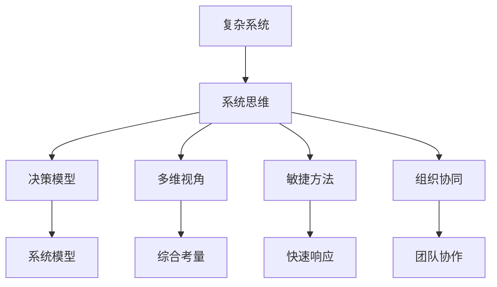

                 

# 系统思维:管理者驾驭复杂局面的能力

> 关键词：系统思维,复杂系统,管理者能力,复杂局面,决策模型,综合考量,迭代优化,多维视角,敏捷方法,组织协同

## 1. 背景介绍

在当今快速变化的商业环境中，管理者的决策能力面临前所未有的挑战。从技术创新到市场竞争，从员工激励到企业文化，每一项决策都关乎企业的发展方向和未来命运。而复杂性则是在各种管理任务中难以回避的核心问题，从供应链管理到研发项目，从市场分析到人力资源，管理者都必须面对由众多子系统和不确定性构成的复杂局面。

系统思维（Systems Thinking）是一种将系统视为一个整体来理解、分析、设计和干预的系统性方法。系统思维认为，系统各组成部分之间的相互作用是理解复杂现象的关键。管理者通过系统思维，可以更加全面、深入地理解系统行为，做出更为科学、合理的决策。本文将详细介绍系统思维在管理决策中的应用，帮助管理者驾驭复杂局面，提升领导力和决策水平。

## 2. 核心概念与联系

### 2.1 核心概念概述

为了更好地理解系统思维在管理决策中的应用，本节将介绍几个关键概念：

- **复杂系统（Complex Systems）**：由众多子系统相互影响、相互依赖构成的系统。复杂系统的行为往往具有非线性、自组织和动态变化的特点。
- **系统思维（Systems Thinking）**：将系统视为一个整体，考虑系统内部各组成部分之间的关系和相互作用，以及系统与环境之间的互动，以系统性视角来理解和管理复杂问题。
- **决策模型（Decision Modeling）**：通过建立系统模型，运用数学、统计等方法来分析和预测系统行为，辅助决策过程。
- **多维视角（Multi-dimensional Perspective）**：从时间、空间、功能、结构等多个维度综合考量系统行为，全面理解系统特征。
- **敏捷方法（Agile Methodology）**：强调快速响应变化、灵活应对挑战、持续改进的系统管理方法。
- **组织协同（Organizational Synergy）**：通过建立有效的沟通机制和团队协作，最大化系统整体的性能和效率。

这些概念之间的逻辑关系可以通过以下Mermaid流程图来展示：



这个流程图展示了复杂系统与系统思维之间的联系，以及系统思维如何通过决策模型、多维视角、敏捷方法、组织协同等手段来辅助管理者应对复杂局面。

## 3. 核心算法原理 & 具体操作步骤

### 3.1 算法原理概述

系统思维在管理决策中的应用主要体现在以下几个方面：

- **系统建模**：通过构建系统模型来理解和预测系统行为，帮助管理者更好地分析问题、制定决策。
- **系统诊断**：识别系统中的关键因素和影响因素，理解系统行为的成因和变化趋势。
- **系统干预**：通过干预措施来影响系统行为，达成管理目标。
- **系统优化**：通过迭代优化方法来提升系统性能和效率，最大化系统价值。

系统思维的原理包括：

- **整体性**：系统思维强调系统各部分相互关联，整体大于部分之和。
- **因果关系**：深入理解系统内部的因果关系，以及系统与环境之间的互动。
- **动态变化**：系统行为受多种因素影响，具有非线性、自组织和动态变化的特点。
- **反馈机制**：系统内部存在多种反馈机制，如正反馈、负反馈等，影响系统行为。

### 3.2 算法步骤详解

系统思维在管理决策中的应用步骤通常包括以下几个关键步骤：

**Step 1: 系统建模**

- **数据收集**：收集系统相关数据，包括系统结构、参数、环境变量等。
- **系统描述**：用语言或数学模型描述系统行为，如状态方程、微分方程、离散事件模型等。
- **模型验证**：验证模型的准确性和合理性，确保模型能够真实反映系统行为。

**Step 2: 系统诊断**

- **关键因素识别**：通过分析系统行为，识别出对系统有重大影响的关键因素。
- **影响因素分析**：分析关键因素对系统行为的影响，理解系统的内部和外部约束条件。
- **因果关系识别**：识别系统内部的因果关系，理解系统行为的成因和变化趋势。

**Step 3: 系统干预**

- **干预措施设计**：根据系统诊断结果，设计合理的干预措施，如政策调整、资源配置、组织优化等。
- **干预措施实施**：实施干预措施，并监控系统反应，确保干预措施有效。
- **干预效果评估**：评估干预措施的效果，确定干预措施的改进方向。

**Step 4: 系统优化**

- **优化目标设定**：明确系统优化的目标，如成本最小化、性能最大化、风险最小化等。
- **优化方法选择**：选择合适的优化方法，如线性规划、非线性规划、动态规划等。
- **优化模型求解**：求解优化模型，得到最优解。
- **优化效果验证**：验证优化效果，确保系统性能得到提升。

### 3.3 算法优缺点

系统思维在管理决策中的应用具有以下优点：

- **全面性**：系统思维能够全面考虑系统各部分之间的关系，避免片面思考。
- **科学性**：系统思维基于数据和模型，能够提供科学、客观的决策依据。
- **动态性**：系统思维能够动态地分析系统行为，及时调整决策策略。
- **可操作性**：系统思维提供的方法和工具易于操作，易于在实际管理中应用。

同时，系统思维也存在一些局限性：

- **复杂性**：系统模型和分析过程较为复杂，需要较高的数学和统计知识。
- **不确定性**：系统行为受多种不确定因素影响，模型预测可能存在误差。
- **成本高**：系统建模和优化过程需要较高的成本和时间投入，可能不适用于所有管理情境。

尽管存在这些局限性，但就目前而言，系统思维是处理复杂管理问题的重要方法之一。管理者在面对复杂局面时，应综合考虑系统思维和其他管理方法，以提升决策水平。

### 3.4 算法应用领域

系统思维在管理决策中的应用广泛，主要包括以下几个领域：

- **供应链管理**：通过系统思维分析供应链中的各个环节，优化库存管理、物流配送等，提升供应链效率。
- **项目管理和决策**：系统思维可以帮助项目经理识别项目中的关键因素和风险点，制定科学的决策方案。
- **人力资源管理**：系统思维用于理解员工行为和组织文化，提升员工满意度和组织绩效。
- **财务管理**：系统思维用于优化财务资源配置，提升企业财务表现。
- **市场营销**：系统思维用于分析市场环境、消费者行为，制定市场策略。

这些领域中，系统思维的应用不仅能够帮助管理者更好地理解系统行为，还能够提高决策的科学性和有效性。

## 4. 数学模型和公式 & 详细讲解 & 举例说明

### 4.1 数学模型构建

为了更好地理解系统思维在管理决策中的应用，本节将介绍几个关键的数学模型。

- **线性系统模型**：描述线性系统的状态方程，如：
$$
\dot{x} = Ax + Bu
$$
其中，$x$ 为状态向量，$u$ 为输入向量，$A$ 和 $B$ 为系统参数。
- **非线性系统模型**：描述非线性系统的状态方程，如：
$$
\dot{x} = f(x)
$$
其中，$f(x)$ 为非线性函数。
- **离散事件系统模型**：描述离散事件的动态过程，如：
$$
x_{n+1} = f(x_n, u_n)
$$
其中，$x_n$ 为状态向量，$u_n$ 为输入向量，$f(x_n, u_n)$ 为状态更新函数。

### 4.2 公式推导过程

以线性系统模型为例，推导其动态行为：

1. **状态方程**：
$$
\dot{x} = Ax + Bu
$$
2. **特征方程**：求解特征值和特征向量，确定系统稳定性和响应特性。
3. **传递函数**：由状态方程导出传递函数，用于分析系统频率响应特性。
4. **控制器设计**：设计反馈控制器，调整系统行为，达到指定目标。

以离散事件系统模型为例，推导其动态行为：

1. **状态更新函数**：
$$
x_{n+1} = f(x_n, u_n)
$$
2. **转移概率矩阵**：求解转移概率矩阵，确定系统状态转移特性。
3. **稳定状态**：求解稳定状态，确定系统行为特性。
4. **性能指标**：定义性能指标，如稳定时间、响应时间、抖动等，评估系统性能。

### 4.3 案例分析与讲解

以供应链管理为例，系统思维的应用过程如下：

1. **系统建模**：建立供应链系统的数学模型，包括库存、需求、物流等子系统。
2. **系统诊断**：通过数据分析和仿真，识别供应链中的关键因素和影响因素，如库存水平、物流成本、需求波动等。
3. **系统干预**：设计优化措施，如优化库存策略、改进物流路径、调整需求预测等。
4. **系统优化**：通过优化模型求解，得到最优库存水平、物流路径等决策。
5. **效果评估**：评估优化效果，如库存成本、物流效率、客户满意度等。

通过系统思维的方法，供应链管理能够全面考虑系统各部分之间的关系，提升供应链效率和响应能力，实现成本和绩效的最优化。

## 5. 项目实践：代码实例和详细解释说明

### 5.1 开发环境搭建

在进行系统思维的实践前，我们需要准备好开发环境。以下是使用Python进行系统建模和优化实践的环境配置流程：

1. 安装Anaconda：从官网下载并安装Anaconda，用于创建独立的Python环境。

2. 创建并激活虚拟环境：
```bash
conda create -n system-environment python=3.8 
conda activate system-environment
```

3. 安装必要的Python库：
```bash
pip install numpy scipy sympy scipy-lecture matplotlib
```

4. 安装Jupyter Notebook：
```bash
pip install jupyter
```

完成上述步骤后，即可在`system-environment`环境中开始系统思维的实践。

### 5.2 源代码详细实现

下面以供应链管理系统为例，给出使用Python进行系统建模和优化的代码实现。

首先，定义系统状态方程和初始条件：

```python
import numpy as np
from sympy import symbols, Eq, solve

# 定义符号变量
x, u, t = symbols('x u t')

# 定义状态方程
A = np.array([[0.1, 0.2],
              [0.3, 0.1]])
B = np.array([0.5, 0.2])
x0 = np.array([1000, 0])

# 求解状态方程的解析解
x = solve(Eq(x, A*x + B*u), x)[0]
```

然后，定义优化目标和优化方法：

```python
from scipy.optimize import minimize

# 定义优化目标函数
def objective(x, u):
    return (x[0] - 1000)**2 + (x[1] - 100)**2

# 定义优化约束条件
constraints = ({'type': 'ineq', 'fun': lambda x: -x[0] - x[1] - 500},
               {'type': 'eq', 'fun': lambda x: x[0] - x[1]})

# 定义优化方法
result = minimize(objective, x0, args=(u,), bounds=[(0, 10000), (0, 2000)], method='SLSQP', constraints=constraints)
```

最后，输出优化结果和分析：

```python
# 输出优化结果
print(result.x)
print(result.fun)

# 分析优化结果
print('Optimal u:', result.x[1])
```

以上就是使用Python对供应链管理系统进行建模和优化的完整代码实现。可以看到，利用Sympy和Scipy库，我们能够很方便地建立数学模型，并使用优化算法求解最优解。

### 5.3 代码解读与分析

让我们再详细解读一下关键代码的实现细节：

**状态方程定义**：
- `A`：系统参数矩阵
- `B`：输入参数矩阵
- `x0`：初始状态向量

**优化目标函数定义**：
- `objective`函数：定义优化目标，以状态偏差平方和作为优化目标。

**优化约束条件定义**：
- `constraints`列表：定义优化约束，包括不等式约束和等式约束。

**优化方法选择**：
- `minimize`函数：使用SLSQP方法进行优化，求取目标函数的最小值。

**优化结果输出**：
- `result.x`：输出优化后的状态向量
- `result.fun`：输出优化后的目标函数值
- `result.x[1]`：输出优化后的输入参数值

可以看到，通过Python代码实现系统建模和优化过程，能够快速、准确地求解优化问题。开发者可以根据具体应用场景，选择合适的数学模型和优化方法，进行系统设计和优化。

## 6. 实际应用场景

### 6.1 供应链管理

在供应链管理中，系统思维能够帮助企业全面理解供应链行为，优化库存管理、物流配送等，提升供应链效率。具体应用包括：

- **库存优化**：通过系统思维分析库存水平、需求波动等关键因素，优化库存策略，减少库存成本，提高供应链响应速度。
- **物流路径优化**：通过系统思维优化物流路径，减少物流成本，提高物流效率。
- **需求预测**：通过系统思维分析市场数据，预测需求变化，优化需求计划，提升客户满意度。

### 6.2 项目管理和决策

在项目管理和决策中，系统思维能够帮助项目经理识别项目中的关键因素和风险点，制定科学的决策方案。具体应用包括：

- **项目进度管理**：通过系统思维分析项目进度、资源配置等关键因素，优化项目进度，确保项目按时完成。
- **风险管理**：通过系统思维识别项目风险，制定风险应对策略，减少项目不确定性。
- **成本控制**：通过系统思维分析成本因素，优化资源配置，控制项目成本。

### 6.3 人力资源管理

在系统思维应用于人力资源管理时，能够帮助企业全面理解员工行为和组织文化，提升员工满意度和组织绩效。具体应用包括：

- **员工满意度分析**：通过系统思维分析员工满意度因素，制定提升员工满意度的策略。
- **组织结构优化**：通过系统思维分析组织结构、团队协作等关键因素，优化组织结构，提升组织绩效。
- **员工绩效评估**：通过系统思维分析员工绩效因素，制定绩效评估标准，提升员工绩效。

### 6.4 财务管理

在系统思维应用于财务管理时，能够帮助企业优化财务资源配置，提升企业财务表现。具体应用包括：

- **财务预测**：通过系统思维分析财务数据，预测财务表现，制定财务策略。
- **资金管理**：通过系统思维优化资金配置，提升资金使用效率。
- **风险管理**：通过系统思维分析财务风险，制定风险应对策略，减少财务风险。

### 6.5 市场营销

在系统思维应用于市场营销时，能够帮助企业分析市场环境、消费者行为，制定市场策略。具体应用包括：

- **市场细分**：通过系统思维分析市场细分因素，制定市场细分策略，提升市场份额。
- **消费者行为分析**：通过系统思维分析消费者行为，制定消费者策略，提升消费者忠诚度。
- **市场预测**：通过系统思维分析市场数据，预测市场趋势，制定市场策略。

## 7. 工具和资源推荐

### 7.1 学习资源推荐

为了帮助开发者系统掌握系统思维的理论基础和实践技巧，这里推荐一些优质的学习资源：

1. 《系统思维与复杂系统》书籍：全面介绍了系统思维的基本概念和应用方法，适合系统思维的入门学习。
2. 《复杂系统建模与分析》课程：通过案例分析，介绍了复杂系统建模的方法和工具，适合系统思维的实践应用。
3. 《系统动力学》书籍：系统动力学是一门研究系统行为的科学，通过反馈机制分析系统行为，适合系统思维的深入学习。
4. 系统思维在线课程：包括Coursera、edX等平台上的系统思维课程，涵盖系统思维的基本概念和应用方法，适合系统思维的学习和实践。
5. 系统思维案例库：收集了大量系统思维应用的案例，适合系统思维的实践参考和灵感启发。

通过对这些资源的学习实践，相信你一定能够快速掌握系统思维的精髓，并用于解决实际的系统问题。

### 7.2 开发工具推荐

高效的开发离不开优秀的工具支持。以下是几款用于系统思维开发的常用工具：

1. Python：作为系统思维建模和优化的主流语言，Python具有丰富的数学和统计库，如NumPy、SciPy、SymPy等。
2. Jupyter Notebook：支持Python代码的交互式运行，便于系统思维的实践和验证。
3. MATLAB：具有强大的数值计算和优化工具，适合复杂系统建模和仿真。
4. Simulink：MATLAB的图形化仿真工具，支持复杂系统的动态仿真和分析。
5. Excel：适合简单的系统建模和仿真，易于学习和上手。

合理利用这些工具，可以显著提升系统思维的开发效率，加快创新迭代的步伐。

### 7.3 相关论文推荐

系统思维和复杂系统是近年来研究的热点领域，以下是几篇奠基性的相关论文，推荐阅读：

1. "System Thinking: Concepts, Methods, and Applications" 论文：全面介绍了系统思维的基本概念和应用方法，适合系统思维的入门学习。
2. "Complexity and Systems Thinking" 论文：探讨了复杂系统与系统思维的关系，适合系统思维的深入研究。
3. "System Dynamics: Modeling for Organizational Change" 论文：介绍了系统动力学的方法和工具，适合系统思维的实践应用。
4. "A Systematic Review of System Thinking" 论文：对系统思维的研究进展进行了系统综述，适合系统思维的研究参考。
5. "Complex Adaptive Systems: An Introduction to Computational Models of Social Life" 论文：探讨了复杂适应系统与系统思维的关系，适合系统思维的深入学习。

这些论文代表了大系统思维和复杂系统的最新进展，通过学习这些前沿成果，可以帮助研究者把握学科前进方向，激发更多的创新灵感。

## 8. 总结：未来发展趋势与挑战

### 8.1 总结

本文对系统思维在管理决策中的应用进行了全面系统的介绍。首先阐述了系统思维的基本概念和应用场景，明确了系统思维在处理复杂管理问题中的独特价值。其次，从原理到实践，详细讲解了系统思维的数学模型和优化方法，给出了系统思维任务开发的完整代码实例。同时，本文还广泛探讨了系统思维在供应链管理、项目管理、人力资源管理、财务管理、市场营销等多个行业领域的应用前景，展示了系统思维范式的广阔前景。最后，本文精选了系统思维的相关学习资源，力求为读者提供全方位的技术指引。

通过本文的系统梳理，可以看到，系统思维在处理复杂管理问题中发挥着重要作用，有助于管理者全面理解系统行为，做出更为科学、合理的决策。未来，伴随系统思维和其他管理方法的不断演进，系统思维将在更多领域得到广泛应用，为管理决策带来新的思路和方法。

### 8.2 未来发展趋势

展望未来，系统思维将呈现以下几个发展趋势：

1. **多学科融合**：系统思维将与大数据、人工智能、物联网等新兴技术深度融合，提升系统分析能力和决策支持水平。
2. **智能决策支持**：系统思维将与智能决策系统结合，通过数据驱动和智能算法，提供更科学、精准的决策支持。
3. **可持续管理**：系统思维将应用于可持续发展管理，通过系统分析和优化，实现资源的最优配置和环境友好型管理。
4. **网络化协作**：系统思维将推动企业网络化协作，通过多企业系统集成，实现资源共享和协同效应。
5. **社会化系统**：系统思维将应用于社会化系统管理，通过社会网络分析和系统建模，优化社会行为和系统管理。

以上趋势凸显了系统思维的广泛应用前景，未来系统思维将为管理决策提供更科学、高效、可持续的支持。

### 8.3 面临的挑战

尽管系统思维在管理决策中的应用已经取得了显著进展，但在迈向更加智能化、普适化应用的过程中，仍面临诸多挑战：

1. **数据质量问题**：系统思维需要大量高质量的数据支持，但数据获取和清洗成本较高。如何确保数据质量，提升数据可用性，是系统思维应用的重要挑战。
2. **模型复杂性**：系统思维模型较为复杂，需要较高的数学和统计知识，对模型设计和优化提出了较高要求。如何简化模型，提高模型可操作性，是系统思维应用的重要挑战。
3. **组织协同问题**：系统思维需要跨部门、跨组织的协同工作，如何建立有效的协作机制，是系统思维应用的重要挑战。
4. **决策可解释性**：系统思维模型具有高度复杂性，决策结果难以解释。如何提高决策的可解释性，是系统思维应用的重要挑战。
5. **资源投入问题**：系统思维应用需要较高的资源投入，包括数据、人力、时间等。如何优化资源配置，提高资源利用效率，是系统思维应用的重要挑战。

尽管存在这些挑战，但未来系统思维仍具有广阔的应用前景，相信随着技术的发展和管理水平的提升，这些挑战将逐步被克服，系统思维将为管理决策提供更科学、高效、可持续的支持。

### 8.4 研究展望

未来的系统思维研究需要在以下几个方面寻求新的突破：

1. **多学科方法**：结合大数据、人工智能、物联网等新兴技术，探索多学科系统思维方法，提升系统分析能力和决策支持水平。
2. **智能系统集成**：研究智能系统集成方法，实现系统间的无缝协作和数据共享，提升系统整体性能。
3. **持续优化**：探索持续优化方法，实现系统的动态调整和优化，提高系统适应性和响应速度。
4. **社会化网络**：研究社会化网络分析方法，优化社会行为和系统管理，提升社会整体效益。
5. **伦理和安全**：研究系统思维的伦理和安全问题，确保系统行为的透明性和安全性。

这些研究方向将为系统思维的广泛应用提供新的思路和方法，推动系统思维向更广泛、更深入的领域发展。总之，系统思维作为处理复杂管理问题的重要方法，其应用前景广阔，未来将发挥更大的作用。

## 9. 附录：常见问题与解答

**Q1: 系统思维和复杂系统有什么区别？**

A: 系统思维是一种系统性思考方式，强调系统各部分之间的相互作用和整体性。而复杂系统则是系统思维研究的对象，指的是由众多子系统相互影响、相互依赖构成的系统。复杂系统的行为具有非线性、自组织和动态变化的特点，系统思维用于理解、分析和优化复杂系统行为。

**Q2: 如何选择合适的系统模型？**

A: 选择合适的系统模型需要综合考虑系统的复杂性、数据质量、目标需求等因素。一般来说，对于简单的线性系统，可以使用线性系统模型；对于较为复杂的非线性系统，可以使用非线性系统模型；对于离散事件系统，可以使用离散事件系统模型。同时，还需要根据系统的实际需求和目标，选择合适的模型参数和优化方法。

**Q3: 系统思维和项目管理有什么区别？**

A: 系统思维和项目管理都是管理决策中的重要方法，但应用场景不同。系统思维用于全面理解系统行为，优化系统性能；项目管理则更关注项目进度、资源配置、风险管理等具体问题，制定科学的项目计划和决策方案。虽然两者有交叉，但系统思维更加注重系统行为的整体性和动态变化，而项目管理则注重具体问题的解决。

**Q4: 系统思维如何应用于人力资源管理？**

A: 系统思维在人力资源管理中的应用包括员工满意度分析、组织结构优化、员工绩效评估等。通过系统思维分析员工行为和组织文化，制定提升员工满意度和组织绩效的策略。同时，系统思维还用于优化人力资源配置，提升组织整体效益。

**Q5: 系统思维在供应链管理中的应用有哪些？**

A: 系统思维在供应链管理中的应用包括库存优化、物流路径优化、需求预测等。通过系统思维分析供应链中的关键因素和影响因素，制定科学的供应链策略，提升供应链效率和响应能力，实现成本和绩效的最优化。

这些常见问题与解答，展示了系统思维在管理决策中的应用细节和实践经验，帮助读者更好地理解系统思维的原理和应用方法。

