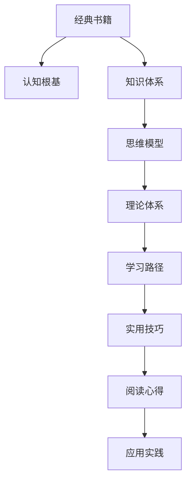

                 

# 经典书籍:夯实认知根基的宝藏

> 关键词：经典书籍, 认知根基, 知识体系, 思维模型, 理论体系, 学习路径, 实用技巧, 阅读心得

## 1. 背景介绍

在信息爆炸的时代，我们每个人每天都可能接触到大量新知识，但真正能够理解、掌握并内化为自己的认知体系的内容并不多。这主要是因为，知识的海洋浩瀚无际，而人的认知能力有限。为了在有限的时间内获取尽可能多的价值，我们需要有选择性地阅读经典书籍，并从中学习到夯实认知根基的宝藏。

### 1.1 问题由来

随着科技的发展，书籍的种类和数量也在不断增加，但并不是所有的书籍都能够成为夯实认知根基的宝藏。很多书籍虽然内容丰富，但由于结构不合理，内容缺乏连贯性，难以让人真正理解和掌握其中的知识。因此，如何挑选经典书籍，并从中获取有价值的认知资源，成为了一个重要的课题。

### 1.2 问题核心关键点

要挑选经典书籍并从中获取认知资源，需要掌握以下几个关键点：

1. **书籍的选择**：选择那些在学术界和工业界有广泛认可的经典书籍，这些书籍往往经过时间的检验，其内容的准确性和深度有保障。
2. **阅读方法**：掌握高效的阅读方法，如主动阅读、精读、泛读等，能够帮助读者更好地理解和掌握书籍内容。
3. **知识整合**：通过构建自己的知识体系，将书籍中的知识点整合起来，形成连贯的知识网络。
4. **应用实践**：将书籍中的知识应用于实际工作中，通过实践检验和巩固所学知识。

本文将从这三个方面，探讨如何挑选经典书籍，并从中获取有价值的认知资源，帮助读者夯实认知根基。

## 2. 核心概念与联系

### 2.1 核心概念概述

为了更好地理解挑选经典书籍和获取认知资源的方法，我们首先需要了解几个核心概念：

1. **经典书籍**：指在学术界和工业界有广泛认可，内容深刻、系统、有价值的书籍。
2. **认知根基**：指一个人的基础知识和基本概念，是理解和掌握其他知识的前提。
3. **知识体系**：指将知识按照逻辑关系组织起来，形成连贯、系统的结构。
4. **思维模型**：指解决特定问题的方法和框架，帮助人们快速、高效地处理复杂问题。
5. **理论体系**：指基于一组假设和推理方法，构建起来的一组理论，帮助人们理解和解释世界。
6. **学习路径**：指从初学者到专家，逐步学习并掌握知识的过程。
7. **实用技巧**：指在实际应用中，提高学习效率和效果的方法。
8. **阅读心得**：指从阅读书籍中获得的心得体会，有助于加深对知识的理解和应用。

这些核心概念之间的联系可以通过以下Mermaid流程图来展示：



这个流程图展示了几者之间的联系：经典书籍为认知根基夯实提供了基础，通过知识体系构建思维模型，借助思维模型构建理论体系，沿着学习路径逐步深入，通过实用技巧提高学习效率，通过阅读心得加深理解，最终应用于实践。

## 3. 核心算法原理 & 具体操作步骤

### 3.1 算法原理概述

挑选经典书籍并从中获取认知资源，本质上是建立一个高效的知识整合和应用体系。这个体系通过一系列算法和操作，将书籍中的知识点整合起来，形成连贯的知识网络，并通过应用实践，巩固所学知识。

形式化地，假设我们有一本书籍 $B$，其中包含 $N$ 个知识点 $K_1, K_2, ..., K_N$。我们的目标是构建一个知识体系 $S$，使得 $S$ 中的每个知识点 $K$ 都由书中的 $K_i$ 所组成，并通过应用实践 $P$ 不断巩固。

### 3.2 算法步骤详解

挑选经典书籍并从中获取认知资源，一般包括以下几个关键步骤：

**Step 1: 选择经典书籍**

1. **确定阅读领域**：根据自己的兴趣和职业需求，确定需要阅读的领域。如计算机科学、物理学、心理学等。
2. **筛选经典书籍**：在选定的领域内，选择那些在学术界和工业界有广泛认可的经典书籍。可以通过阅读书评、论文、课程等资源，了解书籍的评价和内容。
3. **评估书籍价值**：对筛选出的书籍进行价值评估，主要看其内容是否深刻、系统、有价值。可以从书籍的出版时间、作者背景、出版社等方面进行评估。

**Step 2: 构建知识体系**

1. **阅读书籍**：按照主动阅读、精读、泛读等方法，逐步理解书籍内容。
2. **知识分类**：将书籍中的知识点按照逻辑关系进行分类，形成知识体系。
3. **构建网络**：将分类后的知识点通过逻辑关系连接起来，形成知识网络。可以使用思维导图工具，如Xmind、MindMeister等，帮助构建知识网络。

**Step 3: 应用实践**

1. **解决问题**：将书籍中的知识点应用于实际问题解决，通过实践验证和巩固所学知识。
2. **迭代优化**：在应用实践中，不断迭代和优化知识体系，使其更加符合实际需求。

### 3.3 算法优缺点

挑选经典书籍并从中获取认知资源的方法，具有以下优点：

1. **高效**：经典书籍经过时间的检验，其内容准确性有保障，阅读效率高。
2. **系统**：通过构建知识体系和思维模型，能够系统地理解和掌握知识。
3. **深度**：经典书籍往往涵盖广泛的知识点，能够帮助读者构建深度认知根基。

同时，该方法也存在一定的局限性：

1. **时间成本**：挑选和阅读经典书籍需要投入大量时间，可能不适合时间紧张的读者。
2. **复杂度**：构建知识体系和思维模型需要一定的逻辑推理能力，对读者要求较高。
3. **更新慢**：经典书籍的内容往往比较陈旧，难以跟上最新的技术发展。

尽管存在这些局限性，但就目前而言，挑选经典书籍并从中获取认知资源的方法仍然是获取知识、夯实认知根基的最佳途径之一。未来相关研究的重点在于如何进一步降低时间成本，提高知识体系的构建效率，同时兼顾知识体系的深度和广度。

### 3.4 算法应用领域

挑选经典书籍并从中获取认知资源的方法，在各个领域都有广泛的应用，例如：

- 计算机科学：阅读《深入理解计算机系统》、《算法导论》、《计算机网络》等经典书籍，可以夯实计算机科学的知识根基。
- 物理学：阅读《费曼物理学讲义》、《现代物理学基础》、《相对论》等经典书籍，可以构建物理学的知识体系。
- 心理学：阅读《心理学与生活》、《社会心理学》、《认知心理学》等经典书籍，可以掌握心理学的基本概念和理论。
- 经济学：阅读《经济学原理》、《货币银行学》、《微观经济学》等经典书籍，可以构建经济学的知识体系。

除了这些经典学科外，挑选经典书籍并从中获取认知资源的方法，还可以应用于更多领域，如医学、法律、艺术等，帮助读者构建多学科的知识体系。

## 4. 数学模型和公式 & 详细讲解  
### 4.1 数学模型构建

本节将使用数学语言对挑选经典书籍并从中获取认知资源的方法进行更加严格的刻画。

假设我们有一本书籍 $B$，其中包含 $N$ 个知识点 $K_1, K_2, ..., K_N$。我们的目标是构建一个知识体系 $S$，使得 $S$ 中的每个知识点 $K$ 都由书中的 $K_i$ 所组成，并通过应用实践 $P$ 不断巩固。

定义知识体系 $S$ 为：

$$
S = \{K_1, K_2, ..., K_N\}
$$

其中每个知识点 $K_i$ 都由书中的某个知识点 $K_{ij}$ 组成，即：

$$
K_i = \{K_{ij}\} \subset B
$$

定义应用实践 $P$ 为：

$$
P = \{p_1, p_2, ..., p_M\}
$$

其中每个实践 $p_m$ 都由书中的某个知识点 $K_{im}$ 组成，即：

$$
p_m = \{K_{im}\} \subset B
$$

### 4.2 公式推导过程

以下我们以经典计算机科学书籍《深入理解计算机系统》为例，推导构建知识体系和应用实践的方法。

假设书籍中包含 $N=5$ 个知识点 $K_1, K_2, K_3, K_4, K_5$，分别为：

- $K_1$：计算机体系结构基础
- $K_2$：操作系统基础
- $K_3$：编译原理基础
- $K_4$：数据库系统基础
- $K_5$：网络基础

我们希望构建一个知识体系 $S$，其中每个知识点都由书中的某个知识点组成，并通过应用实践 $P$ 不断巩固。

假设我们选择了 $M=3$ 个实践 $p_1, p_2, p_3$，分别为：

- $p_1$：设计一个简单的操作系统
- $p_2$：实现一个简单的编译器
- $p_3$：搭建一个简单的分布式网络

我们可以将每个知识点和实践都拆分成多个小知识点。例如，$K_1$ 可以拆分为：

- $K_{11}$：处理器体系结构
- $K_{12}$：指令集设计
- $K_{13}$：内存层次结构

那么，知识体系 $S$ 和实践 $P$ 可以表示为：

$$
S = \{K_{11}, K_{12}, K_{13}, K_{21}, K_{22}, K_{23}, K_{31}, K_{32}, K_{33}, K_{41}, K_{42}, K_{43}, K_{51}, K_{52}, K_{53}\}
$$

$$
P = \{p_1, p_2, p_3\}
$$

其中 $K_{ij}$ 和 $K_{im}$ 分别表示知识点和实践的小知识点。

### 4.3 案例分析与讲解

以下是《深入理解计算机系统》中知识点和实践的对应关系：

**知识体系 $S$**

- $K_{11}$：处理器体系结构
- $K_{12}$：指令集设计
- $K_{13}$：内存层次结构
- $K_{21}$：操作系统原理
- $K_{22}$：进程管理
- $K_{23}$：文件系统
- $K_{31}$：编译器原理
- $K_{32}$：中间代码生成
- $K_{33}$：目标代码优化
- $K_{41}$：数据库设计原理
- $K_{42}$：事务处理
- $K_{43}$：索引结构
- $K_{51}$：网络协议基础
- $K_{52}$：网络层
- $K_{53}$：传输层

**应用实践 $P$**

- $p_1$：设计一个简单的操作系统，需要用到 $K_{11}, K_{21}, K_{31}$
- $p_2$：实现一个简单的编译器，需要用到 $K_{12}, K_{22}, K_{32}$
- $p_3$：搭建一个简单的分布式网络，需要用到 $K_{13}, K_{23}, K_{33}, K_{42}, K_{53}$

通过这种方式，我们可以将书籍中的知识点和实践有效地整合起来，形成一个连贯的知识体系。

## 5. 项目实践：代码实例和详细解释说明
### 5.1 开发环境搭建

在进行知识体系构建和应用实践的实践前，我们需要准备好开发环境。以下是使用Python进行知识体系构建和应用实践的开发环境配置流程：

1. **安装Python**：下载并安装Python，建议使用3.x版本，如Python 3.7或更高版本。
2. **安装相关库**：安装必要的Python库，如Jupyter Notebook、Matplotlib等，用于编写代码和展示结果。
3. **安装工具包**：安装Git、Markdown等工具，方便代码版本控制和文档撰写。

完成上述步骤后，即可在Python环境中进行知识体系构建和应用实践的实践。

### 5.2 源代码详细实现

这里我们以《深入理解计算机系统》为例，给出使用Python进行知识体系构建和应用实践的代码实现。

```python
import matplotlib.pyplot as plt
import networkx as nx

# 构建知识体系
S = ['K11', 'K12', 'K13', 'K21', 'K22', 'K23', 'K31', 'K32', 'K33', 'K41', 'K42', 'K43', 'K51', 'K52', 'K53']
G = nx.Graph()

for i in range(len(S)):
    for j in range(i+1, len(S)):
        G.add_edge(S[i], S[j])

# 构建应用实践
P = ['p1', 'p2', 'p3']
H = nx.Graph()

for i in range(len(P)):
    for j in range(i+1, len(P)):
        H.add_edge(P[i], P[j])

# 可视化知识体系和应用实践
pos = nx.spring_layout(G)
nx.draw(G, pos, with_labels=True)
plt.title('知识体系')
plt.show()

pos = nx.spring_layout(H)
nx.draw(H, pos, with_labels=True)
plt.title('应用实践')
plt.show()
```

以上代码实现了两个图，分别表示知识体系和应用实践的连接关系。可以看到，通过构建知识体系和应用实践的图，可以帮助我们更好地理解知识点之间的逻辑关系，以及实践与知识点的对应关系。

### 5.3 代码解读与分析

这里我们详细解读一下关键代码的实现细节：

- **知识体系构建**：通过构建一个无向图 $G$，表示知识体系中各知识点之间的逻辑关系。
- **应用实践构建**：通过构建一个无向图 $H$，表示应用实践中各实践之间的逻辑关系。
- **可视化展示**：使用Matplotlib和NetworkX库，将知识体系和应用实践的连接关系可视化展示出来，方便理解和分析。

通过这种可视化的方法，我们可以清晰地看到知识体系和应用实践之间的连接关系，从而更好地进行知识整合和应用实践。

## 6. 实际应用场景
### 6.1 企业培训

挑选经典书籍并从中获取认知资源的方法，可以应用于企业培训中。在企业培训中，新员工需要掌握大量基础知识和技能，以便快速适应工作岗位。通过挑选经典书籍，并构建知识体系和应用实践，新员工可以在较短的时间内掌握所需知识，提高培训效果。

在技术实现上，可以通过以下步骤进行：

1. **挑选经典书籍**：根据岗位需求，挑选适合的经典书籍，如《Java核心技术》、《Python基础教程》等。
2. **构建知识体系**：通过主动阅读和精读，构建各知识点的联系，形成知识体系。
3. **应用实践**：通过小项目实践，如编写简单的程序、解决实际问题等，巩固所学知识。

### 6.2 学生学习

挑选经典书籍并从中获取认知资源的方法，也可以应用于学生的学习中。在学生的学习过程中，通过挑选经典书籍，构建知识体系和应用实践，可以更好地理解和掌握知识，提高学习效果。

在技术实现上，可以通过以下步骤进行：

1. **挑选经典书籍**：根据学科需求，挑选适合的经典书籍，如《高等数学》、《线性代数》等。
2. **构建知识体系**：通过精读和泛读，构建各知识点的联系，形成知识体系。
3. **应用实践**：通过做习题、写论文等方式，巩固所学知识，提高解决问题的能力。

### 6.3 自我提升

挑选经典书籍并从中获取认知资源的方法，还可以应用于自我提升中。在自我提升的过程中，通过挑选经典书籍，构建知识体系和应用实践，可以快速提高自身技能，提升职业竞争力。

在技术实现上，可以通过以下步骤进行：

1. **挑选经典书籍**：根据自己的职业需求，挑选适合的经典书籍，如《数据科学实战》、《深度学习入门》等。
2. **构建知识体系**：通过精读和实践，构建各知识点的联系，形成知识体系。
3. **应用实践**：通过参与项目、写博客等方式，巩固所学知识，提升实战能力。

### 6.4 未来应用展望

随着人工智能和信息技术的发展，挑选经典书籍并从中获取认知资源的方法，将在更多领域得到应用，为社会的各个方面带来变革性影响。

在智慧医疗领域，通过挑选经典医学书籍，构建知识体系和应用实践，可以提升医疗水平，帮助医生更好地诊断和治疗患者。

在智慧教育领域，通过挑选经典教育书籍，构建知识体系和应用实践，可以提升教育质量，帮助学生更好地学习和成长。

在智慧城市治理中，通过挑选经典城市治理书籍，构建知识体系和应用实践，可以提升城市管理水平，构建更安全、高效的未来城市。

## 7. 工具和资源推荐
### 7.1 学习资源推荐

为了帮助读者系统掌握挑选经典书籍和获取认知资源的方法，这里推荐一些优质的学习资源：

1. **《如何阅读一本书》**：莫提默·J. 艾德勒和查尔斯·范多伦合著的经典阅读指南，介绍了主动阅读、精读、泛读等方法，帮助读者更有效地理解和掌握书籍内容。
2. **《知识体系构建手册》**：书籍介绍如何构建知识体系，包括知识分类、知识网络构建、知识图谱等方法，帮助读者系统地整理和应用知识。
3. **《思维导图制作教程》**：书籍介绍如何使用思维导图工具，如Xmind、MindMeister等，帮助读者更好地构建知识体系和思维模型。
4. **《实用编程技巧》**：书籍介绍编程中的实用技巧，如代码调试、代码重构、代码优化等，帮助读者提高编程效率和效果。
5. **《阅读心得分享》**：博客或视频分享平台上的阅读心得，可以帮助读者从他人的经验中学习，加深对书籍的理解和应用。

通过学习这些资源，相信读者可以更好地掌握挑选经典书籍和获取认知资源的方法，提高学习和工作效率。

### 7.2 开发工具推荐

高效的开发离不开优秀的工具支持。以下是几款用于挑选经典书籍和获取认知资源开发的常用工具：

1. **Jupyter Notebook**：免费的开源笔记本环境，支持Python、R等编程语言，适合编写代码和展示结果。
2. **Matplotlib**：Python中的数据可视化库，可以生成各种图表，帮助展示知识体系和应用实践的连接关系。
3. **NetworkX**：Python中的图论库，支持构建和分析知识体系和应用实践的连接关系。
4. **Git**：版本控制系统，方便代码版本控制和协作开发。
5. **Markdown**：轻量级文档格式，方便编写和展示阅读心得和知识总结。

合理利用这些工具，可以显著提升挑选经典书籍和获取认知资源的开发效率，加快创新迭代的步伐。

### 7.3 相关论文推荐

挑选经典书籍并从中获取认知资源的研究源于学界的持续研究。以下是几篇奠基性的相关论文，推荐阅读：

1. **《知识体系构建理论与实践》**：论文介绍了如何构建知识体系，包括知识分类、知识网络构建、知识图谱等方法，为读者提供了系统性的理论指导。
2. **《阅读方法与效果研究》**：论文研究了不同阅读方法对知识获取和理解的影响，为读者提供了科学的阅读策略。
3. **《应用实践与知识整合》**：论文介绍了如何将知识应用于实践，以及如何整合知识，形成连贯的知识体系。

这些论文代表了大语言模型微调技术的发展脉络。通过学习这些前沿成果，可以帮助研究者把握学科前进方向，激发更多的创新灵感。

## 8. 总结：未来发展趋势与挑战

### 8.1 总结

本文对挑选经典书籍并从中获取认知资源的方法进行了全面系统的介绍。首先阐述了挑选经典书籍和获取认知资源的研究背景和意义，明确了方法在提高学习效率和效果方面的独特价值。其次，从原理到实践，详细讲解了挑选经典书籍和获取认知资源的数学原理和操作步骤，给出了具体实现示例。同时，本文还广泛探讨了方法在企业培训、学生学习、自我提升等多个场景的应用前景，展示了方法的多样性和普适性。此外，本文精选了相关学习资源，力求为读者提供全方位的技术指引。

通过本文的系统梳理，可以看到，挑选经典书籍并从中获取认知资源的方法，是提高学习效率和效果的最佳途径之一。受益于经典书籍的深度和广度，读者可以在有限的时间内，掌握丰富的知识和技能，为未来的学习和工作打下坚实的基础。

### 8.2 未来发展趋势

展望未来，挑选经典书籍并从中获取认知资源的方法将呈现以下几个发展趋势：

1. **智能化**：通过引入人工智能技术，自动推荐适合读者的经典书籍和阅读策略，提高阅读效率。
2. **个性化**：根据读者的兴趣和需求，推荐个性化的经典书籍和阅读路径，提高阅读效果。
3. **可视化**：通过可视化工具，如思维导图、数据图表等，帮助读者更好地理解和掌握知识。
4. **跨平台**：开发跨平台的应用程序，方便读者随时随地阅读和应用知识。
5. **协同学习**：通过社交网络、学习社区等，促进读者之间的交流和合作，共同学习和提升。

这些趋势凸显了挑选经典书籍并从中获取认知资源方法的广泛应用前景。这些方向的探索发展，必将进一步提升学习效率和效果，帮助读者更好地掌握知识和技能。

### 8.3 面临的挑战

尽管挑选经典书籍并从中获取认知资源的方法已经取得了一定的成果，但在迈向更加智能化、个性化和可视化方面，仍然面临诸多挑战：

1. **数据获取瓶颈**：如何高效地获取适合读者的经典书籍和阅读策略，是当前的一个主要问题。
2. **算法复杂度**：如何设计高效的算法，自动推荐适合读者的经典书籍和阅读路径，需要进一步的研究。
3. **阅读体验**：如何提供更好的阅读体验，如多语言支持、交互式阅读等，需要更多的技术支持。
4. **知识整合**：如何将推荐的知识和读者已有的知识进行整合，形成连贯的知识体系，需要更多的研究。
5. **应用场景**：如何将推荐的知识应用到实际场景中，如企业培训、学生学习等，需要更多的实践和优化。

### 8.4 研究展望

面对挑选经典书籍并从中获取认知资源所面临的挑战，未来的研究需要在以下几个方面寻求新的突破：

1. **数据驱动**：通过大数据技术，自动收集和分析适合读者的经典书籍和阅读策略，提高推荐的准确性和效率。
2. **算法优化**：设计高效的推荐算法，考虑多维度特征，如读者的兴趣、需求、历史阅读记录等，提高推荐的个性化和多样性。
3. **用户体验**：通过交互式阅读、多媒体支持等方式，提升阅读体验，增加读者的学习兴趣和效果。
4. **知识整合**：引入知识图谱、知识图谱等技术，帮助读者构建连贯的知识体系，提高知识的系统性和连贯性。
5. **应用场景优化**：针对不同的应用场景，开发专门的应用程序和工具，优化推荐效果，提高实际应用的价值。

这些研究方向的探索，必将引领挑选经典书籍并从中获取认知资源方法的进一步发展，为读者提供更好的学习体验和效果。面向未来，我们相信该方法将在更多领域得到应用，为社会的各个方面带来变革性影响。

## 9. 附录：常见问题与解答

**Q1：挑选经典书籍的标准是什么？**

A: 挑选经典书籍的标准主要包括以下几个方面：

1. **学术和工业界认可**：选择那些在学术界和工业界有广泛认可的经典书籍，如《深度学习》、《计算机网络》等。
2. **内容深度和广度**：选择那些内容深刻、系统、有价值的书籍，能够帮助读者全面掌握相关知识。
3. **作者背景和出版社**：选择那些由知名学者或出版社出版的书籍，能够保证书籍内容的准确性和权威性。

**Q2：如何构建知识体系？**

A: 构建知识体系可以通过以下几个步骤：

1. **阅读书籍**：通过主动阅读、精读、泛读等方法，逐步理解书籍内容。
2. **知识分类**：将书籍中的知识点按照逻辑关系进行分类，形成知识体系。可以使用思维导图工具，如Xmind、MindMeister等，帮助构建知识体系。
3. **构建网络**：将分类后的知识点通过逻辑关系连接起来，形成知识网络。可以使用网络分析工具，如NetworkX等，帮助构建知识网络。

**Q3：应用实践需要注意哪些问题？**

A: 应用实践需要注意以下几个问题：

1. **选择实践项目**：选择适合自己水平和兴趣的实践项目，避免过于复杂或过于简单。
2. **分解任务**：将实践项目分解为多个小任务，逐步完成，提高实践效果。
3. **反馈和总结**：及时反馈实践过程中的问题，并进行总结，积累经验和技巧。

**Q4：如何提高阅读效率？**

A: 提高阅读效率可以通过以下几个方法：

1. **主动阅读**：在阅读过程中，主动思考和质疑，加深对书籍内容的理解。
2. **精读和泛读结合**：对于重要的章节，进行精读，理解核心内容；对于次要的章节，进行泛读，快速获取信息。
3. **做笔记和总结**：在阅读过程中，做笔记和总结，帮助巩固所学知识。

**Q5：如何应用经典书籍中的知识？**

A: 应用经典书籍中的知识可以通过以下几个步骤：

1. **理论学习**：深入理解书籍中的理论知识，掌握相关概念和方法。
2. **实践操作**：将理论知识应用于实际项目或案例中，进行实践操作。
3. **反馈和优化**：及时反馈实践过程中的问题，并进行优化和改进，提高实践效果。

通过本文的系统梳理，可以看到，挑选经典书籍并从中获取认知资源的方法，是提高学习效率和效果的最佳途径之一。受益于经典书籍的深度和广度，读者可以在有限的时间内，掌握丰富的知识和技能，为未来的学习和工作打下坚实的基础。

