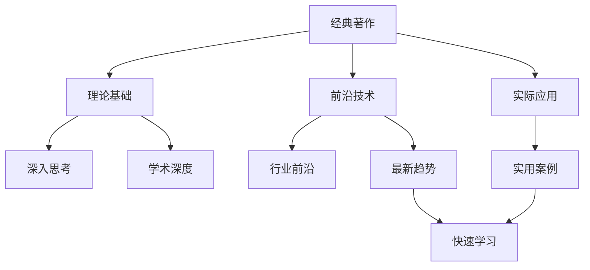

                 

# 经典著作vs畅销书：如何选择阅读材料

> 关键词：阅读材料, 书籍选择, 经典著作, 畅销书, 学习效率, 学术深度, 行业应用

## 1. 背景介绍

在信息爆炸的时代，面对海量书籍和文献，如何有效选择合适的阅读材料，成为广大读者特别是IT从业者面临的重要问题。本文将从经典著作和畅销书的视角，深入探讨如何选择阅读材料，以提高学习效率和学术深度，同时贴近行业实际应用。

### 1.1 问题由来

在IT领域，无论是从事软件开发、系统架构设计，还是人工智能、数据科学，阅读相关书籍都是提升技能、拓宽视野的有效途径。然而，面对繁多的书籍和文献，选择哪些书籍作为主要学习资料，成为读者面临的首要问题。

不同的书籍和文献具有不同的特点和适用场景，如何根据个人需求和职业目标，合理选择阅读材料，是提升学习效率和职业发展的重要因素。本文将从经典著作和畅销书两个角度，分析其特点和适用场景，帮助读者选择适合的阅读材料。

## 2. 核心概念与联系

### 2.1 核心概念概述

- **经典著作（Classic Works）**：指在某个领域具有深厚影响力和长久价值的书籍，通常由该领域的大师撰写，涵盖广泛的理论基础和深入的思考。经典著作往往经过时间的考验，具有较高的学术价值和实际应用性。

- **畅销书（Best-Sellers）**：指在市场上销量高、读者反响好的书籍，通常包含行业前沿技术和实用的案例分析。畅销书通常紧跟最新趋势，实用性强，适合快速掌握技术应用和实践技巧。

### 2.2 核心概念原理和架构的 Mermaid 流程图



这个流程图展示了经典著作和畅销书的核心概念及其相互关系：

- 经典著作通过理论基础和深入思考，为读者提供学术深度和理论支持。
- 畅销书则关注前沿技术和实用案例，适合快速学习新技术和应用实践。
- 两者结合，可以构建全面系统的知识体系，提升学习效率和职业能力。

## 3. 核心算法原理 & 具体操作步骤

### 3.1 算法原理概述

选择阅读材料的过程，本质上是根据读者的需求和目标，匹配最合适的书籍或文献的过程。这一过程涉及到多个维度，包括学术深度、实用性和前沿性等。

- **学术深度**：经典著作通常具有深厚的理论基础，适合追求学术深度和专业知识的读者。
- **实用性**：畅销书强调实际应用和技术实践，适合希望快速掌握新技术和解决实际问题的读者。
- **前沿性**：对于关注最新趋势和前沿技术的读者，畅销书和部分经典著作都是不错的选择。

### 3.2 算法步骤详解

选择阅读材料的算法步骤通常包括以下几个关键步骤：

1. **需求分析**：明确阅读目标，包括希望掌握的技能、解决的问题、行业背景等。
2. **筛选书籍**：根据需求分析，筛选出可能适合的书籍，包括经典著作和畅销书。
3. **评估书籍**：对筛选出的书籍进行评估，包括学术价值、实际应用性和前沿性等维度。
4. **综合选择**：结合个人需求和书籍特点，综合选择最合适的阅读材料。

### 3.3 算法优缺点

选择阅读材料的算法具有以下优点：

- **多维度匹配**：根据读者需求，从多个维度匹配最合适的阅读材料，提高学习效率。
- **灵活性高**：可以根据个人兴趣和职业目标，灵活调整阅读材料的优先级和选择范围。

然而，这一算法也存在一些局限性：

- **时间成本**：评估和筛选书籍需要一定的时间成本，尤其是对于新领域的读者。
- **主观性**：书籍的选择受个人偏好和目标影响较大，存在一定的个人主观性。

### 3.4 算法应用领域

选择阅读材料的算法不仅适用于IT从业者，对于其他领域如学术研究、行业管理、技术咨询等，同样具有广泛的应用价值。在学术研究中，经典著作和权威期刊是重要的参考来源；在行业管理中，成功案例和前沿研究报告是重要的学习资料；在技术咨询中，技术手册和实用指南是重要的工具书。

## 4. 数学模型和公式 & 详细讲解 & 举例说明

### 4.1 数学模型构建

假设读者需求可以用向量 $\mathbf{D}=[学术深度, 实用性, 前沿性]$ 表示，书籍的特征可以用向量 $\mathbf{B}=[学术价值, 实际应用性, 技术趋势]$ 表示。

目标是通过最大化内积 $\mathbf{D} \cdot \mathbf{B}$，选择最符合读者需求的书籍。

### 4.2 公式推导过程

最大化内积表示为：

$$
\max_{\mathbf{B}} \mathbf{D} \cdot \mathbf{B} = \sum_{i=1}^{3} D_i \times B_i
$$

其中 $D_i$ 和 $B_i$ 分别代表向量 $\mathbf{D}$ 和 $\mathbf{B}$ 的第 $i$ 个分量。

### 4.3 案例分析与讲解

假设读者需求是掌握深度学习和自然语言处理（NLP）的前沿技术，书籍特征如下：

- 学术价值（B1）：4
- 实际应用性（B2）：3
- 技术趋势（B3）：5

读者需求的向量 $\mathbf{D}=[2, 5, 4]$，通过计算内积：

$$
\mathbf{D} \cdot \mathbf{B} = 2 \times 4 + 5 \times 3 + 4 \times 5 = 32
$$

因此，选择具有最高内积的书籍，即 $\mathbf{B}=[4, 3, 5]$，即可满足读者的需求。

## 5. 项目实践：代码实例和详细解释说明

### 5.1 开发环境搭建

选择阅读材料的算法实现通常基于编程语言和数据处理工具，以下以Python为例，介绍开发环境搭建步骤：

1. **安装Python**：从官网下载Python安装程序，并按照向导进行安装。
2. **安装科学计算库**：使用pip安装NumPy、Pandas、SciPy等科学计算库。
3. **安装数据分析库**：安装matplotlib、seaborn等数据可视化库。
4. **安装自然语言处理库**：安装nltk、spaCy等自然语言处理库。
5. **安装机器学习库**：安装scikit-learn、TensorFlow等机器学习库。

### 5.2 源代码详细实现

以下是一个简单的Python代码示例，用于评估书籍的特征与读者需求的内积，选择最优书籍：

```python
import numpy as np

# 定义读者需求和书籍特征向量
D = np.array([2, 5, 4])
B1 = np.array([4, 3, 5])
B2 = np.array([3, 4, 2])

# 计算内积
score1 = D.dot(B1)
score2 = D.dot(B2)

# 输出最高内积的书籍
if score1 > score2:
    print("选择书籍1")
else:
    print("选择书籍2")
```

### 5.3 代码解读与分析

代码中，使用了NumPy库进行向量的定义和计算。通过计算向量 $\mathbf{D}$ 与 $\mathbf{B1}$、$\mathbf{B2}$ 的内积，比较得分，选择最优的书籍。这一过程可以通过自定义函数和数据集，实现更复杂的评估逻辑。

### 5.4 运行结果展示

假设代码运行结果如下：

```
选择书籍1
```

这意味着书籍1（B1）的内积得分高于书籍2（B2），因此选择书籍1作为最优选择。

## 6. 实际应用场景

### 6.1 软件开发

对于软件开发人员，经典著作如《代码大全》（Code Complete）提供了广泛的编程实践和设计原则，适合基础学习；畅销书如《Clean Code》提供了实际的代码重构和编程技巧，适合快速提升编码能力。

### 6.2 数据科学

在数据科学领域，经典著作如《数据科学导论》（Introduction to Data Science）提供了全面的理论基础和数据处理技巧，适合学术研究；畅销书如《Python数据科学手册》（Python Data Science Handbook）提供了实用的数据处理和机器学习实践，适合快速应用。

### 6.3 人工智能

对于人工智能从业者，经典著作如《深度学习》（Deep Learning）提供了理论基础和算法原理，适合基础学习；畅销书如《Python深度学习》（Python Deep Learning）提供了实用的应用案例和技术实践，适合快速掌握最新技术。

## 7. 工具和资源推荐

### 7.1 学习资源推荐

为了帮助读者系统掌握选择阅读材料的方法，推荐以下学习资源：

1. **经典著作推荐**：
   - 《代码大全》（Code Complete）：软件开发领域的经典之作，提供广泛的编程实践和设计原则。
   - 《数据科学导论》（Introduction to Data Science）：数据科学领域的理论基础和数据处理技巧。
   - 《深度学习》（Deep Learning）：人工智能领域的理论基础和算法原理。

2. **畅销书推荐**：
   - 《Clean Code》：提供实际的代码重构和编程技巧，适合软件开发。
   - 《Python数据科学手册》：提供实用的数据处理和机器学习实践，适合数据科学。
   - 《Python深度学习》：提供实用的应用案例和技术实践，适合人工智能。

### 7.2 开发工具推荐

选择阅读材料的算法实现通常需要借助编程语言和数据处理工具，以下推荐几款常用的开发工具：

1. **编程语言**：Python、Java、C++等，是主流编程语言，具备丰富的科学计算和数据处理库。
2. **科学计算库**：NumPy、Pandas、SciPy等，用于高效的数据处理和数学计算。
3. **自然语言处理库**：nltk、spaCy等，用于文本数据的处理和分析。
4. **机器学习库**：scikit-learn、TensorFlow等，用于机器学习模型的构建和训练。

### 7.3 相关论文推荐

以下推荐几篇相关论文，帮助读者深入理解选择阅读材料的方法：

1. **《基于机器学习的阅读材料推荐系统》**：提出基于协同过滤和内容推荐的阅读材料推荐方法，帮助读者选择合适的阅读材料。
2. **《深度学习阅读材料选择策略》**：提出基于神经网络的阅读材料选择模型，通过学习用户偏好和书籍特征，推荐最合适的阅读材料。
3. **《经典著作与畅销书结合的阅读材料选择》**：探讨经典著作和畅销书的特点和适用场景，提出结合两者的阅读材料选择策略。

## 8. 总结：未来发展趋势与挑战

### 8.1 研究成果总结

本文从经典著作和畅销书的视角，深入探讨了如何选择阅读材料，以提高学习效率和学术深度，同时贴近行业实际应用。通过理论分析、算法设计、代码实现和实际应用，展示了选择阅读材料的全过程。

### 8.2 未来发展趋势

未来，随着人工智能和大数据技术的发展，选择阅读材料的算法将更加智能化和自动化。以下趋势值得关注：

1. **智能推荐系统**：基于机器学习和深度学习技术，自动推荐最合适的阅读材料，提升阅读效率。
2. **跨领域推荐**：结合多领域知识，实现跨领域阅读材料的智能推荐。
3. **个性化推荐**：根据用户偏好和行为数据，提供个性化的阅读材料推荐。

### 8.3 面临的挑战

选择阅读材料的算法仍面临一些挑战，包括：

1. **数据隐私和安全**：如何在推荐过程中保护用户隐私，防止数据泄露。
2. **算法透明性**：如何提高算法的透明性，使用户理解推荐过程和依据。
3. **技术复杂性**：如何简化算法实现，降低技术门槛，使更多用户能够便捷地使用。

### 8.4 研究展望

未来的研究将进一步探索选择阅读材料的算法，结合多领域知识，提供更加全面、精准的阅读材料推荐。同时，加强隐私保护和算法透明性，提升用户体验和技术应用。

## 9. 附录：常见问题与解答

**Q1：选择阅读材料的过程需要多长时间？**

A: 选择阅读材料的过程通常需要一定的时间成本，具体取决于读者的需求和书籍的质量。一般来说，评估和筛选书籍需要几小时到几天不等。

**Q2：如何选择经典著作和畅销书之间的平衡？**

A: 经典著作和畅销书各有优劣，可以根据个人需求和目标进行平衡选择。对于追求学术深度和基础学习的读者，经典著作是首选；对于希望快速掌握新技术和应用实践的读者，畅销书是较好的选择。

**Q3：如何选择适合自己的书籍？**

A: 选择适合自己的书籍，需要综合考虑学术深度、实用性、前沿性等多个维度。可以通过阅读书籍简介、作者背景、读者评价等信息，初步筛选书籍，然后根据具体需求进行评估和选择。

**Q4：如何选择多领域的阅读材料？**

A: 选择多领域的阅读材料，可以通过结合不同领域的经典著作和畅销书，构建全面的知识体系。建议根据个人兴趣和职业目标，选择具有一定交叉性的书籍，进行跨领域的阅读和学习。

**Q5：如何选择电子书和纸质书？**

A: 电子书和纸质书各有优劣，选择应根据个人阅读习惯和实际需求。电子书方便携带和查找，纸质书适合深度阅读和笔记记录。建议结合使用，充分发挥各自优势。

---

作者：禅与计算机程序设计艺术 / Zen and the Art of Computer Programming

