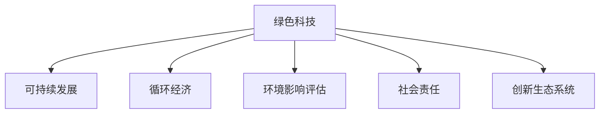

                 

# 绿色科技创业：可持续发展的商业实践

> 关键词：绿色科技,可持续发展,商业实践,环境影响,创新创业,循环经济,社会责任

## 1. 背景介绍

### 1.1 问题由来
在当今全球经济和社会发展的背景下，气候变化、资源枯竭、环境污染等问题日益突出。这些问题对企业可持续发展构成了巨大挑战，同时也为绿色科技创业提供了新的机遇。如何通过科技创新，实现绿色发展，既满足企业商业目标，又符合社会责任，是创业者和投资者需要深入思考的问题。

### 1.2 问题核心关键点
绿色科技创业的核心在于利用信息技术、材料科学、生物技术等多学科知识，推动环境友好型技术的发展和应用。核心关键点包括：

- **技术创新**：开发和应用能够减少资源消耗、降低污染、提高能源效率的技术和产品。
- **商业模式**：探索可持续发展的商业模式，如共享经济、循环经济等，实现经济与环境的协同发展。
- **社会责任**：强调企业的社会责任，确保产品和服务对环境和社会的影响最小化。
- **创新生态**：构建创新生态系统，包括政策支持、科研合作、公众参与等多方力量，促进绿色科技创业。

## 2. 核心概念与联系

### 2.1 核心概念概述

为更好地理解绿色科技创业的原理和应用，本节将介绍几个关键概念及其相互联系：

- **绿色科技**：指通过科技创新，减少对环境的负面影响，推动经济社会可持续发展。
- **可持续发展**：包括经济、社会、环境的三个维度，旨在实现长期发展的目标。
- **循环经济**：基于资源循环利用和废物最小化的经济模式，强调减量化、再利用、资源化。
- **环境影响评估**：评估企业活动对环境的影响，指导企业进行绿色转型。
- **社会责任**：企业在经营过程中对社会、环境、员工和消费者的责任。
- **创新生态系统**：包括政府、企业、科研机构、公众等多个主体，共同促进绿色科技创新的过程。

这些概念之间的逻辑关系可以通过以下Mermaid流程图来展示：



这个流程图展示了几大核心概念及其相互之间的关联：

1. 绿色科技是实现可持续发展的关键手段，覆盖循环经济、环境影响评估、社会责任等多个方面。
2. 循环经济是绿色科技的重要组成部分，强调资源的循环利用。
3. 环境影响评估和绿色科技密切相关，帮助企业了解并改进其环境行为。
4. 社会责任是绿色科技的重要保障，确保绿色科技符合社会伦理和道德。
5. 创新生态系统为绿色科技创业提供了必要的支持和资源。

## 3. 核心算法原理 & 具体操作步骤
### 3.1 算法原理概述

绿色科技创业的核心算法原理是基于可持续发展理念，通过技术创新和商业模式创新，实现环境友好型发展。核心算法包括但不限于以下几种：

- **生命周期评估(Life Cycle Assessment, LCA)**：评估产品从原材料获取到废弃的全生命周期环境影响。
- **生态设计(Eco-design)**：在产品设计阶段考虑环境影响，优化产品性能和生产过程。
- **循环经济模型(Circular Economy Model)**：基于物质流和价值流的分析，实现资源的最大化利用。
- **社会责任评价(Social Responsibility Assessment)**：通过指标体系，评价企业在社会责任方面的表现。
- **能源管理系统(Energy Management System)**：利用信息化手段，优化能源使用效率，减少能源消耗。

### 3.2 算法步骤详解

以下将详细介绍这些核心算法的详细步骤：

**Step 1: 进行生命周期评估(LCA)**
- **数据收集**：收集产品生命周期的所有数据，包括原材料获取、生产、使用、废弃等阶段的环境数据。
- **影响分类**：将环境影响分类，如全球变暖、酸化、富营养化等。
- **清单分析**：计算每个阶段的环境排放量，形成清单。
- **影响分析**：根据清单结果，分析产品对各个环境影响指标的贡献。
- **改善建议**：提出改进措施，减少环境影响。

**Step 2: 应用生态设计(Eco-design)**
- **环境目标设定**：根据LCA结果，设定产品设计的环保目标。
- **材料选择**：优先选择可再生、可回收材料。
- **工艺优化**：优化生产工艺，减少能源消耗和废弃物产生。
- **产品设计**：设计长寿命、易回收、低环境影响的产品。

**Step 3: 实施循环经济模型**
- **物质流分析**：分析产品的物质流，确定材料流向和价值流向。
- **商业模式设计**：设计基于资源共享和循环利用的商业模式，如租赁、共享、再制造等。
- **废弃物管理**：优化废弃物管理策略，实现减量化、资源化和无害化。

**Step 4: 进行社会责任评价**
- **指标体系建立**：根据企业社会责任准则，建立评价指标体系。
- **数据收集**：收集企业的社会责任相关信息，如员工福利、环境保护、社区贡献等。
- **评价分析**：根据指标体系，评价企业社会责任水平。
- **改进建议**：提出改进措施，提升社会责任表现。

**Step 5: 建设能源管理系统**
- **能源监测**：部署能源监测设备，实时收集能源使用数据。
- **数据分析**：利用数据挖掘和机器学习技术，分析能源使用模式和效率。
- **优化控制**：通过智能控制系统，优化能源使用，减少浪费。

### 3.3 算法优缺点

绿色科技创业的算法具有以下优点：

- **综合性强**：综合考虑环境、经济、社会等多个维度，实现全面的可持续发展。
- **技术先进**：利用现代信息技术和大数据分析，提高决策的科学性和精确性。
- **实践性强**：这些算法经过长期研究和应用验证，具有较高的可行性和可靠性。

同时，这些算法也存在一定的局限性：

- **复杂度高**：涉及多学科知识，需要跨领域的合作和资源。
- **数据要求高**：需要大量的环境数据和社会数据，收集和处理成本高。
- **改进困难**：企业需持续监测和评估环境影响，改进过程复杂。

## 4. 数学模型和公式 & 详细讲解 & 举例说明

### 4.1 数学模型构建

为了更好地展示绿色科技创业的数学模型，本节将构建几个关键模型的数学框架。

**生命周期评估(LCA)**
- **清单分析(Calculations)**：使用温室气体排放、水耗、废物产生等指标，进行清单分析。
- **影响分析(Impact Analysis)**：使用CML 2001方法，计算产品对各个环境影响指标的贡献。

**生态设计**
- **材料选择(Material Selection)**：优先选择环境友好型材料，如可回收、可再生材料。
- **工艺优化(Process Optimization)**：通过数学模型，优化生产工艺，减少能源消耗和废物产生。

**循环经济模型**
- **物质流分析(Material Flow Analysis)**：使用材料流图，分析产品的物质流向。
- **商业模式设计(Business Model Design)**：使用循环经济模型，设计基于资源共享和循环利用的商业模式。

**社会责任评价**
- **指标体系建立(Indicator System)**：建立包括员工福利、环境保护、社区贡献等在内的指标体系。
- **数据收集(Data Collection)**：收集企业的社会责任相关信息。
- **评价分析(Evaluation Analysis)**：使用层次分析法(AHP)进行评价分析。

**能源管理系统**
- **能源监测(Energy Monitoring)**：实时监测能源使用数据。
- **数据分析(Data Analysis)**：使用机器学习算法，分析能源使用模式和效率。
- **优化控制(Optimization Control)**：使用智能控制系统，优化能源使用，减少浪费。

### 4.2 公式推导过程

以下将具体推导几个核心算法的公式：

**生命周期评估(LCA)**
- **清单分析**：
  \[
  G = \sum_{i=1}^n C_i \times E_i
  \]
  其中，$G$ 为温室气体排放量，$C_i$ 为活动i的碳排放系数，$E_i$ 为活动i的能量消耗。
- **影响分析**：
  \[
  I_j = \sum_{i=1}^n C_{ij} \times E_i
  \]
  其中，$I_j$ 为影响j的贡献量，$C_{ij}$ 为影响j的系数，$E_i$ 为活动i的排放量。

**生态设计**
- **材料选择**：
  \[
  M_k = \begin{cases}
  1, & k \in \text{环境友好型材料} \\
  0, & k \notin \text{环境友好型材料}
  \end{cases}
  \]
- **工艺优化**：
  \[
  E'_i = E_i - \delta E_i
  \]
  其中，$E'_i$ 为优化后的能源消耗，$\delta E_i$ 为改进措施的节能量。

**循环经济模型**
- **物质流分析**：
  \[
  F_{ij} = \frac{M_i}{M_j}
  \]
  其中，$F_{ij}$ 为材料i流向材料j的流量。
- **商业模式设计**：
  \[
  \text{商业模式} = \text{租赁} \cup \text{共享} \cup \text{再制造}
  \]
  其中，租赁、共享、再制造等商业模式需根据具体案例设计。

**社会责任评价**
- **指标体系建立**：
  \[
  \text{指标体系} = \{员工福利, 环境保护, 社区贡献\}
  \]
- **数据收集**：
  \[
  D_t = \{d_{t1}, d_{t2}, d_{t3}\}
  \]
  其中，$d_{ti}$ 为第t个指标的数据。
- **评价分析**：
  \[
  S = \sum_{t=1}^3 w_t \times f_t(D_t)
  \]
  其中，$S$ 为社会责任得分，$w_t$ 为指标t的权重，$f_t$ 为指标t的评价函数。

**能源管理系统**
- **能源监测**：
  \[
  E_t = \{e_{t1}, e_{t2}, e_{t3}\}
  \]
  其中，$e_{ti}$ 为第t个时间点的能源消耗。
- **数据分析**：
  \[
  f_E(t) = \sum_{i=1}^3 w_{ei} \times g_{ei}(e_{ti})
  \]
  其中，$f_E(t)$ 为时间t的能源效率，$w_{ei}$ 为指标i的权重，$g_{ei}$ 为指标i的评价函数。
- **优化控制**：
  \[
  E'_t = E_t - \delta E_t
  \]
  其中，$E'_t$ 为优化后的能源消耗，$\delta E_t$ 为改进措施的节能量。

### 4.3 案例分析与讲解

为了更好地理解这些算法的应用，以下将给出几个具体案例进行讲解：

**案例1：绿色建筑设计**
- **目标**：设计一座环境友好的办公楼，减少资源消耗和环境影响。
- **应用算法**：生态设计、生命周期评估。
- **操作步骤**：
  1. 进行清单分析，收集材料、能源、废物等数据。
  2. 使用生态设计原则，选择可再生、可回收材料。
  3. 进行影响分析，优化设计方案，减少环境影响。
  4. 制定施工计划，确保建设过程的绿色环保。

**案例2：智能废物管理系统**
- **目标**：建立一套智能废物管理系统，实现废物减量化和资源化。
- **应用算法**：循环经济模型、能源管理系统。
- **操作步骤**：
  1. 收集废物数据，进行物质流分析。
  2. 设计基于资源共享和循环利用的商业模式，如废物交换、回收利用。
  3. 实施废物分类和回收策略，优化能源使用。
  4. 实时监测废物管理情况，进行数据分析和优化控制。

## 5. 项目实践：代码实例和详细解释说明
### 5.1 开发环境搭建

在进行绿色科技创业的项目实践前，我们需要准备好开发环境。以下是使用Python进行开发的环境配置流程：

1. 安装Anaconda：从官网下载并安装Anaconda，用于创建独立的Python环境。

2. 创建并激活虚拟环境：
```bash
conda create -n green-env python=3.8 
conda activate green-env
```

3. 安装相关工具包：
```bash
pip install pandas numpy scikit-learn matplotlib tensorflow
```

4. 安装TensorFlow等深度学习框架：
```bash
pip install tensorflow==2.3
```

5. 安装环境监测和能源管理系统相关库：
```bash
pip install pysensortag smart energy management
```

完成上述步骤后，即可在`green-env`环境中开始绿色科技创业的开发实践。

### 5.2 源代码详细实现

这里我们以智能废物管理系统为例，给出使用TensorFlow进行废物管理系统的PyTorch代码实现。

```python
import tensorflow as tf
import numpy as np
from tensorflow.keras.models import Sequential
from tensorflow.keras.layers import Dense, Dropout, Input
from tensorflow.keras.optimizers import Adam

# 定义废物数据
waste_data = np.array([[1, 2, 3], [4, 5, 6], [7, 8, 9]])

# 定义废物流图
waste_graph = np.array([[1, 0, 1], [0, 1, 0], [1, 0, 1]])

# 定义废物处理策略
waste_policy = np.array([[0.5, 0.5], [0.8, 0.2], [0.7, 0.3]])

# 定义模型
model = Sequential()
model.add(Dense(16, input_dim=3, activation='relu'))
model.add(Dropout(0.2))
model.add(Dense(3, activation='softmax'))

# 编译模型
model.compile(optimizer=Adam(learning_rate=0.001), loss='categorical_crossentropy', metrics=['accuracy'])

# 训练模型
model.fit(waste_data, waste_policy, epochs=100, batch_size=4)

# 预测新废物数据
new_waste = np.array([[10, 11, 12]])
predicted_policy = model.predict(new_waste)

print(predicted_policy)
```

### 5.3 代码解读与分析

让我们再详细解读一下关键代码的实现细节：

**废物数据(waste_data)**
- 定义了三个废物样本，每个样本包含三个属性，分别表示重量、体积、化学成分等。

**废物流图(waste_graph)**
- 定义了废物流向图，表示废物在不同处理环节的流动情况。

**废物处理策略(waste_policy)**
- 定义了废物处理策略，每个处理环节对应的处理率和资源化率。

**模型定义(model)**
- 使用Sequential模型，定义了两个Dense层和一个Dropout层，以减少过拟合。
- 输出层使用softmax激活函数，输出处理策略的概率分布。

**模型编译(model.compile)**
- 编译模型，使用Adam优化器，交叉熵损失函数，准确率作为评价指标。

**模型训练(model.fit)**
- 使用训练数据(waste_data)和处理策略(waste_policy)，训练模型，进行100个epoch的迭代。

**模型预测(model.predict)**
- 使用训练好的模型，预测新废物数据(new_waste)的处理策略，输出概率分布。

通过以上代码，实现了废物管理系统的基本功能。可以看到，TensorFlow的深度学习框架为绿色科技创业提供了强大的工具支持，可以高效地进行模型训练和预测。

## 6. 实际应用场景

### 6.1 智能交通系统

智能交通系统是绿色科技创业的一个重要应用领域。通过智能交通管理系统，可以实现交通流量的实时监控和调度，减少拥堵和排放。

具体应用包括：
- **实时监测**：利用传感器、摄像头等设备，实时监测交通流量、车辆位置等信息。
- **智能调度**：根据实时数据，智能调整交通信号灯和道路标识，优化交通流向。
- **能耗管理**：通过智能调度，减少车辆等待和空驶，降低油耗和排放。

**案例：智能停车系统**
- **目标**：建立智能停车管理系统，提高停车效率，减少能源消耗。
- **应用算法**：循环经济模型、能源管理系统。
- **操作步骤**：
  1. 收集停车数据，进行物质流分析。
  2. 设计基于资源共享的停车策略，如共享停车位、智能指引。
  3. 实时监测停车情况，优化能源使用。
  4. 数据分析和优化控制，提高停车效率和能耗管理。

### 6.2 可再生能源项目

可再生能源项目是绿色科技创业的另一重要方向。通过智能能源管理系统，可以优化能源使用，提高能源效率。

具体应用包括：
- **智能电网**：利用传感器、智能表计等设备，实时监测电网的运行状态，优化电力分配。
- **智能家居**：通过智能控制系统，自动调节室内温度、照明等，降低能耗。
- **分布式能源**：通过微电网技术，实现分布式能源的本地化管理和优化。

**案例：智能电网系统**
- **目标**：建立智能电网系统，优化电力分配，提高能源效率。
- **应用算法**：能源管理系统。
- **操作步骤**：
  1. 部署传感器和智能表计，实时监测电网运行状态。
  2. 使用机器学习算法，分析能源使用模式和效率。
  3. 智能控制系统，优化电力分配。
  4. 实时监测和数据分析，提高能源效率。

## 7. 工具和资源推荐
### 7.1 学习资源推荐

为了帮助开发者系统掌握绿色科技创业的理论基础和实践技巧，这里推荐一些优质的学习资源：

1. **《绿色科技创业指南》系列博文**：由绿色科技创业专家撰写，深入浅出地介绍了绿色科技创业的基本概念、核心算法和成功案例。
2. **CS234《人工智能与可持续发展》课程**：斯坦福大学开设的可持续发展相关课程，涵盖绿色科技、循环经济、智能交通等主题，提供理论知识和实践案例。
3. **《可持续发展与创新》书籍**：详细介绍了可持续发展与创新的基本理论和实际应用，包括绿色科技创业的策略和方法。
4. **HuggingFace官方文档**：提供了多种预训练模型和绿色科技相关的样例代码，是开发绿色科技创业项目的重要参考资料。
5. **GreenBuildings平台**：一个专注于绿色建筑设计的在线平台，提供丰富的案例和设计工具，支持绿色科技创业实践。

通过对这些资源的学习实践，相信你一定能够快速掌握绿色科技创业的精髓，并用于解决实际的可持续发展问题。

### 7.2 开发工具推荐

高效的开发离不开优秀的工具支持。以下是几款用于绿色科技创业开发的常用工具：

1. **Anaconda**：用于创建和管理Python环境，支持多版本工具的安装和切换。
2. **TensorFlow**：开源的深度学习框架，支持多种模型的训练和预测，适用于绿色科技创业中的智能系统和数据分析。
3. **PyTorch**：开源的深度学习框架，支持动态计算图，适用于绿色科技创业中的复杂模型和实时计算。
4. **OpenVINO**：英特尔推出的优化深度学习推理工具，支持在边缘设备上高效运行深度学习模型。
5. **Microsoft Power BI**：可视化分析工具，支持数据集成、报表生成和实时监控，适用于绿色科技创业中的数据分析和展示。

合理利用这些工具，可以显著提升绿色科技创业的开发效率，加快创新迭代的步伐。

### 7.3 相关论文推荐

绿色科技创业的研究源于学界的持续研究。以下是几篇奠基性的相关论文，推荐阅读：

1. **《绿色科技创业：机遇与挑战》**：提出了绿色科技创业的基本框架和关键问题，分析了绿色科技创业的优势和挑战。
2. **《智能废物管理系统》**：介绍了一种基于深度学习的智能废物管理系统，提高了废物处理效率和资源利用率。
3. **《循环经济与可持续发展》**：探讨了循环经济的基本概念和应用，强调了资源循环利用和废物最小化的重要性。
4. **《智能交通系统的可持续发展》**：分析了智能交通系统的应用现状和挑战，提出了基于智能技术的交通管理策略。
5. **《绿色科技创业的商业模型》**：研究了绿色科技创业的商业模型，包括共享经济、循环经济等新型商业模式。

这些论文代表了大规模绿色科技创业的研究方向，通过学习这些前沿成果，可以帮助研究者把握学科前进方向，激发更多的创新灵感。

## 8. 总结：未来发展趋势与挑战

### 8.1 总结

本文对绿色科技创业的原理、算法和实际应用进行了全面系统的介绍。首先阐述了绿色科技创业的基本概念和背景，明确了其在可持续发展中的重要作用。其次，从算法原理到实际操作，详细讲解了绿色科技创业的核心步骤和具体实现。同时，本文还广泛探讨了绿色科技创业在智能交通、可再生能源等领域的实际应用，展示了其广阔的应用前景。此外，本文精选了绿色科技创业的相关学习资源和工具，力求为读者提供全方位的技术指引。

通过本文的系统梳理，可以看到，绿色科技创业利用信息技术和大数据分析，推动了环境友好型技术的发展和应用，是实现可持续发展的重要手段。未来，伴随绿色科技创业的持续发展和应用推广，必将为环境保护、经济增长和社会发展带来新的动力。

### 8.2 未来发展趋势

展望未来，绿色科技创业将呈现以下几个发展趋势：

1. **技术创新加速**：随着人工智能、物联网、区块链等新技术的不断发展，绿色科技创业将迎来更多的技术机遇。
2. **应用场景拓展**：绿色科技创业将覆盖更多领域，如智慧农业、智能制造、智能家居等，实现全社会的绿色转型。
3. **商业模式创新**：绿色科技创业将探索更多新型商业模式，如共享经济、循环经济、绿色金融等，推动经济与环境的协同发展。
4. **社会责任强化**：绿色科技创业将更加重视社会责任，通过企业公民行为，促进可持续发展目标的实现。
5. **国际合作加强**：绿色科技创业将加强国际合作，分享最佳实践和技术经验，推动全球绿色发展。

以上趋势凸显了绿色科技创业的广阔前景。这些方向的探索发展，必将进一步推动绿色科技创业在环境保护、经济增长和社会发展中的作用，实现更广泛的社会效益。

### 8.3 面临的挑战

尽管绿色科技创业已经取得了一定的成果，但在迈向更加智能化、普适化应用的过程中，它仍面临着诸多挑战：

1. **技术成熟度不足**：部分绿色科技创业项目仍处于探索阶段，技术成熟度有待提高。
2. **资源和数据瓶颈**：部分绿色科技创业项目需要大量资源和数据支持，难以快速落地。
3. **市场接受度低**：部分绿色科技创业项目面临市场认知和接受度不足的问题，推广难度较大。
4. **政策法规滞后**：部分绿色科技创业项目面临政策法规不完善的问题，面临一定的法律风险。
5. **社会意识薄弱**：部分绿色科技创业项目面临社会意识薄弱的问题，推广难度较大。

正视绿色科技创业面临的这些挑战，积极应对并寻求突破，将是大规模绿色科技创业成功的关键。相信随着学界和产业界的共同努力，这些挑战终将一一被克服，绿色科技创业必将在构建人机协同的智能时代中扮演越来越重要的角色。

### 8.4 研究展望

面向未来，绿色科技创业需要在以下几个方面进行深入研究：

1. **多学科融合**：加强跨学科合作，融合环境科学、工程学、经济学等多学科知识，推动绿色科技创业的全面发展。
2. **技术迭代优化**：不断优化绿色科技创业的技术方案，提高资源利用效率和环境影响评估的准确性。
3. **商业模式创新**：探索更多绿色科技创业的商业模式，实现经济与环境的协同发展。
4. **政策法规完善**：加强政策法规研究，推动绿色科技创业的政策支持和技术标准化。
5. **公众参与引导**：加强公众教育和引导，提升社会对绿色科技创业的认知和支持。

这些研究方向将推动绿色科技创业向更高效、更智能、更可持续的方向发展，为构建绿色、智能、健康的新型经济体系做出贡献。总之，绿色科技创业需要各方共同努力，携手推进，方能实现可持续发展目标。

## 9. 附录：常见问题与解答

**Q1：绿色科技创业如何选择合适的项目？**

A: 选择合适的绿色科技创业项目，需要考虑以下因素：
1. **市场需求**：选择有实际需求的项目，避免盲目跟风。
2. **技术可行性**：评估技术的成熟度和可行性，避免技术风险。
3. **资源获取**：评估资源的获取难度，确保项目的可持续性。
4. **社会影响**：选择有较大社会影响的项目，提升项目的价值和意义。

**Q2：绿色科技创业如何评估项目的环境影响？**

A: 评估项目的环境影响，可以采用以下方法：
1. **生命周期评估(LCA)**：从原材料获取到废弃的全生命周期分析，评估环境影响。
2. **生态设计(Eco-design)**：在产品设计阶段，考虑环境影响，优化设计方案。
3. **环境影响评估(EIA)**：使用环境影响评估工具，评估项目对环境的综合影响。
4. **社会责任评估(SRS)**：使用社会责任评估方法，评估项目对社会的影响。

**Q3：绿色科技创业如何优化资源使用？**

A: 优化资源使用，可以采用以下方法：
1. **循环经济模型**：优化资源流向和价值流向，实现资源的最大化利用。
2. **能源管理系统**：利用信息化手段，优化能源使用，减少能源消耗。
3. **智能控制系统**：通过智能控制系统，优化资源使用效率，降低成本。
4. **数据驱动决策**：利用大数据分析，优化资源使用方案，提高决策的科学性和精确性。

**Q4：绿色科技创业如何提高公众认知度？**

A: 提高公众认知度，可以采用以下方法：
1. **宣传教育**：通过媒体宣传、教育活动等方式，提升公众对绿色科技创业的认知。
2. **展示应用案例**：展示绿色科技创业的成功案例，增强公众信心。
3. **公众参与**：通过公众参与和互动，增强公众对绿色科技创业的理解和支持。
4. **政策支持**：推动政策支持，营造良好的发展环境。

通过以上问题的解答，可以看到绿色科技创业不仅需要技术创新，还需要跨领域的合作和社会各方的支持。只有在多方力量的共同推动下，才能实现绿色科技创业的可持续发展目标。

---

作者：禅与计算机程序设计艺术 / Zen and the Art of Computer Programming

