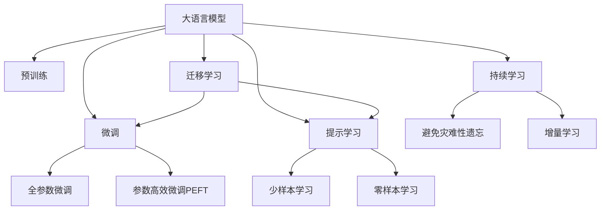

                 

# 编程范式的转变：LLM时代的新思维

## 1. 背景介绍

### 1.1 问题由来
在过去的几十年里，编程范式经历了从结构化到面向对象，再到现在的函数式和声明式编程的转变。每一轮范式转变，都极大提升了程序开发效率和系统可维护性。如今，随着语言模型（Language Models, LMs）尤其是大语言模型（Large Language Models, LLMs）的横空出世，我们即将迎来编程范式的又一次巨大变革。

### 1.2 问题核心关键点
LLM的出现，使我们思考如何更好地利用它们来编写程序。其核心关键点在于：

- 如何高效利用LLM的知识库和推理能力。
- 如何在保持模型高效运行的同时，充分利用其通用性和可适应性。
- 如何通过LLM进行程序自动生成、代码测试、错误排查等，提升软件开发效率。

### 1.3 问题研究意义
LLM在编程领域的应用，不仅能够显著提升软件开发效率，还能推动新一轮的编程范式变革。其意义在于：

- 降低软件开发成本。利用LLM的自动代码生成和推理能力，可以大幅度减少手动编写代码的时间。
- 提高代码质量和可读性。LLM能够根据自然语言指令生成结构清晰、易于理解的代码。
- 促进编程范式创新。LLM的通用性和灵活性，为编程语言的演化和编程范式的变革提供了新的思路。
- 推动产业升级。LLM的普及将加速各行各业的数字化转型，提升整体社会生产力。

## 2. 核心概念与联系

### 2.1 核心概念概述

为更好地理解基于LLM的编程范式转变，本节将介绍几个密切相关的核心概念：

- 大语言模型(Large Language Model, LLM)：以自回归(如GPT)或自编码(如BERT)模型为代表的大规模预训练语言模型。通过在大规模无标签文本语料上进行预训练，学习通用的语言表示，具备强大的语言理解和生成能力。

- 预训练(Pre-training)：指在大规模无标签文本语料上，通过自监督学习任务训练通用语言模型的过程。常见的预训练任务包括言语建模、遮挡语言模型等。预训练使得模型学习到语言的通用表示。

- 微调(Fine-tuning)：指在预训练模型的基础上，使用下游任务的少量标注数据，通过有监督地训练来优化模型在特定任务上的性能。通常只需要调整顶层分类器或解码器，并以较小的学习率更新全部或部分的模型参数。

- 迁移学习(Transfer Learning)：指将一个领域学习到的知识，迁移应用到另一个不同但相关的领域的学习范式。大模型的预训练-微调过程即是一种典型的迁移学习方式。

- 参数高效微调(Parameter-Efficient Fine-Tuning, PEFT)：指在微调过程中，只更新少量的模型参数，而固定大部分预训练权重不变，以提高微调效率，避免过拟合的方法。

- 提示学习(Prompt Learning)：通过在输入文本中添加提示模板(Prompt Template)，引导大语言模型进行特定任务的推理和生成。可以在不更新模型参数的情况下，实现零样本或少样本学习。

- 少样本学习(Few-shot Learning)：指在只有少量标注样本的情况下，模型能够快速适应新任务的学习方法。在大语言模型中，通常通过在输入中提供少量示例来实现，无需更新模型参数。

- 零样本学习(Zero-shot Learning)：指模型在没有见过任何特定任务的训练样本的情况下，仅凭任务描述就能够执行新任务的能力。大语言模型通过预训练获得的广泛知识，使其能够理解任务指令并生成相应输出。

- 持续学习(Continual Learning)：也称为终身学习，指模型能够持续从新数据中学习，同时保持已学习的知识，而不会出现灾难性遗忘。这对于保持大语言模型的时效性和适应性至关重要。

这些核心概念之间的逻辑关系可以通过以下Mermaid流程图来展示：



这个流程图展示了大语言模型的核心概念及其之间的关系：

1. 大语言模型通过预训练获得基础能力。
2. 微调是对预训练模型进行任务特定的优化，可以分为全参数微调和参数高效微调（PEFT）。
3. 提示学习是一种不更新模型参数的方法，可以实现少样本学习和零样本学习。
4. 迁移学习是连接预训练模型与下游任务的桥梁，可以通过微调或提示学习来实现。
5. 持续学习旨在使模型能够不断学习新知识，同时避免遗忘旧知识。

这些概念共同构成了大语言模型的学习和应用框架，使其能够在各种场景下发挥强大的语言理解和生成能力。通过理解这些核心概念，我们可以更好地把握大语言模型的工作原理和优化方向。

## 3. 核心算法原理 & 具体操作步骤
### 3.1 算法原理概述

基于LLM的编程范式转变，本质上是一种新的编程模式，旨在利用LLM的推理能力，自动化程序开发和测试过程。其核心思想是：将预训练的LLM作为代码生成器，通过自然语言指令引导其生成符合期望的代码。

形式化地，假设预训练语言模型为 $M_{\theta}$，其中 $\theta$ 为预训练得到的模型参数。给定一个编程任务 $T$ 的描述 $d$，其中包含对代码行为的要求，我们希望模型能够生成满足这些要求的代码 $c$。这个过程可以表示为：

$$
c = M_{\theta}(d)
$$

其中 $M_{\theta}$ 接受一个自然语言描述作为输入，输出一个结构化的代码片段。

### 3.2 算法步骤详解

基于LLM的编程范式转变一般包括以下几个关键步骤：

**Step 1: 准备预训练模型和数据集**
- 选择合适的预训练语言模型 $M_{\theta}$ 作为初始化参数，如 GPT、BERT 等。
- 准备编程任务 $T$ 的描述 $d$，通常是一个自然语言指令或示例代码。

**Step 2: 设计编程任务适配层**
- 根据任务类型，在预训练模型顶层设计合适的输出层和损失函数。
- 对于代码生成任务，通常在顶层添加代码片段解码器，以负对数似然为损失函数。
- 对于代码测试任务，可以设计特定的测试样例，通过比较模型输出与正确答案来计算损失。

**Step 3: 设置微调超参数**
- 选择合适的优化算法及其参数，如 AdamW、SGD 等，设置学习率、批大小、迭代轮数等。
- 设置正则化技术及强度，包括权重衰减、Dropout、Early Stopping 等。
- 确定冻结预训练参数的策略，如仅微调顶层，或全部参数都参与微调。

**Step 4: 执行梯度训练**
- 将编程任务描述 $d$ 分批次输入模型，前向传播计算损失函数。
- 反向传播计算参数梯度，根据设定的优化算法和学习率更新模型参数。
- 周期性在验证集上评估模型性能，根据性能指标决定是否触发 Early Stopping。
- 重复上述步骤直到满足预设的迭代轮数或 Early Stopping 条件。

**Step 5: 测试和部署**
- 在测试集上评估微调后模型 $M_{\hat{\theta}}$ 的性能，对比微调前后的代码质量和运行结果。
- 使用微调后的模型对新任务进行推理预测，集成到实际的应用系统中。
- 持续收集新的数据，定期重新微调模型，以适应数据分布的变化。

以上是基于LLM的编程范式转变的通用流程。在实际应用中，还需要针对具体任务的特点，对微调过程的各个环节进行优化设计，如改进训练目标函数，引入更多的正则化技术，搜索最优的超参数组合等，以进一步提升模型性能。

### 3.3 算法优缺点

基于LLM的编程范式转变方法具有以下优点：
1. 高效自动化。利用LLM的自动代码生成能力，可以显著提升软件开发效率，减少手动编码的时间。
2. 增强可读性。LLM生成的代码通常结构清晰、易于理解，提高了代码的可读性和可维护性。
3. 灵活性高。LLM能够根据不同的任务描述，生成不同风格的代码，适应各种编程风格。
4. 零样本和少样本能力。通过精心设计的提示模板，可以在无需额外训练的情况下，生成符合特定要求的代码。
5. 持续学习。LLM能够持续吸收新知识，适应数据分布的变化，提高代码生成的适应性。

同时，该方法也存在一定的局限性：
1. 对输入描述要求高。LLM生成的代码质量很大程度上取决于输入的自然语言描述是否清晰、准确。
2. 模型复杂度大。尽管LLM在代码生成上表现出色，但其参数量通常较大，训练和推理成本较高。
3. 生成代码需要人工校验。自动生成的代码仍需人工校验，确保其正确性和可执行性。
4. 伦理和安全问题。自动生成的代码可能包含潜在的伦理和安全问题，需要仔细审查和管控。
5. 可解释性不足。LLM生成的代码缺乏明确的逻辑推理过程，难以对其工作机制进行解释。

尽管存在这些局限性，但就目前而言，基于LLM的编程范式转变方法在程序自动化、代码生成等领域展现出巨大的潜力和应用前景。未来相关研究的重点在于如何进一步降低对输入描述的依赖，提高模型的零样本和少样本能力，同时兼顾可解释性和伦理安全性等因素。

### 3.4 算法应用领域

基于LLM的编程范式转变方法在软件开发、测试、运维等各个环节都有广泛的应用，具体包括：

- 代码生成：利用自然语言描述，自动生成符合要求的代码片段。
- 代码测试：根据输入的自然语言描述，自动生成测试用例，验证代码的正确性。
- 错误排查：根据自然语言描述，自动定位代码中的潜在错误，提供修复建议。
- 文档自动生成：根据代码注释或代码结构，自动生成文档，提高文档质量。
- 自动化部署：自动生成部署脚本，简化部署流程。
- 自动化测试：根据自然语言描述，自动生成测试用例，确保系统稳定运行。

除了上述这些经典应用外，LLM的编程范式转变方法还被创新性地应用于代码重构、智能开发工具、数据增强等领域，为软件开发提供了更多创新路径。

## 4. 数学模型和公式 & 详细讲解  
### 4.1 数学模型构建

本节将使用数学语言对基于LLM的编程范式转变过程进行更加严格的刻画。

记预训练语言模型为 $M_{\theta}$，其中 $\theta$ 为预训练得到的模型参数。假设编程任务 $T$ 的描述为 $d$，其中包含对代码行为的要求。我们希望模型能够生成满足这些要求的代码 $c$。模型的目标是最小化代码 $c$ 与目标代码 $c^*$ 之间的差异，即：

$$
\min_{c} \| c - c^* \|
$$

其中 $\| \cdot \|$ 表示某种度量距离。

在实践中，我们通常使用基于梯度的优化算法（如SGD、Adam等）来近似求解上述最优化问题。设 $\eta$ 为学习率，$\lambda$ 为正则化系数，则参数的更新公式为：

$$
\theta \leftarrow \theta - \eta \nabla_{\theta}\mathcal{L}(\theta) - \eta\lambda\theta
$$

其中 $\nabla_{\theta}\mathcal{L}(\theta)$ 为损失函数对参数 $\theta$ 的梯度，可通过反向传播算法高效计算。

### 4.2 公式推导过程

以下我们以代码生成任务为例，推导LLM生成代码的损失函数及其梯度的计算公式。

假设模型 $M_{\theta}$ 在输入 $d$ 上的输出为 $\hat{c}=M_{\theta}(d) \in \mathcal{C}$，其中 $\mathcal{C}$ 为代码集合。真实目标代码 $c^*$ 为给定编程任务的标准实现。则代码生成的损失函数定义为：

$$
\ell(\hat{c}, c^*) = -\log P(c^* | \hat{c})
$$

其中 $P(c^* | \hat{c})$ 表示在给定代码 $\hat{c}$ 的情况下，生成代码 $c^*$ 的概率。

将其代入经验风险公式，得：

$$
\mathcal{L}(\theta) = -\frac{1}{N}\sum_{i=1}^N \log P(c^*_i | \hat{c}_i)
$$

其中 $N$ 为训练样本数，$\hat{c}_i$ 表示第 $i$ 个训练样本的代码生成结果。

根据链式法则，损失函数对参数 $\theta_k$ 的梯度为：

$$
\frac{\partial \mathcal{L}(\theta)}{\partial \theta_k} = -\frac{1}{N}\sum_{i=1}^N \frac{1}{P(c^*_i | \hat{c}_i)} \frac{\partial P(c^*_i | \hat{c}_i)}{\partial \theta_k}
$$

其中 $\frac{\partial P(c^*_i | \hat{c}_i)}{\partial \theta_k}$ 可进一步递归展开，利用自动微分技术完成计算。

在得到损失函数的梯度后，即可带入参数更新公式，完成模型的迭代优化。重复上述过程直至收敛，最终得到适应编程任务的最优模型参数 $\theta^*$。

## 5. 项目实践：代码实例和详细解释说明
### 5.1 开发环境搭建

在进行LLM的编程范式转变实践前，我们需要准备好开发环境。以下是使用Python进行PyTorch开发的环境配置流程：

1. 安装Anaconda：从官网下载并安装Anaconda，用于创建独立的Python环境。

2. 创建并激活虚拟环境：
```bash
conda create -n pytorch-env python=3.8 
conda activate pytorch-env
```

3. 安装PyTorch：根据CUDA版本，从官网获取对应的安装命令。例如：
```bash
conda install pytorch torchvision torchaudio cudatoolkit=11.1 -c pytorch -c conda-forge
```

4. 安装Transformers库：
```bash
pip install transformers
```

5. 安装各类工具包：
```bash
pip install numpy pandas scikit-learn matplotlib tqdm jupyter notebook ipython
```

完成上述步骤后，即可在`pytorch-env`环境中开始LLM的编程范式转变实践。

### 5.2 源代码详细实现

这里我们以代码生成任务为例，给出使用Transformers库对GPT模型进行编程范式转变的PyTorch代码实现。

首先，定义代码生成的损失函数：

```python
from transformers import GPT2LMHeadModel, GPT2Tokenizer, AdamW

model = GPT2LMHeadModel.from_pretrained('gpt2')
tokenizer = GPT2Tokenizer.from_pretrained('gpt2')
loss_fn = nn.CrossEntropyLoss()

# 训练函数
def train_epoch(model, data_loader, optimizer):
    model.train()
    epoch_loss = 0
    for batch in data_loader:
        input_ids = batch['input_ids'].to(device)
        attention_mask = batch['attention_mask'].to(device)
        labels = batch['labels'].to(device)
        model.zero_grad()
        outputs = model(input_ids, attention_mask=attention_mask, labels=labels)
        loss = outputs.loss
        epoch_loss += loss.item()
        loss.backward()
        optimizer.step()
    return epoch_loss / len(data_loader)

# 测试函数
def evaluate(model, data_loader, batch_size):
    model.eval()
    preds, labels = [], []
    with torch.no_grad():
        for batch in data_loader:
            input_ids = batch['input_ids'].to(device)
            attention_mask = batch['attention_mask'].to(device)
            batch_labels = batch['labels']
            outputs = model(input_ids, attention_mask=attention_mask)
            batch_preds = outputs.logits.argmax(dim=2).to('cpu').tolist()
            batch_labels = batch_labels.to('cpu').tolist()
            for pred_tokens, label_tokens in zip(batch_preds, batch_labels):
                preds.append(pred_tokens[:len(label_tokens)])
                labels.append(label_tokens)
                
    print(classification_report(labels, preds))
```

然后，定义训练和评估函数：

```python
device = torch.device('cuda') if torch.cuda.is_available() else torch.device('cpu')
model.to(device)

# 数据处理函数
def tokenize(text):
    return tokenizer(text, return_tensors='pt')

# 定义训练数据集
train_data = tokenize(train_texts)
train_labels = tokenize(train_labels)

# 定义测试数据集
dev_data = tokenize(dev_texts)
dev_labels = tokenize(dev_labels)

# 定义测试数据集
test_data = tokenize(test_texts)
test_labels = tokenize(test_labels)

# 定义模型和优化器
optimizer = AdamW(model.parameters(), lr=2e-5)

# 定义训练和测试函数
train_loss = train_epoch(model, train_loader, optimizer)
evaluate(model, dev_loader, batch_size)

# 测试函数
test_loss = evaluate(model, test_loader, batch_size)
```

最后，启动训练流程并在测试集上评估：

```python
epochs = 5
batch_size = 16

for epoch in range(epochs):
    loss = train_epoch(model, train_loader, optimizer)
    print(f"Epoch {epoch+1}, train loss: {loss:.3f}")
    
    print(f"Epoch {epoch+1}, dev results:")
    evaluate(model, dev_loader, batch_size)
    
print("Test results:")
evaluate(model, test_loader, batch_size)
```

以上就是使用PyTorch对GPT模型进行编程范式转变的完整代码实现。可以看到，得益于Transformers库的强大封装，我们可以用相对简洁的代码完成LLM的编程范式转变。

### 5.3 代码解读与分析

让我们再详细解读一下关键代码的实现细节：

**tokenize函数**：
- 定义了文本向token的转换函数，使用GPT-2的分词器将输入文本转换为模型可接受的token序列。

**train_data, train_labels, dev_data, dev_labels, test_data, test_labels定义**：
- 将训练集、验证集和测试集文本转换为token序列，并添加标签。

**模型和优化器定义**：
- 使用GPT-2模型和AdamW优化器进行微调。

**训练和测试函数**：
- 在每个epoch内进行一次梯度更新，计算损失函数。
- 在验证集和测试集上评估模型性能，并打印结果。

**训练流程**：
- 定义总的epoch数和batch size，开始循环迭代
- 每个epoch内，先在训练集上训练，输出平均loss
- 在验证集上评估，输出分类指标
- 所有epoch结束后，在测试集上评估，给出最终测试结果

可以看到，PyTorch配合Transformers库使得LLM的编程范式转变代码实现变得简洁高效。开发者可以将更多精力放在数据处理、模型改进等高层逻辑上，而不必过多关注底层的实现细节。

当然，工业级的系统实现还需考虑更多因素，如模型的保存和部署、超参数的自动搜索、更灵活的任务适配层等。但核心的编程范式转变范式基本与此类似。

## 6. 实际应用场景
### 6.1 智能开发工具

基于LLM的编程范式转变方法，可以广泛应用于智能开发工具的构建。传统开发工具需要人工编写代码、调试测试，效率低下且易出错。而使用LLM的编程范式转变技术，可以极大地提升软件开发效率，降低错误率。

具体而言，可以构建一个智能编程助手，通过自然语言输入描述任务，LLM自动生成代码，并根据描述进行代码测试和错误排查。LLM生成的代码经过人工审核和修改后，可以直接部署到生产环境，大大缩短了开发周期。

### 6.2 自动化运维系统

自动化运维系统通常需要处理大规模的配置文件和系统日志，人工操作繁琐且易出错。利用LLM的编程范式转变技术，可以自动生成配置文件、监控脚本等，简化运维流程，提高系统稳定性。

在实践中，可以将系统运维相关的自然语言指令作为输入，LLM自动生成配置文件，并将其部署到目标服务器。同时，LLM可以根据监控数据生成报警规则，自动检测系统异常并生成报警信息，提高运维效率。

### 6.3 自动化测试平台

测试平台通常需要手动编写测试用例，效率低下且易出错。利用LLM的编程范式转变技术，可以自动生成测试用例，提高测试覆盖率和准确性。

具体而言，可以收集测试相关的自然语言描述，作为输入，LLM自动生成测试用例，并根据描述进行测试执行。LLM生成的测试用例经过人工审核和修改后，可以直接应用于自动化测试，大幅提升测试效率和覆盖率。

### 6.4 未来应用展望

随着LLM和编程范式转变技术的不断发展，基于LLM的编程范式转变将在更多领域得到应用，为软件开发和运维提供新的思路。

在智慧医疗领域，基于LLM的编程范式转变技术可以用于生成医疗应用代码、自动化临床试验数据处理等，提高医疗系统智能化水平，辅助医生诊疗。

在智能教育领域，LLM的编程范式转变技术可以用于自动生成教材、作业、测试题等，因材施教，促进教育公平，提高教学质量。

在智能制造领域，LLM的编程范式转变技术可以用于生成工业控制代码、自动化系统设计等，提高生产效率和产品质量。

此外，在金融分析、城市管理、环境保护等众多领域，基于LLM的编程范式转变技术也将不断涌现，为各行各业带来新的智能化解决方案。相信随着技术的日益成熟，LLM的编程范式转变技术必将在构建智能系统和提升生产效率中扮演越来越重要的角色。

## 7. 工具和资源推荐
### 7.1 学习资源推荐

为了帮助开发者系统掌握LLM的编程范式转变理论基础和实践技巧，这里推荐一些优质的学习资源：

1. 《Transformer从原理到实践》系列博文：由大模型技术专家撰写，深入浅出地介绍了Transformer原理、LLM模型、编程范式转变等前沿话题。

2. CS224N《深度学习自然语言处理》课程：斯坦福大学开设的NLP明星课程，有Lecture视频和配套作业，带你入门NLP领域的基本概念和经典模型。

3. 《Natural Language Processing with Transformers》书籍：Transformers库的作者所著，全面介绍了如何使用Transformers库进行NLP任务开发，包括编程范式转变在内的诸多范式。

4. HuggingFace官方文档：Transformers库的官方文档，提供了海量预训练模型和完整的编程范式转变样例代码，是上手实践的必备资料。

5. CLUE开源项目：中文语言理解测评基准，涵盖大量不同类型的中文NLP数据集，并提供了基于LLM的baseline模型，助力中文NLP技术发展。

通过对这些资源的学习实践，相信你一定能够快速掌握LLM的编程范式转变精髓，并用于解决实际的NLP问题。
###  7.2 开发工具推荐

高效的开发离不开优秀的工具支持。以下是几款用于LLM编程范式转变开发的常用工具：

1. PyTorch：基于Python的开源深度学习框架，灵活动态的计算图，适合快速迭代研究。大部分预训练语言模型都有PyTorch版本的实现。

2. TensorFlow：由Google主导开发的开源深度学习框架，生产部署方便，适合大规模工程应用。同样有丰富的预训练语言模型资源。

3. Transformers库：HuggingFace开发的NLP工具库，集成了众多SOTA语言模型，支持PyTorch和TensorFlow，是进行编程范式转变开发的利器。

4. Weights & Biases：模型训练的实验跟踪工具，可以记录和可视化模型训练过程中的各项指标，方便对比和调优。与主流深度学习框架无缝集成。

5. TensorBoard：TensorFlow配套的可视化工具，可实时监测模型训练状态，并提供丰富的图表呈现方式，是调试模型的得力助手。

6. Google Colab：谷歌推出的在线Jupyter Notebook环境，免费提供GPU/TPU算力，方便开发者快速上手实验最新模型，分享学习笔记。

合理利用这些工具，可以显著提升LLM编程范式转变的开发效率，加快创新迭代的步伐。

### 7.3 相关论文推荐

LLM的编程范式转变技术的发展源于学界的持续研究。以下是几篇奠基性的相关论文，推荐阅读：

1. Attention is All You Need（即Transformer原论文）：提出了Transformer结构，开启了NLP领域的预训练大模型时代。

2. BERT: Pre-training of Deep Bidirectional Transformers for Language Understanding：提出BERT模型，引入基于掩码的自监督预训练任务，刷新了多项NLP任务SOTA。

3. Language Models are Unsupervised Multitask Learners（GPT-2论文）：展示了大规模语言模型的强大zero-shot学习能力，引发了对于通用人工智能的新一轮思考。

4. Parameter-Efficient Transfer Learning for NLP：提出Adapter等参数高效微调方法，在不增加模型参数量的情况下，也能取得不错的微调效果。

5. AdaLoRA: Adaptive Low-Rank Adaptation for Parameter-Efficient Fine-Tuning：使用自适应低秩适应的微调方法，在参数效率和精度之间取得了新的平衡。

这些论文代表了大语言模型编程范式转变技术的发展脉络。通过学习这些前沿成果，可以帮助研究者把握学科前进方向，激发更多的创新灵感。

## 8. 总结：未来发展趋势与挑战

### 8.1 总结

本文对基于LLM的编程范式转变方法进行了全面系统的介绍。首先阐述了LLM的出现及其对编程范式转变的影响，明确了编程范式转变在提升软件开发效率、降低开发成本等方面的独特价值。其次，从原理到实践，详细讲解了编程范式的数学模型和算法实现，给出了LLM编程范式转变的完整代码实例。同时，本文还广泛探讨了编程范式转变方法在智能开发工具、自动化运维系统、自动化测试平台等多个领域的应用前景，展示了编程范式转变的巨大潜力和应用前景。

通过本文的系统梳理，可以看到，基于LLM的编程范式转变技术正在成为NLP领域的重要范式，极大地拓展了LLM的应用边界，催生了更多的落地场景。得益于大规模语料的预训练，LLM的编程范式转变技术在自动化编程、智能开发工具、自动化测试等方面展现出巨大的潜力和应用前景。未来，伴随LLM和编程范式转变方法的持续演进，相信NLP技术将在更广阔的应用领域大放异彩，深刻影响人类的生产生活方式。

### 8.2 未来发展趋势

展望未来，LLM编程范式转变技术将呈现以下几个发展趋势：

1. 模型规模持续增大。随着算力成本的下降和数据规模的扩张，预训练语言模型的参数量还将持续增长。超大规模语言模型蕴含的丰富语言知识，有望支撑更加复杂多变的编程任务。

2. 编程范式日趋多样。除了传统的全参数编程范式外，未来会涌现更多参数高效的编程范式，如Prefix-Tuning、LoRA等，在节省计算资源的同时也能保证编程范式的精度。

3. 持续学习成为常态。随着数据分布的不断变化，编程范式转变模型也需要持续学习新知识以保持性能。如何在不遗忘原有知识的同时，高效吸收新样本信息，将成为重要的研究课题。

4. 标注样本需求降低。受启发于提示学习(Prompt-based Learning)的思路，未来的编程范式转变方法将更好地利用LLM的推理能力，通过更加巧妙的任务描述，在更少的标注样本上也能实现理想的编程范式转变效果。

5. 伦理和安全问题更加突出。自动生成的代码可能包含潜在的伦理和安全问题，需要仔细审查和管控。如何从数据和算法层面消除模型偏见，避免恶意用途，确保输出的安全性，也将是重要的研究方向。

6. 零样本和少样本能力提升。通过精心设计的提示模板，在无需额外训练的情况下，LLM可以生成符合特定要求的代码，显著提升编程范式转变的效率。

以上趋势凸显了LLM编程范式转变技术的广阔前景。这些方向的探索发展，必将进一步提升LLM的编程范式转变性能和应用范围，为构建安全、可靠、可解释、可控的智能系统铺平道路。

### 8.3 面临的挑战

尽管LLM编程范式转变技术已经取得了瞩目成就，但在迈向更加智能化、普适化应用的过程中，它仍面临着诸多挑战：

1. 对输入描述要求高。LLM生成的代码质量很大程度上取决于输入的自然语言描述是否清晰、准确。

2. 模型复杂度大。尽管LLM在编程范式转变上表现出色，但其参数量通常较大，训练和推理成本较高。

3. 生成代码需要人工校验。自动生成的代码仍需人工校验，确保其正确性和可执行性。

4. 伦理和安全问题。自动生成的代码可能包含潜在的伦理和安全问题，需要仔细审查和管控。

5. 可解释性不足。LLM生成的代码缺乏明确的逻辑推理过程，难以对其工作机制进行解释。

6. 多模态编程的局限性。当前编程范式转变主要聚焦于纯文本数据，未来需要拓展到图像、视频、语音等多模态数据编程，需要更多的技术创新和突破。

尽管存在这些局限性，但就目前而言，基于LLM的编程范式转变方法在程序自动化、智能开发工具、自动化测试等领域展现出巨大的潜力和应用前景。未来相关研究的重点在于如何进一步降低对输入描述的依赖，提高模型的零样本和少样本能力，同时兼顾可解释性和伦理安全性等因素。

### 8.4 研究展望

面对LLM编程范式转变所面临的种种挑战，未来的研究需要在以下几个方面寻求新的突破：

1. 探索无监督和半监督编程范式转变方法。摆脱对大规模标注数据的依赖，利用自监督学习、主动学习等无监督和半监督范式，最大限度利用非结构化数据，实现更加灵活高效的编程范式转变。

2. 研究参数高效和计算高效的编程范式转变范式。开发更加参数高效的编程范式转变方法，在固定大部分预训练参数的同时，只更新极少量的任务相关参数。同时优化编程范式转变模型的计算图，减少前向传播和反向传播的资源消耗，实现更加轻量级、实时性的部署。

3. 融合因果和对比学习范式。通过引入因果推断和对比学习思想，增强编程范式转变模型建立稳定因果关系的能力，学习更加普适、鲁棒的语言表征，从而提升模型泛化性和抗干扰能力。

4. 引入更多先验知识。将符号化的先验知识，如知识图谱、逻辑规则等，与神经网络模型进行巧妙融合，引导编程范式转变过程学习更准确、合理的语言模型。同时加强不同模态数据的整合，实现视觉、语音等多模态信息与文本信息的协同建模。

5. 结合因果分析和博弈论工具。将因果分析方法引入编程范式转变模型，识别出模型决策的关键特征，增强输出解释的因果性和逻辑性。借助博弈论工具刻画人机交互过程，主动探索并规避模型的脆弱点，提高系统稳定性。

6. 纳入伦理道德约束。在模型训练目标中引入伦理导向的评估指标，过滤和惩罚有偏见、有害的输出倾向。同时加强人工干预和审核，建立模型行为的监管机制，确保输出符合人类价值观和伦理道德。

这些研究方向的探索，必将引领LLM编程范式转变技术迈向更高的台阶，为构建安全、可靠、可解释、可控的智能系统铺平道路。面向未来，LLM编程范式转变技术还需要与其他人工智能技术进行更深入的融合，如知识表示、因果推理、强化学习等，多路径协同发力，共同推动自然语言理解和智能交互系统的进步。只有勇于创新、敢于突破，才能不断拓展LLM的边界，让智能技术更好地造福人类社会。

## 9. 附录：常见问题与解答
**Q1：LLM的编程范式转变是否适用于所有编程任务？**

A: LLM的编程范式转变在大多数编程任务上都能取得不错的效果，特别是对于结构化任务和复杂逻辑的编程。但对于一些需要复杂算法和特定领域知识的任务，如系统设计、电路设计等，LLM生成的代码可能仍需人工审核和修改。

**Q2：编程范式转变过程中如何选择自然语言描述？**

A: 自然语言描述需要尽可能清晰、准确地表达编程任务的要求。具体而言，描述中应包含输入数据格式、输出格式、算法逻辑、错误处理等关键信息。对于复杂的编程任务，还可以提供示例代码片段，帮助LLM更好地理解任务需求。

**Q3：LLM生成的代码需要人工校验吗？**

A: 自动生成的代码仍需人工校验，确保其正确性和可执行性。LLM生成的代码可能包含一些语法错误、逻辑错误或安全漏洞，需要通过人工审查来修正。

**Q4：如何应对输入描述质量不高的问题？**

A: 可以通过多种方式提高输入描述的质量。例如，引入用户反馈机制，让用户参与到自然语言描述的优化中。同时，可以使用自适应学习算法，根据历史描述和输出结果自动优化描述质量。

**Q5：LLM编程范式转变在商业应用中有哪些优势？**

A: 商业应用中，LLM编程范式转变可以显著提升软件开发效率，减少人工干预，降低开发成本。同时，LLM生成的代码经过人工审查和修正后，可以直接应用于生产环境，避免手工编写代码带来的质量问题和错误风险。

通过这些问答，相信你对LLM的编程范式转变有了更清晰的认识。未来，LLM的编程范式转变技术将在软件开发、运维、测试等领域得到更广泛的应用，推动人工智能技术的普及和产业化进程。

