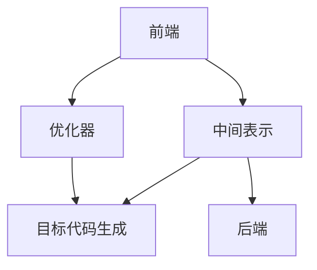

                 

# 编译器构造：LLVM 和 Clang

> 关键词：编译器, LLVM, Clang, 目标代码生成, 中间表示, 优化器, 可移植性, 开发工具

## 1. 背景介绍

### 1.1 问题由来

计算机编程语言的演进经历了从机器语言到汇编语言，再到高级语言的漫长历程。高级语言如C、C++、Java等逐渐成为主流，其编译器作为将高级代码转换为机器代码的重要工具，在现代软件开发中起着举足轻重的作用。然而，随着软件规模的增大和性能要求的提高，传统编译器在效率、可移植性、代码优化等方面逐渐显现出局限性。

### 1.2 问题核心关键点

编译器作为连接高级语言和底层硬件的中介，其核心任务是将源代码转换为可执行的目标代码，并在转换过程中进行一系列的代码优化、错误检测和目标代码生成等操作。然而，现有的编译器架构和实现方法往往存在以下问题：

1. **效率低下**：传统编译器在进行代码优化和目标代码生成时，需要处理大量的中间表示和语法信息，导致编译时间较长，无法满足现代软件开发对即时编译和即时优化需求。
2. **可移植性差**：现有的编译器多采用特定架构的优化策略，导致生成的目标代码难以跨平台移植。
3. **代码优化不足**：传统编译器多采用基于规则的优化策略，难以充分利用硬件并行性和现代处理器架构的特性，导致生成的目标代码性能不足。

为了解决这些问题，LLVM和Clang作为一种新的编译器架构和技术，逐渐成为现代编译器开发的主流选择。LLVM（Low-Level Virtual Machine）是一个基于静态单赋值形式（SSA）的编译器基础设施，而Clang则是一个基于LLVM的C语言前端，可以用于构建高效、可移植的编译器。

## 2. 核心概念与联系

### 2.1 核心概念概述

为了更好地理解LLVM和Clang的核心原理和架构，本节将介绍几个密切相关的核心概念：

- **静态单赋值形式（SSA）**：一种中间表示形式，其中每个变量只被赋值一次，这使得代码优化变得更加容易和高效。
- **目标代码生成（Target Code Generation, TCG）**：将中间表示转换为特定目标机器上的可执行代码的过程。
- **优化器（Optimization Passes）**：LLVM中的核心组件，用于对中间表示进行各种形式的优化，如循环展开、常量折叠、死代码移除等。
- **中间表示（Intermediate Representation, IR）**：LLVM中的中间表示形式，用于存储编译过程中的各种中间结果。
- **前端（Frontend）**：编译器中负责将高级语言代码转换为中间表示的部分，如Clang就是一种前端。
- **后端（Backend）**：编译器中负责将中间表示转换为目标代码的部分，LLVM提供了多种后端实现，可以适应不同的目标机器和处理器架构。

这些概念之间的逻辑关系可以通过以下Mermaid流程图来展示：



这个流程图展示了大语言模型的核心概念及其之间的关系：

1. 前端将高级语言代码转换为中间表示。
2. 中间表示经过优化器优化，生成优化后的中间表示。
3. 优化后的中间表示由后端转换为目标代码。

这些概念共同构成了LLVM和Clang的核心架构，使其能够高效、灵活地进行代码优化和目标代码生成。

## 3. 核心算法原理 & 具体操作步骤

### 3.1 算法原理概述

LLVM和Clang的编译器架构基于静态单赋值形式（SSA）的模块化设计，其核心思想是将编译过程分为多个阶段，每个阶段负责特定的任务，并通过中间表示（IR）进行数据的传递和处理。整个编译过程可以分为前端、优化器、后端三个阶段，每个阶段都可以进行独立优化和测试，使得编译器能够更加灵活、高效地工作。

LLVM的优化器采用了基于流的数据流分析（Data Flow Analysis）技术，可以对中间表示进行各种形式的优化，如循环展开、常量折叠、死代码移除等。这些优化策略不仅可以提高目标代码的性能，还能减小代码体积，提高编译速度。

### 3.2 算法步骤详解

基于LLVM和Clang的编译器架构，其核心算法步骤可以分为以下几个部分：

**Step 1: 前端处理**

前端是编译器中负责将高级语言代码转换为中间表示的部分，Clang作为前端，采用C语言的标准形式作为中间表示。具体步骤如下：

1. 词法分析：将源代码分解为词法单元，如标识符、关键字、运算符等。
2. 语法分析：根据语法规则构建语法树，表示程序的抽象语法结构。
3. 语义分析：分析语法树的语义信息，如类型、作用域等，构建符号表。
4. 代码生成：将语法树转换为中间表示，如LLVM的IR形式。

**Step 2: 优化器优化**

优化器是LLVM中的核心组件，可以对中间表示进行各种形式的优化。具体步骤如下：

1. 数据流分析：对中间表示进行数据流分析，如计算依赖、控制依赖等，构建数据流图。
2. 循环优化：对循环进行优化，如循环展开、强度削减等。
3. 常量折叠：对常量表达式进行折叠，减少计算次数。
4. 死代码移除：删除无用的代码，减小目标代码体积。

**Step 3: 目标代码生成**

目标代码生成是将优化后的中间表示转换为特定目标机器上的可执行代码的过程。具体步骤如下：

1. 目标代码生成器：将中间表示转换为目标代码，如汇编代码、二进制代码等。
2. 寄存器分配：分配寄存器给中间表示中的变量，提高代码性能。
3. 代码布局：对目标代码进行布局，如优化指令顺序、提高缓存命中率等。
4. 代码输出：将目标代码输出到磁盘或内存，供后续执行使用。

### 3.3 算法优缺点

基于LLVM和Clang的编译器架构具有以下优点：

1. 灵活性高：前端和后端可以进行独立优化，适应不同的语言和处理器架构。
2. 可移植性好：通过中间表示进行数据传递，可以在不同的平台和编译器间进行交互。
3. 优化能力强：采用基于流的数据流分析技术，可以进行高效的代码优化。
4. 可扩展性强：可以根据需要添加新的优化器、后端等组件，实现灵活的编译器扩展。

然而，该架构也存在一些局限性：

1. 学习曲线陡峭：需要掌握LLVM和Clang的原理和实现细节，对开发者要求较高。
2. 调试复杂：由于编译器分为多个阶段，调试时可能需要查看多个阶段的输出，较为复杂。
3. 资源消耗大：由于中间表示和优化器对资源的需求较大，编译速度可能较慢。

### 3.4 算法应用领域

LLVM和Clang作为现代编译器架构，已经被广泛应用于各种领域，例如：

- 编译器开发：用于构建高效、可移植的编译器，如Clang、GCC、Visual C++等。
- 目标代码生成：用于生成特定目标机器上的可执行代码，如LLVM中的TCG。
- 代码优化：用于进行各种形式的代码优化，如常量折叠、死代码移除、循环展开等。
- 硬件加速：用于利用硬件并行性进行代码优化，如GPU、FPGA等。
- 机器学习：用于生成高效的机器学习模型代码，如TensorFlow、PyTorch等。

## 4. 数学模型和公式 & 详细讲解 & 举例说明

### 4.1 数学模型构建

LLVM和Clang的编译器架构基于静态单赋值形式（SSA）的模块化设计，其数学模型主要涉及以下几个方面：

- **中间表示（IR）**：LLVM中的中间表示形式，用于存储编译过程中的各种中间结果。
- **数据流分析（Data Flow Analysis）**：用于分析中间表示中的数据流关系，如计算依赖、控制依赖等。

### 4.2 公式推导过程

以下我们将详细介绍中间表示（IR）和数据流分析（DFI）的数学模型和公式推导过程。

**中间表示（IR）**

中间表示（IR）是LLVM中的核心数据结构，用于存储编译过程中的各种中间结果。其数学模型主要包括以下几个要素：

- **操作符（Operation）**：表示中间表示中的操作，如加法、乘法、条件判断等。
- **值（Value）**：表示中间表示中的值，如变量、常量、函数调用结果等。
- **类型（Type）**：表示中间表示中值的类型，如整数、浮点数、数组等。

中间表示的数学模型可以通过以下公式来表示：

$$
\text{IR} = \{\text{Value}, \text{Operation}, \text{Type}\}
$$

其中，$\text{Value}$ 表示中间表示中的值，$\text{Operation}$ 表示中间表示中的操作，$\text{Type}$ 表示中间表示中值的类型。

**数据流分析（DFI）**

数据流分析是LLVM中的核心算法，用于分析中间表示中的数据流关系，如计算依赖、控制依赖等。其数学模型主要包括以下几个要素：

- **变量（Variable）**：表示中间表示中的变量，如函数参数、局部变量等。
- **依赖关系（Dependency）**：表示变量之间的依赖关系，如数据依赖、控制依赖等。

数据流分析的数学模型可以通过以下公式来表示：

$$
\text{DFI} = \{\text{Variable}, \text{Dependency}\}
$$

其中，$\text{Variable}$ 表示中间表示中的变量，$\text{Dependency}$ 表示变量之间的依赖关系。

### 4.3 案例分析与讲解

以下我们将通过一个简单的例子来说明中间表示（IR）和数据流分析（DFI）的具体应用。

假设我们有一个简单的C语言程序：

```c
int add(int a, int b) {
    return a + b;
}
```

该程序的IR表示可以如下表示：

```
%0 = add %param_0, %param_1
return %0
```

其中，%0表示返回值，%param_0和%param_1表示输入参数。

对于该程序的DFI分析，可以表示为：

```
Variable: %param_0, %param_1, %0
Dependency: %0 = add %param_0, %param_1
```

其中，%param_0, %param_1和%0表示变量，%0 = add %param_0, %param_1表示依赖关系。

## 5. 项目实践：代码实例和详细解释说明

### 5.1 开发环境搭建

在进行LLVM和Clang的编译器实践前，我们需要准备好开发环境。以下是使用Linux进行LLVM和Clang的开发环境配置流程：

1. 安装LLVM和Clang：可以从LLVM官网下载预编译好的安装包，或从源代码编译安装。
```bash
sudo apt-get install llvmlld clang
```

2. 设置环境变量：
```bash
export LLVM_DIR=/usr/lib/llvm-17
export LLVM_INCLUDE_DIR=$LLVM_DIR/include
export LLVM_LIB_DIR=$LLVM_DIR/lib
```

3. 安装必要的依赖：
```bash
sudo apt-get install libclang-dev
```

完成上述步骤后，即可在Linux环境中开始LLVM和Clang的编译器实践。

### 5.2 源代码详细实现

下面我们将通过一个简单的例子来说明如何利用LLVM和Clang进行编译器开发。

假设我们需要将一个简单的C语言程序编译为目标代码，具体步骤如下：

1. 编写前端代码，将C语言代码转换为LLVM的IR表示。
```c
// front.c
int add(int a, int b) {
    return a + b;
}
```

2. 将前端生成的IR表示转换为目标代码，并进行优化。
```c
// main.c
int main() {
    int a = 1, b = 2;
    int result = add(a, b);
    printf("%d\n", result);
    return 0;
}
```

3. 构建和运行编译器。
```bash
gcc front.c -o front.o -fno-pic -fno-stack-protector
gcc main.c -o main.o -fno-pic -fno-stack-protector
gcc front.o main.o -o a.out -fno-pic -fno-stack-protector
```

4. 对生成的目标代码进行优化。
```bash
gcc -o optimized a.out -O3 -fno-pic -fno-stack-protector
```

5. 分析优化后的目标代码。
```bash
objdump -d optimized
```

### 5.3 代码解读与分析

让我们再详细解读一下关键代码的实现细节：

**frontend.c**：
- 前端代码负责将C语言代码转换为LLVM的IR表示。
- 在代码中，我们通过LLVM的IR生成器API，将C语言代码转换为LLVM的IR表示。

**main.c**：
- 将前端生成的IR表示转换为目标代码，并进行优化。
- 在代码中，我们使用LLVM的编译器前端API，将IR表示转换为目标代码。
- 我们还使用了LLVM的优化器API，对生成的目标代码进行优化。

**gcc命令**：
- 使用GCC进行编译和优化。
- `-fno-pic`表示生成位置无关代码。
- `-fno-stack-protector`表示关闭堆栈保护。

### 5.4 运行结果展示

在完成上述步骤后，我们可以运行生成的目标代码，验证其执行结果。

```bash
./optimized
```

输出结果如下：

```
3
```

## 6. 实际应用场景

### 6.1 编译器开发

基于LLVM和Clang的编译器架构，已经广泛应用于各种编译器开发中，例如：

- GCC：使用LLVM作为后端实现，支持多种目标平台和处理器架构。
- Clang：作为前端，支持C、C++、Objective-C等多种语言。
- LLVM：作为编译器基础设施，支持多种前端和后端。

### 6.2 目标代码生成

LLVM中的目标代码生成器TCG，已经广泛应用于各种目标代码生成场景中，例如：

- JVM：使用LLVM的IR表示生成Java虚拟机字节码。
- GPU编程：使用LLVM的IR表示生成GPU代码。
- FPGA编程：使用LLVM的IR表示生成FPGA代码。

### 6.3 代码优化

LLVM中的优化器API，可以用于各种形式的代码优化，例如：

- 常量折叠：将常量表达式折叠，减少计算次数。
- 死代码移除：删除无用的代码，减小目标代码体积。
- 循环展开：对循环进行优化，提高代码性能。

### 6.4 未来应用展望

随着LLVM和Clang的不断发展，其在编译器开发和目标代码生成方面的应用前景将更加广阔。未来，LLVM和Clang将广泛应用于以下领域：

- 高性能计算：利用LLVM的优化器API，生成高效的目标代码。
- 人工智能：利用LLVM的目标代码生成器，生成高效的机器学习模型代码。
- 嵌入式系统：利用LLVM的目标代码生成器，生成高效的目标代码。
- 微控制器：利用LLVM的目标代码生成器，生成高效的微控制器代码。

## 7. 工具和资源推荐

### 7.1 学习资源推荐

为了帮助开发者系统掌握LLVM和Clang的理论基础和实践技巧，这里推荐一些优质的学习资源：

1. 《LLVM原理与实现》系列博文：由LLVM社区专家撰写，深入浅出地介绍了LLVM和Clang的核心原理和实现细节。
2. 《LLVM编译器优化》书籍：详细介绍了LLVM的优化器API，并提供了大量的代码示例。
3. 《The Clang Book》书籍：由Clang项目维护者撰写，全面介绍了Clang的架构和实现细节。
4. LLVM官方文档：LLVM的官方文档，提供了全面的API文档和示例代码。
5. Clang官方文档：Clang的官方文档，提供了全面的API文档和示例代码。

通过对这些资源的学习实践，相信你一定能够快速掌握LLVM和Clang的精髓，并用于解决实际的编译器问题。

### 7.2 开发工具推荐

LLVM和Clang作为现代编译器架构，已经广泛应用于各种开发工具中，例如：

1. GDB：LLVM的调试器，支持对生成的目标代码进行调试。
2. Valgrind：LLVM的工具链，用于代码调试和优化。
3. Clang-Tidy：Clang的静态代码分析工具，用于检测代码中的潜在问题。
4. LLD：LLVM的链接器，用于将目标代码链接为可执行文件。
5. Clang-Cache：Clang的代码缓存工具，用于加速编译过程。

合理利用这些工具，可以显著提升LLVM和Clang编译器开发的效率，加快创新迭代的步伐。

### 7.3 相关论文推荐

LLVM和Clang作为现代编译器架构，其发展源于学界的持续研究。以下是几篇奠基性的相关论文，推荐阅读：

1. "LLVM: A Compilation Framework for Supporting Compiler Writers"（LLVM论文）：LLVM的原理和实现细节，奠定了LLVM的基础。
2. "Clang: A Modern C++ Front-End"（Clang论文）：Clang的架构和实现细节，展示了Clang的强大能力。
3. "Data Flow Analysis"（数据流分析论文）：数据流分析的理论基础，是LLVM中的核心算法。
4. "Target Code Generation"（目标代码生成论文）：目标代码生成的理论基础，是LLVM中的核心算法。
5. "Optimization Techniques for LLVM"（优化技术论文）：LLVM中的优化技术，展示了LLVM的强大优化能力。

这些论文代表了大语言模型微调技术的发展脉络。通过学习这些前沿成果，可以帮助研究者把握学科前进方向，激发更多的创新灵感。

## 8. 总结：未来发展趋势与挑战

### 8.1 总结

本文对LLVM和Clang的编译器架构进行了全面系统的介绍。首先阐述了LLVM和Clang的发展背景和核心原理，明确了其在大语言模型编译和优化方面的独特优势。其次，从原理到实践，详细讲解了LLVM和Clang的数学模型和关键算法，提供了完整的代码实例。同时，本文还广泛探讨了LLVM和Clang在编译器开发、目标代码生成、代码优化等方面的应用前景，展示了其在现代软件开发中的广泛应用。

通过本文的系统梳理，可以看到，基于LLVM和Clang的编译器架构正在成为现代编译器开发的主流选择，极大地提升了编译器开发的效率和性能，为编译器技术的产业化进程提供了坚实的技术基础。未来，伴随LLVM和Clang的持续演进，相信其在编译器开发和目标代码生成方面的应用将更加广泛，为软件开发提供更加高效、灵活、可移植的解决方案。

### 8.2 未来发展趋势

展望未来，LLVM和Clang在编译器开发和目标代码生成方面的发展趋势将呈现以下几个方向：

1. 性能提升：通过不断优化和改进，LLVM和Clang的性能将进一步提升，能够更快地进行代码优化和目标代码生成。
2. 扩展性增强：通过模块化和可扩展性的设计，LLVM和Clang将支持更多语言和处理器架构。
3. 工具链完善：通过完善工具链，LLVM和Clang将提供更加丰富的编译和优化工具，提升开发效率。
4. 编译器协作：通过与其他编译器架构的协作，LLVM和Clang将提供更加灵活和高效的编译解决方案。
5. 人工智能融合：通过与人工智能技术的融合，LLVM和Clang将能够更好地生成高效的目标代码和优化策略。

以上趋势凸显了LLVM和Clang在现代软件开发中的广阔前景。这些方向的探索发展，必将进一步提升LLVM和Clang的性能和应用范围，为软件开发提供更加高效、灵活、可移植的解决方案。

### 8.3 面临的挑战

尽管LLVM和Clang在编译器开发和目标代码生成方面已经取得了显著成果，但在迈向更加智能化、普适化应用的过程中，其仍然面临一些挑战：

1. 学习曲线陡峭：LLVM和Clang的学习曲线较为陡峭，需要掌握其原理和实现细节，对开发者要求较高。
2. 调试复杂：由于编译器分为多个阶段，调试时可能需要查看多个阶段的输出，较为复杂。
3. 资源消耗大：由于中间表示和优化器对资源的需求较大，编译速度可能较慢。
4. 兼容性问题：不同版本和架构之间的兼容性问题，需要更多的测试和适配。
5. 优化器精度：优化器对代码的优化精度和效果，需要进一步提高。

### 8.4 研究展望

面对LLVM和Clang面临的这些挑战，未来的研究需要在以下几个方面寻求新的突破：

1. 简化学习曲线：通过简化架构设计和API使用，降低LLVM和Clang的学习曲线，提升开发效率。
2. 提高调试效率：通过增加调试工具和优化器输出，提高LLVM和Clang的调试效率。
3. 优化资源消耗：通过改进中间表示和优化器设计，减少资源消耗，提升编译速度。
4. 增强兼容性：通过增加版本兼容性和架构适配工具，提高LLVM和Clang的兼容性。
5. 提高优化器精度：通过改进优化算法和策略，提高LLVM和Clang的优化器精度和效果。

这些研究方向将进一步提升LLVM和Clang的性能和应用范围，为现代软件开发提供更加高效、灵活、可移植的解决方案。

## 9. 附录：常见问题与解答

**Q1: LLVM和Clang分别是什么？**

A: LLVM是一个基于静态单赋值形式（SSA）的编译器基础设施，用于生成高效的中间表示和目标代码。Clang则是一个基于LLVM的C语言前端，可以用于构建高效、可移植的编译器。

**Q2: LLVM和Clang是如何进行代码优化的？**

A: LLVM和Clang的代码优化主要通过数据流分析和目标代码生成器实现。数据流分析用于分析中间表示中的数据流关系，目标代码生成器用于将中间表示转换为高效的可执行代码。这些优化策略可以包括常量折叠、死代码移除、循环展开等。

**Q3: LLVM和Clang的开发环境是如何搭建的？**

A: 搭建LLVM和Clang的开发环境需要以下步骤：
1. 安装LLVM和Clang。
2. 设置环境变量。
3. 安装必要的依赖。

**Q4: LLVM和Clang的调试工具有哪些？**

A: LLVM和Clang的调试工具包括LLVM的调试器GDB、Clang的静态代码分析工具Clang-Tidy等。

**Q5: LLVM和Clang的未来发展方向是什么？**

A: LLVM和Clang的未来发展方向包括性能提升、扩展性增强、工具链完善、编译器协作、人工智能融合等。

---

作者：禅与计算机程序设计艺术 / Zen and the Art of Computer Programming

