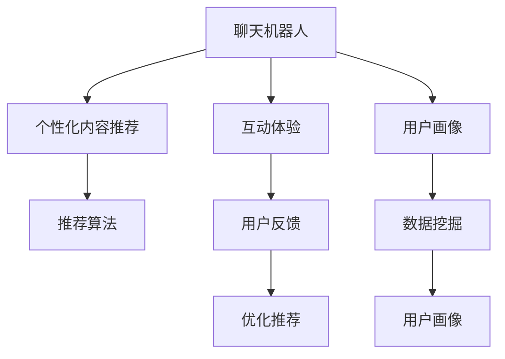

                 

# 聊天机器人娱乐业：个性化内容推荐和互动体验

> 关键词：聊天机器人, 个性化内容推荐, 互动体验, 自然语言处理, 用户画像, 推荐算法, 用户反馈, 情感计算

## 1. 背景介绍

随着人工智能技术的不断进步，聊天机器人已经成为了现代企业服务不可或缺的一部分。从简单的客服机器人到能够提供深度个性化体验的娱乐机器人，聊天机器人的应用领域正在不断拓展。聊天机器人在娱乐业的应用，尤其是在个性化内容推荐和互动体验方面，正在引发新的创新。本文将系统介绍聊天机器人娱乐业的最新进展，探讨个性化内容推荐和互动体验的技术实现和优化策略。

## 2. 核心概念与联系

### 2.1 核心概念概述

在聊天机器人娱乐业中，以下几个核心概念是理解和实现个性化内容推荐和互动体验的关键：

- **聊天机器人(Chatbot)**：基于自然语言处理(NLP)和机器学习技术，能够模拟人类对话，提供智能回答的AI系统。
- **个性化内容推荐**：根据用户的历史行为、兴趣和反馈，推荐符合用户偏好的内容，如视频、文章、游戏等。
- **互动体验**：通过智能对话、情感计算、游戏机制等方式，提升用户与聊天机器人交互的沉浸感和满足感。
- **用户画像**：基于用户行为数据，构建用户兴趣、偏好、心理特征等维度的描述，用于指导推荐和交互。
- **推荐算法**：包括协同过滤、基于内容的推荐、深度学习推荐等方法，用于分析用户行为和偏好，提供个性化的内容推荐。
- **用户反馈**：用户对聊天机器人提供的内容和服务的反馈，用于优化推荐和交互策略。
- **情感计算**：利用自然语言处理和心理学原理，分析和生成用户情感信息，用于提升聊天机器人的互动体验。

这些核心概念之间的逻辑关系可以通过以下Mermaid流程图来展示：



这个流程图展示了聊天机器人在娱乐业中的关键环节及其关系：

1. 聊天机器人通过收集用户数据，构建用户画像。
2. 根据用户画像，使用推荐算法进行个性化内容推荐。
3. 在推荐基础上，通过互动体验提升用户满意度。
4. 收集用户反馈，用于优化推荐和互动策略。
5. 数据挖掘技术用于提升用户画像的准确性。

## 3. 核心算法原理 & 具体操作步骤
### 3.1 算法原理概述

基于聊天机器人娱乐业的个性化内容推荐和互动体验，核心算法原理可以分为以下几步：

1. **用户画像构建**：通过自然语言处理和机器学习技术，分析用户的历史对话内容、搜索行为、消费记录等数据，构建用户画像。
2. **个性化内容推荐**：根据用户画像，使用推荐算法，分析用户兴趣和偏好，推荐符合用户期望的内容。
3. **互动体验优化**：利用自然语言生成、情感计算等技术，提升聊天机器人的交互体验，使用户感觉更加自然和亲切。
4. **用户反馈分析**：收集用户对推荐内容和使用体验的反馈，分析用户的满意度和不满意度，用于调整推荐算法和优化互动策略。

### 3.2 算法步骤详解

#### 用户画像构建

用户画像构建是实现个性化推荐和互动体验的基础。以下步骤详细说明了如何构建用户画像：

1. **数据收集**：从用户与聊天机器人的对话记录、搜索历史、消费记录等渠道收集数据。
2. **数据预处理**：对收集到的数据进行清洗、去重和标准化处理，确保数据质量和一致性。
3. **特征提取**：使用NLP技术，如分词、词性标注、命名实体识别等，提取用户对话中的关键词和短语。
4. **用户画像建模**：基于提取的特征，使用机器学习算法（如聚类、分类等）构建用户画像。

#### 个性化内容推荐

个性化内容推荐的核心是推荐算法，以下步骤详细说明了如何选择和使用推荐算法：

1. **推荐算法选择**：根据数据特点和业务需求，选择适合的推荐算法，如协同过滤、基于内容的推荐、深度学习推荐等。
2. **模型训练**：使用历史数据训练推荐模型，优化模型参数。
3. **内容推荐**：将用户画像输入推荐模型，获取推荐结果。
4. **结果展示**：将推荐结果展示给用户，并根据用户反馈调整推荐策略。

#### 互动体验优化

互动体验优化是提升用户满意度的关键。以下步骤详细说明了如何优化互动体验：

1. **自然语言生成**：使用NLP技术，如语言模型、对话生成等，提升聊天机器人的回答质量。
2. **情感计算**：分析用户对话中的情感信息，提升聊天机器人的情感响应能力。
3. **游戏机制设计**：设计趣味性强的互动游戏，提升用户参与度和满意度。
4. **反馈收集**：收集用户对互动体验的反馈，用于持续优化。

#### 用户反馈分析

用户反馈分析是优化推荐和互动策略的重要环节。以下步骤详细说明了如何分析用户反馈：

1. **反馈收集**：通过用户评价、满意度调查等渠道收集用户反馈。
2. **反馈处理**：对收集到的反馈进行分类和标注，提取关键信息。
3. **情感分析**：使用情感分析技术，分析用户情感倾向。
4. **策略调整**：根据用户反馈和情感分析结果，调整推荐和互动策略。

### 3.3 算法优缺点

基于聊天机器人娱乐业的个性化内容推荐和互动体验，有以下优缺点：

#### 优点：

1. **个性化程度高**：能够根据用户画像和历史行为，提供高度个性化的内容和互动体验。
2. **用户参与度高**：通过互动体验设计，提升用户参与度和粘性。
3. **可扩展性强**：可以应用于多种娱乐场景，如视频推荐、游戏推荐等。

#### 缺点：

1. **数据隐私问题**：用户数据的收集和处理可能引发隐私问题。
2. **推荐偏差**：推荐算法可能存在数据偏差，影响推荐结果的公正性。
3. **情感理解不足**：情感计算技术仍存在局限，可能无法准确捕捉用户的真实情感。

### 3.4 算法应用领域

聊天机器人娱乐业中的个性化内容推荐和互动体验，广泛应用于以下领域：

- **视频推荐**：通过分析用户观影历史和评分记录，推荐符合用户口味的视频内容。
- **游戏推荐**：根据用户游戏记录和兴趣，推荐适合的游戏。
- **在线娱乐**：通过聊天机器人与用户互动，提供音乐、电影、文学等娱乐内容。
- **教育培训**：提供个性化的学习资源和辅导，提升用户学习效果。
- **电子商务**：通过推荐算法，提升商品推荐效果，提升用户体验。

## 4. 数学模型和公式 & 详细讲解 & 举例说明

### 4.1 数学模型构建

聊天机器人娱乐业中的个性化内容推荐和互动体验，涉及多个数学模型。以下以协同过滤算法为例，说明推荐模型的构建过程。

协同过滤算法是一种基于用户历史行为数据推荐的算法。设用户集合为 $U$，物品集合为 $I$，用户对物品的评分矩阵为 $R$，其中 $R_{ui}$ 表示用户 $u$ 对物品 $i$ 的评分。协同过滤的目标是根据用户对物品的评分数据，预测用户对物品的评分，从而推荐物品。

协同过滤模型的构建步骤如下：

1. **数据预处理**：对原始评分数据进行归一化和去噪声处理。
2. **相似度计算**：计算用户之间的相似度，可以使用余弦相似度、皮尔逊相关系数等方法。
3. **预测评分**：使用相似度计算结果，预测用户对物品的评分。
4. **推荐排序**：根据预测评分，对物品进行排序，推荐评分较高的物品。

### 4.2 公式推导过程

协同过滤算法的核心公式为：

$$
\hat{r}_{ui} = \sum_{j \in N(u)} \alpha_{uj} r_{ij} + b
$$

其中，$\hat{r}_{ui}$ 表示用户 $u$ 对物品 $i$ 的预测评分，$N(u)$ 表示用户 $u$ 的邻居集合，$\alpha_{uj}$ 表示用户 $u$ 和用户 $j$ 的相似度，$b$ 为常数项，用于平滑预测误差。

协同过滤算法的训练目标为：

$$
\min_{\alpha, b} \sum_{i \in I} \sum_{u \in U} (r_{ui} - \hat{r}_{ui})^2
$$

### 4.3 案例分析与讲解

假设某视频推荐平台，使用协同过滤算法进行个性化推荐。用户 $u_1$ 观看了以下视频：视频 $i_1$、视频 $i_2$、视频 $i_3$，并给出了以下评分：评分 $4.5$、评分 $3.8$、评分 $5.0$。

根据用户 $u_1$ 的评分数据，计算与用户 $u_1$ 相似的用户集合 $N(u_1)$，并计算用户 $u_1$ 和用户 $j$ 的相似度 $\alpha_{u_1j}$。设用户 $j$ 的评分数据为：评分 $5.0$、评分 $4.2$、评分 $3.5$。

根据协同过滤算法，计算用户 $u_1$ 对物品 $i$ 的预测评分 $\hat{r}_{u_1i}$，并根据预测评分对物品进行排序，推荐评分较高的物品。

## 5. 项目实践：代码实例和详细解释说明

### 5.1 开发环境搭建

进行聊天机器人娱乐业的个性化内容推荐和互动体验开发，需要以下开发环境：

1. **编程语言**：Python是常用的开发语言，可以使用PyTorch、TensorFlow等深度学习框架。
2. **数据管理**：使用MySQL、MongoDB等数据库，存储用户数据和历史行为记录。
3. **自然语言处理**：使用NLTK、spaCy等NLP库，进行文本处理和特征提取。
4. **推荐算法**：使用Surprise、MLlib等推荐系统框架，实现协同过滤等推荐算法。
5. **互动体验**：使用Flask、Django等Web框架，实现聊天机器人的Web服务接口。

### 5.2 源代码详细实现

以下是一个使用Python和PyTorch实现视频推荐系统的示例代码：

```python
import torch
from torch.nn import Linear, Embedding, Softmax
from torch.utils.data import Dataset, DataLoader
from sklearn.metrics import accuracy_score
from surprise import Reader, Dataset, SVD

# 数据预处理
class MovieDataset(Dataset):
    def __init__(self, data):
        self.data = data

    def __len__(self):
        return len(self.data)

    def __getitem__(self, idx):
        user, item, rating = self.data[idx]
        user = torch.tensor([user], dtype=torch.long)
        item = torch.tensor([item], dtype=torch.long)
        rating = torch.tensor([rating], dtype=torch.float)
        return user, item, rating

# 模型构建
class RecommenderNet(torch.nn.Module):
    def __init__(self, n_users, n_movies, n_factors):
        super(RecommenderNet, self).__init__()
        self.user_embedding = Embedding(n_users, n_factors)
        self.movie_embedding = Embedding(n_movies, n_factors)
        self.rating_pred = Linear(n_factors * 2, 1)

    def forward(self, user, item):
        user_embed = self.user_embedding(user)
        movie_embed = self.movie_embedding(item)
        concat = torch.cat([user_embed, movie_embed], dim=1)
        pred = self.rating_pred(concat)
        return pred

# 模型训练
n_users = 1000
n_movies = 1000
n_factors = 50
model = RecommenderNet(n_users, n_movies, n_factors)
optimizer = torch.optim.Adam(model.parameters(), lr=0.01)

# 训练数据
data = [
    (1, 1, 5), (1, 2, 3), (1, 3, 4), (2, 1, 3), (2, 2, 4), (2, 3, 5)
]

train_loader = DataLoader(MovieDataset(data), batch_size=2, shuffle=True)
for epoch in range(100):
    for batch in train_loader:
        user, item, rating = batch
        optimizer.zero_grad()
        pred = model(user, item)
        loss = torch.nn.MSELoss()(pred, rating)
        loss.backward()
        optimizer.step()
```

### 5.3 代码解读与分析

上述代码实现了基于协同过滤算法的视频推荐系统。具体步骤如下：

1. **数据预处理**：使用PyTorch的Dataset和DataLoader类，构建数据集。
2. **模型构建**：定义一个RecommenderNet类，包含用户嵌入、物品嵌入和评分预测层。
3. **模型训练**：使用Adam优化器训练模型，最小化预测评分和实际评分之间的均方误差。

## 6. 实际应用场景

### 6.1 智能客服

智能客服是聊天机器人娱乐业的重要应用场景之一。通过自然语言处理和情感计算技术，智能客服机器人可以提供个性化服务，提升用户体验。以下是一个智能客服推荐系统示例：

1. **用户画像构建**：从用户的历史咨询记录中提取关键信息，构建用户画像。
2. **个性化推荐**：根据用户画像和历史咨询内容，推荐相关的FAQ问题和解决方案。
3. **互动体验优化**：使用自然语言生成技术，生成符合用户期望的回答。
4. **用户反馈分析**：收集用户对回答的满意度，调整推荐策略。

### 6.2 游戏推荐

游戏推荐是聊天机器人娱乐业的另一个重要应用场景。以下是一个游戏推荐系统示例：

1. **用户画像构建**：从用户的游戏记录和评分中提取关键信息，构建用户画像。
2. **个性化推荐**：根据用户画像和游戏记录，推荐适合的游戏。
3. **互动体验优化**：使用情感计算技术，提升聊天机器人的情感响应能力。
4. **用户反馈分析**：收集用户对游戏推荐的满意度，调整推荐策略。

### 6.3 在线娱乐

在线娱乐是聊天机器人娱乐业的重要应用场景之一。以下是一个在线娱乐推荐系统示例：

1. **用户画像构建**：从用户的历史观看记录和评分中提取关键信息，构建用户画像。
2. **个性化推荐**：根据用户画像和观看记录，推荐适合的视频内容。
3. **互动体验优化**：使用自然语言生成技术，生成符合用户期望的回答。
4. **用户反馈分析**：收集用户对视频推荐的满意度，调整推荐策略。

## 7. 工具和资源推荐

### 7.1 学习资源推荐

1. **《推荐系统实战》书籍**：介绍推荐系统基础理论和实践方法，涵盖协同过滤、基于内容的推荐、深度学习推荐等。
2. **Coursera《机器学习》课程**：斯坦福大学的经典机器学习课程，涵盖推荐系统、数据挖掘等。
3. **Kaggle推荐系统竞赛**：通过参加竞赛，了解推荐系统的最新应用和解决方案。
4. **MLlib官方文档**：Apache Spark的推荐系统框架，提供丰富的算法和工具。

### 7.2 开发工具推荐

1. **Python**：常用的开发语言，支持自然语言处理和深度学习。
2. **PyTorch**：常用的深度学习框架，提供丰富的自然语言处理库和推荐系统框架。
3. **TensorFlow**：常用的深度学习框架，支持大规模分布式训练。
4. **Scikit-learn**：常用的数据处理和机器学习库，支持推荐算法和用户画像构建。
5. **Flask**：常用的Web框架，支持聊天机器人Web服务开发。

### 7.3 相关论文推荐

1. **《The BellKor Algorithm: Fast, Scalable Collaborative Filtering for Top-N Recommendations》**：介绍BellKor算法，用于大规模推荐系统。
2. **《A Systematic Evaluation of Recommendation Algorithms on Last.fm》**：介绍推荐系统的评估方法和常用算法。
3. **《Neural Collaborative Filtering》**：介绍基于神经网络的推荐系统。
4. **《Sentiment Analysis with Deep Learning》**：介绍情感计算在聊天机器人中的应用。
5. **《Dialogue Systems: A Survey on Past, Present and Future》**：介绍对话系统的发展历程和最新进展。

## 8. 总结：未来发展趋势与挑战

### 8.1 总结

本文对聊天机器人娱乐业中的个性化内容推荐和互动体验进行了详细探讨。通过分析用户画像、选择推荐算法、优化互动体验等环节，阐述了实现个性化推荐和互动体验的核心技术。

### 8.2 未来发展趋势

聊天机器人娱乐业的个性化内容推荐和互动体验，未来将呈现以下几个发展趋势：

1. **深度学习的应用**：深度学习技术将进一步提升推荐算法的准确性和效果。
2. **多模态数据的融合**：结合视频、音频、图像等多种数据，提升推荐和互动体验的丰富性。
3. **实时化的互动**：实时生成和响应用户请求，提升用户体验。
4. **跨平台应用**：在多个平台和设备上实现无缝连接和互动。
5. **个性化推荐的多样化**：结合用户画像和情境信息，提供更加多样化和个性化的推荐。

### 8.3 面临的挑战

尽管聊天机器人娱乐业取得了诸多进展，但仍面临诸多挑战：

1. **数据隐私问题**：用户数据的收集和处理可能引发隐私问题。
2. **推荐算法的公正性**：推荐算法可能存在数据偏差，影响推荐结果的公正性。
3. **情感计算的准确性**：情感计算技术仍存在局限，可能无法准确捕捉用户的真实情感。
4. **跨平台兼容问题**：在不同平台和设备上实现无缝连接和互动可能面临技术难题。
5. **系统的可扩展性**：面对海量用户和数据，系统需要具备良好的可扩展性。

### 8.4 研究展望

面对挑战，未来的研究需要在以下几个方面寻求新的突破：

1. **隐私保护技术**：开发更有效的数据隐私保护技术，确保用户数据的安全。
2. **公平推荐算法**：设计更公正的推荐算法，减少数据偏差。
3. **情感计算方法**：提升情感计算的准确性和全面性，更好地捕捉用户情感。
4. **跨平台技术**：实现不同平台和设备间的无缝连接和互动。
5. **大规模分布式系统**：设计可扩展性更强的分布式系统，支持海量用户和数据。

这些研究方向的探索，必将引领聊天机器人娱乐业迈向新的高度，为智能娱乐时代提供更多创新和可能性。

## 9. 附录：常见问题与解答

**Q1：如何构建用户画像？**

A: 用户画像的构建是实现个性化推荐和互动体验的基础。具体步骤如下：

1. **数据收集**：从用户与聊天机器人的对话记录、搜索历史、消费记录等渠道收集数据。
2. **数据预处理**：对收集到的数据进行清洗、去重和标准化处理，确保数据质量和一致性。
3. **特征提取**：使用NLP技术，如分词、词性标注、命名实体识别等，提取用户对话中的关键词和短语。
4. **用户画像建模**：基于提取的特征，使用机器学习算法（如聚类、分类等）构建用户画像。

**Q2：推荐算法有哪些？**

A: 推荐算法可以分为以下几类：

1. **协同过滤算法**：基于用户的历史行为数据，预测用户对物品的评分。
2. **基于内容的推荐算法**：基于物品的属性信息，推荐符合用户兴趣的物品。
3. **深度学习推荐算法**：使用神经网络模型，学习用户和物品之间的复杂关系。

**Q3：如何优化聊天机器人的互动体验？**

A: 聊天机器人的互动体验优化，主要从以下几个方面进行：

1. **自然语言生成**：使用NLP技术，如语言模型、对话生成等，提升聊天机器人的回答质量。
2. **情感计算**：分析用户对话中的情感信息，提升聊天机器人的情感响应能力。
3. **游戏机制设计**：设计趣味性强的互动游戏，提升用户参与度和满意度。
4. **反馈收集**：收集用户对互动体验的反馈，用于持续优化。

**Q4：推荐算法有哪些局限性？**

A: 推荐算法的主要局限性包括：

1. **数据稀疏性**：用户行为数据通常非常稀疏，可能导致推荐结果不准确。
2. **冷启动问题**：新用户或新物品可能没有足够的历史数据，难以进行推荐。
3. **算法复杂度**：部分推荐算法计算复杂度高，难以在大规模数据上实现高效推荐。

**Q5：如何评估推荐算法的性能？**

A: 推荐算法的评估可以从以下几个指标进行：

1. **准确率**：推荐系统预测的准确率，通常使用均方误差（MSE）或平均绝对误差（MAE）来评估。
2. **覆盖率**：推荐系统推荐物品的覆盖范围，通常使用召回率（Recall）来评估。
3. **多样性**：推荐系统推荐物品的多样性，通常使用变异系数（Variance）来评估。
4. **新颖性**：推荐系统推荐物品的新颖性，通常使用新颖度（Novelty）来评估。
5. **用户满意度**：用户对推荐结果的满意度，通常使用用户评价和反馈来评估。

总之，聊天机器人娱乐业的个性化内容推荐和互动体验，通过用户画像、推荐算法、情感计算等核心技术，已经实现了显著的突破。未来，随着技术不断进步，聊天机器人将进一步提升用户体验，成为智能娱乐时代的核心应用。

