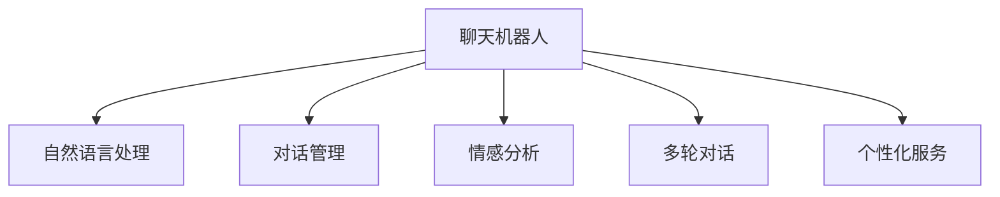

                 

# 聊天机器人客户服务：即时支持和帮助

> 关键词：聊天机器人,客户服务,即时响应,自然语言处理(NLP),情感分析,多轮对话,个性化服务,机器人平台,API

## 1. 背景介绍

### 1.1 问题由来
随着互联网的普及和电子商务的快速发展，企业面临的服务需求日益复杂。传统的客服方式，如电话、邮件等，存在响应时间长、人工成本高、无法24小时在线等缺点。而聊天机器人作为一种新型的客户服务手段，能够通过自动化和智能化的方式，提供即时、精准的客户支持，成为现代企业提升服务质量、降低运营成本的重要工具。

### 1.2 问题核心关键点
聊天机器人的核心在于通过自然语言处理(NLP)技术，自动理解客户输入的文本，并给出符合情境的回复。其关键技术点包括：

- 语音/文本识别：将客户的语音或文本输入转化为可处理的形式。
- 语义理解：理解客户输入的意图和语义，识别关键字、情感等关键信息。
- 对话管理：根据对话历史和语境，决定机器人的下一步动作。
- 知识库检索：根据客户问题，检索知识库中的相关答案。
- 自然语言生成：生成符合语法和语境的回复。

这些技术点相互交织，构成了一个完整的聊天机器人系统。本文将重点介绍如何构建一个能够提供即时支持和帮助的聊天机器人客户服务系统。

### 1.3 问题研究意义
聊天机器人客户服务系统，通过利用先进的NLP技术，使企业能够以更低的成本、更快的速度、更高的效率提供客户支持。它不仅能24小时不间断服务，还能通过持续学习，不断提高自身的服务水平和响应速度，成为提升客户满意度和企业竞争力的重要手段。

本文将详细介绍聊天机器人客户服务系统的构建方法，包括核心技术、开发环境搭建、源代码实现等，并结合实际应用场景，展示如何构建一个既高效又智能的聊天机器人。

## 2. 核心概念与联系

### 2.1 核心概念概述

为更好地理解聊天机器人客户服务系统的构建方法，本节将介绍几个关键概念：

- 聊天机器人(Chatbot)：通过NLP技术自动处理客户输入，并生成回复的系统。
- 自然语言处理(NLP)：涉及语言识别、理解、生成等多个方面的技术，是构建聊天机器人的核心。
- 对话管理(Dialing Management)：管理对话流程，确保机器人的回复符合情境和语境。
- 情感分析(Affective Analysis)：识别客户输入的情感倾向，以提供更个性化的服务。
- 多轮对话(Multi-turn Dialogue)：支持机器人和客户之间进行多轮信息交换，更深入地理解客户需求。
- 个性化服务(Personalization)：根据客户的历史行为和偏好，提供定制化的服务。

这些概念之间的逻辑关系可以通过以下Mermaid流程图来展示：



这个流程图展示了一些关键技术在聊天机器人客户服务系统中的作用：

1. 聊天机器人接收客户输入后，通过自然语言处理理解输入内容。
2. 对话管理根据语境和历史信息，决定机器人的回复。
3. 情感分析识别客户的情感倾向，以调整回复策略。
4. 多轮对话支持机器人和客户进行更深入的信息交换。
5. 个性化服务根据客户的历史行为和偏好，提供定制化服务。

这些概念共同构成了聊天机器人客户服务系统的核心技术框架。

## 3. 核心算法原理 & 具体操作步骤
### 3.1 算法原理概述

聊天机器人客户服务系统的核心算法，基于自然语言处理技术，通过理解客户输入并生成合适的回复，实现即时支持和帮助。其基本流程如下：

1. 客户输入：客户通过聊天界面或语音设备，输入问题和需求。
2. 自然语言处理：系统使用NLP技术，自动提取和理解客户输入的语义和情感。
3. 对话管理：根据客户输入和历史对话信息，系统确定机器人的回复。
4. 知识库检索：系统检索知识库中的相关答案，以生成回复。
5. 自然语言生成：系统根据回复模板和知识库结果，生成符合语法和语境的回复。
6. 输出回复：将回复输出给客户，完成一次对话循环。

以上流程在不断的迭代中，根据客户的反馈和系统的学习，不断优化和改进。

### 3.2 算法步骤详解

聊天机器人客户服务系统的构建，通常包括以下几个关键步骤：

**Step 1: 准备数据集和知识库**
- 收集和标注大量的客户服务数据，构建训练集和验证集。
- 准备知识库，包括常见问题、解决方案、产品信息等，以供机器人查询和回复。

**Step 2: 构建NLP模型**
- 选择合适的NLP模型，如BERT、GPT等，用于自然语言处理。
- 对模型进行预训练，以学习语言的知识表示。
- 在客户服务数据集上微调模型，以适应特定的任务需求。

**Step 3: 设计对话管理策略**
- 定义对话流程，包括机器人如何处理不同类型的输入。
- 实现对话管理策略，如上下文感知、意图识别等。

**Step 4: 实现情感分析**
- 识别客户输入的情感倾向，如快乐、愤怒、沮丧等。
- 根据情感分析结果，调整机器人的回复策略。

**Step 5: 集成知识库和回复生成**
- 集成知识库，使机器人能够根据客户问题检索相关答案。
- 设计回复生成模板，使机器人在检索知识库后，能够生成符合语法和语境的回复。

**Step 6: 部署和测试**
- 将聊天机器人部署到生产环境。
- 在实际使用中，不断收集用户反馈，优化和改进系统。

以上是构建聊天机器人客户服务系统的一般流程。在实际应用中，还需要针对具体任务进行优化设计，如改进自然语言处理模型、引入更丰富的对话管理策略等。

### 3.3 算法优缺点

聊天机器人客户服务系统具有以下优点：

1. 全天候服务：能够24小时不间断提供支持，满足客户随时随地的需求。
2. 成本低：相较于人工客服，聊天机器人可以大幅度降低企业的运营成本。
3. 响应快：能够即时处理客户输入，迅速提供解决方案。
4. 可扩展：能够根据企业需求和客户反馈，不断优化和改进。

同时，该方法也存在以下局限性：

1. 理解能力有限：目前的聊天机器人还无法完全理解人类语言的复杂性和多义性，存在误解或误导的风险。
2. 情感处理不足：对于情感复杂、语境模糊的客户输入，机器人可能无法提供合适的回复。
3. 知识更新慢：知识库需要定期更新，以应对新的问题和需求，更新速度较慢。
4. 需要高技术门槛：构建高质量的聊天机器人需要较高的技术门槛，包括数据处理、模型训练、系统集成等。
5. 用户体验单一：相较于人工客服的多样性和灵活性，聊天机器人可能无法提供更全面的服务体验。

尽管存在这些局限性，但随着NLP技术的不断进步，聊天机器人客户服务系统将在更多领域得到应用，为企业的客户支持带来新的变革。

### 3.4 算法应用领域

聊天机器人客户服务系统已经在多个领域得到广泛应用，例如：

- 电商平台：提供商品咨询、订单处理、售后支持等服务。
- 金融服务：提供账户查询、交易咨询、投诉处理等服务。
- 医疗保健：提供预约挂号、在线咨询、健康管理等服务。
- 旅游服务：提供行程预订、信息查询、客户反馈等服务。
- 教育培训：提供课程咨询、在线答疑、学习进度跟踪等服务。

除了上述这些经典应用外，聊天机器人客户服务系统还将在更多场景中发挥重要作用，如智能家居、能源管理、公共服务等领域，成为提升用户体验的重要工具。

## 4. 数学模型和公式 & 详细讲解  
### 4.1 数学模型构建

聊天机器人客户服务系统涉及到多个数学模型和算法，以下是其中的几个关键模型：

**1. 自然语言处理模型**
- 定义一个向量表示客户输入的自然语言文本，通常使用词嵌入技术将单词映射到高维向量空间中。
- 使用Transformer模型等深度学习架构，对输入进行编码，学习语言的知识表示。

**2. 对话管理模型**
- 定义一个状态转移模型，描述对话流程和上下文关系。
- 使用强化学习等方法，优化对话管理策略，使机器人在不同情境下作出最合适的回复。

**3. 情感分析模型**
- 定义一个情感分类器，识别客户输入的情感倾向。
- 使用分类算法如SVM、LSTM等，对客户情感进行分类和识别。

**4. 知识库检索模型**
- 定义一个向量表示知识库中的问题-答案对，通常使用向量相似度计算方法。
- 使用检索算法如BM25、TF-IDF等，在知识库中检索相关答案。

**5. 回复生成模型**
- 定义一个生成模型，如Seq2Seq、Transformer等，生成符合语法和语境的回复。
- 使用损失函数如交叉熵损失，训练生成模型，优化回复质量。

这些模型共同构成了聊天机器人客户服务系统的基础。下面以BERT模型为例，详细讲解其中的数学原理和公式推导。

### 4.2 公式推导过程

**BERT模型**
BERT模型是一种基于Transformer架构的自然语言处理模型，主要应用于文本分类和语言理解等任务。以下是对BERT模型的基本推导过程：

**BERT模型的构建**
BERT模型由两部分组成：Transformer编码器和预训练任务。其中，Transformer编码器用于对输入文本进行编码，预训练任务用于训练模型。

**编码器模块**
Transformer编码器由多个编码层组成，每个编码层包括自注意力机制和前馈神经网络。其中，自注意力机制用于捕捉输入序列中的长期依赖关系，前馈神经网络用于对编码结果进行非线性变换。

**预训练任务**
BERT模型通过两个预训练任务进行训练，分别是掩码语言模型和下一句预测。掩码语言模型用于学习单词之间的关系，下一句预测用于学习句子之间的关系。

**公式推导**
BERT模型的公式推导如下：

**输入表示**
输入文本 $x$ 被表示为一个词向量序列 $x=[x_1,x_2,\cdots,x_n]$，每个单词 $x_i$ 被表示为一个 $d$ 维向量 $x_i \in \mathbb{R}^d$。

**编码器模块**
Transformer编码器由多个编码层组成，每个编码层 $l$ 包括自注意力机制和前馈神经网络。设第 $l$ 层的输入表示为 $z^{[l-1]} \in \mathbb{R}^{n \times d}$，输出表示为 $z^{[l]} \in \mathbb{R}^{n \times d}$。

**自注意力机制**
自注意力机制用于捕捉输入序列中的长期依赖关系。设 $Q \in \mathbb{R}^{n \times d}, K \in \mathbb{R}^{n \times d}, V \in \mathbb{R}^{n \times d}$ 分别为查询、键、值向量，计算注意力权重 $a \in \mathbb{R}^{n \times n}$，并计算加权和向量 $Z \in \mathbb{R}^{n \times d}$。

**前馈神经网络**
前馈神经网络用于对编码结果进行非线性变换。设 $a^{[l]} \in \mathbb{R}^{n \times d}$ 为第 $l$ 层的注意力结果，通过前馈神经网络变换得到 $z^{[l]} \in \mathbb{R}^{n \times d}$。

**预训练任务**
BERT模型通过掩码语言模型和下一句预测两个预训练任务进行训练。掩码语言模型用于学习单词之间的关系，下一句预测用于学习句子之间的关系。

**掩码语言模型**
掩码语言模型用于学习单词之间的关系。设输入文本为 $x$，掩码比例为 $p$，随机掩码单词的位置为 $i$。设 $y_i^{[1]}$ 为原始单词向量，$y_i^{[2]}$ 为掩码后单词向量，$y_i^{[3]}$ 为还原后单词向量。计算掩码语言模型的损失函数 $\mathcal{L}_{m} = \sum_{i=1}^n \text{Log} P(y_i^{[3]} | y_i^{[1]}, y_i^{[2]})$。

**下一句预测**
下一句预测用于学习句子之间的关系。设输入文本为 $x$，下一句为 $y$，计算下一句预测的损失函数 $\mathcal{L}_{n} = -\sum_{i=1}^{n-1} P(y_i^{[2]} | y_i^{[1]}, y_{i+1}^{[1]})$。

通过上述公式，可以计算出BERT模型的损失函数 $\mathcal{L}_{\text{BERT}} = \mathcal{L}_{m} + \mathcal{L}_{n}$。通过优化损失函数，可以使模型学习到语言的知识表示。

## 5. 项目实践：代码实例和详细解释说明
### 5.1 开发环境搭建

在进行聊天机器人客户服务系统的开发前，我们需要准备好开发环境。以下是使用Python进行PyTorch开发的环境配置流程：

1. 安装Anaconda：从官网下载并安装Anaconda，用于创建独立的Python环境。

2. 创建并激活虚拟环境：
```bash
conda create -n pytorch-env python=3.8 
conda activate pytorch-env
```

3. 安装PyTorch：根据CUDA版本，从官网获取对应的安装命令。例如：
```bash
conda install pytorch torchvision torchaudio cudatoolkit=11.1 -c pytorch -c conda-forge
```

4. 安装TensorFlow：从官网下载并安装TensorFlow，或使用Anaconda安装：
```bash
conda install tensorflow -c conda-forge
```

5. 安装各类工具包：
```bash
pip install numpy pandas scikit-learn matplotlib tqdm jupyter notebook ipython
```

完成上述步骤后，即可在`pytorch-env`环境中开始开发实践。

### 5.2 源代码详细实现

这里我们以情感分析任务为例，给出使用Transformers库对BERT模型进行情感分析的PyTorch代码实现。

首先，定义情感分析任务的数据处理函数：

```python
from transformers import BertTokenizer
from torch.utils.data import Dataset
import torch

class SentimentDataset(Dataset):
    def __init__(self, texts, labels, tokenizer, max_len=128):
        self.texts = texts
        self.labels = labels
        self.tokenizer = tokenizer
        self.max_len = max_len
        
    def __len__(self):
        return len(self.texts)
    
    def __getitem__(self, item):
        text = self.texts[item]
        label = self.labels[item]
        
        encoding = self.tokenizer(text, return_tensors='pt', max_length=self.max_len, padding='max_length', truncation=True)
        input_ids = encoding['input_ids'][0]
        attention_mask = encoding['attention_mask'][0]
        
        # 将标签转化为向量表示
        label = torch.tensor([label2id[label]], dtype=torch.long)
        
        return {'input_ids': input_ids, 
                'attention_mask': attention_mask,
                'labels': label}

# 标签与id的映射
label2id = {'negative': 0, 'positive': 1}
id2label = {v: k for k, v in label2id.items()}

# 创建dataset
tokenizer = BertTokenizer.from_pretrained('bert-base-cased')

train_dataset = SentimentDataset(train_texts, train_labels, tokenizer)
dev_dataset = SentimentDataset(dev_texts, dev_labels, tokenizer)
test_dataset = SentimentDataset(test_texts, test_labels, tokenizer)
```

然后，定义模型和优化器：

```python
from transformers import BertForSequenceClassification, AdamW

model = BertForSequenceClassification.from_pretrained('bert-base-cased', num_labels=len(label2id))

optimizer = AdamW(model.parameters(), lr=2e-5)
```

接着，定义训练和评估函数：

```python
from torch.utils.data import DataLoader
from tqdm import tqdm
from sklearn.metrics import classification_report

device = torch.device('cuda') if torch.cuda.is_available() else torch.device('cpu')
model.to(device)

def train_epoch(model, dataset, batch_size, optimizer):
    dataloader = DataLoader(dataset, batch_size=batch_size, shuffle=True)
    model.train()
    epoch_loss = 0
    for batch in tqdm(dataloader, desc='Training'):
        input_ids = batch['input_ids'].to(device)
        attention_mask = batch['attention_mask'].to(device)
        labels = batch['labels'].to(device)
        model.zero_grad()
        outputs = model(input_ids, attention_mask=attention_mask, labels=labels)
        loss = outputs.loss
        epoch_loss += loss.item()
        loss.backward()
        optimizer.step()
    return epoch_loss / len(dataloader)

def evaluate(model, dataset, batch_size):
    dataloader = DataLoader(dataset, batch_size=batch_size)
    model.eval()
    preds, labels = [], []
    with torch.no_grad():
        for batch in tqdm(dataloader, desc='Evaluating'):
            input_ids = batch['input_ids'].to(device)
            attention_mask = batch['attention_mask'].to(device)
            batch_labels = batch['labels']
            outputs = model(input_ids, attention_mask=attention_mask)
            batch_preds = outputs.logits.argmax(dim=1).to('cpu').tolist()
            batch_labels = batch_labels.to('cpu').tolist()
            for pred, label in zip(batch_preds, batch_labels):
                preds.append(pred)
                labels.append(label)
                
    print(classification_report(labels, preds))
```

最后，启动训练流程并在测试集上评估：

```python
epochs = 5
batch_size = 16

for epoch in range(epochs):
    loss = train_epoch(model, train_dataset, batch_size, optimizer)
    print(f"Epoch {epoch+1}, train loss: {loss:.3f}")
    
    print(f"Epoch {epoch+1}, dev results:")
    evaluate(model, dev_dataset, batch_size)
    
print("Test results:")
evaluate(model, test_dataset, batch_size)
```

以上就是使用PyTorch对BERT进行情感分析任务微调的完整代码实现。可以看到，得益于Transformers库的强大封装，我们可以用相对简洁的代码完成BERT模型的加载和微调。

### 5.3 代码解读与分析

让我们再详细解读一下关键代码的实现细节：

**SentimentDataset类**：
- `__init__`方法：初始化文本、标签、分词器等关键组件。
- `__len__`方法：返回数据集的样本数量。
- `__getitem__`方法：对单个样本进行处理，将文本输入编码为token ids，将标签转化为数字，并对其进行定长padding，最终返回模型所需的输入。

**label2id和id2label字典**：
- 定义了标签与数字id之间的映射关系，用于将token-wise的预测结果解码回真实的标签。

**训练和评估函数**：
- 使用PyTorch的DataLoader对数据集进行批次化加载，供模型训练和推理使用。
- 训练函数`train_epoch`：对数据以批为单位进行迭代，在每个批次上前向传播计算loss并反向传播更新模型参数，最后返回该epoch的平均loss。
- 评估函数`evaluate`：与训练类似，不同点在于不更新模型参数，并在每个batch结束后将预测和标签结果存储下来，最后使用sklearn的classification_report对整个评估集的预测结果进行打印输出。

**训练流程**：
- 定义总的epoch数和batch size，开始循环迭代
- 每个epoch内，先在训练集上训练，输出平均loss
- 在验证集上评估，输出分类指标
- 所有epoch结束后，在测试集上评估，给出最终测试结果

可以看到，PyTorch配合Transformers库使得BERT微调的代码实现变得简洁高效。开发者可以将更多精力放在数据处理、模型改进等高层逻辑上，而不必过多关注底层的实现细节。

当然，工业级的系统实现还需考虑更多因素，如模型的保存和部署、超参数的自动搜索、更灵活的任务适配层等。但核心的微调范式基本与此类似。

## 6. 实际应用场景
### 6.1 智能客服系统

基于聊天机器人客户服务系统，可以构建智能客服系统，提升客户服务的效率和质量。智能客服系统能够自动理解客户输入，提供即时、个性化的回复，支持多轮对话，提高客户满意度。

在技术实现上，可以收集客户的历史查询和反馈，构建训练集和验证集。在此基础上对预训练模型进行微调，使机器人能够自动处理各种常见问题，如账户信息查询、订单处理、售后咨询等。同时，可以使用知识库检索技术，快速检索相关答案，提高处理速度。

### 6.2 金融客服

金融客服系统是智能客服的重要应用场景之一。通过聊天机器人客户服务系统，可以构建金融客服系统，提供账户查询、交易咨询、投诉处理等服务。

在实际应用中，可以构建金融知识库，包括账户管理、交易规则、投诉处理等。将客户输入的查询和请求，输入到预训练模型中进行情感分析和意图识别，再根据知识库检索相关答案，生成符合语境的回复。金融客服系统不仅可以24小时不间断服务，还能通过持续学习，不断提高服务质量和响应速度。

### 6.3 医疗咨询

医疗咨询系统是智能客服的另一个重要应用场景。通过聊天机器人客户服务系统，可以构建医疗咨询系统，提供在线诊疗、健康咨询、用药建议等服务。

在技术实现上，可以构建医疗知识库，包括疾病诊断、用药指南、健康建议等。将客户输入的查询和请求，输入到预训练模型中进行情感分析和意图识别，再根据知识库检索相关答案，生成符合语境的回复。医疗咨询系统不仅可以提供24小时不间断服务，还能通过持续学习，不断提高服务质量和响应速度。

### 6.4 电商客服

电商客服系统是智能客服的重要应用场景之一。通过聊天机器人客户服务系统，可以构建电商客服系统，提供商品咨询、订单处理、售后支持等服务。

在技术实现上，可以构建电商知识库，包括商品信息、订单处理、售后政策等。将客户输入的查询和请求，输入到预训练模型中进行情感分析和意图识别，再根据知识库检索相关答案，生成符合语境的回复。电商客服系统不仅可以24小时不间断服务，还能通过持续学习，不断提高服务质量和响应速度。

## 7. 工具和资源推荐
### 7.1 学习资源推荐

为了帮助开发者系统掌握聊天机器人客户服务系统的理论基础和实践技巧，这里推荐一些优质的学习资源：

1. 《深度学习入门：基于Python的理论与实现》系列博文：由大模型技术专家撰写，深入浅出地介绍了深度学习的基本原理和实现方法，包括自然语言处理和对话管理等内容。

2. 《自然语言处理入门》课程：北京大学开设的NLP明星课程，有Lecture视频和配套作业，带你入门NLP领域的基本概念和经典模型。

3. 《自然语言处理技术与应用》书籍：清华大学出版社出版的NLP经典教材，涵盖NLP的基础理论和实践方法，适合NLP入门学习和系统构建。

4. 《Hands-On Text Mining with Python》书籍：使用Python进行文本挖掘的实战教程，适合NLP实战开发和项目实践。

5. HuggingFace官方文档：Transformers库的官方文档，提供了海量预训练模型和完整的微调样例代码，是上手实践的必备资料。

通过对这些资源的学习实践，相信你一定能够快速掌握聊天机器人客户服务系统的精髓，并用于解决实际的客户服务问题。
###  7.2 开发工具推荐

高效的开发离不开优秀的工具支持。以下是几款用于聊天机器人客户服务系统开发的常用工具：

1. PyTorch：基于Python的开源深度学习框架，灵活动态的计算图，适合快速迭代研究。大部分预训练语言模型都有PyTorch版本的实现。

2. TensorFlow：由Google主导开发的开源深度学习框架，生产部署方便，适合大规模工程应用。同样有丰富的预训练语言模型资源。

3. Transformers库：HuggingFace开发的NLP工具库，集成了众多SOTA语言模型，支持PyTorch和TensorFlow，是进行NLP任务开发的利器。

4. Weights & Biases：模型训练的实验跟踪工具，可以记录和可视化模型训练过程中的各项指标，方便对比和调优。与主流深度学习框架无缝集成。

5. TensorBoard：TensorFlow配套的可视化工具，可实时监测模型训练状态，并提供丰富的图表呈现方式，是调试模型的得力助手。

6. Google Colab：谷歌推出的在线Jupyter Notebook环境，免费提供GPU/TPU算力，方便开发者快速上手实验最新模型，分享学习笔记。

合理利用这些工具，可以显著提升聊天机器人客户服务系统的开发效率，加快创新迭代的步伐。

### 7.3 相关论文推荐

聊天机器人客户服务系统的发展源于学界的持续研究。以下是几篇奠基性的相关论文，推荐阅读：

1. Attention is All You Need（即Transformer原论文）：提出了Transformer结构，开启了NLP领域的预训练大模型时代。

2. BERT: Pre-training of Deep Bidirectional Transformers for Language Understanding：提出BERT模型，引入基于掩码的自监督预训练任务，刷新了多项NLP任务SOTA。

3. Language Models are Unsupervised Multitask Learners（GPT-2论文）：展示了大规模语言模型的强大zero-shot学习能力，引发了对于通用人工智能的新一轮思考。

4. Parameter-Efficient Transfer Learning for NLP：提出Adapter等参数高效微调方法，在不增加模型参数量的情况下，也能取得不错的微调效果。

5. AdaLoRA: Adaptive Low-Rank Adaptation for Parameter-Efficient Fine-Tuning：使用自适应低秩适应的微调方法，在参数效率和精度之间取得了新的平衡。

6. Seq2Seq to Transformer: A Survey and Tasks Specifically for Customer Service Chatbots：综述了Seq2Seq和Transformer在客服聊天机器人中的应用，提供丰富的实践参考。

这些论文代表了大语言模型微调技术的发展脉络。通过学习这些前沿成果，可以帮助研究者把握学科前进方向，激发更多的创新灵感。

## 8. 总结：未来发展趋势与挑战

### 8.1 总结

本文对聊天机器人客户服务系统的构建方法进行了全面系统的介绍。首先阐述了聊天机器人客户服务系统的研究背景和意义，明确了微调在拓展预训练模型应用、提升下游任务性能方面的独特价值。其次，从原理到实践，详细讲解了聊天机器人客户服务系统的数学原理和关键步骤，给出了微调任务开发的完整代码实例。同时，本文还广泛探讨了聊天机器人客户服务系统在智能客服、金融客服、医疗咨询等多个行业领域的应用前景，展示了聊天机器人客户服务系统的巨大潜力。最后，本文精选了聊天机器人客户服务系统的学习资源，力求为读者提供全方位的技术指引。

通过本文的系统梳理，可以看到，聊天机器人客户服务系统通过利用先进的NLP技术，能够实现即时支持和帮助，成为现代企业提升服务质量、降低运营成本的重要工具。未来，伴随NLP技术的不断进步，聊天机器人客户服务系统将在更多领域得到应用，为企业的客户支持带来新的变革。

### 8.2 未来发展趋势

展望未来，聊天机器人客户服务系统将呈现以下几个发展趋势：

1. 多模态交互：除了文本信息，未来的聊天机器人将支持语音、图像、视频等多种形式的输入输出，实现更加自然和直观的交互体验。

2. 个性化服务：基于用户的实时行为和偏好，聊天机器人将能够提供更个性化的服务，如推荐商品、制定行程等，提升用户体验。

3. 智能推荐：通过分析用户的查询和反馈，聊天机器人将能够提供更精准的推荐服务，提高用户满意度。

4. 实时学习：未来的聊天机器人将具备实时学习的能力，根据用户的反馈和新的数据，不断优化和改进，提高服务质量和响应速度。

5. 知识融合：未来的聊天机器人将能够融合多种知识库，如百科全书、专家数据库等，提供更全面的信息支持。

6. 自动化流程：未来的聊天机器人将能够自动化处理更多的业务流程，如订单处理、投诉处理等，提升企业的运营效率。

以上趋势凸显了聊天机器人客户服务系统的广阔前景。这些方向的探索发展，必将进一步提升聊天机器人客户服务系统的性能和应用范围，为企业的客户支持带来新的变革。

### 8.3 面临的挑战

尽管聊天机器人客户服务系统已经取得了显著成效，但在迈向更加智能化、普适化应用的过程中，它仍面临着诸多挑战：

1. 理解能力不足：当前的聊天机器人还无法完全理解人类语言的复杂性和多义性，存在误解或误导的风险。

2. 情感处理不足：对于情感复杂、语境模糊的客户输入，机器人可能无法提供合适的回复。

3. 知识更新慢：知识库需要定期更新，以应对新的问题和需求，更新速度较慢。

4. 技术门槛高：构建高质量的聊天机器人需要较高的技术门槛，包括数据处理、模型训练、系统集成等。

5. 用户体验单一：相较于人工客服的多样性和灵活性，聊天机器人可能无法提供更全面的服务体验。

尽管存在这些局限性，但随着NLP技术的不断进步，聊天机器人客户服务系统将在更多领域得到应用，为企业的客户支持带来新的变革。相信随着学界和产业界的共同努力，这些挑战终将一一被克服，聊天机器人客户服务系统必将在构建人机协同的智能时代中扮演越来越重要的角色。

### 8.4 研究展望

面对聊天机器人客户服务系统所面临的挑战，未来的研究需要在以下几个方面寻求新的突破：

1. 探索无监督和半监督微调方法。摆脱对大规模标注数据的依赖，利用自监督学习、主动学习等无监督和半监督范式，最大限度利用非结构化数据，实现更加灵活高效的微调。

2. 研究参数高效和计算高效的微调范式。开发更加参数高效的微调方法，在固定大部分预训练参数的同时，只更新极少量的任务相关参数。同时优化微调模型的计算图，减少前向传播和反向传播的资源消耗，实现更加轻量级、实时性的部署。

3. 融合因果和对比学习范式。通过引入因果推断和对比学习思想，增强聊天机器人客户服务系统建立稳定因果关系的能力，学习更加普适、鲁棒的语言表征，从而提升模型泛化性和抗干扰能力。

4. 引入更多先验知识。将符号化的先验知识，如知识图谱、逻辑规则等，与神经网络模型进行巧妙融合，引导微调过程学习更准确、合理的语言模型。同时加强不同模态数据的整合，实现视觉、语音等多模态信息与文本信息的协同建模。

5. 结合因果分析和博弈论工具。将因果分析方法引入聊天机器人客户服务系统，识别出系统决策的关键特征，增强输出解释的因果性和逻辑性。借助博弈论工具刻画人机交互过程，主动探索并规避系统的脆弱点，提高系统稳定性。

6. 纳入伦理道德约束。在模型训练目标中引入伦理导向的评估指标，过滤和惩罚有偏见、有害的输出倾向。同时加强人工干预和审核，建立模型行为的监管机制，确保输出符合人类价值观和伦理道德。

这些研究方向的探索，必将引领聊天机器人客户服务系统迈向更高的台阶，为构建安全、可靠、可解释、可控的智能系统铺平道路。面向未来，聊天机器人客户服务系统还需要与其他人工智能技术进行更深入的融合，如知识表示、因果推理、强化学习等，多路径协同发力，共同推动自然语言理解和智能交互系统的进步。只有勇于创新、敢于突破，才能不断拓展语言模型的边界，让智能技术更好地造福人类社会。

## 9. 附录：常见问题与解答

**Q1：聊天机器人客户服务系统如何提高理解能力？**

A: 提高聊天机器人客户服务系统的理解能力，主要可以从以下几个方面入手：

1. 使用更强大的预训练模型：如BERT、GPT等，这些模型在大规模语料上进行了自监督预训练，具有较强的语言理解能力。

2. 增强数据标注：收集更多的标注数据，并对标注数据进行精细化处理，提高模型的训练效果。

3. 引入多模态信息：如语音、图像等，丰富模型的输入信息，提高理解的全面性。

4. 优化模型架构：采用更先进的深度学习架构，如Transformer，增强模型的理解能力。

5. 引入因果推断：通过引入因果推断方法，增强模型的解释能力，使其能够更好地理解语境和因果关系。

**Q2：如何提高聊天机器人客户服务系统的回复质量？**

A: 提高聊天机器人客户服务系统的回复质量，主要可以从以下几个方面入手：

1. 使用更强大的预训练模型：如BERT、GPT等，这些模型在大规模语料上进行了自监督预训练，具有较强的语言生成能力。

2. 优化回复生成算法：采用更先进的回复生成算法，如Seq2Seq、Transformer等，提高生成文本的质量。

3. 引入多轮对话机制：支持多轮对话，使机器人能够更好地理解客户的意图和语境，提高回复的准确性。

4. 优化知识库检索：使用更高效的检索算法，如BM25、TF-IDF等，提高知识库检索的准确性。

5. 引入知识融合机制：融合多种知识库，如百科全书、专家数据库等，提供更全面的信息支持。

**Q3：如何提高聊天机器人客户服务系统的实时学习能力？**

A: 提高聊天机器人客户服务系统的实时学习能力，主要可以从以下几个方面入手：

1. 引入在线学习机制：通过在线学习机制，使系统能够实时更新和优化模型参数，适应新的数据和任务。

2. 使用在线优化算法：如在线梯度下降算法，实时更新模型参数，提高学习效率。

3. 引入知识图谱：通过知识图谱，使系统能够更好地理解语境和因果关系，提高学习的准确性。

4. 引入实时监控机制：实时监控系统的运行情况，及时发现和解决问题，提高系统的稳定性和可靠性。

5. 引入用户反馈机制：通过用户反馈机制，使系统能够根据用户的反馈进行优化，提高系统的适应性和灵活性。

**Q4：如何提高聊天机器人客户服务系统的多模态交互能力？**

A: 提高聊天机器人客户服务系统的多模态交互能力，主要可以从以下几个方面入手：

1. 引入多模态数据：收集和处理多模态数据，如语音、图像、视频等，提高系统的输入多样性。

2. 使用多模态预训练模型：使用多模态预训练模型，如ViT、MMDet等，提高系统的多模态处理能力。

3. 优化多模态融合算法：采用更先进的多模态融合算法，如跨模态注意力机制，提高系统的多模态理解能力。

4. 引入多模态标注数据：收集和标注多模态数据，提高系统的训练效果。

5. 引入多模态知识库：构建多模态知识库，提供更全面的信息支持。

**Q5：如何提高聊天机器人客户服务系统的知识更新速度？**

A: 提高聊天机器人客户服务系统的知识更新速度，主要可以从以下几个方面入手：

1. 引入知识图谱：通过知识图谱，使系统能够快速检索和更新知识库，提高知识更新速度。

2. 引入在线知识更新机制：通过在线知识更新机制，使系统能够实时更新知识库，提高知识更新速度。

3. 引入知识标注机制：通过知识标注机制，使系统能够自动标注和更新知识库，提高知识更新效率。

4. 引入知识融合机制：通过知识融合机制，使系统能够整合多种知识库，提高知识更新速度。

5. 引入知识推理机制：通过知识推理机制，使系统能够自动推理和更新知识库，提高知识更新速度。

---

作者：禅与计算机程序设计艺术 / Zen and the Art of Computer Programming

