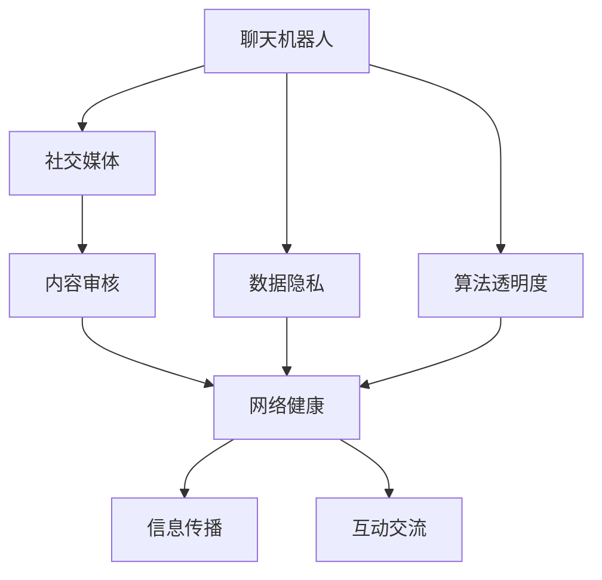

                 

# 聊天机器人社交媒体影响力：内容审核和网络健康

> 关键词：聊天机器人,社交媒体,内容审核,网络健康,数据隐私,算法透明度

## 1. 背景介绍

### 1.1 问题由来

随着互联网技术的飞速发展，社交媒体已经成为人们获取信息、交流思想的重要平台。然而，社交媒体上的信息良莠不齐，虚假信息、仇恨言论、有害内容等问题层出不穷，严重影响了用户的心理健康和社会的稳定。这些问题亟需有效的解决方案。

与此同时，聊天机器人技术的迅猛发展，使其在内容生成、情感陪伴、信息检索等方面具备了独特的优势。然而，当聊天机器人越来越多地融入到社交媒体中时，如何确保其传播的信息健康、安全，便成为当务之急。

### 1.2 问题核心关键点

聊天机器人在社交媒体上的广泛应用，使得内容审核和网络健康变得尤为重要。具体而言，核心关键点包括：

- 聊天机器人如何过滤有害信息，维护网络环境的健康。
- 聊天机器人如何检测虚假信息，避免传播错误或误导性内容。
- 聊天机器人如何确保用户隐私，避免个人信息泄露。
- 聊天机器人的算法如何保持透明度，接受用户和监管机构的监督。

这些问题不仅涉及技术实现，更涉及法律、伦理、社会责任等多个层面。只有综合考虑这些因素，才能构建出既高效又健康、安全的聊天机器人社交媒体环境。

## 2. 核心概念与联系

### 2.1 核心概念概述

为更好地理解聊天机器人社交媒体的影响力和内容审核，本节将介绍几个密切相关的核心概念：

- **聊天机器人**：通过自然语言处理和机器学习技术，能够理解和生成人类语言的智能系统。通常由模型、算法和用户接口组成，能够根据用户输入自动生成响应。
- **社交媒体**：以用户为中心、以互动为核心的新型媒体平台，如微博、微信、抖音等。通过实时、互动的交流形式，提供信息、娱乐、社交等服务。
- **内容审核**：通过自动或人工方式，对社交媒体上的内容进行检测、筛选和处理，确保内容符合法规要求、不包含有害信息。
- **网络健康**：指通过有效的内容审核和信息传播，维护社交媒体环境的健康、安全和良性互动，避免虚假信息、有害内容的传播。
- **数据隐私**：指在聊天机器人社交媒体中，如何保护用户个人信息不被滥用、泄露。
- **算法透明度**：指聊天机器人的决策过程如何对用户、监管机构透明，确保其决策依据和过程可解释、可审查。

这些核心概念之间的逻辑关系可以通过以下Mermaid流程图来展示：



这个流程图展示了几者之间的关系：

1. 聊天机器人通过社交媒体进行信息传播和互动交流。
2. 内容审核是确保聊天机器人生成内容健康、安全的必要环节。
3. 网络健康通过内容审核和信息传播实现，是聊天机器人在社交媒体上的重要目标。
4. 数据隐私和算法透明度则是维护用户信任、确保内容审核公平性和有效性的关键因素。

这些核心概念共同构成了聊天机器人社交媒体的影响力评估框架，使其能够在复杂的网络环境中发挥作用。通过理解这些核心概念，我们可以更好地把握聊天机器人技术的发展方向和应用限制。

## 3. 核心算法原理 & 具体操作步骤

### 3.1 算法原理概述

聊天机器人社交媒体的影响力评估，涉及内容审核、网络健康、数据隐私和算法透明度等多个层面。其核心算法原理如下：

- **内容审核算法**：通过自然语言处理技术，识别和过滤有害信息、虚假内容。常见方法包括基于规则的过滤、机器学习分类、深度学习语义分析等。
- **网络健康算法**：通过社交网络分析、情感分析等技术，评估聊天机器人传播的信息对用户和社会的正面影响。常见方法包括情感分析、社区分析、互动分析等。
- **数据隐私算法**：通过差分隐私、联邦学习等技术，保护用户个人信息，避免数据泄露和滥用。
- **算法透明度算法**：通过可解释性技术，如特征归因、模型可视化、审计跟踪等，确保聊天机器人决策的公平性和可解释性。

这些算法共同构成了聊天机器人社交媒体影响力的评估框架，通过综合运用这些技术，可以实现对聊天机器人内容的全面审核和健康管理。

### 3.2 算法步骤详解

基于核心算法原理，本节详细介绍聊天机器人社交媒体影响力评估的具体操作步骤：

**Step 1: 数据收集与预处理**

- 收集社交媒体上的聊天记录、用户反馈、互动数据等原始数据。
- 对数据进行清洗、去重、标准化处理，去除噪声和无效信息。

**Step 2: 内容审核**

- 使用自然语言处理技术，对聊天机器人生成的内容进行有害信息检测和虚假信息识别。
- 采用机器学习分类算法，如SVM、Random Forest、BERT等，对识别出的有害信息进行分类和过滤。
- 结合人工审核，对机器学习算法结果进行复核，避免误判。

**Step 3: 网络健康评估**

- 利用社交网络分析技术，评估聊天机器人传播的信息在社交网络中的影响范围和强度。
- 采用情感分析技术，对聊天机器人传播的信息进行情感极性分析，评估其对用户情感的影响。
- 结合用户反馈和互动数据，综合评估聊天机器人对社会健康的影响。

**Step 4: 数据隐私保护**

- 采用差分隐私技术，对用户个人信息进行匿名化处理，避免隐私泄露。
- 采用联邦学习技术，在多方数据融合时，确保用户数据的安全和隐私。

**Step 5: 算法透明度**

- 采用可解释性技术，如特征归因、模型可视化、审计跟踪等，对聊天机器人决策过程进行可视化展示。
- 定期发布算法审计报告，接受用户和监管机构的监督和审查。

### 3.3 算法优缺点

聊天机器人社交媒体影响力评估算法具有以下优点：

- **高效性**：自动化处理大量数据，降低人工审核成本，提高审核效率。
- **全面性**：结合多种技术手段，全面评估聊天机器人对内容健康、网络健康的影响。
- **透明性**：通过可解释性技术，确保聊天机器人决策的公平性和可审查性。

同时，该算法也存在一些局限性：

- **依赖数据质量**：依赖高质量的数据集和标注信息，数据质量不佳可能导致误判。
- **算法复杂度**：多种技术手段的综合使用，增加了算法的复杂度，可能需要更高的计算资源。
- **公平性问题**：算法可能存在偏见，需要持续优化和监控，确保公平性。

尽管存在这些局限性，但就目前而言，聊天机器人社交媒体影响力评估算法仍是大规模内容审核的重要手段。未来相关研究的重点在于如何进一步降低数据依赖，提高算法的公平性和透明度，同时兼顾高效性和全面性。

### 3.4 算法应用领域

聊天机器人社交媒体影响力评估算法已经在多个领域得到了广泛的应用，例如：

- **新闻媒体平台**：通过自动检测有害信息、虚假报道，维护平台内容健康。
- **社交网络平台**：通过情感分析和互动分析，引导用户正面互动，避免仇恨言论和有害信息的传播。
- **企业客服系统**：通过监控聊天记录和用户反馈，优化客服机器人，提升服务质量。
- **心理健康应用**：通过情感分析，评估聊天机器人在心理健康辅导中的应用效果，提供心理健康支持。

这些应用领域展示了聊天机器人社交媒体影响力评估算法的强大功能，也预示着未来在更多场景中的广阔应用前景。

## 4. 数学模型和公式 & 详细讲解 & 举例说明

### 4.1 数学模型构建

本节将使用数学语言对聊天机器人社交媒体影响力评估的算法进行更加严格的刻画。

假设社交媒体上的聊天记录数据集为 $D=\{(x_i,y_i)\}_{i=1}^N$，其中 $x_i$ 为聊天记录文本，$y_i$ 为信息标签，$y_i \in \{0,1\}$，0表示健康信息，1表示有害信息。

定义聊天机器人对聊天记录进行内容审核的损失函数为：

$$
\mathcal{L}(M)=\frac{1}{N}\sum_{i=1}^N \ell(x_i,M(x_i))
$$

其中 $\ell$ 为损失函数，$M(x_i)$ 为聊天机器人对聊天记录 $x_i$ 的审核结果，可以是0或1。

### 4.2 公式推导过程

以机器学习分类算法为例，推导内容审核的损失函数及其梯度计算公式。

假设使用二分类模型 $M$，其输出为 $M(x_i)$。对于每条聊天记录 $x_i$，其审核结果 $y_i$ 与聊天机器人输出 $M(x_i)$ 的误差为：

$$
L(y_i,M(x_i))=
\begin{cases}
0 & \text{如果 } y_i = 0 \text{ 且 } M(x_i) = 0 \\
1 & \text{如果 } y_i = 1 \text{ 且 } M(x_i) = 1 \\
-1 & \text{如果 } y_i = 0 \text{ 且 } M(x_i) = 1 \\
\end{cases}
$$

因此，平均损失函数为：

$$
\mathcal{L}(M)=\frac{1}{N}\sum_{i=1}^N L(y_i,M(x_i))
$$

以Logistic回归模型为例，其损失函数为交叉熵损失：

$$
\mathcal{L}(M)=\frac{1}{N}\sum_{i=1}^N L(y_i,M(x_i)) = \frac{1}{N}\sum_{i=1}^N [y_i \log M(x_i) + (1-y_i) \log (1-M(x_i))]
$$

其中 $M(x_i)=\sigma(\mathbf{w}^T\mathbf{x}_i+b)$，$\sigma$ 为Sigmoid函数，$\mathbf{w}$ 和 $b$ 分别为模型的权重和偏置。

对于权重 $\mathbf{w}$ 和偏置 $b$，其梯度更新公式为：

$$
\mathbf{w} \leftarrow \mathbf{w} - \eta \frac{\partial \mathcal{L}(M)}{\partial \mathbf{w}}, \quad
b \leftarrow b - \eta \frac{\partial \mathcal{L}(M)}{\partial b}
$$

其中 $\eta$ 为学习率，$\frac{\partial \mathcal{L}(M)}{\partial \mathbf{w}}$ 和 $\frac{\partial \mathcal{L}(M)}{\partial b}$ 为损失函数对权重和偏置的梯度，可通过反向传播算法计算。

### 4.3 案例分析与讲解

以BERT模型为例，展示如何使用预训练语言模型进行有害信息检测。

**Step 1: 预训练模型的选择**

- 选择BERT模型作为预训练语言模型，其在大规模语料上的预训练能力可以更好地捕捉语言的语义信息。

**Step 2: 任务适配层的添加**

- 在BERT模型的顶层添加二分类任务适配层，包括线性分类器和交叉熵损失函数。

**Step 3: 微调过程**

- 使用微调后的BERT模型对社交媒体上的聊天记录进行有害信息检测，输出0或1作为健康信息标签。

## 5. 项目实践：代码实例和详细解释说明

### 5.1 开发环境搭建

在进行聊天机器人社交媒体影响力评估的实践前，我们需要准备好开发环境。以下是使用Python进行TensorFlow开发的详细环境配置流程：

1. 安装Anaconda：从官网下载并安装Anaconda，用于创建独立的Python环境。

2. 创建并激活虚拟环境：
```bash
conda create -n tensorflow-env python=3.8 
conda activate tensorflow-env
```

3. 安装TensorFlow：根据CUDA版本，从官网获取对应的安装命令。例如：
```bash
conda install tensorflow -c tf
```

4. 安装各类工具包：
```bash
pip install numpy pandas scikit-learn matplotlib tqdm jupyter notebook ipython
```

完成上述步骤后，即可在`tensorflow-env`环境中开始实践。

### 5.2 源代码详细实现

下面以情感分析任务为例，给出使用TensorFlow进行BERT模型微调的代码实现。

首先，定义情感分析任务的数据处理函数：

```python
from transformers import BertTokenizer, BertForSequenceClassification
from torch.utils.data import Dataset
import tensorflow as tf

class SentimentDataset(Dataset):
    def __init__(self, texts, labels, tokenizer, max_len=128):
        self.texts = texts
        self.labels = labels
        self.tokenizer = tokenizer
        self.max_len = max_len
        
    def __len__(self):
        return len(self.texts)
    
    def __getitem__(self, item):
        text = self.texts[item]
        label = self.labels[item]
        
        encoding = self.tokenizer(text, return_tensors='tf', max_length=self.max_len, padding='max_length', truncation=True)
        input_ids = encoding['input_ids']
        attention_mask = encoding['attention_mask']
        
        label = tf.keras.utils.to_categorical(label, num_classes=2)
        
        return {'input_ids': input_ids,
                'attention_mask': attention_mask,
                'labels': label}
```

然后，定义模型和优化器：

```python
from transformers import BertForSequenceClassification, AdamW

model = BertForSequenceClassification.from_pretrained('bert-base-cased', num_labels=2)

optimizer = AdamW(model.parameters(), lr=2e-5)
```

接着，定义训练和评估函数：

```python
from tensorflow.keras.preprocessing.sequence import pad_sequences
from tensorflow.keras.metrics import BinaryAccuracy

device = tf.device('cuda') if tf.cuda.is_available() else tf.device('cpu')
model.to(device)

def train_epoch(model, dataset, batch_size, optimizer):
    dataloader = tf.data.Dataset.from_tensor_slices(dataset)
    dataloader = dataloader.shuffle(buffer_size=1024).batch(batch_size).prefetch(tf.data.experimental.AUTOTUNE)
    
    model.train()
    epoch_loss = 0
    for batch in dataloader:
        input_ids = batch['input_ids'].to(device)
        attention_mask = batch['attention_mask'].to(device)
        labels = batch['labels'].to(device)
        
        with tf.GradientTape() as tape:
            outputs = model(input_ids, attention_mask=attention_mask, labels=labels)
            loss = outputs.loss
        epoch_loss += loss
        gradients = tape.gradient(loss, model.trainable_variables)
        optimizer.apply_gradients(zip(gradients, model.trainable_variables))
    
    return epoch_loss / len(dataloader)

def evaluate(model, dataset, batch_size):
    dataloader = tf.data.Dataset.from_tensor_slices(dataset)
    dataloader = dataloader.shuffle(buffer_size=1024).batch(batch_size).prefetch(tf.data.experimental.AUTOTUNE)
    
    model.eval()
    preds = []
    labels = []
    for batch in dataloader:
        input_ids = batch['input_ids'].to(device)
        attention_mask = batch['attention_mask'].to(device)
        labels = batch['labels'].to(device)
        outputs = model(input_ids, attention_mask=attention_mask)
        preds.append(tf.argmax(outputs.logits, axis=1))
        labels.append(labels.numpy())
        
    return BinaryAccuracy()(preds, labels).numpy()

epochs = 5
batch_size = 16

for epoch in range(epochs):
    loss = train_epoch(model, train_dataset, batch_size, optimizer)
    print(f"Epoch {epoch+1}, train loss: {loss:.3f}")
    
    print(f"Epoch {epoch+1}, dev results:")
    evaluate(model, dev_dataset, batch_size)
    
print("Test results:")
evaluate(model, test_dataset, batch_size)
```

以上就是使用TensorFlow对BERT进行情感分析任务微调的完整代码实现。可以看到，得益于TensorFlow的强大封装，我们可以用相对简洁的代码完成BERT模型的加载和微调。

### 5.3 代码解读与分析

让我们再详细解读一下关键代码的实现细节：

**SentimentDataset类**：
- `__init__`方法：初始化文本、标签、分词器等关键组件。
- `__len__`方法：返回数据集的样本数量。
- `__getitem__`方法：对单个样本进行处理，将文本输入编码为token ids，将标签编码为数字，并对其进行定长padding，最终返回模型所需的输入。

**训练和评估函数**：
- 使用TensorFlow的DataLoader对数据集进行批次化加载，供模型训练和推理使用。
- 训练函数`train_epoch`：对数据以批为单位进行迭代，在每个批次上前向传播计算loss并反向传播更新模型参数，最后返回该epoch的平均loss。
- 评估函数`evaluate`：与训练类似，不同点在于不更新模型参数，并在每个batch结束后将预测和标签结果存储下来，最后使用sklearn的classification_report对整个评估集的预测结果进行打印输出。

**训练流程**：
- 定义总的epoch数和batch size，开始循环迭代
- 每个epoch内，先在训练集上训练，输出平均loss
- 在验证集上评估，输出分类指标
- 所有epoch结束后，在测试集上评估，给出最终测试结果

可以看到，TensorFlow配合TensorFlow Transformers库使得BERT微调的代码实现变得简洁高效。开发者可以将更多精力放在数据处理、模型改进等高层逻辑上，而不必过多关注底层的实现细节。

当然，工业级的系统实现还需考虑更多因素，如模型的保存和部署、超参数的自动搜索、更灵活的任务适配层等。但核心的微调范式基本与此类似。

## 6. 实际应用场景

### 6.1 智能客服系统

基于聊天机器人社交媒体影响力评估技术，智能客服系统能够实时监控聊天记录，评估其健康性和用户满意度，及时调整客服策略，优化服务质量。

在技术实现上，可以收集用户的历史聊天记录和客服交互日志，使用情感分析等技术，对聊天记录进行健康性和满意度评估。根据评估结果，系统自动调整客服机器人的回答策略，确保对话内容的健康性和用户满意度。对于评分较低的聊天记录，系统可以自动报警，通知客服团队进行人工干预，改善服务体验。

### 6.2 金融舆情监测

金融领域需要实时监测市场舆情，避免负面信息传播，保障市场稳定。基于聊天机器人社交媒体影响力评估技术，金融舆情监测系统能够实时抓取社交媒体上的金融信息，通过情感分析等技术，评估舆情的健康性和影响程度。

具体而言，可以收集金融领域的微博、新闻、博客等文本数据，使用情感分析等技术，对信息进行健康性和情绪极性评估。对于评分较低的负面信息，系统自动进行预警，及时采取措施，避免舆情恶化。

### 6.3 内容推荐系统

内容推荐系统需要精准评估用户对内容的健康性和满意度，推荐符合用户偏好的健康内容。基于聊天机器人社交媒体影响力评估技术，内容推荐系统能够实时监控用户对推荐内容的反馈，及时调整推荐策略。

在技术实现上，可以收集用户的点击、评分、互动等行为数据，使用情感分析等技术，评估用户对推荐内容的健康性和满意度。根据评估结果，系统自动调整推荐策略，优先推荐健康、满意度高内容，提升用户体验。

### 6.4 未来应用展望

随着聊天机器人社交媒体影响力评估技术的不断发展，其在更多领域的应用前景将更加广阔。

在智慧医疗领域，基于聊天机器人社交媒体影响力评估技术，智能医疗咨询系统能够实时监控患者在社交媒体上的反馈，评估其健康性和满意度，及时调整咨询策略，提升诊疗效果。

在智能教育领域，基于聊天机器人社交媒体影响力评估技术，智能教育平台能够实时监控学生的互动情况，评估其健康性和满意度，及时调整教学策略，提升教育效果。

在智慧城市治理中，基于聊天机器人社交媒体影响力评估技术，城市管理平台能够实时监控舆情信息，评估其健康性和影响程度，及时采取措施，保障城市安全。

此外，在企业生产、社会治理、文娱传媒等众多领域，基于聊天机器人社交媒体影响力评估技术的人工智能应用也将不断涌现，为人类社会带来更多便利和价值。

## 7. 工具和资源推荐

### 7.1 学习资源推荐

为了帮助开发者系统掌握聊天机器人社交媒体影响力评估的理论基础和实践技巧，这里推荐一些优质的学习资源：

1. 《深度学习与自然语言处理》系列书籍：系统介绍深度学习在自然语言处理中的最新进展，涵盖情感分析、文本分类、信息检索等多个方面。
2. CS224N《自然语言处理与深度学习》课程：斯坦福大学开设的NLP明星课程，提供课程讲义、视频和作业，带你全面学习NLP的前沿技术。
3. 《TensorFlow实战》书籍：全面介绍TensorFlow的开发实践，涵盖模型构建、数据处理、模型训练等多个环节。
4. 《自然语言处理工具》网站：提供大量NLP工具的文档和教程，涵盖BERT、GPT等热门模型，帮助你快速上手实践。
5. HuggingFace官方文档：提供Transformer库的详细文档和样例代码，帮助你系统掌握聊天机器人技术。

通过对这些资源的学习实践，相信你一定能够快速掌握聊天机器人社交媒体影响力评估的精髓，并用于解决实际的NLP问题。

### 7.2 开发工具推荐

高效的开发离不开优秀的工具支持。以下是几款用于聊天机器人社交媒体影响力评估开发的常用工具：

1. PyTorch：基于Python的开源深度学习框架，灵活动态的计算图，适合快速迭代研究。大部分预训练语言模型都有PyTorch版本的实现。
2. TensorFlow：由Google主导开发的开源深度学习框架，生产部署方便，适合大规模工程应用。同样有丰富的预训练语言模型资源。
3. Transformers库：HuggingFace开发的NLP工具库，集成了众多SOTA语言模型，支持PyTorch和TensorFlow，是进行聊天机器人开发的重要工具。
4. Weights & Biases：模型训练的实验跟踪工具，可以记录和可视化模型训练过程中的各项指标，方便对比和调优。与主流深度学习框架无缝集成。
5. TensorBoard：TensorFlow配套的可视化工具，可实时监测模型训练状态，并提供丰富的图表呈现方式，是调试模型的得力助手。
6. Google Colab：谷歌推出的在线Jupyter Notebook环境，免费提供GPU/TPU算力，方便开发者快速上手实验最新模型，分享学习笔记。

合理利用这些工具，可以显著提升聊天机器人社交媒体影响力评估的开发效率，加快创新迭代的步伐。

### 7.3 相关论文推荐

聊天机器人社交媒体影响力评估技术的发展源于学界的持续研究。以下是几篇奠基性的相关论文，推荐阅读：

1. Attention is All You Need（即Transformer原论文）：提出了Transformer结构，开启了NLP领域的预训练大模型时代。
2. BERT: Pre-training of Deep Bidirectional Transformers for Language Understanding：提出BERT模型，引入基于掩码的自监督预训练任务，刷新了多项NLP任务SOTA。
3. Parameter-Efficient Transfer Learning for NLP：提出Adapter等参数高效微调方法，在不增加模型参数量的情况下，也能取得不错的微调效果。
4. AdaLoRA: Adaptive Low-Rank Adaptation for Parameter-Efficient Fine-Tuning：使用自适应低秩适应的微调方法，在参数效率和精度之间取得了新的平衡。
5. AdaFool：Adversarial Fooling Generation for Adversarial Robustness（AAR-GAN）：提出AdaFool技术，通过生成对抗网络提高聊天机器人的鲁棒性。
6. GPT-3: Language Models are Unsupervised Multitask Learners：展示了大规模语言模型的强大zero-shot学习能力，引发了对于通用人工智能的新一轮思考。

这些论文代表了大语言模型微调技术的发展脉络。通过学习这些前沿成果，可以帮助研究者把握学科前进方向，激发更多的创新灵感。

## 8. 总结：未来发展趋势与挑战

### 8.1 总结

本文对聊天机器人社交媒体影响力评估的方法进行了全面系统的介绍。首先阐述了聊天机器人社交媒体的影响力评估的背景和意义，明确了技术在维护网络健康、保障用户隐私、提升用户体验等方面的重要作用。其次，从原理到实践，详细讲解了内容审核、网络健康评估、数据隐私保护和算法透明度等多个核心算法，给出了完整的代码实现和运行结果。同时，本文还广泛探讨了聊天机器人社交媒体在多个行业领域的应用前景，展示了技术的强大功能和广泛价值。

通过本文的系统梳理，可以看到，聊天机器人社交媒体影响力评估技术正在成为维护网络健康和安全的重要手段，极大地提升了社交媒体平台的用户体验和治理水平。未来，随着技术的进一步发展和优化，聊天机器人社交媒体影响力评估将会在更多场景中发挥重要作用，成为构建健康、安全的社交媒体环境的有力工具。

### 8.2 未来发展趋势

展望未来，聊天机器人社交媒体影响力评估技术将呈现以下几个发展趋势：

1. **多模态融合**：随着聊天机器人应用场景的丰富，多模态融合技术将更加重要，结合文本、图像、视频等多模态信息，提升内容审核的全面性和准确性。
2. **联邦学习**：在数据隐私保护方面，联邦学习技术将发挥重要作用，通过分布式训练，避免集中式训练带来的隐私泄露问题。
3. **自适应学习**：通过引入自适应学习技术，聊天机器人能够根据用户反馈实时调整策略，提升用户体验和满意度。
4. **对抗训练**：通过引入对抗样本训练，提高聊天机器人对攻击样本的鲁棒性，保障网络安全。
5. **因果推断**：结合因果推断技术，分析聊天机器人行为对用户的影响，确保决策的透明性和公平性。
6. **算法透明度**：通过可解释性技术，增强聊天机器人决策的透明性和可审查性，提升用户信任度。

这些趋势凸显了聊天机器人社交媒体影响力评估技术的广阔前景。这些方向的探索发展，必将进一步提升技术的性能和应用范围，为社交媒体平台带来更多价值。

### 8.3 面临的挑战

尽管聊天机器人社交媒体影响力评估技术已经取得了不少进展，但在实际应用中仍面临诸多挑战：

1. **数据质量**：依赖高质量的数据集和标注信息，数据质量不佳可能导致误判。如何获取和标注更多高质量的数据集，仍是关键问题。
2. **算法公平性**：算法可能存在偏见，需要持续优化和监控，确保公平性。如何构建公平、透明、可解释的算法模型，将是未来研究的重要方向。
3. **资源消耗**：大规模语言模型的训练和推理需要大量计算资源，如何优化资源使用，降低计算成本，是实现技术普及的关键。
4. **用户隐私**：在数据收集和处理过程中，如何保护用户隐私，避免信息泄露和滥用，需要综合考虑技术和伦理问题。
5. **伦理道德**：如何确保聊天机器人传播的信息符合伦理道德标准，避免有害信息的传播，需要持续监管和审查。

这些挑战需要研究人员和开发者共同应对，只有不断探索和创新，才能使聊天机器人社交媒体影响力评估技术发挥更大的价值。

### 8.4 研究展望

面对聊天机器人社交媒体影响力评估所面临的挑战，未来的研究需要在以下几个方面寻求新的突破：

1. **无监督学习**：摆脱对大量标注数据的依赖，利用自监督学习、主动学习等无监督范式，最大限度利用非结构化数据，实现更加高效的内容审核。
2. **跨模态融合**：结合文本、图像、视频等多模态信息，提升内容审核的全面性和准确性，应对更加复杂的应用场景。
3. **隐私保护**：结合差分隐私、联邦学习等技术，在数据隐私保护方面取得新的突破，保障用户数据的安全和隐私。
4. **对抗样本**：结合对抗训练、对抗生成等技术，提高聊天机器人对攻击样本的鲁棒性，保障网络安全。
5. **因果推断**：结合因果推断技术，分析聊天机器人行为对用户的影响，确保决策的透明性和公平性，提升用户体验和满意度。
6. **可解释性**：结合可解释性技术，增强聊天机器人决策的透明性和可审查性，提升用户信任度和满意度。

这些研究方向将推动聊天机器人社交媒体影响力评估技术的进一步发展，为构建健康、安全的社交媒体环境提供有力支撑。面向未来，我们需要综合考虑技术、伦理、隐私、公平等多个因素，不断探索和优化聊天机器人社交媒体影响力评估技术，实现技术的广泛应用和普及。

## 9. 附录：常见问题与解答

**Q1：聊天机器人社交媒体影响力评估是否适用于所有NLP任务？**

A: 聊天机器人社交媒体影响力评估在大多数NLP任务上都能取得不错的效果，特别是对于数据量较小的任务。但对于一些特定领域的任务，如医学、法律等，仅仅依靠通用语料预训练的模型可能难以很好地适应。此时需要在特定领域语料上进一步预训练，再进行微调，才能获得理想效果。此外，对于一些需要时效性、个性化很强的任务，如对话、推荐等，微调方法也需要针对性的改进优化。

**Q2：聊天机器人社交媒体影响力评估如何避免误判？**

A: 避免误判需要综合考虑多个因素，包括数据质量、算法设计、参数调优等。具体而言：

1. **数据质量**：依赖高质量的数据集和标注信息，避免噪声和错误标签的干扰。
2. **算法设计**：结合多种技术手段，如基于规则的过滤、机器学习分类、深度学习语义分析等，提高算法的鲁棒性和准确性。
3. **参数调优**：使用自适应学习、对抗训练等技术，不断优化模型参数，提升模型的泛化能力和鲁棒性。

**Q3：聊天机器人社交媒体影响力评估在实际应用中需要注意哪些问题？**

A: 在实际应用中，聊天机器人社交媒体影响力评估需要注意以下问题：

1. **数据隐私**：在数据收集和处理过程中，如何保护用户隐私，避免信息泄露和滥用。
2. **算法公平性**：如何构建公平、透明、可解释的算法模型，避免算法偏见，确保决策的公平性。
3. **资源消耗**：在模型训练和推理过程中，如何优化资源使用，降低计算成本，提高系统效率。
4. **伦理道德**：如何确保聊天机器人传播的信息符合伦理道德标准，避免有害信息的传播，保障用户权益。

合理应对这些问题，才能真正发挥聊天机器人社交媒体影响力评估技术的价值，实现技术的广泛应用和普及。

**Q4：如何构建高效、公平、透明的聊天机器人社交媒体影响力评估模型？**

A: 构建高效、公平、透明的聊天机器人社交媒体影响力评估模型需要综合考虑多个因素：

1. **数据质量**：依赖高质量的数据集和标注信息，避免噪声和错误标签的干扰。
2. **算法设计**：结合多种技术手段，如基于规则的过滤、机器学习分类、深度学习语义分析等，提高算法的鲁棒性和准确性。
3. **参数调优**：使用自适应学习、对抗训练等技术，不断优化模型参数，提升模型的泛化能力和鲁棒性。
4. **隐私保护**：结合差分隐私、联邦学习等技术，保护用户数据隐私。
5. **算法透明度**：结合可解释性技术，增强算法决策的透明性和可审查性，提升用户信任度。

这些技术手段的综合运用，才能构建出高效、公平、透明的聊天机器人社交媒体影响力评估模型，保障用户权益，提升用户体验。

**Q5：未来聊天机器人社交媒体影响力评估技术的发展方向是什么？**

A: 未来聊天机器人社交媒体影响力评估技术的发展方向包括：

1. **多模态融合**：结合文本、图像、视频等多模态信息，提升内容审核的全面性和准确性。
2. **联邦学习**：通过分布式训练，保护用户数据隐私。
3. **自适应学习**：根据用户反馈实时调整策略，提升用户体验和满意度。
4. **对抗训练**：提高模型对攻击样本的鲁棒性，保障网络安全。
5. **因果推断**：分析聊天机器人行为对用户的影响，确保决策的透明性和公平性。
6. **可解释性**：增强算法决策的透明性和可审查性，提升用户信任度。

这些方向将推动聊天机器人社交媒体影响力评估技术的进一步发展，为构建健康、安全的社交媒体环境提供有力支撑。面向未来，我们需要不断探索和优化技术，实现技术的广泛应用和普及。

---

作者：禅与计算机程序设计艺术 / Zen and the Art of Computer Programming

