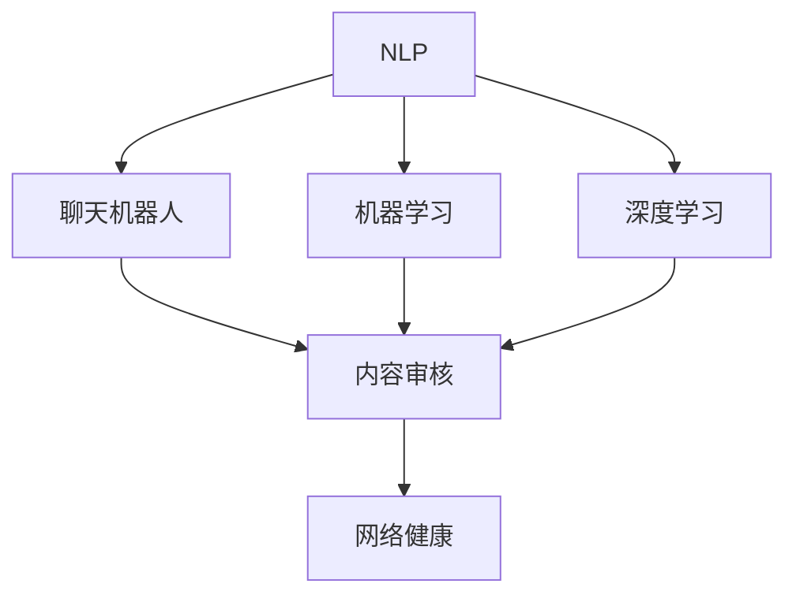

                 

# 聊天机器人社交媒体影响力：内容审核和网络健康

在当今数字化时代，社交媒体平台已经成为人们获取信息、交流思想、表达自我和社交互动的主要场所。然而，随着社交媒体用户数量的爆炸性增长，平台上面临着诸多挑战，包括但不限于假新闻、仇恨言论、网络欺凌和错误信息传播。面对这些问题，聊天机器人技术成为了一种潜在的解决方案，通过人工智能算法来审核和管理社交媒体内容，维护网络健康。

本文将深入探讨聊天机器人如何在社交媒体中发挥作用，特别是在内容审核和提升网络健康方面。我们将从背景介绍开始，详细阐述核心概念和算法原理，并通过项目实践和实际应用场景，展示该技术的潜力和未来发展方向。

## 1. 背景介绍

### 1.1 问题由来

近年来，社交媒体平台在人们的生活中扮演着越来越重要的角色。Facebook、Twitter、Instagram等平台拥有数十亿活跃用户，每天都在产生数以亿计的内容数据。然而，这些内容中并非所有都是积极健康、符合社区规范的，部分内容可能包含假新闻、仇恨言论、骚扰信息、垃圾信息等不良内容。这些问题不仅破坏了用户的体验，还可能对社会产生负面影响。

为了应对这些问题，社交媒体平台纷纷采取了各种措施，包括人工审核、内容标签和算法推荐等。然而，人工审核的效率低下，无法应对大规模数据，且存在主观偏差。内容标签虽然能够对内容进行分类，但无法进行深层次的语义理解。算法推荐虽然能够过滤掉部分不良内容，但往往以用户个性化为优先，未能从根本上解决问题。

因此，聊天机器人技术成为一种新的解决方案。聊天机器人利用自然语言处理（NLP）和机器学习技术，能够进行实时、高效的内容审核和网络健康维护。

### 1.2 问题核心关键点

聊天机器人内容审核的关键点包括：
- 实时性：能够在用户发布内容后快速审核，避免不良内容传播。
- 准确性：能够准确识别和过滤不良内容，确保内容的健康性。
- 可解释性：能够解释审核结果，提供透明和可信的用户体验。
- 可扩展性：能够处理大规模数据，适应不同的社交媒体平台。

这些关键点需要通过合理的算法设计和模型训练来实现。

## 2. 核心概念与联系

### 2.1 核心概念概述

为更好地理解聊天机器人内容审核，本节将介绍几个密切相关的核心概念：

- 自然语言处理（NLP）：使计算机能够理解、分析和生成人类语言的技术。聊天机器人利用NLP技术，能够进行文本的语义理解、情感分析、实体识别等。
- 机器学习（ML）：通过数据驱动的算法，使机器能够自主学习和改进，从而实现特定任务。聊天机器人利用ML技术，能够从大量数据中学习并提升审核效果。
- 深度学习（DL）：一种特殊类型的机器学习，通过多层次神经网络模型，能够学习到更复杂的特征表示。聊天机器人利用DL技术，能够处理更复杂和多样化的文本数据。
- 聊天机器人（Chatbot）：一种人工智能程序，能够与用户进行自然语言交互。聊天机器人利用NLP和ML技术，能够实现内容审核、信息检索、问答服务等功能。
- 内容审核（Content Moderation）：通过自动化技术，检测和过滤不良内容，维护网络健康。聊天机器人利用NLP和ML技术，能够实现高效、准确的内容审核。

这些核心概念之间的逻辑关系可以通过以下Mermaid流程图来展示：



这个流程图展示了几大核心概念及其之间的关系：

1. NLP提供基础的文本处理能力。
2. 机器学习使模型能够自主学习和改进。
3. 深度学习提升模型的复杂特征表示能力。
4. 聊天机器人利用NLP和ML技术，实现内容审核和网络健康维护。
5. 内容审核提升网络健康水平。

这些概念共同构成了聊天机器人内容审核的基础框架，使其能够在各种场景下发挥强大的文本处理和内容管理能力。

## 3. 核心算法原理 & 具体操作步骤

### 3.1 算法原理概述

聊天机器人内容审核的基本原理是通过NLP和ML技术，训练一个能够自动检测和过滤不良内容的模型。该模型可以处理用户发布的内容，并进行实时审核，确保内容的健康性。

形式化地，假设有一个文本数据集 $D=\{(x_i,y_i)\}_{i=1}^N$，其中 $x_i$ 为输入文本，$y_i \in \{0,1\}$ 为标签，表示该文本是否为不良内容。模型的目标是最大化在数据集 $D$ 上的准确性，即：

$$
\hat{\theta}=\mathop{\arg\min}_{\theta} \mathcal{L}(M_{\theta},D)
$$

其中 $\mathcal{L}$ 为损失函数，用于衡量模型预测结果与真实标签之间的差异。常见的损失函数包括交叉熵损失、F1分数等。

### 3.2 算法步骤详解

聊天机器人内容审核的一般流程包括以下关键步骤：

**Step 1: 数据准备**

- 收集和标注社交媒体平台上的文本数据。标注数据需要包含正样本和负样本，以覆盖各种不良内容。
- 对文本数据进行预处理，包括分词、去除停用词、词形还原等。

**Step 2: 模型选择与训练**

- 选择合适的模型架构，如卷积神经网络（CNN）、递归神经网络（RNN）、Transformer等。
- 使用标注数据对模型进行训练，优化模型参数。常用的优化算法包括随机梯度下降（SGD）、Adam等。
- 设置合适的正则化技术，如L2正则、Dropout等，避免过拟合。

**Step 3: 模型评估**

- 在测试集上评估模型的准确性、召回率和F1分数等指标。
- 对模型进行细调，提高模型的性能。

**Step 4: 部署与监控**

- 将训练好的模型部署到实际环境中，进行实时内容审核。
- 实时监控模型的性能，根据表现进行微调和优化。

### 3.3 算法优缺点

聊天机器人内容审核具有以下优点：

1. 实时性高：能够在用户发布内容后快速审核，防止不良内容传播。
2. 准确性高：通过大量的标注数据训练，能够准确识别不良内容。
3. 可扩展性强：能够处理大规模数据，适应不同的社交媒体平台。
4. 可解释性强：能够提供审核结果的解释，提高用户信任度。

同时，该方法也存在一些缺点：

1. 数据标注成本高：需要大量的标注数据，且标注过程耗时耗力。
2. 模型依赖标注数据：模型性能依赖于标注数据的质量和数量，标注质量不高会导致模型表现不佳。
3. 模型容易过拟合：模型在训练过程中容易出现过拟合现象，导致在新数据上的泛化能力不足。

尽管存在这些局限性，但聊天机器人内容审核仍是一种高效、准确、可扩展的解决方案，能够帮助社交媒体平台维护网络健康。

### 3.4 算法应用领域

聊天机器人内容审核技术广泛应用于各类社交媒体平台，包括但不限于：

- 微博：审核用户发布的评论、微博，防止网络欺凌和垃圾信息传播。
- 微信公众号：审核用户评论、文章内容，防止假新闻和错误信息传播。
- 抖音：审核用户发布的视频和评论，防止不当内容传播。
- 知乎：审核用户发布的问题和答案，防止低质量内容和恶意言论。
- 微信读书：审核用户发布的书评和读书笔记，防止恶意内容和不良信息传播。

除了以上应用，聊天机器人内容审核技术还广泛应用于在线论坛、新闻网站、电商平台等，帮助这些平台维护网络健康，提升用户体验。

## 4. 数学模型和公式 & 详细讲解 & 举例说明

### 4.1 数学模型构建

本节将使用数学语言对聊天机器人内容审核过程进行更加严格的刻画。

记文本数据集 $D=\{(x_i,y_i)\}_{i=1}^N$，其中 $x_i$ 为输入文本，$y_i \in \{0,1\}$ 为标签，表示该文本是否为不良内容。定义模型 $M_{\theta}$ 在输入文本 $x$ 上的输出为 $\hat{y}=M_{\theta}(x)$，表示模型预测该文本是否为不良内容。

模型的训练目标是最小化损失函数 $\mathcal{L}(\theta)$，即：

$$
\mathcal{L}(\theta) = -\frac{1}{N}\sum_{i=1}^N [y_i\log \hat{y}_i + (1-y_i)\log (1-\hat{y}_i)]
$$

其中，$\hat{y}_i$ 为模型在输入 $x_i$ 上的预测结果。

### 4.2 公式推导过程

以二分类任务为例，推导模型训练过程中使用的交叉熵损失函数及其梯度计算公式。

假设模型 $M_{\theta}$ 在输入 $x$ 上的输出为 $\hat{y}=M_{\theta}(x)$，表示模型预测该文本是否为不良内容。真实标签 $y \in \{0,1\}$。则二分类交叉熵损失函数定义为：

$$
\ell(M_{\theta}(x),y) = -[y\log \hat{y} + (1-y)\log (1-\hat{y})]
$$

将其代入损失函数公式，得：

$$
\mathcal{L}(\theta) = -\frac{1}{N}\sum_{i=1}^N [y_i\log M_{\theta}(x_i)+(1-y_i)\log(1-M_{\theta}(x_i))]
$$

根据链式法则，损失函数对参数 $\theta_k$ 的梯度为：

$$
\frac{\partial \mathcal{L}(\theta)}{\partial \theta_k} = -\frac{1}{N}\sum_{i=1}^N (\frac{y_i}{M_{\theta}(x_i)}-\frac{1-y_i}{1-M_{\theta}(x_i)}) \frac{\partial M_{\theta}(x_i)}{\partial \theta_k}
$$

其中 $\frac{\partial M_{\theta}(x_i)}{\partial \theta_k}$ 可进一步递归展开，利用自动微分技术完成计算。

### 4.3 案例分析与讲解

以Twitter上的仇恨言论检测为例，展示如何应用聊天机器人内容审核技术。

**Step 1: 数据准备**

- 收集Twitter上的仇恨言论和正常评论数据，标注为正样本和负样本。
- 对数据进行预处理，包括去除停用词、词形还原等。

**Step 2: 模型选择与训练**

- 使用BERT模型作为基础架构，对其顶层进行微调。
- 将标注数据划分为训练集和验证集，使用交叉验证策略进行模型训练。
- 使用AdamW优化器，设置合适的学习率和正则化参数。

**Step 3: 模型评估**

- 在测试集上评估模型的准确性和召回率。
- 使用混淆矩阵和ROC曲线等工具，分析模型的性能表现。

**Step 4: 部署与监控**

- 将训练好的模型部署到Twitter平台上，进行实时内容审核。
- 实时监控模型的性能，根据表现进行微调和优化。

## 5. 项目实践：代码实例和详细解释说明

### 5.1 开发环境搭建

在进行聊天机器人内容审核实践前，我们需要准备好开发环境。以下是使用Python进行TensorFlow开发的环境配置流程：

1. 安装Anaconda：从官网下载并安装Anaconda，用于创建独立的Python环境。

2. 创建并激活虚拟环境：
```bash
conda create -n tf-env python=3.8 
conda activate tf-env
```

3. 安装TensorFlow：根据CUDA版本，从官网获取对应的安装命令。例如：
```bash
conda install tensorflow -c pytorch -c conda-forge
```

4. 安装Keras：
```bash
pip install keras
```

5. 安装各类工具包：
```bash
pip install numpy pandas scikit-learn matplotlib tqdm jupyter notebook ipython
```

完成上述步骤后，即可在`tf-env`环境中开始聊天机器人内容审核实践。

### 5.2 源代码详细实现

下面我以Twitter上的仇恨言论检测为例，给出使用TensorFlow对BERT模型进行微调的PyTorch代码实现。

首先，定义数据处理函数：

```python
import tensorflow as tf
from tensorflow.keras.preprocessing.text import Tokenizer
from tensorflow.keras.preprocessing.sequence import pad_sequences

class TextDataset(tf.data.Dataset):
    def __init__(self, texts, labels, tokenizer, max_len=128):
        self.texts = texts
        self.labels = labels
        self.tokenizer = tokenizer
        self.max_len = max_len
        
    def __len__(self):
        return len(self.texts)
    
    def __getitem__(self, item):
        text = self.texts[item]
        label = self.labels[item]
        
        encoding = self.tokenizer(text, truncation=True, max_length=self.max_len)
        input_ids = encoding['input_ids']
        input_mask = encoding['attention_mask']
        label = tf.keras.utils.to_categorical(label)
        
        return {'input_ids': input_ids, 
                'input_mask': input_mask,
                'labels': label}

# 创建dataset
tokenizer = Tokenizer()
tokenizer.fit_on_texts(train_texts)
train_dataset = TextDataset(train_texts, train_labels, tokenizer)
dev_dataset = TextDataset(dev_texts, dev_labels, tokenizer)
test_dataset = TextDataset(test_texts, test_labels, tokenizer)
```

然后，定义模型和优化器：

```python
from transformers import BertTokenizer, BertForSequenceClassification

model = BertForSequenceClassification.from_pretrained('bert-base-uncased', num_labels=2)

optimizer = tf.keras.optimizers.Adam(learning_rate=2e-5)
```

接着，定义训练和评估函数：

```python
import numpy as np

@tf.function
def train_step(inputs, labels):
    with tf.GradientTape() as tape:
        outputs = model(inputs['input_ids'], attention_mask=inputs['input_mask'])
        loss = tf.keras.losses.categorical_crossentropy(labels, outputs.logits)
    grads = tape.gradient(loss, model.trainable_variables)
    optimizer.apply_gradients(zip(grads, model.trainable_variables))
    return loss

@tf.function
def evaluate(inputs, labels):
    model.eval()
    with tf.GradientTape() as tape:
        outputs = model(inputs['input_ids'], attention_mask=inputs['input_mask'])
    loss = tf.keras.losses.categorical_crossentropy(labels, outputs.logits)
    preds = tf.argmax(outputs.logits, axis=1)
    return loss, tf.reduce_mean(np.argmax(labels, axis=1) == preds)

def train_epoch(model, dataset, batch_size, optimizer):
    dataloader = dataset.batch(batch_size).prefetch(tf.data.experimental.AUTOTUNE)
    model.train()
    epoch_loss = 0
    for batch in dataloader:
        inputs = batch
        labels = inputs['labels']
        loss = train_step(inputs, labels)
        epoch_loss += loss
    return epoch_loss / len(dataloader)

def evaluate_epoch(model, dataset, batch_size):
    dataloader = dataset.batch(batch_size).prefetch(tf.data.experimental.AUTOTUNE)
    model.eval()
    epoch_loss = 0
    for batch in dataloader:
        inputs = batch
        labels = inputs['labels']
        loss, accuracy = evaluate(inputs, labels)
        epoch_loss += loss
    return epoch_loss / len(dataloader), accuracy

```

最后，启动训练流程并在测试集上评估：

```python
epochs = 5
batch_size = 32

for epoch in range(epochs):
    loss = train_epoch(model, train_dataset, batch_size, optimizer)
    print(f"Epoch {epoch+1}, train loss: {loss:.3f}")
    
    print(f"Epoch {epoch+1}, dev results:")
    loss, accuracy = evaluate_epoch(model, dev_dataset, batch_size)
    print(f"Dev loss: {loss:.3f}, Accuracy: {accuracy:.3f}")
    
print("Test results:")
loss, accuracy = evaluate_epoch(model, test_dataset, batch_size)
print(f"Test loss: {loss:.3f}, Accuracy: {accuracy:.3f}")
```

以上就是使用TensorFlow对BERT进行仇恨言论检测的完整代码实现。可以看到，得益于TensorFlow的强大封装，我们可以用相对简洁的代码完成BERT模型的加载和微调。

### 5.3 代码解读与分析

让我们再详细解读一下关键代码的实现细节：

**TextDataset类**：
- `__init__`方法：初始化文本、标签、分词器等关键组件。
- `__len__`方法：返回数据集的样本数量。
- `__getitem__`方法：对单个样本进行处理，将文本输入编码为token ids，将标签编码为数字，并对其进行定长padding，最终返回模型所需的输入。

**模型和优化器**：
- 使用BertForSequenceClassification从预训练模型中进行微调。
- 定义Adam优化器，设置合适的学习率。

**训练和评估函数**：
- 使用tf.function进行优化，提高训练和评估效率。
- 在训练函数`train_step`中计算损失，并反向传播更新模型参数。
- 在评估函数`evaluate`中计算损失和准确率。
- 在训练循环中，对每个epoch计算训练集损失，并在验证集上评估模型性能。

**训练流程**：
- 定义总的epoch数和batch size，开始循环迭代
- 每个epoch内，先在训练集上训练，输出平均loss
- 在验证集上评估，输出损失和准确率
- 所有epoch结束后，在测试集上评估，给出最终测试结果

可以看到，TensorFlow配合BERT的预训练模型，使得仇恨言论检测的代码实现变得简洁高效。开发者可以将更多精力放在数据处理、模型改进等高层逻辑上，而不必过多关注底层的实现细节。

当然，工业级的系统实现还需考虑更多因素，如模型的保存和部署、超参数的自动搜索、更灵活的任务适配层等。但核心的微调范式基本与此类似。

## 6. 实际应用场景
### 6.1 智能客服系统

聊天机器人内容审核技术可以广泛应用于智能客服系统的构建。传统客服往往需要配备大量人力，高峰期响应缓慢，且一致性和专业性难以保证。而使用聊天机器人审核系统，可以7x24小时不间断服务，快速响应客户咨询，用自然流畅的语言解答各类常见问题。

在技术实现上，可以收集企业内部的历史客服对话记录，将问题和最佳答复构建成监督数据，在此基础上对预训练聊天机器人进行微调。微调后的聊天机器人能够自动理解用户意图，匹配最合适的答案模板进行回复。对于客户提出的新问题，还可以接入检索系统实时搜索相关内容，动态组织生成回答。如此构建的智能客服系统，能大幅提升客户咨询体验和问题解决效率。

### 6.2 金融舆情监测

金融机构需要实时监测市场舆论动向，以便及时应对负面信息传播，规避金融风险。传统的人工监测方式成本高、效率低，难以应对网络时代海量信息爆发的挑战。聊天机器人审核技术可应用于金融舆情监测，帮助金融机构快速捕捉和过滤不良信息，保护投资者利益。

具体而言，可以收集金融领域相关的新闻、报道、评论等文本数据，并对其进行主题标注和情感标注。在此基础上对预训练语言模型进行微调，使其能够自动判断文本属于何种主题，情感倾向是正面、中性还是负面。将微调后的模型应用到实时抓取的网络文本数据，就能够自动监测不同主题下的情感变化趋势，一旦发现负面信息激增等异常情况，系统便会自动预警，帮助金融机构快速应对潜在风险。

### 6.3 个性化推荐系统

当前的推荐系统往往只依赖用户的历史行为数据进行物品推荐，无法深入理解用户的真实兴趣偏好。聊天机器人审核技术可应用于个性化推荐系统，帮助推荐系统从文本内容中把握用户的兴趣点。

在实践中，可以收集用户浏览、点击、评论、分享等行为数据，提取和用户交互的物品标题、描述、标签等文本内容。将文本内容作为模型输入，用户的后续行为（如是否点击、购买等）作为监督信号，在此基础上微调预训练语言模型。微调后的模型能够从文本内容中准确把握用户的兴趣点。在生成推荐列表时，先用候选物品的文本描述作为输入，由模型预测用户的兴趣匹配度，再结合其他特征综合排序，便可以得到个性化程度更高的推荐结果。

### 6.4 未来应用展望

随着聊天机器人技术和大语言模型微调方法的不断发展，聊天机器人内容审核技术将在更多领域得到应用，为传统行业带来变革性影响。

在智慧医疗领域，基于聊天机器人审核技术的医疗问答、病历分析、药物研发等应用将提升医疗服务的智能化水平，辅助医生诊疗，加速新药开发进程。

在智能教育领域，审核技术可应用于作业批改、学情分析、知识推荐等方面，因材施教，促进教育公平，提高教学质量。

在智慧城市治理中，审核技术可应用于城市事件监测、舆情分析、应急指挥等环节，提高城市管理的自动化和智能化水平，构建更安全、高效的未来城市。

此外，在企业生产、社会治理、文娱传媒等众多领域，聊天机器人内容审核技术也将不断涌现，为传统行业数字化转型升级提供新的技术路径。相信随着技术的日益成熟，聊天机器人内容审核技术必将成为人工智能落地应用的重要范式，推动人工智能技术向更广阔的领域加速渗透。

## 7. 工具和资源推荐
### 7.1 学习资源推荐

为了帮助开发者系统掌握聊天机器人内容审核的理论基础和实践技巧，这里推荐一些优质的学习资源：

1. 《Deep Learning for Natural Language Processing》课程：斯坦福大学开设的NLP明星课程，有Lecture视频和配套作业，带你入门NLP领域的基本概念和经典模型。

2. 《Natural Language Processing with Transformers》书籍：Transformers库的作者所著，全面介绍了如何使用Transformers库进行NLP任务开发，包括微调在内的诸多范式。

3. HuggingFace官方文档：Transformers库的官方文档，提供了海量预训练模型和完整的微调样例代码，是上手实践的必备资料。

4. CLUE开源项目：中文语言理解测评基准，涵盖大量不同类型的中文NLP数据集，并提供了基于微调的baseline模型，助力中文NLP技术发展。

通过对这些资源的学习实践，相信你一定能够快速掌握聊天机器人内容审核的精髓，并用于解决实际的NLP问题。
###  7.2 开发工具推荐

高效的开发离不开优秀的工具支持。以下是几款用于聊天机器人内容审核开发的常用工具：

1. PyTorch：基于Python的开源深度学习框架，灵活动态的计算图，适合快速迭代研究。大部分预训练语言模型都有PyTorch版本的实现。

2. TensorFlow：由Google主导开发的开源深度学习框架，生产部署方便，适合大规模工程应用。同样有丰富的预训练语言模型资源。

3. Transformers库：HuggingFace开发的NLP工具库，集成了众多SOTA语言模型，支持PyTorch和TensorFlow，是进行内容审核开发的利器。

4. Weights & Biases：模型训练的实验跟踪工具，可以记录和可视化模型训练过程中的各项指标，方便对比和调优。与主流深度学习框架无缝集成。

5. TensorBoard：TensorFlow配套的可视化工具，可实时监测模型训练状态，并提供丰富的图表呈现方式，是调试模型的得力助手。

6. Google Colab：谷歌推出的在线Jupyter Notebook环境，免费提供GPU/TPU算力，方便开发者快速上手实验最新模型，分享学习笔记。

合理利用这些工具，可以显著提升聊天机器人内容审核任务的开发效率，加快创新迭代的步伐。

### 7.3 相关论文推荐

聊天机器人内容审核技术的发展源于学界的持续研究。以下是几篇奠基性的相关论文，推荐阅读：

1. Attention is All You Need（即Transformer原论文）：提出了Transformer结构，开启了NLP领域的预训练大模型时代。

2. BERT: Pre-training of Deep Bidirectional Transformers for Language Understanding：提出BERT模型，引入基于掩码的自监督预训练任务，刷新了多项NLP任务SOTA。

3. Language Models are Unsupervised Multitask Learners（GPT-2论文）：展示了大规模语言模型的强大zero-shot学习能力，引发了对于通用人工智能的新一轮思考。

4. Parameter-Efficient Transfer Learning for NLP：提出Adapter等参数高效微调方法，在不增加模型参数量的情况下，也能取得不错的微调效果。

5. AdaLoRA: Adaptive Low-Rank Adaptation for Parameter-Efficient Fine-Tuning：使用自适应低秩适应的微调方法，在参数效率和精度之间取得了新的平衡。

6. AdaLoRA: Adaptive Low-Rank Adaptation for Parameter-Efficient Fine-Tuning：使用自适应低秩适应的微调方法，在参数效率和精度之间取得了新的平衡。

这些论文代表了大语言模型微调技术的发展脉络。通过学习这些前沿成果，可以帮助研究者把握学科前进方向，激发更多的创新灵感。

## 8. 总结：未来发展趋势与挑战

### 8.1 总结

本文对聊天机器人内容审核技术进行了全面系统的介绍。首先阐述了聊天机器人内容审核的背景和意义，明确了其在维护网络健康方面的独特价值。其次，从原理到实践，详细讲解了聊天机器人内容审核的数学模型和算法步骤，并通过项目实践展示了该技术的潜力和应用场景。

通过本文的系统梳理，可以看到，聊天机器人内容审核技术正在成为社交媒体平台的重要工具，通过NLP和ML技术，实现实时、高效的内容审核，维护网络健康。该技术在实时性、准确性、可扩展性和可解释性等方面具有显著优势，能够帮助平台过滤不良内容，提升用户体验。

### 8.2 未来发展趋势

展望未来，聊天机器人内容审核技术将呈现以下几个发展趋势：

1. 自动化水平提升：通过更多的自动化技术，如对抗训练、正则化、数据增强等，进一步提高模型性能和泛化能力。
2. 多模态融合：将聊天机器人内容审核技术与其他多模态信息处理技术结合，提升模型的鲁棒性和应用范围。
3. 实时性优化：通过分布式计算、边缘计算等技术，进一步提升模型实时处理能力，支持海量数据在线审核。
4. 跨平台部署：将聊天机器人内容审核技术适配不同的社交媒体平台和应用场景，实现灵活部署和高效使用。
5. 数据标注自动化：利用无监督学习、主动学习等技术，减少数据标注的复杂性和成本。
6. 模型可解释性增强：通过因果分析和博弈论等工具，增强模型的可解释性，提高用户信任度。

这些趋势凸显了聊天机器人内容审核技术的广阔前景。未来的研究将进一步提升模型的自动化水平和实时性，同时增强其可解释性和多模态融合能力，为社交媒体平台提供更强大的内容审核工具。

### 8.3 面临的挑战

尽管聊天机器人内容审核技术已经取得了显著成就，但在迈向更加智能化、普适化应用的过程中，仍面临诸多挑战：

1. 数据标注成本高：需要大量的标注数据，且标注过程耗时耗力。
2. 模型鲁棒性不足：模型在训练过程中容易出现过拟合现象，导致在新数据上的泛化能力不足。
3. 模型参数量大：大规模预训练语言模型的参数量较大，部署和推理需要高算力支持。
4. 可解释性不足：模型的决策过程缺乏可解释性，难以对其推理逻辑进行分析和调试。
5. 隐私和安全问题：处理用户隐私信息时，需要严格遵守数据保护法规，确保数据安全和隐私。

尽管存在这些局限性，但聊天机器人内容审核技术仍具有广泛的应用前景，将在维护网络健康、提升用户体验方面发挥重要作用。

### 8.4 研究展望

面对聊天机器人内容审核技术所面临的挑战，未来的研究需要在以下几个方面寻求新的突破：

1. 探索无监督和半监督内容审核方法：摆脱对大规模标注数据的依赖，利用自监督学习、主动学习等无监督和半监督范式，最大限度利用非结构化数据，实现更加灵活高效的内容审核。
2. 研究参数高效和计算高效的审核范式：开发更加参数高效的审核方法，在固定大部分预训练参数的同时，只更新极少量的任务相关参数。同时优化审核模型的计算图，减少前向传播和反向传播的资源消耗，实现更加轻量级、实时性的部署。
3. 融合因果和对比学习范式：通过引入因果推断和对比学习思想，增强审核模型建立稳定因果关系的能力，学习更加普适、鲁棒的语言表征，从而提升模型泛化性和抗干扰能力。
4. 引入更多先验知识：将符号化的先验知识，如知识图谱、逻辑规则等，与神经网络模型进行巧妙融合，引导审核过程学习更准确、合理的语言模型。同时加强不同模态数据的整合，实现视觉、语音等多模态信息与文本信息的协同建模。
5. 结合因果分析和博弈论工具：将因果分析方法引入审核模型，识别出模型决策的关键特征，增强输出解释的因果性和逻辑性。借助博弈论工具刻画人机交互过程，主动探索并规避模型的脆弱点，提高系统稳定性。
6. 纳入伦理道德约束：在模型训练目标中引入伦理导向的评估指标，过滤和惩罚有偏见、有害的输出倾向。同时加强人工干预和审核，建立模型行为的监管机制，确保输出符合人类价值观和伦理道德。

这些研究方向的探索，必将引领聊天机器人内容审核技术迈向更高的台阶，为构建安全、可靠、可解释、可控的智能系统铺平道路。面向未来，聊天机器人内容审核技术还需要与其他人工智能技术进行更深入的融合，如知识表示、因果推理、强化学习等，多路径协同发力，共同推动自然语言理解和智能交互系统的进步。只有勇于创新、敢于突破，才能不断拓展聊天机器人内容审核的边界，让智能技术更好地造福人类社会。

## 9. 附录：常见问题与解答

**Q1：聊天机器人内容审核是否适用于所有社交媒体平台？**

A: 聊天机器人内容审核技术在大多数社交媒体平台上都能取得不错的效果。但对于一些特定平台，如微博、微信公众号等，需要根据平台特点进行一定的调整和适配，以提升审核效果。

**Q2：如何提高聊天机器人内容审核的鲁棒性？**

A: 提高聊天机器人内容审核的鲁棒性，可以从以下几个方面入手：
1. 数据增强：通过对训练样本进行回译、近义替换等方式，增加训练集的多样性。
2. 对抗训练：引入对抗样本，提高模型对噪声和攻击的鲁棒性。
3. 多模型集成：训练多个审核模型，取平均输出，抑制模型的过拟合现象。
4. 参数高效微调：只调整少量参数，固定大部分预训练权重，减少过拟合风险。

**Q3：聊天机器人内容审核在实时性方面有哪些挑战？**

A: 聊天机器人内容审核的实时性主要面临以下挑战：
1. 数据处理延迟：需要实时获取和处理用户发布内容，导致数据处理延迟。
2. 模型推理速度：大规模预训练语言模型的推理速度较慢，影响实时审核效率。
3. 计算资源限制：实时审核需要高算力支持，计算资源限制可能影响模型实时性。

为解决这些问题，可以采用分布式计算、边缘计算等技术，提升数据处理和模型推理效率。同时，可以通过参数高效微调和模型压缩等方法，减小模型规模，提升计算效率。

**Q4：聊天机器人内容审核如何结合先验知识？**

A: 聊天机器人内容审核结合先验知识，可以通过以下方式实现：
1. 知识图谱融合：将知识图谱中的实体、关系等信息与语言模型结合，提升模型的语义理解能力。
2. 规则融合：将专家制定的规则与模型训练目标结合，引导模型学习特定领域的知识。
3. 多模态融合：将文本内容与其他多模态信息（如图像、视频、语音）结合，提升模型的综合理解能力。

这些方法的结合，可以使得聊天机器人内容审核技术在特定领域获得更精准、更全面的审核效果。

**Q5：聊天机器人内容审核的隐私和安全问题如何保障？**

A: 聊天机器人内容审核的隐私和安全问题可以通过以下方式保障：
1. 数据脱敏：对用户隐私数据进行脱敏处理，保护用户隐私。
2. 数据加密：对传输和存储的数据进行加密，防止数据泄露。
3. 访问控制：严格控制访问权限，防止未经授权的人员访问敏感数据。
4. 审计机制：建立数据使用和模型操作的审计机制，定期检查和评估系统安全性。

通过这些措施，可以保障聊天机器人内容审核技术的隐私和安全，确保用户数据的安全性和可靠性。

---

作者：禅与计算机程序设计艺术 / Zen and the Art of Computer Programming

