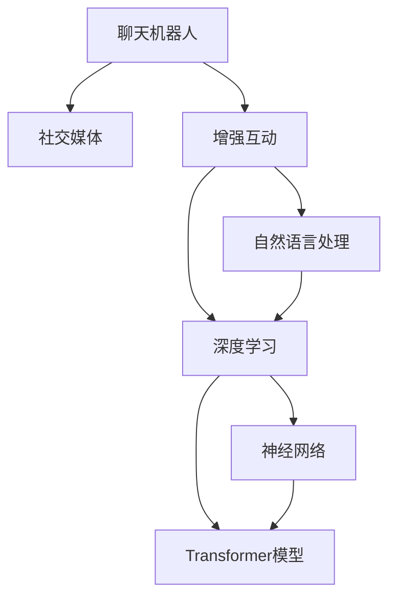

                 

# 聊天机器人社交媒体：增强社交互动

> 关键词：聊天机器人,社交媒体,增强互动,自然语言处理(NLP),深度学习,神经网络,Transformer模型

## 1. 背景介绍

### 1.1 问题由来
随着互联网和智能技术的飞速发展，聊天机器人已经逐渐成为社交媒体中不可或缺的一部分。从简单的客服咨询到复杂的情感交流，聊天机器人在提升用户互动体验、提高服务效率、降低运营成本等方面展现出巨大的潜力。然而，尽管聊天机器人已经取得了一些成功，但它们在自然语言理解、情感识别、个性化推荐等方面仍存在明显的不足。

### 1.2 问题核心关键点
本研究聚焦于聊天机器人社交媒体的增强互动。通过使用先进的自然语言处理技术，如深度学习、神经网络、Transformer模型等，实现更加智能、高效、个性化的聊天机器人，提升其在社交媒体中的互动体验。关键点包括：
- 聊天机器人模型的架构设计
- 自然语言处理的高级技术
- 深度学习算法
- 社交媒体中的实时互动

### 1.3 问题研究意义
本研究旨在：
1. 探索聊天机器人社交媒体中的增强互动技术，提升用户体验。
2. 构建更智能、个性化的聊天机器人，提高互动效率和质量。
3. 通过应用深度学习等先进技术，降低人工运营成本。
4. 推动聊天机器人技术在社交媒体中的应用和普及。

## 2. 核心概念与联系

### 2.1 核心概念概述

为更好地理解聊天机器人社交媒体中的增强互动技术，本节将介绍几个密切相关的核心概念：

- 聊天机器人(Chatbot)：一种能够通过自然语言与用户进行交互的智能系统，常用于客服咨询、智能助理、在线娱乐等领域。
- 社交媒体(Social Media)：指用户可以在上面分享、评论、互动的多媒体平台，如Facebook、Twitter、WeChat等。
- 增强互动(Enhanced Interaction)：指通过技术手段提升聊天机器人的自然语言理解能力、情感识别能力、个性化推荐能力等，实现更高效、更人性化的互动体验。
- 自然语言处理(NLP)：涉及语言学、计算机科学等多个领域的交叉学科，旨在使计算机能够理解、生成和处理人类语言。
- 深度学习(Deep Learning)：基于神经网络模型的机器学习技术，通过多层非线性变换提取数据特征，广泛应用于图像识别、语音识别、自然语言处理等领域。
- 神经网络(Neural Network)：一种由大量节点构成的计算模型，模拟人类神经系统的工作机制，常用于构建复杂的机器学习模型。
- Transformer模型：一种基于自注意力机制的神经网络模型，用于处理序列数据，特别适用于自然语言处理任务。

这些核心概念之间的逻辑关系可以通过以下Mermaid流程图来展示：



这个流程图展示了几大核心概念及其之间的关系：

1. 聊天机器人是社交媒体中的重要应用。
2. 增强互动是聊天机器人的核心目标，需要借助自然语言处理和深度学习技术。
3. 自然语言处理涉及多领域的知识，是增强互动的基础。
4. 深度学习通过神经网络模型实现高级特征提取。
5. 神经网络中，Transformer模型特别适用于自然语言处理任务。

这些概念共同构成了聊天机器人社交媒体中的增强互动框架，为其未来的发展和优化提供了理论基础。

## 3. 核心算法原理 & 具体操作步骤

### 3.1 算法原理概述

聊天机器人社交媒体的增强互动，主要基于深度学习中的Transformer模型。其核心思想是通过自注意力机制和多层非线性变换，构建更高效、更准确的自然语言处理模型。

Transformer模型的架构包括编码器和解码器两部分。编码器用于将输入的文本序列转换为高维表示，解码器用于根据高维表示生成输出序列。其核心组件为多头自注意力机制，能够有效地捕捉文本序列中的长期依赖关系，提升模型的泛化能力和理解能力。

Transformer模型的训练过程主要分为预训练和微调两个阶段。预训练阶段在大型无标签语料上，通过自监督学习任务进行模型初始化，学习通用的语言知识。微调阶段在特定任务的数据集上，通过有监督学习进一步优化模型参数，提升其在特定任务上的性能。

### 3.2 算法步骤详解

聊天机器人社交媒体的增强互动，主要包括以下几个关键步骤：

**Step 1: 准备语料和模型**
- 收集聊天机器人社交媒体中的对话数据，划分为训练集、验证集和测试集。
- 选择合适的预训练模型，如BERT、GPT等，进行预训练。
- 在特定的社交媒体平台上，搭建聊天机器人的交互界面。

**Step 2: 设计任务适配层**
- 根据任务类型，设计合适的任务适配层，如分类层、序列生成层等。
- 在编码器中增加特定的任务信息，引导模型输出符合任务要求的答案。
- 设计损失函数，用于衡量模型预测输出与真实标签之间的差异。

**Step 3: 设置训练超参数**
- 选择合适的优化算法及其参数，如Adam、SGD等，设置学习率、批大小、迭代轮数等。
- 设置正则化技术及强度，包括权重衰减、Dropout、Early Stopping等。
- 确定冻结预训练参数的策略，如仅微调顶层，或全部参数都参与微调。

**Step 4: 执行梯度训练**
- 将训练集数据分批次输入模型，前向传播计算损失函数。
- 反向传播计算参数梯度，根据设定的优化算法和学习率更新模型参数。
- 周期性在验证集上评估模型性能，根据性能指标决定是否触发 Early Stopping。
- 重复上述步骤直到满足预设的迭代轮数或 Early Stopping 条件。

**Step 5: 测试和部署**
- 在测试集上评估微调后模型，对比微调前后的精度提升。
- 使用微调后的模型对新样本进行推理预测，集成到实际的应用系统中。
- 持续收集新的数据，定期重新微调模型，以适应数据分布的变化。

以上是聊天机器人社交媒体增强互动的主要流程。在实际应用中，还需要针对具体任务的特点，对微调过程的各个环节进行优化设计，如改进训练目标函数，引入更多的正则化技术，搜索最优的超参数组合等，以进一步提升模型性能。

### 3.3 算法优缺点

聊天机器人社交媒体增强互动的深度学习算法，具有以下优点：
1. 高效处理序列数据。Transformer模型特别擅长处理长序列数据，能够捕捉文本中的长期依赖关系。
2. 强大的泛化能力。通过自监督预训练，模型能够学习通用的语言知识，适应多种下游任务。
3. 灵活的微调能力。可以通过有监督微调，进一步提升模型在特定任务上的性能。
4. 可解释性强。相比于黑盒模型，深度学习模型通过可解释的神经网络结构，易于理解其内部工作机制。

同时，该算法也存在以下局限性：
1. 计算资源需求高。大规模Transformer模型需要大量的计算资源和存储空间。
2. 数据依赖性强。模型的性能高度依赖于预训练和微调的语料数据，数据质量和多样性对模型效果有重要影响。
3. 复杂度高。模型的结构和训练过程相对复杂，需要专业知识才能实现和优化。
4. 易过拟合。在大规模数据集上训练时，模型容易过拟合，特别是在标注数据较少的情况下。

尽管存在这些局限性，但就目前而言，深度学习算法仍然是聊天机器人社交媒体增强互动的主流技术。未来相关研究的重点在于如何进一步降低计算资源消耗，提高模型的泛化能力和鲁棒性，同时兼顾可解释性和伦理安全性等因素。

### 3.4 算法应用领域

聊天机器人社交媒体增强互动的深度学习算法，在多个领域已经得到了广泛的应用，例如：

- 客服咨询：通过微调构建智能客服机器人，实现7x24小时不间断服务，提高客户满意度。
- 智能助理：为个人或企业提供多轮对话的智能助理，辅助日常工作和学习。
- 在线娱乐：构建基于自然语言处理的智能聊天系统，增强用户互动体验。
- 信息检索：利用深度学习模型进行自然语言处理，提升信息检索的准确性和效率。
- 智能推荐：通过用户与机器人的互动历史，构建个性化推荐系统，推荐用户感兴趣的内容。

除了上述这些经典应用外，深度学习算法还被创新性地应用到更多场景中，如金融理财、健康医疗、安全监控等，为不同行业带来了新的技术突破。随着预训练模型和深度学习算法的不断进步，相信聊天机器人技术将在更广泛的领域中发挥更大的作用。

## 4. 数学模型和公式 & 详细讲解 & 举例说明

### 4.1 数学模型构建

本节将使用数学语言对聊天机器人社交媒体增强互动的深度学习模型进行更加严格的刻画。

记输入的文本序列为 $x_1, x_2, ..., x_n$，输出序列为 $y_1, y_2, ..., y_n$。假设模型为 $M_{\theta}$，其中 $\theta$ 为模型参数。定义模型在数据集 $D=\{(x_i,y_i)\}_{i=1}^N$ 上的损失函数为 $\mathcal{L}(\theta)$，用于衡量模型预测输出与真实标签之间的差异。常用的损失函数包括交叉熵损失、均方误差损失等。

在训练过程中，模型的优化目标是最小化经验风险：

$$
\mathcal{L}(\theta) = \frac{1}{N} \sum_{i=1}^N \ell(M_{\theta}(x_i),y_i)
$$

其中 $\ell$ 为损失函数，如交叉熵损失 $\ell(M_{\theta}(x_i),y_i) = -\sum_{j=1}^n \log P(y_j | x_1, x_2, ..., x_n, \theta)$，其中 $P(y_j | x_1, x_2, ..., x_n, \theta)$ 为模型在给定输入 $x_1, x_2, ..., x_n$ 下，预测输出序列为 $y_1, y_2, ..., y_n$ 的概率。

### 4.2 公式推导过程

以下我们以情感分析任务为例，推导基于深度学习的聊天机器人情感分析模型的损失函数及其梯度计算公式。

假设输入文本序列 $x_1, x_2, ..., x_n$ 和对应的情感标签 $y_1, y_2, ..., y_n$，模型 $M_{\theta}$ 的输出为 $y_1, y_2, ..., y_n$。则情感分析任务的损失函数定义为：

$$
\mathcal{L}(\theta) = \frac{1}{N} \sum_{i=1}^N \ell(M_{\theta}(x_i),y_i)
$$

其中，交叉熵损失 $\ell(M_{\theta}(x_i),y_i) = -\sum_{j=1}^n \log P(y_j | x_1, x_2, ..., x_n, \theta)$。进一步展开，得：

$$
\mathcal{L}(\theta) = \frac{1}{N} \sum_{i=1}^N \sum_{j=1}^n \log \frac{e^{M_{\theta}(x_i) \cdot y_j}}{\sum_{k=1}^K e^{M_{\theta}(x_i) \cdot k}}
$$

其中 $K$ 为情感标签的类别数。将 $\log$ 和 $\sum$ 项提出来，得：

$$
\mathcal{L}(\theta) = \frac{1}{N} \sum_{i=1}^N - \log \frac{\sum_{k=1}^K e^{M_{\theta}(x_i) \cdot k}}{\sum_{k=1}^K e^{M_{\theta}(x_i) \cdot k}}
$$

通过反向传播算法，可以得到模型参数 $\theta$ 的梯度：

$$
\frac{\partial \mathcal{L}(\theta)}{\partial \theta} = \frac{1}{N} \sum_{i=1}^N \sum_{j=1}^n \frac{\partial \ell(M_{\theta}(x_i),y_i)}{\partial M_{\theta}(x_i)}
$$

其中 $\frac{\partial \ell(M_{\theta}(x_i),y_i)}{\partial M_{\theta}(x_i)}$ 为损失函数对模型输出的梯度，通过链式法则计算得到。

在得到梯度后，即可带入梯度下降等优化算法，完成模型的迭代优化。重复上述过程直至收敛，最终得到适应情感分析任务的模型参数 $\theta^*$。

### 4.3 案例分析与讲解

假设输入文本序列为：
```
"I love this movie, it's really great!"
```
情感标签为：
```
positive
```

使用上述推导的损失函数，计算模型的损失：

$$
\mathcal{L}(\theta) = -\log \frac{e^{M_{\theta}(x_i) \cdot 1}}{e^{M_{\theta}(x_i) \cdot 1} + e^{M_{\theta}(x_i) \cdot 2}}
$$

其中 $M_{\theta}(x_i)$ 为模型在输入 $x_i$ 上的预测输出，$K=3$。

进一步计算梯度，得到模型参数 $\theta$ 的更新：

$$
\frac{\partial \mathcal{L}(\theta)}{\partial \theta} = \frac{\partial}{\partial \theta} \left( -\log \frac{e^{M_{\theta}(x_i) \cdot 1}}{e^{M_{\theta}(x_i) \cdot 1} + e^{M_{\theta}(x_i) \cdot 2}} \right)
$$

在实际应用中，可以借助深度学习框架（如PyTorch、TensorFlow等）高效实现上述计算过程，并应用到真实的聊天机器人社交媒体中，提升其情感分析能力。

## 5. 项目实践：代码实例和详细解释说明

### 5.1 开发环境搭建

在进行聊天机器人社交媒体增强互动的实践前，我们需要准备好开发环境。以下是使用Python进行PyTorch开发的环境配置流程：

1. 安装Anaconda：从官网下载并安装Anaconda，用于创建独立的Python环境。

2. 创建并激活虚拟环境：
```bash
conda create -n pytorch-env python=3.8 
conda activate pytorch-env
```

3. 安装PyTorch：根据CUDA版本，从官网获取对应的安装命令。例如：
```bash
conda install pytorch torchvision torchaudio cudatoolkit=11.1 -c pytorch -c conda-forge
```

4. 安装Transformers库：
```bash
pip install transformers
```

5. 安装各类工具包：
```bash
pip install numpy pandas scikit-learn matplotlib tqdm jupyter notebook ipython
```

完成上述步骤后，即可在`pytorch-env`环境中开始实践。

### 5.2 源代码详细实现

下面我们以情感分析任务为例，给出使用Transformers库对BERT模型进行微调的PyTorch代码实现。

首先，定义情感分析任务的数据处理函数：

```python
from transformers import BertTokenizer
from torch.utils.data import Dataset
import torch

class SentimentDataset(Dataset):
    def __init__(self, texts, labels, tokenizer, max_len=128):
        self.texts = texts
        self.labels = labels
        self.tokenizer = tokenizer
        self.max_len = max_len
        
    def __len__(self):
        return len(self.texts)
    
    def __getitem__(self, item):
        text = self.texts[item]
        label = self.labels[item]
        
        encoding = self.tokenizer(text, return_tensors='pt', max_length=self.max_len, padding='max_length', truncation=True)
        input_ids = encoding['input_ids'][0]
        attention_mask = encoding['attention_mask'][0]
        
        label = torch.tensor(label, dtype=torch.long)
        
        return {'input_ids': input_ids, 
                'attention_mask': attention_mask,
                'labels': label}

# 标签与id的映射
label2id = {'positive': 1, 'negative': 0}
id2label = {v: k for k, v in label2id.items()}

# 创建dataset
tokenizer = BertTokenizer.from_pretrained('bert-base-cased')

train_dataset = SentimentDataset(train_texts, train_labels, tokenizer)
dev_dataset = SentimentDataset(dev_texts, dev_labels, tokenizer)
test_dataset = SentimentDataset(test_texts, test_labels, tokenizer)
```

然后，定义模型和优化器：

```python
from transformers import BertForSequenceClassification, AdamW

model = BertForSequenceClassification.from_pretrained('bert-base-cased', num_labels=len(label2id))

optimizer = AdamW(model.parameters(), lr=2e-5)
```

接着，定义训练和评估函数：

```python
from torch.utils.data import DataLoader
from tqdm import tqdm
from sklearn.metrics import accuracy_score

device = torch.device('cuda') if torch.cuda.is_available() else torch.device('cpu')
model.to(device)

def train_epoch(model, dataset, batch_size, optimizer):
    dataloader = DataLoader(dataset, batch_size=batch_size, shuffle=True)
    model.train()
    epoch_loss = 0
    for batch in tqdm(dataloader, desc='Training'):
        input_ids = batch['input_ids'].to(device)
        attention_mask = batch['attention_mask'].to(device)
        labels = batch['labels'].to(device)
        model.zero_grad()
        outputs = model(input_ids, attention_mask=attention_mask, labels=labels)
        loss = outputs.loss
        epoch_loss += loss.item()
        loss.backward()
        optimizer.step()
    return epoch_loss / len(dataloader)

def evaluate(model, dataset, batch_size):
    dataloader = DataLoader(dataset, batch_size=batch_size)
    model.eval()
    preds, labels = [], []
    with torch.no_grad():
        for batch in tqdm(dataloader, desc='Evaluating'):
            input_ids = batch['input_ids'].to(device)
            attention_mask = batch['attention_mask'].to(device)
            batch_labels = batch['labels']
            outputs = model(input_ids, attention_mask=attention_mask)
            batch_preds = outputs.logits.argmax(dim=2).to('cpu').tolist()
            batch_labels = batch_labels.to('cpu').tolist()
            for pred, label in zip(batch_preds, batch_labels):
                preds.append(pred[0])
                labels.append(label)
                
    print('Accuracy:', accuracy_score(labels, preds))
```

最后，启动训练流程并在测试集上评估：

```python
epochs = 5
batch_size = 16

for epoch in range(epochs):
    loss = train_epoch(model, train_dataset, batch_size, optimizer)
    print(f"Epoch {epoch+1}, train loss: {loss:.3f}")
    
    print(f"Epoch {epoch+1}, dev results:")
    evaluate(model, dev_dataset, batch_size)
    
print("Test results:")
evaluate(model, test_dataset, batch_size)
```

以上就是使用PyTorch对BERT进行情感分析任务微调的完整代码实现。可以看到，得益于Transformers库的强大封装，我们可以用相对简洁的代码完成BERT模型的加载和微调。

### 5.3 代码解读与分析

让我们再详细解读一下关键代码的实现细节：

**SentimentDataset类**：
- `__init__`方法：初始化文本、标签、分词器等关键组件。
- `__len__`方法：返回数据集的样本数量。
- `__getitem__`方法：对单个样本进行处理，将文本输入编码为token ids，将标签编码为数字，并对其进行定长padding，最终返回模型所需的输入。

**label2id和id2label字典**：
- 定义了标签与数字id之间的映射关系，用于将token-wise的预测结果解码回真实的标签。

**训练和评估函数**：
- 使用PyTorch的DataLoader对数据集进行批次化加载，供模型训练和推理使用。
- 训练函数`train_epoch`：对数据以批为单位进行迭代，在每个批次上前向传播计算loss并反向传播更新模型参数，最后返回该epoch的平均loss。
- 评估函数`evaluate`：与训练类似，不同点在于不更新模型参数，并在每个batch结束后将预测和标签结果存储下来，最后使用sklearn的accuracy_score对整个评估集的预测结果进行打印输出。

**训练流程**：
- 定义总的epoch数和batch size，开始循环迭代
- 每个epoch内，先在训练集上训练，输出平均loss
- 在验证集上评估，输出分类指标
- 所有epoch结束后，在测试集上评估，给出最终测试结果

可以看到，PyTorch配合Transformers库使得BERT微调的代码实现变得简洁高效。开发者可以将更多精力放在数据处理、模型改进等高层逻辑上，而不必过多关注底层的实现细节。

当然，工业级的系统实现还需考虑更多因素，如模型的保存和部署、超参数的自动搜索、更灵活的任务适配层等。但核心的微调范式基本与此类似。

## 6. 实际应用场景

### 6.1 智能客服系统

基于聊天机器人社交媒体增强互动技术，可以构建智能客服系统，提升客户咨询体验。传统的客服系统依赖人工，效率低且成本高。使用微调的聊天机器人，可以实现7x24小时不间断服务，快速响应客户咨询，解决常见问题。同时，通过多轮对话记录，实时更新知识库，提高系统响应准确性。

在技术实现上，可以收集企业内部的历史客服对话记录，将问题和最佳答复构建成监督数据，在此基础上对预训练模型进行微调。微调后的聊天机器人能够自动理解用户意图，匹配最合适的答案模板进行回复。对于复杂问题，还可以接入检索系统实时搜索相关内容，动态组织生成回答。如此构建的智能客服系统，能大幅提升客户咨询体验和问题解决效率。

### 6.2 情感分析系统

情感分析系统是聊天机器人社交媒体增强互动的重要应用。通过微调模型，实现对用户情感的自动分析和理解，提升客户满意度。在实际应用中，可以收集用户评论、反馈等文本数据，进行情感分类和情感极性分析。使用微调的BERT模型，能够快速准确地判断用户情感倾向，帮助企业了解用户需求，优化产品和服务。

例如，使用情感分析系统，可以在电商平台上分析用户对商品的评价，及时发现负面评价并采取措施改进产品。在金融领域，可以对客户的投诉和反馈进行情感分析，识别出用户的情绪变化，从而调整服务策略。

### 6.3 个性化推荐系统

聊天机器人社交媒体增强互动技术，还可应用于个性化推荐系统。通过微调模型，实现对用户兴趣的动态学习和推荐。在电商平台上，可以根据用户浏览、点击、评论、分享等行为数据，构建用户画像，进行商品推荐。使用微调的BERT模型，能够理解用户情感和兴趣点，提高推荐系统的个性化程度。

例如，在推荐系统中，可以根据用户情感倾向，推荐符合其情绪需求的产品。在在线教育领域，可以分析学生的学习行为和反馈，推荐适合的学习资源。

### 6.4 未来应用展望

随着聊天机器人社交媒体增强互动技术的发展，未来将有更多应用场景涌现。例如：

- 智能医疗：基于微调的聊天机器人，可以用于医学咨询、健康管理、心理辅导等场景，提升医疗服务的智能化水平。
- 智能家居：构建基于自然语言处理的智能家居系统，实现语音交互、智能控制等功能。
- 在线教育：构建智能教师助理，辅助学生学习，提高教学质量。
- 智能客服：在金融、保险、旅游等垂直行业，构建更加智能、高效的客服系统，提升服务效率和客户满意度。
- 智能游戏：在游戏领域，构建智能NPC（非玩家角色），增强游戏的互动性和沉浸感。

## 7. 工具和资源推荐

### 7.1 学习资源推荐

为了帮助开发者系统掌握聊天机器人社交媒体增强互动的理论基础和实践技巧，这里推荐一些优质的学习资源：

1. 《自然语言处理与深度学习》书籍：系统介绍了自然语言处理和深度学习的基础知识和应用，适合初学者入门。
2. CS224N《深度学习自然语言处理》课程：斯坦福大学开设的NLP明星课程，有Lecture视频和配套作业，带你深入NLP领域。
3. 《TensorFlow官方文档》：TensorFlow的官方文档，提供了详细的API文档和案例教程，适合深度学习实践。
4. HuggingFace官方文档：Transformers库的官方文档，提供了丰富的预训练模型和微调样例，是实践微调任务的重要资料。
5. Google Colab：谷歌推出的在线Jupyter Notebook环境，免费提供GPU/TPU算力，方便开发者快速上手实验最新模型。

通过对这些资源的学习实践，相信你一定能够快速掌握聊天机器人社交媒体增强互动的精髓，并用于解决实际的NLP问题。

### 7.2 开发工具推荐

高效的开发离不开优秀的工具支持。以下是几款用于聊天机器人社交媒体增强互动开发的常用工具：

1. PyTorch：基于Python的开源深度学习框架，灵活动态的计算图，适合快速迭代研究。
2. TensorFlow：由Google主导开发的开源深度学习框架，生产部署方便，适合大规模工程应用。
3. Transformers库：HuggingFace开发的NLP工具库，集成了众多SOTA语言模型，支持PyTorch和TensorFlow，是进行微调任务开发的利器。
4. Weights & Biases：模型训练的实验跟踪工具，可以记录和可视化模型训练过程中的各项指标，方便对比和调优。
5. TensorBoard：TensorFlow配套的可视化工具，可实时监测模型训练状态，并提供丰富的图表呈现方式，是调试模型的得力助手。
6. Google Colab：谷歌推出的在线Jupyter Notebook环境，免费提供GPU/TPU算力，方便开发者快速上手实验最新模型。

合理利用这些工具，可以显著提升聊天机器人社交媒体增强互动任务的开发效率，加快创新迭代的步伐。

### 7.3 相关论文推荐

聊天机器人社交媒体增强互动技术的发展源于学界的持续研究。以下是几篇奠基性的相关论文，推荐阅读：

1. Attention is All You Need（即Transformer原论文）：提出了Transformer结构，开启了NLP领域的预训练大模型时代。
2. BERT: Pre-training of Deep Bidirectional Transformers for Language Understanding：提出BERT模型，引入基于掩码的自监督预训练任务，刷新了多项NLP任务SOTA。
3. Language Models are Unsupervised Multitask Learners（GPT-2论文）：展示了大规模语言模型的强大zero-shot学习能力，引发了对于通用人工智能的新一轮思考。
4. Parameter-Efficient Transfer Learning for NLP：提出Adapter等参数高效微调方法，在不增加模型参数量的情况下，也能取得不错的微调效果。
5. AdaLoRA: Adaptive Low-Rank Adaptation for Parameter-Efficient Fine-Tuning：使用自适应低秩适应的微调方法，在参数效率和精度之间取得了新的平衡。

这些论文代表了大语言模型微调技术的发展脉络。通过学习这些前沿成果，可以帮助研究者把握学科前进方向，激发更多的创新灵感。

## 8. 总结：未来发展趋势与挑战

### 8.1 总结

本文对聊天机器人社交媒体增强互动技术进行了全面系统的介绍。首先阐述了聊天机器人在社交媒体中的应用背景和重要性，明确了增强互动的目标和核心技术。其次，从原理到实践，详细讲解了基于深度学习的聊天机器人模型构建过程，给出了微调任务开发的完整代码实例。同时，本文还广泛探讨了增强互动技术在多个行业领域的应用前景，展示了其广阔的潜力。

通过本文的系统梳理，可以看到，基于深度学习的聊天机器人社交媒体增强互动技术，已经初步形成了较为成熟的框架和应用体系。通过预训练和微调技术，聊天机器人能够更好地理解用户意图，提供更加智能、个性化的服务。未来，伴随技术的不断进步和应用的广泛拓展，聊天机器人技术必将在更多领域发挥更大的作用，深刻影响人类的生产生活方式。

### 8.2 未来发展趋势

展望未来，聊天机器人社交媒体增强互动技术将呈现以下几个发展趋势：

1. 模型规模持续增大。随着算力成本的下降和数据规模的扩张，预训练语言模型的参数量还将持续增长。超大规模语言模型蕴含的丰富语言知识，有望支撑更加复杂多变的聊天机器人微调。

2. 微调方法日趋多样。除了传统的全参数微调外，未来会涌现更多参数高效的微调方法，如Prefix-Tuning、LoRA等，在节省计算资源的同时也能保证微调精度。

3. 持续学习成为常态。随着数据分布的不断变化，聊天机器人也需要持续学习新知识以保持性能。如何在不遗忘原有知识的同时，高效吸收新样本信息，将成为重要的研究课题。

4. 标注样本需求降低。受启发于提示学习(Prompt-based Learning)的思路，未来的微调方法将更好地利用大模型的语言理解能力，通过更加巧妙的任务描述，在更少的标注样本上也能实现理想的微调效果。

5. 多模态微调崛起。当前的微调主要聚焦于纯文本数据，未来会进一步拓展到图像、视频、语音等多模态数据微调。多模态信息的融合，将显著提升聊天机器人的语言理解和生成能力。

6. 模型通用性增强。经过海量数据的预训练和多领域任务的微调，未来的聊天机器人模型将具备更强大的常识推理和跨领域迁移能力，逐步迈向通用人工智能(AGI)的目标。

以上趋势凸显了聊天机器人社交媒体增强互动技术的广阔前景。这些方向的探索发展，必将进一步提升聊天机器人系统的性能和应用范围，为人类认知智能的进化带来深远影响。

### 8.3 面临的挑战

尽管聊天机器人社交媒体增强互动技术已经取得了显著成就，但在迈向更加智能化、普适化应用的过程中，仍面临诸多挑战：

1. 标注成本瓶颈。尽管微调大大降低了标注数据的需求，但对于长尾应用场景，难以获得充足的高质量标注数据，成为制约微调性能的瓶颈。如何进一步降低微调对标注样本的依赖，将是一大难题。

2. 模型鲁棒性不足。当前微调模型面对域外数据时，泛化性能往往大打折扣。对于测试样本的微小扰动，微调模型的预测也容易发生波动。如何提高微调模型的鲁棒性，避免灾难性遗忘，还需要更多理论和实践的积累。

3. 推理效率有待提高。大规模语言模型虽然精度高，但在实际部署时往往面临推理速度慢、内存占用大等效率问题。如何在保证性能的同时，简化模型结构，提升推理速度，优化资源占用，将是重要的优化方向。

4. 可解释性亟需加强。当前微调模型更像是"黑盒"系统，难以解释其内部工作机制和决策逻辑。对于医疗、金融等高风险应用，算法的可解释性和可审计性尤为重要。如何赋予微调模型更强的可解释性，将是亟待攻克的难题。

5. 安全性有待保障。预训练语言模型难免会学习到有偏见、有害的信息，通过微调传递到下游任务，产生误导性、歧视性的输出，给实际应用带来安全隐患。如何从数据和算法层面消除模型偏见，避免恶意用途，确保输出的安全性，也将是重要的研究课题。

6. 知识整合能力不足。现有的微调模型往往局限于任务内数据，难以灵活吸收和运用更广泛的先验知识。如何让微调过程更好地与外部知识库、规则库等专家知识结合，形成更加全面、准确的信息整合能力，还有很大的想象空间。

正视微调面临的这些挑战，积极应对并寻求突破，将使聊天机器人技术走向更加成熟的阶段。相信随着学界和产业界的共同努力，这些挑战终将一一被克服，聊天机器人社交媒体增强互动必将在构建人机协同的智能时代中扮演越来越重要的角色。

### 8.4 未来突破

面对聊天机器人社交媒体增强互动所面临的种种挑战，未来的研究需要在以下几个方面寻求新的突破：

1. 探索无监督和半监督微调方法。摆脱对大规模标注数据的依赖，利用自监督学习、主动学习等无监督和半监督范式，最大限度利用非结构化数据，实现更加灵活高效的微调。

2. 研究参数高效和计算高效的微调范式。开发更加参数高效的微调方法，在固定大部分预训练参数的同时，只更新极少量的任务相关参数。同时优化微调模型的计算图，减少前向传播和反向传播的资源消耗，实现更加轻量级、实时性的部署。

3. 融合因果和对比学习范式。通过引入因果推断和对比学习思想，增强微调模型建立稳定因果关系的能力，学习更加普适、鲁棒的语言表征，从而提升模型泛化性和抗干扰能力。

4. 引入更多先验知识。将符号化的先验知识，如知识图谱、逻辑规则等，与神经网络模型进行巧妙融合，引导微调过程学习更准确、合理的语言模型。同时加强不同模态数据的整合，实现视觉、语音等多模态信息与文本信息的协同建模。

5. 结合因果分析和博弈论工具。将因果分析方法引入微调模型，识别出模型决策的关键特征，增强输出解释的因果性和逻辑性。借助博弈论工具刻画人机交互过程，主动探索并规避模型的脆弱点，提高系统稳定性。

6. 纳入伦理道德约束。在模型训练目标中引入伦理导向的评估指标，过滤和惩罚有偏见、有害的输出倾向。同时加强人工干预和审核，建立模型行为的监管机制，确保输出符合人类价值观和伦理道德。

这些研究方向的探索，必将引领聊天机器人社交媒体增强互动技术迈向更高的台阶，为构建安全、可靠、可解释、可控的智能系统铺平道路。面向未来，聊天机器人社交媒体增强互动技术还需要与其他人工智能技术进行更深入的融合，如知识表示、因果推理、强化学习等，多路径协同发力，共同推动自然语言理解和智能交互系统的进步。只有勇于创新、敢于突破，才能不断拓展语言模型的边界，让智能技术更好地造福人类社会。

## 9. 附录：常见问题与解答

**Q1：聊天机器人社交媒体增强互动中，如何选择最合适的微调模型？**

A: 选择最合适的微调模型需要考虑多个因素，如任务的复杂度、数据量的大小、计算资源的限制等。一般来说，复杂度高、数据量大的任务，需要更强大的模型支持，如BERT、GPT等。对于数据量较小、计算资源有限的任务，可以选择轻量级的模型，如TinyBERT、MobileBERT等。在实际应用中，可以通过交叉验证和A/B测试等方法，评估不同模型的性能，选择最合适的模型进行微调。

**Q2：在微调过程中，如何避免过拟合？**

A: 过拟合是微调过程中常见的挑战，尤其是在数据量较小的情况下。常见的避免过拟合的策略包括：
1. 数据增强：通过回译、近义替换等方式扩充训练集。
2. 正则化：使用L2正则、Dropout、Early Stopping等技术防止过拟合。
3. 对抗训练：加入对抗样本，提高模型的鲁棒性。
4. 参数高效微调：只调整少量参数(如Adapter、Prefix等)，减小过拟合风险。
5. 多模型集成：训练多个微调模型，取平均输出，抑制过拟合。

这些策略往往需要根据具体任务和数据特点进行灵活组合。只有在数据、模型、训练、推理等各环节进行全面优化，才能最大限度地发挥微调的威力。

**Q3：如何提升聊天机器人社交媒体增强互动的实时性？**

A: 提升实时性是聊天机器人系统的重要需求。为实现实时性，可以从以下几个方面入手：
1. 模型压缩：通过剪枝、量化等技术，减小模型尺寸，加快推理速度。
2. 硬件加速：利用GPU/TPU等高性能设备，加速模型计算。
3. 在线学习：通过在线更新模型参数，实时学习新知识，提升系统性能。
4. 多轮对话缓存：对于常见问题和对话记录，进行缓存和复用，减少重复计算。
5. 模型优化：通过优化模型的计算图，减少前向传播和反向传播的资源消耗，实现更加轻量级、实时性的部署。

这些措施需要根据具体应用场景进行选择和优化，以达到最佳的实时性能。

**Q4：如何确保聊天机器人社交媒体增强互动的安全性？**

A: 确保聊天机器人社交媒体增强互动的安全性，需要从数据、模型、算法等多个层面进行综合考虑。具体措施包括：
1. 数据安全：采用加密传输、访问控制等技术，保护用户隐私和数据安全。
2. 模型鲁棒性：通过对抗训练、参数高效微调等技术，提高模型的鲁棒性，防止攻击和恶意行为。
3. 可解释性：增强模型的可解释性，使输出结果易于理解和解释，避免误导性信息传播。
4. 伦理约束：在模型训练目标中引入伦理导向的评估指标，过滤和惩罚有偏见、有害的输出倾向。
5. 人工干预：通过人工审核和监督，建立模型行为的监管机制，确保输出符合人类价值观和伦理道德。

这些措施需要综合应用，才能构建安全可靠的聊天机器人社交媒体增强互动系统。

**Q5：如何在聊天机器人社交媒体增强互动中实现个性化推荐？**

A: 在聊天机器人社交媒体增强互动中实现个性化推荐，需要构建用户画像，分析用户兴趣和行为。具体步骤包括：
1. 数据收集：收集用户浏览、点击、评论、分享等行为数据，提取和用户交互的物品标题、描述、标签等文本内容。
2. 预处理：对文本数据进行分词、去噪、编码等预处理，转化为模型可接受的形式。
3. 微调模型：使用微调的BERT模型，从文本内容中准确把握用户的兴趣点。
4. 推荐算法：结合用户画像和微调模型的输出，构建个性化推荐算法，推荐用户感兴趣的内容。

在实际应用中，可以使用TensorFlow、PyTorch等深度学习框架实现模型微调和推荐算法，并通过API接口与聊天机器人系统集成，实现实时推荐。

通过本文的系统梳理，可以看到，基于深度学习的聊天机器人社交媒体增强互动技术，已经初步形成了较为成熟的框架和应用体系。通过预训练和微调技术，聊天机器人能够更好地理解用户意图，提供更加智能、个性化的服务。未来，伴随技术的不断进步和应用的广泛拓展，聊天机器人技术必将在更多领域发挥更大的作用，深刻影响人类的生产生活方式。

