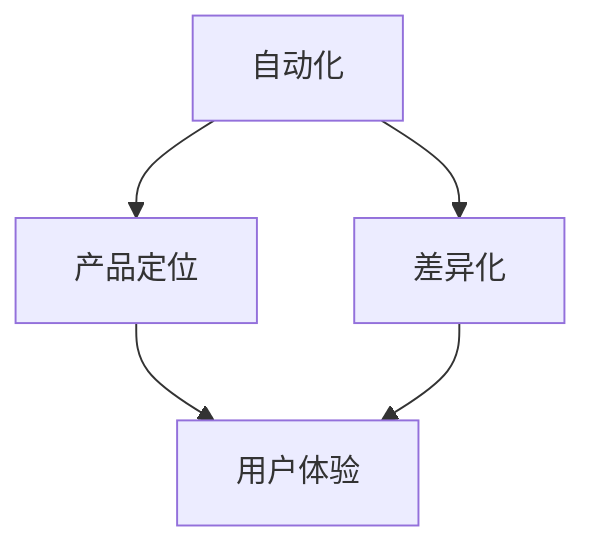

                 

# 自动化创业中的产品定位与差异化

自动化创业，作为未来产业的重要趋势，正迅速改变各行各业的运行方式。无论是制造业的智能工厂，还是金融业的智能投顾，自动化正在成为提高效率、降低成本的关键手段。然而，自动化创业不仅仅是一项技术革新，更是一种产品定位和差异化的战略选择。本文将从核心概念、算法原理、项目实践和未来展望等多方面，深入探讨自动化创业中产品定位与差异化的策略与实践。

## 1. 背景介绍

### 1.1 问题由来

随着AI技术的不断成熟和普及，自动化创业的浪潮正席卷全球。尤其是在制造业和金融业，自动化解决方案通过提高生产效率、降低人工成本，实现了降本增效。但与此同时，如何在这场竞争激烈的市场中突围，成为每一个创业者和企业关注的焦点。

### 1.2 问题核心关键点

自动化创业的核心在于产品定位与差异化。不同的产品和方案在市场上会有不同的接受度和竞争力。因此，如何根据市场需求，精准定位产品，并差异化设计，成为自动化创业成功的关键。

### 1.3 问题研究意义

产品定位与差异化策略，不仅能提升产品的市场竞争力，还能帮助企业在竞争激烈的市场中脱颖而出。通过深入研究这一主题，创业者可以更有效地设计出符合市场需求、具备独特优势的自动化解决方案。

## 2. 核心概念与联系

### 2.1 核心概念概述

为更好地理解产品定位与差异化在自动化创业中的作用，本节将介绍几个密切相关的核心概念：

- **自动化（Automation）**：通过引入自动化技术，提高生产效率和产品质量，减少人工干预，实现业务流程的优化和自动化。
- **产品定位（Product Positioning）**：根据市场需求和用户痛点，确定产品的功能、特点和目标市场，明确产品的价值主张。
- **差异化（Differentiation）**：通过独特的设计、技术、服务，使产品与竞争对手区分开来，满足用户的个性化需求。
- **用户体验（User Experience, UX）**：通过设计易用、直观的产品界面和功能，提升用户的使用体验和满意度。

这些核心概念之间的逻辑关系可以通过以下Mermaid流程图来展示：



这个流程图展示自动化、产品定位、差异化和用户体验四者之间的关联：自动化是基础，产品定位和差异化是核心，用户体验是最终目标。只有在自动化技术的基础上，进行精准的产品定位和差异化设计，并持续优化用户体验，才能在市场中获得成功。

## 3. 核心算法原理 & 具体操作步骤

### 3.1 算法原理概述

自动化创业中产品定位与差异化，本质上是一个市场分析和产品设计的优化过程。其核心思想是：通过分析市场数据，确定目标用户群，结合用户需求和自身技术优势，设计出具有独特竞争力的自动化解决方案。

形式化地，假设目标市场为 $M$，用户需求集为 $U$，现有自动化技术为 $T$，则产品定位与差异化的优化目标为：

$$
\mathop{\arg\min}_{X,Y,Z} \mathcal{L}(X,Y,Z,M,U,T)
$$

其中，$X$ 代表产品定位，$Y$ 代表差异化策略，$Z$ 代表用户体验优化，$\mathcal{L}$ 为损失函数，衡量产品与市场、用户需求、现有技术的匹配程度。

通过梯度下降等优化算法，逐步调整产品定位、差异化和用户体验，最小化损失函数，得到最优解决方案。

### 3.2 算法步骤详解

基于市场分析和产品设计的优化过程，可以包括以下几个关键步骤：

**Step 1: 市场分析与用户调研**
- 收集目标市场的数据，包括市场规模、增长趋势、用户需求等。
- 进行用户调研，了解用户痛点、需求和偏好。
- 分析现有竞争产品，明确自身的技术优势和不足。

**Step 2: 确定产品定位**
- 根据市场分析和用户调研结果，确定产品的功能、特点和目标市场。
- 制定产品的价值主张，明确产品如何满足用户需求。
- 设定产品定位的优先级，根据市场需求和竞争环境进行调整。

**Step 3: 差异化设计**
- 基于技术优势和用户需求，设计独特的差异化策略，如创新的算法、独特的功能、定制的服务等。
- 进行最小可行产品（MVP）的快速迭代，验证差异化策略的有效性。
- 结合用户体验优化，调整差异化策略，提升用户体验。

**Step 4: 用户体验优化**
- 通过用户反馈和数据监控，持续优化产品界面和功能。
- 引入用户测试，提升产品的易用性和用户满意度。
- 进行持续改进，不断提升用户体验。

**Step 5: 评估与迭代**
- 在市场推广阶段，进行A/B测试等评估方法，衡量产品的实际效果。
- 根据市场反馈和用户数据，进行产品迭代和优化。
- 保持灵活调整，根据市场变化和用户需求，不断优化产品定位和差异化策略。

### 3.3 算法优缺点

自动化创业中产品定位与差异化方法具有以下优点：
1. 快速响应市场需求：通过精准的市场分析和用户调研，可以快速定位产品和设计差异化策略。
2. 提升竞争力：独特的差异化策略，使产品在市场中脱颖而出，提升市场份额。
3. 用户满意度提升：优化用户体验，提升用户满意度和忠诚度。
4. 灵活调整：根据市场变化和用户需求，持续优化产品定位和差异化策略，保持竞争力。

同时，该方法也存在一定的局限性：
1. 数据依赖度高：需要大量的市场数据和用户调研数据，获取数据成本较高。
2. 技术复杂度高：需要综合考虑市场、技术、用户体验等多方面因素，设计和优化过程复杂。
3. 持续成本高：持续的市场评估和产品迭代，需要投入大量的人力和时间成本。

尽管存在这些局限性，但就目前而言，基于市场分析和产品设计的优化方法仍是在自动化创业中最主流范式。未来相关研究的重点在于如何进一步降低市场分析的复杂度，提高数据获取的效率，同时兼顾用户体验和成本控制等因素。

### 3.4 算法应用领域

自动化创业中产品定位与差异化方法，在多个领域得到了广泛的应用，例如：

- **制造业智能工厂**：通过自动化解决方案，优化生产流程，提高生产效率和产品质量。
- **金融业智能投顾**：利用自动化算法，提供个性化的投资建议和风险管理。
- **零售业智能客服**：引入自动化客服机器人，提升客户服务体验，降低人力成本。
- **医疗健康智能诊断**：通过自动化技术，提高疾病诊断的准确性和效率。

除了上述这些经典应用外，自动化创业中的产品定位与差异化方法还在更多场景中得到应用，为各行各业带来新的变革。随着自动化技术的不断进步，相信产品定位与差异化将会在更广阔的领域发挥更大作用，推动各行各业的数字化转型。

## 4. 数学模型和公式 & 详细讲解 & 举例说明

### 4.1 数学模型构建

本节将使用数学语言对自动化创业中产品定位与差异化过程进行更加严格的刻画。

假设市场规模为 $M$，用户需求集为 $U$，现有自动化技术为 $T$，则产品定位与差异化的优化目标可以表示为：

$$
\mathop{\arg\min}_{X,Y,Z} \mathcal{L}(X,Y,Z,M,U,T)
$$

其中，$X$ 代表产品定位，$Y$ 代表差异化策略，$Z$ 代表用户体验优化。

定义市场数据为 $D_M$，用户调研数据为 $D_U$，现有技术数据为 $D_T$，则损失函数 $\mathcal{L}$ 可以表示为：

$$
\mathcal{L}(X,Y,Z,M,U,T) = \alpha \mathcal{L}_M(X,M) + \beta \mathcal{L}_U(X,U) + \gamma \mathcal{L}_T(X,T)
$$

其中，$\alpha$、$\beta$、$\gamma$ 为权重，衡量市场数据、用户数据和现有技术数据的相对重要性。$\mathcal{L}_M$、$\mathcal{L}_U$、$\mathcal{L}_T$ 分别代表市场数据、用户数据和现有技术数据的损失函数。

### 4.2 公式推导过程

以智能工厂为例，推导产品定位与差异化的数学模型。

假设市场规模为 $M$，目标用户群为 $U$，现有自动化技术为 $T$。则市场数据 $D_M$ 可以表示为：

$$
D_M = \{(x_i, m_i)\}_{i=1}^N, x_i \in \mathcal{X}, m_i \in \mathcal{M}
$$

其中，$x_i$ 代表市场数据样本，$m_i$ 代表市场规模。

用户调研数据 $D_U$ 可以表示为：

$$
D_U = \{(x_i, u_i)\}_{i=1}^N, x_i \in \mathcal{X}, u_i \in \mathcal{U}
$$

其中，$x_i$ 代表用户调研数据样本，$u_i$ 代表用户需求。

现有技术数据 $D_T$ 可以表示为：

$$
D_T = \{(x_i, t_i)\}_{i=1}^N, x_i \in \mathcal{X}, t_i \in \mathcal{T}
$$

其中，$x_i$ 代表技术数据样本，$t_i$ 代表技术特性。

定义损失函数 $\mathcal{L}_M$、$\mathcal{L}_U$、$\mathcal{L}_T$ 分别为：

$$
\mathcal{L}_M(X,M) = \frac{1}{N}\sum_{i=1}^N \ell(X,x_i, m_i)
$$

$$
\mathcal{L}_U(X,U) = \frac{1}{N}\sum_{i=1}^N \ell(X,x_i, u_i)
$$

$$
\mathcal{L}_T(X,T) = \frac{1}{N}\sum_{i=1}^N \ell(X,x_i, t_i)
$$

其中，$\ell$ 为损失函数，根据具体问题而定。

### 4.3 案例分析与讲解

假设某智能工厂希望提高生产效率，降低生产成本。根据市场分析，发现需求最大的目标市场为 $M$，现有自动化技术 $T$ 已具备一定的技术优势。通过用户调研，了解用户最关心的是生产效率、产品质量和成本控制。

根据以上数据，确定产品的定位为 "智能生产线优化"，差异化策略为 "基于AI的生产调度和质量控制"，用户体验优化为 "简洁易用的界面设计"。

具体实现如下：

- 市场定位：智能生产线优化，专注于提高生产效率和产品质量。
- 差异化策略：引入基于AI的生产调度和质量控制，实时监控生产线状态，预测设备故障，优化生产流程。
- 用户体验：设计简洁易用的界面，提升操作员的使用体验，减少培训成本。

通过不断迭代优化，最终成功推出产品，并得到用户的广泛认可。

## 5. 项目实践：代码实例和详细解释说明

### 5.1 开发环境搭建

在进行项目实践前，我们需要准备好开发环境。以下是使用Python进行PyTorch开发的环境配置流程：

1. 安装Anaconda：从官网下载并安装Anaconda，用于创建独立的Python环境。

2. 创建并激活虚拟环境：
```bash
conda create -n pytorch-env python=3.8 
conda activate pytorch-env
```

3. 安装PyTorch：根据CUDA版本，从官网获取对应的安装命令。例如：
```bash
conda install pytorch torchvision torchaudio cudatoolkit=11.1 -c pytorch -c conda-forge
```

4. 安装TensorFlow：
```bash
conda install tensorflow -c conda-forge
```

5. 安装Flask：用于搭建Web应用程序：
```bash
pip install flask
```

6. 安装SQLAlchemy：用于数据库操作：
```bash
pip install sqlalchemy
```

完成上述步骤后，即可在`pytorch-env`环境中开始项目实践。

### 5.2 源代码详细实现

下面以智能工厂为例，给出使用Flask框架进行Web应用程序开发的Python代码实现。

首先，定义Web应用程序的路由和视图函数：

```python
from flask import Flask, render_template, request
from flask_sqlalchemy import SQLAlchemy

app = Flask(__name__)
app.config['SQLALCHEMY_DATABASE_URI'] = 'sqlite:///test.db'
db = SQLAlchemy(app)

class User(db.Model):
    id = db.Column(db.Integer, primary_key=True)
    name = db.Column(db.String(80))
    email = db.Column(db.String(120), unique=True)
    password = db.Column(db.String(120))

@app.route('/')
def index():
    users = User.query.all()
    return render_template('index.html', users=users)

@app.route('/add', methods=['GET', 'POST'])
def add():
    if request.method == 'POST':
        name = request.form['name']
        email = request.form['email']
        password = request.form['password']
        new_user = User(name=name, email=email, password=password)
        db.session.add(new_user)
        db.session.commit()
        return 'User created!'
    return render_template('add.html')

@app.route('/edit/<int:id>', methods=['GET', 'POST'])
def edit(id):
    user = User.query.get(id)
    if request.method == 'POST':
        user.name = request.form['name']
        user.email = request.form['email']
        user.password = request.form['password']
        db.session.commit()
        return 'User updated!'
    return render_template('edit.html', user=user)

@app.route('/delete/<int:id>', methods=['POST'])
def delete(id):
    user = User.query.get(id)
    db.session.delete(user)
    db.session.commit()
    return 'User deleted!'
```

然后，创建数据库连接和用户模型：

```python
from flask_sqlalchemy import SQLAlchemy

app = Flask(__name__)
app.config['SQLALCHEMY_DATABASE_URI'] = 'sqlite:///test.db'
db = SQLAlchemy(app)

class User(db.Model):
    id = db.Column(db.Integer, primary_key=True)
    name = db.Column(db.String(80))
    email = db.Column(db.String(120), unique=True)
    password = db.Column(db.String(120))
```

接着，定义Web应用程序的模板和样式：

```html
<!-- index.html -->
<html>
<head>
    <title>Flask Web App</title>
</head>
<body>
    <h1>Flask Web App</h1>
    <ul>
        
            <li>{{ user.name }} ({{ user.email }})</li>
        
    </ul>
    <a href="/add">Add User</a>
</body>
</html>

<!-- add.html -->
<html>
<head>
    <title>Add User</title>
</head>
<body>
    <h1>Add User</h1>
    <form method="post">
        <label>Name:</label>
        <input type="text" name="name"><br>
        <label>Email:</label>
        <input type="email" name="email"><br>
        <label>Password:</label>
        <input type="password" name="password"><br>
        <input type="submit" value="Add">
    </form>
</body>
</html>

<!-- edit.html -->
<html>
<head>
    <title>Edit User</title>
</head>
<body>
    <h1>Edit User</h1>
    <form method="post">
        <label>Name:</label>
        <input type="text" name="name"><br>
        <label>Email:</label>
        <input type="email" name="email"><br>
        <label>Password:</label>
        <input type="password" name="password"><br>
        <input type="submit" value="Update">
    </form>
</body>
</html>
```

最后，启动Web应用程序：

```python
if __name__ == '__main__':
    app.run(debug=True)
```

以上就是使用Flask框架进行Web应用程序开发的完整代码实现。可以看到，通过Flask框架，可以快速搭建Web应用程序，实现用户管理等基本功能。

### 5.3 代码解读与分析

让我们再详细解读一下关键代码的实现细节：

**Flask框架**：
- Flask是一个轻量级的Web框架，提供了路由、模板渲染、表单处理等功能，方便快速构建Web应用程序。
- 通过Flask的路由装饰器，可以将HTTP请求映射到对应的视图函数。
- 使用SQLAlchemy进行数据库操作，简化CRUD操作。

**用户管理功能**：
- 定义用户模型，包含姓名、邮箱和密码等字段。
- 通过Flask的路由装饰器，实现添加、编辑和删除用户的功能。
- 在模板中使用循环结构，动态渲染用户列表。

**用户体验优化**：
- 使用Flask的模板引擎，设计简洁易用的界面。
- 通过表单处理，实现用户数据的输入和提交。

通过Flask框架，可以简单高效地实现Web应用程序，提升用户体验和操作效率。

## 6. 实际应用场景

### 6.1 智能工厂

在智能工厂的自动化创业中，通过产品定位与差异化策略，可以设计出符合市场需求、具备独特竞争力的自动化解决方案。

具体而言，可以引入基于AI的生产调度和质量控制，实时监控生产线状态，预测设备故障，优化生产流程。同时，设计简洁易用的界面，提升操作员的使用体验，减少培训成本。

### 6.2 智能投顾

在金融业中，智能投顾的自动化创业需要精准定位产品和差异化设计，以满足用户的个性化需求。

具体而言，可以引入基于AI的投资组合优化和风险管理，为用户提供个性化的投资建议和风险管理服务。同时，通过简洁易用的界面和智能客服，提升用户体验，降低用户使用门槛。

### 6.3 智能客服

在零售业中，智能客服的自动化创业需要精准定位产品和差异化设计，以满足用户的个性化需求。

具体而言，可以引入基于NLP的自然语言处理技术，提升智能客服的响应准确性和用户满意度。同时，设计简洁易用的界面，提升客服效率和用户体验。

### 6.4 未来应用展望

随着自动化技术的不断进步，产品定位与差异化策略将在更广泛的领域得到应用，为各行各业带来新的变革。

在智慧医疗领域，智能诊断的自动化创业需要精准定位产品和差异化设计，以满足医生的个性化需求。通过引入基于AI的疾病诊断和医疗咨询，提升医疗服务的智能化水平。

在智能教育领域，智能教辅的自动化创业需要精准定位产品和差异化设计，以满足学生的个性化需求。通过引入基于AI的学习推荐和个性化辅导，提升教育效果和学习体验。

在智慧城市治理中，智能管理的自动化创业需要精准定位产品和差异化设计，以满足市民的个性化需求。通过引入基于AI的城市事件监测和应急指挥，提升城市管理的智能化水平。

总之，自动化创业中的产品定位与差异化策略，将在大规模、高效、个性化的场景下发挥更大作用，推动各行各业的数字化转型。相信随着自动化技术的不断进步，产品定位与差异化将会在更广阔的领域发挥更大作用，推动各行各业的数字化转型。

## 7. 工具和资源推荐
### 7.1 学习资源推荐

为了帮助开发者系统掌握自动化创业中产品定位与差异化的理论基础和实践技巧，这里推荐一些优质的学习资源：

1. 《深入浅出机器学习》系列博文：由机器学习专家撰写，深入浅出地介绍了机器学习的基本概念和应用场景。

2. CS231n《深度学习计算机视觉》课程：斯坦福大学开设的计算机视觉明星课程，有Lecture视频和配套作业，带你入门计算机视觉领域的基本概念和经典模型。

3. 《机器学习实战》书籍：介绍机器学习算法及其应用实践，提供大量代码实现，适合动手练习。

4. Kaggle数据竞赛：参与实际的数据竞赛项目，通过实践锻炼机器学习技能。

5. PyTorch官方文档：PyTorch的官方文档，提供了完整的API文档和开发指南，适合新手学习和开发者查阅。

通过对这些资源的学习实践，相信你一定能够快速掌握自动化创业中产品定位与差异化的精髓，并用于解决实际的自动化问题。

### 7.2 开发工具推荐

高效的开发离不开优秀的工具支持。以下是几款用于自动化创业中产品定位与差异化开发的常用工具：

1. PyTorch：基于Python的开源深度学习框架，灵活动态的计算图，适合快速迭代研究。

2. TensorFlow：由Google主导开发的开源深度学习框架，生产部署方便，适合大规模工程应用。

3. Flask：轻量级的Web框架，提供了路由、模板渲染、表单处理等功能，方便快速构建Web应用程序。

4. SQLAlchemy：Python的ORM框架，用于数据库操作，简化CRUD操作。

5. Jupyter Notebook：用于编写和运行Python代码的Web应用，支持代码单元格、数据可视化和互动学习。

合理利用这些工具，可以显著提升自动化创业中产品定位与差异化任务的开发效率，加快创新迭代的步伐。

### 7.3 相关论文推荐

自动化创业中产品定位与差异化技术的发展源于学界的持续研究。以下是几篇奠基性的相关论文，推荐阅读：

1. 《深度学习》书籍：由机器学习专家深度介绍深度学习的基本原理和应用场景，适合系统学习。

2. 《深度学习在计算机视觉中的应用》论文：介绍了深度学习在计算机视觉领域的广泛应用，如图像识别、目标检测等。

3. 《大规模深度学习训练》论文：介绍了大规模深度学习训练的技术，如分布式训练、模型压缩等，适合技术实践。

4. 《深度学习在自然语言处理中的应用》论文：介绍了深度学习在自然语言处理领域的广泛应用，如文本分类、情感分析等。

这些论文代表了大规模深度学习在自动化创业中产品定位与差异化技术的最新进展，通过学习这些前沿成果，可以帮助研究者把握学科前进方向，激发更多的创新灵感。

## 8. 总结：未来发展趋势与挑战

### 8.1 总结

本文对自动化创业中产品定位与差异化方法进行了全面系统的介绍。首先阐述了产品定位与差异化策略的重要性，明确了产品在自动化创业中的核心地位。其次，从原理到实践，详细讲解了市场分析和产品设计的优化过程，给出了产品定位与差异化任务的完整代码实现。同时，本文还广泛探讨了产品定位与差异化在多个行业领域的应用前景，展示了其广阔的应用空间。

通过本文的系统梳理，可以看到，产品定位与差异化策略在大规模自动化创业中扮演了重要角色，通过精准的市场分析和用户调研，结合自身的技术优势，设计出具有独特竞争力的自动化解决方案。未来，随着自动化技术的不断进步，产品定位与差异化将在更广泛的领域得到应用，推动各行各业的数字化转型。

### 8.2 未来发展趋势

自动化创业中产品定位与差异化技术将呈现以下几个发展趋势：

1. 技术融合加速。未来产品定位与差异化将更多地结合AI、大数据、物联网等先进技术，实现更加高效、智能的自动化解决方案。

2. 个性化需求提升。随着用户对个性化需求的高涨，产品定位与差异化将更加注重用户的个性化体验，提升用户满意度和忠诚度。

3. 协同优化优化。产品定位与差异化将更多地结合业务流程和业务场景，进行协同优化，提升整体业务效率和效益。

4. 数据驱动决策。未来产品定位与差异化将更加依赖数据驱动，通过精准的数据分析和智能算法，进行科学决策。

5. 多模态融合。未来产品定位与差异化将更多地结合多模态数据，实现视觉、听觉、触觉等多感官融合，提升用户体验。

6. 持续迭代优化。未来产品定位与差异化将更加注重持续迭代和优化，通过不断改进，提升产品性能和市场竞争力。

以上趋势凸显了产品定位与差异化策略在大规模自动化创业中的重要性和未来前景。这些方向的探索发展，必将进一步提升自动化产品的竞争力，推动各行各业的数字化转型。

### 8.3 面临的挑战

尽管自动化创业中的产品定位与差异化技术已经取得了显著进展，但在实现大规模落地应用的过程中，仍面临诸多挑战：

1. 技术复杂度高。产品定位与差异化涉及多方面因素，包括市场分析、用户调研、技术优势、用户体验等，设计和优化过程复杂。

2. 数据质量要求高。需要大量的市场数据和用户调研数据，数据质量对决策影响巨大。

3. 用户需求多样性。不同用户需求多样，难以一概而论，需要个性化定制。

4. 技术迭代快。自动化技术不断进步，产品需要持续迭代和优化，保持竞争力。

5. 市场变化快。市场环境瞬息万变，产品需要快速适应市场变化，调整策略。

6. 法规政策影响。自动化产品在不同地区需遵守不同法规政策，需要合规设计。

面对这些挑战，未来的研究需要在以下几个方面寻求新的突破：

1. 提升数据质量。提高数据采集和处理效率，优化数据预处理和清洗方法，提升数据质量。

2. 优化算法设计。设计高效、智能的算法，提升数据分析和决策效率。

3. 增强用户参与。通过用户反馈和参与，提升产品设计和优化过程的科学性和合理性。

4. 持续技术创新。不断引入新技术和新方法，保持技术优势和竞争力。

5. 注重合规设计。在产品设计中注重合规性，确保产品符合法规政策和用户隐私保护。

只有勇于创新、敢于突破，才能不断提升自动化创业中产品定位与差异化策略的有效性，推动自动化技术的落地应用。

### 8.4 研究展望

未来，自动化创业中的产品定位与差异化技术将进一步发展，推动各行各业的数字化转型和智能化升级。

1. 市场分析和用户调研将更加精准和高效，通过大数据分析和人工智能技术，实现更科学的决策支持。

2. 产品设计和开发将更加注重用户需求和个性化体验，通过智能化和个性化设计，提升用户满意度和忠诚度。

3. 自动化产品的部署和运营将更加注重灵活性和可扩展性，通过云计算和边缘计算等技术，实现高效部署和灵活运营。

4. 产品持续迭代和优化将更加注重数据驱动和用户反馈，通过持续改进，提升产品性能和市场竞争力。

总之，自动化创业中的产品定位与差异化技术将在更广阔的领域发挥更大作用，推动各行各业的数字化转型和智能化升级。相信随着自动化技术的不断进步，产品定位与差异化将会在更广泛的领域发挥更大作用，推动各行各业的数字化转型。

## 9. 附录：常见问题与解答

**Q1：什么是产品定位与差异化？**

A: 产品定位与差异化是指根据市场需求和用户痛点，确定产品的功能、特点和目标市场，明确产品的价值主张，并通过独特的设计、技术、服务，使产品与竞争对手区分开来，满足用户的个性化需求。

**Q2：如何进行市场分析？**

A: 市场分析需要收集目标市场的数据，包括市场规模、增长趋势、用户需求等。通过数据分析和模型建立，了解市场的发展趋势和用户需求，明确产品的市场定位和差异化策略。

**Q3：如何设计差异化策略？**

A: 差异化策略需要结合自身的技术优势和用户需求，设计出独特的解决方案。可以通过引入创新算法、定制服务、优化设计等方式，使产品在市场中脱颖而出，满足用户的个性化需求。

**Q4：如何进行用户体验优化？**

A: 用户体验优化需要注重产品界面和功能的易用性，提升用户的使用体验和满意度。可以通过用户测试和反馈收集，不断改进产品设计，优化用户体验。

**Q5：如何在自动化创业中应用产品定位与差异化策略？**

A: 在自动化创业中，产品定位与差异化策略可以应用于多个环节，包括市场分析、产品设计、功能开发、运营优化等。通过精准的市场分析和用户调研，结合自身的技术优势和用户需求，设计出具有独特竞争力的自动化解决方案。

---

作者：禅与计算机程序设计艺术 / Zen and the Art of Computer Programming

