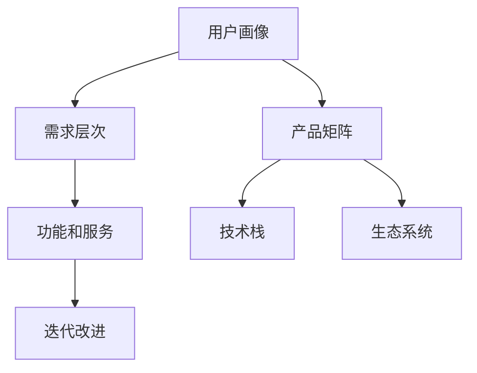

                 

# 自动化创业中的产品矩阵策略

在当前的数字化浪潮下，自动化技术正成为驱动企业增长的新引擎。自动化创业，即利用人工智能、机器学习、自然语言处理等自动化技术，开发创新产品，构建差异化竞争优势，已成为许多初创企业的核心战略之一。本文将探讨自动化创业中产品矩阵的构建策略，帮助企业从零开始，构建一个健康、可持续发展的自动化产品矩阵，为市场提供具备创新力和竞争力的一系列产品。

## 1. 背景介绍

### 1.1 问题由来
随着技术的发展，自动化创业的门槛逐渐降低。越来越多的创业团队开始利用先进的自动化技术，开发智能应用和系统，以期在市场竞争中占据有利地位。然而，如何高效地构建一个产品矩阵，以覆盖不同层次的用户需求和业务场景，成为初创企业面临的重大挑战。

### 1.2 问题核心关键点
构建产品矩阵的关键点在于：

1. **目标定位**：明确企业的市场定位和目标用户群，构建与其需求相匹配的产品线。
2. **需求分析**：深入分析用户需求，确定各产品的功能和服务范围。
3. **技术适配**：选择合适的自动化技术，确保各产品之间的技术兼容性和整合性。
4. **资源配置**：合理配置人力、物力和财力资源，确保产品矩阵的可持续发展。
5. **迭代优化**：持续优化产品矩阵，根据市场需求和用户反馈进行调整和改进。

### 1.3 问题研究意义
构建合理的产品矩阵，不仅能够提升企业的产品竞争力和市场占有率，还能够提高企业的运营效率和盈利能力。对于初创企业而言，通过科学的产品矩阵策略，可以在有限的资源下，最大化地满足用户需求，加速市场拓展和业务增长。

## 2. 核心概念与联系

### 2.1 核心概念概述

为更好地理解自动化创业中产品矩阵的构建策略，本节将介绍几个密切相关的核心概念：

- **产品矩阵**：指企业在同一市场中提供的多条产品线，覆盖不同用户群体和需求层次。
- **用户画像**：企业基于用户特征和行为，构建的用户群体分类和描述。
- **需求层次**：用户对产品功能的不同层次需求，从基础功能到高级应用。
- **技术栈**：企业使用的各种技术工具、框架和库，用于开发和维护产品。
- **迭代改进**：基于用户反馈和市场变化，对产品进行持续优化和升级的过程。
- **生态系统**：企业构建的产品矩阵及其相关服务、合作伙伴和用户社区，形成的一个完整的系统。

这些核心概念之间的逻辑关系可以通过以下Mermaid流程图来展示：



这个流程图展示了一些关键概念之间的关系：

1. 用户画像定义了目标用户群体的特征和行为。
2. 需求层次描述了用户对不同功能和服务的需求。
3. 产品矩阵由多条产品线组成，每条产品线覆盖不同的需求层次。
4. 技术栈提供了产品开发和维护所需的技术工具和框架。
5. 迭代改进使产品能够持续适应市场变化和用户需求。
6. 生态系统包含了产品矩阵及相关服务、合作伙伴和用户社区。

## 3. 核心算法原理 & 具体操作步骤
### 3.1 算法原理概述

构建自动化创业的产品矩阵，本质上是一个需求驱动的产品设计和优化过程。其核心思想是：根据用户画像和需求层次，设计多条产品线，覆盖不同的用户群体和需求层次，并通过持续的迭代改进，确保产品矩阵能够动态适应市场变化。

具体而言，产品矩阵的构建过程可以分为以下几个关键步骤：

1. **市场调研**：通过问卷调查、用户访谈等方式，收集用户需求和市场趋势，为产品设计提供数据支持。
2. **需求分析**：基于市场调研结果，对用户需求进行分类和层次划分，确定各产品线的功能和范围。
3. **技术选型**：根据产品需求，选择合适的自动化技术和工具，构建技术栈。
4. **产品开发**：根据需求分析和技术选型，设计并开发产品原型，进行用户测试。
5. **迭代优化**：根据用户反馈和市场变化，持续优化产品功能和用户体验，完善产品矩阵。
6. **生态构建**：构建产品矩阵及其相关服务、合作伙伴和用户社区，形成完整的生态系统。

### 3.2 算法步骤详解

**Step 1: 市场调研**
- 设计问卷和访谈提纲，收集用户需求和痛点。
- 分析用户反馈，提炼出共性需求和差异需求。
- 研究市场趋势和竞争环境，明确企业定位和竞争优势。

**Step 2: 需求分析**
- 将用户需求按功能、服务、用户体验等维度进行分类。
- 确定各需求层次，从基础功能到高级应用。
- 根据需求层次划分，设计产品线，确保每条产品线覆盖不同的需求层次。

**Step 3: 技术选型**
- 评估各自动化技术的特点和适用性。
- 选择合适的技术和工具，构建统一的技术栈。
- 确保技术栈能够支撑各产品线的开发和维护。

**Step 4: 产品开发**
- 根据需求分析和技术选型，设计产品原型。
- 开发产品原型，并进行用户测试。
- 收集用户反馈，优化产品功能和用户体验。

**Step 5: 迭代优化**
- 根据用户反馈和市场变化，持续优化产品功能和用户体验。
- 定期更新产品矩阵，确保产品能够动态适应市场需求。
- 引入新技术和新工具，提升产品矩阵的竞争力。

**Step 6: 生态构建**
- 构建产品矩阵及相关服务，提供全方位的用户体验。
- 引入合作伙伴和用户社区，形成完整的生态系统。
- 持续优化生态系统，提升用户粘性和满意度。

### 3.3 算法优缺点

构建产品矩阵的方法具有以下优点：

1. **全面覆盖用户需求**：通过设计多条产品线，能够覆盖不同层次的用户需求，提升用户满意度和忠诚度。
2. **灵活应对市场变化**：通过持续的迭代优化，产品矩阵能够动态适应市场变化，保持竞争优势。
3. **提升企业运营效率**：统一的技术栈和产品线设计，能够提高企业运营效率，降低开发和维护成本。
4. **促进创新和研发**：产品矩阵的构建和优化过程，能够促进企业的创新和研发能力。

然而，该方法也存在以下局限性：

1. **资源消耗大**：构建和维护一个完整的产品矩阵，需要大量的人力、物力和财力资源。
2. **市场风险高**：市场变化和用户需求的不确定性，可能导致产品矩阵无法满足市场需求。
3. **技术复杂度高**：选择合适的技术栈和工具，需要进行全面的技术评估和选型。
4. **迭代周期长**：产品矩阵的迭代优化需要较长的周期，难以快速响应市场变化。

### 3.4 算法应用领域

产品矩阵构建方法在自动化创业中具有广泛的应用，主要包括以下几个领域：

1. **智能客服系统**：通过构建多条产品线，覆盖不同用户的需求层次，提供全面的智能客服解决方案。
2. **智能推荐系统**：利用用户行为数据，设计不同层次的推荐服务，提升用户体验和转化率。
3. **智能搜索和导航**：提供基于自然语言处理的搜索和导航服务，覆盖不同的搜索场景和需求。
4. **智能内容生成**：构建多条内容生成产品线，覆盖不同的内容形式和发布渠道。
5. **智能安全与监控**：设计多条安全与监控产品线，确保数据和系统安全。
6. **智能运营与优化**：提供智能运营和优化服务，提升企业的运营效率和盈利能力。

## 4. 数学模型和公式 & 详细讲解
### 4.1 数学模型构建

为了更精确地描述产品矩阵的构建过程，本节将使用数学语言对关键步骤进行建模。

设企业目标市场为 $M$，用户群体为 $U$，用户需求为 $D$。企业设计的产品矩阵为 $\{P_i\}_{i=1}^n$，其中 $P_i$ 表示第 $i$ 条产品线，覆盖的用户需求为 $D_i \subseteq D$。

企业根据用户需求 $D$ 构建产品矩阵 $\{P_i\}_{i=1}^n$，每条产品线 $P_i$ 的功能和服务为 $F_i \subseteq D_i$。企业的技术栈为 $T$，包括自动化的技术和工具。

### 4.2 公式推导过程

企业构建产品矩阵的过程可以建模为：

$$
\min_{\{P_i\}_{i=1}^n} \sum_{i=1}^n \sum_{d \in D_i} c_d \cdot I(d \in F_i)
$$

其中 $c_d$ 表示需求 $d$ 的权重，$I(\cdot)$ 表示指示函数，$I(d \in F_i) = 1$ 表示需求 $d$ 被产品线 $P_i$ 覆盖，$I(d \in F_i) = 0$ 表示需求 $d$ 未被产品线 $P_i$ 覆盖。

目标函数表示最小化未被产品线覆盖的需求，即最大化产品矩阵对用户需求的覆盖度。约束条件包括：

1. 每条产品线 $P_i$ 的功能和服务满足 $F_i \subseteq D_i$。
2. 每条产品线 $P_i$ 的技术栈满足 $T_i \subseteq T$。
3. 产品线的数量满足 $n \in \{1,2,\dots,N\}$，其中 $N$ 为产品线最大数量限制。

### 4.3 案例分析与讲解

以智能推荐系统为例，分析产品矩阵构建过程。

假设企业面向用户的推荐需求为 $D = \{浏览推荐、购买推荐、内容推荐\}$。根据市场调研，用户对不同需求层次的需求权重为 $c_{浏览推荐} = 0.3$，$c_{购买推荐} = 0.4$，$c_{内容推荐} = 0.3$。

企业设计了两条产品线 $P_1$ 和 $P_2$，其中 $P_1$ 的功能和服务为 $F_1 = \{浏览推荐, 购买推荐\}$，$P_2$ 的功能和服务为 $F_2 = \{内容推荐\}$。企业选择的技术栈为 $T = \{自然语言处理, 机器学习, 数据库\}$。

通过求解上述数学模型，得到最优的产品矩阵 $\{P_1, P_2\}$，覆盖所有用户需求 $D$，满足技术栈 $T$ 的限制，且未被覆盖的需求权重总和最小。

## 5. 项目实践：代码实例和详细解释说明
### 5.1 开发环境搭建

在进行产品矩阵构建的实践前，我们需要准备好开发环境。以下是使用Python进行Flask开发的开发环境配置流程：

1. 安装Anaconda：从官网下载并安装Anaconda，用于创建独立的Python环境。

2. 创建并激活虚拟环境：
```bash
conda create -n flask-env python=3.8 
conda activate flask-env
```

3. 安装Flask：
```bash
pip install flask
```

4. 安装所需库：
```bash
pip install pandas numpy requests beautifulsoup4
```

5. 安装Flask扩展库：
```bash
pip install flask-login flask-migrate flask-sqlalchemy flask-restful
```

完成上述步骤后，即可在`flask-env`环境中开始产品矩阵构建的实践。

### 5.2 源代码详细实现

我们以智能推荐系统为例，使用Flask构建一个简单的产品矩阵。

```python
from flask import Flask, request, jsonify
from flask_sqlalchemy import SQLAlchemy
from flask_migrate import Migrate
from flask_restful import Resource, Api

app = Flask(__name__)
app.config['SQLALCHEMY_DATABASE_URI'] = 'sqlite:///product_matrix.db'
db = SQLAlchemy(app)
migrate = Migrate(app, db)

class Product(db.Model):
    id = db.Column(db.Integer, primary_key=True)
    name = db.Column(db.String(50), nullable=False)
    description = db.Column(db.Text, nullable=False)
    tech_stack = db.Column(db.Text, nullable=False)
    functionality = db.Column(db.Text, nullable=False)

    def __init__(self, name, description, tech_stack, functionality):
        self.name = name
        self.description = description
        self.tech_stack = tech_stack
        self.functionality = functionality

@app.route('/products', methods=['GET'])
def get_products():
    products = Product.query.all()
    product_list = []
    for product in products:
        product_dict = {
            'id': product.id,
            'name': product.name,
            'description': product.description,
            'tech_stack': product.tech_stack,
            'functionality': product.functionality
        }
        product_list.append(product_dict)
    return jsonify({'products': product_list})

@app.route('/products/<id>', methods=['GET'])
def get_product(id):
    product = Product.query.get(id)
    if not product:
        return jsonify({'error': 'Product not found'})
    product_dict = {
        'id': product.id,
        'name': product.name,
        'description': product.description,
        'tech_stack': product.tech_stack,
        'functionality': product.functionality
    }
    return jsonify(product_dict)

@app.route('/products', methods=['POST'])
def add_product():
    data = request.get_json()
    product = Product(
        name=data['name'],
        description=data['description'],
        tech_stack=data['tech_stack'],
        functionality=data['functionality']
    )
    db.session.add(product)
    db.session.commit()
    return jsonify({'message': 'Product added successfully'})

@app.route('/products/<id>', methods=['PUT'])
def update_product(id):
    product = Product.query.get(id)
    if not product:
        return jsonify({'error': 'Product not found'})
    data = request.get_json()
    product.name = data['name']
    product.description = data['description']
    product.tech_stack = data['tech_stack']
    product.functionality = data['functionality']
    db.session.commit()
    return jsonify({'message': 'Product updated successfully'})

@app.route('/products/<id>', methods=['DELETE'])
def delete_product(id):
    product = Product.query.get(id)
    if not product:
        return jsonify({'error': 'Product not found'})
    db.session.delete(product)
    db.session.commit()
    return jsonify({'message': 'Product deleted successfully'})

if __name__ == '__main__':
    app.run(debug=True)
```

在上述代码中，我们使用了Flask框架构建了一个简单的产品管理API。通过定义`Product`类，我们实现了产品的CRUD操作。

### 5.3 代码解读与分析

让我们再详细解读一下关键代码的实现细节：

**Flask应用和SQLAlchemy模型**：
- `Flask` 是一个轻量级的 Python Web 框架，方便开发 Web 应用。
- `SQLAlchemy` 是一个 SQL 工具包和 ORM（对象关系映射）工具，方便进行数据库操作。
- `migrate` 是一个迁移工具，用于管理数据库迁移，方便维护数据库结构。

**API资源**：
- `get_products`：获取所有产品的列表。
- `get_product`：根据产品ID获取单个产品的详细信息。
- `add_product`：添加新的产品。
- `update_product`：更新指定ID的产品信息。
- `delete_product`：删除指定ID的产品。

**Flask扩展**：
- `jsonify`：用于返回 JSON 格式的响应。

**开发环境配置**：
- 安装所需库，如 Flask、SQLAlchemy、migrate 等。
- 配置 Flask 应用和数据库连接。

**运行结果展示**：
- 启动 Flask 应用，访问 `localhost:5000/products`，查看所有产品列表。
- 通过 `POST` 请求添加新的产品，获取返回的 JSON 响应。
- 通过 `GET`、`PUT`、`DELETE` 请求对产品进行增删改查操作，获取返回的 JSON 响应。

## 6. 实际应用场景
### 6.1 智能客服系统

构建产品矩阵策略在智能客服系统中具有广泛应用。智能客服系统通过构建多条产品线，覆盖不同层次的用户需求，提供全方位的智能客服解决方案。

在智能客服系统中，企业可以设计多条产品线，包括智能问答、情感分析、语义理解等，覆盖用户咨询、投诉、售后等不同场景。通过持续的迭代优化，系统能够动态适应用户需求，提升客服效率和用户满意度。

### 6.2 智能推荐系统

智能推荐系统是产品矩阵构建策略的重要应用之一。通过分析用户行为数据，设计不同层次的推荐服务，能够有效提升用户体验和转化率。

在智能推荐系统中，企业可以设计多条产品线，包括个性化推荐、内容推荐、搜索推荐等，覆盖用户的浏览、购买、搜索等不同需求。通过持续的迭代优化，系统能够动态适应用户需求，提升推荐精准度和用户体验。

### 6.3 智能搜索和导航

智能搜索和导航系统通过构建多条产品线，覆盖不同的搜索场景和需求，提供全面的搜索和导航服务。

在智能搜索和导航系统中，企业可以设计多条产品线，包括文本搜索、图片搜索、视频搜索等，覆盖用户的多种搜索需求。通过持续的迭代优化，系统能够动态适应用户需求，提升搜索效率和用户体验。

### 6.4 智能内容生成

智能内容生成系统通过构建多条产品线，覆盖不同的内容形式和发布渠道，提供全面的内容生成服务。

在智能内容生成系统中，企业可以设计多条产品线，包括新闻生成、评论生成、摘要生成等，覆盖不同的内容形式。通过持续的迭代优化，系统能够动态适应用户需求，提升内容生成效率和质量。

### 6.5 智能安全与监控

智能安全与监控系统通过构建多条产品线，覆盖不同的安全需求和监控需求，提供全面的安全与监控服务。

在智能安全与监控系统中，企业可以设计多条产品线，包括威胁检测、入侵防御、行为分析等，覆盖不同的安全需求。通过持续的迭代优化，系统能够动态适应安全需求，提升安全防护能力和监控效率。

### 6.6 智能运营与优化

智能运营与优化系统通过构建多条产品线，覆盖不同的运营需求和优化需求，提供全面的运营与优化服务。

在智能运营与优化系统中，企业可以设计多条产品线，包括数据采集、数据分析、自动调优等，覆盖不同的运营需求。通过持续的迭代优化，系统能够动态适应运营需求，提升运营效率和优化效果。

## 7. 工具和资源推荐
### 7.1 学习资源推荐

为了帮助开发者系统掌握产品矩阵构建的理论基础和实践技巧，这里推荐一些优质的学习资源：

1. **《深入浅出产品设计》**：一本详细介绍产品设计的书籍，涵盖了产品矩阵、用户画像、需求分析等关键概念。

2. **Coursera《Product Management》课程**：由知名产品经理设计的课程，涵盖产品开发、市场策略、用户研究等知识。

3. **产品矩阵构建工具和资源**：例如，Mint、LeanKit、Jira等工具，帮助企业规划和管理产品矩阵。

4. **产品管理社区**：如Product Manager 360、Mind the Product等，提供产品管理的学习资源和交流平台。

通过对这些资源的学习实践，相信你一定能够快速掌握产品矩阵构建的精髓，并用于解决实际的业务问题。

### 7.2 开发工具推荐

高效的开发离不开优秀的工具支持。以下是几款用于产品矩阵构建开发的常用工具：

1. **JIRA**：一个强大的项目管理工具，用于需求跟踪、任务分配和进度管理。

2. **Trello**：一个灵活的项目管理工具，提供看板、列表、卡片等功能，方便团队协作。

3. **Confluence**：一个协作工具，用于知识管理、文档共享和团队协作。

4. **Slack**：一个即时通讯工具，方便团队沟通和协作。

5. **Zoom**：一个视频会议工具，支持多人视频通话和屏幕共享。

合理利用这些工具，可以显著提升产品矩阵构建任务的开发效率，加快创新迭代的步伐。

### 7.3 相关论文推荐

产品矩阵构建技术的发展源于学界的持续研究。以下是几篇奠基性的相关论文，推荐阅读：

1. **《从0到1：打造成功的产品》**：一本详细介绍产品设计的书籍，涵盖产品矩阵、用户画像、需求分析等关键概念。

2. **《数据驱动的产品管理》**：一篇介绍如何利用数据分析进行产品管理的文章，涵盖产品矩阵、用户研究、市场分析等知识。

3. **《产品矩阵构建方法论》**：一篇详细介绍产品矩阵构建方法论的论文，涵盖需求分析、产品设计、市场策略等知识。

4. **《基于用户画像的产品矩阵构建方法》**：一篇详细介绍基于用户画像进行产品矩阵构建的论文，涵盖用户画像构建、需求分析、产品设计等知识。

这些论文代表了大语言模型微调技术的发展脉络。通过学习这些前沿成果，可以帮助研究者把握学科前进方向，激发更多的创新灵感。

## 8. 总结：未来发展趋势与挑战
### 8.1 总结

本文对自动化创业中产品矩阵的构建策略进行了全面系统的介绍。首先阐述了产品矩阵构建的背景和意义，明确了产品矩阵在企业自动化创业中的重要价值。其次，从原理到实践，详细讲解了产品矩阵的构建过程，给出了产品矩阵构建的完整代码实例。同时，本文还广泛探讨了产品矩阵在智能客服、智能推荐、智能搜索、智能内容生成等多个领域的应用前景，展示了产品矩阵构建范式的巨大潜力。此外，本文精选了产品矩阵构建的相关学习资源，力求为读者提供全方位的技术指引。

通过本文的系统梳理，可以看到，产品矩阵构建策略在自动化创业中具有广泛的应用前景，能够帮助企业构建一个健康、可持续发展的产品矩阵，为市场提供具备创新力和竞争力的一系列产品。

### 8.2 未来发展趋势

展望未来，产品矩阵构建技术将呈现以下几个发展趋势：

1. **个性化定制**：产品矩阵构建将更加注重个性化需求，提供定制化的产品和服务。
2. **全渠道整合**：产品矩阵构建将更加注重跨渠道整合，实现多平台、多渠道的协同运营。
3. **用户数据利用**：产品矩阵构建将更加注重用户数据的利用，通过数据分析提升产品矩阵的优化效果。
4. **AI与产品结合**：产品矩阵构建将更加注重AI技术的应用，提升产品矩阵的智能化水平。
5. **持续优化**：产品矩阵构建将更加注重持续优化，通过迭代改进提升产品矩阵的竞争力和用户体验。

以上趋势凸显了产品矩阵构建技术的广阔前景。这些方向的探索发展，必将进一步提升企业的自动化创业能力，构建更加智能、高效、创新的产品矩阵。

### 8.3 面临的挑战

尽管产品矩阵构建技术已经取得了瞩目成就，但在迈向更加智能化、普适化应用的过程中，它仍面临着诸多挑战：

1. **资源消耗大**：构建和维护一个完整的产品矩阵，需要大量的人力、物力和财力资源。
2. **市场风险高**：市场变化和用户需求的不确定性，可能导致产品矩阵无法满足市场需求。
3. **技术复杂度高**：选择合适的技术栈和工具，需要进行全面的技术评估和选型。
4. **迭代周期长**：产品矩阵的迭代优化需要较长的周期，难以快速响应市场变化。
5. **用户粘性低**：产品矩阵中的产品线过多，可能导致用户选择困难，降低用户粘性。

### 8.4 研究展望

面对产品矩阵构建面临的种种挑战，未来的研究需要在以下几个方面寻求新的突破：

1. **产品矩阵优化算法**：研究高效的产品矩阵优化算法，提升产品矩阵构建的效率和效果。
2. **用户画像精准度**：研究更精准的用户画像构建方法，提升产品矩阵的个性化定制能力。
3. **跨渠道整合技术**：研究跨渠道整合技术，提升产品矩阵的全渠道协同运营能力。
4. **用户数据利用技术**：研究更高效的用户数据利用技术，提升产品矩阵的优化效果。
5. **AI与产品结合技术**：研究AI技术在产品矩阵构建中的应用，提升产品矩阵的智能化水平。

这些研究方向的探索，必将引领产品矩阵构建技术迈向更高的台阶，为企业的自动化创业提供更加智能、高效、创新的产品矩阵。

## 9. 附录：常见问题与解答

**Q1: 什么是产品矩阵？**

A: 产品矩阵是指企业在同一市场中提供的多条产品线，覆盖不同用户群体和需求层次。每条产品线包括特定的功能和服务，以满足不同用户的需求。

**Q2: 如何构建产品矩阵？**

A: 构建产品矩阵的过程可以分为几个关键步骤：市场调研、需求分析、技术选型、产品开发、迭代优化和生态构建。每个步骤都需要进行详细的规划和实施，以确保产品矩阵的科学性和可行性。

**Q3: 产品矩阵的优缺点是什么？**

A: 产品矩阵的优点包括全面覆盖用户需求、灵活应对市场变化、提升企业运营效率和促进创新研发。缺点包括资源消耗大、市场风险高、技术复杂度高、迭代周期长和用户粘性低。

**Q4: 如何优化产品矩阵？**

A: 产品矩阵的优化需要持续进行需求分析和市场调研，根据用户反馈和市场变化进行调整和改进。同时，引入新技术和新工具，提升产品矩阵的智能化水平和用户体验。

**Q5: 产品矩阵在自动化创业中有什么应用？**

A: 产品矩阵在自动化创业中具有广泛的应用，如智能客服、智能推荐、智能搜索、智能内容生成、智能安全与监控和智能运营与优化等。通过构建多条产品线，能够覆盖不同层次的用户需求，提升用户体验和业务效率。

通过本文的系统梳理，可以看到，产品矩阵构建策略在自动化创业中具有广泛的应用前景，能够帮助企业构建一个健康、可持续发展的产品矩阵，为市场提供具备创新力和竞争力的一系列产品。面向未来，产品矩阵构建技术还需要与其他人工智能技术进行更深入的融合，如知识表示、因果推理、强化学习等，多路径协同发力，共同推动自动化创业的进步。只有勇于创新、敢于突破，才能不断拓展自动化创业的边界，让自动化技术更好地造福人类社会。

---

作者：禅与计算机程序设计艺术 / Zen and the Art of Computer Programming

