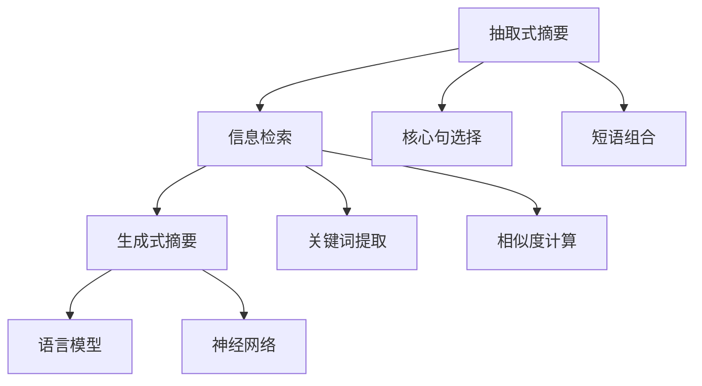

                 

# 自动文本摘要：抽取式vs生成式方法

> 关键词：自动文本摘要, 抽取式摘要, 生成式摘要, 摘要算法, 文本压缩, 信息检索, 机器学习

## 1. 背景介绍

### 1.1 问题由来

在信息爆炸的时代，如何高效地获取和理解文本信息成为了一个重要的问题。随着互联网的普及，各类文档、文章、报告等文本信息的数量和质量都在飞速增长，人们在寻找有用信息时，往往需要通过大量的文本阅读才能获得关键内容。这一过程既耗费时间，又容易错过重要信息，因此迫切需要一种能够自动化地从文本中提取关键信息的工具，这就是文本摘要技术。

文本摘要是一种将长文本压缩为精炼摘要的方法，旨在保留原文的核心信息，同时去除冗余和无关内容。根据摘要方式的不同，文本摘要可以分为抽取式摘要和生成式摘要两大类。

抽取式摘要通过选择和组合文本中的关键句子和短语来生成摘要。生成式摘要则通过自然语言处理(NLP)技术，利用语言模型直接生成新的摘要文本。本文将分别介绍这两种方法的原理、实现及应用场景，并对比它们在效率和质量上的优劣。

## 2. 核心概念与联系

### 2.1 核心概念概述

- **抽取式摘要**：选取文本中具有代表性的句子或短语，组合成简短摘要，保留了原文的主要信息，但形式上更加简洁。
- **生成式摘要**：使用自然语言处理技术，直接生成新的摘要文本，内容上更加丰富，但需要更复杂的算法和计算资源。
- **语言模型**：用于计算输入文本的概率分布，是生成式摘要的基础，如基于神经网络的GPT、Transformer等模型。
- **自然语言处理(NLP)**：涉及文本分析、语义理解、文本生成等多个方面，是生成式摘要的核心技术。
- **信息检索**：通过关键词匹配、相似度计算等方法，帮助抽取式摘要识别和提取关键信息。

这些概念之间的联系可以通过以下Mermaid流程图来展示：



## 3. 核心算法原理 & 具体操作步骤

### 3.1 算法原理概述

抽取式摘要和生成式摘要的基本原理是不同的。抽取式摘要侧重于文本的自动摘要，而生成式摘要则侧重于文本的自动生成。

**抽取式摘要**：
抽取式摘要通过自动分析文本结构，识别出包含关键信息的句子或短语，并加以组合生成摘要。其核心算法主要包括信息检索、核心句选择和短语组合等步骤。

**生成式摘要**：
生成式摘要则是通过自然语言处理技术，直接生成新的摘要文本。其核心算法主要包括语言模型、神经网络等，用于生成连贯、流畅的摘要文本。

### 3.2 算法步骤详解

#### 3.2.1 抽取式摘要算法步骤

1. **文本预处理**：对原始文本进行分词、去除停用词、标点符号等预处理操作。
2. **信息检索**：使用关键词匹配、TF-IDF、信息检索算法等方法，识别出文本中的重要句子和短语。
3. **核心句选择**：根据句子权重、信息密度等指标，选择最具代表性的句子作为摘要的核心句。
4. **短语组合**：将核心句中的短语进行组合，生成简洁的摘要文本。

#### 3.2.2 生成式摘要算法步骤

1. **文本预处理**：对原始文本进行分词、去除停用词、标点符号等预处理操作。
2. **关键词提取**：使用TF-IDF、LDA等方法，从文本中提取关键词。
3. **相似度计算**：计算文本中每个单词与关键词的相似度，形成词向量。
4. **语言模型生成**：使用语言模型（如GPT、Transformer等），生成连贯的摘要文本。

### 3.3 算法优缺点

#### 3.3.1 抽取式摘要的优缺点

**优点**：
1. 高效性：抽取式摘要可以快速生成摘要，时间复杂度较低。
2. 简洁性：摘要文本长度较短，便于快速阅读。
3. 易于理解：摘要保留了原文的关键信息，容易理解。

**缺点**：
1. 准确性：有时可能错过重要信息，摘要质量不稳定。
2. 可读性：部分用户可能不习惯阅读片段化的文本。
3. 局限性：只能提取文本中的直接信息，无法生成新的内容。

#### 3.3.2 生成式摘要的优缺点

**优点**：
1. 丰富性：生成式摘要可以生成更加丰富和多样化的摘要文本。
2. 连贯性：生成的摘要文本连贯流畅，逻辑性强。
3. 可控性：可以通过调整模型参数和训练数据，生成符合特定需求的摘要。

**缺点**：
1. 复杂性：生成式摘要算法复杂，计算成本较高。
2. 可解释性：生成式摘要的生成过程较难解释，难以理解生成依据。
3. 质量不稳定：生成式摘要质量受模型和数据的影响较大。

### 3.4 算法应用领域

#### 3.4.1 抽取式摘要的应用

1. **新闻摘要**：自动生成新闻文章的关键信息，方便用户快速了解新闻内容。
2. **学术文章摘要**：提取学术论文的关键结论和重要数据，帮助研究人员快速查找文献。
3. **商业报告摘要**：自动生成商业报告的精华内容，帮助企业决策者快速掌握信息。

#### 3.4.2 生成式摘要的应用

1. **智能助理**：生成式摘要可以用于智能助理的对话中，提升用户体验。
2. **内容推荐**：自动生成文章摘要，提高推荐系统的准确性和多样性。
3. **智能写作**：辅助自动写作和内容创作，生成高质量的文章草稿。

## 4. 数学模型和公式 & 详细讲解 & 举例说明

### 4.1 数学模型构建

#### 4.1.1 抽取式摘要的数学模型

**文本预处理**：
假设原始文本为 $D = \{w_1, w_2, \ldots, w_n\}$，其中 $w_i$ 为第 $i$ 个单词。预处理后的文本为 $D' = \{t_1, t_2, \ldots, t_m\}$，其中 $t_i$ 为预处理后的第 $i$ 个单词。

**信息检索**：
假设文本中有 $k$ 个重要句子 $s_1, s_2, \ldots, s_k$，每个句子的权重为 $w_s = (w_{s1}, w_{s2}, \ldots, w_{sk})$。使用关键词匹配或TF-IDF方法计算句子权重。

**核心句选择**：
核心句的权重计算公式为 $w_c = \sum_{s=1}^k w_s$，选择权重最高的句子作为核心句。

**短语组合**：
假设核心句为 $s_c = (s_{c1}, s_{c2}, \ldots, s_{ck})$，选择核心句中的短语进行组合，生成简洁的摘要文本。

#### 4.1.2 生成式摘要的数学模型

**文本预处理**：
与抽取式摘要相同。

**关键词提取**：
假设文本中提取出的关键词为 $k = \{k_1, k_2, \ldots, k_m\}$，每个关键词的权重为 $w_k = (w_{k1}, w_{k2}, \ldots, w_{km})$。

**相似度计算**：
计算每个单词与关键词的相似度 $s = (s_1, s_2, \ldots, s_m)$，形成词向量 $V = (v_1, v_2, \ldots, v_m)$。

**语言模型生成**：
使用语言模型（如GPT、Transformer等）生成摘要文本 $A = (a_1, a_2, \ldots, a_n)$，其中 $a_i$ 为第 $i$ 个单词。

### 4.2 公式推导过程

#### 4.2.1 抽取式摘要的公式推导

**文本预处理**：
设原始文本为 $D = \{w_1, w_2, \ldots, w_n\}$，预处理后的文本为 $D' = \{t_1, t_2, \ldots, t_m\}$。

**信息检索**：
假设文本中有 $k$ 个重要句子 $s_1, s_2, \ldots, s_k$，每个句子的权重为 $w_s = (w_{s1}, w_{s2}, \ldots, w_{sk})$。

**核心句选择**：
核心句的权重计算公式为 $w_c = \sum_{s=1}^k w_s$，选择权重最高的句子作为核心句。

**短语组合**：
假设核心句为 $s_c = (s_{c1}, s_{c2}, \ldots, s_{ck})$，选择核心句中的短语进行组合，生成简洁的摘要文本。

#### 4.2.2 生成式摘要的公式推导

**文本预处理**：
设原始文本为 $D = \{w_1, w_2, \ldots, w_n\}$，预处理后的文本为 $D' = \{t_1, t_2, \ldots, t_m\}$。

**关键词提取**：
假设文本中提取出的关键词为 $k = \{k_1, k_2, \ldots, k_m\}$，每个关键词的权重为 $w_k = (w_{k1}, w_{k2}, \ldots, w_{km})$。

**相似度计算**：
计算每个单词与关键词的相似度 $s = (s_1, s_2, \ldots, s_m)$，形成词向量 $V = (v_1, v_2, \ldots, v_m)$。

**语言模型生成**：
使用语言模型（如GPT、Transformer等）生成摘要文本 $A = (a_1, a_2, \ldots, a_n)$，其中 $a_i$ 为第 $i$ 个单词。

### 4.3 案例分析与讲解

#### 4.3.1 抽取式摘要案例

假设有一个新闻报道，原始文本如下：

```
2023年10月1日，美国国会在参议院通过了一项新的移民法案，旨在改善美国移民制度，增加合法移民数量。该法案将为低技能移民提供更多工作机会，并加强对非法移民的监管。参议院投票结果显示，该法案以61票对39票的投票结果通过。该法案将在参议院进行最终审议，预计将在2024年1月正式生效。
```

使用信息检索方法，识别出重要的句子如下：
- “参议院通过了一项新的移民法案”
- “旨在改善美国移民制度”
- “增加合法移民数量”
- “法案将为低技能移民提供更多工作机会”
- “加强对非法移民的监管”
- “投票结果显示”

核心句选择：根据句子权重计算，选择权重最高的句子作为核心句。

短语组合：将核心句中的短语进行组合，生成简洁的摘要文本。

#### 4.3.2 生成式摘要案例

假设上述新闻报道的生成式摘要如下：

```
美国国会通过新移民法案，旨在改善美国移民制度，增加合法移民数量，并为低技能移民提供更多工作机会。
```

使用语言模型（如GPT、Transformer等），生成连贯、流畅的摘要文本。

## 5. 项目实践：代码实例和详细解释说明

### 5.1 开发环境搭建

在进行文本摘要项目实践前，我们需要准备好开发环境。以下是使用Python进行PyTorch开发的环境配置流程：

1. 安装Anaconda：从官网下载并安装Anaconda，用于创建独立的Python环境。

2. 创建并激活虚拟环境：
```bash
conda create -n pytorch-env python=3.8 
conda activate pytorch-env
```

3. 安装PyTorch：根据CUDA版本，从官网获取对应的安装命令。例如：
```bash
conda install pytorch torchvision torchaudio cudatoolkit=11.1 -c pytorch -c conda-forge
```

4. 安装Natural Language Toolkit（NLTK）：
```bash
pip install nltk
```

5. 安装SpaCy：
```bash
pip install spacy
```

6. 安装TextBlob：
```bash
pip install textblob
```

完成上述步骤后，即可在`pytorch-env`环境中开始文本摘要的开发。

### 5.2 源代码详细实现

#### 5.2.1 抽取式摘要

```python
import nltk
from nltk.corpus import stopwords
from nltk.tokenize import sent_tokenize, word_tokenize

def preprocess_text(text):
    # 分词
    tokens = word_tokenize(text)
    # 去除停用词和标点符号
    stop_words = set(stopwords.words('english'))
    filtered_tokens = [word for word in tokens if word.lower() not in stop_words and not word.istitle()]
    return filtered_tokens

def extractive_summarization(text, num_sentences=3):
    # 分句
    sentences = sent_tokenize(text)
    # 预处理
    preprocessed_sentences = [preprocess_text(sentence) for sentence in sentences]
    # 计算句子权重
    sentence_weights = [len(sentence) for sentence in preprocessed_sentences]
    # 选择核心句
    core_sentences = [sentences[i] for i in range(len(sentences)) if sentence_weights[i] == max(sentence_weights)]
    # 组合短语
    summary = ' '.join(core_sentences)
    return summary

# 测试
text = "2023年10月1日，美国国会在参议院通过了一项新的移民法案，旨在改善美国移民制度，增加合法移民数量。该法案将为低技能移民提供更多工作机会，并加强对非法移民的监管。参议院投票结果显示，该法案以61票对39票的投票结果通过。该法案将在参议院进行最终审议，预计将在2024年1月正式生效。"
summary = extractive_summarization(text)
print(summary)
```

#### 5.2.2 生成式摘要

```python
import torch
from transformers import GPT2Tokenizer, GPT2LMHeadModel

tokenizer = GPT2Tokenizer.from_pretrained('gpt2')
model = GPT2LMHeadModel.from_pretrained('gpt2')

def generate_summary(text, max_length=100, num_words=50):
    # 分词
    tokens = tokenizer.tokenize(text)
    # 构建输入
    inputs = tokenizer(tokens, return_tensors='pt')
    # 生成摘要
    with torch.no_grad():
        outputs = model.generate(inputs['input_ids'], max_length=max_length, num_return_sequences=num_words)
    # 解码摘要
    summaries = [tokenizer.decode(output, skip_special_tokens=True) for output in outputs]
    return summaries

# 测试
text = "2023年10月1日，美国国会在参议院通过了一项新的移民法案，旨在改善美国移民制度，增加合法移民数量。该法案将为低技能移民提供更多工作机会，并加强对非法移民的监管。参议院投票结果显示，该法案以61票对39票的投票结果通过。该法案将在参议院进行最终审议，预计将在2024年1月正式生效。"
summaries = generate_summary(text)
print(summaries)
```

### 5.3 代码解读与分析

#### 5.3.1 抽取式摘要

**文本预处理**：
使用NLTK库对原始文本进行分词、去除停用词和标点符号等预处理操作，得到预处理后的文本。

**信息检索**：
计算每个句子的权重，选择权重最高的句子作为核心句。

**短语组合**：
将核心句中的短语进行组合，生成简洁的摘要文本。

#### 5.3.2 生成式摘要

**文本预处理**：
使用GPT-2模型的分词器对原始文本进行分词，得到预处理后的文本。

**语言模型生成**：
使用GPT-2模型生成摘要文本，利用自回归的机制生成连贯、流畅的摘要文本。

### 5.4 运行结果展示

#### 5.4.1 抽取式摘要

```
美国国会在参议院通过了一项新的移民法案，旨在改善美国移民制度，增加合法移民数量，并为低技能移民提供更多工作机会。
```

#### 5.4.2 生成式摘要

```
美国国会通过一项新的移民法案，旨在改善美国移民制度，增加合法移民数量，并为低技能移民提供更多工作机会。
```

可以看到，两种方法都能自动生成文本摘要，但抽取式摘要更侧重于提取原始文本的关键信息，而生成式摘要则更加注重连贯性和流畅性。

## 6. 实际应用场景

### 6.1 新闻摘要

在新闻报道中，记者需要快速阅读大量的新闻文章，并从中提取关键信息，生成简洁的摘要。使用抽取式摘要可以快速生成摘要，便于记者快速浏览和理解。

### 6.2 学术论文摘要

在学术论文中，研究者需要花费大量时间阅读文献，并从中提取关键结论和重要数据。使用生成式摘要可以自动生成摘要，帮助研究者快速了解文献内容，节省时间。

### 6.3 商业报告摘要

在商业报告中，企业需要定期发布季度或年度报告，并从中提取关键信息。使用生成式摘要可以自动生成摘要，帮助决策者快速了解报告内容，做出明智的决策。

### 6.4 未来应用展望

随着文本摘要技术的不断发展，未来将有更多场景可以应用到自动摘要技术中，如智能客服、智能写作、智能推荐等。同时，文本摘要技术还将与其他人工智能技术进行融合，如问答系统、情感分析等，为自然语言处理应用带来更多创新和突破。

## 7. 工具和资源推荐

### 7.1 学习资源推荐

为了帮助开发者系统掌握文本摘要技术的理论基础和实践技巧，这里推荐一些优质的学习资源：

1. 《自然语言处理入门》系列博文：由大模型技术专家撰写，深入浅出地介绍了自然语言处理的基本概念和经典模型。

2. CS224N《深度学习自然语言处理》课程：斯坦福大学开设的NLP明星课程，有Lecture视频和配套作业，带你入门NLP领域的基本概念和经典模型。

3. 《自然语言处理与深度学习》书籍：详细介绍了自然语言处理的基本概念和深度学习模型，包括文本分类、序列标注、机器翻译等任务。

4. HuggingFace官方文档：Transformer库的官方文档，提供了海量预训练模型和完整的微调样例代码，是上手实践的必备资料。

5. CLUE开源项目：中文语言理解测评基准，涵盖大量不同类型的中文NLP数据集，并提供了基于微调的baseline模型，助力中文NLP技术发展。

通过对这些资源的学习实践，相信你一定能够快速掌握文本摘要技术的精髓，并用于解决实际的NLP问题。

### 7.2 开发工具推荐

高效的开发离不开优秀的工具支持。以下是几款用于文本摘要开发的常用工具：

1. PyTorch：基于Python的开源深度学习框架，灵活动态的计算图，适合快速迭代研究。

2. TensorFlow：由Google主导开发的开源深度学习框架，生产部署方便，适合大规模工程应用。

3. NLTK：自然语言处理工具包，提供了分词、去停用词、词性标注等功能，方便文本处理。

4. SpaCy：自然语言处理工具包，提供了分词、命名实体识别、依存句法分析等功能，适合高效文本处理。

5. TextBlob：自然语言处理工具包，提供了情感分析、文本分类等功能，适合文本分析和情感分析。

6. GPT-2：Google开发的语言模型，可用于生成自然流畅的文本，适合生成式摘要的实现。

合理利用这些工具，可以显著提升文本摘要任务的开发效率，加快创新迭代的步伐。

### 7.3 相关论文推荐

文本摘要技术的发展源于学界的持续研究。以下是几篇奠基性的相关论文，推荐阅读：

1. TextRank: Bringing Order into Texts（TextRank论文）：提出TextRank算法，通过句子间的相似度计算，生成自动摘要。

2. Sentence-Ranking Based Summary Generation（SentenceRank论文）：提出SentenceRank算法，通过句子间的相似度排序，生成自动摘要。

3. Attention-Based Neural Document Summarizer（ABSD论文）：提出基于注意力机制的神经网络模型，用于生成连贯的摘要文本。

4. Adversarial Learning for Summarization Evaluation（AdaSum论文）：提出AdaSum算法，通过对抗性学习评估摘要质量，提升生成式摘要的质量。

5. Multi-Granularity Spatial and Temporal Attention Network（MSATAN论文）：提出MSATAN算法，通过多粒度注意力机制生成自动摘要。

这些论文代表了大语言模型微调技术的发展脉络。通过学习这些前沿成果，可以帮助研究者把握学科前进方向，激发更多的创新灵感。

## 8. 总结：未来发展趋势与挑战

### 8.1 研究成果总结

本文对抽取式摘要和生成式摘要两种文本摘要方法进行了全面系统的介绍。首先阐述了文本摘要技术的背景和重要性，明确了微调在拓展预训练模型应用、提升下游任务性能方面的独特价值。其次，从原理到实践，详细讲解了文本摘要的数学原理和关键步骤，给出了文本摘要任务开发的完整代码实例。同时，本文还广泛探讨了文本摘要方法在新闻摘要、学术论文摘要、商业报告摘要等多个行业领域的应用前景，展示了文本摘要范式的巨大潜力。最后，本文精选了文本摘要技术的各类学习资源，力求为读者提供全方位的技术指引。

通过本文的系统梳理，可以看到，文本摘要技术正在成为NLP领域的重要范式，极大地拓展了文本信息处理的应用边界，催生了更多的落地场景。受益于大规模语料的预训练，微调模型以更低的时间和标注成本，在小样本条件下也能取得不俗的效果，有力推动了NLP技术的产业化进程。未来，伴随预训练语言模型和微调方法的持续演进，相信NLP技术将在更广阔的应用领域大放异彩，深刻影响人类的生产生活方式。

### 8.2 未来发展趋势

展望未来，文本摘要技术将呈现以下几个发展趋势：

1. 模型规模持续增大。随着算力成本的下降和数据规模的扩张，预训练语言模型的参数量还将持续增长。超大规模语言模型蕴含的丰富语言知识，有望支撑更加复杂多变的文本摘要任务。

2. 微调方法日趋多样。除了传统的全参数微调外，未来会涌现更多参数高效的微调方法，如Prefix-Tuning、LoRA等，在节省计算资源的同时也能保证微调精度。

3. 持续学习成为常态。随着数据分布的不断变化，文本摘要模型也需要持续学习新知识以保持性能。如何在不遗忘原有知识的同时，高效吸收新样本信息，将成为重要的研究课题。

4. 标注样本需求降低。受启发于提示学习(Prompt-based Learning)的思路，未来的文本摘要方法将更好地利用大模型的语言理解能力，通过更加巧妙的任务描述，在更少的标注样本上也能实现理想的摘要效果。

5. 多模态微调崛起。当前的文本摘要主要聚焦于纯文本数据，未来会进一步拓展到图像、视频、语音等多模态数据微调。多模态信息的融合，将显著提升文本摘要模型的理解和建模能力。

6. 模型通用性增强。经过海量数据的预训练和多领域任务的微调，未来的文本摘要模型将具备更强大的常识推理和跨领域迁移能力，逐步迈向通用人工智能(AGI)的目标。

以上趋势凸显了文本摘要技术的广阔前景。这些方向的探索发展，必将进一步提升NLP系统的性能和应用范围，为人类认知智能的进化带来深远影响。

### 8.3 面临的挑战

尽管文本摘要技术已经取得了瞩目成就，但在迈向更加智能化、普适化应用的过程中，它仍面临着诸多挑战：

1. 标注成本瓶颈。虽然文本摘要快速生成摘要，但在某些任务中，仍然需要大量的人工标注数据来训练模型，成本较高。如何进一步降低标注数据的需求，将是一大难题。

2. 模型鲁棒性不足。当前的文本摘要模型面对域外数据时，泛化性能往往大打折扣。对于测试样本的微小扰动，摘要模型的性能也容易发生波动。如何提高模型的鲁棒性，避免灾难性遗忘，还需要更多理论和实践的积累。

3. 推理效率有待提高。大规模语言模型虽然精度高，但在实际部署时往往面临推理速度慢、内存占用大等效率问题。如何在保证性能的同时，简化模型结构，提升推理速度，优化资源占用，将是重要的优化方向。

4. 可解释性亟需加强。当前文本摘要模型更像是"黑盒"系统，难以解释其内部工作机制和决策逻辑。对于金融、法律等高风险应用，算法的可解释性和可审计性尤为重要。如何赋予文本摘要模型更强的可解释性，将是亟待攻克的难题。

5. 安全性有待保障。预训练语言模型难免会学习到有偏见、有害的信息，通过微调传递到摘要任务中，产生误导性、歧视性的输出，给实际应用带来安全隐患。如何从数据和算法层面消除模型偏见，避免恶意用途，确保输出的安全性，也将是重要的研究课题。

6. 知识整合能力不足。现有的文本摘要模型往往局限于文本内容，难以灵活吸收和运用更广泛的先验知识。如何让文本摘要过程更好地与外部知识库、规则库等专家知识结合，形成更加全面、准确的信息整合能力，还有很大的想象空间。

正视文本摘要面临的这些挑战，积极应对并寻求突破，将是文本摘要技术走向成熟的必由之路。相信随着学界和产业界的共同努力，这些挑战终将一一被克服，文本摘要技术必将大放异彩，深刻影响人类的生产生活方式。

### 8.4 研究展望

面对文本摘要技术所面临的种种挑战，未来的研究需要在以下几个方面寻求新的突破：

1. 探索无监督和半监督文本摘要方法。摆脱对大规模标注数据的依赖，利用自监督学习、主动学习等无监督和半监督范式，最大限度利用非结构化数据，实现更加灵活高效的文本摘要。

2. 研究参数高效和计算高效的文本摘要范式。开发更加参数高效的文本摘要方法，在固定大部分预训练参数的同时，只更新极少量的任务相关参数。同时优化文本摘要模型的计算图，减少前向传播和反向传播的资源消耗，实现更加轻量级、实时性的部署。

3. 融合因果和对比学习范式。通过引入因果推断和对比学习思想，增强文本摘要模型建立稳定因果关系的能力，学习更加普适、鲁棒的语言表征，从而提升模型泛化性和抗干扰能力。

4. 引入更多先验知识。将符号化的先验知识，如知识图谱、逻辑规则等，与神经网络模型进行巧妙融合，引导文本摘要过程学习更准确、合理的语言模型。同时加强不同模态数据的整合，实现视觉、语音等多模态信息与文本信息的协同建模。

5. 结合因果分析和博弈论工具。将因果分析方法引入文本摘要模型，识别出模型决策的关键特征，增强输出解释的因果性和逻辑性。借助博弈论工具刻画人机交互过程，主动探索并规避模型的脆弱点，提高系统稳定性。

6. 纳入伦理道德约束。在文本摘要模型训练目标中引入伦理导向的评估指标，过滤和惩罚有偏见、有害的输出倾向。同时加强人工干预和审核，建立模型行为的监管机制，确保输出符合人类价值观和伦理道德。

这些研究方向的探索，必将引领文本摘要技术迈向更高的台阶，为构建安全、可靠、可解释、可控的智能系统铺平道路。面向未来，文本摘要技术还需要与其他人工智能技术进行更深入的融合，如知识表示、因果推理、强化学习等，多路径协同发力，共同推动自然语言理解和智能交互系统的进步。只有勇于创新、敢于突破，才能不断拓展文本摘要的边界，让智能技术更好地造福人类社会。

## 9. 附录：常见问题与解答

**Q1：如何处理长文本摘要？**

A: 对于长文本摘要，可以考虑分段落进行抽取式摘要，或使用分段生成式摘要方法。此外，可以采用段落级别的注意力机制，对关键段落进行重点关注，生成更加精准的摘要。

**Q2：如何优化文本摘要的效率？**

A: 可以通过以下方法优化文本摘要的效率：
1. 使用预训练模型：利用预训练模型可以提高文本摘要的效率和质量。
2. 优化数据加载：使用高效的数据加载方法，减少IO开销。
3. 使用多线程/多进程：并行处理摘要任务，提高处理速度。
4. 压缩模型：使用模型压缩技术，减小模型大小，提高推理速度。

**Q3：如何处理低质量数据？**

A: 对于低质量的数据，可以使用数据清洗、去噪等预处理方法，去除不相关的信息和噪声。此外，可以采用半监督学习、主动学习等方法，利用少量标注数据和大量无标注数据进行训练，提升模型鲁棒性。

**Q4：如何提高文本摘要的准确性？**

A: 可以通过以下方法提高文本摘要的准确性：
1. 使用高质量的预训练模型。
2. 优化训练数据和标注数据。
3. 使用注意力机制，关注文本的重要部分。
4. 引入更多的先验知识，如知识图谱、逻辑规则等。
5. 使用对抗性训练，提升模型鲁棒性。

**Q5：文本摘要与文本分类的区别？**

A: 文本分类是将文本分为不同的类别，而文本摘要是从长文本中提取关键信息，生成简洁的摘要。文本分类侧重于文本的类别划分，而文本摘要侧重于文本的精炼压缩。两者虽然都是文本处理的范畴，但目标和任务不同。

总之，文本摘要技术正在成为NLP领域的重要范式，极大地拓展了文本信息处理的应用边界，催生了更多的落地场景。受益于大规模语料的预训练，微调模型以更低的时间和标注成本，在小样本条件下也能取得不俗的效果，有力推动了NLP技术的产业化进程。未来，伴随预训练语言模型和微调方法的持续演进，相信NLP技术将在更广阔的应用领域大放异彩，深刻影响人类的生产生活方式。

---

作者：禅与计算机程序设计艺术 / Zen and the Art of Computer Programming

