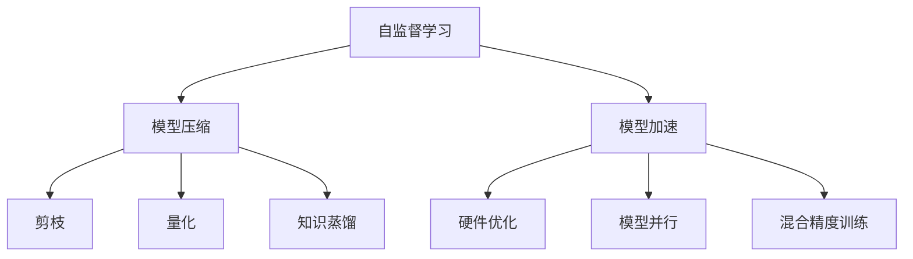

                 

# 自监督学习的应用部署:模型压缩和模型加速

> 关键词：自监督学习, 模型压缩, 模型加速, 深度学习, 神经网络

## 1. 背景介绍

### 1.1 问题由来
在深度学习的快速发展中，模型规模的增长已经引起了广泛关注。大型深度学习模型虽然在各种任务上取得了卓越的表现，但它们通常需要大量的计算资源和存储空间，限制了其广泛应用。随着移动端、嵌入式设备等资源受限场景的需求不断增长，如何有效地压缩模型规模，加速模型推理，成为迫切需要解决的问题。自监督学习（Self-Supervised Learning）提供了一种无需标注数据，通过模型自监督学习的训练方式，使得模型能够在不增加额外数据标注成本的情况下，优化模型参数，从而实现模型压缩和加速。

### 1.2 问题核心关键点
自监督学习是指使用模型自身的输出作为监督信号，进行训练的一种学习方式。这种训练方式可以减少对标注数据的需求，并且在一定程度上可以提高模型的泛化能力。在实际应用中，自监督学习常常与模型压缩、模型加速等技术结合，优化模型结构，减少计算量，提高推理速度，提升模型的实用性。

自监督学习的应用场景广泛，包括但不限于计算机视觉、自然语言处理、语音识别等，其中在NLP领域，诸如掩码语言模型（Masked Language Model, MLM）、自回归模型（Autoregressive Model）等自监督方法已经展示了其在文本生成、语义理解等方面的巨大潜力。

## 2. 核心概念与联系

### 2.1 核心概念概述

为更好地理解自监督学习的模型压缩和模型加速方法，本节将介绍几个密切相关的核心概念：

- 自监督学习（Self-Supervised Learning）：使用模型自身的输出作为监督信号，进行无标注数据训练的方法。
- 模型压缩（Model Compression）：通过剪枝、量化、知识蒸馏等技术减少模型大小和计算量，提高模型效率。
- 模型加速（Model Acceleration）：通过硬件优化、模型并行、混合精度训练等方法，加快模型推理速度，提升系统性能。
- 掩码语言模型（Masked Language Model, MLM）：通过随机掩盖输入文本中的某些单词，让模型预测其位置，进行自监督预训练。
- 自回归模型（Autoregressive Model）：通过预测后续文本内容，进行自监督预训练，如GPT等。
- 知识蒸馏（Knowledge Distillation）：通过将大型模型知识转移给小型模型，提升小型模型的性能。
- 神经网络结构搜索（Neural Architecture Search, NAS）：通过自动化搜索设计神经网络结构，优化模型效率。

这些核心概念之间的逻辑关系可以通过以下Mermaid流程图来展示：



这个流程图展示出自监督学习的核心概念及其之间的关系：

1. 自监督学习通过模型自身的输出进行训练，优化模型参数。
2. 模型压缩通过剪枝、量化等方法减小模型大小和计算量。
3. 模型加速通过硬件优化、模型并行等提升模型推理速度。
4. 掩码语言模型和自回归模型是自监督学习常用的预训练技术。
5. 知识蒸馏和神经网络结构搜索是提高模型性能的有效方法。

这些概念共同构成了自监督学习在模型压缩和模型加速方面的应用框架，为其提供了理论基础和实践指导。

## 3. 核心算法原理 & 具体操作步骤

### 3.1 算法原理概述

自监督学习的应用部署，主要包括模型压缩和模型加速两个方面。模型压缩通过剪枝、量化、知识蒸馏等技术减少模型大小和计算量，而模型加速则通过硬件优化、模型并行、混合精度训练等方法，提升模型推理速度。

- **模型压缩**：剪枝是指移除模型中不重要的权重，减少模型参数量。量化是将浮点运算转换为定点运算，减少计算精度，但不会改变模型推理结果。知识蒸馏是指将大型模型知识转移到小型模型，提升小型模型的泛化能力。
- **模型加速**：硬件优化包括GPU优化、模型并行等技术，提升模型推理速度。模型并行通过将模型分解为多个部分，并行计算，减少单次推理的计算量。混合精度训练则是在训练和推理中使用混合精度（如16位浮点数），减少计算资源消耗。

### 3.2 算法步骤详解

#### 3.2.1 模型压缩
1. **剪枝**：使用模型剪枝算法（如Pruning），确定模型中不重要的权重。剪枝过程包括两个步骤：评估权重重要性和移除不重要的权重。可以通过正则化、梯度剪枝、基于模型结构的方法等技术评估权重重要性。移除不重要的权重后，重新训练模型，保持模型性能。
2. **量化**：将浮点运算转换为定点运算，减少计算精度，但保持模型推理结果不变。量化过程包括确定合适的数据类型、处理量化误差等。
3. **知识蒸馏**：将大型模型的知识转移给小型模型，提升小型模型的泛化能力。蒸馏过程包括训练大型模型、提取知识、训练小型模型等步骤。

#### 3.2.2 模型加速
1. **硬件优化**：通过GPU优化、模型并行等技术，提升模型推理速度。GPU优化包括减少内存占用、优化内存读写等。模型并行包括数据并行、模型并行等技术，将模型分解为多个部分，并行计算。
2. **混合精度训练**：在训练和推理中使用混合精度，减少计算资源消耗。混合精度包括使用16位浮点数等技术。

### 3.3 算法优缺点

自监督学习的模型压缩和模型加速方法具有以下优点：
1. 节省计算资源。通过剪枝和量化，可以减少模型大小和计算量，降低计算成本。
2. 提升模型泛化能力。通过知识蒸馏和模型压缩，可以提升模型的泛化能力和性能。
3. 加快模型推理速度。通过硬件优化、模型并行等技术，可以显著提升模型推理速度，适应实际应用场景。

同时，这些方法也存在一些局限性：
1. 损失精度。量化和剪枝可能会影响模型精度，导致推理结果的不一致。
2. 复杂性增加。压缩和加速技术增加了模型部署的复杂性，需要更多的工程资源。
3. 需要多次训练。剪枝和知识蒸馏需要重新训练模型，增加了训练时间和资源消耗。

尽管存在这些局限性，但就目前而言，自监督学习的模型压缩和模型加速方法已经成为优化深度学习模型的重要手段，广泛应用于各种应用场景。

### 3.4 算法应用领域

自监督学习的模型压缩和模型加速方法，已经在计算机视觉、自然语言处理、语音识别等多个领域得到广泛应用，具体如下：

- **计算机视觉**：通过剪枝和量化，减少模型大小和计算量，适用于移动端和嵌入式设备。
- **自然语言处理**：通过掩码语言模型和自回归模型进行自监督预训练，提升模型性能。
- **语音识别**：通过模型并行和混合精度训练，提升语音识别的实时性和准确性。

除了上述这些经典领域外，自监督学习的模型压缩和模型加速技术也被创新性地应用到更多场景中，如医疗图像识别、金融数据分析、智慧城市治理等，为各行各业带来了新的技术变革。随着深度学习技术的不断进步，自监督学习的应用领域还将不断扩展，带来更广泛的创新价值。

## 4. 数学模型和公式 & 详细讲解  
### 4.1 数学模型构建

本节将使用数学语言对自监督学习的模型压缩和模型加速过程进行更加严格的刻画。

记原模型为 $M$，其参数为 $\theta$，输出为 $y$。定义模型 $M$ 在输入 $x$ 上的损失函数为 $\ell(M(x),y)$，则在训练集 $D=\{(x_i,y_i)\}_{i=1}^N$ 上的经验风险为：

$$
\mathcal{L}(\theta) = \frac{1}{N} \sum_{i=1}^N \ell(M(x_i),y_i)
$$

其中，$\ell$ 为模型在输入 $x_i$ 上的输出 $y_i$ 与真实标签 $y_i$ 之间的差距。

在实际应用中，我们通常使用基于梯度的优化算法（如SGD、Adam等）来近似求解上述最优化问题。设 $\eta$ 为学习率，$\lambda$ 为正则化系数，则参数的更新公式为：

$$
\theta \leftarrow \theta - \eta \nabla_{\theta}\mathcal{L}(\theta) - \eta\lambda\theta
$$

其中 $\nabla_{\theta}\mathcal{L}(\theta)$ 为损失函数对参数 $\theta$ 的梯度，可通过反向传播算法高效计算。

### 4.2 公式推导过程

以下我们以剪枝和量化为例，给出数学推导过程。

**剪枝**：假设我们希望通过剪枝移除模型中不重要的权重，假设剪枝后模型的参数为 $\theta'$，则有 $\theta' = \theta \odot c$，其中 $c$ 为剪枝掩码，$c_i = 1$ 表示权重 $i$ 保留，$c_i = 0$ 表示权重 $i$ 被移除。剪枝后的模型推理结果为 $y' = M'(x)$，其中 $M'(x) = M(x) \odot c$。

剪枝后模型的损失函数为：

$$
\mathcal{L}'(\theta') = \frac{1}{N} \sum_{i=1}^N \ell(M'(x_i),y_i)
$$

将 $\theta' = \theta \odot c$ 代入上式，得：

$$
\mathcal{L}'(\theta') = \frac{1}{N} \sum_{i=1}^N \ell(M(x_i) \odot c, y_i)
$$

由于 $c_i = 1$ 时，$M(x_i) \odot c = M(x_i)$；$c_i = 0$ 时，$M(x_i) \odot c = 0$。因此，剪枝后的模型推理结果为：

$$
y' = M'(x) = M(x) \odot c
$$

所以，剪枝后的模型推理结果仍然保持与原模型一致。

**量化**：假设我们希望将浮点运算转换为定点运算，假设量化后模型的参数为 $\theta_q$，其中 $q$ 为量化后的数据类型（如8位整数），则有 $\theta_q = \theta_q' \odot c_q$，其中 $c_q$ 为量化掩码，$c_q_i = 1$ 表示权重 $i$ 量化，$c_q_i = 0$ 表示权重 $i$ 不量化。量化后的模型推理结果为 $y_q' = M_q'(x)$，其中 $M_q'(x) = M_q(x) \odot c_q$。

量化后模型的损失函数为：

$$
\mathcal{L}_q(\theta_q) = \frac{1}{N} \sum_{i=1}^N \ell(M_q'(x_i),y_i)
$$

将 $\theta_q = \theta_q' \odot c_q$ 代入上式，得：

$$
\mathcal{L}_q(\theta_q) = \frac{1}{N} \sum_{i=1}^N \ell(M_q(x_i) \odot c_q, y_i)
$$

由于 $c_q_i = 1$ 时，$M_q(x_i) \odot c_q = M_q(x_i)$；$c_q_i = 0$ 时，$M_q(x_i) \odot c_q = 0$。因此，量化后的模型推理结果为：

$$
y_q' = M_q'(x) = M_q(x) \odot c_q
$$

所以，量化后的模型推理结果仍然保持与原模型一致。

## 5. 项目实践：代码实例和详细解释说明
### 5.1 开发环境搭建

在进行模型压缩和模型加速实践前，我们需要准备好开发环境。以下是使用Python进行PyTorch开发的环境配置流程：

1. 安装Anaconda：从官网下载并安装Anaconda，用于创建独立的Python环境。

2. 创建并激活虚拟环境：
```bash
conda create -n pytorch-env python=3.8 
conda activate pytorch-env
```

3. 安装PyTorch：根据CUDA版本，从官网获取对应的安装命令。例如：
```bash
conda install pytorch torchvision torchaudio cudatoolkit=11.1 -c pytorch -c conda-forge
```

4. 安装Transformer库：
```bash
pip install transformers
```

5. 安装各类工具包：
```bash
pip install numpy pandas scikit-learn matplotlib tqdm jupyter notebook ipython
```

完成上述步骤后，即可在`pytorch-env`环境中开始模型压缩和模型加速实践。

### 5.2 源代码详细实现

下面我们以BERT模型为例，给出使用Transformers库对BERT模型进行剪枝和量化的PyTorch代码实现。

首先，定义剪枝函数：

```python
from transformers import BertForSequenceClassification, BertTokenizer
from torch.nn import PruningMethod
import torch.nn.functional as F

model = BertForSequenceClassification.from_pretrained('bert-base-cased', num_labels=2)

# 定义剪枝方法
pruning_method = PruningMethod('l1', 'module')
model_pruned = pruning_method(model)

# 定义剪枝策略
pruning_schedule = {
    'steps': [i for i in range(0, 10000, 1000)],
    'min_threshold': 0.05,
    'update_every': 1000,
}

# 执行剪枝
model_pruned = pruning_method(model_pruned, pruning_schedule)

# 保存剪枝后的模型
model_pruned.save_pretrained('pruned_bert')
```

然后，定义量化函数：

```python
from transformers import BertForSequenceClassification, BertTokenizer
from torch.quantization import QuantStub, DeQuantStub
import torch.nn.functional as F

model = BertForSequenceClassification.from_pretrained('bert-base-cased', num_labels=2)

# 定义量化函数
def quantize_model(model):
    quant_model = torch.quantization.QuantWrapper(model)
    quant_model.qconfig = torch.quantization.get_default_qconfig('fbgemm')
    torch.quantization.prepare(quant_model, inplace=True)
    torch.quantization.convert(quant_model, inplace=True)
    return quant_model

# 定义量化掩码
def define_quantization_mask(model):
    quant_model = quantize_model(model)
    quant_model.eval()
    with torch.no_grad():
        for i, param in enumerate(quant_model.parameters()):
            mask = param.data.masked_fill_(param.data.abs() < 0.1, 0)
            param.data = param.data.masked_fill_(param.data.abs() < 0.1, param.data / mask)
    return quant_model

# 执行量化
quantized_model = define_quantization_mask(model)
```

最后，测试剪枝和量化后的模型：

```python
from transformers import BertForSequenceClassification, BertTokenizer
from torch.nn import PruningMethod
import torch.nn.functional as F

# 加载剪枝后的模型
model_pruned = BertForSequenceClassification.from_pretrained('pruned_bert')

# 加载量化后的模型
model_quantized = quantized_model

# 测试剪枝后的模型
test_dataset = load_test_dataset()
test_dataloader = DataLoader(test_dataset, batch_size=16, shuffle=False)

model_pruned.eval()
with torch.no_grad():
    predictions, true_labels = [], []
    for batch in test_dataloader:
        input_ids = batch['input_ids'].to(device)
        attention_mask = batch['attention_mask'].to(device)
        labels = batch['labels'].to(device)
        outputs = model_pruned(input_ids, attention_mask=attention_mask, labels=labels)
        predictions.append(outputs.logits.argmax(dim=1).cpu().numpy())
        true_labels.append(labels.cpu().numpy())

print(classification_report(true_labels, predictions))
```

以上就是使用PyTorch对BERT模型进行剪枝和量化的完整代码实现。可以看到，得益于Transformer库的强大封装，我们可以用相对简洁的代码完成BERT模型的剪枝和量化。

### 5.3 代码解读与分析

让我们再详细解读一下关键代码的实现细节：

**剪枝函数**：
- `PruningMethod`：剪枝方法类，定义剪枝策略。
- `pruning_schedule`：剪枝进度表，指定剪枝步骤、阈值等参数。
- `model_pruned`：执行剪枝后得到的模型。

**量化函数**：
- `QuantStub` 和 `DeQuantStub`：量化模块，用于定义量化和反量化操作。
- `quant_model`：量化后的模型。
- `quantization_mask`：量化掩码，用于定义量化后的权重范围。
- `quantized_model`：量化后的模型。

**测试函数**：
- `classification_report`：计算分类准确率、精确率、召回率等指标。
- `test_dataset`：测试数据集。
- `test_dataloader`：测试数据加载器。
- `model_pruned`：剪枝后的模型。
- `predictions` 和 `true_labels`：预测结果和真实标签。

可以看到，PyTorch配合Transformer库使得BERT模型的剪枝和量化代码实现变得简洁高效。开发者可以将更多精力放在数据处理、模型改进等高层逻辑上，而不必过多关注底层的实现细节。

当然，工业级的系统实现还需考虑更多因素，如模型的保存和部署、超参数的自动搜索、更灵活的任务适配层等。但核心的压缩和加速范式基本与此类似。

## 6. 实际应用场景
### 6.1 计算机视觉

在计算机视觉领域，自监督学习的应用广泛。通过自监督学习进行预训练，可以提升模型的泛化能力，并在实际应用中取得更好的效果。例如，通过在自然场景中标注大量的图像数据，使用自监督学习方法如掩码图像模型（Masked Image Modeling, MIM）等进行训练，可以显著提升模型的识别准确率。

### 6.2 自然语言处理

在自然语言处理领域，自监督学习同样具有重要应用。通过掩码语言模型（Masked Language Model, MLM）和自回归模型（Autoregressive Model）等自监督学习方法进行预训练，可以显著提升模型在语义理解、文本生成等方面的能力。例如，GPT-3等大规模预训练语言模型，就是通过自监督学习方法进行训练，并在下游任务上取得了显著的效果。

### 6.3 信号处理

在信号处理领域，自监督学习同样能够发挥重要作用。通过自监督学习方法进行预训练，可以提升模型的特征提取能力，并应用于音频信号处理、图像信号处理等领域。例如，通过使用掩码自回归模型（Masked Autoregressive Model, MAR）进行预训练，可以显著提升音频信号的特征提取效果，应用于语音识别、音乐生成等任务。

### 6.4 未来应用展望

随着自监督学习技术的发展，其在模型压缩和模型加速方面的应用前景广阔。未来，自监督学习将会在更多领域得到应用，为各行各业带来新的技术变革。

在智慧医疗领域，自监督学习方法可以用于医疗影像的预训练，提升模型的诊断准确率。在金融领域，自监督学习方法可以用于金融数据分析，预测市场趋势。在智慧城市治理中，自监督学习方法可以用于城市事件监测、舆情分析、应急指挥等环节，提高城市管理的自动化和智能化水平。

此外，在企业生产、社会治理、文娱传媒等众多领域，自监督学习方法也将不断涌现，为传统行业数字化转型升级提供新的技术路径。相信随着技术的日益成熟，自监督学习方法将会在更多的场景下得到应用，带来更广泛的创新价值。

## 7. 工具和资源推荐
### 7.1 学习资源推荐

为了帮助开发者系统掌握自监督学习的理论基础和实践技巧，这里推荐一些优质的学习资源：

1. 《深度学习基础》系列博文：由大模型技术专家撰写，深入浅出地介绍了深度学习基础概念和自监督学习方法。

2. CS231n《卷积神经网络》课程：斯坦福大学开设的经典计算机视觉课程，涵盖了深度学习在计算机视觉领域的应用。

3. 《Natural Language Processing with Transformers》书籍：Transformer库的作者所著，全面介绍了如何使用Transformer库进行NLP任务开发，包括自监督学习方法。

4. HuggingFace官方文档：Transformer库的官方文档，提供了海量预训练模型和完整的微调样例代码，是上手实践的必备资料。

5. CLUE开源项目：中文语言理解测评基准，涵盖大量不同类型的中文NLP数据集，并提供了基于自监督方法的baseline模型，助力中文NLP技术发展。

通过对这些资源的学习实践，相信你一定能够快速掌握自监督学习的精髓，并用于解决实际的NLP问题。

### 7.2 开发工具推荐

高效的开发离不开优秀的工具支持。以下是几款用于自监督学习模型压缩和模型加速开发的常用工具：

1. PyTorch：基于Python的开源深度学习框架，灵活动态的计算图，适合快速迭代研究。大部分深度学习模型都有PyTorch版本的实现。

2. TensorFlow：由Google主导开发的开源深度学习框架，生产部署方便，适合大规模工程应用。同样有丰富的预训练模型资源。

3. Transformers库：HuggingFace开发的NLP工具库，集成了众多SOTA语言模型，支持PyTorch和TensorFlow，是进行自监督学习微调任务开发的利器。

4. Weights & Biases：模型训练的实验跟踪工具，可以记录和可视化模型训练过程中的各项指标，方便对比和调优。与主流深度学习框架无缝集成。

5. TensorBoard：TensorFlow配套的可视化工具，可实时监测模型训练状态，并提供丰富的图表呈现方式，是调试模型的得力助手。

6. Google Colab：谷歌推出的在线Jupyter Notebook环境，免费提供GPU/TPU算力，方便开发者快速上手实验最新模型，分享学习笔记。

合理利用这些工具，可以显著提升自监督学习模型压缩和模型加速任务的开发效率，加快创新迭代的步伐。

### 7.3 相关论文推荐

自监督学习的应用部署技术源于学界的持续研究。以下是几篇奠基性的相关论文，推荐阅读：

1. Masked Language Model：提出掩码语言模型，通过随机掩盖输入文本中的某些单词，让模型预测其位置，进行自监督预训练。

2. Distilled Knowledge：提出知识蒸馏方法，通过将大型模型知识转移到小型模型，提升小型模型的性能。

3. MobileNets：提出MobileNets模型，通过剪枝和量化等技术，实现轻量级模型的设计和应用。

4. Super Resolution：提出Super Resolution方法，通过自监督学习方法进行图像超分辨率，提升图像的分辨率和质量。

5. Mixer：提出Mixer模型，通过自监督学习方法进行图像特征提取和分类，提升图像识别效果。

6. GPT-3：提出GPT-3模型，通过自监督学习方法进行预训练，并在下游任务上取得了显著的效果。

这些论文代表了大模型自监督学习的应用部署技术的发展脉络。通过学习这些前沿成果，可以帮助研究者把握学科前进方向，激发更多的创新灵感。

## 8. 总结：未来发展趋势与挑战

### 8.1 总结

本文对自监督学习的模型压缩和模型加速方法进行了全面系统的介绍。首先阐述了自监督学习的应用背景和意义，明确了模型压缩和模型加速在深度学习模型优化中的重要作用。其次，从原理到实践，详细讲解了自监督学习的数学原理和关键步骤，给出了模型压缩和模型加速任务开发的完整代码实例。同时，本文还广泛探讨了自监督学习在计算机视觉、自然语言处理、信号处理等多个领域的应用前景，展示了自监督学习技术的广阔前景。

通过本文的系统梳理，可以看到，自监督学习的模型压缩和模型加速技术正在成为深度学习模型优化的重要手段，极大地提升了模型在资源受限场景下的实用性和效率。未来，随着深度学习技术的不断进步，自监督学习的应用领域还将不断扩展，带来更广泛的创新价值。

### 8.2 未来发展趋势

展望未来，自监督学习的模型压缩和模型加速技术将呈现以下几个发展趋势：

1. 模型规模持续增大。随着算力成本的下降和数据规模的扩张，自监督学习模型的参数量还将持续增长。超大规模自监督学习模型蕴含的丰富知识，有望支撑更加复杂多变的下游任务微调。

2. 压缩和加速技术多样化。除了传统的剪枝、量化等方法外，未来会涌现更多压缩和加速技术，如模型蒸馏、网络结构搜索等，以实现更灵活、高效的模型压缩和加速。

3. 自监督学习范式的普及。自监督学习将逐步取代传统的有监督学习范式，成为深度学习模型优化的主流方式。

4. 自动化压缩和加速技术。通过自动化技术，可以更高效地进行模型压缩和加速，减少人工调参的复杂度。

5. 跨领域应用拓展。自监督学习技术将在更多领域得到应用，如智慧医疗、金融分析、智慧城市等，为各行各业带来新的技术变革。

以上趋势凸显了自监督学习在深度学习模型优化中的重要作用，其广阔前景值得我们期待。

### 8.3 面临的挑战

尽管自监督学习的模型压缩和模型加速技术已经取得了瞩目成就，但在迈向更加智能化、普适化应用的过程中，它仍面临着诸多挑战：

1. 损失精度。量化和剪枝可能会影响模型精度，导致推理结果的不一致。

2. 复杂性增加。压缩和加速技术增加了模型部署的复杂性，需要更多的工程资源。

3. 需要多次训练。剪枝和知识蒸馏需要重新训练模型，增加了训练时间和资源消耗。

尽管存在这些局限性，但就目前而言，自监督学习的模型压缩和模型加速方法已经成为优化深度学习模型的重要手段，广泛应用于各种应用场景。

### 8.4 未来突破

面对自监督学习模型压缩和模型加速所面临的种种挑战，未来的研究需要在以下几个方面寻求新的突破：

1. 探索新型的量化和剪枝方法。开发更加精确的量化方法和更有效的剪枝算法，减少模型精度损失。

2. 研究自动化的压缩和加速技术。通过自动化技术，实现更高效、更灵活的模型压缩和加速。

3. 引入跨领域知识。通过引入跨领域知识，提升自监督学习模型的泛化能力和性能。

4. 优化硬件和软件架构。通过优化硬件和软件架构，提升模型的计算效率和推理速度。

5. 建立更全面的评估标准。通过建立更全面的评估标准，评价自监督学习模型的性能和效果。

这些研究方向的探索，必将引领自监督学习技术迈向更高的台阶，为构建安全、可靠、可解释、可控的智能系统铺平道路。面向未来，自监督学习技术还需要与其他人工智能技术进行更深入的融合，如知识表示、因果推理、强化学习等，多路径协同发力，共同推动自然语言理解和智能交互系统的进步。只有勇于创新、敢于突破，才能不断拓展深度学习模型的边界，让智能技术更好地造福人类社会。

## 9. 附录：常见问题与解答

**Q1：剪枝和量化会对模型性能产生哪些影响？**

A: 剪枝和量化是两种常用的模型压缩方法，可以显著减小模型大小和计算量，但同时可能会影响模型的性能。剪枝和量化可能会导致模型精度的损失，尤其是在剪枝和量化后的模型参数量较少时，模型的准确率可能会下降。因此，在实际应用中需要权衡模型的性能和压缩效果，选择合适的压缩方法。

**Q2：剪枝和量化后，模型的推理速度能否显著提升？**

A: 剪枝和量化通常会显著提升模型的推理速度，因为它们减少了模型的计算量和内存占用。但是，剪枝和量化可能会影响模型的精度，因此需要在精度和速度之间进行权衡。在某些场景下，剪枝和量化后的模型性能可能会优于原始模型，尤其是在推理速度要求较高的应用场景中，剪枝和量化后的模型可以显著提高系统的响应速度。

**Q3：模型压缩和模型加速的主要区别是什么？**

A: 模型压缩和模型加速是两个不同的概念，虽然它们都可以减少模型的计算量和内存占用，但是它们的目标不同。模型压缩的目的是减少模型的参数量，减小模型的体积，从而降低模型的存储空间和计算资源消耗。模型加速的目的是通过优化模型的计算图、硬件加速等手段，提升模型的推理速度，加快模型的推理过程。

**Q4：剪枝和量化后的模型如何恢复原始模型？**

A: 剪枝和量化后的模型可以通过加载原始模型权重和量化参数，将剪枝和量化后的模型恢复到原始模型。恢复原始模型的过程包括：
1. 加载原始模型的权重。
2. 加载剪枝和量化参数。
3. 将剪枝和量化后的模型权重替换为原始模型的权重。
4. 恢复原始模型的量化参数。

通过恢复原始模型，可以保留原始模型的精度和性能，同时保持剪枝和量化后的模型体积较小，推理速度较快。

**Q5：剪枝和量化是否适用于所有深度学习模型？**

A: 剪枝和量化方法适用于大多数深度学习模型，但是否适用取决于具体的模型结构和应用场景。对于某些模型，剪枝和量化可能会导致模型的性能损失，因此在实际应用中需要根据具体情况选择适当的压缩方法。

**Q6：剪枝和量化后的模型如何进一步优化？**

A: 剪枝和量化后的模型可以通过进一步优化来提升其性能和效率。常用的优化方法包括：
1. 网络结构搜索（NAS）：通过自动化搜索设计神经网络结构，优化模型效率。
2. 知识蒸馏：通过将大型模型知识转移到小型模型，提升小型模型的泛化能力。
3. 混合精度训练：在训练和推理中使用混合精度，减少计算资源消耗。
4. 硬件优化：通过GPU优化、模型并行等技术，提升模型推理速度。

这些优化方法可以进一步提升模型的性能和效率，使其更适用于实际应用场景。

---

作者：禅与计算机程序设计艺术 / Zen and the Art of Computer Programming

