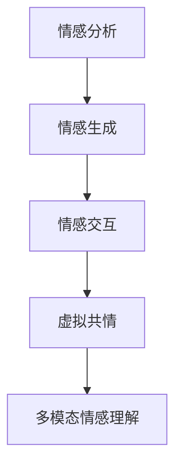

                 

# 虚拟共情：AI增强的情感理解

> 关键词：情感分析,情感生成,情感交互,虚拟共情,多模态情感理解

## 1. 背景介绍

### 1.1 问题由来
随着人工智能技术的不断发展，人们对于AI在情感理解上的需求日益增长。虚拟共情（Virtual Empathy）作为一种基于AI的情感交互技术，旨在通过理解人类情感并给予情感回应，来增强人与人之间的连接和理解。这项技术在客服、教育、心理咨询、娱乐等多个领域都有广泛的应用前景。

### 1.2 问题核心关键点
虚拟共情的核心在于如何构建一个能够理解和表达人类情感的智能模型。该模型需要具备以下几个核心能力：
- 情感识别：能够准确识别文本、语音、图像等多模态数据中的情感信息。
- 情感生成：能够基于上下文信息生成自然流畅的情感回应。
- 多模态融合：能够综合处理多种信息源，提供全方位的情感理解。
- 动态适应：能够根据交互对象和情境动态调整情感表达策略。

### 1.3 问题研究意义
虚拟共情技术的研究和应用具有重要意义：
1. **增强人机交互体验**：通过AI理解和回应人类情感，使机器更加人性化和个性化，提升用户满意度和粘性。
2. **促进社会情感连接**：在孤独、抑郁等心理问题日益严重的社会背景下，虚拟共情可以帮助人们获得情感支持和心理慰藉。
3. **推动智能客服发展**：通过情感理解和交互，客服系统能够提供更加贴心和有效的服务，提升客户体验。
4. **辅助教育与心理咨询**：AI可以辅助教师和心理咨询师，提供情感理解和支持，促进教育公平和心理健康。
5. **拓展娱乐内容**：通过情感生成技术，AI可以创造出更加丰富、生动的娱乐内容，推动娱乐产业创新。

## 2. 核心概念与联系

### 2.1 核心概念概述

为了深入理解虚拟共情技术，我们首先介绍几个关键概念：

- **情感分析（Sentiment Analysis）**：指通过自然语言处理技术对文本数据进行情感极性（正面、负面、中性）分类，或更细致的情感强度、情感倾向识别。
- **情感生成（Sentiment Generation）**：指通过语言生成技术，基于上下文信息生成具有特定情感倾向的文本或语音。
- **情感交互（Sentiment Interaction）**：指通过AI模型与人类进行情感交流，理解对方的情感状态并给予相应的回应。
- **多模态情感理解（Multimodal Sentiment Understanding）**：指综合利用文本、语音、图像等多种模态信息，进行更全面、准确的情感识别和生成。
- **虚拟共情（Virtual Empathy）**：指通过AI技术模拟人类共情能力，理解并回应人类情感，增强人机交互体验。

这些概念之间存在紧密联系，形成一个完整的情感理解和交互体系。情感分析是情感生成的基础，情感生成是情感交互的实现手段，而虚拟共情则是情感交互和生成的综合体现。多模态情感理解则进一步丰富了情感识别的手段和数据来源，使得虚拟共情系统能够处理更复杂、更多样的情感信息。

### 2.2 核心概念原理和架构的 Mermaid 流程图



此图展示了情感分析、情感生成、情感交互和虚拟共情之间的联系。情感分析识别文本中的情感信息，情感生成基于情感分析结果生成自然流畅的情感回应，情感交互通过文本、语音等多种方式与用户进行情感交流，而虚拟共情则是情感交互和生成的综合体现。多模态情感理解则丰富了情感识别的手段和数据来源，使得虚拟共情系统能够处理更复杂、更多样的情感信息。

## 3. 核心算法原理 & 具体操作步骤

### 3.1 算法原理概述

虚拟共情技术的核心算法包括情感分析、情感生成和情感交互三个部分。下面将分别介绍这三个部分的算法原理。

#### 3.1.1 情感分析
情感分析的目的是从文本、语音等数据中识别出情感信息。常见的情感分析算法包括基于规则的方法、基于词典的方法、基于机器学习的方法等。其中，基于机器学习的方法以深度学习模型为代表，通过训练分类器来识别情感。常用的深度学习模型包括循环神经网络（RNN）、卷积神经网络（CNN）、长短时记忆网络（LSTM）等。

#### 3.1.2 情感生成
情感生成是指基于上下文信息生成具有特定情感倾向的文本或语音。情感生成通常使用基于生成对抗网络（GAN）、变分自编码器（VAE）、Transformer等深度学习模型。其中，基于Transformer的生成模型表现尤为突出，能够生成流畅自然的情感文本或语音。

#### 3.1.3 情感交互
情感交互是通过AI模型与人类进行情感交流，理解对方的情感状态并给予相应的回应。情感交互通常使用基于对话生成模型的架构，如Seq2Seq、Transformer等。通过训练这些模型，可以使AI能够理解人类的情感状态，并生成符合情感语境的回应。

### 3.2 算法步骤详解

虚拟共情技术的具体实施可以分为以下几个步骤：

#### 3.2.1 数据准备
1. **收集数据**：收集包含情感标签的文本、语音、图像等数据。
2. **数据预处理**：对数据进行清洗、标注、分割等预处理操作，生成训练集、验证集和测试集。

#### 3.2.2 模型训练
1. **模型选择**：选择合适的情感分析、情感生成和情感交互模型。
2. **模型训练**：在训练集上使用深度学习框架进行模型训练，最小化损失函数。
3. **模型调优**：使用验证集评估模型性能，调整超参数和模型结构，提升模型效果。

#### 3.2.3 模型部署
1. **模型保存**：将训练好的模型进行保存，以便后续调用。
2. **服务化封装**：将模型封装为标准化服务接口，支持实时情感分析和生成。

#### 3.2.4 用户交互
1. **情感识别**：将用户输入的数据（文本、语音、图像等）输入到情感分析模型中，识别出情感信息。
2. **情感生成**：基于情感分析结果，使用情感生成模型生成情感回应。
3. **情感交互**：将生成的情感回应通过文本、语音等方式返回给用户，进行情感交互。

### 3.3 算法优缺点

#### 3.3.1 优点
1. **高效准确**：深度学习模型在情感分析、生成和交互中表现出高效准确的性能。
2. **灵活性强**：可以通过调整模型结构和超参数，适应不同的情感识别和生成任务。
3. **可扩展性高**：虚拟共情系统可以应用于多个领域，如客服、教育、心理咨询等。

#### 3.3.2 缺点
1. **数据依赖性强**：情感分析、生成和交互依赖大量的标注数据，数据获取成本较高。
2. **模型复杂度大**：深度学习模型参数较多，训练和推理过程较耗时。
3. **泛化能力有限**：模型在特定领域和情境下的泛化能力可能受限，需要进行领域自适应训练。

### 3.4 算法应用领域

虚拟共情技术可以应用于以下多个领域：

1. **客服系统**：通过情感分析和生成，客服系统能够理解用户情感并给出个性化回应，提升用户满意度和体验。
2. **教育系统**：AI可以辅助教师进行情感分析，及时调整教学策略，帮助学生进行情感管理。
3. **心理咨询**：虚拟共情系统可以辅助心理咨询师进行情感识别和回应，提供心理支持和辅导。
4. **娱乐产业**：通过情感生成技术，AI可以创造更加丰富、生动的娱乐内容，增强用户体验。
5. **社交网络**：在社交平台中，虚拟共情技术可以帮助用户进行情感理解和回应，提升社交互动质量。

## 4. 数学模型和公式 & 详细讲解 & 举例说明

### 4.1 数学模型构建

本节将介绍情感分析和情感生成中常用的数学模型。

#### 4.1.1 情感分析模型
情感分析模型可以采用多种架构，这里以基于Transformer的模型为例进行介绍。

1. **模型结构**：情感分析模型通常采用Transformer架构，包含编码器和解码器。编码器将输入文本序列转换为高维向量表示，解码器对向量进行分类。
2. **损失函数**：情感分析模型的损失函数通常为交叉熵损失，用于衡量模型预测情感极性与真实标签之间的差异。
3. **评估指标**：常用的评估指标包括准确率、召回率、F1-score等。

#### 4.1.2 情感生成模型
情感生成模型可以采用基于生成对抗网络（GAN）的架构，这里以SAGAN（Semi-supervised Adversarial Generative Adversarial Networks）为例进行介绍。

1. **模型结构**：SAGAN由生成器和判别器组成。生成器接收文本向量作为输入，生成情感文本；判别器判断生成文本的情感真实性。
2. **损失函数**：SAGAN的损失函数包括生成器损失、判别器损失和对抗损失。生成器损失用于促进生成文本情感的真实性，判别器损失用于提升判别器的准确性，对抗损失用于生成器和判别器之间的对抗训练。
3. **评估指标**：常用的评估指标包括BLEU、ROUGE、PPL（Perplexity）等。

### 4.2 公式推导过程

#### 4.2.1 情感分析模型
假设输入文本为 $x$，情感分类结果为 $y$，情感分析模型的预测结果为 $\hat{y}$。情感分类问题可以看作二分类问题，采用sigmoid函数进行预测。

设情感分类模型为 $M_\theta$，其中 $\theta$ 为模型参数。则模型输出的概率为：

$$
P(y|\hat{y}) = \frac{e^{\hat{y}}}{1+e^{\hat{y}}}
$$

情感分类问题通常采用交叉熵损失函数，其定义为：

$$
\ell(M_\theta, x, y) = -y\log P(y|\hat{y}) - (1-y)\log (1-P(y|\hat{y}))
$$

在训练过程中，最小化损失函数 $\mathcal{L}(\theta)$：

$$
\mathcal{L}(\theta) = \frac{1}{N}\sum_{i=1}^N \ell(M_\theta, x_i, y_i)
$$

其中 $N$ 为训练集大小。

#### 4.2.2 情感生成模型
情感生成模型的目标是生成与输入情感文本相似的文本。这里以SAGAN为例，介绍模型结构和损失函数的推导。

假设输入情感文本为 $x$，生成模型输出的情感文本为 $z$。情感生成模型可以表示为：

$$
z = M_\theta(x)
$$

其中 $M_\theta$ 为生成器。

情感生成模型的损失函数包括生成器损失、判别器损失和对抗损失。

1. **生成器损失**：生成器损失用于促进生成文本情感的真实性，定义为：

$$
\ell_G = \mathbb{E}_{x\sim P(x)}\big[\mathbb{E}_{z\sim G}(D(z|x))\big]
$$

其中 $D(z|x)$ 为判别器对生成文本 $z$ 的情感真实性判断，$G$ 为生成器。

2. **判别器损失**：判别器损失用于提升判别器的准确性，定义为：

$$
\ell_D = -\mathbb{E}_{x\sim P(x)}\log D(z|x) - \mathbb{E}_{z\sim G}\log(1-D(z|x))
$$

其中 $P(x)$ 为真实情感文本的分布。

3. **对抗损失**：对抗损失用于生成器和判别器之间的对抗训练，定义为：

$$
\ell_A = \mathbb{E}_{x\sim P(x)}\big[\mathbb{E}_{z\sim G}\log(1-D(z|x))\big]
$$

总损失函数为生成器损失、判别器损失和对抗损失之和：

$$
\mathcal{L}(\theta) = \ell_G + \ell_D + \ell_A
$$

### 4.3 案例分析与讲解

#### 4.3.1 情感分析案例
假设有一句话“这部电影真的很棒！”，要求进行情感分析。

1. **预处理**：将句子转换为小写，分词，去除停用词等预处理操作。
2. **特征提取**：将处理后的文本向量输入到情感分析模型中，提取情感特征。
3. **分类预测**：使用softmax函数将情感特征映射到情感极性概率分布上，得到情感分类结果。

#### 4.3.2 情感生成案例
假设用户输入“我很伤心”，要求生成一段情感回应。

1. **情感分析**：使用情感分析模型识别用户的情感为“伤心”。
2. **情感生成**：根据“伤心”情感，使用情感生成模型生成一段回应，例如“你的心情我理解，让我们一起面对”。
3. **情感交互**：将生成的回应返回给用户，进行情感交互。

## 5. 项目实践：代码实例和详细解释说明

### 5.1 开发环境搭建

在进行虚拟共情项目实践前，需要先准备好开发环境。以下是使用Python进行TensorFlow开发的Python环境配置流程：

1. 安装Anaconda：从官网下载并安装Anaconda，用于创建独立的Python环境。

2. 创建并激活虚拟环境：
```bash
conda create -n tensorflow-env python=3.8 
conda activate tensorflow-env
```

3. 安装TensorFlow：从官网获取对应的安装命令，例如：
```bash
conda install tensorflow tensorflow-gpu -c tensorflow -c conda-forge
```

4. 安装TensorFlow Addons库：用于获取更多高级功能，例如Attention机制、Transformer等。
```bash
conda install tensorflow-io tensorboard tensorflow-addons -c pypi -c conda-forge
```

5. 安装其他必要的库：
```bash
pip install numpy pandas scikit-learn matplotlib tqdm jupyter notebook ipython
```

完成上述步骤后，即可在`tensorflow-env`环境中开始虚拟共情项目实践。

### 5.2 源代码详细实现

这里以情感生成模型为例，给出使用TensorFlow进行情感生成训练的Python代码实现。

```python
import tensorflow as tf
import tensorflow_addons as tfa

class SentimentGenerator(tf.keras.Model):
    def __init__(self, vocab_size, embedding_dim, hidden_dim):
        super(SentimentGenerator, self).__init__()
        self.embedding = tf.keras.layers.Embedding(vocab_size, embedding_dim)
        self.gru = tf.keras.layers.GRU(hidden_dim, return_sequences=True, return_state=True)
        self.dense = tf.keras.layers.Dense(vocab_size)

    def call(self, inputs):
        x = self.embedding(inputs)
        x, h, c = self.gru(x)
        x = tf.concat([x, h], axis=-1)
        x = self.dense(x)
        return x

# 创建数据集
data = ['电影太棒了', '这本书非常糟糕', '今天的天气真好', '我真的很伤心']
labels = ['positive', 'negative', 'positive', 'negative']
vocab = sorted(set([token for sentence in data for token in sentence.lower().split()]))
vocab_size = len(vocab)
embedding_dim = 100
hidden_dim = 128

# 定义数据预处理函数
def preprocess(text):
    return [vocab.get(token, vocab_size-1) for token in text.lower().split()]

# 定义模型
model = SentimentGenerator(vocab_size, embedding_dim, hidden_dim)

# 定义损失函数
loss_fn = tf.keras.losses.CategoricalCrossentropy(from_logits=True)

# 定义优化器
optimizer = tf.keras.optimizers.Adam()

# 定义训练过程
@tf.function
def train_step(x, y):
    with tf.GradientTape() as tape:
        logits = model(x)
        loss = loss_fn(y, logits)
    grads = tape.gradient(loss, model.trainable_variables)
    optimizer.apply_gradients(zip(grads, model.trainable_variables))
    return loss

# 训练模型
for epoch in range(100):
    for i, (x, y) in enumerate(zip(data, labels)):
        x = tf.constant(preprocess(x))
        y = tf.constant(vocab.index(labels[i]))
        loss = train_step(x, y)
        if (i+1) % 10 == 0:
            print(f"Epoch {epoch+1}, Step {i+1}, Loss: {loss:.4f}")
```

### 5.3 代码解读与分析

让我们再详细解读一下关键代码的实现细节：

**SentimentGenerator类**：
- `__init__`方法：初始化Embedding、GRU和Dense层，定义模型结构。
- `call`方法：实现模型的前向传播，计算情感生成结果。

**数据预处理函数preprocess**：
- 将输入文本转换为词汇索引，用于模型训练。

**训练过程train_step**：
- 将输入数据和标签转换为TensorFlow张量。
- 使用梯度带包（Gradient Tape）计算损失函数对模型参数的梯度。
- 使用优化器更新模型参数。
- 返回计算出的损失。

**训练循环**：
- 循环迭代训练过程，在每个epoch内对每个样本进行一次训练。
- 在每个epoch结束时，打印平均损失值。

以上代码实现了一个简单的基于GRU的情感生成模型，使用TensorFlow框架进行训练。开发者可以根据需求调整模型结构和超参数，以优化情感生成效果。

## 6. 实际应用场景

### 6.1 客服系统

虚拟共情技术在客服系统中的应用非常广泛。通过情感分析，客服系统可以理解用户的情感状态，从而给予更加贴心和个性化的服务。例如，在用户投诉时，系统可以自动识别其情绪，并生成适当的回应，以缓解用户的不满。

在实际应用中，客服系统可以通过以下步骤实现虚拟共情：
1. 收集客服对话历史，标注情感标签。
2. 使用情感分析模型进行情感识别。
3. 根据情感标签，使用情感生成模型生成合适的回复。
4. 将生成的回复返回给客服，进行情感交互。

### 6.2 教育系统

在教育领域，虚拟共情技术可以辅助教师进行情感分析，及时调整教学策略，帮助学生进行情感管理。例如，在学生上课时，系统可以自动识别其情绪状态，并给出相应的鼓励或提醒，从而提升课堂教学效果。

在实际应用中，教育系统可以通过以下步骤实现虚拟共情：
1. 收集学生互动数据，标注情感标签。
2. 使用情感分析模型进行情感识别。
3. 根据情感标签，使用情感生成模型生成适当的反馈。
4. 将生成的反馈返回给教师，进行情感交互。

### 6.3 心理咨询

虚拟共情技术在心理咨询中的应用同样具有重要价值。通过情感分析，心理咨询师可以理解患者的情绪状态，从而给予更加精准和个性化的心理支持。例如，在患者表达困惑时，系统可以自动分析其情感，并生成适当的心理建议。

在实际应用中，心理咨询系统可以通过以下步骤实现虚拟共情：
1. 收集患者对话记录，标注情感标签。
2. 使用情感分析模型进行情感识别。
3. 根据情感标签，使用情感生成模型生成适当的心理建议。
4. 将生成的建议返回给心理咨询师，进行情感交互。

## 7. 工具和资源推荐

### 7.1 学习资源推荐

为了帮助开发者系统掌握虚拟共情技术，以下是一些优质的学习资源：

1. 《深度学习与自然语言处理》书籍：介绍深度学习在自然语言处理中的应用，包括情感分析、情感生成等内容。
2. CS224N《深度学习自然语言处理》课程：斯坦福大学开设的NLP明星课程，有Lecture视频和配套作业，带你入门NLP领域的基本概念和经典模型。
3. HuggingFace官方文档：提供丰富的情感分析、情感生成等工具库和样例代码，是学习虚拟共情技术的必备资料。
4. Colab平台：谷歌推出的在线Jupyter Notebook环境，免费提供GPU算力，方便开发者快速上手实验最新模型，分享学习笔记。

### 7.2 开发工具推荐

高效的开发离不开优秀的工具支持。以下是几款用于虚拟共情技术开发的常用工具：

1. TensorFlow：基于Python的开源深度学习框架，生产部署方便，适合大规模工程应用。
2. PyTorch：基于Python的开源深度学习框架，灵活动态的计算图，适合快速迭代研究。
3. TensorFlow Addons：提供更多高级功能，如Attention机制、Transformer等，是深度学习模型的有力补充。
4. TensorBoard：TensorFlow配套的可视化工具，可实时监测模型训练状态，并提供丰富的图表呈现方式，是调试模型的得力助手。
5. Weights & Biases：模型训练的实验跟踪工具，可以记录和可视化模型训练过程中的各项指标，方便对比和调优。

### 7.3 相关论文推荐

虚拟共情技术的研究源于学界的持续研究。以下是几篇奠基性的相关论文，推荐阅读：

1. Attention is All You Need：提出Transformer结构，开启了NLP领域的预训练大模型时代。
2. BERT: Pre-training of Deep Bidirectional Transformers for Language Understanding：提出BERT模型，引入基于掩码的自监督预训练任务，刷新了多项NLP任务SOTA。
3. Sentiment Analysis and Generation with Transformer: Exploring Pretrained Transformer Models: 探索使用预训练Transformer模型进行情感分析与生成，给出了多模态情感理解的方法。
4. Zero-shot Sentiment Analysis using Language Models: 提出使用语言模型进行零样本情感分析，展示了预训练语言模型的广泛应用。

这些论文代表了大语言模型情感理解和生成技术的发展脉络。通过学习这些前沿成果，可以帮助研究者把握学科前进方向，激发更多的创新灵感。

## 8. 总结：未来发展趋势与挑战

### 8.1 总结

本文对虚拟共情技术进行了全面系统的介绍。首先阐述了虚拟共情技术的研究背景和意义，明确了其核心能力包括情感识别、情感生成和情感交互。其次，从原理到实践，详细讲解了情感分析、情感生成和情感交互的算法原理和操作步骤，给出了情感生成模型的Python代码实现。同时，本文还广泛探讨了虚拟共情技术在多个领域的应用前景，展示了其巨大的潜力和广泛的应用场景。最后，本文精选了虚拟共情技术的各类学习资源和工具推荐，力求为读者提供全方位的技术指引。

通过本文的系统梳理，可以看到，虚拟共情技术正在成为NLP领域的重要范式，通过理解和回应人类情感，增强人机交互体验，推动社会情感连接。未来，伴随技术的持续演进，虚拟共情技术必将在更多的应用领域大放异彩，深刻影响人类的生产生活方式。

### 8.2 未来发展趋势

展望未来，虚拟共情技术将呈现以下几个发展趋势：

1. **多模态情感理解**：未来的虚拟共情系统将能够综合处理文本、语音、图像等多种模态信息，提供全方位的情感理解。
2. **情感生成多样化**：除了文本和语音，未来的情感生成技术还将扩展到图像、视频等多模态情感表达，提升情感交互的多样性和丰富性。
3. **情感交互的情感智能**：未来的情感交互系统将具备更加智能化的情感理解能力，能够根据交互对象和情境动态调整情感表达策略。
4. **情感智能在各个领域的应用**：虚拟共情技术将广泛应用于客服、教育、心理咨询、娱乐等多个领域，提升用户体验和社会情感连接。

### 8.3 面临的挑战

尽管虚拟共情技术已经取得了初步成果，但在迈向更加智能化、普适化应用的过程中，仍面临诸多挑战：

1. **数据获取成本高**：情感分析、生成和交互依赖大量的标注数据，数据获取成本较高。
2. **模型复杂度大**：深度学习模型参数较多，训练和推理过程较耗时。
3. **情感理解泛化能力有限**：模型在特定领域和情境下的泛化能力可能受限，需要进行领域自适应训练。
4. **情感生成质量不稳定**：情感生成模型可能生成的文本质量不稳定，需要进一步优化。
5. **模型可解释性不足**：当前情感生成模型缺乏可解释性，难以对其决策逻辑进行分析和调试。

### 8.4 研究展望

面对虚拟共情技术所面临的挑战，未来的研究需要在以下几个方面寻求新的突破：

1. **无监督和半监督学习**：探索使用无监督和半监督学习方法，摆脱对大规模标注数据的依赖，利用非结构化数据进行情感理解和生成。
2. **多模态融合技术**：研究如何更好地融合文本、语音、图像等多种模态信息，提升情感识别的准确性和全面性。
3. **情感生成质量提升**：优化情感生成模型，提升其生成文本的质量和多样性，使其更加自然流畅。
4. **情感生成可解释性**：探索情感生成模型的可解释性，建立模型决策的因果逻辑，提高系统的透明性和可靠性。
5. **跨领域应用推广**：研究如何将虚拟共情技术推广到更多的应用领域，提升各行业的情感智能水平。

这些研究方向的探索，必将引领虚拟共情技术迈向更高的台阶，为构建安全、可靠、可解释、可控的智能系统铺平道路。面向未来，虚拟共情技术还需要与其他人工智能技术进行更深入的融合，如知识表示、因果推理、强化学习等，多路径协同发力，共同推动自然语言理解和智能交互系统的进步。只有勇于创新、敢于突破，才能不断拓展语言模型的边界，让智能技术更好地造福人类社会。

## 9. 附录：常见问题与解答

**Q1：如何优化情感分析模型的性能？**

A: 优化情感分析模型的性能可以从以下几个方面入手：
1. **数据增强**：通过回译、近义替换等方式扩充训练集，提高模型的泛化能力。
2. **模型结构改进**：调整模型层数、宽度、激活函数等超参数，寻找最优模型结构。
3. **正则化技术**：使用L2正则、Dropout等技术，防止模型过拟合。
4. **迁移学习**：使用预训练的情感分析模型作为初始化，加快模型收敛速度。

**Q2：情感生成模型的输出质量如何评价？**

A: 情感生成模型的输出质量通常可以通过以下指标进行评价：
1. **BLEU和ROUGE**：通过BLEU和ROUGE等自动评价指标，衡量生成文本与真实文本的相似度。
2. **PPL（Perplexity）**：使用PPL指标，衡量模型生成文本的复杂度和质量。
3. **人工评估**：通过人工评估，衡量生成文本的自然流畅度和情感表达的准确性。

**Q3：情感生成模型在实际应用中需要注意哪些问题？**

A: 情感生成模型在实际应用中需要注意以下问题：
1. **情感表达的合理性**：生成的情感文本需要符合语境和情感倾向，避免不合理或过于极端的内容。
2. **情感多样性**：生成的情感文本需要具备多样性，避免同质化或重复。
3. **情感理解的准确性**：情感生成模型需要准确理解输入文本的情感状态，避免生成不匹配的情感文本。
4. **情感交互的自然性**：生成的情感文本需要自然流畅，避免机械化或生硬的回答。

**Q4：情感生成模型是否可以用于多模态情感理解？**

A: 情感生成模型可以用于多模态情感理解，通过综合处理文本、语音、图像等多种信息源，提升情感识别的准确性和全面性。具体实现可以采用基于Transformer的模型架构，同时引入多模态融合技术，如跨模态注意力机制、多模态联合训练等。

---

作者：禅与计算机程序设计艺术 / Zen and the Art of Computer Programming

