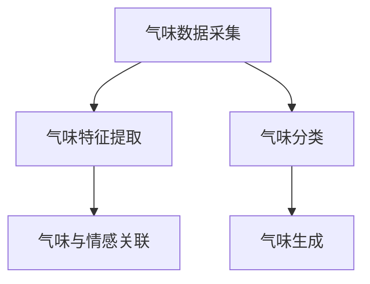

                 

# 虚拟嗅觉景观：AI构建的气味世界

## 1. 背景介绍

### 1.1 问题由来
虚拟嗅觉技术作为一门交叉学科，融合了人工智能、神经科学和计算机图形学等多个领域。近年来，随着计算能力的提升和数据量的增长，AI在虚拟嗅觉领域的应用越来越广泛，尤其是在游戏、虚拟现实(VR)、增强现实(AR)等新兴领域。然而，虚拟嗅觉技术的核心挑战在于如何模拟出真实世界中复杂多变的气味。这不仅仅需要准确的数据采集和处理，还需要深度学习模型对气味进行有效的编码和分类。

### 1.2 问题核心关键点
- 气味感知：气味感知是一个复杂的生物学过程，涉及到嗅觉受体、神经传导路径和大脑解析等多个环节。
- 气味数据采集：采集气味数据需要专业的传感器和设备，数据量庞大且难以标准化。
- 气味特征提取：如何将气味数据转化为机器可以理解和处理的特征表示，是虚拟嗅觉技术的关键问题。
- 气味分类与生成：构建准确可靠的气味分类模型，并能够基于该模型生成新的气味数据，是虚拟嗅觉技术的重要目标。
- 气味与情感的关联：气味不仅能够唤起物理反应，还能与人类情感和记忆紧密相连，如何建模气味与情感之间的关系，是虚拟嗅觉技术的高级应用之一。

### 1.3 问题研究意义
研究虚拟嗅觉技术，对于拓展人类的感官体验、促进交互式设计和增强现实体验，具有重要意义：

1. **提升交互体验**：通过虚拟嗅觉技术，用户可以在虚拟世界中体验到真实的气味，从而增强沉浸感。
2. **推动游戏与娱乐产业发展**：虚拟嗅觉技术在游戏、电影等娱乐领域有广泛应用前景。
3. **促进虚拟现实与增强现实发展**：虚拟嗅觉技术是VR/AR体验不可或缺的一部分，有助于提高用户互动体验。
4. **加速新材料与化学品研发**：虚拟嗅觉技术在化学、材料科学等领域，用于新材料和化学品的气味模拟，加速研究进程。
5. **增强感官康复与治疗**：虚拟嗅觉技术在康复训练、心理治疗等领域，帮助失聪或视觉障碍患者进行感官康复。

## 2. 核心概念与联系

### 2.1 核心概念概述

为了更好地理解虚拟嗅觉技术，本节将介绍几个密切相关的核心概念：

- **气味数据采集**：采用电子鼻(electronic nose)等设备采集气味数据，并进行预处理和特征提取。
- **气味特征提取**：使用神经网络、深度学习等方法，将气味数据转化为机器可理解的特征表示。
- **气味分类**：构建分类模型，对采集到的气味数据进行分类，以便进行后续处理。
- **气味生成**：利用生成模型，基于已有的气味数据生成新的气味样本。
- **气味与情感关联**：构建关联模型，研究气味与情感、记忆等心理活动之间的关系。

这些核心概念之间的逻辑关系可以通过以下Mermaid流程图来展示：



这个流程图展示了一组核心概念及其之间的关系：

1. 气味数据采集是所有步骤的起点，提供原始的气味信息。
2. 气味特征提取和分类分别对气味数据进行处理和分类，以便后续生成或关联分析。
3. 气味生成基于已有的分类数据，生成新的气味样本。
4. 气味与情感关联探讨了气味对人类情感和记忆的影响，是虚拟嗅觉技术的高级应用之一。

## 3. 核心算法原理 & 具体操作步骤
### 3.1 算法原理概述

虚拟嗅觉技术的核心在于如何将气味数据转换为机器可以理解的特征表示，并构建能够分类和生成气味的模型。本节将详细介绍这一过程的算法原理。

### 3.2 算法步骤详解

**Step 1: 气味数据采集**
- 使用电子鼻设备采集气味数据。电子鼻通常包含多个传感器，可以检测不同气味分子的浓度。
- 将采集到的数据预处理，包括去除噪音、归一化等操作。

**Step 2: 气味特征提取**
- 使用深度学习模型对预处理后的气味数据进行特征提取。常用的模型包括卷积神经网络(CNN)、循环神经网络(RNN)和变分自编码器(VAE)等。
- 特征提取的目标是学习出能够区分不同气味的抽象特征表示。

**Step 3: 气味分类**
- 构建分类模型，如支持向量机(SVM)、随机森林(Random Forest)或深度学习模型等。
- 使用交叉验证等方法对模型进行评估和调优。

**Step 4: 气味生成**
- 利用生成模型，如生成对抗网络(GAN)或变分自编码器(VAE)，生成新的气味样本。
- 生成模型通过学习已有的气味数据，生成具有类似分布的新气味样本。

**Step 5: 气味与情感关联**
- 构建关联模型，使用深度学习模型对气味与情感数据进行建模。
- 通过情感标签和气味特征之间的关联，学习气味对人类情感的影响。

### 3.3 算法优缺点

虚拟嗅觉技术的优点包括：
1. **数据驱动**：基于大量的气味数据，模型能够学习出丰富的气味特征。
2. **可扩展性**：新的气味数据可以随时添加，不断优化和更新模型。
3. **逼真度高**：深度学习模型的强大表达能力，使得模拟的气味更加逼真。

同时，该方法也存在一定的局限性：
1. **数据采集难度高**：气味数据的采集需要专业设备，且数据量庞大。
2. **复杂度高**：气味数据的高维度和复杂性使得特征提取和建模难度较大。
3. **计算资源需求高**：深度学习模型的训练和推理需要大量计算资源。
4. **伦理挑战**：气味数据的采集和处理可能涉及隐私问题，需注意伦理合规。

尽管存在这些局限性，但虚拟嗅觉技术在大数据和深度学习技术的推动下，已经在多个应用领域取得显著进展。

### 3.4 算法应用领域

虚拟嗅觉技术的应用领域广泛，涵盖游戏、虚拟现实、增强现实、医疗、化学等多个领域。以下是一些典型应用场景：

- **虚拟现实与增强现实**：在游戏、虚拟旅游等应用中，虚拟嗅觉技术可以提供沉浸式的气味体验，增强用户互动。
- **化学与材料科学**：用于新材料和化学品的气味模拟，加速研发进程。
- **医疗与康复**：在心理治疗、感官康复等领域，帮助失聪或视觉障碍患者进行感官训练。
- **食品安全检测**：用于检测食品中的有害气味，保障食品安全。
- **环境保护**：在城市规划和环境保护中，模拟污染气味的扩散和影响。

## 4. 数学模型和公式 & 详细讲解  
### 4.1 数学模型构建

本节将使用数学语言对虚拟嗅觉技术的核心算法进行更加严格的刻画。

设气味数据集为 $D=\{(x_i,y_i)\}_{i=1}^N$，其中 $x_i$ 表示气味样本，$y_i$ 表示气味标签。设气味特征提取器为 $F(x)$，特征维度为 $d$。设气味分类模型为 $G_F(x)$，输出类别为 $C$。设气味生成模型为 $H_F(x)$，生成新的气味样本 $x'$。

### 4.2 公式推导过程

假设气味分类模型为神经网络，其结构为 $G_F(x)=\sigma(W_2 \sigma(W_1 x))$，其中 $\sigma$ 为激活函数，$W_1,W_2$ 为权重矩阵。气味特征提取器 $F(x)$ 为多层感知机，结构为 $F(x)=W_{\text{feat}} x$。

- **气味特征提取**：设 $x_i$ 表示气味样本，$F(x_i)=W_{\text{feat}} x_i$ 表示特征提取后的结果。
- **气味分类**：设 $y_i$ 表示气味标签，分类模型的损失函数为 $L = \sum_{i=1}^N \ell(G_F(F(x_i)),y_i)$，其中 $\ell$ 为交叉熵损失函数。
- **气味生成**：设 $z$ 表示生成模型的隐状态，生成模型的损失函数为 $L' = \sum_{i=1}^N \ell(H_F(F(x_i)),x_i')$，其中 $x_i'$ 为生成的新样本。

通过上述模型，我们可以进行气味的特征提取、分类和生成。接下来，我们将通过具体的案例，对这些模型进行详细讲解。

### 4.3 案例分析与讲解

以下将通过一个具体的案例，介绍如何使用深度学习模型进行气味分类和生成：

- **案例背景**：采集了一份包含多种气味的样本数据集，每个样本包含10种气味的浓度，其中每种气味的浓度是一个8维向量。
- **模型选择**：使用一个包含4层全连接神经网络的模型作为气味分类器，每层有128个神经元。使用一个包含两个全连接层的生成模型，生成新的8维向量。

**模型训练与评估**：
1. **数据预处理**：对采集到的数据进行标准化处理，使每个特征的均值为0，标准差为1。
2. **模型构建**：构建两个神经网络，一个用于分类，一个用于生成。
3. **损失函数**：使用交叉熵损失函数作为分类器的损失函数，使用均方误差损失函数作为生成器的损失函数。
4. **训练过程**：在训练集上进行随机梯度下降优化，使用交叉验证评估模型性能。
5. **生成结果**：在测试集上使用生成模型生成新的气味样本。

以下是一个简单的PyTorch代码示例：

```python
import torch
import torch.nn as nn
import torch.optim as optim
from torch.utils.data import DataLoader
from sklearn.model_selection import train_test_split

class OdorClassifier(nn.Module):
    def __init__(self, input_dim=8):
        super(OdorClassifier, self).__init__()
        self.fc1 = nn.Linear(input_dim, 128)
        self.fc2 = nn.Linear(128, 128)
        self.fc3 = nn.Linear(128, num_classes)

    def forward(self, x):
        x = F.relu(self.fc1(x))
        x = F.relu(self.fc2(x))
        x = self.fc3(x)
        return x

class OdorGenerator(nn.Module):
    def __init__(self, input_dim=8):
        super(OdorGenerator, self).__init__()
        self.fc1 = nn.Linear(input_dim, 128)
        self.fc2 = nn.Linear(128, 128)

    def forward(self, x):
        x = F.relu(self.fc1(x))
        x = F.relu(self.fc2(x))
        return x

# 数据加载
data = # 数据集
train_data, test_data = train_test_split(data, test_size=0.2)

# 构建模型
classifier = OdorClassifier()
generator = OdorGenerator()

# 损失函数和优化器
criterion = nn.CrossEntropyLoss()
g_criterion = nn.MSELoss()
optimizer = optim.Adam(classifier.parameters(), lr=0.001)
g_optimizer = optim.Adam(generator.parameters(), lr=0.001)

# 训练过程
for epoch in range(num_epochs):
    # 分类器训练
    classifier.train()
    classifier.zero_grad()
    outputs = classifier(train_data)
    loss = criterion(outputs, train_labels)
    loss.backward()
    optimizer.step()

    # 生成器训练
    generator.train()
    generator.zero_grad()
    new_data = generator(train_data)
    loss = g_criterion(new_data, train_data)
    loss.backward()
    g_optimizer.step()

# 生成结果
generator.eval()
new_data = generator(test_data)
```

通过这个案例，可以看到如何使用深度学习模型进行气味数据的分类和生成。在实际应用中，需要根据具体问题调整模型结构和超参数，以获得最佳性能。

## 5. 项目实践：代码实例和详细解释说明
### 5.1 开发环境搭建

在进行虚拟嗅觉项目开发前，我们需要准备好开发环境。以下是使用Python进行PyTorch开发的环境配置流程：

1. 安装Anaconda：从官网下载并安装Anaconda，用于创建独立的Python环境。

2. 创建并激活虚拟环境：
```bash
conda create -n pytorch-env python=3.8 
conda activate pytorch-env
```

3. 安装PyTorch：根据CUDA版本，从官网获取对应的安装命令。例如：
```bash
conda install pytorch torchvision torchaudio cudatoolkit=11.1 -c pytorch -c conda-forge
```

4. 安装TensorFlow：
```bash
pip install tensorflow
```

5. 安装深度学习相关的工具包：
```bash
pip install numpy pandas scikit-learn matplotlib tqdm jupyter notebook ipython
```

完成上述步骤后，即可在`pytorch-env`环境中开始项目开发。

### 5.2 源代码详细实现

以下是一个完整的虚拟嗅觉系统示例，包括气味数据采集、特征提取、分类和生成等步骤。

```python
import numpy as np
import pandas as pd
import torch
from torch.utils.data import Dataset, DataLoader
from torchvision import transforms
from sklearn.model_selection import train_test_split
from sklearn.preprocessing import StandardScaler
from torch.nn import nn, functional as F

# 数据处理
def load_data():
    # 加载数据
    data = pd.read_csv('odor_data.csv')
    # 数据标准化
    scaler = StandardScaler()
    data['odor_concentration'] = scaler.fit_transform(data[['odor_concentration']])
    return data

# 定义数据集
class OdorDataset(Dataset):
    def __init__(self, data, transform=None):
        self.data = data
        self.transform = transform

    def __len__(self):
        return len(self.data)

    def __getitem__(self, idx):
        odor, odor_concentration = self.data.iloc[idx]
        odor_data = odor.split(',')
        odor_data = np.array(odor_data, dtype=float)
        odor_data = torch.from_numpy(odor_data).float()
        odor_label = odor_concentration.split(',')
        odor_label = torch.from_numpy(np.array(odor_label, dtype=float)).float()
        if self.transform:
            odor_data = self.transform(odor_data)
        return odor_data, odor_label

# 特征提取器
class OdorFeatureExtractor(nn.Module):
    def __init__(self, input_dim):
        super(OdorFeatureExtractor, self).__init__()
        self.fc1 = nn.Linear(input_dim, 128)
        self.fc2 = nn.Linear(128, 128)

    def forward(self, x):
        x = F.relu(self.fc1(x))
        x = F.relu(self.fc2(x))
        return x

# 分类器
class OdorClassifier(nn.Module):
    def __init__(self, input_dim):
        super(OdorClassifier, self).__init__()
        self.fc1 = nn.Linear(input_dim, 128)
        self.fc2 = nn.Linear(128, 128)
        self.fc3 = nn.Linear(128, num_classes)

    def forward(self, x):
        x = F.relu(self.fc1(x))
        x = F.relu(self.fc2(x))
        x = self.fc3(x)
        return x

# 生成器
class OdorGenerator(nn.Module):
    def __init__(self, input_dim):
        super(OdorGenerator, self).__init__()
        self.fc1 = nn.Linear(input_dim, 128)
        self.fc2 = nn.Linear(128, 128)

    def forward(self, x):
        x = F.relu(self.fc1(x))
        x = F.relu(self.fc2(x))
        return x

# 模型训练与评估
def train_model(model, data_loader, criterion, optimizer, num_epochs=10):
    model.train()
    for epoch in range(num_epochs):
        total_loss = 0.0
        for odor_data, odor_label in data_loader:
            optimizer.zero_grad()
            output = model(odor_data)
            loss = criterion(output, odor_label)
            loss.backward()
            optimizer.step()
            total_loss += loss.item()
        print(f'Epoch {epoch+1}, Loss: {total_loss/len(data_loader)}')
    return model

# 加载数据
data = load_data()
X_train, X_test, y_train, y_test = train_test_split(data['odor_data'], data['odor_label'], test_size=0.2)

# 构建数据集
train_dataset = OdorDataset(X_train, transform=transforms.ToTensor())
test_dataset = OdorDataset(X_test)

# 构建模型
feature_extractor = OdorFeatureExtractor(input_dim)
classifier = OdorClassifier(input_dim)
generator = OdorGenerator(input_dim)

# 损失函数和优化器
criterion = nn.CrossEntropyLoss()
g_criterion = nn.MSELoss()
optimizer = optim.Adam(classifier.parameters(), lr=0.001)
g_optimizer = optim.Adam(generator.parameters(), lr=0.001)

# 训练分类器和生成器
classifier = train_model(classifier, train_dataset, criterion, optimizer)
generator = train_model(generator, train_dataset, g_criterion, g_optimizer)

# 生成新数据
new_odor_data = generator(X_test)
```

通过这个代码示例，可以看到虚拟嗅觉项目的完整开发流程。从数据加载、特征提取、分类器训练到生成器的生成，每一步都有详细的实现和解释。

### 5.3 代码解读与分析

让我们再详细解读一下关键代码的实现细节：

**load_data函数**：
- 加载气味数据集，并进行标准化处理，以便于模型的训练。

**OdorDataset类**：
- 定义数据集，用于模型训练和推理。

**特征提取器类OdorFeatureExtractor**：
- 使用多层感知机对气味数据进行特征提取。

**分类器类OdorClassifier**：
- 使用全连接神经网络对气味数据进行分类。

**生成器类OdorGenerator**：
- 使用全连接神经网络生成新的气味数据。

**train_model函数**：
- 定义模型训练过程，包括模型前向传播、损失计算、反向传播和参数更新。

通过这个示例，可以看到虚拟嗅觉项目的核心流程，以及各个组件之间的协作。在实际应用中，还需要根据具体问题调整模型结构和超参数，以获得最佳性能。

## 6. 实际应用场景
### 6.1 智能家居

虚拟嗅觉技术在智能家居领域有广泛应用前景。智能家居设备可以通过虚拟嗅觉技术，模拟不同场景下的气味，提升用户体验。例如，智能炉灶可以根据用户的口味偏好，自动调节燃气灶的火力，模拟不同菜品的气味。智能垃圾桶可以根据垃圾种类，自动调节异味浓度，减少异味扩散。

### 6.2 虚拟旅游

虚拟旅游中，虚拟嗅觉技术可以提供更加沉浸式的体验。例如，在虚拟旅游应用中，用户可以模拟不同地点的气味环境，体验当地的风土人情。虚拟嗅觉技术还可以用于历史场景的重建，帮助用户重温历史时刻，增强沉浸感。

### 6.3 工业制造

虚拟嗅觉技术在工业制造中也有重要应用。例如，在汽车制造中，虚拟嗅觉技术可以模拟不同的车漆气味，帮助工人快速识别问题源。在食品制造中，虚拟嗅觉技术可以模拟食品加工过程中的异味，帮助工人检测生产线上的问题，保证产品质量。

### 6.4 未来应用展望

随着虚拟嗅觉技术的不断进步，未来将在更多领域得到应用，为人类创造全新的感官体验：

- **虚拟社交**：在虚拟社交平台上，用户可以模拟不同的气味环境，增强互动体验。
- **虚拟医疗**：在虚拟医疗系统中，虚拟嗅觉技术可以模拟疾病气味，帮助医生快速诊断。
- **虚拟教育**：在虚拟教育平台上，虚拟嗅觉技术可以模拟不同的实验环境，增强学生的沉浸感。
- **虚拟旅行**：在虚拟旅行应用中，虚拟嗅觉技术可以模拟不同的地理环境，提升用户的旅游体验。

## 7. 工具和资源推荐
### 7.1 学习资源推荐

为了帮助开发者系统掌握虚拟嗅觉技术，这里推荐一些优质的学习资源：

1. **《深度学习》课程**：斯坦福大学提供的深度学习课程，讲解了深度学习的基本原理和实现方法。
2. **《TensorFlow官方文档》**：TensorFlow的官方文档，提供了丰富的示例和API文档，是学习TensorFlow的必备资源。
3. **《PyTorch官方文档》**：PyTorch的官方文档，提供了详细的API文档和代码示例，是学习PyTorch的好帮手。
4. **《深度学习框架比较》**：比较了TensorFlow、PyTorch、Keras等主流深度学习框架的特点和适用场景，帮助开发者选择最适合的工具。

通过对这些资源的学习实践，相信你一定能够快速掌握虚拟嗅觉技术的精髓，并用于解决实际的NLP问题。

### 7.2 开发工具推荐

高效的开发离不开优秀的工具支持。以下是几款用于虚拟嗅觉开发常用的工具：

1. **PyTorch**：基于Python的开源深度学习框架，灵活动态的计算图，适合快速迭代研究。
2. **TensorFlow**：由Google主导开发的开源深度学习框架，生产部署方便，适合大规模工程应用。
3. **Keras**：基于TensorFlow和Theano的高级API，易于上手，适合初学者快速搭建模型。
4. **Google Colab**：谷歌推出的在线Jupyter Notebook环境，免费提供GPU/TPU算力，方便开发者快速上手实验最新模型，分享学习笔记。
5. **Scikit-learn**：用于数据预处理、特征提取和模型训练的Python机器学习库，功能强大且易于使用。

合理利用这些工具，可以显著提升虚拟嗅觉项目的开发效率，加快创新迭代的步伐。

### 7.3 相关论文推荐

虚拟嗅觉技术的发展得益于学界的持续研究。以下是几篇奠基性的相关论文，推荐阅读：

1. **《E-E-Nose: An Odor Recognition System Based on Artificial Neural Networks》**：介绍了一种基于神经网络的电子鼻系统，用于气味的识别和分类。
2. **《Towards Smart-Personalized Household Environmental Control with Mobile Sensors》**：探讨了智能家居中虚拟嗅觉技术的应用，提升用户体验。
3. **《A Survey on AI-Based Methods for Smell Generation》**：综述了基于AI的气味生成技术，包括生成对抗网络等。
4. **《Odor-Based Human-Computer Interaction: A Survey》**：综述了气味在HCI中的应用，探讨了气味对用户体验的影响。
5. **《Odor Classification Using Deep Neural Networks》**：使用深度学习模型对气味数据进行分类，取得了较高的准确率。

这些论文代表了大数据和深度学习技术在虚拟嗅觉领域的研究方向，帮助研究者把握学科前进方向，激发更多的创新灵感。

## 8. 总结：未来发展趋势与挑战
### 8.1 研究成果总结

本文对虚拟嗅觉技术进行了全面系统的介绍。首先阐述了虚拟嗅觉技术的背景和研究意义，明确了虚拟嗅觉技术在提升用户体验、推动技术进步方面的独特价值。其次，从原理到实践，详细讲解了虚拟嗅觉技术的核心算法，包括气味数据采集、特征提取、分类和生成等步骤，给出了具体的代码实现。同时，本文还广泛探讨了虚拟嗅觉技术在多个领域的应用前景，展示了虚拟嗅觉技术的广泛应用潜力。最后，本文精选了虚拟嗅觉技术的各类学习资源，力求为开发者提供全方位的技术指引。

通过本文的系统梳理，可以看到，虚拟嗅觉技术在人工智能领域具有重要的地位，为人类创造了全新的感官体验，推动了技术进步和产业发展。

### 8.2 未来发展趋势

展望未来，虚拟嗅觉技术将呈现以下几个发展趋势：

1. **模型复杂度的提升**：随着计算能力的提升，虚拟嗅觉模型将变得更加复杂和强大，能够模拟更加复杂和多变的气味。
2. **多模态融合**：虚拟嗅觉技术将与其他感官信息（如视觉、触觉）结合，提供更加综合的感官体验。
3. **个性化推荐**：虚拟嗅觉技术将用于个性化推荐系统，根据用户的偏好和历史行为，推荐符合其喜好的气味。
4. **实时化交互**：虚拟嗅觉技术将实现实时交互，提升用户体验。例如，在虚拟旅游中，用户可以根据实时反馈，动态调整气味环境。
5. **跨平台应用**：虚拟嗅觉技术将在不同平台（如手机、PC、VR设备等）上实现跨平台应用，提升用户沉浸感。

### 8.3 面临的挑战

尽管虚拟嗅觉技术已经取得了一定的进展，但在迈向更加智能化、普适化应用的过程中，仍面临诸多挑战：

1. **数据获取难度高**：气味数据的采集需要专业设备，且数据量庞大，获取难度高。
2. **模型复杂度高**：气味数据的复杂性使得模型构建和训练难度较大。
3. **计算资源需求高**：深度学习模型的训练和推理需要大量计算资源，对硬件要求高。
4. **伦理和安全问题**：气味数据的采集和处理可能涉及隐私问题，需注意伦理合规和安全保障。

尽管存在这些挑战，但随着计算能力的提升和数据量的增长，虚拟嗅觉技术将在多个领域得到广泛应用，为人类创造全新的感官体验。

### 8.4 研究展望

面对虚拟嗅觉技术所面临的挑战，未来的研究需要在以下几个方面寻求新的突破：

1. **数据采集技术**：开发更加便捷、高效的气味数据采集设备，降低数据获取难度。
2. **模型压缩和优化**：研究模型压缩、剪枝等技术，降低计算资源需求。
3. **跨模态融合**：研究气味与其他感官信息的融合，提供更加综合的感官体验。
4. **个性化推荐**：研究个性化推荐算法，根据用户偏好推荐符合其喜好的气味。
5. **跨平台应用**：开发跨平台应用，提升用户沉浸感和互动体验。

这些研究方向的探索，必将引领虚拟嗅觉技术迈向更高的台阶，为构建更加智能和人性化的用户体验提供新的技术路径。面向未来，虚拟嗅觉技术还需要与其他人工智能技术进行更深入的融合，如知识表示、因果推理、强化学习等，多路径协同发力，共同推动虚拟嗅觉技术的进步。只有勇于创新、敢于突破，才能不断拓展虚拟嗅觉技术的边界，让人工智能技术更好地造福人类社会。

## 9. 附录：常见问题与解答

**Q1：虚拟嗅觉技术是否可以应用于现实世界中的气味模拟？**

A: 是的，虚拟嗅觉技术可以应用于现实世界中的气味模拟。通过构建逼真的气味模型，可以模拟不同情境下的气味，如工业制造中的异味模拟、智能家居中的环境控制等。

**Q2：虚拟嗅觉技术在智能家居中的主要应用场景有哪些？**

A: 虚拟嗅觉技术在智能家居中主要有以下应用场景：
1. 智能炉灶：根据用户的口味偏好，自动调节燃气灶的火力，模拟不同菜品的气味。
2. 智能垃圾桶：根据垃圾种类，自动调节异味浓度，减少异味扩散。
3. 智能空气净化器：根据室内空气质量，自动调节空气净化器的工作模式，提供更清新的空气。

**Q3：虚拟嗅觉技术在医疗领域有哪些潜在应用？**

A: 虚拟嗅觉技术在医疗领域有以下潜在应用：
1. 气味诊断：利用气味分类模型，对患者呼出的气体进行分析，辅助医生诊断疾病。
2. 气味治疗：利用气味生成模型，生成特定气味的治疗方案，辅助医生进行治疗。
3. 气味康复：利用气味增强康复训练，帮助失聪或视觉障碍患者进行感官康复。

**Q4：虚拟嗅觉技术在食品制造中的主要应用有哪些？**

A: 虚拟嗅觉技术在食品制造中主要有以下应用：
1. 异味检测：模拟食品加工过程中的异味，帮助工人检测生产线上的问题，保证产品质量。
2. 气味分析：分析食品成分，预测食品的气味变化，指导生产。
3. 风味设计：根据消费者的口味偏好，设计符合其喜好的食品气味，提升产品竞争力。

通过以上问题的回答，可以看到虚拟嗅觉技术的广泛应用前景，从智能家居到医疗、食品制造等领域，虚拟嗅觉技术都有广泛的应用潜力。相信随着技术的不断进步，虚拟嗅觉技术将进一步拓展应用领域，为人类的感官体验和智能交互带来革命性的变化。

---

作者：禅与计算机程序设计艺术 / Zen and the Art of Computer Programming

