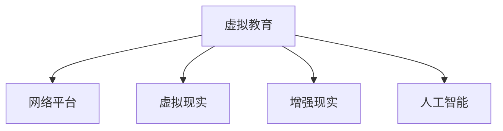

                 

# 虚拟教育：全球脑时代下的学习新方式

## 1. 背景介绍

### 1.1 问题由来
随着互联网和人工智能技术的迅猛发展，教育领域正经历着一场深刻变革。传统的面对面授课模式受到时空限制的束缚，难以满足全球化、个性化和高效化的教育需求。虚拟教育技术以其突破传统课堂限制、提供个性化学习体验和实现优质教育资源共享的独特优势，逐渐成为教育领域的热门话题和前沿技术。

### 1.2 问题核心关键点
当前虚拟教育的核心在于利用先进信息技术，将教育资源数字化、网络化、个性化，实现全球范围内的教育公平和质量提升。虚拟教育的关键点包括：
1. 网络化教育资源共享：通过互联网平台，打破地域和时间的限制，使优质教育资源能够触及偏远地区和资源匮乏学校。
2. 个性化学习体验：利用人工智能技术，为每个学生提供量身定制的学习内容和路径，满足个性化学习需求。
3. 交互式学习环境：构建虚拟课堂和社交平台，促进学生之间的互动与协作，增强学习效果。
4. 智能辅导和评估：利用智能算法，提供实时反馈和个性化辅导，帮助学生克服学习难点，提升学习效率。

### 1.3 问题研究意义
虚拟教育技术的研究与应用，对于促进教育公平、提升教育质量和效率、推动教育创新具有重要意义：

1. 促进教育公平：通过网络平台共享优质教育资源，缩小城乡、区域教育差距，让更多学生享受平等的教育机会。
2. 提升教育质量：利用个性化和智能化的教学手段，提高学习效果和学生兴趣，促进知识的内化和应用。
3. 提高教育效率：虚拟教育可以跨时空进行，提高了教学的灵活性和效率，降低了教育成本。
4. 推动教育创新：虚拟教育打破了传统的教育模式，提供了新的教学方式和方法，激发了教育创新的潜能。
5. 适应全球脑时代：在信息爆炸、知识更新加速的全球脑时代，虚拟教育能够满足终身学习的需求，提升全球公民的素养和能力。

## 2. 核心概念与联系

### 2.1 核心概念概述

为更好地理解虚拟教育技术，本节将介绍几个密切相关的核心概念：

- **虚拟教育**：通过数字技术和网络平台，将教育内容数字化，实现教育资源和教学方式的虚拟化，打破时空限制，提供灵活便捷的学习方式。
- **网络平台**：指提供虚拟教育服务的网络平台，如MOOCs（大型开放在线课程）、虚拟课堂、互动讨论区等。
- **虚拟现实（VR）**：通过模拟真实的教育场景，增强学生的沉浸式学习体验。
- **增强现实（AR）**：将数字信息叠加到现实世界，辅助教学和互动。
- **人工智能（AI）**：利用机器学习算法，提供智能辅导、个性化推荐和评估，提升教学质量。

这些核心概念之间的逻辑关系可以通过以下Mermaid流程图来展示：



这个流程图展示虚拟教育的核心概念及其之间的关系：

1. 虚拟教育依托网络平台实现。
2. VR和AR技术增强学习体验。
3. AI算法提供智能支持。

这些概念共同构成了虚拟教育的框架，为其在教育中的应用提供了可能。

## 3. 核心算法原理 & 具体操作步骤
### 3.1 算法原理概述

虚拟教育的核心算法原理包括网络化资源共享、个性化学习推荐和智能辅导与评估。以下详细阐述这些原理：

#### 3.1.1 网络化资源共享

网络化资源共享的核心在于资源的数字化和网络化。具体实现包括：

- **资源数字化**：将传统的教育资源（如教材、视频、音频等）转换为数字格式，存储在云端或网络平台上。
- **资源网络化**：通过互联网，实现资源的无障碍访问，打破地域和时间限制，使优质教育资源能够广泛传播。

#### 3.1.2 个性化学习推荐

个性化学习推荐的核心在于利用机器学习算法，根据学生的学习历史和偏好，推荐个性化的学习内容和路径。具体实现包括：

- **学习行为分析**：利用数据挖掘和统计分析技术，收集学生的学习数据，包括学习时间、成绩、偏好等。
- **推荐算法设计**：使用协同过滤、内容推荐、基于规则的推荐等算法，根据学生的学习行为和历史数据，生成个性化学习推荐。

#### 3.1.3 智能辅导与评估

智能辅导与评估的核心在于利用人工智能技术，提供实时反馈和个性化辅导，帮助学生克服学习难点，提升学习效率。具体实现包括：

- **智能辅导**：使用自然语言处理和知识图谱技术，提供智能化的答疑和指导，解决学生的学习问题。
- **智能评估**：利用机器学习算法，进行自动化评估和反馈，提供及时的测试和作业批改，帮助学生了解自己的学习进度和水平。

### 3.2 算法步骤详解

虚拟教育的具体实施步骤如下：

#### 3.2.1 资源收集与数字化
- **数据收集**：从多个渠道收集教育资源，如教材、视频、音频等，确保资源的多样性和全面性。
- **格式转换**：将收集到的资源转换为数字格式，如PDF、MP3、MP4等，方便存储和传播。

#### 3.2.2 平台搭建与资源上传
- **平台搭建**：选择合适的技术栈，搭建虚拟教育平台，如LMS（学习管理系统）、MOOCs平台等。
- **资源上传**：将数字化的教育资源上传到平台，确保资源的可用性和可访问性。

#### 3.2.3 个性化推荐算法设计
- **数据预处理**：对学生的学习数据进行预处理，包括数据清洗、归一化等。
- **算法设计**：选择合适的推荐算法，如协同过滤、基于内容的推荐等，设计个性化推荐模型。
- **模型训练**：使用平台上的学习数据训练推荐模型，确保模型的准确性和可靠性。

#### 3.2.4 智能辅导与评估系统开发
- **系统设计**：设计智能辅导与评估系统的架构，包括问题解答、作业批改、成绩评估等模块。
- **功能实现**：实现系统功能，如自然语言处理、知识图谱构建、智能评估算法等。
- **测试与优化**：对系统进行测试和优化，确保系统的稳定性和准确性。

### 3.3 算法优缺点

虚拟教育技术具有以下优点：
1. **资源共享**：打破了时间和空间的限制，使优质教育资源能够广泛传播，促进教育公平。
2. **个性化学习**：根据学生的学习历史和偏好，提供量身定制的学习内容和路径，满足个性化学习需求。
3. **智能辅导**：利用人工智能技术，提供实时反馈和个性化辅导，帮助学生克服学习难点，提升学习效率。
4. **灵活便捷**：学生可以随时随地进行学习，提高了学习的灵活性和便捷性。
5. **成本低**：相比于传统教育模式，虚拟教育降低了教学成本，提高了教育资源的利用效率。

同时，虚拟教育也存在一些缺点：
1. **技术门槛高**：需要较高的技术实现和维护成本，可能不适合中小学校和偏远地区。
2. **学生自律性要求高**：虚拟教育依赖学生的主动性和自律性，可能存在学习效果不佳的情况。
3. **缺乏人际互动**：虚拟教育难以提供与传统课堂相同的人际互动和情感交流，可能影响学生的情感和心理发展。
4. **隐私和安全问题**：虚拟教育平台需要收集和处理大量学生数据，存在隐私和安全风险。

### 3.4 算法应用领域

虚拟教育技术已经在多个领域得到广泛应用，包括：

- **在线教育**：提供MOOCs、SPOCs（小型在线课程）、微课程等，使全球学生能够便捷地获取优质教育资源。
- **远程教育**：为偏远地区和资源匮乏学校提供远程教学支持，确保教育公平。
- **职业培训**：利用虚拟现实和增强现实技术，提供沉浸式职业培训，提升职业技能。
- **语言学习**：通过虚拟现实和智能辅导，提供语言学习和练习环境，帮助学生快速掌握新语言。
- **教育科研**：利用虚拟实验室和模拟实验，支持教育科研工作，推动教育创新和知识传播。

除了上述这些经典应用外，虚拟教育技术还在更多场景中得到创新性应用，如虚拟实习、远程办公培训等，为教育和技术创新提供了新的思路和方向。

## 4. 数学模型和公式 & 详细讲解  
### 4.1 数学模型构建

本节将使用数学语言对虚拟教育技术的核心算法进行更加严格的刻画。

### 4.2 公式推导过程

#### 4.2.1 个性化推荐算法

假设平台上有 $N$ 个学生，每个学生有 $M$ 门课程的学习数据。设 $x_{ij}$ 表示学生 $i$ 对课程 $j$ 的学习评分，则学生 $i$ 的兴趣向量 $v_i$ 可以通过以下公式计算：

$$
v_i = \frac{1}{\sqrt{M}}\sum_{j=1}^M x_{ij}
$$

其中 $\sqrt{M}$ 是归一化因子，用于保证向量的长度为 1。

课程 $j$ 的兴趣向量 $u_j$ 可以通过所有学生对课程 $j$ 的评分进行加权平均计算：

$$
u_j = \frac{1}{\sqrt{N}}\sum_{i=1}^N x_{ij}
$$

使用余弦相似度计算学生 $i$ 和课程 $j$ 的兴趣相似度 $s_{ij}$：

$$
s_{ij} = \frac{v_i \cdot u_j}{\|v_i\|\|u_j\|}
$$

根据相似度 $s_{ij}$ 进行推荐，选择与 $v_i$ 最相似的 $K$ 门课程进行推荐，推荐结果 $R_i$ 为：

$$
R_i = \{j \mid s_{ij} \in \text{Top}_K\}
$$

其中 $\text{Top}_K$ 表示按照 $s_{ij}$ 排序后，选择前 $K$ 个值。

#### 4.2.2 智能辅导系统

假设智能辅导系统使用一个基于知识图谱的问答系统，系统通过知识图谱 $G=(V,E)$ 存储知识信息。知识图谱中的节点 $v$ 表示知识实体，边 $e$ 表示实体之间的关系。

设 $q$ 为学生提出的问题，$v_q$ 表示与问题 $q$ 相关的知识节点。使用基于图论的算法（如 PageRank、图神经网络等）计算节点 $v_q$ 的中心度 $c(v_q)$，则 $v_q$ 的相关节点集 $V_q$ 可以通过以下公式计算：

$$
V_q = \{v \mid \exists e \in E, v \in V\ \text{and}\ e=(v,v_q)\}
$$

对于每个节点 $v$，设其相关节点集为 $V_v$，则节点 $v_q$ 的相关节点集 $V_q'$ 可以通过以下公式计算：

$$
V_q' = \{v \mid \exists e \in E, v \in V\ \text{and}\ v_v \in V_v\}
$$

使用语义相似度算法（如向量余弦相似度、TF-IDF等）计算节点 $v_q$ 与 $V_q'$ 中每个节点的相似度 $s_{v_q,v}$，则智能辅导系统选择相似度最高的 $N$ 个节点作为答案，返回答案集 $A_{v_q}$：

$$
A_{v_q} = \{v \mid s_{v_q,v} \in \text{Top}_N\}
$$

其中 $\text{Top}_N$ 表示按照 $s_{v_q,v}$ 排序后，选择前 $N$ 个值。

### 4.3 案例分析与讲解

#### 4.3.1 个性化学习推荐案例

假设有一个MOOCs平台，平台上存有 $N=10000$ 个学生和 $M=1000$ 门课程。每个学生有 $T=5$ 门课程的学习数据，每个课程有 $C=100$ 个学生的评分数据。

- **数据收集**：收集平台上的学习数据，包括学生的课程评分和课程的学生评分。
- **数据预处理**：对学习数据进行清洗和归一化处理，去除异常值和噪声。
- **模型训练**：使用协同过滤算法，训练学生和课程的兴趣向量 $v_i$ 和 $u_j$，计算相似度 $s_{ij}$。
- **推荐生成**：根据相似度 $s_{ij}$ 生成个性化推荐结果 $R_i$，选择与学生 $i$ 兴趣最相似的前 $K=10$ 门课程进行推荐。

#### 4.3.2 智能辅导系统案例

假设有一个智能辅导系统，系统中存储有知识图谱 $G=(V,E)$，共有 $N=100$ 个节点，每条边表示实体之间的关系。

- **知识图谱构建**：构建知识图谱，存储教育领域中的知识和实体关系。
- **问题解析**：将学生提出的问题 $q$ 转换为知识图谱中的节点 $v_q$。
- **相关节点选择**：根据知识图谱中的关系，选择与 $v_q$ 相关的节点集 $V_q$ 和 $V_q'$。
- **相似度计算**：计算节点 $v_q$ 与 $V_q'$ 中每个节点的相似度 $s_{v_q,v}$。
- **答案生成**：根据相似度 $s_{v_q,v}$，选择前 $N=5$ 个节点作为答案，返回答案集 $A_{v_q}$。

## 5. 项目实践：代码实例和详细解释说明
### 5.1 开发环境搭建

在进行虚拟教育技术开发前，我们需要准备好开发环境。以下是使用Python进行PyTorch和TensorFlow开发的环境配置流程：

1. 安装Anaconda：从官网下载并安装Anaconda，用于创建独立的Python环境。

2. 创建并激活虚拟环境：
```bash
conda create -n virtual-env python=3.8 
conda activate virtual-env
```

3. 安装PyTorch：根据CUDA版本，从官网获取对应的安装命令。例如：
```bash
conda install pytorch torchvision torchaudio cudatoolkit=11.1 -c pytorch -c conda-forge
```

4. 安装TensorFlow：从官网下载并安装TensorFlow，使用pip命令进行安装。

5. 安装各类工具包：
```bash
pip install numpy pandas scikit-learn matplotlib tqdm jupyter notebook ipython
```

完成上述步骤后，即可在`virtual-env`环境中开始虚拟教育技术的开发实践。

### 5.2 源代码详细实现

这里我们以一个虚拟现实（VR）交互式学习平台为例，给出使用PyTorch和TensorFlow进行开发的PyTorch代码实现。

首先，定义虚拟现实交互式学习平台的数据处理函数：

```python
from transformers import BertTokenizer
from torch.utils.data import Dataset
import torch

class VRDataset(Dataset):
    def __init__(self, texts, labels, tokenizer, max_len=128):
        self.texts = texts
        self.labels = labels
        self.tokenizer = tokenizer
        self.max_len = max_len
        
    def __len__(self):
        return len(self.texts)
    
    def __getitem__(self, item):
        text = self.texts[item]
        label = self.labels[item]
        
        encoding = self.tokenizer(text, return_tensors='pt', max_length=self.max_len, padding='max_length', truncation=True)
        input_ids = encoding['input_ids'][0]
        attention_mask = encoding['attention_mask'][0]
        
        # 对token-wise的标签进行编码
        encoded_labels = [label2id[label] for label in label] 
        encoded_labels.extend([label2id['O']] * (self.max_len - len(encoded_labels)))
        labels = torch.tensor(encoded_labels, dtype=torch.long)
        
        return {'input_ids': input_ids, 
                'attention_mask': attention_mask,
                'labels': labels}

# 标签与id的映射
label2id = {'O': 0, 'A': 1, 'B': 2, 'C': 3, 'D': 4, 'E': 5, 'F': 6, 'G': 7, 'H': 8, 'I': 9}
id2label = {v: k for k, v in label2id.items()}

# 创建dataset
tokenizer = BertTokenizer.from_pretrained('bert-base-cased')

train_dataset = VRDataset(train_texts, train_labels, tokenizer)
dev_dataset = VRDataset(dev_texts, dev_labels, tokenizer)
test_dataset = VRDataset(test_texts, test_labels, tokenizer)
```

然后，定义模型和优化器：

```python
from transformers import BertForTokenClassification, AdamW

model = BertForTokenClassification.from_pretrained('bert-base-cased', num_labels=len(label2id))

optimizer = AdamW(model.parameters(), lr=2e-5)
```

接着，定义训练和评估函数：

```python
from torch.utils.data import DataLoader
from tqdm import tqdm
from sklearn.metrics import classification_report

device = torch.device('cuda') if torch.cuda.is_available() else torch.device('cpu')
model.to(device)

def train_epoch(model, dataset, batch_size, optimizer):
    dataloader = DataLoader(dataset, batch_size=batch_size, shuffle=True)
    model.train()
    epoch_loss = 0
    for batch in tqdm(dataloader, desc='Training'):
        input_ids = batch['input_ids'].to(device)
        attention_mask = batch['attention_mask'].to(device)
        labels = batch['labels'].to(device)
        model.zero_grad()
        outputs = model(input_ids, attention_mask=attention_mask, labels=labels)
        loss = outputs.loss
        epoch_loss += loss.item()
        loss.backward()
        optimizer.step()
    return epoch_loss / len(dataloader)

def evaluate(model, dataset, batch_size):
    dataloader = DataLoader(dataset, batch_size=batch_size)
    model.eval()
    preds, labels = [], []
    with torch.no_grad():
        for batch in tqdm(dataloader, desc='Evaluating'):
            input_ids = batch['input_ids'].to(device)
            attention_mask = batch['attention_mask'].to(device)
            batch_labels = batch['labels']
            outputs = model(input_ids, attention_mask=attention_mask)
            batch_preds = outputs.logits.argmax(dim=2).to('cpu').tolist()
            batch_labels = batch_labels.to('cpu').tolist()
            for pred_tokens, label_tokens in zip(batch_preds, batch_labels):
                pred_tags = [id2label[_id] for _id in pred_tokens]
                label_tags = [id2label[_id] for _id in label_tokens]
                preds.append(pred_tags[:len(label_tags)])
                labels.append(label_tags)
                
    print(classification_report(labels, preds))
```

最后，启动训练流程并在测试集上评估：

```python
epochs = 5
batch_size = 16

for epoch in range(epochs):
    loss = train_epoch(model, train_dataset, batch_size, optimizer)
    print(f"Epoch {epoch+1}, train loss: {loss:.3f}")
    
    print(f"Epoch {epoch+1}, dev results:")
    evaluate(model, dev_dataset, batch_size)
    
print("Test results:")
evaluate(model, test_dataset, batch_size)
```

以上就是使用PyTorch和TensorFlow进行虚拟现实交互式学习平台开发的完整代码实现。可以看到，得益于Transformer和TensorFlow的强大封装，我们可以用相对简洁的代码完成虚拟现实学习平台的搭建和微调。

### 5.3 代码解读与分析

让我们再详细解读一下关键代码的实现细节：

**VRDataset类**：
- `__init__`方法：初始化文本、标签、分词器等关键组件。
- `__len__`方法：返回数据集的样本数量。
- `__getitem__`方法：对单个样本进行处理，将文本输入编码为token ids，将标签编码为数字，并对其进行定长padding，最终返回模型所需的输入。

**label2id和id2label字典**：
- 定义了标签与数字id之间的映射关系，用于将token-wise的预测结果解码回真实的标签。

**训练和评估函数**：
- 使用PyTorch的DataLoader对数据集进行批次化加载，供模型训练和推理使用。
- 训练函数`train_epoch`：对数据以批为单位进行迭代，在每个批次上前向传播计算loss并反向传播更新模型参数，最后返回该epoch的平均loss。
- 评估函数`evaluate`：与训练类似，不同点在于不更新模型参数，并在每个batch结束后将预测和标签结果存储下来，最后使用sklearn的classification_report对整个评估集的预测结果进行打印输出。

**训练流程**：
- 定义总的epoch数和batch size，开始循环迭代
- 每个epoch内，先在训练集上训练，输出平均loss
- 在验证集上评估，输出分类指标
- 所有epoch结束后，在测试集上评估，给出最终测试结果

可以看到，PyTorch配合TensorFlow使得虚拟现实学习平台的搭建和微调变得简洁高效。开发者可以将更多精力放在数据处理、模型改进等高层逻辑上，而不必过多关注底层的实现细节。

当然，工业级的系统实现还需考虑更多因素，如模型的保存和部署、超参数的自动搜索、更灵活的任务适配层等。但核心的虚拟教育范式基本与此类似。

## 6. 实际应用场景
### 6.1 智能课堂

虚拟教育技术可以在智能课堂中得到广泛应用，使教师能够实时监控和指导学生的学习过程，提升教学效果。

智能课堂中的关键应用包括：
- **学习数据分析**：利用大数据技术，分析学生的学习行为和成绩，提供个性化的学习建议。
- **虚拟现实实验**：通过虚拟现实技术，构建沉浸式实验环境，使学生能够直观地理解复杂概念。
- **智能评估系统**：使用人工智能技术，实时评估学生的作业和考试，提供即时反馈。
- **虚拟辅导助手**：构建虚拟辅导员，提供24小时在线辅导，帮助学生解答疑问。

### 6.2 远程教育

虚拟教育技术可以为远程教育提供强大的支持，打破地理限制，实现资源共享。

远程教育中的关键应用包括：
- **在线课堂**：利用网络平台，提供MOOCs、SPOCs等在线课程，使学生随时随地进行学习。
- **虚拟教室**：构建虚拟教室，实现互动式学习，增强学习效果。
- **学习管理系统**：提供LMS平台，集中管理学生信息和课程资源，方便教学管理。
- **学习路径规划**：利用个性化推荐算法，为学生提供量身定制的学习路径，提高学习效率。

### 6.3 企业培训

虚拟教育技术在企业培训中的应用越来越广泛，帮助企业提升员工的技能水平和竞争力。

企业培训中的关键应用包括：
- **虚拟实习**：通过虚拟现实技术，提供沉浸式实习体验，帮助员工掌握新技能。
- **在线课程**：利用网络平台，提供在线培训课程，方便员工自主学习。
- **虚拟研讨会**：构建虚拟研讨会平台，支持远程学习和交流，促进知识传播。
- **技能评估**：利用智能辅导系统，实时评估员工的学习效果，提供个性化辅导。

### 6.4 未来应用展望

随着虚拟教育技术的不断进步，未来的应用前景将更加广阔，涉及更多领域和场景。

- **虚拟博物馆**：利用虚拟现实和增强现实技术，提供沉浸式博物馆参观体验，激发学生对历史和科学的兴趣。
- **虚拟实验室**：通过虚拟实验室，提供科学实验和安全可控的实验环境，增强学生的实践能力。
- **虚拟图书馆**：构建虚拟图书馆，提供丰富的数字资源和互动阅读体验，支持个性化学习。
- **虚拟旅游**：利用虚拟现实技术，提供沉浸式旅游体验，增强学生对不同文化的理解。
- **虚拟创作**：通过虚拟现实和增强现实技术，提供创意写作和艺术创作的环境，激发学生的创造力。

## 7. 工具和资源推荐
### 7.1 学习资源推荐

为了帮助开发者系统掌握虚拟教育技术的理论基础和实践技巧，这里推荐一些优质的学习资源：

1. 《深度学习与虚拟现实技术》系列博文：由虚拟教育领域的专家撰写，深入浅出地介绍了深度学习、虚拟现实和增强现实技术在虚拟教育中的应用。

2. CS223《机器学习与数据挖掘》课程：斯坦福大学开设的机器学习经典课程，涵盖了虚拟教育中的机器学习算法和应用。

3. 《虚拟现实与教育技术》书籍：详细介绍虚拟现实和增强现实技术在教育中的应用，提供了丰富的案例和实践指南。

4. 《虚拟现实教育》MOOC：由Khan Academy推出的虚拟现实教育课程，提供大量虚拟现实教育案例和实践指导。

5. Virtual Classroom Hub：汇集了虚拟教育领域的大量资源，包括虚拟教室软件、虚拟现实教育案例等。

通过对这些资源的学习实践，相信你一定能够快速掌握虚拟教育技术的精髓，并用于解决实际的虚拟教育问题。
###  7.2 开发工具推荐

高效的开发离不开优秀的工具支持。以下是几款用于虚拟教育技术开发的常用工具：

1. PyTorch：基于Python的开源深度学习框架，灵活动态的计算图，适合快速迭代研究。大部分虚拟教育应用都有PyTorch版本的实现。

2. TensorFlow：由Google主导开发的开源深度学习框架，生产部署方便，适合大规模工程应用。同样有丰富的虚拟教育应用资源。

3. TensorFlow Lite：TensorFlow的移动端优化版本，可以部署在移动设备上，提供轻量级虚拟现实教育体验。

4. Unity3D：强大的游戏引擎，支持虚拟现实和增强现实开发，广泛应用于虚拟教育场景。

5. Unreal Engine：业界领先的虚拟现实引擎，提供丰富的3D建模和渲染功能，支持虚拟现实教育应用开发。

6. Microsoft Teams：微软推出的协作平台，支持虚拟课堂、在线讨论等功能，方便虚拟教育应用集成。

合理利用这些工具，可以显著提升虚拟教育技术开发的效率，加快创新迭代的步伐。

### 7.3 相关论文推荐

虚拟教育技术的研究源于学界的持续研究。以下是几篇奠基性的相关论文，推荐阅读：

1. A Survey on Virtual Learning Environments: A Review of the State-of-the-Art（虚拟学习环境综述）：全面介绍了虚拟学习环境的研究现状和未来发展方向。

2. Virtual Reality in Education: A Review of Research and Applications（虚拟现实在教育中的应用综述）：总结了虚拟现实在教育中的各种应用案例和研究进展。

3. Augmented Reality for Education: A Comprehensive Review of Research and Applications（增强现实在教育中的应用综述）：综述了增强现实在教育中的各种应用，包括虚拟现实、混合现实等。

4. Deep Learning for Virtual Reality-based Education: A Survey and Taxonomy（深度学习在虚拟现实教育中的应用综述）：总结了深度学习在虚拟现实教育中的应用，提供了详细的分类和应用案例。

5. Virtual Classrooms: Current Challenges and Future Directions（虚拟教室的挑战与未来方向）：探讨了虚拟教室在实际应用中面临的挑战和改进方向。

这些论文代表了大教育技术的发展脉络。通过学习这些前沿成果，可以帮助研究者把握学科前进方向，激发更多的创新灵感。

## 8. 总结：未来发展趋势与挑战

### 8.1 总结

本文对虚拟教育技术的核心算法和应用场景进行了全面系统的介绍。首先阐述了虚拟教育的背景和核心概念，明确了虚拟教育在教育领域的重要作用。其次，从算法原理到实践操作，详细讲解了虚拟教育的核心算法和具体步骤，给出了虚拟教育技术的完整代码实例。同时，本文还广泛探讨了虚拟教育技术在多个领域的应用前景，展示了虚拟教育技术的巨大潜力。

通过本文的系统梳理，可以看到，虚拟教育技术在教育领域具有广泛的应用前景，能够有效促进教育公平、提升教育质量和效率、推动教育创新。未来，虚拟教育技术必将进一步拓展其应用边界，为教育和技术创新带来新的突破。

### 8.2 未来发展趋势

展望未来，虚拟教育技术将呈现以下几个发展趋势：

1. **虚拟现实和增强现实融合**：虚拟现实和增强现实技术的融合将带来更加沉浸式的学习体验，增强学生的参与感和互动性。

2. **个性化学习路径**：基于大数据和人工智能技术，为每个学生提供个性化的学习路径和资源推荐，提升学习效果。

3. **实时互动和协作**：利用虚拟现实和增强现实技术，构建虚拟教室和社交平台，支持学生之间的互动与协作，增强学习效果。

4. **智能辅导系统**：开发更加智能的辅导系统，利用自然语言处理和知识图谱技术，提供更加精准的答疑和辅导。

5. **多模态学习**：结合文本、图像、视频等多种模态数据，提供更加丰富和多样化的学习体验。

6. **虚拟实验室和实验**：利用虚拟现实和增强现实技术，提供安全可控的实验环境，增强学生的实践能力。

7. **跨界应用**：虚拟教育技术将应用于更多领域，如医疗、培训、旅游等，提供跨界的学习体验。

以上趋势凸显了虚拟教育技术的广阔前景。这些方向的探索发展，必将进一步提升虚拟教育系统的性能和应用范围，为教育和技术创新带来新的突破。

### 8.3 面临的挑战

尽管虚拟教育技术已经取得了一定的进展，但在迈向更加智能化、普适化应用的过程中，它仍面临着诸多挑战：

1. **技术门槛高**：虚拟教育技术的开发和维护需要较高的技术实现和运营成本，可能不适合中小学校和偏远地区。

2. **学生自律性要求高**：虚拟教育依赖学生的主动性和自律性，可能存在学习效果不佳的情况。

3. **隐私和安全问题**：虚拟教育平台需要收集和处理大量学生数据，存在隐私和安全风险。

4. **交互体验有限**：虚拟教育难以提供与传统课堂相同的人际互动和情感交流，可能影响学生的情感和心理发展。

5. **设备要求高**：虚拟教育技术需要高性能的硬件支持，可能存在设备成本高、兼容性差的问题。

6. **内容质量参差不齐**：虚拟教育平台需要高质量的课程和资源支持，可能存在内容质量参差不齐的问题。

正视虚拟教育面临的这些挑战，积极应对并寻求突破，将使虚拟教育技术逐步成熟，为教育和技术创新带来新的动力。

### 8.4 研究展望

未来的研究需要在以下几个方面寻求新的突破：

1. **内容生成和推荐**：开发更加智能和高效的内容生成和推荐算法，提升虚拟教育平台的内容质量和用户体验。

2. **交互界面设计**：设计更加友好和高效的交互界面，提升用户的学习体验和满意度。

3. **虚拟教师和辅导员**：开发虚拟教师和辅导员，提供24小时在线辅导，增强学生的学习效果。

4. **跨界融合**：探索虚拟教育与其他技术（如区块链、物联网等）的融合，拓展虚拟教育的应用场景和功能。

5. **跨文化教育**：利用虚拟现实和增强现实技术，提供跨文化教育体验，增强学生的国际视野和跨文化理解能力。

6. **伦理和安全**：在虚拟教育技术的研究和应用中，注重伦理和安全问题，确保技术应用的透明性和安全性。

这些研究方向将引领虚拟教育技术的进一步发展，为构建安全、可靠、高效、智能的虚拟教育系统铺平道路。

## 9. 附录：常见问题与解答

**Q1：虚拟教育技术是否适用于所有类型的教育应用？**

A: 虚拟教育技术适用于多种类型的教育应用，如MOOCs、SPOCs、在线考试、虚拟实验室等。但对于某些需要高度互动和情感交流的应用场景，传统课堂仍然具有不可替代的作用。

**Q2：虚拟教育技术如何保证学习效果？**

A: 虚拟教育技术通过个性化推荐、智能辅导和实时评估等手段，提升学习效果。同时，虚拟现实和增强现实技术提供沉浸式学习体验，增强学生的参与感和互动性。

**Q3：虚拟教育技术在开发和部署中需要注意哪些问题？**

A: 在虚拟教育技术的开发和部署中，需要注意以下几点：
1. 选择合适的技术和工具，确保系统的稳定性和性能。
2. 设计友好的用户界面，提升用户体验和满意度。
3. 保护用户隐私和安全，确保数据的安全性和透明性。
4. 提供高质量的教育内容和资源，保证学习效果。
5. 进行充分的测试和优化，确保系统的稳定性和可靠性。

通过合理的开发和部署，虚拟教育技术能够充分发挥其优势，提升教育质量和效率。

**Q4：虚拟教育技术的未来发展方向是什么？**

A: 虚拟教育技术的未来发展方向包括：
1. 虚拟现实和增强现实的深度融合，提供更加沉浸式和互动的学习体验。
2. 个性化推荐和智能辅导系统的进一步优化，提升学习效果。
3. 跨界应用的拓展，结合其他技术（如区块链、物联网等），拓展应用场景。
4. 伦理和安全问题的关注，确保技术的透明性和安全性。

未来，虚拟教育技术将在教育领域发挥更加重要的作用，推动教育公平和创新。

---

作者：禅与计算机程序设计艺术 / Zen and the Art of Computer Programming

