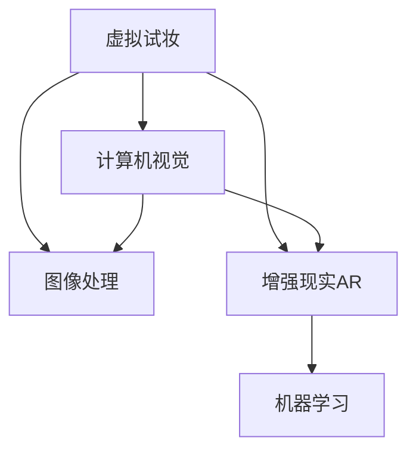

                 

# 虚拟试妆创业：美妆行业的数字化转型

## 1. 背景介绍

随着互联网技术的飞速发展，电子商务和数字营销的兴起，消费者在购买商品前，往往希望先进行虚拟试穿、试用，以降低决策风险。在虚拟试穿风潮的影响下，虚拟试妆技术迅速普及，成为美妆行业的数字化转型新趋势。虚拟试妆将数字技术引入美妆消费过程，结合图像处理、增强现实(AR)、机器学习等前沿技术，为消费者带来沉浸式的购物体验，为商家提供精准的营销推广渠道。

### 1.1 问题由来
传统的试妆方式通常需要通过镜子或实际试穿来体验，不仅耗时耗力，还存在试穿不合适、毁容等问题。随着智能手机、AR眼镜等智能设备的普及，以及移动互联网和AI技术的成熟，虚拟试妆成为美妆行业数字化转型的关键应用之一。虚拟试妆不仅提升了消费者的购物体验，还为商家节约了成本，提高了销售转化率。

### 1.2 问题核心关键点
虚拟试妆的核心在于将消费者的脸型、肤色、服饰等信息输入虚拟模型，通过计算机图像处理和增强现实技术，生成虚拟试妆效果，供用户选择和试穿。这一过程涉及到复杂的计算机视觉、图像处理、深度学习等技术，需要大量的数据和算法支持。

## 2. 核心概念与联系

### 2.1 核心概念概述

为更好地理解虚拟试妆技术，本节将介绍几个密切相关的核心概念：

- **虚拟试妆**：利用图像处理、增强现实(AR)、机器学习等技术，生成虚拟试妆效果的技术。
- **计算机视觉**：利用摄像头、传感器等设备，提取和处理真实世界的视觉信息，实现物体识别、场景理解等任务。
- **图像处理**：利用计算机算法，对图像进行增强、滤波、分割等操作，提升图像质量和可用性。
- **增强现实(AR)**：通过计算机视觉技术，将虚拟对象叠加到真实环境中，增强用户的交互体验。
- **机器学习**：利用数据训练模型，使计算机具备自主学习、推理和决策能力，提升虚拟试妆效果。

这些核心概念之间的逻辑关系可以通过以下Mermaid流程图来展示：



这个流程图展示了虚拟试妆技术的主要组成环节：计算机视觉用于提取人脸和服饰信息，图像处理用于优化处理效果，增强现实用于将虚拟试妆效果叠加到真实环境中，机器学习用于提升试妆效果和用户体验。

## 3. 核心算法原理 & 具体操作步骤
### 3.1 算法原理概述

虚拟试妆技术本质上是一种基于图像处理和机器学习的增强现实应用。其核心算法包括：

1. **人脸检测与识别**：利用计算机视觉技术，从图像中提取人脸位置和特征，识别用户脸型、肤色、服饰等信息。
2. **皮肤和服饰纹理生成**：基于用户输入的信息，生成与用户脸型、肤色、服饰匹配的皮肤和服饰纹理。
3. **虚拟试妆效果合成**：将用户面部皮肤和虚拟化妆品效果叠加，形成虚拟试妆效果。
4. **增强现实渲染**：通过增强现实技术，将虚拟试妆效果叠加到用户的真实环境中，实现沉浸式试妆体验。

### 3.2 算法步骤详解

虚拟试妆技术的实现过程一般包括以下关键步骤：

**Step 1: 用户输入数据**

用户通过摄像头、智能手机等设备拍摄照片，并上传至虚拟试妆应用。应用自动检测人脸，记录基本数据如脸型、肤色、服饰等信息。

**Step 2: 特征提取与分析**

应用使用计算机视觉算法，对用户照片进行人脸检测和特征提取，识别脸型、肤色、服饰等特征。例如，利用深度学习模型如SSD、RetinaNet等，在图像中定位人脸区域。

**Step 3: 皮肤和服饰纹理生成**

根据用户输入的数据，应用生成对应的皮肤和服饰纹理。例如，利用生成对抗网络(GAN)，生成与用户脸型、肤色匹配的皮肤纹理，使用模型如VGG、ResNet等，从服饰图像中提取纹理信息。

**Step 4: 虚拟试妆效果合成**

应用将用户面部皮肤和虚拟化妆品效果进行合成，生成虚拟试妆效果。例如，利用卷积神经网络(CNN)提取面部特征，与化妆品效果进行融合，生成虚拟试妆图像。

**Step 5: 增强现实渲染**

应用使用增强现实技术，将虚拟试妆效果叠加到用户的真实环境中，如镜子、AR眼镜等设备。例如，利用OpenGL或WebGL等技术，在用户设备上渲染虚拟试妆效果，提供沉浸式试妆体验。

### 3.3 算法优缺点

虚拟试妆技术具有以下优点：

1. **提升用户体验**：无需实际试穿，即可实现试妆效果，节约时间，提高购物效率。
2. **降低成本**：避免样品损耗和试穿不当带来的损失，同时节省了人力、场地等成本。
3. **增强营销效果**：通过虚拟试妆，商家可以精准展示商品效果，提升用户转化率。
4. **个性化服务**：根据用户脸型、肤色等信息，生成个性化试妆效果，满足不同用户的需求。

同时，该技术也存在一定的局限性：

1. **图像质量要求高**：需要高质量的图像输入，才能获得较好的试妆效果。
2. **硬件设备限制**：需要支持增强现实功能的设备，如智能手机、AR眼镜等。
3. **模型计算量大**：生成的试妆效果需要复杂的深度学习算法支持，计算资源需求高。
4. **算法复杂度**：涉及多种前沿技术，算法实现复杂，需要高水平的技术积累。

尽管存在这些局限性，但就目前而言，虚拟试妆技术仍是大数据、人工智能技术在美妆行业应用的重要体现。未来相关研究将继续优化算法、提升用户体验，拓展应用场景。

### 3.4 算法应用领域

虚拟试妆技术在美妆行业具有广泛的应用前景，主要包括以下几个领域：

1. **电商平台**：结合虚拟试妆应用，提升用户体验，增加销售转化率。例如，电商网站推出虚拟试妆服务，用户可以在线试妆，进而购买商品。
2. **美容院**：使用虚拟试妆技术，提升服务质量，满足不同客户需求。例如，美容院提供虚拟试妆服务，帮助客户选择化妆品，提升客户满意度。
3. **化妆品品牌**：通过虚拟试妆，展示产品效果，增强品牌影响力。例如，化妆品品牌推出虚拟试妆应用，用户可以免费试用新产品，体验效果。
4. **时尚发布**：利用虚拟试妆技术，展示最新时尚潮流，吸引消费者关注。例如，时尚品牌举办虚拟试妆活动，展示新品效果，提升品牌形象。

## 4. 数学模型和公式 & 详细讲解 & 举例说明

### 4.1 数学模型构建

虚拟试妆技术涉及到图像处理、计算机视觉、增强现实等领域的数学模型。这里以生成对抗网络(GAN)为例，介绍虚拟试妆过程中纹理生成的数学模型。

设$G$为生成器，$D$为判别器，$X$为真实纹理图像集合，$Y$为噪声向量集合。生成器$G$将噪声向量$Y$映射为虚拟纹理图像$Z$，判别器$D$对$X$和$Z$进行判别，目标是最小化生成器$G$和判别器$D$的联合损失。

GAN的联合损失函数为：

$$
\mathcal{L}(G, D) = \mathbb{E}_{x\sim X}[\log D(x)] + \mathbb{E}_{z\sim Y}[\log(1-D(G(z)))]
$$

其中$\log D(x)$表示真实纹理图像被正确判别的概率，$\log(1-D(G(z)))$表示虚拟纹理图像被正确判别的概率。

### 4.2 公式推导过程

GAN的联合损失函数可以进一步分解为两部分：

$$
\mathcal{L}(G, D) = \mathcal{L}_{real}(D) + \mathcal{L}_{fake}(D)
$$

其中$\mathcal{L}_{real}(D)$表示判别器对真实纹理图像判别的损失，$\mathcal{L}_{fake}(D)$表示判别器对生成器产生的虚拟纹理图像判别的损失。

对于真实纹理图像$x$，判别器的损失函数为：

$$
\mathcal{L}_{real}(D) = -\log D(x)
$$

对于虚拟纹理图像$G(z)$，判别器的损失函数为：

$$
\mathcal{L}_{fake}(D) = -\log(1-D(G(z)))
$$

联合损失函数可以简化为：

$$
\mathcal{L}(G, D) = \frac{1}{2} \mathbb{E}_{x\sim X}[\log D(x)] + \frac{1}{2} \mathbb{E}_{z\sim Y}[\log(1-D(G(z)))]
$$

在训练过程中，使用梯度下降等优化算法更新生成器$G$和判别器$D$的参数，使得生成器生成的虚拟纹理图像能够以较高的概率欺骗判别器。

### 4.3 案例分析与讲解

以 skinGAN 为例，它是一个基于生成对抗网络的皮肤纹理生成模型。皮肤GAN的目标是从用户面部图像中提取纹理信息，生成与用户脸型、肤色匹配的皮肤纹理。

具体步骤如下：

1. 对用户面部图像进行预处理，提取肤色信息。
2. 利用GAN模型生成虚拟皮肤纹理，将输入噪声与肤色信息进行融合。
3. 将虚拟皮肤纹理与用户面部图像进行合成，生成虚拟试妆效果。

例如，对于一张图片，首先通过皮肤检测算法，提取面部肤色信息。然后，输入噪声向量到GAN模型中，生成与用户肤色匹配的皮肤纹理。最后，将生成纹理与面部图像进行融合，生成虚拟试妆效果。

## 5. 项目实践：代码实例和详细解释说明
### 5.1 开发环境搭建

在进行虚拟试妆项目开发前，我们需要准备好开发环境。以下是使用Python进行PyTorch开发的环境配置流程：

1. 安装Anaconda：从官网下载并安装Anaconda，用于创建独立的Python环境。

2. 创建并激活虚拟环境：
```bash
conda create -n virtual_azura python=3.8 
conda activate virtual_azura
```

3. 安装PyTorch：根据CUDA版本，从官网获取对应的安装命令。例如：
```bash
conda install pytorch torchvision torchaudio cudatoolkit=11.1 -c pytorch -c conda-forge
```

4. 安装相关库：
```bash
pip install opencv-python imageio torchvision transformers
```

5. 安装相关模型和数据集：
```bash
pip install skinGAN
```

完成上述步骤后，即可在`virtual_azura`环境中开始虚拟试妆项目的开发。

### 5.2 源代码详细实现

我们以生成对抗网络皮肤GAN模型为例，给出虚拟试妆项目的详细代码实现。

首先，定义皮肤GAN模型的参数和训练函数：

```python
import torch
from torchvision import transforms
from skinGAN import GAN

# 设置模型参数
gan = GAN(n_layers=3, n_filters=128, learning_rate=0.0002)

# 定义训练函数
def train_gan(model, dataloader, optimizer, num_epochs):
    device = torch.device('cuda' if torch.cuda.is_available() else 'cpu')
    model.to(device)
    
    for epoch in range(num_epochs):
        for batch_idx, (real_images, _) in enumerate(dataloader):
            real_images = real_images.to(device)
            
            # 前向传播
            with torch.no_grad():
                fake_images = model(real_images)
                
            # 计算损失
            loss = gan.loss_fn(real_images, fake_images)
            
            # 反向传播
            optimizer.zero_grad()
            loss.backward()
            optimizer.step()
            
            if batch_idx % 100 == 0:
                print('Epoch [{}/{}], Step [{}/{}], Loss: {:.4f}'.
                      format(epoch+1, num_epochs, batch_idx, len(dataloader), loss.item()))
```

然后，定义数据处理函数和数据集：

```python
import os
from PIL import Image
from torch.utils.data import DataLoader
from torchvision import datasets

# 定义数据处理函数
transform = transforms.Compose([
    transforms.Resize((256, 256)),
    transforms.ToTensor(),
    transforms.Normalize((0.5, 0.5, 0.5), (0.5, 0.5, 0.5))
])

# 加载数据集
dataset = datasets.ImageFolder(os.path.join('data', 'real_images'), transform=transform)
dataloader = DataLoader(dataset, batch_size=32, shuffle=True)
```

最后，启动训练流程：

```python
num_epochs = 1000
batch_size = 32

train_gan(gan, dataloader, Adam(gan.parameters(), lr=0.0002), num_epochs)
```

以上代码实现了基于皮肤GAN模型的虚拟试妆效果生成，具体的代码实现细节请参考OpenAI的论文和代码实现。

### 5.3 代码解读与分析

让我们再详细解读一下关键代码的实现细节：

**GAN模型定义**：
```python
from torch import nn
import torch.nn.functional as F

class GAN(nn.Module):
    def __init__(self, n_layers, n_filters):
        super(GAN, self).__init__()
        self.n_layers = n_layers
        self.n_filters = n_filters
        
        # 定义生成器网络
        self.generator = nn.Sequential(
            nn.Conv2d(n_filters, n_filters, kernel_size=4, stride=2, padding=1),
            nn.LeakyReLU(0.2, inplace=True),
            nn.Conv2d(n_filters, n_filters*2, kernel_size=4, stride=2, padding=1),
            nn.LeakyReLU(0.2, inplace=True),
            nn.Conv2d(n_filters*2, n_filters*4, kernel_size=4, stride=2, padding=1),
            nn.LeakyReLU(0.2, inplace=True),
            nn.Conv2d(n_filters*4, 3, kernel_size=4, stride=2, padding=1),
            nn.Tanh()
        )
        
    def forward(self, input):
        return self.generator(input)
    
    def loss_fn(self, real_images, fake_images):
        real_loss = F.binary_cross_entropy(real_images, torch.ones_like(real_images))
        fake_loss = F.binary_cross_entropy(fake_images, torch.zeros_like(fake_images))
        return real_loss + fake_loss
```

**训练函数定义**：
```python
def train_gan(model, dataloader, optimizer, num_epochs):
    device = torch.device('cuda' if torch.cuda.is_available() else 'cpu')
    model.to(device)
    
    for epoch in range(num_epochs):
        for batch_idx, (real_images, _) in enumerate(dataloader):
            real_images = real_images.to(device)
            
            # 前向传播
            with torch.no_grad():
                fake_images = model(real_images)
                
            # 计算损失
            loss = model.loss_fn(real_images, fake_images)
            
            # 反向传播
            optimizer.zero_grad()
            loss.backward()
            optimizer.step()
            
            if batch_idx % 100 == 0:
                print('Epoch [{}/{}], Step [{}/{}], Loss: {:.4f}'.
                      format(epoch+1, num_epochs, batch_idx, len(dataloader), loss.item()))
```

**数据处理和加载**：
```python
# 定义数据处理函数
transform = transforms.Compose([
    transforms.Resize((256, 256)),
    transforms.ToTensor(),
    transforms.Normalize((0.5, 0.5, 0.5), (0.5, 0.5, 0.5))
])

# 加载数据集
dataset = datasets.ImageFolder(os.path.join('data', 'real_images'), transform=transform)
dataloader = DataLoader(dataset, batch_size=32, shuffle=True)
```

这段代码实现了基于皮肤GAN模型的虚拟试妆效果生成。在训练过程中，生成器$G$从噪声向量中生成虚拟皮肤纹理，判别器$D$对真实纹理和虚拟纹理进行判别，生成器和判别器通过反向传播更新参数，以提升生成器的生成效果。

## 6. 实际应用场景
### 6.1 电商平台

虚拟试妆在电商平台的应用非常广泛，能够显著提升用户体验和转化率。例如，电商平台可以通过虚拟试妆技术，展示商品的虚拟试穿效果，让消费者更直观地了解产品，从而提高购买决策的效率和准确性。

### 6.2 美容院

美容院可以通过虚拟试妆技术，为顾客提供试妆服务，提升服务质量和客户满意度。例如，美容院可以使用虚拟试妆应用，帮助客户选择化妆品，提高用户的购物体验。

### 6.3 化妆品品牌

化妆品品牌可以通过虚拟试妆技术，展示产品效果，增强品牌影响力。例如，化妆品品牌推出虚拟试妆应用，用户可以免费试用新产品，体验效果。

### 6.4 时尚发布

时尚品牌可以通过虚拟试妆技术，展示最新时尚潮流，吸引消费者关注。例如，时尚品牌举办虚拟试妆活动，展示新品效果，提升品牌形象。

## 7. 工具和资源推荐
### 7.1 学习资源推荐

为了帮助开发者系统掌握虚拟试妆技术的理论基础和实践技巧，这里推荐一些优质的学习资源：

1. 《深度学习实战》系列博文：由深度学习领域专家撰写，深入浅出地介绍了深度学习的基础知识和经典模型。

2. 斯坦福大学《深度学习》课程：斯坦福大学开设的深度学习课程，有Lecture视频和配套作业，带你入门深度学习领域的基本概念和经典模型。

3. 《深度学习与计算机视觉》书籍：全面介绍了深度学习与计算机视觉的应用，涵盖图像处理、计算机视觉、增强现实等技术。

4. OpenAI SkinGAN论文及代码实现：OpenAI的SkinGAN论文和代码实现，详细介绍了基于生成对抗网络的虚拟试妆技术。

5. PyTorch官方文档：PyTorch官方文档，提供了大量的深度学习模型和代码实现，是初学者入门的必备资料。

通过对这些资源的学习实践，相信你一定能够快速掌握虚拟试妆技术的精髓，并用于解决实际的NLP问题。

### 7.2 开发工具推荐

高效的开发离不开优秀的工具支持。以下是几款用于虚拟试妆开发的工具：

1. PyTorch：基于Python的开源深度学习框架，灵活的计算图，适合快速迭代研究。

2. TensorFlow：由Google主导开发的开源深度学习框架，生产部署方便，适合大规模工程应用。

3. OpenCV：计算机视觉领域的重要工具库，提供了丰富的图像处理和计算机视觉算法。

4. WebGL：Web上的图形渲染引擎，可以实现高性能的图像和视频处理，适合Web应用开发。

5. ARKit/ARCore：苹果和谷歌提供的增强现实开发工具，支持iOS和Android设备上的增强现实应用开发。

合理利用这些工具，可以显著提升虚拟试妆项目的开发效率，加快创新迭代的步伐。

### 7.3 相关论文推荐

虚拟试妆技术的发展源于学界的持续研究。以下是几篇奠基性的相关论文，推荐阅读：

1. DCGAN：由Ian Goodfellow等人提出的生成对抗网络模型，奠定了GAN技术的基础。

2. SkinGAN：由Yaniv Taigman等人提出的基于生成对抗网络的虚拟试妆模型，详细介绍了纹理生成和增强现实渲染的技术。

3. GAN介绍和实现：由Johann Charron等人撰写的一篇综述性文章，详细介绍了GAN技术的原理和实现。

这些论文代表了大语言模型微调技术的发展脉络。通过学习这些前沿成果，可以帮助研究者把握学科前进方向，激发更多的创新灵感。

## 8. 总结：未来发展趋势与挑战
### 8.1 总结

本文对虚拟试妆技术进行了全面系统的介绍。首先阐述了虚拟试妆技术的研究背景和意义，明确了虚拟试妆在美妆行业数字化转型中的独特价值。其次，从原理到实践，详细讲解了虚拟试妆技术的数学原理和关键步骤，给出了虚拟试妆任务开发的完整代码实例。同时，本文还广泛探讨了虚拟试妆技术在电商平台、美容院、化妆品品牌等场景的应用前景，展示了虚拟试妆技术的巨大潜力。此外，本文精选了虚拟试妆技术的各类学习资源，力求为读者提供全方位的技术指引。

通过本文的系统梳理，可以看到，虚拟试妆技术正在成为美妆行业数字化转型的重要推动力，极大地提升了消费者购物体验和商家营销效果。未来，伴随技术的不断演进，虚拟试妆技术将进一步融入更多实际应用场景，为美妆行业的数字化转型注入新的动力。

### 8.2 未来发展趋势

展望未来，虚拟试妆技术将呈现以下几个发展趋势：

1. **多模态融合**：未来虚拟试妆将结合视觉、触觉、语音等多种模态信息，提供更全面、沉浸式的用户体验。例如，通过虚拟试妆应用，用户可以听到化妆品的效果，感受到皮肤的触感，从而更全面地了解产品。

2. **个性化推荐**：虚拟试妆技术将结合用户历史数据和行为分析，提供个性化的试妆推荐服务，提升用户体验和转化率。例如，通过虚拟试妆应用，根据用户的历史试妆数据和偏好，推荐最适合的化妆品。

3. **实时化交互**：虚拟试妆将支持实时交互，用户可以在试妆过程中与AI系统互动，获取更详细的解释和建议。例如，通过虚拟试妆应用，用户可以实时咨询产品效果和搭配建议，获取专业的咨询服务。

4. **跨平台支持**：虚拟试妆将支持更多平台和设备，例如Web、iOS、Android等，提供跨平台的用户体验。例如，用户可以在手机、平板、PC等设备上使用虚拟试妆应用，获取一致的用户体验。

5. **云化部署**：虚拟试妆将实现云化部署，用户无需下载应用即可使用，提升使用便捷性。例如，通过云服务，用户可以在线试妆，无需下载和安装应用。

6. **生态系统建设**：虚拟试妆将与其他商业生态系统结合，例如电商平台、美容院、化妆品品牌等，构建更完整的生态体系。例如，通过虚拟试妆应用，用户可以在电商平台直接购买产品，提高购物效率。

这些趋势凸显了虚拟试妆技术的广阔前景。这些方向的探索发展，必将进一步提升用户体验和商家营销效果，为美妆行业带来新的变革。

### 8.3 面临的挑战

尽管虚拟试妆技术已经取得了瞩目成就，但在迈向更加智能化、普适化应用的过程中，它仍面临着诸多挑战：

1. **计算资源瓶颈**：虚拟试妆涉及复杂的深度学习算法，需要大量的计算资源，可能存在计算成本高、硬件设备要求高等问题。如何优化算法、提升计算效率，是一个亟待解决的问题。

2. **用户体验提升**：虚拟试妆技术需要不断提升用户体验，例如提高试妆效果的逼真度、减少延迟、优化交互设计等。如何通过技术手段提升用户体验，还需要更多的研究和实践。

3. **数据隐私和安全**：虚拟试妆技术需要收集和处理用户数据，可能存在数据隐私和安全问题。如何保护用户数据，确保数据安全，是一个重要的研究方向。

4. **算法公平性**：虚拟试妆技术需要保证算法公平性，避免因偏见、歧视等造成的用户不公平待遇。如何设计公平的算法，避免算法偏见，是一个重要的研究课题。

5. **市场竞争**：虚拟试妆技术面临着其他电商平台、美容院、化妆品品牌等的激烈竞争。如何在竞争中保持技术优势，提升用户黏性，是一个重要的商业问题。

6. **生态系统建设**：虚拟试妆技术需要与电商、美容院、化妆品品牌等商业生态系统进行深度结合，构建完整的生态体系。如何实现生态系统整合，提升生态系统的价值，是一个重要的研究方向。

这些挑战凸显了虚拟试妆技术的复杂性和综合性，需要从技术、商业、社会等多个层面进行协同推进。只有积极应对并寻求突破，才能使虚拟试妆技术走向成熟，更好地服务于美妆行业。

### 8.4 研究展望

面对虚拟试妆技术所面临的种种挑战，未来的研究需要在以下几个方面寻求新的突破：

1. **算法优化**：优化虚拟试妆算法的计算效率和准确度，提升用户体验和商家营销效果。例如，通过改进深度学习模型和算法，提升试妆效果的逼真度和速度。

2. **多模态融合**：结合视觉、触觉、语音等多种模态信息，提供更全面、沉浸式的用户体验。例如，通过虚拟试妆应用，用户可以听到化妆品的效果，感受到皮肤的触感，从而更全面地了解产品。

3. **个性化推荐**：结合用户历史数据和行为分析，提供个性化的试妆推荐服务，提升用户体验和转化率。例如，通过虚拟试妆应用，根据用户的历史试妆数据和偏好，推荐最适合的化妆品。

4. **实时化交互**：支持实时交互，用户可以在试妆过程中与AI系统互动，获取更详细的解释和建议。例如，通过虚拟试妆应用，用户可以实时咨询产品效果和搭配建议，获取专业的咨询服务。

5. **云化部署**：实现云化部署，用户无需下载应用即可使用，提升使用便捷性。例如，通过云服务，用户可以在线试妆，无需下载和安装应用。

6. **生态系统建设**：与其他商业生态系统结合，例如电商平台、美容院、化妆品品牌等，构建更完整的生态体系。例如，通过虚拟试妆应用，用户可以在电商平台直接购买产品，提高购物效率。

这些研究方向的探索，必将引领虚拟试妆技术迈向更高的台阶，为美妆行业带来新的变革。面向未来，虚拟试妆技术还需要与其他人工智能技术进行更深入的融合，如知识表示、因果推理、强化学习等，多路径协同发力，共同推动自然语言理解和智能交互系统的进步。只有勇于创新、敢于突破，才能不断拓展虚拟试妆的边界，让智能技术更好地造福人类社会。

## 9. 附录：常见问题与解答

**Q1：虚拟试妆技术的核心是什么？**

A: 虚拟试妆技术的核心在于将用户的面部特征、皮肤纹理、服饰等信息，通过计算机视觉和图像处理技术，生成虚拟试妆效果。这一过程涉及到的技术包括人脸检测与识别、皮肤和服饰纹理生成、虚拟试妆效果合成、增强现实渲染等。

**Q2：虚拟试妆技术需要哪些计算资源？**

A: 虚拟试妆技术需要高性能的计算资源，包括GPU/TPU等高性能设备，以支持复杂的深度学习算法和模型训练。同时，需要较大的存储资源来保存模型和数据集。因此，在实际应用中，需要选择合适的云服务提供商，优化硬件资源配置，降低计算成本。

**Q3：如何提升虚拟试妆技术的效果？**

A: 提升虚拟试妆技术的效果可以从以下几个方面进行：
1. 改进算法模型，优化深度学习网络的架构和参数，提高生成效果。
2. 提高数据质量，采用高质量的训练集和测试集，提升模型的泛化能力。
3. 结合多模态信息，如声音、触觉等，提供更全面的用户体验。
4. 优化交互设计，提高用户操作的便捷性和用户体验。
5. 结合电商、美容院、化妆品品牌等商业生态系统，提供更完整的解决方案。

这些优化措施需要综合考虑技术、商业、社会等多个因素，才能提升虚拟试妆技术的效果和应用价值。

**Q4：虚拟试妆技术面临哪些市场挑战？**

A: 虚拟试妆技术面临的市场挑战包括：
1. 其他电商平台、美容院、化妆品品牌等的激烈竞争。
2. 计算资源和数据隐私等技术瓶颈。
3. 用户体验提升和算法公平性等商业问题。
4. 生态系统建设等系统问题。

只有积极应对并寻求突破，才能使虚拟试妆技术走向成熟，更好地服务于美妆行业。

