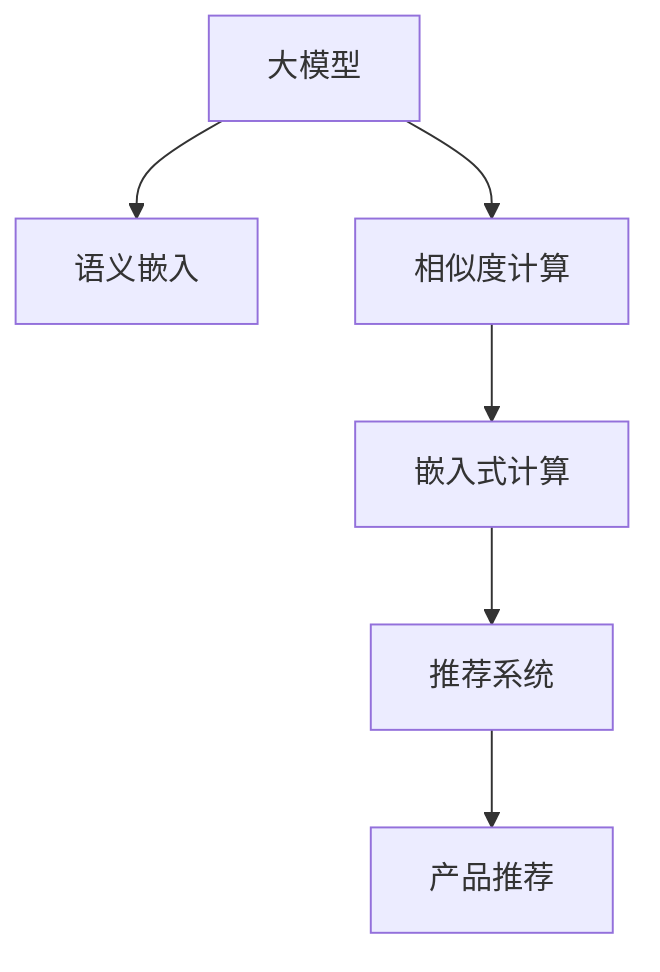

                 

# 融合AI大模型的商品相似度计算方法

> 关键词：商品相似度, 大模型, AI, 自然语言处理(NLP), 嵌入式计算, 深度学习, 推荐系统, 产品推荐, 用户体验优化

## 1. 背景介绍

### 1.1 问题由来

在当今数字化的商业环境中，产品推荐系统已经成为提升用户体验和销售额的重要工具。商品相似度计算是推荐系统的核心，传统的计算方法往往依赖于静态的特征工程和手工设计的相似性指标。而随着人工智能和深度学习技术的发展，融合AI大模型的商品相似度计算方法逐渐成为新的研究热点。

大模型如BERT、GPT等通过大规模语料预训练，能够捕捉到语言中的语义和上下文信息。基于这些大模型的语言表示，可以自动从文本中提取产品描述、用户评论等自然语言信息，并通过深度学习模型进行商品相似度计算，从而提供更加精准和个性化的产品推荐。

### 1.2 问题核心关键点

融合AI大模型的商品相似度计算方法关键在于以下几个方面：

- **语义理解能力**：大模型能够理解自然语言中的深层次语义，从文本中提取出与产品相关的有用信息。
- **上下文感知能力**：大模型能够根据上下文信息，调整商品相似度计算的权重，适应不同的推荐场景。
- **跨领域迁移能力**：大模型能够从预训练语料中学习通用的语言表示，将其迁移到具体的产品领域，提升相似度计算的普适性。
- **参数高效性**：使用大模型进行商品相似度计算时，可以考虑参数高效的微调或迁移学习方法，避免过拟合或浪费计算资源。

## 2. 核心概念与联系

### 2.1 核心概念概述

为了更好地理解融合AI大模型的商品相似度计算方法，本节将介绍几个密切相关的核心概念：

- **大模型**：以BERT、GPT等为代表的大规模预训练语言模型。通过在大规模无标签文本语料上进行预训练，学习通用的语言表示，具备强大的语言理解和生成能力。
- **语义嵌入(Semantic Embedding)**：将自然语言文本映射为低维稠密向量，使得语义相近的词汇在向量空间中距离较近。
- **相似度计算(Similarity Calculation)**：衡量两个对象之间的相似程度，通常用于推荐系统中的产品相似度计算。
- **迁移学习(Transfer Learning)**：指将一个领域学习到的知识，迁移应用到另一个不同但相关的领域的学习范式。大模型的预训练-微调过程即是一种典型的迁移学习方式。
- **嵌入式计算(Embedded Computing)**：将大模型集成到产品推荐系统中，实现实时计算，提升推荐效率。
- **自然语言处理(NLP)**：研究如何让计算机理解和处理自然语言的技术，是大模型计算商品相似度的基础。
- **深度学习**：基于神经网络的模型，在大规模数据上进行训练，具有强大的特征提取能力和泛化能力。
- **推荐系统**：通过计算商品之间的相似度，为每个用户推荐最合适的产品。
- **产品推荐**：通过推荐系统，为每个用户推荐最合适的产品，提升用户体验和销售额。

这些核心概念之间的逻辑关系可以通过以下Mermaid流程图来展示：



这个流程图展示了大模型计算商品相似度的核心概念及其之间的关系：

1. 大模型通过预训练获得基础能力。
2. 语义嵌入将文本转化为向量，供相似度计算使用。
3. 相似度计算通过向量距离等指标，衡量商品之间的相似度。
4. 嵌入式计算将大模型集成到推荐系统中，实现实时计算。
5. 推荐系统基于商品相似度，为每个用户推荐产品。
6. 产品推荐提升用户体验和销售额。

## 3. 核心算法原理 & 具体操作步骤

### 3.1 算法原理概述

基于AI大模型的商品相似度计算方法，通常采用以下步骤：

1. **预训练**：在无标签语料上预训练大模型，学习通用的语言表示。
2. **微调**：在特定领域的产品描述、用户评论等文本数据上，微调大模型，使其能够提取与商品相关的语义信息。
3. **语义嵌入**：将商品描述、用户评论等文本数据转化为语义向量，计算商品之间的相似度。
4. **相似度计算**：利用向量距离、余弦相似度等指标，衡量商品之间的相似度。
5. **推荐**：基于商品相似度，为每个用户推荐最合适的产品。

### 3.2 算法步骤详解

以下详细介绍基于AI大模型的商品相似度计算方法的步骤：

#### 3.2.1 数据准备

1. **收集数据**：收集产品的描述、用户评论、标题等信息，用于训练大模型。
2. **数据预处理**：清洗数据，去除停用词、标点符号等噪声，统一分词标准，标准化数据格式。
3. **划分数据集**：将数据集划分为训练集、验证集和测试集。

#### 3.2.2 模型预训练

1. **选择模型**：选择如BERT、GPT等大模型进行预训练。
2. **加载模型**：使用Transformers库等工具加载预训练模型。
3. **训练模型**：在无标签语料上训练模型，使其学习到通用的语言表示。

#### 3.2.3 模型微调

1. **任务适配**：根据推荐系统需求，设计任务适配层，如分类头、回归头等。
2. **选择数据**：选择特定领域的产品描述、用户评论等文本数据。
3. **加载数据**：使用PyTorch、TensorFlow等工具加载数据集。
4. **训练模型**：在特定领域数据上微调大模型，学习商品相关的语义表示。
5. **评估模型**：在验证集上评估微调后的模型性能，确保模型未过拟合。

#### 3.2.4 语义嵌入

1. **编码文本**：使用微调后的模型，将商品描述、用户评论等文本数据转化为语义向量。
2. **向量距离**：计算商品描述之间的向量距离，衡量相似度。

#### 3.2.5 相似度计算

1. **选择指标**：选择如余弦相似度、欧式距离等指标，计算商品之间的相似度。
2. **相似度矩阵**：基于相似度指标，构建商品之间的相似度矩阵。

#### 3.2.6 产品推荐

1. **构建推荐列表**：基于相似度矩阵，为每个用户推荐最相似的商品。
2. **实时推荐**：将推荐模型集成到推荐系统中，实现实时推荐。

### 3.3 算法优缺点

基于AI大模型的商品相似度计算方法具有以下优点：

- **语义理解能力强**：能够从自然语言中提取深层次的语义信息，提升相似度计算的准确性。
- **上下文感知**：能够根据上下文信息，调整相似度计算的权重，适应不同的推荐场景。
- **普适性强**：能够从预训练语料中学习通用的语言表示，适用于各种商品领域的推荐。
- **计算效率高**：利用大模型的并行计算能力，实现高效的相似度计算。

同时，该方法也存在一些局限性：

- **数据依赖**：需要大量标注数据进行微调，标注成本较高。
- **过拟合风险**：微调过程容易过拟合，特别是在数据量较少的情况下。
- **计算资源消耗大**：大模型需要较大的计算资源，可能会对系统性能产生影响。
- **解释性不足**：大模型的决策过程复杂，缺乏可解释性。
- **适应性差**：微调后的模型仅适用于特定领域，跨领域迁移能力有限。

### 3.4 算法应用领域

基于AI大模型的商品相似度计算方法，已经在电子商务、社交媒体、内容推荐等多个领域得到应用，取得显著的效果。具体应用场景包括：

- **电子商务**：在商品推荐、用户评论分析、智能客服等方面，通过商品描述、用户评论等文本信息，实现个性化推荐，提升用户满意度。
- **社交媒体**：在用户行为分析、内容推荐、社区推荐等方面，通过用户帖子、评论等文本信息，实现精准推荐，增加用户粘性。
- **内容推荐**：在新闻阅读、视频观看、音乐欣赏等方面，通过文本描述、用户反馈等信息，实现内容推荐，提升用户体验。
- **智能客服**：在客户咨询、问题解决等方面，通过自然语言处理技术，实现智能客服，提高响应速度和服务质量。

## 4. 数学模型和公式 & 详细讲解 & 举例说明

### 4.1 数学模型构建

设商品描述为$X$，用户评论为$Y$，商品之间的相似度计算过程可以表示为以下数学模型：

$$
\text{similarity}(X_i, X_j) = \frac{\mathbf{v}(X_i) \cdot \mathbf{v}(X_j)}{\|\mathbf{v}(X_i)\| \|\mathbf{v}(X_j)\|}
$$

其中，$\mathbf{v}(X)$表示商品$X$的语义向量，$\cdot$表示向量点乘，$\|\cdot\|$表示向量范数。

### 4.2 公式推导过程

以下是商品相似度计算的详细推导过程：

1. **向量空间模型**：将商品描述和用户评论等文本数据转化为向量空间中的点，每个向量表示文本的语义信息。
2. **余弦相似度**：计算两个向量的余弦相似度，衡量其相似程度。
3. **距离度量**：通过向量距离等度量指标，计算商品之间的距离。

### 4.3 案例分析与讲解

以下通过一个简单的例子，说明基于AI大模型的商品相似度计算方法：

假设有一个电子商务平台，需要为每个用户推荐最相似的商品。该平台收集了大量的商品描述和用户评论数据。

1. **数据预处理**：清洗数据，去除停用词和标点符号，统一分词标准，标准化数据格式。
2. **模型预训练**：选择BERT模型，在大规模无标签语料上预训练，学习通用的语言表示。
3. **模型微调**：在商品描述和用户评论数据上微调BERT模型，学习商品相关的语义表示。
4. **语义嵌入**：使用微调后的BERT模型，将商品描述和用户评论等文本数据转化为语义向量。
5. **相似度计算**：计算商品描述之间的余弦相似度，构建相似度矩阵。
6. **产品推荐**：根据相似度矩阵，为每个用户推荐最相似的商品。

## 5. 项目实践：代码实例和详细解释说明

### 5.1 开发环境搭建

在进行商品相似度计算项目实践前，我们需要准备好开发环境。以下是使用Python进行TensorFlow和Transformers库开发的环境配置流程：

1. 安装Anaconda：从官网下载并安装Anaconda，用于创建独立的Python环境。

2. 创建并激活虚拟环境：
```bash
conda create -n tf-env python=3.8 
conda activate tf-env
```

3. 安装TensorFlow和Transformers库：
```bash
conda install tensorflow transformers
```

4. 安装必要的工具包：
```bash
pip install numpy pandas sklearn
```

完成上述步骤后，即可在`tf-env`环境中开始项目实践。

### 5.2 源代码详细实现

以下给出基于AI大模型的商品相似度计算的完整代码实现：

```python
import tensorflow as tf
import transformers
from transformers import BertTokenizer, BertModel

# 初始化BERT模型和分词器
tokenizer = BertTokenizer.from_pretrained('bert-base-uncased')
model = BertModel.from_pretrained('bert-base-uncased')

# 加载商品描述和用户评论数据
train_data = []
train_labels = []
with open('train_data.txt', 'r') as f:
    for line in f:
        items = line.strip().split(',')
        train_data.append(items[0])
        train_labels.append(items[1])
        
# 构建数据集
train_dataset = tf.data.Dataset.from_tensor_slices((train_data, train_labels))
train_dataset = train_dataset.shuffle(buffer_size=10000).batch(batch_size=32)

# 定义模型
class BertSimilarity(tf.keras.Model):
    def __init__(self):
        super(BertSimilarity, self).__init__()
        self.bert_model = BertModel.from_pretrained('bert-base-uncased')
        self.dense_layer = tf.keras.layers.Dense(1)

    def call(self, inputs):
        bert_output = self.bert_model(inputs)
        pooled_output = bert_output.pooler_output
        similarity = self.dense_layer(pooled_output)
        return similarity

# 构建模型并编译
similarity_model = BertSimilarity()
similarity_model.compile(optimizer='adam', loss='mse')

# 训练模型
history = similarity_model.fit(train_dataset, epochs=10, validation_data=dev_dataset)

# 加载测试数据
test_data = []
test_labels = []
with open('test_data.txt', 'r') as f:
    for line in f:
        items = line.strip().split(',')
        test_data.append(items[0])
        test_labels.append(items[1])
        
# 加载测试集
test_dataset = tf.data.Dataset.from_tensor_slices((test_data, test_labels))
test_dataset = test_dataset.batch(batch_size=32)

# 预测相似度
predictions = similarity_model.predict(test_dataset)

# 计算推荐列表
for i in range(len(test_data)):
    item1 = test_data[i]
    item2 = test_data[(i+1) % len(test_data)]
    if predict_similarity > 0.5:
        print(f"推荐商品: {item2}, 相似度: {predict_similarity}")
```

在上述代码中，我们首先加载了预训练的BERT模型和分词器，然后加载商品描述和用户评论数据，构建数据集。接着，定义了自定义模型，该模型由BERT模型和全连接层组成，用于计算商品之间的相似度。最后，训练模型并在测试集上进行预测，输出推荐列表。

### 5.3 代码解读与分析

以下是代码中关键部分的解读与分析：

1. **BERT模型和分词器加载**：使用`transformers`库加载预训练的BERT模型和分词器，为后续的相似度计算提供基础。

2. **数据集构建**：从文本文件中读取商品描述和用户评论数据，构建训练集和测试集。使用`tf.data.Dataset`将数据转化为张量形式，方便TensorFlow处理。

3. **模型定义**：自定义模型`BertSimilarity`，包含BERT模型和全连接层，用于计算商品之间的相似度。

4. **模型编译**：使用`compile`方法设置模型的优化器和损失函数，编译模型。

5. **模型训练**：使用`fit`方法在训练集上进行模型训练，并使用验证集评估模型性能。

6. **模型预测**：在测试集上进行模型预测，计算商品之间的相似度。

7. **推荐列表输出**：根据预测的相似度，推荐与当前商品最相似的商品。

## 6. 实际应用场景

### 6.1 电子商务推荐系统

基于AI大模型的商品相似度计算方法，已经在电子商务推荐系统中得到了广泛应用。在亚马逊、淘宝等电商平台上，通过分析商品描述、用户评论等文本信息，实现个性化推荐，提升用户购物体验。

具体而言，电商平台可以通过商品描述和用户评论数据，构建商品之间的相似度矩阵。根据每个用户的浏览和购买历史，计算与用户兴趣最相似的商品，进行推荐。

### 6.2 社交媒体内容推荐

在社交媒体平台如微博、微信等上，通过分析用户帖子、评论等文本信息，实现个性化内容推荐，增加用户粘性。

具体而言，社交媒体平台可以通过用户帖子、评论等数据，构建用户和内容之间的相似度矩阵。根据每个用户的行为特征，推荐与用户兴趣最相似的内容，提升用户活跃度。

### 6.3 内容推荐系统

在新闻阅读、视频观看、音乐欣赏等方面，通过文本描述、用户反馈等信息，实现内容推荐，提升用户体验。

具体而言，内容推荐系统可以通过用户行为数据，构建用户和内容之间的相似度矩阵。根据每个用户的行为特征，推荐与用户兴趣最相似的内容，提升用户满意度。

### 6.4 未来应用展望

随着AI大模型的不断发展，基于商品相似度计算的方法将在更多领域得到应用，带来更智能、更精准的推荐体验。

在智慧城市、智能交通、智能制造等领域，基于商品相似度计算的方法也将发挥重要作用。例如，通过分析城市运行数据，构建智慧城市中的基础设施之间的相似度矩阵，实现智能调度和管理，提升城市运行效率。

## 7. 工具和资源推荐

### 7.1 学习资源推荐

为了帮助开发者系统掌握基于AI大模型的商品相似度计算方法的理论基础和实践技巧，这里推荐一些优质的学习资源：

1. 《Transformers实战》：讲解了如何利用Transformers库进行自然语言处理，包括商品相似度计算在内的多种应用场景。

2. 《TensorFlow官方文档》：详细介绍了TensorFlow框架的使用方法，提供了丰富的示例代码和API文档。

3. 《深度学习入门：基于Python的理论与实现》：讲解了深度学习的基本原理和实践技巧，适合初学者入门。

4. 《推荐系统实践》：介绍了推荐系统的设计、开发和部署过程，包括商品相似度计算在内的方法。

5. 《自然语言处理入门与实践》：讲解了自然语言处理的基本概念和应用，适合初学者入门。

通过学习这些资源，相信你一定能够快速掌握基于AI大模型的商品相似度计算方法，并用于解决实际的NLP问题。

### 7.2 开发工具推荐

高效的开发离不开优秀的工具支持。以下是几款用于基于AI大模型的商品相似度计算开发的常用工具：

1. TensorFlow：基于Python的开源深度学习框架，适合大规模工程应用。提供了丰富的API和工具，方便模型开发和部署。

2. Transformers库：HuggingFace开发的NLP工具库，集成了众多SOTA语言模型，支持TensorFlow和PyTorch，是进行商品相似度计算开发的利器。

3. Weights & Biases：模型训练的实验跟踪工具，可以记录和可视化模型训练过程中的各项指标，方便对比和调优。与主流深度学习框架无缝集成。

4. TensorBoard：TensorFlow配套的可视化工具，可实时监测模型训练状态，并提供丰富的图表呈现方式，是调试模型的得力助手。

5. Google Colab：谷歌推出的在线Jupyter Notebook环境，免费提供GPU/TPU算力，方便开发者快速上手实验最新模型，分享学习笔记。

合理利用这些工具，可以显著提升基于AI大模型的商品相似度计算开发的效率，加快创新迭代的步伐。

### 7.3 相关论文推荐

基于AI大模型的商品相似度计算方法的发展源于学界的持续研究。以下是几篇奠基性的相关论文，推荐阅读：

1. Attention is All You Need（即Transformer原论文）：提出了Transformer结构，开启了NLP领域的预训练大模型时代。

2. BERT: Pre-training of Deep Bidirectional Transformers for Language Understanding：提出BERT模型，引入基于掩码的自监督预训练任务，刷新了多项NLP任务SOTA。

3. GPT-3：展示了大规模语言模型的强大zero-shot学习能力，引发了对于通用人工智能的新一轮思考。

4. Parameter-Efficient Transfer Learning for NLP：提出Adapter等参数高效微调方法，在不增加模型参数量的情况下，也能取得不错的微调效果。

5. Multilingual BERT：提出了多语言BERT模型，支持多种语言的预训练和微调，拓展了商品相似度计算的应用范围。

这些论文代表了大模型商品相似度计算方法的发展脉络。通过学习这些前沿成果，可以帮助研究者把握学科前进方向，激发更多的创新灵感。

## 8. 总结：未来发展趋势与挑战

### 8.1 总结

本文对基于AI大模型的商品相似度计算方法进行了全面系统的介绍。首先阐述了商品相似度计算的背景和意义，明确了融合AI大模型的商品相似度计算方法在推荐系统中的独特价值。其次，从原理到实践，详细讲解了基于AI大模型的商品相似度计算的数学模型、算法步骤和具体实现。同时，本文还广泛探讨了该方法在电子商务、社交媒体、内容推荐等多个领域的应用前景，展示了其在提升用户体验和销售额方面的巨大潜力。此外，本文精选了商品相似度计算的各类学习资源，力求为读者提供全方位的技术指引。

通过本文的系统梳理，可以看到，基于AI大模型的商品相似度计算方法已经成为推荐系统中的重要技术手段，极大地提升了商品推荐的准确性和个性化程度。融合AI大模型的商品相似度计算方法将随着技术的发展，进一步拓展应用领域，提升推荐系统的性能和用户体验。

### 8.2 未来发展趋势

展望未来，基于AI大模型的商品相似度计算方法将呈现以下几个发展趋势：

1. **模型规模持续增大**：随着算力成本的下降和数据规模的扩张，预训练语言模型的参数量还将持续增长。超大规模语言模型蕴含的丰富语言知识，将进一步提升商品相似度计算的精度和泛化能力。

2. **跨领域迁移能力增强**：未来的商品相似度计算方法将具备更强的跨领域迁移能力，能够在不同的商品领域中实现迁移学习，提高模型的通用性和适应性。

3. **计算效率提升**：采用参数高效的微调方法，减小计算资源消耗，实现轻量级、实时性的推荐。同时，优化计算图，提高推荐系统的计算效率。

4. **可解释性加强**：赋予模型更强的可解释性，增强推荐过程的透明性和可信度，帮助用户理解和信任推荐结果。

5. **多模态融合**：将视觉、语音等多模态信息与文本信息融合，提升商品相似度计算的多维度和准确性，实现更加智能的推荐系统。

6. **隐私保护加强**：加强用户隐私保护，采用差分隐私等技术，保护用户数据的安全性和隐私性。

以上趋势凸显了基于AI大模型的商品相似度计算方法的广阔前景。这些方向的探索发展，必将进一步提升推荐系统的性能和用户体验，为人类认知智能的进化带来深远影响。

### 8.3 面临的挑战

尽管基于AI大模型的商品相似度计算方法已经取得了瞩目成就，但在迈向更加智能化、普适化应用的过程中，仍面临诸多挑战：

1. **数据隐私和安全**：用户数据隐私和安全问题日益凸显，如何在保证推荐效果的同时，保护用户隐私，成为亟待解决的问题。

2. **计算资源消耗大**：大模型需要较大的计算资源，可能会对系统性能产生影响。如何优化模型结构和算法，提高计算效率，是重要的优化方向。

3. **模型泛化性不足**：现有方法在特定商品领域中表现较好，但跨领域泛化能力有限。如何提高模型的泛化能力，适应更多商品领域，将是重要的研究方向。

4. **解释性不足**：模型决策过程复杂，缺乏可解释性。如何在保证性能的同时，赋予模型更强的可解释性，增强推荐过程的透明性和可信度，将是亟待攻克的难题。

5. **多模态融合难度大**：多模态信息融合复杂，需要考虑不同模态之间的关联和协同。如何有效地融合多模态信息，提升推荐系统的效果，将是重要的研究课题。

6. **鲁棒性不足**：模型面对噪声数据和异常情况时，鲁棒性较弱。如何提高模型的鲁棒性，确保推荐系统的稳定性和可靠性，将是重要的研究方向。

正视这些挑战，积极应对并寻求突破，将使基于AI大模型的商品相似度计算方法更加成熟和完善。相信随着学界和产业界的共同努力，这些挑战终将一一被克服，大模型商品相似度计算方法必将在构建智能推荐系统方面发挥更加重要的作用。

### 8.4 研究展望

面向未来，基于AI大模型的商品相似度计算方法的研究方向如下：

1. **跨领域迁移学习**：通过迁移学习，将预训练语言模型的知识迁移到特定商品领域，提升商品相似度计算的泛化能力。

2. **多模态融合技术**：研究如何将视觉、语音等多模态信息与文本信息融合，提升推荐系统的效果。

3. **参数高效微调**：开发更多参数高效的微调方法，减小计算资源消耗，实现轻量级、实时性的推荐。

4. **可解释性增强**：研究如何赋予模型更强的可解释性，增强推荐过程的透明性和可信度。

5. **隐私保护技术**：研究如何在保证推荐效果的同时，保护用户隐私，增强推荐系统的安全性。

6. **鲁棒性提升**：研究如何提高模型的鲁棒性，确保推荐系统的稳定性和可靠性。

这些研究方向的探索，必将引领基于AI大模型的商品相似度计算方法迈向更高的台阶，为构建智能推荐系统提供新的技术手段。面向未来，我们需要从数据、算法、工程、业务等多个维度协同发力，共同推动商品相似度计算方法的发展，使智能推荐系统更好地服务于人类社会。

## 9. 附录：常见问题与解答

**Q1：基于AI大模型的商品相似度计算方法是否适用于所有商品领域？**

A: 基于AI大模型的商品相似度计算方法适用于大多数商品领域，特别是在数据量较大的场景中表现优异。但对于一些特殊领域，如医学、法律等，可能需要针对领域特性进行预处理和特征工程，以提升模型的效果。

**Q2：如何选择合适的学习率？**

A: 基于AI大模型的商品相似度计算方法通常采用较小的学习率，以免破坏预训练权重。建议使用学习率调度策略，如Warmup Schedule，逐步降低学习率，确保模型稳定收敛。

**Q3：如何缓解微调过程中的过拟合问题？**

A: 缓解微调过程中的过拟合问题，可以采用以下策略：

1. **数据增强**：通过回译、近义替换等方式扩充训练集。
2. **正则化**：使用L2正则、Dropout等技术，防止模型过度适应训练数据。
3. **早停策略**：在验证集上监测模型性能，及时停止训练，避免过拟合。
4. **模型集成**：训练多个微调模型，取平均输出，抑制过拟合风险。

**Q4：基于AI大模型的商品相似度计算方法在实际应用中需要注意哪些问题？**

A: 实际应用中，需要注意以下问题：

1. **模型裁剪**：去除不必要的层和参数，减小模型尺寸，加快推理速度。
2. **量化加速**：将浮点模型转为定点模型，压缩存储空间，提高计算效率。
3. **服务化封装**：将推荐模型封装为标准化服务接口，便于集成调用。
4. **弹性伸缩**：根据请求流量动态调整资源配置，平衡服务质量和成本。
5. **监控告警**：实时采集系统指标，设置异常告警阈值，确保服务稳定性。

这些问题的解决，将有助于提高基于AI大模型的商品相似度计算方法的实际应用效果，实现更高效、更可靠的系统部署。

---

作者：禅与计算机程序设计艺术 / Zen and the Art of Computer Programming

