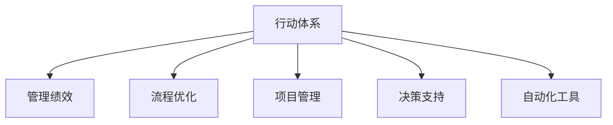

                 

# 行动体系与管理绩效的关联

> 关键词：行动体系,管理绩效,流程优化,项目管理,决策支持,自动化工具

## 1. 背景介绍

### 1.1 问题由来

在当前高度竞争的市场环境中，企业面临着前所未有的挑战和机遇。如何提高管理绩效，提升企业运营效率，成为每个企业管理者亟待解决的难题。传统的管理方法往往依靠经验和人治，缺乏系统化、科学化的指导。而行动体系作为一种现代化的管理工具，近年来在各类企业管理中逐渐崭露头角。

行动体系（Action Framework）是一种集目标设定、流程规划、资源配置、绩效评估于一体的综合管理系统，旨在通过规范化、标准化的管理手段，提升企业整体的运作效率和竞争力。行动体系的核心思想是将企业的各项业务活动拆解为一系列行动，通过明确行动主体、任务、责任、时间、资源等要素，确保各项任务的按期完成。

行动体系的管理理念源于项目管理（Project Management）和业务流程重组（Business Process Reengineering, BPR）。它在项目管理的基础上，进一步扩展到企业的各项业务流程中，帮助企业实现对各个环节的全面监控和优化。近年来，随着信息技术的发展，行动体系也开始借助大数据、云计算、人工智能等先进技术手段，进一步提升其应用效果。

### 1.2 问题核心关键点

行动体系的核心在于通过结构化的管理方法，提升企业的管理绩效。其主要关注点包括：

- **目标设定**：明确企业各阶段的发展目标和重点任务，形成清晰的行动计划。
- **流程规划**：优化企业的业务流程，提升流程的效率和自动化水平。
- **资源配置**：合理配置企业资源，确保各项任务的顺利执行。
- **绩效评估**：建立科学的绩效评估体系，及时发现问题和改进措施。

## 2. 核心概念与联系

### 2.1 核心概念概述

为更好地理解行动体系与管理绩效的关联，本节将介绍几个密切相关的核心概念：

- **行动体系**：一种以目标设定、流程规划、资源配置、绩效评估为核心的系统化管理工具。
- **管理绩效**：指企业在运营过程中，各项业务活动达到预期目标的程度，包括效率、质量、成本等方面的表现。
- **流程优化**：通过分析、改进、重组等方式，提升企业业务流程的效率和质量。
- **项目管理**：聚焦于特定项目或任务的管理，注重时间、成本、质量等关键指标的控制。
- **决策支持**：借助数据和模型，辅助管理者进行科学的决策。
- **自动化工具**：利用软件和算法，实现业务流程的自动化，提升效率和准确性。

这些概念之间的逻辑关系可以通过以下Mermaid流程图来展示：



这个流程图展示了他的核心概念及其之间的关系：

1. 行动体系通过目标设定、流程规划、资源配置、绩效评估等环节，提升企业的管理绩效。
2. 流程优化是行动体系的重要组成部分，通过优化业务流程，提升效率和质量。
3. 项目管理聚焦于特定的项目或任务，是行动体系在特定场景中的应用。
4. 决策支持是行动体系的重要辅助手段，通过数据和模型支持科学决策。
5. 自动化工具是行动体系的实施基础，通过软件和算法实现业务流程的自动化。

## 3. 核心算法原理 & 具体操作步骤
### 3.1 算法原理概述

行动体系的核心算法原理可以概括为“目标-流程-资源-绩效”模型。即通过明确目标，规划流程，配置资源，评估绩效等步骤，形成闭环管理，最终提升管理绩效。

具体而言，行动体系的算法原理如下：

1. **目标设定**：通过SMART原则（Specific, Measurable, Achievable, Relevant, Time-bound）设定具体的行动目标。
2. **流程规划**：将目标拆解为一系列可执行的行动步骤，形成任务流程。
3. **资源配置**：根据任务的复杂度和优先级，分配相应的资源（人力、财力、物力等）。
4. **绩效评估**：建立科学的评估体系，实时监控和反馈行动执行情况。

### 3.2 算法步骤详解

行动体系的管理流程可以分解为以下几个关键步骤：

**Step 1: 目标设定**
- 确定企业的中长期发展目标和年度目标，设定具体的行动计划。
- 将目标细化分解为可执行的行动任务，明确任务的起止时间、责任人和资源需求。

**Step 2: 流程规划**
- 对各项行动任务进行梳理和分析，形成完整的任务流程图。
- 优化流程中的瓶颈和冗余环节，提升整体效率。
- 引入自动化工具，实现流程的标准化操作。

**Step 3: 资源配置**
- 根据任务优先级和复杂度，合理分配各类资源，确保资源的有效利用。
- 使用项目管理和调度工具，实时跟踪资源的分配和使用情况。
- 引入风险管理机制，及时应对可能出现的问题和风险。

**Step 4: 绩效评估**
- 建立绩效评估指标体系，实时监控各项任务的执行情况。
- 定期召开绩效评估会议，分析问题，提出改进措施。
- 将评估结果反馈至目标设定和流程规划环节，形成持续改进的循环。

### 3.3 算法优缺点

行动体系的管理算法具有以下优点：

- **系统化管理**：通过目标设定、流程规划、资源配置、绩效评估等环节，形成闭环管理，提升管理系统的科学性和系统性。
- **提升效率**：通过优化流程和引入自动化工具，大大提升业务流程的效率。
- **实时监控**：实时监控和反馈任务执行情况，及时发现和解决问题，提升管理绩效。

但同时，行动体系的管理算法也存在一些局限性：

- **实施复杂**：需要较高的管理水平和资源投入，实施难度较大。
- **灵活性不足**：流程的优化和调整需要较长的周期，灵活性相对较低。
- **数据依赖**：对数据的完整性和准确性要求较高，数据质量直接影响管理效果。

### 3.4 算法应用领域

行动体系作为一种现代化的管理工具，已经广泛应用于各类企业，特别是在项目管理、流程优化、决策支持等领域。

1. **项目管理**：用于对特定项目的全生命周期进行管理，确保项目按期、按质、按预算完成。
2. **流程优化**：通过分析和改进企业内部流程，提升整体效率和质量。
3. **决策支持**：利用数据和模型辅助高层管理者进行科学决策，提升决策的准确性和效率。
4. **供应链管理**：用于优化供应链流程，提升供应链的协调性和效率。
5. **人力资源管理**：用于优化人力资源配置，提升人力资源的利用效率。
6. **质量管理**：用于建立和优化企业的质量管理体系，提升产品和服务质量。

## 4. 数学模型和公式 & 详细讲解 & 举例说明

### 4.1 数学模型构建

行动体系的管理效果可以通过一系列的指标来量化，包括成本、时间、质量、客户满意度等。以下我们以成本和时间这两个关键指标为例，构建数学模型：

假设企业有n个任务，每个任务的时间为ti，成本为ci。设任务的总时间为T，总成本为C。定义任务i的权重为wi，则模型的目标为最小化总时间和总成本，即：

$$
\min_{\{w_i\}} (w_i \cdot t_i + \sum_{i=1}^{n} c_i)
$$

同时，目标还需要满足任务之间的约束条件：

$$
\sum_{i=1}^{n} w_i = 1
$$

约束条件表示所有任务的权重之和必须为1。

### 4.2 公式推导过程

根据上述模型，我们可以使用线性规划（Linear Programming）方法求解最优的任务权重分配。线性规划的求解方法通常包括单纯形法、内点法等，这里简要介绍单纯形法的基本思路：

1. 将问题转化为标准形式：
$$
\min \sum_{i=1}^{n} c_i
$$
$$
\text{subject to} \sum_{i=1}^{n} a_{ij}x_i + b_j \leq c_j, j = 1, 2, \cdots, m
$$
$$
x_i \geq 0
$$

2. 构造初始单纯形表，并从可行域的一个顶点出发，逐步迭代求解。

3. 在每一步迭代中，通过变换主元，求解最优基变量和目标函数值。

4. 重复迭代，直到所有变量都变为基变量，或者目标函数值收敛。

### 4.3 案例分析与讲解

假设某企业的生产线有4个任务（A、B、C、D），每个任务的时间成本如表1所示：

| 任务 | 时间 | 成本 |
|------|------|------|
| A    | 10   | 200  |
| B    | 15   | 300  |
| C    | 20   | 400  |
| D    | 5    | 100  |

要求在满足约束条件的情况下，最小化总时间和总成本。

首先，定义每个任务的时间成本向量：
$$
t = \begin{bmatrix} 10 \\ 15 \\ 20 \\ 5 \end{bmatrix}, c = \begin{bmatrix} 200 \\ 300 \\ 400 \\ 100 \end{bmatrix}
$$

然后，构造线性规划模型：
$$
\min \sum_{i=1}^{4} (t_i + c_i) x_i
$$
$$
\text{subject to} \sum_{i=1}^{4} a_{ij}x_i + b_j = c_j, j = 1, 2, \cdots, 4
$$
$$
x_i \geq 0
$$

其中，约束条件中的矩阵A和向量b可以根据任务之间的依赖关系确定。例如，任务A和任务C必须按顺序执行，则A和C之间的依赖关系可以表示为：
$$
A = \begin{bmatrix} 1 & 0 & 0 & 0 \\ 0 & 0 & 1 & 0 \\ 0 & 0 & 0 & 0 \\ 0 & 1 & 1 & 0 \end{bmatrix}, b = \begin{bmatrix} 10 \\ 15 \\ 20 \\ 5 \end{bmatrix}
$$

求解上述线性规划模型，得到最优的任务权重分配和最小化总时间和总成本。

## 5. 项目实践：代码实例和详细解释说明

### 5.1 开发环境搭建

在进行行动体系实践前，我们需要准备好开发环境。以下是使用Python进行线性规划的开发环境配置流程：

1. 安装Anaconda：从官网下载并安装Anaconda，用于创建独立的Python环境。

2. 创建并激活虚拟环境：
```bash
conda create -n linprog-env python=3.8 
conda activate linprog-env
```

3. 安装相关库：
```bash
conda install linprog linprog-solver 
```

完成上述步骤后，即可在`linprog-env`环境中开始行动体系的项目实践。

### 5.2 源代码详细实现

下面我们以生产线优化为例，给出使用SciPy库进行线性规划的PyTorch代码实现。

首先，定义生产线任务的时间成本矩阵A和向量b：

```python
import numpy as np
from scipy.optimize import linprog

A = np.array([[1, 0, 0, 0], [0, 0, 1, 0], [0, 0, 0, 0], [0, 1, 1, 0]])
b = np.array([10, 15, 20, 5])
c = np.array([200, 300, 400, 100])
```

然后，进行线性规划求解：

```python
x0 = np.zeros(4)
res = linprog(c, A_ub=A, b_ub=b, bounds=(0, None), method='highs', options={'disp': True})
print(res)
```

最后，输出最优解和总时间和总成本：

```python
xopt = res.x
t_min = np.dot(A, xopt) + b
c_min = np.dot(c, xopt)
print('最小时间：{}分钟'.format(t_min))
print('最小成本：{}元'.format(c_min))
```

### 5.3 代码解读与分析

让我们再详细解读一下关键代码的实现细节：

**线性规划模型定义**：
- 使用NumPy库定义时间成本矩阵A和向量b，以及目标向量c。
- 利用SciPy库中的linprog函数，指定目标函数、约束条件、变量范围等参数，求解线性规划问题。
- 输出求解结果，包括最优变量值和最小化总时间和总成本。

**结果解读**：
- 线性规划求解器返回的最优变量值，即各任务的最优执行权重。
- 根据最优变量值，计算出最小总时间和最小总成本。
- 结合实际业务场景，对最优解进行解释和应用。

## 6. 实际应用场景

### 6.1 智能制造

行动体系在智能制造领域的应用场景非常广泛。传统的制造流程中，由于工艺复杂、流程冗长，生产效率低下，且容易出现质量问题。引入行动体系，可以大大提升智能制造的效率和质量。

具体而言，可以构建智能制造的行动体系，将制造流程拆解为一系列行动步骤，形成标准化的制造规范。通过优化制造流程，引入自动化设备和智能检测工具，实现制造过程的自动化和智能化。同时，建立绩效评估体系，实时监控生产过程，及时发现和解决问题，提升生产效率和产品质量。

### 6.2 金融风险管理

金融行业面临的市场风险和操作风险极高。传统的风险管理依赖于人工分析和经验判断，容易出现误判和遗漏。引入行动体系，可以实现风险管理的系统化和规范化。

具体而言，可以构建金融风险管理的行动体系，将风险管理的各个环节拆解为具体的行动步骤。通过优化流程，引入大数据和人工智能技术，实现风险的自动化分析和评估。同时，建立绩效评估体系，实时监控和反馈风险管理的效果，提升风险管理的准确性和及时性。

### 6.3 医疗健康管理

医疗健康管理涉及到大量的流程和环节，包括诊疗、病历管理、药品管理等。传统的医疗健康管理依赖于人工处理，容易出现差错和延误。引入行动体系，可以实现医疗健康管理的系统化和规范化。

具体而言，可以构建医疗健康管理的行动体系，将各项医疗流程拆解为具体的行动步骤。通过优化流程，引入电子病历系统和自动化检测设备，实现医疗过程的自动化和智能化。同时，建立绩效评估体系，实时监控医疗过程，提升医疗质量和效率。

## 7. 工具和资源推荐

### 7.1 学习资源推荐

为了帮助开发者系统掌握行动体系的管理理念和实践技巧，这里推荐一些优质的学习资源：

1. 《行动体系与管理绩效》系列博文：由行动体系技术专家撰写，深入浅出地介绍了行动体系的原理、实施步骤和常见问题。

2. 《项目管理与行动体系》课程：清华大学开设的行动体系课程，系统讲解行动体系的基本概念和应用方法。

3. 《线性规划与行动体系》书籍：线性规划是行动体系的核心算法之一，该书详细介绍了线性规划的基本原理和应用实例。

4. 行动体系官方文档：行动体系的官方文档，提供了完整的行动体系模型和代码实现，是初学者入门的必备资料。

5. 项目管理工具推荐：如Trello、JIRA等项目管理工具，辅助企业构建行动体系。

通过对这些资源的学习实践，相信你一定能够快速掌握行动体系的管理理念和实践技巧，并用于解决实际的业务问题。

### 7.2 开发工具推荐

高效的开发离不开优秀的工具支持。以下是几款用于行动体系开发和管理的常用工具：

1. Trello：一款基于看板的项目管理工具，适合构建行动体系的任务流程图。
2. JIRA：一款功能强大的项目管理工具，支持复杂的任务管理和绩效评估。
3. Scrapy：一款Python爬虫框架，用于从网络上抓取数据，进行行动体系的数据采集和分析。
4. Excel：一款常用的电子表格软件，适合进行行动体系的数据分析和绩效评估。
5. Python编程语言：提供丰富的库和框架，支持行动体系的数据处理和算法实现。

合理利用这些工具，可以显著提升行动体系的管理效率，加快创新迭代的步伐。

### 7.3 相关论文推荐

行动体系的管理理念源于项目管理（Project Management）和业务流程重组（BPR），近年来结合大数据和人工智能技术，进一步拓展了应用范围。以下是几篇奠基性的相关论文，推荐阅读：

1. "A Framework for Action Management" by Michael Porter
2. "The High Output Management" by Irving L. Copeland
3. "Business Process Reengineering" by Michael Hammer and James Champy
4. "The Lean Management" by James P. Womack and Daniel T. Jones
5. "The Theory of Constraints" by Eliyahu M. Goldratt

这些论文代表了大规模管理方法的发展脉络。通过学习这些前沿成果，可以帮助研究者把握学科前进方向，激发更多的创新灵感。

## 8. 总结：未来发展趋势与挑战

### 8.1 总结

本文对行动体系与管理绩效的关联进行了全面系统的介绍。首先阐述了行动体系的核心思想和应用场景，明确了行动体系在提升企业管理绩效方面的独特价值。其次，从原理到实践，详细讲解了行动体系的数学模型和操作步骤，给出了行动体系项目实践的完整代码实现。同时，本文还探讨了行动体系在智能制造、金融风险管理、医疗健康管理等多个领域的应用前景，展示了行动体系范式的巨大潜力。此外，本文精选了行动体系学习的各类资源，力求为读者提供全方位的技术指引。

通过本文的系统梳理，可以看到，行动体系作为一种现代化的管理工具，正在成为企业管理的重要手段，极大地提升了企业的运营效率和竞争力。未来，伴随行动体系与大数据、人工智能等技术的深度融合，其应用场景将更加广泛，为企业管理带来更多创新和突破。

### 8.2 未来发展趋势

展望未来，行动体系的管理范式将呈现以下几个发展趋势：

1. **数字化转型**：结合大数据和人工智能技术，实现行动体系的系统化和智能化。通过数据分析和模型优化，提升行动体系的决策能力和执行效率。
2. **跨界融合**：行动体系的应用将突破传统行业的边界，跨界融合到更多领域，如医疗、制造、金融等，提升不同行业管理的标准化和规范化水平。
3. **持续改进**：引入持续改进（Continuous Improvement）理念，定期进行行动体系的评估和优化，保持系统的高效和灵活性。
4. **协同管理**：引入协同管理（Collaborative Management）理念，实现跨部门、跨团队的协同合作，提升整体管理绩效。
5. **智能化管理**：结合物联网（IoT）、智能设备和传感器技术，实现行动体系的实时监控和反馈，提升管理的智能化水平。
6. **国际化应用**：行动体系的实施将突破地域和行业的限制，在全球范围内推广应用，提升全球管理水平。

以上趋势凸显了行动体系管理范式的广阔前景。这些方向的探索发展，必将进一步提升企业管理系统的科学性和系统性，为构建高绩效的企业奠定坚实基础。

### 8.3 面临的挑战

尽管行动体系的管理范式已经取得了一定的成效，但在实施过程中仍然面临一些挑战：

1. **组织变革难度大**：引入行动体系需要对现有管理模式进行全面的变革，涉及到员工的思想观念、工作习惯等方面的调整，难度较大。
2. **数据质量要求高**：行动体系依赖于完整、准确的数据，数据质量直接影响系统的准确性和有效性。
3. **技术门槛较高**：行动体系的应用需要一定的技术支撑，如项目管理工具、数据分析工具等，技术门槛较高。
4. **执行难度大**：行动体系的实施需要高层管理者的支持和推动，执行难度较大。
5. **成本较高**：引入行动体系需要较高的成本投入，包括工具购买、系统实施、培训等方面。

解决这些问题，需要企业在管理层面进行全面规划，引入先进的工具和方法，并通过持续的培训和改进，逐步提升行动体系的应用效果。

### 8.4 研究展望

未来，行动体系的研究需要进一步深入以下几个方向：

1. **多学科融合**：将行动体系与组织行为学、社会学、经济学等多学科结合，提升系统的全面性和科学性。
2. **技术创新**：结合大数据、人工智能等先进技术，提升行动体系的系统化和智能化水平。
3. **国际标准**：制定行动体系的相关国际标准，推动行动体系在全球范围内的推广应用。
4. **持续优化**：通过定期评估和反馈，不断优化行动体系的系统架构和执行方法。
5. **教育培训**：开展行动体系的培训和教育，提升管理者的操作能力和应用水平。

这些方向的研究和发展，必将引领行动体系管理范式迈向更高的层次，为企业管理带来更多的创新和突破。

## 9. 附录：常见问题与解答

**Q1：行动体系是否适用于所有企业？**

A: 行动体系适用于各种类型的企业，特别是需要系统化、规范化管理的中大型企业。对于小型企业或初创企业，可以先从项目管理等特定环节入手，逐步推广应用。

**Q2：如何选择合适的行动体系实施步骤？**

A: 企业应根据自身的业务特点和管理需求，选择合适的行动体系实施步骤。通常包括以下几个步骤：

1. 制定行动计划，明确目标和重点任务。
2. 梳理现有业务流程，识别优化点和瓶颈。
3. 引入自动化工具，实现流程的标准化和自动化。
4. 建立绩效评估体系，实时监控和反馈执行情况。
5. 定期进行评估和优化，保持系统的持续改进。

**Q3：行动体系如何实现跨部门协同？**

A: 行动体系通过任务分配、责任界定、绩效评估等环节，实现跨部门的协同管理。具体而言，可以：

1. 构建统一的项目管理平台，实时跟踪各部门的执行情况。
2. 引入协同工具和机制，促进跨部门的沟通和协作。
3. 制定协同管理规则，明确各部门的职责和协作方式。
4. 定期召开协同管理会议，总结经验，提出改进措施。

**Q4：行动体系实施过程中需要注意哪些问题？**

A: 行动体系的实施过程中，需要注意以下几个问题：

1. 高层管理者的支持：行动体系的实施需要高层管理者的支持和推动，否则难以落实。
2. 数据的质量和完整性：数据是行动体系的核心，需要确保数据的准确性和完整性。
3. 员工的培训和接受度：员工的培训和接受度直接影响行动体系的效果，需要提供充分的支持和引导。
4. 成本和效益的平衡：行动体系的实施需要一定的成本投入，需要权衡成本和效益，确保投资回报。

**Q5：行动体系如何应对市场变化？**

A: 行动体系通过建立科学的绩效评估体系和持续改进机制，可以应对市场变化。具体而言，可以：

1. 定期进行市场调研，及时调整行动计划。
2. 引入敏捷管理方法，快速响应市场变化。
3. 建立跨部门协同机制，快速调整业务流程。
4. 引入持续改进理念，持续优化行动体系。

---

作者：禅与计算机程序设计艺术 / Zen and the Art of Computer Programming

