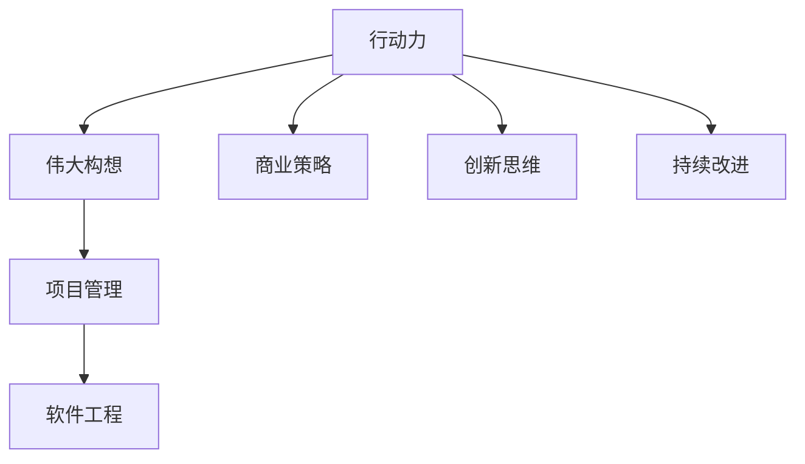

                 

# 行动力:将伟大构想化为现实

> 关键词：行动力,伟大构想,商业策略,软件工程,项目管理,产品开发,创新思维

## 1. 背景介绍

### 1.1 问题由来
在当今信息爆炸、技术创新的时代，无数的创新点子和大胆设想涌现，但最终能够真正落地并产生商业价值的却屈指可数。这是为什么呢？一个核心的因素在于“行动力”的缺乏。即便是拥有卓越构想的团队，如果无法将构想转化为现实的行动，再好的想法也终将化为泡影。因此，如何培养和提升行动力，将想法化为现实，成为了商业和个人发展的关键。

### 1.2 问题核心关键点
行动力指的是将思想、计划或策略转化为具体行动的能力。在软件工程、项目管理、产品开发等领域，行动力是实现商业目标和用户价值的决定性因素。一个具备高行动力度的团队能够高效地执行项目计划、快速响应市场变化、迅速解决技术难题，从而赢得竞争优势。

要提升行动力，关键在于以下几个方面：明确目标、制定计划、优化流程、强化执行、注重结果反馈和持续改进。

## 2. 核心概念与联系

### 2.1 核心概念概述

为更好地理解如何将行动力转化为现实，本节将介绍几个密切相关的核心概念：

- **行动力**：指将思想、计划或策略转化为具体行动的能力。是实现创新构想和商业目标的基础。
- **伟大构想**：具有高度创新性和前瞻性的创意和设想。是行动力发挥的起点和目标。
- **项目管理**：涉及项目规划、执行、监控和收尾的过程管理方法。
- **软件工程**：专注于构建高质量软件系统的实践和理论。
- **商业策略**：为实现商业目标而制定的计划和策略。
- **创新思维**：指打破常规，运用新颖方法解决问题和创造价值的能力。
- **持续改进**：通过不断的反馈和优化，持续提升产品和服务质量的过程。

这些核心概念之间的逻辑关系可以通过以下Mermaid流程图来展示：



这个流程图展示了你提到的核心概念之间的关联：

1. 行动力将伟大构想转化为具体行动。
2. 项目管理提供执行构想的框架和工具。
3. 软件工程是实现构想的技术保障。
4. 商业策略指导行动力向正确方向发力。
5. 创新思维为行动力注入新的动力和方向。
6. 持续改进确保行动不断优化，保持前进动力。

## 3. 核心算法原理 & 具体操作步骤
### 3.1 算法原理概述

提升行动力的方法论，可以抽象为一个多步骤的系统工程。其核心原理包括目标设定、资源分配、执行监控、反馈优化等。

形式化地，设目标为 $T$，资源为 $R$，执行过程中获取的反馈为 $F$，优化策略为 $O$。行动力提升的过程可以表示为：

$$
\text{Action}(T, R, F, O) = \text{Optimized}(T, R, F, O)
$$

其中，$\text{Action}$ 表示行动力实施的具体操作，$\text{Optimized}$ 表示对目标和资源的优化调整。

### 3.2 算法步骤详解

基于上述原理，提升行动力可以按照以下步骤进行：

**Step 1: 设定明确的目标**
- 确定项目或构想的核心目标。确保目标具有明确性、可衡量性、可达成性和相关性。
- 将大目标拆分为一系列小目标，便于执行和监控。

**Step 2: 评估可用资源**
- 识别和评估项目所需的各类资源，包括人力、物力、财力、技术等。
- 合理分配资源，确保关键任务得到优先支持。

**Step 3: 制定详细计划**
- 根据目标和资源，制定详细的时间表和行动计划。
- 考虑潜在风险和不确定性，预留缓冲时间。

**Step 4: 执行和监控**
- 按照计划逐步推进项目，确保每个环节按时完成。
- 实时监控项目进展，及时调整策略和资源分配。

**Step 5: 获取反馈和优化**
- 定期收集项目进展和成果，评估是否达到预期目标。
- 根据反馈信息，调整策略和行动，持续优化行动力。

### 3.3 算法优缺点

提升行动力的方法论具有以下优点：
1. 系统性：通过明确目标、评估资源、制定计划、执行监控、反馈优化等系统性步骤，提升行动力的整个过程更加有序和高效。
2. 可操作性：每个步骤都有具体的实施方法和工具，使得提升行动力的操作更加可执行。
3. 灵活性：可以根据项目的具体情况灵活调整步骤和方法，适应不同的环境和需求。

同时，该方法也存在一定的局限性：
1. 复杂度：对于复杂的项目，行动力提升涉及多个维度的协调，可能需要较长的学习和实践过程。
2. 依赖管理：若资源管理和任务分配不当，可能导致资源浪费和项目延期。
3. 反馈机制的建立和维护需要时间和精力。

尽管存在这些局限性，但整体上，提升行动力的方法论为项目和构想的实现提供了一个结构化、科学化的路径。

### 3.4 算法应用领域

提升行动力的方法论在多个领域都有广泛的应用：

- **项目管理**：如敏捷开发、Scrum等敏捷项目管理方法，就是基于行动力提升的原理，通过迭代周期和每日站会，确保团队高效协作，快速响应变化。
- **软件工程**：通过持续集成和持续部署(CI/CD)等工具，确保代码的快速交付和质量保证，提升软件开发的行动力度。
- **产品开发**：通过用户需求分析、市场调研和数据驱动决策，确保产品迭代方向符合市场需求，加速产品上市。
- **商业策略**：通过市场分析和竞争对手分析，制定科学有效的商业策略，提升企业竞争力。
- **创新思维**：如设计思维、头脑风暴等方法，通过创意激发和问题导向，提升创新思维的行动力。
- **组织管理**：通过领导力培训、团队建设等措施，提升组织成员的行动力度，确保战略和目标的顺利实现。

## 4. 数学模型和公式 & 详细讲解  
### 4.1 数学模型构建

为了更精确地表达行动力提升的过程，本节将使用数学语言对关键步骤进行形式化描述。

设目标函数为 $T$，资源向量为 $R$，行动计划为 $A$，反馈信息为 $F$，优化策略为 $O$。则提升行动力的方法论可以表示为：

$$
\min_{O, A} \max_{R} \frac{F(A, R, O)}{T(A, R, O)}
$$

其中，$\min_{O, A}$ 表示在优化策略和行动计划下，最大化反馈 $F$ 与目标 $T$ 的比值。

### 4.2 公式推导过程

以一个简单的项目管理系统为例，推导行动力提升的数学模型：

1. **目标设定**：项目目标是完成某个软件功能的开发，确保质量合格，时间节点符合预期。
2. **资源评估**：评估项目所需的人力资源、技术资源、时间资源和成本资源。
3. **计划制定**：根据目标和资源，制定详细的项目计划，包括任务分解、时间表和资源分配。
4. **执行监控**：在项目执行过程中，实时监控任务进度，及时调整资源和计划。
5. **反馈优化**：根据项目进展和成果，调整策略和资源，持续优化项目执行效率。

通过上述步骤，行动力提升的数学模型可以表示为：

$$
\text{Action}(T, R, F, O) = \text{Optimized}(T, R, F, O)
$$

其中，$T$ 为项目目标，$R$ 为可用资源，$F$ 为项目进展反馈，$O$ 为优化策略。

### 4.3 案例分析与讲解

以一个软件开发项目为例，展示行动力提升的实施过程：

1. **目标设定**：完成一个用户需求分析模块的开发，预计需求变更较少，项目周期为4周。
2. **资源评估**：需要3名软件开发工程师，2名UI/UX设计师，1名测试工程师，总预算为10000元。
3. **计划制定**：将项目拆分为需求分析、设计、编码、测试和部署五个阶段，每个阶段设定具体的任务和资源需求，制定详细的时间表。
4. **执行监控**：每周召开一次项目进展会，评估任务完成情况和资源使用情况，调整计划和资源。
5. **反馈优化**：根据每个阶段的任务完成情况和客户反馈，优化设计方案和代码实现，确保最终产品符合客户需求。

通过上述步骤，项目团队成功在规定时间内完成了软件开发任务，实现了良好的客户满意度。

## 5. 项目实践：代码实例和详细解释说明
### 5.1 开发环境搭建

在进行行动力提升的方法论实践前，我们需要准备好开发环境。以下是使用Python进行项目管理的方法论实践环境配置流程：

1. 安装Anaconda：从官网下载并安装Anaconda，用于创建独立的Python环境。

2. 创建并激活虚拟环境：
```bash
conda create -n project-env python=3.8 
conda activate project-env
```

3. 安装PyTorch：根据CUDA版本，从官网获取对应的安装命令。例如：
```bash
conda install pytorch torchvision torchaudio cudatoolkit=11.1 -c pytorch -c conda-forge
```

4. 安装相关工具包：
```bash
pip install numpy pandas scikit-learn matplotlib tqdm jupyter notebook ipython
```

完成上述步骤后，即可在`project-env`环境中开始行动力提升的方法论实践。

### 5.2 源代码详细实现

下面我们以一个简单的项目管理实践为例，给出使用Python实现行动力提升的具体代码。

首先，定义项目目标和可用资源：

```python
class Project:
    def __init__(self, target, resources):
        self.target = target
        self.resources = resources
        self.plan = None
        self.feedback = None
        self.status = None
```

然后，定义计划和执行监控函数：

```python
class Project:
    def __init__(self, target, resources):
        self.target = target
        self.resources = resources
        self.plan = None
        self.feedback = None
        self.status = None

    def create_plan(self, plan):
        self.plan = plan

    def execute_plan(self, plan):
        self.status = plan.execute()

    def get_feedback(self, feedback):
        self.feedback = feedback

    def optimize_plan(self, feedback):
        self.plan = self.plan.optimize(feedback)
```

接着，定义计划和反馈的抽象类：

```python
class Plan:
    def __init__(self, target, resources):
        self.target = target
        self.resources = resources
        self.status = None

    def execute(self):
        raise NotImplementedError

class Feedback:
    def __init__(self, plan, status):
        self.plan = plan
        self.status = status

    def optimize(self):
        raise NotImplementedError
```

最后，定义具体的项目计划和反馈实现：

```python
class AgilePlan(Plan):
    def __init__(self, target, resources):
        super().__init__(target, resources)
        self.tasks = []

    def execute(self):
        for task in self.tasks:
            task.execute()
        return self.status

class IterationPlan(AgilePlan):
    def __init__(self, target, resources):
        super().__init__(target, resources)
        self.iterations = []

    def execute(self):
        for iteration in self.iterations:
            iteration.execute()
        return self.status

class FeedbackIteration(Feedback):
    def __init__(self, plan, status):
        super().__init__(plan, status)

    def optimize(self):
        # 根据反馈信息优化计划
        return self.plan.optimize(self.status)
```

完成上述代码后，即可在`project-env`环境中运行行动力提升的方法论实践。

### 5.3 代码解读与分析

让我们再详细解读一下关键代码的实现细节：

**Project类**：
- `__init__`方法：初始化项目目标、可用资源、计划、反馈和状态。
- `create_plan`方法：创建和设置项目计划。
- `execute_plan`方法：执行项目计划。
- `get_feedback`方法：获取项目反馈。
- `optimize_plan`方法：根据反馈信息优化计划。

**Plan类**：
- `__init__`方法：初始化计划目标、资源和状态。
- `execute`方法：执行计划，由子类具体实现。
- `optimize`方法：根据反馈信息优化计划，由子类具体实现。

**AgilePlan类**：
- `__init__`方法：初始化敏捷计划的目标、资源和任务列表。
- `execute`方法：遍历任务列表，执行每个任务。

**IterationPlan类**：
- `__init__`方法：初始化迭代计划的敏捷计划、迭代列表。
- `execute`方法：遍历迭代列表，执行每个迭代。

**FeedbackIteration类**：
- `__init__`方法：初始化反馈迭代计划、状态。
- `optimize`方法：根据反馈信息优化迭代计划。

这些代码展示了行动力提升的方法论在项目管理中的应用，通过定义计划和反馈的抽象类，实现了对具体项目计划的灵活调整和优化。

### 5.4 运行结果展示

通过上述代码实现，可以对项目进行动态管理和优化，确保项目按时、按质完成。例如，使用AgilePlan类创建一个敏捷计划：

```python
project = Project(target="完成需求分析模块", resources={"人": 3, "时间": 4})
plan = AgilePlan(target=project.target, resources=project.resources)
project.create_plan(plan)
```

然后，执行计划并获取反馈：

```python
plan = IterationPlan(target=project.target, resources=project.resources)
project.create_plan(plan)
project.execute_plan(plan)
project.get_feedback(FeedbackIteration(plan, project.status))
```

最后，根据反馈信息优化计划：

```python
plan = plan.optimize(project.feedback)
project.create_plan(plan)
project.execute_plan(plan)
project.get_feedback(FeedbackIteration(plan, project.status))
```

通过反复执行上述步骤，可以逐步优化项目计划，确保项目目标的顺利实现。

## 6. 实际应用场景
### 6.1 智能产品开发

在智能产品开发过程中，快速响应市场需求和客户反馈，是提升产品竞争力的关键。使用行动力提升的方法论，可以确保开发团队高效协作，及时调整方向，迅速迭代产品。

例如，在软件开发中，通过敏捷开发和DevOps工具，实现频繁的小版本发布和迭代，可以迅速响应用户需求变化，提升产品质量和用户体验。

### 6.2 电子商务平台

电子商务平台需要实时处理海量订单和用户反馈，行动力提升的方法论可以帮助平台快速处理问题，提升用户体验和服务质量。

例如，通过建立客户反馈系统和自动化处理流程，快速响应客户投诉和问题，确保订单按时完成和问题及时解决，提高平台的用户满意度和忠诚度。

### 6.3 金融科技

金融科技领域要求高可靠性和实时响应，行动力提升的方法论可以确保系统稳定运行和快速故障处理。

例如，通过自动化监控和故障诊断工具，实时监控系统状态，快速定位和解决故障，确保交易系统的稳定性和可靠性。

### 6.4 未来应用展望

随着技术的不断进步，行动力提升的方法论将不断扩展应用场景，推动各行各业的发展。

在智慧城市、智能制造、智能家居等领域，行动力提升的方法论将助力实现高效协同和智能化管理，提升城市治理水平和生产效率。

在医疗健康、教育培训、文化娱乐等领域，行动力提升的方法论将支持各类服务的创新和优化，提高服务质量和用户满意度。

未来，行动力提升的方法论将与AI、大数据、区块链等前沿技术相结合，为各行各业提供更智能、更高效、更灵活的解决方案。

## 7. 工具和资源推荐
### 7.1 学习资源推荐

为了帮助开发者系统掌握行动力提升的方法论，这里推荐一些优质的学习资源：

1. 《敏捷项目管理》系列书籍：介绍敏捷开发方法论，帮助开发团队快速响应变化，提升行动力度。
2. 《Scrum敏捷管理》课程：提供Scrum敏捷开发管理的深入讲解，帮助团队高效协同，快速迭代。
3. 《DevOps实践指南》书籍：介绍DevOps自动化部署和持续集成方法，提升软件开发的行动力度。
4. 《软件工程原理》课程：涵盖软件工程的全生命周期管理，提升项目管理效率和质量。
5. 《设计思维》课程：通过创意激发和问题导向，提升创新思维的行动力。
6. 《领导力培训》课程：帮助领导者提升团队管理能力，增强团队行动力。

通过对这些资源的学习实践，相信你一定能够快速掌握行动力提升的精髓，并用于解决实际的业务问题。

### 7.2 开发工具推荐

高效的开发离不开优秀的工具支持。以下是几款用于行动力提升开发的常用工具：

1. Jira：一款强大的项目管理工具，支持敏捷开发和Scrum方法论，帮助团队高效协作。
2. Confluence：协作文档管理工具，支持团队共享文档和知识，促进知识共享和持续改进。
3. GitHub：代码托管平台，支持版本控制和协作开发，促进团队代码共享和版本管理。
4. Jenkins：自动化持续集成和持续部署工具，支持DevOps自动化流程，提升软件开发的行动力度。
5. Docker：容器化部署工具，支持快速构建和部署应用，提升系统部署的灵活性和可靠性。
6. Kubernetes：容器编排工具，支持多节点部署和管理，提升系统的可伸缩性和稳定性。

合理利用这些工具，可以显著提升行动力提升的开发效率，加快创新迭代的步伐。

### 7.3 相关论文推荐

行动力提升的方法论涉及多学科的交叉应用，以下是几篇奠基性的相关论文，推荐阅读：

1. "Agile Project Management" by PMI：介绍敏捷开发方法论的全面指南。
2. "Scrum: The Art of Doing Twice the Work in Half the Time" by Ken Schwaber：介绍Scrum敏捷开发管理的实践和经验。
3. "Continuous Delivery: Reliable Software Releases through Build, Test, and Deployment Automation" by Jez Humble和David Farley：介绍持续集成和持续部署的实践和工具。
4. "Design Thinking: Integrating Innovation, Customer Experience & Brand Value" by Thomas Lockwood：介绍设计思维的核心方法和实践。
5. "Leadership and the Management of Organizational Learning" by Edward E. Lawler III：介绍领导力和组织学习管理的理论和方法。

这些论文代表了大语言模型微调技术的发展脉络。通过学习这些前沿成果，可以帮助研究者把握学科前进方向，激发更多的创新灵感。

## 8. 总结：未来发展趋势与挑战
### 8.1 总结

本文对行动力提升的方法论进行了全面系统的介绍。首先阐述了行动力在商业和个人发展的核心地位，明确了提升行动力对实现构想和商业目标的重要性。其次，从原理到实践，详细讲解了行动力提升的数学模型和操作步骤，给出了行动力提升任务开发的完整代码实例。同时，本文还广泛探讨了行动力提升方法在多个行业领域的应用前景，展示了行动力提升范式的广阔应用前景。

通过本文的系统梳理，可以看到，行动力提升的方法论是实现商业目标和构想落地不可或缺的工具。行动力度的提升，需要明确目标、合理规划、高效执行和持续优化，方能实现理想的效果。

### 8.2 未来发展趋势

展望未来，行动力提升的方法论将呈现以下几个发展趋势：

1. 敏捷和DevOps的融合：随着敏捷开发和DevOps方法论的融合，行动力提升的自动化流程将更加高效。

2. 数据驱动的决策：通过大数据和AI技术，对项目进展和成果进行实时分析和预测，指导行动力度的优化。

3. 多学科的融合：行动力提升将与其他学科，如领导力、设计思维、组织学习等进行更深入的融合，提供更全面、更灵活的管理方法。

4. 人工智能的融合：通过AI技术，实现对项目进展的智能监控和优化，提高行动力度的智能性和精准性。

5. 行业特定的方法论：针对不同行业，行动力提升的方法论将更加个性化和专业化，满足特定行业的管理需求。

以上趋势凸显了行动力提升方法论的广阔前景。这些方向的探索发展，必将进一步提升项目管理、产品开发和商业策略的科学性和有效性，为组织和个人的成长提供更坚实的保障。

### 8.3 面临的挑战

尽管行动力提升的方法论已经取得了一定的进展，但在迈向更加智能化、普适化应用的过程中，仍面临诸多挑战：

1. 组织文化：不同组织有不同的文化和习惯，行动力提升的方法论需要适配不同的文化环境，才能顺利实施。

2. 技术和工具的复杂度：随着工具和方法论的复杂度增加，如何降低学习成本和实施难度，是未来的一大挑战。

3. 动态环境的应对：面对快速变化的市场和用户需求，如何灵活调整策略，快速响应变化，仍然是一个难题。

4. 资源管理和分配：如何合理分配和利用资源，避免浪费和瓶颈，是行动力提升过程中的关键挑战。

5. 持续改进的维度和方法：如何系统化地进行持续改进，确保行动力度的持续提升，需要更多理论和实践的探索。

6. 团队协作和沟通：如何加强团队协作和沟通，提升团队行动力度，仍需要更多技巧和方法。

正视行动力提升面临的这些挑战，积极应对并寻求突破，将是大语言模型微调走向成熟的必由之路。相信随着学界和产业界的共同努力，这些挑战终将一一被克服，行动力提升方法论必将在构建人机协同的智能时代中扮演越来越重要的角色。

### 8.4 研究展望

面对行动力提升所面临的种种挑战，未来的研究需要在以下几个方面寻求新的突破：

1. 探索更高效的项目管理和监控工具，如AI驱动的智能监控和优化系统，提高行动力度的智能性和精准性。

2. 开发更灵活和易于上手的行动力度提升方法，降低学习和实施难度。

3. 研究更全面的组织学习机制，通过学习文化和知识共享，提升团队的协作和行动力度。

4. 探索多学科的融合方法和工具，提升行动力度的科学性和效果。

5. 开发行业特定的行动力度提升工具和方法，适应不同行业的管理需求。

这些研究方向的探索，必将引领行动力提升方法论迈向更高的台阶，为构建安全、可靠、可解释、可控的智能系统铺平道路。面向未来，行动力提升方法论还需要与其他人工智能技术进行更深入的融合，如知识表示、因果推理、强化学习等，多路径协同发力，共同推动自然语言理解和智能交互系统的进步。只有勇于创新、敢于突破，才能不断拓展语言模型的边界，让智能技术更好地造福人类社会。

## 9. 附录：常见问题与解答

**Q1：行动力提升是否适用于所有行业和领域？**

A: 行动力提升的方法论适用于绝大多数行业和领域，尤其是那些需要快速响应变化、高效协作的领域，如软件开发、项目管理、产品开发等。但一些特定行业，如制造业、医疗健康等，可能需要更针对性的方法论和管理工具。

**Q2：如何衡量行动力提升的效果？**

A: 衡量行动力提升的效果可以通过多个指标进行评估，包括项目按时交付率、质量合格率、用户满意度、团队协作效率等。可以使用问卷调查、用户反馈、绩效评估等方法，综合评估行动力度的提升效果。

**Q3：在实际应用中，行动力提升面临的最大挑战是什么？**

A: 在实际应用中，行动力提升面临的最大挑战主要包括组织文化、技术工具的复杂度、动态环境的应对、资源管理和分配、持续改进的维度和方法、团队协作和沟通等。解决这些挑战需要综合运用多种方法，如变革管理、技术培训、流程优化、文化建设等。

**Q4：如何提高团队的协作和沟通能力？**

A: 提高团队的协作和沟通能力可以通过以下方法：建立高效的沟通机制，如每日站会、项目进展报告等；定期进行团队建设活动，增强团队凝聚力；建立明确的角色分工和责任体系；使用协作工具，如Confluence、Slack等，促进知识共享和协同工作。

通过以上措施，可以显著提高团队的协作和沟通能力，提升行动力度，确保项目顺利实施。

---

作者：禅与计算机程序设计艺术 / Zen and the Art of Computer Programming

