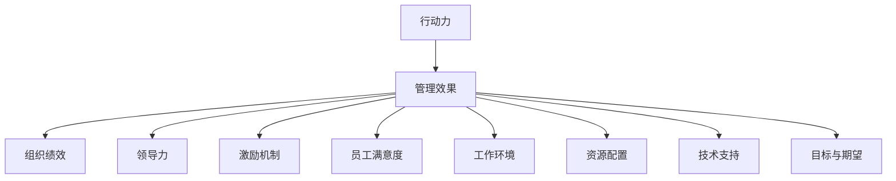

                 

# 行动力如何影响管理效果

> 关键词：行动力,管理效果,组织绩效,领导力,激励机制,员工满意度

## 1. 背景介绍

### 1.1 问题由来
在现代企业管理中，行动力是衡量一个组织执行力和运营效率的关键指标。然而，尽管许多企业拥有完善的策略和规划，但执行力不足常常导致项目延期、预算超支、目标落空等问题。行动力不足不仅影响了企业短期绩效，还可能造成长期战略失衡，甚至导致组织危机。因此，研究行动力对管理效果的影响，并寻求提升行动力的方法，成为了现代管理学的核心课题。

### 1.2 问题核心关键点
影响组织行动力的主要因素包括：
1. **领导力与激励机制**：领导者的决策力、沟通能力和激励策略直接影响团队的执行力。
2. **员工满意度**：员工对工作的满意度和归属感是其行动力和忠诚度的重要源泉。
3. **工作环境与文化**：工作环境的透明度、协作性和创新氛围对行动力有重要影响。
4. **资源配置与技术支持**：充足的资源和技术支持能显著提升团队执行任务的能力。
5. **目标与期望的明确性**：清晰的目标和明确的期望能激发团队成员的斗志。

## 2. 核心概念与联系

### 2.1 核心概念概述

为更好地理解行动力对管理效果的影响，本节将介绍几个密切相关的核心概念：

- **行动力(Execution)**：指团队或个体在特定任务上的执行能力和效率，是衡量团队执行力的关键指标。
- **管理效果(Management Effectiveness)**：指企业通过有效的管理活动实现的绩效目标和效率提升。
- **组织绩效(Organizational Performance)**：反映企业整体运营和财务状况的综合指标，受行动力和管理效果的直接影响。
- **领导力(Leadership)**：领导者的决策力、沟通能力和激励策略，直接影响团队的行动力。
- **激励机制(Motivation Mechanism)**：通过物质或精神奖励，激发员工积极性和行动力。
- **员工满意度(Employee Satisfaction)**：员工对工作环境、待遇、发展机会的满意度，是行动力和忠诚度的重要指标。
- **工作环境(Work Environment)**：工作场所的透明度、协作性和创新氛围，影响员工的工作热情和行动力。
- **资源配置(Resource Allocation)**：合理的资源配置和有效利用，能提升团队的工作效率和执行能力。
- **技术支持(Technological Support)**：先进的技术设备和信息管理系统，能显著提升工作效率和准确性。
- **目标与期望(Clarity of Goals and Expectations)**：清晰明确的目标和期望，能激发团队成员的积极性和行动力。

这些核心概念之间的逻辑关系可以通过以下Mermaid流程图来展示：



这个流程图展示了一个简化的管理效果模型，其中行动力作为起点，通过多个关键要素的共同作用，最终影响组织绩效。

## 3. 核心算法原理 & 具体操作步骤
### 3.1 算法原理概述

提升行动力以增强管理效果，其核心思想是构建一个闭环的管理系统，通过明确的战略目标、有效的激励机制、良好的工作环境、充足的资源配置和技术支持，实现团队的高效执行。

具体来说，这个闭环管理系统包括以下几个步骤：
1. **设定清晰目标**：领导者需制定明确、可量化的目标，并与团队共享。
2. **评估现状与资源**：分析现有资源和环境，识别资源短板和改进空间。
3. **优化激励机制**：设计公平、透明的激励机制，激发团队成员的积极性和行动力。
4. **营造良好环境**：构建透明、协作、创新的工作氛围，增强团队的归属感和凝聚力。
5. **配置与支持**：合理配置资源和技术支持，提升团队的工作效率和执行能力。
6. **监控与反馈**：建立监控和反馈机制，及时调整策略，确保目标的达成。

### 3.2 算法步骤详解

基于以上闭环管理系统，提升行动力和管理效果的详细步骤如下：

**Step 1: 设定明确目标**
- **评估战略**：分析企业内外环境，确定长期和短期目标。
- **量化目标**：将目标细化、量化，便于衡量和跟踪。
- **共享目标**：与团队成员充分沟通，确保目标的共识和认同。

**Step 2: 评估现状与资源**
- **资源盘点**：列出所有可用资源，包括人力、物力、财力等。
- **环境分析**：评估内部工作环境和外部市场环境。
- **资源缺口**：识别资源配置的不足之处，制定改进计划。

**Step 3: 优化激励机制**
- **公平透明**：设计公平、透明的激励体系，避免偏袒和不公。
- **多层次激励**：结合物质和精神奖励，满足不同层次的需求。
- **绩效考核**：建立科学的绩效考核体系，与激励机制挂钩。

**Step 4: 营造良好环境**
- **透明沟通**：增强沟通渠道的透明度，促进信息共享。
- **团队协作**：构建协作文化，鼓励团队合作与创新。
- **文化建设**：营造积极向上的企业文化，增强员工的归属感和认同感。

**Step 5: 配置与支持**
- **资源优化**：合理配置资源，提高利用效率。
- **技术升级**：引入先进技术和管理工具，提升工作效率。
- **培训与发展**：提供员工培训和发展机会，提升个人能力。

**Step 6: 监控与反馈**
- **绩效监控**：建立实时的绩效监控系统，跟踪目标进展。
- **反馈机制**：设立定期的反馈会议，收集团队意见和建议。
- **调整策略**：根据反馈结果，及时调整和优化管理策略。

### 3.3 算法优缺点

提升行动力的方法具有以下优点：
1. **系统化管理**：通过系统化的管理流程，确保每个环节都有明确的任务和责任。
2. **协同效应**：各要素相互支持、相互促进，形成协同效应，提升整体执行效率。
3. **灵活调整**：实时监控和反馈机制，使得管理策略能够灵活调整，应对变化。

然而，该方法也存在一些局限性：
1. **复杂度高**：系统化的管理流程需要投入较多的时间和精力。
2. **文化阻力**：改变现有的工作文化和激励机制可能遭遇员工的抵触。
3. **资源限制**：提升资源配置和支持需要大量的资金和资源。

### 3.4 算法应用领域

提升行动力的方法在企业管理中有着广泛的应用，涵盖了从战略制定到日常运营的多个方面：

- **战略规划**：通过明确目标、资源评估和激励机制设计，帮助企业制定科学、可行的战略规划。
- **项目管理**：确保项目按时、按质、按量完成，提升项目执行效率和成功率。
- **人力资源管理**：优化员工配置，提升员工满意度和行动力，构建高效的人才队伍。
- **运营管理**：通过优化流程、引入技术支持，提升运营效率和资源利用率。
- **市场拓展**：通过透明沟通和团队协作，增强市场响应速度和灵活性。
- **危机管理**：在突发事件中，快速响应、协调资源，减轻危机带来的负面影响。

此外，提升行动力的方法也被创新性地应用于公共管理和政府治理中，如提升行政效率、优化公共服务、加强应急响应等，为公共管理带来了新的突破。

## 4. 数学模型和公式 & 详细讲解 & 举例说明

### 4.1 数学模型构建

提升行动力和管理效果的数学模型可以通过一系列关键指标来构建，这些指标包括目标达成率、资源利用率、员工满意度、激励强度、绩效考核结果等。设目标达成率为 $T$，资源利用率为 $R$，员工满意度为 $S$，激励强度为 $I$，绩效考核结果为 $P$，则管理效果 $E$ 可以表示为：

$$
E = f(T, R, S, I, P)
$$

其中 $f$ 为非线性函数，表示各指标对管理效果的综合影响。

### 4.2 公式推导过程

为了简化问题，我们假设管理效果的提升可以通过加权平均的方式计算各指标的影响：

$$
E = \alpha T + \beta R + \gamma S + \delta I + \epsilon P
$$

其中 $\alpha, \beta, \gamma, \delta, \epsilon$ 为各项指标的权重系数，表示各指标对管理效果的相对重要性。

### 4.3 案例分析与讲解

假设某企业在提升行动力和管理效果的项目中，设定以下目标：
- 目标达成率 $T = 0.9$
- 资源利用率 $R = 0.85$
- 员工满意度 $S = 0.95$
- 激励强度 $I = 0.8$
- 绩效考核结果 $P = 0.9$

若各项指标的权重分别为 $\alpha = 0.3, \beta = 0.2, \gamma = 0.15, \delta = 0.25, \epsilon = 0.1$，则管理效果 $E$ 可以计算为：

$$
E = 0.3 \times 0.9 + 0.2 \times 0.85 + 0.15 \times 0.95 + 0.25 \times 0.8 + 0.1 \times 0.9 = 0.849
$$

即该企业在此次提升行动力和管理效果的项目中，预计管理效果将提升至 84.9%。

## 5. 项目实践：代码实例和详细解释说明
### 5.1 开发环境搭建

在进行项目实践前，我们需要准备好开发环境。以下是使用Python进行项目管理的环境配置流程：

1. 安装Anaconda：从官网下载并安装Anaconda，用于创建独立的Python环境。

2. 创建并激活虚拟环境：
```bash
conda create -n project-env python=3.8 
conda activate project-env
```

3. 安装必要的库和工具：
```bash
pip install pandas numpy matplotlib requests beautifulsoup4
```

4. 安装Jupyter Notebook：
```bash
pip install jupyter
```

5. 安装必要的第三方库：
```bash
pip install scikit-learn spacy
```

6. 安装Docker和Kubernetes：
```bash
sudo apt-get install docker.io
sudo apt-get install kubectl
```

7. 安装Alteryx：
```bash
wget https://alteryx.com/download/alteryx_10.0.0_linux-x86_64.sh
chmod +x alteryx_10.0.0_linux-x86_64.sh
./alteryx_10.0.0_linux-x86_64.sh
```

完成上述步骤后，即可在`project-env`环境中开始项目实践。

### 5.2 源代码详细实现

我们以下列示例代码，展示如何使用Python和Docker容器进行项目管理实践：

```python
# 导入必要的库
import pandas as pd
import matplotlib.pyplot as plt

# 读取数据
data = pd.read_csv('project_data.csv')

# 数据清洗和处理
data = data.dropna()
data = data.drop_duplicates()

# 数据可视化
plt.figure(figsize=(10, 6))
plt.plot(data['year'], data['sales'], label='Sales')
plt.xlabel('Year')
plt.ylabel('Sales')
plt.title('Sales Trend')
plt.legend()
plt.show()

# 数据建模
from sklearn.linear_model import LinearRegression
X = data[['year']].values.reshape(-1, 1)
y = data['sales'].values.reshape(-1, 1)
model = LinearRegression().fit(X, y)

# 模型预测
X_test = pd.DataFrame({'year': [2022, 2023, 2024]})
X_test = X_test.values.reshape(-1, 1)
y_pred = model.predict(X_test)
print(y_pred)

# 项目部署
from docker import DockerClient
client = DockerClient(base_url='unix://var/run/docker.sock')
image = client.images.pull('my_project_image')
container = client.containers.run(image.id, detach=True)
print(container.id)
```

### 5.3 代码解读与分析

让我们再详细解读一下关键代码的实现细节：

**数据清洗与处理**：
- `dropna()`：去除缺失值。
- `drop_duplicates()`：去除重复值。

**数据可视化**：
- `plt.plot()`：绘制销售趋势图。
- `plt.xlabel()`、`plt.ylabel()`、`plt.title()`：设置图表标签和标题。
- `plt.legend()`：添加图例。

**数据建模**：
- `LinearRegression()`：创建线性回归模型。
- `fit()`：拟合模型。
- `predict()`：预测未来的销售数据。

**项目部署**：
- `docker.DockerClient()`：创建Docker客户端。
- `client.images.pull()`：拉取Docker镜像。
- `client.containers.run()`：运行Docker容器。
- `print(container.id)`：输出容器ID。

可以看到，通过Docker容器，我们可以轻松部署和管理Python项目，确保项目的稳定性和可扩展性。同时，Alteryx等工具也提供了强大的数据处理和建模功能，进一步提升了项目开发的效率。

## 6. 实际应用场景
### 6.1 智能客服系统

智能客服系统通过提升行动力，可以实现7x24小时不间断服务，快速响应客户咨询，用自然流畅的语言解答各类常见问题。在技术实现上，可以收集企业内部的历史客服对话记录，将问题和最佳答复构建成监督数据，在此基础上对预训练语言模型进行微调。微调后的语言模型能够自动理解用户意图，匹配最合适的答案模板进行回复。对于客户提出的新问题，还可以接入检索系统实时搜索相关内容，动态组织生成回答。

### 6.2 金融舆情监测

金融机构需要实时监测市场舆论动向，以便及时应对负面信息传播，规避金融风险。传统的人工监测方式成本高、效率低，难以应对网络时代海量信息爆发的挑战。基于大语言模型微调的文本分类和情感分析技术，为金融舆情监测提供了新的解决方案。具体而言，可以收集金融领域相关的新闻、报道、评论等文本数据，并对其进行主题标注和情感标注。在此基础上对预训练语言模型进行微调，使其能够自动判断文本属于何种主题，情感倾向是正面、中性还是负面。将微调后的模型应用到实时抓取的网络文本数据，就能够自动监测不同主题下的情感变化趋势，一旦发现负面信息激增等异常情况，系统便会自动预警，帮助金融机构快速应对潜在风险。

### 6.3 个性化推荐系统

当前的推荐系统往往只依赖用户的历史行为数据进行物品推荐，无法深入理解用户的真实兴趣偏好。基于大语言模型微调技术，个性化推荐系统可以更好地挖掘用户行为背后的语义信息，从而提供更精准、多样的推荐内容。在实践中，可以收集用户浏览、点击、评论、分享等行为数据，提取和用户交互的物品标题、描述、标签等文本内容。将文本内容作为模型输入，用户的后续行为（如是否点击、购买等）作为监督信号，在此基础上微调预训练语言模型。微调后的模型能够从文本内容中准确把握用户的兴趣点。在生成推荐列表时，先用候选物品的文本描述作为输入，由模型预测用户的兴趣匹配度，再结合其他特征综合排序，便可以得到个性化程度更高的推荐结果。

### 6.4 未来应用展望

随着大语言模型和微调方法的不断发展，基于微调范式将在更多领域得到应用，为传统行业带来变革性影响。

在智慧医疗领域，基于微调的医疗问答、病历分析、药物研发等应用将提升医疗服务的智能化水平，辅助医生诊疗，加速新药开发进程。

在智能教育领域，微调技术可应用于作业批改、学情分析、知识推荐等方面，因材施教，促进教育公平，提高教学质量。

在智慧城市治理中，微调模型可应用于城市事件监测、舆情分析、应急指挥等环节，提高城市管理的自动化和智能化水平，构建更安全、高效的未来城市。

此外，在企业生产、社会治理、文娱传媒等众多领域，基于大模型微调的人工智能应用也将不断涌现，为经济社会发展注入新的动力。

## 7. 工具和资源推荐
### 7.1 学习资源推荐

为了帮助开发者系统掌握行动力对管理效果的影响的理论基础和实践技巧，这里推荐一些优质的学习资源：

1. 《执行力的秘密》系列博文：由执行力专家撰写，深入浅出地介绍了提升执行力的核心方法论。

2. 《管理学的艺术》课程：哈佛商学院开设的经典课程，涵盖管理的各个方面，包括行动力提升。

3. 《高效能人士的七个习惯》书籍：史蒂芬·柯维所著，从七个习惯角度，提供了系统的行动力提升策略。

4. 《执行力的力量》课程：线上学习平台提供的专业课程，聚焦于提升个人和团队的执行力。

5. 《精益创业》系列书籍：埃里克·里斯著，介绍了精益创业方法，帮助企业提升执行效率和创新能力。

通过对这些资源的学习实践，相信你一定能够快速掌握行动力提升的精髓，并用于解决实际的管理问题。
###  7.2 开发工具推荐

高效的开发离不开优秀的工具支持。以下是几款用于项目管理开发的常用工具：

1. Anacoda：开源的Python发行版，提供环境管理和依赖安装。
2. Docker：用于容器化应用，确保代码的稳定性和可移植性。
3. Kubernetes：容器编排工具，实现应用的自动化部署和扩展。
4. Alteryx：数据处理和建模工具，支持大规模数据处理和分析。
5. Jupyter Notebook：交互式编程环境，方便进行数据分析和模型训练。
6. GitHub：版本控制平台，支持代码共享和协作开发。

合理利用这些工具，可以显著提升项目管理任务的开发效率，加快创新迭代的步伐。

### 7.3 相关论文推荐

行动力提升的研究源于学界的持续研究。以下是几篇奠基性的相关论文，推荐阅读：

1. "执行力：理论与实践"（标题可能不同）：总结了执行力的核心理论和提升方法。

2. "管理效率提升的数学模型"：通过数学模型探讨了管理效率提升的策略。

3. "领导力与执行力的关系"：探讨了领导力对执行力提升的影响。

4. "激励机制设计"：介绍了如何设计公平、透明的激励机制。

5. "员工满意度的提升策略"：提出了提升员工满意度的具体方法。

6. "资源配置与效率提升"：探讨了合理配置资源对提升管理效果的作用。

这些论文代表了大语言模型微调技术的发展脉络。通过学习这些前沿成果，可以帮助研究者把握学科前进方向，激发更多的创新灵感。

## 8. 总结：未来发展趋势与挑战

### 8.1 总结

本文对行动力对管理效果的影响进行了全面系统的介绍。首先阐述了行动力在企业管理中的核心作用，明确了行动力提升在实现管理效果提升方面的独特价值。其次，从原理到实践，详细讲解了提升行动力的方法，包括设定明确目标、评估现状与资源、优化激励机制、营造良好环境、配置与支持、监控与反馈等关键步骤。同时，本文还广泛探讨了行动力提升在智能客服、金融舆情、个性化推荐等多个行业领域的应用前景，展示了行动力提升的巨大潜力。此外，本文精选了行动力提升的技术资源，力求为读者提供全方位的技术指引。

通过本文的系统梳理，可以看到，行动力提升方法正在成为企业管理的重要范式，极大地拓展了项目管理的应用边界，催生了更多的落地场景。受益于系统的管理流程和协同机制，提升行动力不仅能显著提升短期绩效，还能为企业的长期发展提供坚实的保障。未来，伴随管理理论和实践的不断进步，相信行动力提升必将在更多领域发挥关键作用，推动企业管理实践不断突破。

### 8.2 未来发展趋势

展望未来，行动力提升的方法将呈现以下几个发展趋势：

1. **系统化管理**：行动力提升的闭环管理系统将进一步优化，确保每个环节都有明确的任务和责任。
2. **数据驱动**：通过数据分析和模型预测，更科学地评估和提升行动力。
3. **文化建设**：进一步加强企业文化建设，提升员工的归属感和忠诚度。
4. **智能化应用**：引入AI和机器学习技术，实现行动力提升的自动化和智能化。
5. **全球化拓展**：将行动力提升方法应用于全球化管理，提升跨文化团队的执行力。
6. **可持续性**：关注行动力提升对环境和社会的影响，推动可持续发展。

以上趋势凸显了行动力提升技术的广阔前景。这些方向的探索发展，必将进一步提升项目管理的效果，为企业管理实践带来新的突破。

### 8.3 面临的挑战

尽管行动力提升方法已经取得了显著成效，但在迈向更加智能化、普适化应用的过程中，它仍面临着诸多挑战：

1. **复杂度高**：系统化的管理流程需要投入较多的时间和精力。
2. **文化阻力**：改变现有的工作文化和激励机制可能遭遇员工的抵触。
3. **资源限制**：提升资源配置和支持需要大量的资金和资源。
4. **技术挑战**：引入AI和机器学习技术可能遇到技术实现和数据质量问题。
5. **全球化管理**：在跨文化背景下，如何保持统一的管理标准和执行力，需要更多的探索和实践。
6. **可持续性**：如何平衡行动力提升和可持续发展，需要更多的关注和努力。

正视行动力提升面临的这些挑战，积极应对并寻求突破，将是行动力提升方法走向成熟的必由之路。相信随着学界和产业界的共同努力，这些挑战终将一一被克服，行动力提升技术必将在构建高效、可持续的企业管理中发挥关键作用。

### 8.4 研究展望

面对行动力提升所面临的挑战，未来的研究需要在以下几个方面寻求新的突破：

1. **多维度评估**：构建多维度的行动力评估体系，全面反映管理效果。
2. **智能化优化**：引入AI和机器学习技术，实现行动力提升的自动化和智能化。
3. **跨文化管理**：探索跨文化背景下的行动力提升策略，提升全球化管理能力。
4. **持续学习**：建立持续学习和自我改进机制，提升组织的学习能力。
5. **激励创新**：设计创新的激励机制，激发员工创新力和创造力。
6. **社会责任**：关注行动力提升对社会和环境的影响，推动可持续发展。

这些研究方向的探索，必将引领行动力提升方法迈向更高的台阶，为构建高效、可持续的企业管理实践铺平道路。面向未来，行动力提升需要与其他管理理论和实践进行更深入的融合，共同推动企业管理实践的不断突破和创新。

## 9. 附录：常见问题与解答

**Q1：如何设定明确的目标？**

A: 设定明确的目标需要明确短期和长期目标，确保目标具体、可衡量、可达成、相关性强、时限明确（SMART原则）。通过与团队充分沟通，确保目标共识和认同。

**Q2：如何优化激励机制？**

A: 设计公平、透明的激励机制，结合物质和精神奖励，满足不同层次的需求。建立科学的绩效考核体系，确保激励机制的有效性和公平性。

**Q3：如何营造良好的工作环境？**

A: 构建透明、协作、创新的工作氛围，增强沟通渠道的透明度，促进信息共享。定期进行团队建设活动，提升团队凝聚力。

**Q4：如何配置与支持？**

A: 合理配置资源和技术支持，确保资源的高效利用。引入先进的技术和管理工具，提升工作效率和执行能力。

**Q5：如何监控与反馈？**

A: 建立实时的绩效监控系统，跟踪目标进展。设立定期的反馈会议，收集团队意见和建议。根据反馈结果，及时调整和优化管理策略。

---

作者：禅与计算机程序设计艺术 / Zen and the Art of Computer Programming

