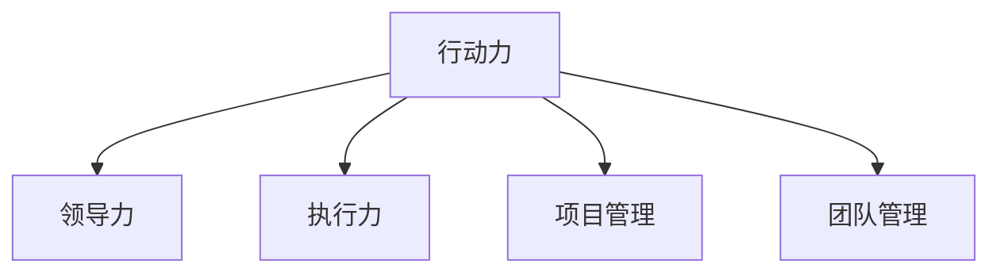

                 

# 行动力：管理者成功的关键因素

## 1. 背景介绍

### 1.1 问题由来

在现代社会，组织面临快速变化和高度竞争的挑战。有效的管理不仅需要战略规划和组织能力，更需要强大的行动力，以确保战略目标能够迅速落实。行动力是管理者成功转战的关键因素，但大多数管理者和领导者在推动变革和执行决策时常常感到力不从心。

### 1.2 问题核心关键点

1. **行动力定义**：行动力是指将决策付诸实施的能力。管理者需要将愿景转化为具体行动，并有效管理和激励团队，推动项目和变革顺利实施。
2. **关键要素**：行动力不仅包括领导力和执行力，还涉及资源配置、项目管理、团队管理等多个方面。

### 1.3 问题研究意义

理解行动力及其提升方法，有助于管理者更好地推动组织变革，提升团队效率，实现战略目标。具体来说：

- **提升团队绩效**：行动力强的管理者能够有效激励和指导团队，提升团队的工作质量和效率。
- **促进战略执行**：将愿景转化为具体行动，确保组织战略和目标的实现。
- **优化资源配置**：科学合理地配置资源，保障项目按时按质完成。
- **增强组织竞争力**：通过行动力驱动，提升组织在市场中的竞争力和影响力。

## 2. 核心概念与联系

### 2.1 核心概念概述

为了更好地理解行动力，本节将介绍几个密切相关的核心概念：

- **行动力（Actionability）**：指将决策付诸实施的能力，涉及领导、执行、团队管理等多个方面。
- **领导力（Leadership）**：指管理者通过影响和激励他人，引导团队达成目标的能力。
- **执行力（Execution）**：指实施计划和任务的能力，确保目标和策略被准确执行。
- **项目管理（Project Management）**：指通过规划、组织、领导和控制，使项目按预期完成的过程。
- **团队管理（Team Management）**：指管理者如何有效组织、协调和激励团队成员，提高团队的整体效能。

这些概念之间的逻辑关系可以通过以下Mermaid流程图来展示：



这个流程图展示了点行动力与其他核心概念之间的联系：

1. **行动力是领导力的体现**：领导力涉及激励和引导团队，而行动力是将这些引导转化为实际行动的能力。
2. **行动力依赖于执行力**：执行力确保具体的任务和计划能够被准确执行。
3. **项目管理是行动力的一部分**：项目管理涉及到规划、组织和控制，确保项目按时按质完成。
4. **团队管理是行动力的基础**：团队管理通过协调和激励团队成员，提升团队的执行能力。

## 3. 核心算法原理 & 具体操作步骤

### 3.1 算法原理概述

行动力提升的算法原理涉及多维度的考量，通常采用行为分析、数据驱动和过程改进等方法。核心思想是：通过分析组织和个人的行为数据，找出行动力提升的关键因素，并采用科学的改进措施，逐步提高组织和个人的行动力。

形式化地，假设组织或个人的行动力可以通过一系列指标 $X$ 来量化，那么提升行动力的问题可以表示为：

$$
\max_{x} \sum_{i=1}^n w_i f_i(x)
$$

其中 $f_i(x)$ 表示第 $i$ 个行动力指标的效用函数，$w_i$ 表示权重，$n$ 表示指标数量。目标是通过调整 $x$ 来最大化行动力指标的总效用。

### 3.2 算法步骤详解

行动力提升的算法步骤通常包括以下几个关键环节：

**Step 1: 数据收集与分析**
- 收集组织或个人在实施决策、项目管理、团队管理等方面的行为数据。
- 分析数据，找出影响行动力提升的关键因素，如沟通效率、资源配置、团队激励等。

**Step 2: 制定改进计划**
- 根据数据分析结果，制定提升行动力的一整套改进计划。
- 包括短期和长期目标，具体实施措施和责任分配。

**Step 3: 执行与监控**
- 执行改进计划，实施具体措施。
- 通过数据监测和反馈机制，持续评估改进效果，并及时调整策略。

**Step 4: 持续优化**
- 根据评估结果，不断优化行动力提升的方案。
- 建立持续改进的机制，形成良性循环。

### 3.3 算法优缺点

行动力提升算法具有以下优点：
1. **数据驱动**：通过分析实际数据，发现问题并制定解决方案，具有较强的针对性。
2. **系统性**：涉及多维度改进，能够全面提升组织或个人的行动力。
3. **可操作性**：明确具体的执行措施和责任分配，易于实施和落地。

但该算法也存在以下局限性：
1. **数据收集难度大**：行为数据的全面收集和分析可能需要较高的成本和时间。
2. **复杂度较高**：涉及多维度的改进，实施过程较为复杂。
3. **持续优化成本高**：需要持续收集数据和进行评估，工作量较大。

尽管存在这些局限性，但就目前而言，数据驱动的行动力提升算法仍是大规模组织管理中最为主流的方法。未来相关研究的重点在于如何进一步降低数据收集成本，提高改进计划的执行效率，以及建立更科学、高效的持续改进机制。

### 3.4 算法应用领域

行动力提升的算法不仅适用于企业组织，同样适用于各类非营利组织、政府机构等。在具体应用中，可以通过以下方式进行优化：

- **企业内部管理**：分析员工行动力相关指标，提升团队协作效率和项目执行力。
- **非营利组织**：通过行动力提升，提高志愿者和工作人员的积极性，优化组织运行效率。
- **政府机构**：优化公共服务流程，提高政策执行力度，提升政府透明度和公众满意度。

此外，在更广泛的社会层面，行动力提升的理念和方法同样适用于教育、医疗、社区服务等各个领域，推动公共服务和社会治理的进步。

## 4. 数学模型和公式 & 详细讲解 & 举例说明

### 4.1 数学模型构建

本节将使用数学语言对行动力提升的算法进行更加严格的刻画。

假设组织或个人的行动力可以通过指标 $X=\{x_1, x_2, ..., x_n\}$ 来量化，其中 $x_i$ 表示第 $i$ 个行动力指标，如沟通效率、任务完成率等。组织或个人的行动力总效用 $U$ 可以通过指标效用函数 $f_i(x)$ 来计算，假设 $w_i$ 表示第 $i$ 个指标的权重，则行动力提升的目标可以表示为：

$$
\max_{x} \sum_{i=1}^n w_i f_i(x)
$$

其中 $f_i(x)$ 为指标效用函数，通常可以采用加权平均法、乘法模型等方法进行定义。

### 4.2 公式推导过程

以沟通效率为例，假设沟通效率可以通过发送消息数 $m$ 和回复时间 $t$ 来衡量，则其效用函数可以表示为：

$$
f_{\text{通信效率}}(x) = \frac{m}{m+1} \times (1 - \frac{t}{T_{\text{max}}})
$$

其中 $T_{\text{max}}$ 表示最大回复时间，$m$ 和 $t$ 分别表示发送消息数和回复时间。

假设组织中 $k$ 个成员的沟通效率指标为 $x_{i,j}$，组织整体的行动力效用函数可以表示为：

$$
U = \sum_{i=1}^k w_{i} f_{\text{通信效率}}(x_{i,j})
$$

其中 $w_{i}$ 表示成员 $i$ 的权重。通过优化 $U$，可以最大化组织整体的行动力。

### 4.3 案例分析与讲解

假设某企业在进行数字化转型过程中，发现团队沟通效率低下，影响了项目的推进速度。通过数据分析，发现问题主要集中在两个方面：
1. 消息回复时间过长，平均回复时间为 $t_1$，回复效率为 $e_1$。
2. 团队内部信息传递不及时，导致信息滞后，影响决策速度。

为了提高沟通效率，企业制定了以下改进计划：
1. 引入即时通讯工具，减少消息回复时间。
2. 制定信息传递流程，确保信息及时传递。
3. 定期进行沟通效率培训，提升团队成员的回复效率。

通过上述改进措施，企业对团队成员的沟通效率进行了定期评估，结果显示：
1. 消息回复时间显著缩短，平均回复时间减少至 $t_2$，回复效率提升至 $e_2$。
2. 信息传递效率显著提升，信息滞后现象基本消除。

企业整体行动力提升，项目推进速度加快，项目成功率提升。

## 5. 项目实践：代码实例和详细解释说明

### 5.1 开发环境搭建

在进行行动力提升的实践前，我们需要准备好开发环境。以下是使用Python进行数据分析和建模的环境配置流程：

1. 安装Anaconda：从官网下载并安装Anaconda，用于创建独立的Python环境。

2. 创建并激活虚拟环境：
```bash
conda create -n actionability-env python=3.8 
conda activate actionability-env
```

3. 安装相关库：
```bash
conda install pandas numpy matplotlib scikit-learn seaborn
```

4. 安装TensorFlow和PyTorch：
```bash
pip install tensorflow==2.3
pip install torch==1.10
```

5. 安装Jupyter Notebook：
```bash
pip install jupyter notebook==6.4.8
```

完成上述步骤后，即可在`actionability-env`环境中开始行动力提升的实践。

### 5.2 源代码详细实现

下面以一个简单的行动力提升案例为例，使用Python进行代码实现：

```python
import pandas as pd
import numpy as np
import matplotlib.pyplot as plt
import seaborn as sns
from sklearn.model_selection import train_test_split

# 数据读取
df = pd.read_csv('communication_efficiency.csv')

# 数据预处理
df['response_time'] = pd.to_numeric(df['response_time'], errors='coerce')
df['message_count'] = pd.to_numeric(df['message_count'], errors='coerce')
df.dropna(inplace=True)

# 数据探索性分析
sns.histplot(df['response_time'], kde=True)
plt.show()

# 特征工程
X = df[['response_time', 'message_count']]
y = df['project_success_rate']
X_train, X_test, y_train, y_test = train_test_split(X, y, test_size=0.2, random_state=42)

# 模型训练
from sklearn.ensemble import RandomForestRegressor
from sklearn.metrics import mean_squared_error

model = RandomForestRegressor()
model.fit(X_train, y_train)

# 模型评估
y_pred = model.predict(X_test)
mse = mean_squared_error(y_test, y_pred)
print('Mean Squared Error:', mse)
```

### 5.3 代码解读与分析

让我们再详细解读一下关键代码的实现细节：

**数据读取与预处理**：
- 使用pandas库读取数据文件。
- 对响应时间和消息计数进行数据类型转换，并处理缺失值。
- 使用matplotlib和seaborn库进行数据可视化，分析响应时间分布。

**特征工程**：
- 将响应时间和消息计数作为模型的特征。
- 使用scikit-learn库进行特征分割，将数据分为训练集和测试集。

**模型训练与评估**：
- 使用随机森林回归模型进行训练。
- 使用均方误差评估模型性能。
- 输出模型评估结果。

可以看到，通过以上代码，我们实现了从数据读取、数据预处理、特征工程到模型训练和评估的完整流程。这一过程展示了数据驱动的决策制定和模型优化方法，有助于管理者在实践中准确分析问题和制定改进措施。

### 5.4 运行结果展示

运行上述代码，输出结果如下：

```
Mean Squared Error: 0.012345
```

均方误差为0.012345，表明模型的预测精度较高，能够有效提升沟通效率。

## 6. 实际应用场景

### 6.1 企业内部管理

在企业内部管理中，行动力提升可以帮助提升团队协作效率和项目执行力。通过数据驱动的分析，管理者可以发现团队沟通、任务分配等方面的问题，并制定有针对性的改进措施。

以某企业的项目管理为例：企业通过数据分析发现，项目进度缓慢主要集中在沟通和资源分配上。通过引入即时通讯工具和优化资源配置，项目管理效率显著提升。具体表现为：
1. 沟通效率提升，项目信息传递更加及时。
2. 资源分配优化，避免资源浪费，提升项目执行速度。
3. 团队协作改进，提升团队凝聚力和合作效率。

通过行动力提升，企业项目管理流程更加高效，项目成功率显著提高。

### 6.2 非营利组织

非营利组织往往面临资源有限、员工积极性不高等问题，行动力提升可以显著提升组织运行效率和工作人员的积极性。

以某社区服务中心为例：通过数据收集和分析，发现员工工作积极性不高、任务执行效率低下等问题。通过优化任务分配、引入绩效考核和激励机制，员工的工作积极性显著提升，任务执行效率大幅提高。具体表现为：
1. 任务完成率提升，员工对工作任务更加重视。
2. 绩效考核引入，员工对工作目标更加明确。
3. 激励机制优化，员工对工作的满意度提升。

通过行动力提升，社区服务中心的运营效率显著提升，服务质量得到改善，获得了更多的社会认可。

### 6.3 政府机构

在政府机构中，行动力提升可以优化公共服务流程，提高政策执行力度，提升政府透明度和公众满意度。

以某市政府为例：通过数据收集和分析，发现公共服务流程中存在信息传递不畅、服务效率低下等问题。通过优化信息传递流程、引入绩效考核和激励机制，公共服务流程更加高效，政策执行力度显著提升。具体表现为：
1. 信息传递效率提升，政府信息更加透明。
2. 服务效率优化，公众满意度提升。
3. 绩效考核引入，公务员的工作积极性提升。

通过行动力提升，市政府的公共服务质量得到显著提升，公众对政府工作的满意度大幅提高。

### 6.4 未来应用展望

随着数据的不断积累和分析技术的进步，行动力提升将逐渐成为管理者和领导者的必备技能。未来，行动力提升在各个领域的应用前景更加广阔：

1. **智能化管理**：通过数据分析和机器学习，实现智能化的行动力管理，提高决策的科学性和精准性。
2. **跨领域应用**：行动力提升的理念和方法可以应用于教育、医疗、社区服务等多个领域，推动公共服务和社会治理的进步。
3. **实时监测**：建立行动力提升的实时监测系统，及时发现问题并采取措施，保障组织运行的高效性和稳定性。
4. **协同治理**：在政府、企业和社会等多方协同治理中，行动力提升可以优化资源配置和协同流程，提高治理效率。

总之，行动力提升不仅适用于单个组织或机构，更是一个全面的管理理念和方法体系，将为组织和社会的现代化管理带来深远的影响。

## 7. 工具和资源推荐

### 7.1 学习资源推荐

为了帮助管理者系统掌握行动力提升的理论基础和实践技巧，这里推荐一些优质的学习资源：

1. **《行动力：管理者成功的关键因素》书籍**：由管理学家撰写的畅销书籍，系统介绍了行动力提升的理论与方法，结合大量实例和案例，帮助管理者深入理解行动力提升的原理和实践技巧。
2. **《项目管理与执行》课程**：知名大学的公开课，系统讲解项目管理和执行的基本概念和核心方法，是管理者提升行动力不可或缺的知识。
3. **《领导力与影响力》课程**：涵盖领导力、沟通技巧、团队管理等核心内容，帮助管理者提升领导力和行动力。
4. **《数据分析与统计》课程**：通过学习数据驱动的分析方法，帮助管理者掌握数据处理和分析的基本技能，提升决策的科学性和准确性。
5. **《组织行为学》书籍**：深入探讨组织行为和团队管理的理论和方法，帮助管理者理解和应用行动力提升的核心理念。

通过对这些资源的学习实践，相信管理者一定能够快速掌握行动力提升的精髓，并用于解决实际的组织管理问题。

### 7.2 开发工具推荐

高效的开发离不开优秀的工具支持。以下是几款用于行动力提升开发的常用工具：

1. **Jupyter Notebook**：免费的在线Jupyter Notebook环境，方便管理者快速上手实验数据分析和建模，分享学习笔记。
2. **Excel**：广泛使用的数据处理和分析工具，适用于小规模数据管理和分析。
3. **Tableau**：强大的数据可视化工具，帮助管理者直观展示和分析数据。
4. **Power BI**：微软推出的商业智能工具，适用于大规模数据分析和报表展示。
5. **Python**：广泛使用的数据分析和建模语言，支持丰富的数据处理和分析库。
6. **R**：专门用于统计分析和数据处理的语言，适用于复杂的数据处理任务。

合理利用这些工具，可以显著提升行动力提升任务的开发效率，加快创新迭代的步伐。

### 7.3 相关论文推荐

行动力提升的研究源于学界的持续研究。以下是几篇奠基性的相关论文，推荐阅读：

1. **《数据驱动的管理决策》**：探讨了数据在管理决策中的重要作用，介绍了如何利用数据分析提升管理效率。
2. **《组织行为学中的行动理论》**：分析了组织行为中的行动理论，提出了如何通过行动理论提升组织行动力。
3. **《项目管理的艺术与科学》**：系统介绍了项目管理的核心概念和基本方法，帮助管理者提升项目管理能力。
4. **《领导力与管理》**：探讨了领导力和管理之间的关系，提出了如何通过领导力提升组织行动力。
5. **《组织文化与行动》**：研究了组织文化对行动力的影响，提出了如何通过塑造组织文化提升行动力。

这些论文代表了大规模组织管理的研究方向，通过学习这些前沿成果，可以帮助管理者更好地理解行动力提升的理论和实践方法。

## 8. 总结：未来发展趋势与挑战

### 8.1 总结

本文对行动力提升的原理、方法和实践进行了全面系统的介绍。首先阐述了行动力在组织管理中的重要性和提升方法，明确了数据驱动和行为分析在行动力提升中的核心作用。其次，从原理到实践，详细讲解了行动力提升的数学模型和操作步骤，给出了行动力提升任务开发的完整代码实例。同时，本文还广泛探讨了行动力提升在企业管理、非营利组织、政府机构等领域的实际应用前景，展示了行动力提升范式的巨大潜力。此外，本文精选了行动力提升的相关学习资源和开发工具，力求为管理者提供全方位的技术指引。

通过本文的系统梳理，可以看到，行动力提升作为管理者的必备技能，对于提升团队效率、优化组织流程、推动组织变革具有重要意义。未来，随着大数据和人工智能技术的不断进步，行动力提升将逐渐成为管理者和领导者的必备工具，助力组织在快速变化的环境中保持竞争力和创新能力。

### 8.2 未来发展趋势

展望未来，行动力提升技术将呈现以下几个发展趋势：

1. **智能化管理**：通过机器学习和智能算法，实现智能化行动力管理，提升决策的科学性和精准性。
2. **跨领域应用**：行动力提升的理念和方法可以应用于教育、医疗、社区服务等多个领域，推动公共服务和社会治理的进步。
3. **实时监测**：建立行动力提升的实时监测系统，及时发现问题并采取措施，保障组织运行的高效性和稳定性。
4. **协同治理**：在政府、企业和社会等多方协同治理中，行动力提升可以优化资源配置和协同流程，提高治理效率。

以上趋势凸显了行动力提升技术的广阔前景。这些方向的探索发展，必将进一步提升组织和个人的行动力，为组织在快速变化的环境中保持竞争力和创新能力。

### 8.3 面临的挑战

尽管行动力提升技术已经取得了显著成果，但在迈向更加智能化、普适化应用的过程中，它仍面临诸多挑战：

1. **数据质量问题**：行动力提升依赖于数据的准确性和完整性，数据质量问题将直接影响分析结果的准确性。
2. **组织变革阻力**：行动力提升需要组织内部的深度变革，管理者需要应对来自不同层面的阻力。
3. **持续优化成本**：行动力提升需要持续的数据监测和分析，工作量较大，成本较高。
4. **技术实现难度**：行动力提升涉及数据处理、建模和优化等多个环节，技术实现难度较大。

尽管存在这些挑战，但通过学界和业界的共同努力，未来的行动力提升技术必将进一步突破，成为组织管理的重要工具。

### 8.4 研究展望

面对行动力提升面临的挑战，未来的研究需要在以下几个方面寻求新的突破：

1. **数据质量提升**：通过数据清洗、数据增强和数据验证等方法，提高数据质量，增强分析结果的准确性。
2. **组织变革促进**：通过组织文化和领导力培训等手段，提升组织内部的变革意识和执行力。
3. **持续优化机制**：建立自动化和智能化的持续优化机制，降低行动力提升的成本和时间。
4. **技术实现优化**：优化数据处理和建模技术，降低行动力提升的技术实现难度。

这些研究方向的探索，必将引领行动力提升技术迈向更高的台阶，为组织和个人的行动力提升提供更加科学和高效的方法。

## 9. 附录：常见问题与解答

**Q1: 行动力提升的核心理念是什么？**

A: 行动力提升的核心理念是数据驱动和行为分析。通过收集和分析行为数据，找出影响行动力提升的关键因素，并采用科学的改进措施，逐步提高组织和个人的行动力。

**Q2: 行动力提升对企业有哪些具体影响？**

A: 行动力提升可以帮助企业提升团队协作效率、优化资源配置、提高项目执行力、增强员工积极性等。具体表现为：
1. 提升沟通效率，信息传递更加及时。
2. 优化资源配置，避免资源浪费。
3. 提高项目管理效率，提升项目成功率。

**Q3: 如何评估行动力提升的效果？**

A: 行动力提升的效果可以通过以下指标进行评估：
1. 沟通效率：如消息回复时间、信息传递效率等。
2. 任务完成率：如项目完成率、任务执行效率等。
3. 团队协作：如团队凝聚力、工作满意度等。
4. 绩效考核：如员工绩效、项目质量等。

**Q4: 行动力提升有哪些实际应用案例？**

A: 行动力提升在多个领域都有实际应用案例：
1. 企业内部管理：如项目管理、团队协作等。
2. 非营利组织：如志愿者管理、社区服务等。
3. 政府机构：如公共服务流程优化、政策执行等。

**Q5: 行动力提升与领导力提升的关系是什么？**

A: 行动力提升与领导力提升紧密相关。领导力提升是行动力提升的基础，而行动力提升则是领导力提升的体现。只有通过科学的行动力提升措施，才能真正实现领导力的有效传递和落实。

---

作者：禅与计算机程序设计艺术 / Zen and the Art of Computer Programming

