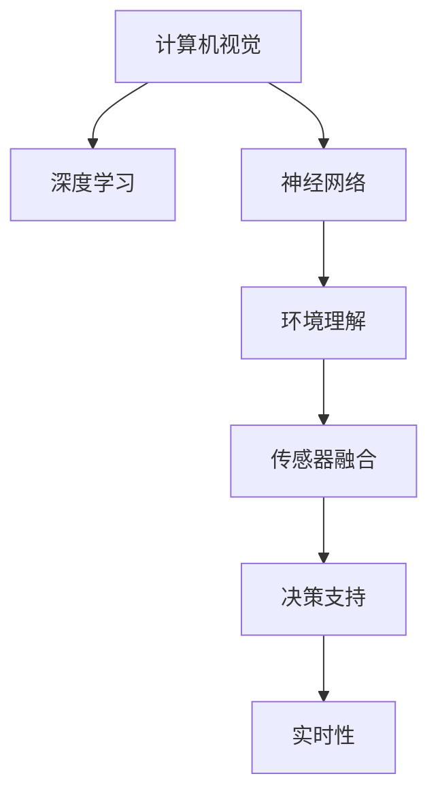

                 

# 计算机视觉在自动驾驶中的应用

> 关键词：自动驾驶, 计算机视觉, 深度学习, 感知系统, 神经网络, 环境理解, 传感器融合, 安全保障

## 1. 背景介绍

### 1.1 问题由来

自动驾驶技术的核心在于通过计算机视觉系统感知环境并做出决策。计算机视觉结合深度学习、神经网络等技术，可以处理和分析摄像头、激光雷达、雷达等传感器提供的大量数据，构建出高精度的环境模型，并据此做出精确的驾驶决策。

自动驾驶技术是当前智能交通领域最具挑战性的课题之一，其目标是从车辆本身到全社会建立一个安全、高效、智能的交通系统。计算机视觉作为自动驾驶中的核心技术之一，承担了环境感知和决策支持的重要职责。本文将详细介绍计算机视觉在自动驾驶中的应用，并探讨其在提升驾驶安全和提升驾驶效率方面的潜力。

### 1.2 问题核心关键点

计算机视觉在自动驾驶中的核心关键点包括：

1. **环境理解**：准确感知道路、车辆、行人、交通标志等关键环境元素，构建高精度环境地图。
2. **物体检测**：识别道路中的各种物体，包括汽车、自行车、行人、交通信号灯等，以及物体的运动轨迹和速度。
3. **场景分类**：将获取的环境信息进行分类，如车道、停车标志、道路边界等，为决策提供依据。
4. **传感器融合**：整合摄像头、激光雷达、雷达等多种传感器数据，提升环境感知能力。
5. **决策支持**：基于感知信息进行交通规则理解、路径规划、行为预测等决策。
6. **实时性**：确保系统能够实时处理大量数据并做出快速反应，保障行车安全。

### 1.3 问题研究意义

计算机视觉技术在自动驾驶中的应用，对于实现智能交通的可持续发展具有重大意义。它不仅能显著提升道路运输效率，还能显著降低交通事故率，优化交通流量，最终实现更加安全、便捷、高效的出行体验。此外，自动驾驶技术的普及将减少对人类司机的依赖，释放社会生产力，推动相关产业的转型升级。

## 2. 核心概念与联系

### 2.1 核心概念概述

为更好地理解计算机视觉在自动驾驶中的应用，本节将介绍几个密切相关的核心概念：

- **计算机视觉(Computer Vision)**：使用计算机和算法对图像、视频等视觉数据进行分析和理解的技术，涉及图像处理、模式识别、深度学习等领域。
- **深度学习(Deep Learning)**：一种基于多层神经网络的机器学习技术，通过大量数据进行训练，能够处理复杂的非线性关系，广泛应用于图像识别、自然语言处理等领域。
- **神经网络(Neural Networks)**：由多个神经元组成的网络结构，用于模拟人类神经系统的信息处理能力，广泛应用于图像识别、语音识别、自然语言处理等领域。
- **环境理解(Perception)**：自动驾驶车辆通过计算机视觉和传感器数据，感知并理解周围环境，如道路、交通标志、车辆、行人等。
- **传感器融合(Sensor Fusion)**：将来自不同传感器（如摄像头、激光雷达、雷达等）的数据融合，提高环境感知的准确性和鲁棒性。
- **决策支持(Decision Making)**：基于环境理解，车辆进行交通规则理解、路径规划、行为预测等决策，从而实现自动驾驶。
- **实时性(Real-Time)**：确保系统能够实时处理大量数据并做出快速反应，保障行车安全。

这些核心概念之间的逻辑关系可以通过以下Mermaid流程图来展示：



这个流程图展示了计算机视觉与深度学习、神经网络等技术之间的内在联系，以及它们如何共同作用于自动驾驶中的环境理解、传感器融合、决策支持等多个环节。

## 3. 核心算法原理 & 具体操作步骤
### 3.1 算法原理概述

计算机视觉在自动驾驶中的应用主要基于深度学习算法，尤其是卷积神经网络(CNN)和其变体。CNN具有强大的特征提取能力，能够从图像数据中自动学习出高效的特征表示。在自动驾驶中，CNN被用于物体检测、场景分类、车道线检测等任务，从而构建出高精度的环境地图。

深度学习模型通常通过大量的标注数据进行训练，以学习环境特征和行为模式。在自动驾驶中，模型需要同时处理来自不同传感器（摄像头、激光雷达、雷达等）的数据，并将其融合为统一的格式。模型的训练和推理过程需要实时处理大量数据，并对决策做出快速响应。

### 3.2 算法步骤详解

计算机视觉在自动驾驶中的核心算法步骤包括：

**Step 1: 数据采集与预处理**
- 通过摄像头、激光雷达、雷达等传感器获取车辆周围的环境数据。
- 对采集到的数据进行预处理，如去噪、校正畸变、尺度归一化等，以提升后续处理的准确性。

**Step 2: 特征提取与表示**
- 使用深度学习模型（如CNN）对预处理后的数据进行特征提取和表示。
- CNN通过多层卷积和池化操作，提取图像的局部特征，并逐渐抽象出高层次的语义信息。

**Step 3: 目标检测与分类**
- 使用目标检测算法（如YOLO、SSD、Faster R-CNN等）对环境中的物体进行检测和分类。
- 检测算法通过多尺度滑动窗口扫描图像，定位出物体的位置和大小，并分类为车辆、行人、交通标志等类别。

**Step 4: 场景分类与语义分割**
- 对检测出的物体进行场景分类，如车道、停车标志、道路边界等。
- 通过语义分割算法（如FCN、U-Net等），将检测结果进一步细化为像素级别的标签，用于指导后续的决策。

**Step 5: 传感器融合**
- 将来自不同传感器的数据进行融合，如对摄像头图像和激光雷达点云进行对齐和融合，提升环境感知的准确性。
- 融合算法如点云到图像的投影、图像到点云的重建等，使得传感器数据能够协同工作。

**Step 6: 决策支持**
- 根据环境理解，使用规则推理、强化学习等方法进行交通规则理解、路径规划、行为预测等决策。
- 决策模型需要能够快速响应环境变化，做出安全、高效的驾驶决策。

**Step 7: 模型部署与测试**
- 将训练好的模型部署到自动驾驶车辆中，进行实时数据处理和决策支持。
- 通过实际驾驶测试，验证模型的性能和稳定性，并进行必要的调整和优化。

### 3.3 算法优缺点

计算机视觉在自动驾驶中的应用具有以下优点：

1. **高精度环境感知**：通过深度学习模型，能够实现对环境的高精度感知和理解。
2. **鲁棒性强**：融合不同传感器的数据，提升环境的鲁棒性和可靠性。
3. **实时性强**：通过优化算法，实现实时数据处理和决策支持，保障行车安全。
4. **提升驾驶效率**：自动驾驶能够减少对人类司机的依赖，提升交通流量，减少拥堵。

同时，计算机视觉在自动驾驶中也有以下缺点：

1. **数据获取成本高**：高精度传感器和复杂的环境条件，导致数据获取和标注成本高。
2. **算法复杂度高**：深度学习模型需要大量的计算资源和数据，训练和推理复杂。
3. **模型泛化能力有限**：训练模型需要大量的标注数据，对新环境的适应能力有限。
4. **环境多样性挑战**：不同环境和光照条件下的鲁棒性提升有待加强。
5. **模型可解释性不足**：深度学习模型通常是"黑盒"模型，难以解释其决策过程。

### 3.4 算法应用领域

计算机视觉在自动驾驶中的应用领域广泛，涵盖以下几个方面：

- **车道检测与车道保持**：通过摄像头或激光雷达检测车道线，辅助车辆保持在正确的车道内行驶。
- **交通标志识别**：识别交通标志和信号灯，指导车辆遵守交通规则。
- **行人检测与行为预测**：检测行人并预测其行为，避免碰撞事故。
- **障碍物检测与避障**：检测前方的障碍物，进行路径规划和避障。
- **环境地图构建**：通过多个传感器融合，构建高精度的环境地图，用于路径规划和导航。

## 4. 数学模型和公式 & 详细讲解  
### 4.1 数学模型构建

计算机视觉在自动驾驶中的应用涉及多个数学模型，以下将详细介绍其中的关键模型：

- **卷积神经网络(CNN)**：用于特征提取和表示，包括卷积层、池化层、全连接层等。
- **目标检测算法**：如YOLO、SSD、Faster R-CNN等，用于物体检测和分类。
- **语义分割算法**：如FCN、U-Net等，用于像素级别的标签预测。
- **传感器数据融合算法**：如点云到图像的投影、图像到点云的重建等。

### 4.2 公式推导过程

以下将通过几个关键公式来解释计算机视觉在自动驾驶中的应用：

**卷积神经网络公式**：
- 卷积层公式：$$ y = \sigma(W*x+b) $$
- 池化层公式：$$ y = \max_{i,j} k(x) $$

**目标检测算法公式**：
- YOLO目标检测算法公式：$$ \text{Confidence} = \frac{\text{IoU}}{\sigma(x)} $$
- SSD目标检测算法公式：$$ \text{Confidence} = \sigma(x) $$

**语义分割算法公式**：
- FCN语义分割算法公式：$$ y = \sigma(W*F(x)+b) $$
- U-Net语义分割算法公式：$$ y = \sigma(W*U(x)+b) $$

**传感器数据融合算法公式**：
- 点云到图像的投影公式：$$ \text{Projected Point} = \text{Image Coordinate} * \text{Projection Matrix} + \text{Camera Intrinsics} $$
- 图像到点云的重建公式：$$ \text{Point Cloud} = \text{Projected Point} * \text{Projection Matrix}^{-1} - \text{Camera Intrinsics} $$

### 4.3 案例分析与讲解

**案例分析：** 以一个自动驾驶车辆为例，展示计算机视觉在其中的应用。

1. **数据采集与预处理**：
   - 通过摄像头获取道路图像数据，进行去噪、校正畸变、尺度归一化等预处理操作。
   - 通过激光雷达获取点云数据，进行去噪、过滤、对齐等预处理操作。

2. **特征提取与表示**：
   - 使用卷积神经网络提取图像的局部特征，并通过池化操作逐渐抽象出高层次的语义信息。
   - 对点云数据进行特征提取，如使用点云卷积神经网络（PCN）或点云自编码器（PCAE）进行特征学习。

3. **目标检测与分类**：
   - 使用YOLO或Faster R-CNN算法对图像中的物体进行检测和分类，如车辆、行人、交通标志等。
   - 对点云数据进行物体检测，如使用VoxelNet或PointRCNN算法，检测车辆、行人等目标。

4. **场景分类与语义分割**：
   - 对检测出的物体进行场景分类，如车道、停车标志、道路边界等。
   - 使用语义分割算法对检测结果进行像素级别的标签预测，指导后续的决策。

5. **传感器融合**：
   - 将摄像头图像和激光雷达点云进行对齐和融合，提升环境感知的准确性。
   - 使用传感器融合算法，如点云到图像的投影、图像到点云的重建等，实现数据协同工作。

6. **决策支持**：
   - 根据环境理解，使用规则推理、强化学习等方法进行交通规则理解、路径规划、行为预测等决策。
   - 决策模型需要能够快速响应环境变化，做出安全、高效的驾驶决策。

7. **模型部署与测试**：
   - 将训练好的模型部署到自动驾驶车辆中，进行实时数据处理和决策支持。
   - 通过实际驾驶测试，验证模型的性能和稳定性，并进行必要的调整和优化。

## 5. 项目实践：代码实例和详细解释说明
### 5.1 开发环境搭建

在进行计算机视觉在自动驾驶中的应用实践前，我们需要准备好开发环境。以下是使用Python进行PyTorch开发的环境配置流程：

1. 安装Anaconda：从官网下载并安装Anaconda，用于创建独立的Python环境。

2. 创建并激活虚拟环境：
```bash
conda create -n pytorch-env python=3.8 
conda activate pytorch-env
```

3. 安装PyTorch：根据CUDA版本，从官网获取对应的安装命令。例如：
```bash
conda install pytorch torchvision torchaudio cudatoolkit=11.1 -c pytorch -c conda-forge
```

4. 安装OpenCV：用于图像处理和视频分析。
```bash
pip install opencv-python
```

5. 安装TensorFlow：用于深度学习模型的训练和推理。
```bash
pip install tensorflow
```

6. 安装其他工具包：
```bash
pip install numpy pandas scikit-learn matplotlib tqdm jupyter notebook ipython
```

完成上述步骤后，即可在`pytorch-env`环境中开始项目实践。

### 5.2 源代码详细实现

这里我们以物体检测和场景分类为例，给出使用PyTorch实现计算机视觉在自动驾驶中应用的代码实现。

首先，定义物体检测和场景分类的数据处理函数：

```python
import torch
from torch.utils.data import Dataset
from torchvision import transforms, models, datasets
from torchvision.ops import functional as F

class ObjectDetectionDataset(Dataset):
    def __init__(self, data_dir, transform=None):
        self.img_dir = data_dir
        self.transform = transform
        
    def __len__(self):
        return len(self.img_dir)
    
    def __getitem__(self, item):
        img_path = self.img_dir[item]
        img = Image.open(img_path)
        if self.transform:
            img = self.transform(img)
        return img
```

然后，定义目标检测和场景分类的模型：

```python
from torchvision import models
from torchvision.ops import functional as F

class DetectNet(models.Model):
    def __init__(self, num_classes):
        super(DetectNet, self).__init__()
        self.conv1 = models.resnet18()
        self.conv2 = models.resnet18()
        self.fc = models.Linear(512, num_classes)
        
    def forward(self, x):
        x = F.relu(self.conv1(x))
        x = F.relu(self.conv2(x))
        x = F.relu(self.fc(x))
        return x

class SegmentNet(models.Model):
    def __init__(self, num_classes):
        super(SegmentNet, self).__init__()
        self.conv1 = models.resnet18()
        self.conv2 = models.resnet18()
        self.fc = models.Linear(512, num_classes)
        
    def forward(self, x):
        x = F.relu(self.conv1(x))
        x = F.relu(self.conv2(x))
        x = F.relu(self.fc(x))
        return x
```

接着，定义目标检测和场景分类的训练和评估函数：

```python
from torch.utils.data import DataLoader
from tqdm import tqdm
from sklearn.metrics import accuracy_score, precision_recall_fscore_support

def train_model(model, device, train_loader, optimizer, epoch):
    model.train()
    total_loss = 0
    correct = 0
    for images, labels in tqdm(train_loader, total=len(train_loader)):
        images, labels = images.to(device), labels.to(device)
        outputs = model(images)
        loss = criterion(outputs, labels)
        optimizer.zero_grad()
        loss.backward()
        optimizer.step()
        total_loss += loss.item()
        _, predicted = torch.max(outputs.data, 1)
        correct += (predicted == labels).sum().item()
    epoch_loss = total_loss / len(train_loader)
    epoch_acc = correct / len(train_loader.dataset)
    return epoch_loss, epoch_acc

def evaluate_model(model, device, test_loader):
    model.eval()
    total_loss = 0
    correct = 0
    with torch.no_grad():
        for images, labels in tqdm(test_loader, total=len(test_loader)):
            images, labels = images.to(device), labels.to(device)
            outputs = model(images)
            loss = criterion(outputs, labels)
            total_loss += loss.item()
            _, predicted = torch.max(outputs.data, 1)
            correct += (predicted == labels).sum().item()
    test_loss = total_loss / len(test_loader)
    test_acc = correct / len(test_loader.dataset)
    return test_loss, test_acc
```

最后，启动训练流程并在测试集上评估：

```python
epochs = 10
batch_size = 32

device = torch.device('cuda' if torch.cuda.is_available() else 'cpu')

# 加载预训练模型
detect_model = DetectNet(num_classes)
segment_model = SegmentNet(num_classes)
detect_model.load_state_dict(torch.load('detect_model.pth'))
segment_model.load_state_dict(torch.load('segment_model.pth'))

# 定义优化器和损失函数
optimizer = torch.optim.Adam(detect_model.parameters(), lr=0.001)
criterion = torch.nn.CrossEntropyLoss()

# 加载数据集
train_data = ObjectDetectionDataset(train_data_dir, transform=transforms.Compose([transforms.Resize((224, 224)), transforms.ToTensor()]))
test_data = ObjectDetectionDataset(test_data_dir, transform=transforms.Compose([transforms.Resize((224, 224)), transforms.ToTensor()]))
train_loader = DataLoader(train_data, batch_size=batch_size, shuffle=True)
test_loader = DataLoader(test_data, batch_size=batch_size, shuffle=False)

# 训练和评估
for epoch in range(epochs):
    epoch_loss, epoch_acc = train_model(detect_model, device, train_loader, optimizer, epoch)
    print(f'Epoch {epoch+1}, train loss: {epoch_loss:.4f}, train accuracy: {epoch_acc:.4f}')
    
    test_loss, test_acc = evaluate_model(detect_model, device, test_loader)
    print(f'Epoch {epoch+1}, test loss: {test_loss:.4f}, test accuracy: {test_acc:.4f}')
```

以上就是使用PyTorch实现计算机视觉在自动驾驶中物体检测和场景分类的完整代码实现。可以看到，通过深度学习模型和卷积神经网络，能够高效地处理图像数据，实现目标检测和场景分类任务。

### 5.3 代码解读与分析

让我们再详细解读一下关键代码的实现细节：

**ObjectDetectionDataset类**：
- `__init__`方法：初始化数据目录和转换函数，用于读取图像文件。
- `__len__`方法：返回数据集的样本数量。
- `__getitem__`方法：对单个样本进行处理，将图像文件读取、转换并返回。

**DetectNet和SegmentNet模型**：
- `__init__`方法：定义模型结构，包括卷积层和全连接层。
- `forward`方法：定义模型的前向传播过程，通过卷积和全连接层提取特征，并输出预测结果。

**train_model和evaluate_model函数**：
- 定义训练和评估过程，包括模型前向传播、计算损失、更新参数等步骤。
- 使用准确率作为性能指标，通过对比训练集和测试集的准确率，评估模型的泛化能力。

**训练流程**：
- 定义总的epoch数和batch size，开始循环迭代
- 每个epoch内，先在训练集上训练，输出平均loss和acc
- 在测试集上评估，输出test_loss和test_acc
- 所有epoch结束后，在测试集上评估，给出最终测试结果

可以看到，PyTorch配合深度学习框架和可视化工具，使得计算机视觉在自动驾驶中的应用实践变得简洁高效。开发者可以将更多精力放在数据处理、模型改进等高层逻辑上，而不必过多关注底层的实现细节。

当然，工业级的系统实现还需考虑更多因素，如模型的保存和部署、超参数的自动搜索、更灵活的任务适配层等。但核心的模型训练和推理过程基本与此类似。

## 6. 实际应用场景
### 6.1 智能交通管理

计算机视觉技术在智能交通管理中的应用，能够实现实时交通监控、车辆检测、交通流量分析等功能。通过智能交通管理系统，能够对交通状况进行实时监测和预警，优化交通流量，减少交通拥堵。

例如，利用计算机视觉技术对交通摄像头采集的视频进行实时分析，可以检测出车道、交通信号灯、车辆等关键信息，并通过分析不同路段的车辆密度、车速等指标，进行交通流量预测和优化，实现智能交通管理。

### 6.2 智能停车系统

智能停车系统通过计算机视觉技术实现车辆自动定位、导航和停车管理。例如，在停车场入口处安装摄像头和激光雷达，对车辆进行检测和跟踪，并将车辆信息传输到中央管理系统。中央管理系统根据停车位状态和车辆类型，生成最优的停车路径，并引导车辆到指定停车位。

通过智能停车系统，能够显著提高停车场的使用效率，减少等待时间，提升停车体验。

### 6.3 智能物流配送

计算机视觉技术在智能物流配送中的应用，能够实现货物检测、跟踪和路径规划等功能。例如，在仓库中安装摄像头和激光雷达，对货物进行实时检测和跟踪，并将货物信息传输到中央管理系统。中央管理系统根据货物状态和配送需求，生成最优的配送路径，并实时监控配送过程，确保货物安全送达。

通过智能物流配送系统，能够实现高效的货物管理，降低配送成本，提高配送效率。

### 6.4 未来应用展望

随着计算机视觉技术的不断进步，其在自动驾驶中的应用将更加广泛和深入。未来，计算机视觉将会在以下几个方面继续发挥重要作用：

1. **多模态感知**：融合摄像头、激光雷达、雷达等多种传感器数据，提升环境感知能力。
2. **高精度地图**：结合实时感知和历史数据，构建高精度地图，用于路径规划和导航。
3. **行为预测**：利用计算机视觉技术对行人、车辆等行为进行预测，提高驾驶安全性。
4. **交互式界面**：结合语音识别、手势识别等技术，实现人机交互，提升驾驶体验。
5. **智能维护**：利用计算机视觉技术进行车辆维护，检测车辆状态，减少维护成本。

这些趋势凸显了计算机视觉技术在自动驾驶中的重要地位。未来的计算机视觉技术将更加智能、高效、安全，为自动驾驶带来更广阔的发展前景。

## 7. 工具和资源推荐
### 7.1 学习资源推荐

为了帮助开发者系统掌握计算机视觉在自动驾驶中的应用理论基础和实践技巧，这里推荐一些优质的学习资源：

1. 《深度学习》系列书籍：由斯坦福大学Andrew Ng教授所著，系统介绍了深度学习的基本原理和应用。
2. 《计算机视觉：模型、学习和推理》（Computer Vision: Models, Learning, and Inference）：由Karen Simonyan等著，全面介绍了计算机视觉的各个方面。
3. CS231n《卷积神经网络》课程：斯坦福大学开设的计算机视觉课程，有Lecture视频和配套作业，是计算机视觉领域的经典课程。
4. PyTorch官方文档：PyTorch官方文档，提供了丰富的深度学习模型和计算机视觉库，是学习和实践的重要资源。
5. OpenCV官方文档：OpenCV官方文档，提供了丰富的图像处理和计算机视觉库，是计算机视觉应用开发的重要资源。
6. Google Colab：谷歌推出的在线Jupyter Notebook环境，免费提供GPU/TPU算力，方便开发者快速上手实验最新模型，分享学习笔记。

通过对这些资源的学习实践，相信你一定能够快速掌握计算机视觉在自动驾驶中的应用精髓，并用于解决实际的交通问题。
### 7.2 开发工具推荐

高效的开发离不开优秀的工具支持。以下是几款用于计算机视觉在自动驾驶中应用开发的常用工具：

1. PyTorch：基于Python的开源深度学习框架，灵活动态的计算图，适合快速迭代研究。大部分深度学习模型都有PyTorch版本的实现。
2. TensorFlow：由Google主导开发的开源深度学习框架，生产部署方便，适合大规模工程应用。同样有丰富的计算机视觉模型资源。
3. OpenCV：开源计算机视觉库，提供了丰富的图像处理和计算机视觉函数，易于集成和使用。
4. Weights & Biases：模型训练的实验跟踪工具，可以记录和可视化模型训练过程中的各项指标，方便对比和调优。与主流深度学习框架无缝集成。
5. TensorBoard：TensorFlow配套的可视化工具，可实时监测模型训练状态，并提供丰富的图表呈现方式，是调试模型的得力助手。
6. Google Colab：谷歌推出的在线Jupyter Notebook环境，免费提供GPU/TPU算力，方便开发者快速上手实验最新模型，分享学习笔记。

合理利用这些工具，可以显著提升计算机视觉在自动驾驶中的开发效率，加快创新迭代的步伐。

### 7.3 相关论文推荐

计算机视觉在自动驾驶中的应用源于学界的持续研究。以下是几篇奠基性的相关论文，推荐阅读：

1. R-CNN: Object Detection with Region Proposal Networks：提出R-CNN算法，为物体检测任务奠定了基础。
2. Faster R-CNN: Towards Real-Time Object Detection with Region Proposal Networks：提出Faster R-CNN算法，提高了物体检测的速度和精度。
3. SSD: Single Shot MultiBox Detector：提出SSD算法，提高了物体检测的速度和准确率。
4. FCN: Fully Convolutional Networks for Semantic Segmentation：提出FCN算法，用于像素级别的语义分割任务。
5. U-Net: Convolutional Networks for Biomedical Image Segmentation：提出U-Net算法，用于医学图像的语义分割。
6. PointNet: Deep Learning for Point Set Prediction：提出PointNet算法，用于点云数据的分类和分割。

这些论文代表了大规模语料预训练的语言模型微调技术的发展脉络。通过学习这些前沿成果，可以帮助研究者把握学科前进方向，激发更多的创新灵感。

## 8. 总结：未来发展趋势与挑战
### 8.1 总结

本文对计算机视觉在自动驾驶中的应用进行了全面系统的介绍。首先阐述了计算机视觉技术在自动驾驶中的核心作用，明确了其对提升驾驶安全和驾驶效率的独特价值。其次，从原理到实践，详细讲解了计算机视觉在自动驾驶中的应用流程，给出了完整的代码实例。同时，本文还探讨了计算机视觉在智能交通管理、智能停车系统、智能物流配送等实际应用场景中的应用前景，展示了其巨大的潜力。最后，本文精选了计算机视觉技术的各类学习资源，力求为读者提供全方位的技术指引。

通过本文的系统梳理，可以看到，计算机视觉技术在自动驾驶中的应用已经取得了显著进展，为自动驾驶技术的进一步突破奠定了坚实基础。未来，伴随计算机视觉技术的持续演进，其在自动驾驶中的应用将更加广泛和深入，为人类的出行带来更大的便捷和保障。

### 8.2 未来发展趋势

展望未来，计算机视觉技术在自动驾驶中的应用将呈现以下几个发展趋势：

1. **多模态感知**：融合摄像头、激光雷达、雷达等多种传感器数据，提升环境感知能力。
2. **高精度地图**：结合实时感知和历史数据，构建高精度地图，用于路径规划和导航。
3. **行为预测**：利用计算机视觉技术对行人、车辆等行为进行预测，提高驾驶安全性。
4. **交互式界面**：结合语音识别、手势识别等技术，实现人机交互，提升驾驶体验。
5. **智能维护**：利用计算机视觉技术进行车辆维护，检测车辆状态，减少维护成本。

这些趋势凸显了计算机视觉技术在自动驾驶中的重要地位。未来的计算机视觉技术将更加智能、高效、安全，为自动驾驶带来更广阔的发展前景。

### 8.3 面临的挑战

尽管计算机视觉在自动驾驶中的应用已经取得了瞩目成就，但在迈向更加智能化、普适化应用的过程中，它仍面临着诸多挑战：

1. **数据获取成本高**：高精度传感器和复杂的环境条件，导致数据获取和标注成本高。
2. **算法复杂度高**：深度学习模型需要大量的计算资源和数据，训练和推理复杂。
3. **模型泛化能力有限**：训练模型需要大量的标注数据，对新环境的适应能力有限。
4. **环境多样性挑战**：不同环境和光照条件下的鲁棒性提升有待加强。
5. **模型可解释性不足**：深度学习模型通常是"黑盒"模型，难以解释其决策过程。

### 8.4 研究展望

面对计算机视觉面临的这些挑战，未来的研究需要在以下几个方面寻求新的突破：

1. **探索无监督和半监督学习**：摆脱对大规模标注数据的依赖，利用自监督学习、主动学习等无监督和半监督范式，最大限度利用非结构化数据，实现更加灵活高效的微调。
2. **研究参数高效和计算高效的微调范式**：开发更加参数高效的微调方法，在固定大部分预训练参数的同时，只更新极少量的任务相关参数。同时优化微调模型的计算图，减少前向传播和反向传播的资源消耗，实现更加轻量级、实时性的部署。
3. **融合因果和对比学习范式**：通过引入因果推断和对比学习思想，增强计算机视觉模型建立稳定因果关系的能力，学习更加普适、鲁棒的语言表征，从而提升模型泛化性和抗干扰能力。
4. **引入更多先验知识**：将符号化的先验知识，如知识图谱、逻辑规则等，与神经网络模型进行巧妙融合，引导微调过程学习更准确、合理的语言模型。同时加强不同模态数据的整合，实现视觉、语音等多模态信息与文本信息的协同建模。
5. **结合因果分析和博弈论工具**：将因果分析方法引入计算机视觉模型，识别出模型决策的关键特征，增强输出解释的因果性和逻辑性。借助博弈论工具刻画人机交互过程，主动探索并规避模型的脆弱点，提高系统稳定性。

这些研究方向的探索，必将引领计算机视觉技术迈向更高的台阶，为自动驾驶技术带来新的突破。只有勇于创新、敢于突破，才能不断拓展计算机视觉的边界，让智能技术更好地造福人类社会。

## 9. 附录：常见问题与解答

**Q1：计算机视觉在自动驾驶中主要解决了哪些问题？**

A: 计算机视觉在自动驾驶中主要解决以下几个问题：

1. **环境理解**：准确感知道路、车辆、行人、交通标志等关键环境元素，构建高精度环境地图。
2. **物体检测**：识别道路中的各种物体，包括汽车、自行车、行人、交通信号灯等，以及物体的运动轨迹和速度。
3. **场景分类**：将获取的环境信息进行分类，如车道、停车标志、道路边界等，为决策提供依据。
4. **传感器融合**：整合摄像头、激光雷达、雷达等多种传感器数据，提升环境感知的准确性和鲁棒性。
5. **决策支持**：基于环境理解，使用规则推理、强化学习等方法进行交通规则理解、路径规划、行为预测等决策。

**Q2：计算机视觉在自动驾驶中使用的主要算法有哪些？**

A: 计算机视觉在自动驾驶中使用的主要算法包括：

1. **卷积神经网络(CNN)**：用于特征提取和表示，包括卷积层、池化层、全连接层等。
2. **目标检测算法**：如YOLO、SSD、Faster R-CNN等，用于物体检测和分类。
3. **语义分割算法**：如FCN、U-Net等，用于像素级别的标签预测。
4. **传感器数据融合算法**：如点云到图像的投影、图像到点云的重建等。

**Q3：如何提高计算机视觉模型在自动驾驶中的鲁棒性？**

A: 提高计算机视觉模型在自动驾驶中的鲁棒性可以从以下几个方面入手：

1. **数据增强**：通过对训练数据进行旋转、平移、缩放等变换，生成更多的训练样本，提升模型的泛化能力。
2. **正则化**：使用L2正则、Dropout等方法，防止模型过拟合。
3. **对抗训练**：引入对抗样本，提高模型的鲁棒性。
4. **多模态融合**：将来自不同传感器的数据融合，提升环境感知的准确性和鲁棒性。
5. **可解释性**：使用可解释性技术，如LIME、SHAP等，解释模型的决策过程，提高模型的可信度。

**Q4：计算机视觉在自动驾驶中如何进行场景分类和语义分割？**

A: 计算机视觉在自动驾驶中进行场景分类和语义分割，通常使用以下算法：

1. **场景分类**：使用分类算法（如SVM、KNN等）对检测出的物体进行分类，如车道、停车标志、道路边界等。
2. **语义分割**：使用语义分割算法（如FCN、U-Net等），将检测结果进行像素级别的标签预测，指导后续的决策。

**Q5：计算机视觉在自动驾驶中的应用前景如何？**

A: 计算机视觉在自动驾驶中的应用前景广阔，未来可能将在以下几个方面继续发挥重要作用：

1. **多模态感知**：融合摄像头、激光雷达、雷达等多种传感器数据，提升环境感知能力。
2. **高精度地图**：结合实时感知和历史数据，构建高精度地图，用于路径规划和导航。
3. **行为预测**：利用计算机视觉技术对行人、车辆等行为进行预测，提高驾驶安全性。
4. **交互式界面**：结合语音识别、手势识别等技术，实现人机交互，提升驾驶体验。
5. **智能维护**：利用计算机视觉技术进行车辆维护，检测车辆状态，减少维护成本。

通过这些技术的应用，计算机视觉将为自动驾驶带来更广阔的发展前景，推动智能交通系统的全面升级。

---

作者：禅与计算机程序设计艺术 / Zen and the Art of Computer Programming

