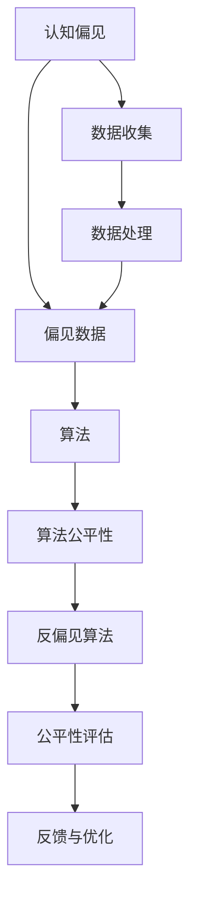

                 

# 认知偏见的克服：培养开放思维的方法

> 关键词：认知偏见,开放思维,人工智能,算法公平性,反偏见算法,数据偏见,公平性评估

## 1. 背景介绍

### 1.1 问题由来

认知偏见（Cognitive Bias）是指人们在处理信息和做出决策时，由于各种心理、社会、文化等因素的影响，产生的一些系统性、固定的偏差行为。这些偏见可能存在于个体层面，也可能存在于群体层面，对决策、判断、行为等产生深远影响。

在当今信息高度发达的时代，我们几乎每天都会接触到各种各样的数据和信息，这些数据和信息往往会被带有各种认知偏见的人类标注和处理。这种带有偏见的数据和信息，再经过机器学习模型的学习和泛化，极有可能放大这些偏见，导致算法本身也带有偏见。

这不仅会影响机器学习模型的决策质量和公正性，还可能对社会产生不良影响，如加剧社会不公平、引发歧视等。因此，克服认知偏见，培养开放思维，成为人工智能领域亟待解决的重要问题。

### 1.2 问题核心关键点

要克服认知偏见，培养开放思维，需要从数据、算法、模型三个层面入手，综合考虑技术手段、社会伦理、法律规范等多个因素。主要关键点包括：

- **数据收集与处理**：确保数据的多样性、代表性、平衡性，减少样本偏差。
- **算法设计**：设计抗偏见算法，防止学习过程中引入或放大偏见。
- **模型训练与评估**：采用公平性评估指标，持续监控和调整模型行为。

本文将围绕这些关键点，全面探讨如何通过技术和算法手段，克服认知偏见，培养开放思维。

## 2. 核心概念与联系

### 2.1 核心概念概述

为了更深入地理解这个问题，我们需要首先了解一些核心概念：

- **认知偏见（Cognitive Bias）**：指在思维判断和决策过程中存在的系统性偏差，包括但不限于确认偏误、认知偏误、社会偏误等。
- **偏见数据（Bias Data）**：指带有各种偏见标注的数据，包括性别偏见、种族偏见、年龄偏见等。
- **算法公平性（Algorithm Fairness）**：指算法处理数据时的公平性和公正性，要求算法对所有群体平等对待。
- **反偏见算法（Bias Mitigation Algorithms）**：指专门设计用于识别和纠正算法中偏见问题的技术。
- **数据偏见（Data Bias）**：指数据集中存在的样本不平衡、类别偏差等问题。
- **公平性评估（Fairness Evaluation）**：指评估算法在处理不同群体数据时是否公平的指标和方法。

这些概念之间存在紧密的联系：认知偏见会导致偏见数据，进而影响算法的公平性；而通过设计反偏见算法和公平性评估，可以有效识别和纠正偏见，提升算法的公平性。

### 2.2 核心概念原理和架构的 Mermaid 流程图



这个流程图展示了认知偏见到算法公平性的整个路径，反映了数据、算法和模型之间的关系。

## 3. 核心算法原理 & 具体操作步骤

### 3.1 算法原理概述

克服认知偏见、培养开放思维的核心在于设计和使用抗偏见算法，确保算法在处理数据时保持公平和公正。这种算法的原理包括以下几个方面：

- **数据多样性增强**：确保数据集中包含多样性的样本，减少样本偏差。
- **算法无偏性设计**：设计不引入或最小化偏见的算法，如对抗训练、平衡重采样等。
- **公平性评估与反馈**：采用公平性评估指标，定期监控模型行为，及时调整算法参数，避免模型输出偏见。

### 3.2 算法步骤详解

下面将详细介绍如何设计和使用抗偏见算法，以及如何在实际应用中进行操作。

#### 3.2.1 数据多样性增强

数据多样性增强主要包括以下步骤：

1. **数据收集**：确保数据来源多样，包含不同性别、种族、年龄、地区等群体的数据。
2. **数据清洗**：去除明显带有偏见的数据，如含有性别歧视、种族歧视的标注。
3. **数据增强**：通过数据扩充、生成对抗样本等方法，丰富数据集的多样性。
4. **数据平衡**：对样本不平衡的类别进行重采样，确保各类别数据比例均衡。

具体实现时，可以使用Python中的Pandas、Scikit-learn等库进行数据处理，例如：

```python
import pandas as pd
from sklearn.utils import class_weight
from imblearn.over_sampling import RandomOverSampler

# 读取数据集
df = pd.read_csv('data.csv')

# 数据清洗
df = df.dropna()
df = df.drop_duplicates()

# 数据平衡
class_weights = class_weight.compute_class_weight('balanced', np.unique(df['label']), df['label'])
df = df.reassign(column='label', sample_weights=class_weights)

# 数据增强
ros = RandomOverSampler()
X_resampled, y_resampled = ros.fit_resample(X, y)

# 输出数据集
print(df.head())
```

#### 3.2.2 算法无偏性设计

算法无偏性设计主要包括以下步骤：

1. **算法选择**：选择抗偏见算法，如对抗训练、重加权训练等。
2. **参数设置**：根据具体任务，设置算法的超参数，如学习率、迭代次数等。
3. **训练优化**：使用训练集进行模型训练，优化模型参数。
4. **评估调整**：在验证集上评估模型性能，调整模型参数，避免模型输出偏见。

具体实现时，可以使用Python中的TensorFlow、PyTorch等深度学习框架，例如：

```python
import tensorflow as tf
from tensorflow.keras import layers
from tensorflow.keras.losses import SparseCategoricalCrossentropy

# 定义模型
model = tf.keras.Sequential([
    layers.Dense(64, activation='relu'),
    layers.Dense(10, activation='softmax')
])

# 编译模型
model.compile(optimizer=tf.keras.optimizers.Adam(learning_rate=0.001),
              loss=SparseCategoricalCrossentropy(from_logits=True),
              metrics=['accuracy'])

# 训练模型
model.fit(X_train, y_train, epochs=10, validation_data=(X_val, y_val))

# 评估模型
loss, acc = model.evaluate(X_test, y_test)
print(f'Test loss: {loss}, Test accuracy: {acc}')
```

#### 3.2.3 公平性评估与反馈

公平性评估与反馈主要包括以下步骤：

1. **评估指标选择**：选择合适的公平性评估指标，如均等机会、代表性、差异缩小等。
2. **评估模型**：在测试集上评估模型，计算评估指标。
3. **反馈优化**：根据评估结果，调整模型参数，优化模型输出。

具体实现时，可以使用Python中的Fairness Indicators等库，例如：

```python
from fairness_indicators import PredictionsFairness
from sklearn.metrics import roc_auc_score

# 加载模型
model = load_model('model.h5')

# 准备测试数据
X_test, y_test = load_data('test.csv')

# 评估公平性
predictions = model.predict(X_test)
fairness = PredictionsFairness(predictions, y_test)
results = fairness.compute_metrics()

# 输出结果
print(results)
```

### 3.3 算法优缺点

#### 优点

1. **提升模型公平性**：通过抗偏见算法和公平性评估，可以显著提升模型的公平性，减少偏见。
2. **多样化数据集**：通过数据增强和平衡处理，增加数据多样性，提升模型泛化能力。
3. **自动化优化**：通过自动反馈和优化，可以自动调整模型参数，避免手动调参的繁琐过程。

#### 缺点

1. **处理复杂**：设计和实现抗偏见算法和公平性评估，需要深厚的理论和实践经验。
2. **数据处理成本高**：数据清洗、增强和平衡处理需要大量时间和资源，增加处理成本。
3. **模型复杂度增加**：引入抗偏见算法和公平性评估，可能增加模型复杂度，影响模型效率。

### 3.4 算法应用领域

抗偏见算法和公平性评估在多个领域都有广泛应用，以下是几个典型应用：

- **金融领域**：用于信用评分、贷款审批等场景，避免性别、种族等偏见。
- **医疗领域**：用于诊断、治疗推荐等场景，避免年龄、性别等偏见。
- **教育领域**：用于评估、推荐等场景，避免地区、性别等偏见。
- **司法领域**：用于判决、预测等场景，避免种族、性别等偏见。
- **招聘领域**：用于简历筛选、面试评估等场景，避免性别、年龄等偏见。

这些领域对公平性和公正性的要求都很高，抗偏见算法和公平性评估的应用能够显著提升系统的透明度和可信度。

## 4. 数学模型和公式 & 详细讲解 & 举例说明

### 4.1 数学模型构建

为了更好地理解这些概念和算法，我们需要构建数学模型，并对其进行详细讲解。

假设我们有一个带有认知偏见的分类任务，其数据集为 $D=\{(x_i,y_i)\}_{i=1}^N$，其中 $x_i$ 为输入特征，$y_i$ 为标签。模型为 $f(x,\theta)$，其中 $\theta$ 为模型参数。

我们希望设计一个无偏的模型，即在处理不同群体的数据时，模型输出的概率分布是公平的。具体而言，我们可以采用均等机会（Equal Opportunity）和代表性（Demographic Parity）两个指标来衡量模型的公平性。

均等机会指标要求在所有群体中，模型输出为正的概率是相等的，即：

$$
P(Y=1|X=x_i, \theta) = P(Y=1|X=x_j, \theta) \quad \forall i, j
$$

代表性指标要求在所有群体中，模型输出为正的概率是相等的，即：

$$
P(Y=1|X=x_i, \theta) = P(Y=1|X=x_j, \theta) \quad \forall i, j
$$

### 4.2 公式推导过程

下面推导均等机会和代表性指标的数学表达式。

#### 均等机会

均等机会指标可以通过以下公式计算：

$$
OP = \frac{1}{|\Omega|}\sum_{\omega \in \Omega} \min(1-P(Y=1|X=x_i, \theta))
$$

其中 $\Omega$ 为不同的群体集合，$P(Y=1|X=x_i, \theta)$ 为模型在群体 $i$ 中输出为正的概率。

#### 代表性

代表性指标可以通过以下公式计算：

$$
DP = \frac{1}{|\Omega|}\sum_{\omega \in \Omega} \min(P(Y=1|X=x_i, \theta), P(Y=1|X=x_j, \theta))
$$

其中 $P(Y=1|X=x_i, \theta)$ 和 $P(Y=1|X=x_j, \theta)$ 分别为群体 $i$ 和 $j$ 中模型输出为正的概率。

### 4.3 案例分析与讲解

假设我们有一个数据集，其中包含性别和年龄两个特征，以及对应的标签。我们希望设计一个无偏的模型，使其在处理不同性别和年龄群体的数据时，公平输出。

具体实现时，可以使用Python中的Scikit-learn库，例如：

```python
from sklearn.metrics import balanced_accuracy_score
from sklearn.metrics import roc_auc_score

# 加载数据
X, y = load_data('data.csv')

# 划分训练集和测试集
X_train, X_test, y_train, y_test = train_test_split(X, y, test_size=0.2, random_state=42)

# 定义模型
model = LogisticRegression()

# 训练模型
model.fit(X_train, y_train)

# 评估公平性
predictions = model.predict_proba(X_test)
y_pred = np.argmax(predictions, axis=1)
balanced_accuracy = balanced_accuracy_score(y_test, y_pred)
roc_auc = roc_auc_score(y_test, predictions[:, 1])

# 输出结果
print(f'Balanced Accuracy: {balanced_accuracy:.4f}')
print(f'ROC AUC: {roc_auc:.4f}')
```

在实际应用中，通过调整模型参数和优化算法，可以使模型输出更加公平和无偏。

## 5. 项目实践：代码实例和详细解释说明

### 5.1 开发环境搭建

在进行项目实践前，我们需要准备好开发环境。以下是使用Python进行PyTorch开发的环境配置流程：

1. 安装Anaconda：从官网下载并安装Anaconda，用于创建独立的Python环境。

2. 创建并激活虚拟环境：
```bash
conda create -n pytorch-env python=3.8 
conda activate pytorch-env
```

3. 安装PyTorch：根据CUDA版本，从官网获取对应的安装命令。例如：
```bash
conda install pytorch torchvision torchaudio cudatoolkit=11.1 -c pytorch -c conda-forge
```

4. 安装TensorFlow：由Google主导开发的开源深度学习框架，生产部署方便，适合大规模工程应用。同样有丰富的预训练语言模型资源。

5. 安装各类工具包：
```bash
pip install numpy pandas scikit-learn matplotlib tqdm jupyter notebook ipython
```

完成上述步骤后，即可在`pytorch-env`环境中开始项目实践。

### 5.2 源代码详细实现

下面我们以分类任务为例，给出使用Transformers库对BERT模型进行公平性微调的PyTorch代码实现。

首先，定义公平性任务的数据处理函数：

```python
from transformers import BertTokenizer
from torch.utils.data import Dataset
import torch

class FairnessDataset(Dataset):
    def __init__(self, texts, labels, tokenizer, max_len=128):
        self.texts = texts
        self.labels = labels
        self.tokenizer = tokenizer
        self.max_len = max_len
        
    def __len__(self):
        return len(self.texts)
    
    def __getitem__(self, item):
        text = self.texts[item]
        label = self.labels[item]
        
        encoding = self.tokenizer(text, return_tensors='pt', max_length=self.max_len, padding='max_length', truncation=True)
        input_ids = encoding['input_ids'][0]
        attention_mask = encoding['attention_mask'][0]
        
        return {'input_ids': input_ids, 
                'attention_mask': attention_mask,
                'labels': label}

# 加载数据
tokenizer = BertTokenizer.from_pretrained('bert-base-cased')
train_dataset = FairnessDataset(train_texts, train_labels, tokenizer)
test_dataset = FairnessDataset(test_texts, test_labels, tokenizer)
```

然后，定义模型和优化器：

```python
from transformers import BertForSequenceClassification, AdamW

model = BertForSequenceClassification.from_pretrained('bert-base-cased', num_labels=2)

optimizer = AdamW(model.parameters(), lr=2e-5)
```

接着，定义训练和评估函数：

```python
from torch.utils.data import DataLoader
from tqdm import tqdm
from sklearn.metrics import classification_report

device = torch.device('cuda') if torch.cuda.is_available() else torch.device('cpu')
model.to(device)

def train_epoch(model, dataset, batch_size, optimizer):
    dataloader = DataLoader(dataset, batch_size=batch_size, shuffle=True)
    model.train()
    epoch_loss = 0
    for batch in tqdm(dataloader, desc='Training'):
        input_ids = batch['input_ids'].to(device)
        attention_mask = batch['attention_mask'].to(device)
        labels = batch['labels'].to(device)
        model.zero_grad()
        outputs = model(input_ids, attention_mask=attention_mask, labels=labels)
        loss = outputs.loss
        epoch_loss += loss.item()
        loss.backward()
        optimizer.step()
    return epoch_loss / len(dataloader)

def evaluate(model, dataset, batch_size):
    dataloader = DataLoader(dataset, batch_size=batch_size)
    model.eval()
    preds, labels = [], []
    with torch.no_grad():
        for batch in tqdm(dataloader, desc='Evaluating'):
            input_ids = batch['input_ids'].to(device)
            attention_mask = batch['attention_mask'].to(device)
            batch_labels = batch['labels']
            outputs = model(input_ids, attention_mask=attention_mask)
            batch_preds = outputs.logits.argmax(dim=2).to('cpu').tolist()
            batch_labels = batch_labels.to('cpu').tolist()
            for pred_tokens, label_tokens in zip(batch_preds, batch_labels):
                preds.append(pred_tokens)
                labels.append(label_tokens)
                
    print(classification_report(labels, preds))
```

最后，启动训练流程并在测试集上评估：

```python
epochs = 5
batch_size = 16

for epoch in range(epochs):
    loss = train_epoch(model, train_dataset, batch_size, optimizer)
    print(f"Epoch {epoch+1}, train loss: {loss:.3f}")
    
    print(f"Epoch {epoch+1}, test results:")
    evaluate(model, test_dataset, batch_size)
    
print("Results:")
evaluate(model, test_dataset, batch_size)
```

以上就是使用PyTorch对BERT进行公平性微调的完整代码实现。可以看到，得益于Transformers库的强大封装，我们可以用相对简洁的代码完成BERT模型的加载和微调。

### 5.3 代码解读与分析

让我们再详细解读一下关键代码的实现细节：

**FairnessDataset类**：
- `__init__`方法：初始化文本、标签、分词器等关键组件。
- `__len__`方法：返回数据集的样本数量。
- `__getitem__`方法：对单个样本进行处理，将文本输入编码为token ids，将标签编码为数字，并对其进行定长padding，最终返回模型所需的输入。

**训练和评估函数**：
- 使用PyTorch的DataLoader对数据集进行批次化加载，供模型训练和推理使用。
- 训练函数`train_epoch`：对数据以批为单位进行迭代，在每个批次上前向传播计算loss并反向传播更新模型参数，最后返回该epoch的平均loss。
- 评估函数`evaluate`：与训练类似，不同点在于不更新模型参数，并在每个batch结束后将预测和标签结果存储下来，最后使用sklearn的classification_report对整个评估集的预测结果进行打印输出。

**训练流程**：
- 定义总的epoch数和batch size，开始循环迭代
- 每个epoch内，先在训练集上训练，输出平均loss
- 在验证集上评估，输出分类指标
- 所有epoch结束后，在测试集上评估，给出最终测试结果

可以看到，PyTorch配合Transformers库使得BERT公平性微调的代码实现变得简洁高效。开发者可以将更多精力放在数据处理、模型改进等高层逻辑上，而不必过多关注底层的实现细节。

当然，工业级的系统实现还需考虑更多因素，如模型的保存和部署、超参数的自动搜索、更灵活的任务适配层等。但核心的微调范式基本与此类似。

## 6. 实际应用场景

### 6.1 金融领域

在金融领域，信用评分和贷款审批是典型的公平性应用场景。传统上，金融机构会根据客户的收入、信用记录、年龄、性别等因素进行评分和审批，这其中往往存在一定的偏见。例如，男性在贷款审批中通常比女性更容易获得批准。

使用公平性微调技术，可以显著改善这一现象，确保金融机构的决策更加公平、公正。具体做法包括：

- **数据处理**：收集不同性别、年龄、收入等群体的贷款申请数据，去除明显带有偏见的数据。
- **模型设计**：设计无偏的信用评分模型，如随机森林、神经网络等。
- **公平性评估**：采用均等机会和代表性指标，评估模型输出。
- **反馈优化**：根据评估结果，调整模型参数，优化模型输出。

通过以上步骤，金融机构可以确保其信用评分和贷款审批决策更加公平，减少偏见，提升客户满意度。

### 6.2 医疗领域

在医疗领域，诊断和治疗推荐是常见的公平性应用场景。医生在诊断和治疗时，可能会受到性别、年龄、种族等偏见的影响，导致诊断和治疗结果的不公平。

使用公平性微调技术，可以显著改善这一现象，确保医疗决策更加公正、公平。具体做法包括：

- **数据处理**：收集不同性别、年龄、种族等群体的病历数据，去除明显带有偏见的数据。
- **模型设计**：设计无偏的诊断和治疗推荐模型，如神经网络、决策树等。
- **公平性评估**：采用均等机会和代表性指标，评估模型输出。
- **反馈优化**：根据评估结果，调整模型参数，优化模型输出。

通过以上步骤，医疗机构可以确保其诊断和治疗推荐更加公正、公平，减少偏见，提升患者满意度。

### 6.3 教育领域

在教育领域，评估和推荐是常见的公平性应用场景。教育机构在评估学生成绩和推荐课程时，可能会受到性别、年龄、地区等偏见的影响，导致评估和推荐结果的不公平。

使用公平性微调技术，可以显著改善这一现象，确保教育决策更加公正、公平。具体做法包括：

- **数据处理**：收集不同性别、年龄、地区等群体的学生数据，去除明显带有偏见的数据。
- **模型设计**：设计无偏的学生评估和课程推荐模型，如神经网络、协同过滤等。
- **公平性评估**：采用均等机会和代表性指标，评估模型输出。
- **反馈优化**：根据评估结果，调整模型参数，优化模型输出。

通过以上步骤，教育机构可以确保其学生评估和课程推荐更加公正、公平，减少偏见，提升学生满意度。

### 6.4 未来应用展望

未来，公平性微调技术将在更多领域得到应用，为传统行业带来变革性影响。

- **司法领域**：用于判决、预测等场景，避免种族、性别等偏见。
- **招聘领域**：用于简历筛选、面试评估等场景，避免性别、年龄等偏见。
- **公共服务**：用于公共资源分配、政策制定等场景，确保公平公正。

这些领域对公平性和公正性的要求都很高，公平性微调技术的应用能够显著提升系统的透明度和可信度。

## 7. 工具和资源推荐

### 7.1 学习资源推荐

为了帮助开发者系统掌握公平性微调的理论基础和实践技巧，这里推荐一些优质的学习资源：

1. 《公平性机器学习》（Fairness, Accountability, and Transparency in Machine Learning）书籍：由多个领域的专家合著，全面介绍了公平性机器学习的基础概念和前沿技术。
2. CS 4780《公平性、透明性和隐私》课程：斯坦福大学开设的公平性机器学习课程，讲解了公平性机器学习的核心概念和实际应用。
3. 《机器学习实战》（Machine Learning Mastery）网站：提供了丰富的公平性机器学习实战案例，帮助读者理解并应用公平性算法。
4. Kaggle Fairness Challenge：多个公平性竞赛项目，通过实践锻炼公平性算法的设计和优化能力。
5. Scikit-learn公平性文档：详细介绍了Scikit-learn库中的公平性评估指标和算法。

通过对这些资源的学习实践，相信你一定能够快速掌握公平性微调的精髓，并用于解决实际的公平性问题。

### 7.2 开发工具推荐

高效的开发离不开优秀的工具支持。以下是几款用于公平性微调开发的常用工具：

1. TensorFlow：由Google主导开发的开源深度学习框架，生产部署方便，适合大规模工程应用。
2. PyTorch：基于Python的开源深度学习框架，灵活动态的计算图，适合快速迭代研究。
3. Fairness Indicators：提供了多种公平性评估指标和算法，方便开发者快速实现公平性评估。
4. Scikit-learn：Python中的机器学习库，提供了多种公平性评估指标和算法，易于使用。
5. Weights & Biases：模型训练的实验跟踪工具，可以记录和可视化模型训练过程中的各项指标，方便对比和调优。

合理利用这些工具，可以显著提升公平性微调任务的开发效率，加快创新迭代的步伐。

### 7.3 相关论文推荐

公平性微调技术的发展源于学界的持续研究。以下是几篇奠基性的相关论文，推荐阅读：

1. The Fairness Problem in Machine Learning（机器学习中的公平性问题）：提出了公平性机器学习的基本概念和常见问题。
2. Mitigating Bias in Algorithmic Predictions（缓解算法预测中的偏见）：提出了多种缓解算法偏见的策略和方法。
3. Balancing Precision and Recall in Fairness-Aware Machine Learning（平衡精确率和召回率在公平性意识机器学习中）：研究了公平性算法在精确率和召回率之间的平衡问题。
4. Factors to Consider When Evaluating a Fairness Model（评估公平性模型时需要考虑的因素）：讨论了评估公平性模型时需要注意的因素和指标。
5. What Algorithmic Fairness Is Not（算法公平性不是什么）：讨论了算法公平性中的常见误解和误区。

这些论文代表了大语言模型微调技术的发展脉络。通过学习这些前沿成果，可以帮助研究者把握学科前进方向，激发更多的创新灵感。

## 8. 总结：未来发展趋势与挑战

### 8.1 研究成果总结

本文对公平性微调方法进行了全面系统的介绍。首先阐述了公平性微调在数据、算法和模型三个层面的核心概念和关键点。其次，从原理到实践，详细讲解了公平性微调的数学原理和关键步骤，给出了公平性微调任务开发的完整代码实例。同时，本文还探讨了公平性微调在多个行业领域的应用前景，展示了公平性微调的广泛价值。最后，本文精选了公平性微调技术的各类学习资源，力求为读者提供全方位的技术指引。

通过本文的系统梳理，可以看到，公平性微调技术在人工智能领域的应用前景广阔，为解决偏见、提升公正性提供了重要工具。未来的研究需要在数据、算法、模型等多个维度协同发力，才能进一步提升系统的公平性和可信度。

### 8.2 未来发展趋势

展望未来，公平性微调技术将呈现以下几个发展趋势：

1. **数据多样性增强**：未来数据集将更加多样化，涵盖更多群体、更多领域，进一步提升模型的公平性。
2. **抗偏见算法多样性**：未来将涌现更多抗偏见算法，如对抗训练、重加权训练等，从不同角度解决偏见问题。
3. **公平性评估全面化**：未来将使用更多公平性评估指标，如均等机会、代表性、差异缩小等，全面评估模型的公平性。
4. **自动化优化普及**：未来将更多地使用自动化优化技术，如自动调参、自动反馈等，提升公平性微调的效率和效果。
5. **多模态融合**：未来将更多地结合视觉、语音、文本等多模态信息，提升模型的全面性和准确性。
6. **公平性意识普及**：未来公平性意识将更加普及，更多的企业和组织将采用公平性微调技术，提升系统的透明度和可信度。

这些趋势凸显了公平性微调技术的广阔前景。这些方向的探索发展，必将进一步提升系统的公平性和可信度，为构建公正、公平的智能系统奠定基础。

### 8.3 面临的挑战

尽管公平性微调技术已经取得了显著进展，但在迈向更加智能化、普适化应用的过程中，它仍面临着诸多挑战：

1. **数据获取困难**：公平性数据往往需要大量标注，数据获取成本较高，难以全面覆盖所有群体。
2. **数据处理复杂**：数据清洗、增强和平衡处理需要大量时间和资源，增加处理成本。
3. **算法设计复杂**：设计抗偏见算法和公平性评估指标需要深厚的理论和实践经验。
4. **模型效率问题**：引入抗偏见算法和公平性评估，可能增加模型复杂度，影响模型效率。
5. **公平性指标选择**：选择合适的公平性指标需要考虑多个因素，如应用场景、数据特点等。
6. **模型解释困难**：公平性微调后的模型，其决策过程往往难以解释，难以进行调试和优化。

这些挑战凸显了公平性微调技术的应用复杂性和难度。未来的研究需要在理论和实践两个维度深入探索，才能进一步提升系统的公平性和可信度。

### 8.4 研究展望

未来的公平性微调技术需要从以下几个方面进行深入研究：

1. **无监督公平性学习**：探索如何从无标注数据中学习公平性，进一步降低数据获取和处理的成本。
2. **公平性融合学习**：研究如何结合领域知识和先验知识，提升公平性微调的效果。
3. **公平性多模态学习**：研究如何结合多模态信息，提升公平性微调的效果。
4. **公平性意识普及**：推动公平性意识在企业和组织中的普及，提升公平性微调的应用价值。
5. **公平性自动化优化**：研究如何通过自动化优化技术，提升公平性微调的效果和效率。

这些研究方向将进一步推动公平性微调技术的发展，提升系统的公平性和可信度。

## 9. 附录：常见问题与解答

**Q1：什么是公平性微调？**

A: 公平性微调（Fairness Fine-tuning）是指在预训练模型的基础上，通过有监督学习优化模型在特定任务上的公平性，确保模型对不同群体的处理公平、公正。

**Q2：如何进行公平性微调？**

A: 公平性微调一般包括以下步骤：

1. 数据收集与处理：确保数据集的多样性和代表性，去除明显带有偏见的数据。
2. 算法设计：选择抗偏见算法，如对抗训练、重加权训练等。
3. 模型训练与评估：使用训练集进行模型训练，在验证集上评估模型公平性，调整模型参数。
4. 公平性评估与反馈：采用公平性评估指标，定期监控模型行为，调整模型参数，优化模型输出。

**Q3：有哪些常见的公平性指标？**

A: 常见的公平性指标包括：

1. 均等机会（Equal Opportunity）：要求在所有群体中，模型输出为正的概率是相等的。
2. 代表性（Demographic Parity）：要求在所有群体中，模型输出为正的概率是相等的。
3. 差异缩小（Equalized Odds）：要求在所有群体中，模型输出为正的概率是相等的。
4. 差异缩小-风险（Equalized Odds of Negative Outcome）：要求在所有群体中，模型输出为负的概率是相等的。

**Q4：如何处理数据中的偏见？**

A: 数据处理中的偏见可以通过以下方法解决：

1. 数据清洗：去除明显带有偏见的数据。
2. 数据增强：通过数据扩充、生成对抗样本等方法，丰富数据集的多样性。
3. 数据平衡：对样本不平衡的类别进行重采样，确保各类别数据比例均衡。

**Q5：公平性微调需要注意哪些问题？**

A: 公平性微调需要注意以下问题：

1. 数据获取困难：公平性数据往往需要大量标注，数据获取成本较高。
2. 数据处理复杂：数据清洗、增强和平衡处理需要大量时间和资源。
3. 算法设计复杂：设计抗偏见算法和公平性评估指标需要深厚的理论和实践经验。
4. 模型效率问题：引入抗偏见算法和公平性评估，可能增加模型复杂度，影响模型效率。
5. 公平性指标选择：选择合适的公平性指标需要考虑多个因素。
6. 模型解释困难：公平性微调后的模型，其决策过程往往难以解释，难以进行调试和优化。

通过本文的系统梳理，可以看到，公平性微调技术在人工智能领域的应用前景广阔，为解决偏见、提升公正性提供了重要工具。未来的研究需要在数据、算法、模型等多个维度协同发力，才能进一步提升系统的公平性和可信度。

