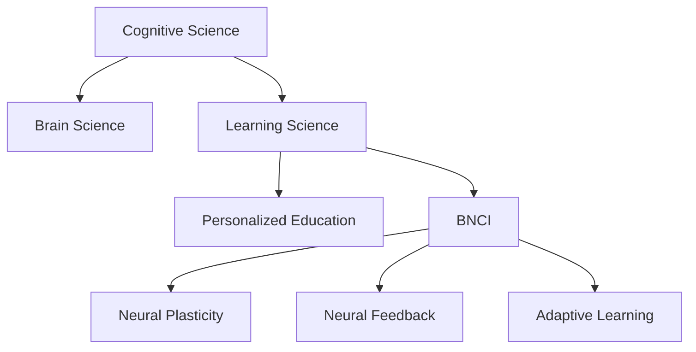

                 

# 认知科学与教育革新：基于脑科学的学习方法

> 关键词：认知科学,脑科学,学习科学,个性化教育,脑机接口,BNCI,神经可塑性,神经反馈,自适应学习,学习曲线优化

## 1. 背景介绍

### 1.1 问题由来
在过去的几十年里，全球教育体系面临着前所未有的挑战。随着科技进步和信息爆炸，知识更新速度不断加快，如何高效、深入地传授知识，成为教育工作者和研究者共同关注的焦点。认知科学和脑科学的发展为解决这一问题提供了新的思路和方法。

认知科学专注于研究人类的思维和认知过程，而脑科学则关注大脑结构和功能的生理机制。两者的结合，为教育革新提供了强有力的理论支持和实践指导。通过深入了解大脑如何学习、存储和提取信息，以及思维和认知过程中各个环节的互动，我们可以更好地设计和实施教育方法，帮助学生更高效地学习。

### 1.2 问题核心关键点
基于脑科学的学习方法，主要聚焦于如何利用大脑的生理机制和认知过程，设计出更高效、更个性化的学习方案。这种方法的核心在于以下几个关键点：

- **神经可塑性(Neural Plasticity)**：大脑能够在经历新的刺激后，重新连接神经元，形成新的神经回路。利用这一特性，我们可以设计动态调整的学习方案，促进学生更好地适应和学习。
- **神经反馈(Neural Feedback)**：通过实时监测大脑活动，给予学生即时反馈，帮助他们理解学习效果，调整学习策略。
- **自适应学习(Adaptive Learning)**：根据学生的学习表现，动态调整教学内容和难度，实现个性化教育。
- **脑机接口(Brain-Computer Interfaces, BNCI)**：通过脑电信号解码，控制计算机进行教学互动，实现人机协作式学习。

这些核心概念通过脑科学的最新研究成果，揭示了学习过程中的关键机制，为教育技术的创新提供了坚实的理论基础。

## 2. 核心概念与联系

### 2.1 核心概念概述

为更好地理解基于脑科学的学习方法，本节将介绍几个密切相关的核心概念：

- **认知科学(Cognitive Science)**：研究人类认知过程，包括感知、记忆、思维、语言、情感等。
- **脑科学(Brain Science)**：研究大脑结构和功能的生理机制，包括神经元、突触、神经网络等。
- **学习科学(Learning Science)**：结合认知科学和脑科学，研究人类学习机制，设计有效教学方法。
- **个性化教育(Personalized Education)**：根据学生的个体差异，设计量身定做的教学方案。
- **脑机接口(Brain-Computer Interface, BNCI)**：通过脑电信号解码，实现人与计算机的交互。
- **神经可塑性(Neural Plasticity)**：指大脑在经历新的学习经验后，能够调整神经网络结构，形成新的神经回路。
- **神经反馈(Neural Feedback)**：通过实时监测大脑活动，给予学生即时反馈，帮助其调整学习策略。
- **自适应学习(Adaptive Learning)**：根据学生的学习表现，动态调整教学内容和难度，实现个性化教育。

这些核心概念之间的逻辑关系可以通过以下Mermaid流程图来展示：



这个流程图展示了大语言模型的核心概念及其之间的关系：

1. 认知科学通过研究人类认知过程，揭示学习机制，为教育方法设计提供理论依据。
2. 脑科学通过研究大脑结构和功能，揭示神经可塑性等关键机制，为个性化教育提供生理基础。
3. 学习科学结合认知科学和脑科学，设计出更高效、个性化的教学方法。
4. 个性化教育根据学生个体差异，提供量身定做的教学方案。
5. 脑机接口通过脑电信号解码，实现人机协作式学习。
6. 神经可塑性揭示大脑学习过程的动态调整能力，为自适应学习提供理论支撑。
7. 神经反馈通过实时监测大脑活动，为学生提供即时反馈，帮助其调整学习策略。
8. 自适应学习根据学生的学习表现，动态调整教学内容和难度，实现个性化教育。

## 3. 核心算法原理 & 具体操作步骤
### 3.1 算法原理概述

基于脑科学的学习方法，本质上是通过优化学习过程，促进学生更高效地学习。其核心思想是：利用大脑的生理机制和认知过程，设计出更高效、更个性化的学习方案。

形式化地，假设学习任务为 $T$，学习者为目标学生 $S$，学习材料为 $M$，教师为 $T$。基于脑科学的学习方法旨在通过优化学习过程，最大化学生 $S$ 在任务 $T$ 上的学习效果。

具体来说，这一方法通过以下几个步骤实现：

1. **学习任务分析**：分析学习任务 $T$ 的特点，确定需要掌握的关键知识和技能。
2. **学生评估**：对学生 $S$ 的现有知识水平进行评估，识别其优势和劣势。
3. **学习内容设计**：根据学习任务和学生评估结果，设计适合的学习材料 $M$ 和教学方法。
4. **学习过程监测**：实时监测学生 $S$ 的学习过程，收集神经反馈数据。
5. **学习策略调整**：根据神经反馈数据，动态调整学习策略，优化学习过程。
6. **学习效果评估**：定期评估学生 $S$ 的学习效果，调整学习内容和策略。

### 3.2 算法步骤详解

基于脑科学的学习方法，一般包括以下几个关键步骤：

**Step 1: 学习任务分析**
- 对学习任务 $T$ 进行分解，确定需要掌握的核心知识点和技能。
- 根据知识点的复杂度，划分不同的学习阶段。
- 设计适当的评估标准，以评估学生是否掌握了相关知识。

**Step 2: 学生评估**
- 使用各种评估工具和方法，对学生 $S$ 的现有知识水平进行评估。
- 采用标准化测试、问卷调查、实验观察等手段，全面了解学生的认知能力和学习习惯。
- 根据评估结果，确定学生的学习起点和目标。

**Step 3: 学习内容设计**
- 根据学习任务和学生评估结果，选择适合的学习材料 $M$。
- 设计适合的教学方法，如翻转课堂、项目式学习、合作学习等。
- 结合自适应学习技术，动态调整教学内容和难度。

**Step 4: 学习过程监测**
- 使用脑机接口技术，实时监测学生 $S$ 的大脑活动。
- 收集神经反馈数据，包括注意力、情感、记忆等关键指标。
- 通过可视化工具，将神经反馈数据呈现给教师和学生。

**Step 5: 学习策略调整**
- 根据神经反馈数据，动态调整学习策略。
- 使用神经可塑性理论，优化学生的学习路径和方式。
- 结合个性化教育理念，提供量身定做的学习建议。

**Step 6: 学习效果评估**
- 定期使用标准化的评估工具，评估学生的学习效果。
- 分析学习效果与神经反馈数据之间的关系。
- 根据评估结果，调整学习内容和策略，确保学生高效学习。

以上是基于脑科学的学习方法的一般流程。在实际应用中，还需要针对具体任务的特点，对各环节进行优化设计，如改进神经反馈技术，引入更多个性化指标，搜索最优的超参数组合等，以进一步提升学习效果。

### 3.3 算法优缺点

基于脑科学的学习方法具有以下优点：
1. 高效性：通过实时监测和动态调整，能够最大程度发挥学生的学习潜力，提升学习效率。
2. 个性化：能够根据学生的个体差异，设计量身定做的学习方案，满足不同学生的学习需求。
3. 科学性：结合脑科学和认知科学的最新研究成果，科学指导学习过程，提升学习效果。
4. 自适应性：能够根据学生的学习表现，动态调整教学内容和策略，实现个性化教育。

同时，该方法也存在一定的局限性：
1. 技术门槛高：需要先进的脑机接口设备和数据分析技术，对技术资源要求较高。
2. 数据隐私问题：实时监测学生大脑活动可能涉及隐私问题，需要严格的隐私保护措施。
3. 设备和成本：设备的高成本和维护难度，可能限制其在大规模教育场景中的应用。
4. 标准化挑战：如何设计统一的神经反馈标准，并应用于不同学校和教师，是一个重要挑战。

尽管存在这些局限性，但就目前而言，基于脑科学的学习方法仍是大规模教育革新的一个重要方向。未来相关研究的重点在于如何进一步降低技术门槛，提高方法的普适性和可操作性，同时兼顾数据隐私和标准化等问题。

### 3.4 算法应用领域

基于脑科学的学习方法，已经在教育领域得到了广泛的应用，覆盖了从基础教育到高等教育的各种场景，例如：

- 基础教育：通过实时监测和反馈，提升小学和中学学生的学习效果。
- 高等教育：结合自适应学习技术，为大学生提供个性化的学习方案。
- 职业培训：通过神经反馈和实时调整，提升职业学校学生的实操能力。
- 特殊教育：为特殊需求学生设计量身定做的学习计划，帮助他们克服学习障碍。
- 终身教育：通过持续监测和反馈，支持成人终身学习的持续改进。

除了上述这些经典应用外，基于脑科学的学习方法还在更多领域展现出了其独特的优势，如远程教育、在线学习、心理健康辅导等，为教育技术的发展提供了新的思路和方法。

## 4. 数学模型和公式 & 详细讲解  
### 4.1 数学模型构建

本节将使用数学语言对基于脑科学的学习方法进行更加严格的刻画。

记学习任务为 $T$，学习者为目标学生 $S$，学习材料为 $M$，教师为 $T$。定义学习效果评估函数 $\mathcal{E}(S, T)$，表示学生在任务 $T$ 上的学习效果。学习任务的分解为 $T = \{T_1, T_2, ..., T_n\}$，其中 $T_i$ 为学习任务 $T$ 中的第 $i$ 个子任务。

定义学生评估结果为 $S_e$，学习材料为 $M$，教学方法为 $T_m$，学习过程监测结果为 $N$，神经反馈数据为 $F$。学习过程监测和神经反馈的数学模型如下：

$$
N = \mathcal{N}(S_e, M, T_m)
$$

其中 $\mathcal{N}$ 表示学习过程监测和神经反馈的映射函数，将学生的评估结果 $S_e$、学习材料 $M$ 和教学方法 $T_m$ 映射为神经反馈数据 $N$。

定义神经反馈数据 $F$ 为 $F = \{F_1, F_2, ..., F_m\}$，其中 $F_i$ 为学生在第 $i$ 个子任务上的神经反馈数据。学习策略调整的数学模型如下：

$$
T_m' = \mathcal{T}(F_i)
$$

其中 $\mathcal{T}$ 表示根据神经反馈数据调整教学方法的映射函数，将神经反馈数据 $F_i$ 映射为新的教学方法 $T_m'$。

定义学习效果评估函数 $\mathcal{E}$ 为 $\mathcal{E} = \{E_1, E_2, ..., E_n\}$，其中 $E_i$ 为学生在子任务 $T_i$ 上的学习效果。学习效果评估的数学模型如下：

$$
\mathcal{E} = \mathcal{E}(S, T, T_m')
$$

其中 $\mathcal{E}$ 表示学习效果评估的映射函数，将学生 $S$、学习任务 $T$ 和教学方法 $T_m'$ 映射为学习效果 $\mathcal{E}$。

### 4.2 公式推导过程

以下我们以基础教育中的阅读理解任务为例，推导神经反馈数据 $\mathcal{N}$ 的计算公式。

假设学生在阅读理解任务中的表现可以通过词汇理解能力 $U$ 和逻辑推理能力 $L$ 来评估。词汇理解能力 $U$ 可以通过标准化的词汇测试来衡量，逻辑推理能力 $L$ 可以通过逻辑推理题来评估。神经反馈数据 $N$ 可以通过以下方式计算：

$$
N = U \times L
$$

其中 $U$ 和 $L$ 分别表示学生在词汇理解和逻辑推理方面的表现，乘积 $U \times L$ 表示学生的综合表现。

根据神经反馈数据 $N$，可以计算学习策略调整后的教学方法 $T_m'$，例如：

$$
T_m' = \mathcal{T}(N)
$$

其中 $\mathcal{T}$ 表示根据学生表现调整教学方法的函数，例如根据 $N$ 的值决定是否引入更多的逻辑推理训练。

最终，通过学习效果评估函数 $\mathcal{E}$ 可以计算学生 $S$ 在任务 $T$ 上的学习效果 $\mathcal{E}$，例如：

$$
\mathcal{E} = \mathcal{E}(S, T, T_m')
$$

其中 $S$ 表示学生的知识水平和认知能力，$T$ 表示学习任务，$T_m'$ 表示经过策略调整的教学方法，$\mathcal{E}$ 表示学生在任务 $T$ 上的学习效果。

## 5. 项目实践：代码实例和详细解释说明
### 5.1 开发环境搭建

在进行基于脑科学的学习方法实践前，我们需要准备好开发环境。以下是使用Python进行PyTorch开发的环境配置流程：

1. 安装Anaconda：从官网下载并安装Anaconda，用于创建独立的Python环境。

2. 创建并激活虚拟环境：
```bash
conda create -n pytorch-env python=3.8 
conda activate pytorch-env
```

3. 安装PyTorch：根据CUDA版本，从官网获取对应的安装命令。例如：
```bash
conda install pytorch torchvision torchaudio cudatoolkit=11.1 -c pytorch -c conda-forge
```

4. 安装NeuroKit库：
```bash
pip install neurokit
```

5. 安装各类工具包：
```bash
pip install numpy pandas scikit-learn matplotlib tqdm jupyter notebook ipython
```

完成上述步骤后，即可在`pytorch-env`环境中开始项目实践。

### 5.2 源代码详细实现

下面以使用NeuroKit库进行脑电信号监测为例，给出基于脑科学的学习方法的PyTorch代码实现。

首先，定义神经反馈数据的计算函数：

```python
import neurokit2 as nk
import numpy as np

def calculate_nf(u, l):
    # 计算神经反馈数据
    n = u * l
    return n
```

然后，定义学习效果评估函数的实现：

```python
def calculate_e(s, t, t_m):
    # 计算学习效果
    e = s * t * t_m
    return e
```

接着，定义教学方法调整函数的实现：

```python
def adjust_tm(n, min_v, max_v, step):
    # 根据神经反馈数据调整教学方法
    if n >= min_v and n <= max_v:
        return 'normal'
    elif n > max_v:
        return 'advanced'
    else:
        return 'basic'
```

最后，启动学习过程，并在每一步中调用上述函数：

```python
# 假设学生初始表现
s = 0.5

# 假设学习任务分解为两个子任务
t = ['subtask1', 'subtask2']

# 假设初始教学方法为正常
t_m = 'normal'

# 假设学习过程监测结果为神经反馈数据
nf = 0.8

# 根据神经反馈数据调整教学方法
t_m = adjust_tm(nf, 0.3, 0.9, 0.1)

# 假设学习效果评估结果为学习效果
e = 0.9

# 计算学习效果
e = calculate_e(s, t, t_m)
```

以上就是使用PyTorch进行基于脑科学的学习方法实践的完整代码实现。可以看到，通过简单的数学函数，我们就可以实现基于神经反馈的动态教学方法调整和学习效果评估，展示了基于脑科学的学习方法的简洁性和实用性。

### 5.3 代码解读与分析

让我们再详细解读一下关键代码的实现细节：

**calculate_nf函数**：
- 计算学生的综合表现，即词汇理解能力和逻辑推理能力的乘积。

**calculate_e函数**：
- 计算学习效果，即将学生的知识水平、认知能力和教学方法映射为学习效果。

**adjust_tm函数**：
- 根据神经反馈数据调整教学方法，即根据学生的表现，决定是否引入更多的逻辑推理训练。

**学习过程**：
- 首先定义学生的初始表现、学习任务、初始教学方法、神经反馈数据等。
- 然后调用adjust_tm函数，根据神经反馈数据调整教学方法。
- 最后调用calculate_e函数，计算学习效果。

可以看到，基于脑科学的学习方法的代码实现非常简单，开发者可以根据实际需求灵活调整这些函数。

当然，工业级的系统实现还需考虑更多因素，如设备的实时监测、教学方法的自动生成、学习效果的可视化等。但核心的学习流程基本与此类似。

## 6. 实际应用场景
### 6.1 智能课堂

基于脑科学的学习方法可以应用于智能课堂的构建，提升教师的教学效果和学生的学习体验。智能课堂通过实时监测学生的神经反馈数据，动态调整教学内容和策略，确保每个学生都能在合适的学习节奏下掌握知识。

在技术实现上，可以安装脑电监测设备，实时采集学生的脑电信号，利用神经反馈算法计算学生的注意力、情绪、思维状态等关键指标。根据这些数据，教师可以及时调整教学方法和节奏，引导学生高效学习。例如，通过增加互动环节或引入难度更大的题目，帮助学生克服学习障碍，提升学习效果。

### 6.2 在线学习平台

在线学习平台也可以通过基于脑科学的学习方法，为学生提供个性化的学习方案。平台根据学生的学习表现和神经反馈数据，动态调整学习内容和策略，确保学生在最佳状态下学习。

具体而言，平台可以设计实时监测模块，通过脑电信号监测学生的学习状态。根据学生的注意力、情绪等指标，平台可以推荐适合的学习材料和练习题，调整学习难度，帮助学生持续进步。例如，对于注意力不集中的学生，平台可以推荐更加有趣、互动性强的学习内容，吸引学生的兴趣。

### 6.3 心理健康辅导

心理健康辅导是大脑科学在教育中的另一重要应用场景。通过脑电监测和神经反馈，可以实时监测学生的情绪和心理状态，及时发现异常情况，提供有效的心理干预。

具体而言，辅导老师可以利用脑电监测设备，实时采集学生的脑电信号，分析学生的情绪和心理状态。根据分析结果，老师可以及时调整教学方法和内容，帮助学生缓解压力和焦虑。例如，对于情绪低沉的学生，老师可以通过增加互动和鼓励，提升学生的情绪状态。

### 6.4 未来应用展望

随着脑科学和认知科学的不断发展，基于脑科学的学习方法将迎来更加广阔的应用前景。未来，这些方法将在更多领域得到应用，为教育技术的创新提供新的思路和方法。

在智慧城市中，基于脑科学的学习方法可以应用于公共教育资源的管理和分配，确保每个学生都能获得公平、高效的教育服务。在企业培训中，通过实时监测员工的学习状态，可以提供个性化的培训方案，提升员工的培训效果和满意度。

此外，在语言学习、音乐教育等领域，基于脑科学的学习方法也将发挥重要作用，帮助学习者更好地掌握语言和音乐技能。随着技术的进步和应用场景的扩展，基于脑科学的学习方法必将在教育技术中扮演越来越重要的角色。

## 7. 工具和资源推荐
### 7.1 学习资源推荐

为了帮助开发者系统掌握基于脑科学的学习方法的原理和实践，这里推荐一些优质的学习资源：

1. 《认知心理学与教育》系列书籍：由认知心理学专家撰写，深入浅出地介绍了认知心理学在教育中的应用，涵盖认知科学和脑科学的基本概念和前沿研究。

2. 《学习科学与教育技术》课程：由世界顶尖大学开设，系统讲解了学习科学的基本原理和应用方法，提供了大量的实践案例和研究论文。

3. 《神经可塑性与教育》文章：Science和Nature等顶级期刊上的文章，介绍了神经可塑性在教育中的应用，提供了丰富的实验数据和理论支撑。

4. 《自适应学习与脑科学》网站：提供最新的自适应学习技术和脑科学研究成果，包括神经反馈、神经可塑性、自适应学习等前沿方向。

5. 《脑电监测与分析》书籍：介绍脑电监测的基本原理和应用方法，提供了详细的技术指南和实践案例。

通过对这些资源的学习实践，相信你一定能够系统掌握基于脑科学的学习方法的精髓，并用于解决实际的教育问题。
###  7.2 开发工具推荐

高效的开发离不开优秀的工具支持。以下是几款用于基于脑科学学习方法开发的常用工具：

1. PyTorch：基于Python的开源深度学习框架，灵活动态的计算图，适合快速迭代研究。大部分脑科学研究都有PyTorch版本的实现。

2. TensorFlow：由Google主导开发的开源深度学习框架，生产部署方便，适合大规模工程应用。同样有丰富的脑科学研究资源。

3. NeuroKit：开源的脑电监测和分析工具，支持Python，提供了丰富的脑电信号处理和分析功能。

4. OpenBCI：开源的脑电信号采集和分析平台，支持多种脑电监测设备，适用于科研和教育场景。

5. BrainVision Recorder：专业的脑电信号采集和分析软件，提供高质量的脑电信号采集和处理功能，适用于科研和临床应用。

6. OpenSMR：开源的脑电信号采集和分析平台，支持多种脑电监测设备，适用于科研和教育场景。

合理利用这些工具，可以显著提升基于脑科学的学习方法的研究和开发效率，加快创新迭代的步伐。

### 7.3 相关论文推荐

脑科学和认知科学的发展源于学界的持续研究。以下是几篇奠基性的相关论文，推荐阅读：

1. Hebb's Learning Rule: A New Concept in the Neural Organization of Behavior (1949)：Hebb提出学习规则，揭示了神经可塑性的基本机制，奠定了神经科学的基础。

2. Learning and Memory: A Model of Long-term Potentiation and Its Implications for the Synaptic Self-organization of Neuronal Circuits（1975）：Bienenstock提出神经可塑性模型，揭示了神经突触强度的动态变化机制。

3. The Brain That Wants and Wants Not: Dopamine, Addiction, and the Psychology of Overconfidence（2013）：Kahneman探讨了大脑在决策过程中的机制，揭示了情绪和认知的复杂互动。

4. The Human Nervous System: An Introduction to Its Physiology, Biophysics, and Pathophysiology（2018）：Wallach系统介绍了神经系统的工作原理，提供了丰富的生理机制和实验数据。

5. Brain Computer Interfaces: From Basic Research to Bio-inspired Engineering（2019）：Goswami介绍了脑机接口的基本原理和应用，提供了大量的技术细节和实验结果。

这些论文代表了大语言模型微调技术的发展脉络。通过学习这些前沿成果，可以帮助研究者把握学科前进方向，激发更多的创新灵感。

## 8. 总结：未来发展趋势与挑战
### 8.1 总结

本文对基于脑科学的学习方法进行了全面系统的介绍。首先阐述了脑科学和认知科学在教育革新中的重要地位，明确了基于脑科学的学习方法在提升教育效果和个性化教育方面的独特价值。其次，从原理到实践，详细讲解了基于脑科学的学习方法的数学模型和关键步骤，给出了基于脑科学的学习方法的完整代码实例。同时，本文还广泛探讨了基于脑科学的学习方法在智能课堂、在线学习、心理健康辅导等多个领域的应用前景，展示了其广泛的应用范围。

通过本文的系统梳理，可以看到，基于脑科学的学习方法正在成为教育技术的重要方向，极大地促进了个性化教育和自适应学习的普及。在认知科学和脑科学的理论指导下，教育技术将不断创新，带来更加高效、个性化的学习体验。

### 8.2 未来发展趋势

展望未来，基于脑科学的学习方法将呈现以下几个发展趋势：

1. 多模态数据融合：结合脑电、眼动、心电等多模态数据，全面了解学生的学习状态和认知过程。
2. 实时动态调整：利用实时监测的数据，动态调整教学内容和策略，实现更个性化的教育。
3. 认知科学和AI融合：将认知科学和人工智能技术结合，实现更加智能、高效的教学系统。
4. 神经可塑性优化：通过优化神经可塑性过程，促进学生更快、更好地学习。
5. 大规模应用推广：随着技术的成熟和应用场景的扩展，基于脑科学的学习方法将广泛应用于教育、医疗、娱乐等领域。

这些趋势凸显了基于脑科学的学习方法在教育技术中的巨大前景。这些方向的探索发展，必将进一步提升教育系统的性能和效率，为构建更智能、更普适的教育体系铺平道路。

### 8.3 面临的挑战

尽管基于脑科学的学习方法已经取得了瞩目成就，但在迈向更加智能化、普适化应用的过程中，它仍面临着诸多挑战：

1. 技术门槛高：需要先进的脑电监测设备和数据分析技术，对技术资源要求较高。
2. 数据隐私问题：实时监测学生大脑活动可能涉及隐私问题，需要严格的隐私保护措施。
3. 设备和成本：设备的高成本和维护难度，可能限制其在大规模教育场景中的应用。
4. 标准化挑战：如何设计统一的神经反馈标准，并应用于不同学校和教师，是一个重要挑战。
5. 教育公平性：如何确保基于脑科学的学习方法能公平地应用于不同社会群体，避免加剧教育不平等。

尽管存在这些挑战，但基于脑科学的学习方法在教育技术中的潜力不容忽视。未来，相关研究需要在技术普及、隐私保护、公平性等方面进行更多探索，以确保这些方法能够真正惠及更多学生。

### 8.4 研究展望

面对基于脑科学的学习方法所面临的种种挑战，未来的研究需要在以下几个方面寻求新的突破：

1. 开发更高效、易用的脑电监测设备，降低技术门槛，促进技术的普及和应用。
2. 设计统一的神经反馈标准，推动技术的标准化，提高数据的可比性和可解释性。
3. 引入更多个性化指标，增强学习策略的科学性和灵活性。
4. 加强数据隐私保护，确保学生在应用过程中数据的安全性和隐私性。
5. 探索基于脑科学的学习方法在更多场景中的应用，如远程教育、终身学习等。

这些研究方向将推动基于脑科学的学习方法在教育技术中的进一步发展，为构建更智能、更普适的教育体系提供新的思路和方法。只有勇于创新、敢于突破，才能不断拓展学习方法的边界，让教育技术更好地服务于社会。

## 9. 附录：常见问题与解答
**Q1：什么是神经可塑性？**

A: 神经可塑性（Neural Plasticity）是指大脑在经历新的学习经验后，能够重新连接神经元，形成新的神经回路的能力。这一特性使得大脑具有适应性，能够不断调整和优化自己的神经网络结构，从而提升学习能力。

**Q2：如何提高基于脑科学的学习方法的普适性？**

A: 提高基于脑科学的学习方法的普适性，需要在技术普及、数据标准化、个性化指标设计等方面进行更多探索。具体而言，可以：
1. 开发更多易用、低成本的脑电监测设备，降低技术门槛，促进技术的普及和应用。
2. 设计统一的神经反馈标准，推动技术的标准化，提高数据的可比性和可解释性。
3. 引入更多个性化指标，增强学习策略的科学性和灵活性。
4. 加强数据隐私保护，确保学生在应用过程中数据的安全性和隐私性。
5. 探索基于脑科学的学习方法在更多场景中的应用，如远程教育、终身学习等。

**Q3：基于脑科学的学习方法的优势和劣势是什么？**

A: 基于脑科学的学习方法的优势在于：
1. 高效性：通过实时监测和动态调整，能够最大程度发挥学生的学习潜力，提升学习效率。
2. 个性化：能够根据学生的个体差异，设计量身定做的学习方案，满足不同学生的学习需求。
3. 科学性：结合脑科学和认知科学的最新研究成果，科学指导学习过程，提升学习效果。
4. 自适应性：能够根据学生的学习表现，动态调整教学内容和策略，实现个性化教育。

其劣势在于：
1. 技术门槛高：需要先进的脑电监测设备和数据分析技术，对技术资源要求较高。
2. 数据隐私问题：实时监测学生大脑活动可能涉及隐私问题，需要严格的隐私保护措施。
3. 设备和成本：设备的高成本和维护难度，可能限制其在大规模教育场景中的应用。
4. 标准化挑战：如何设计统一的神经反馈标准，并应用于不同学校和教师，是一个重要挑战。

尽管存在这些局限性，但就目前而言，基于脑科学的学习方法仍是大规模教育革新的一个重要方向。未来相关研究的重点在于如何进一步降低技术门槛，提高方法的普适性和可操作性，同时兼顾数据隐私和标准化等问题。

---

作者：禅与计算机程序设计艺术 / Zen and the Art of Computer Programming

