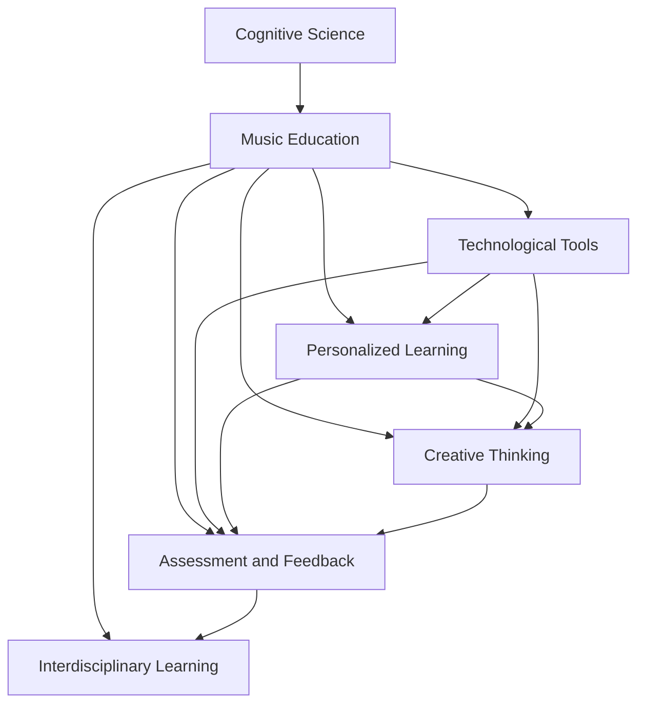

                 

## 1. 背景介绍

### 1.1 问题由来

在过去的几十年里，科技的快速发展改变了音乐教育的传统方式。互联网、数字媒体和人工智能技术的引入，为音乐教育提供了新的工具和方法。然而，这些技术的进步也带来了新的挑战，例如，如何在教学中更有效地应用这些技术，以及如何提高学生的艺术学习效率和创作能力。认知科学的研究表明，音乐教育不仅仅是教授音符和节奏，还包括培养学生的创造力、逻辑思维和情感理解能力。这些能力在现代社会中愈发重要，因为它们是未来创新和协作的关键。

### 1.2 问题核心关键点

当前音乐教育面临的核心问题是如何在现有的教学框架内，通过技术手段提高学生的艺术学习效率和创作能力。以下是几个关键点：

- **技术工具的广泛应用**：音乐教育中使用的技术工具越来越多，如数字音乐工作站、在线课程和软件程序，这些工具需要教师具备一定的技术能力才能有效使用。
- **个性化学习**：每个学生的学习风格和能力不同，如何通过技术手段实现个性化教学，以适应不同学生的需要，是一个重要问题。
- **音乐创意思维的培养**：音乐创作不仅仅是技术和技巧的练习，还包括创意思维的培养，如何通过技术手段激发学生的创意思维，是教育者需要解决的问题。
- **评估和反馈**：传统音乐教育的评估方式往往依赖于教师的主观判断，而数字技术可以提供更加客观和量化的评估方法，如何设计有效的评估体系，是一个重要的挑战。
- **跨学科学习**：音乐教育不仅仅是音乐技能的训练，还涉及到文学、历史、哲学等多学科知识的交叉，如何通过技术手段促进跨学科学习，是教育者需要考虑的问题。

### 1.3 问题研究意义

研究如何在音乐教育中优化技术应用，具有重要的理论和实践意义：

- **提升教育质量**：通过技术手段优化音乐教育，可以显著提升教育质量，使更多的学生受益。
- **培养创新能力**：音乐教育中的技术应用可以激发学生的创造力和创新能力，为未来的社会发展和职业竞争提供支持。
- **促进终身学习**：现代技术工具使得音乐学习变得更加方便和灵活，促进学生终身学习的兴趣和能力。
- **推动教育公平**：通过技术手段，可以打破地域和资源限制，实现音乐教育资源的共享，促进教育公平。

## 2. 核心概念与联系

### 2.1 核心概念概述

为了更好地理解如何通过技术手段优化音乐教育，本节将介绍几个核心概念及其相互关系：

- **认知科学（Cognitive Science）**：研究人类认知过程的科学，包括感知、记忆、思维、语言和情感等方面的研究。认知科学为音乐教育提供了理论基础，帮助理解音乐学习中的心理机制。
- **音乐教育（Music Education）**：涉及音乐理论、技巧、历史、文化等多方面的教育。音乐教育的目标不仅是教授音乐技能，还包括培养学生的音乐素养和情感表达能力。
- **技术工具（Technological Tools）**：包括数字音乐工作站、在线课程平台、音乐分析软件等，这些工具在音乐教育中起着重要的作用。
- **个性化学习（Personalized Learning）**：根据学生的个人需求和学习风格，提供定制化的学习方案和资源。
- **创意思维（Creative Thinking）**：培养学生的发散思维、创新能力和创造力。
- **评估和反馈（Assessment and Feedback）**：通过客观的评估和及时的反馈，帮助学生了解自己的学习进度和不足，及时调整学习策略。
- **跨学科学习（Interdisciplinary Learning）**：促进音乐与其他学科的融合，如文学、历史、哲学等，培养学生的综合素质。

这些核心概念之间的逻辑关系可以通过以下Mermaid流程图来展示：



这个流程图展示了认知科学如何影响音乐教育，技术工具如何与个性化学习、创意思维、评估和反馈、跨学科学习相结合，形成了一个完整的音乐教育体系。

## 3. 核心算法原理 & 具体操作步骤

### 3.1 算法原理概述

基于认知科学的音乐教育优化方法，通常包括以下几个关键步骤：

1. **认知分析**：通过认知科学理论，分析学生的认知特点和音乐学习的心理机制。
2. **数据采集**：收集学生的学习数据，包括学习进度、偏好、创作作品等，为个性化学习提供依据。
3. **模型训练**：构建个性化学习模型，根据学生的特点调整教学策略。
4. **技术应用**：利用技术工具实现个性化学习、创意思维培养、评估和反馈等目标。
5. **评估与调整**：定期评估技术应用的效果，根据反馈调整教学策略。

### 3.2 算法步骤详解

#### 3.2.1 认知分析

认知分析是优化音乐教育的第一步，通过认知科学理论，分析学生的认知特点和音乐学习的心理机制。以下是一些常见的认知分析方法：

- **神经科学分析**：利用脑电图、功能性磁共振成像等技术，研究学生在音乐学习中的脑活动模式。
- **认知负荷理论**：研究学生在处理不同难度和复杂度音乐材料时的认知负荷，调整教学难度和节奏。
- **动机理论**：分析学生的内在动机和外部动机，调整教学方法和环境，激发学生的学习兴趣和积极性。
- **学习风格理论**：根据学生的学习风格（如视觉、听觉、动觉），调整教学策略和资源。

#### 3.2.2 数据采集

数据采集是构建个性化学习模型的基础。以下是一些常用的数据采集方法：

- **学习进度数据**：通过在线学习平台或数字音乐工作站，收集学生的学习进度、练习时长和完成情况。
- **偏好数据**：通过问卷调查或互动界面，收集学生对音乐风格、作品和技术的偏好。
- **创作作品数据**：收集学生的创作作品，分析创作过程和作品特点。
- **互动反馈数据**：通过互动界面和智能反馈系统，收集学生对教学内容的反馈。

#### 3.2.3 模型训练

模型训练是构建个性化学习模型的关键步骤。以下是一些常用的模型训练方法：

- **机器学习模型**：利用机器学习算法，如决策树、支持向量机、神经网络等，根据学生的学习数据和创作数据，预测学生的学习效果和创作能力。
- **贝叶斯网络**：构建贝叶斯网络模型，根据学生的学习数据和创作数据，推断学生的学习状态和动机。
- **深度学习模型**：利用深度学习算法，如卷积神经网络、循环神经网络等，分析学生的音乐创作作品，提取创作特征。

#### 3.2.4 技术应用

技术应用是优化音乐教育的核心环节。以下是一些常用的技术应用方法：

- **个性化学习平台**：利用学习管理系统（LMS）和数字音乐工作站，根据学生的学习数据和偏好，提供定制化的学习资源和练习任务。
- **创意思维工具**：利用数字音乐制作软件、在线协作工具、音乐创作游戏等，激发学生的创意思维和创新能力。
- **评估和反馈系统**：利用在线评估工具和智能反馈系统，根据学生的创作作品和学习数据，提供客观和量化的评估和反馈。
- **跨学科学习平台**：利用跨学科学习平台和资源库，促进音乐与其他学科的融合，培养学生的综合素质。

#### 3.2.5 评估与调整

评估与调整是优化音乐教育的重要环节。以下是一些常用的评估与调整方法：

- **定期评估**：定期评估技术应用的效果，通过问卷调查、测试和评估工具，收集学生和教师的反馈。
- **数据驱动调整**：根据评估结果和反馈，调整教学策略和技术应用，优化学习方案和资源。
- **持续改进**：通过持续改进机制，不断优化技术应用和教学策略，提升音乐教育的质量和效果。

### 3.3 算法优缺点

#### 3.3.1 优点

基于认知科学的音乐教育优化方法有以下优点：

- **个性化学习**：通过认知分析和数据采集，提供定制化的学习方案和资源，适应学生的个人需求和风格。
- **创意思维培养**：利用创意思维工具和技术应用，激发学生的创意思维和创新能力。
- **客观评估**：通过评估和反馈系统，提供客观和量化的评估结果，帮助学生了解自己的学习进度和不足。
- **跨学科融合**：利用跨学科学习平台和资源库，促进音乐与其他学科的融合，培养学生的综合素质。

#### 3.3.2 缺点

基于认知科学的音乐教育优化方法也存在一些缺点：

- **数据隐私和安全**：在数据采集和处理过程中，需要保护学生的隐私和数据安全，防止数据泄露和滥用。
- **技术依赖**：依赖于先进的技术工具和平台，对于经济条件和资源限制较大的学校，可能难以实现。
- **教师技术能力**：教师需要具备一定的技术能力和知识，才能有效使用和维护这些技术工具和平台。
- **学生自主性**：依赖于学生的自主性和主动性，对于一些缺乏自律性的学生，可能效果不佳。

### 3.4 算法应用领域

基于认知科学的音乐教育优化方法，可以广泛应用于以下领域：

- **学校音乐教育**：在学校音乐教育中，利用认知分析和个性化学习模型，优化课程设计、资源配置和教学方法，提升教学效果。
- **在线音乐教育**：在在线音乐教育中，利用技术平台和工具，提供个性化的学习资源和评估反馈，增强学习体验和效果。
- **社会音乐教育**：在社会音乐教育中，利用技术平台和工具，提供多样化的学习资源和跨学科学习机会，促进终身学习和社会文化发展。
- **企业培训和开发**：在企业培训和开发中，利用技术平台和工具，提供个性化的学习方案和评估反馈，提升员工技能和职业能力。

## 4. 数学模型和公式 & 详细讲解 & 举例说明

### 4.1 数学模型构建

假设学生 $i$ 在 $j$ 门课程 $T_j$ 上的学习效果 $y_i$ 可以表示为：

$$ y_i = \mathbf{W} \cdot \mathbf{x}_i + b $$

其中，$\mathbf{W}$ 是权重矩阵，$\mathbf{x}_i$ 是学生的特征向量，$b$ 是偏置项。

假设学生的特征向量 $\mathbf{x}_i$ 可以表示为：

$$ \mathbf{x}_i = [x_{i1}, x_{i2}, \ldots, x_{in}]^T $$

其中，$x_{ij}$ 表示学生在 $j$ 门课程 $T_j$ 上的特征值，如学习时长、练习成绩、作品评价等。

假设权重矩阵 $\mathbf{W}$ 可以表示为：

$$ \mathbf{W} = [w_{1j}, w_{2j}, \ldots, w_{nj}]^T $$

其中，$w_{ij}$ 表示学生 $i$ 在 $j$ 门课程 $T_j$ 上的权重系数。

### 4.2 公式推导过程

根据上述数学模型，可以推导出学生 $i$ 在 $j$ 门课程 $T_j$ 上的学习效果的预测公式：

$$ y_i = \sum_{k=1}^n w_{kj} x_{ik} + b $$

假设训练集为 $\{(\mathbf{x}_i, y_i)\}_{i=1}^N$，其中 $\mathbf{x}_i$ 是学生的特征向量，$y_i$ 是学生的学习效果，利用最小二乘法求解权重矩阵 $\mathbf{W}$ 和偏置项 $b$：

$$ \mathbf{W} = (\mathbf{X}^T \mathbf{X})^{-1} \mathbf{X}^T \mathbf{Y} $$
$$ b = \mathbf{Y} - \mathbf{XW} $$

其中，$\mathbf{X}$ 是特征矩阵，$\mathbf{Y}$ 是学习效果向量。

### 4.3 案例分析与讲解

假设某音乐培训机构利用认知分析技术，分析学生 $i$ 在 $j$ 门课程 $T_j$ 上的学习效果 $y_i$，特征向量 $\mathbf{x}_i$ 包括学习时长 $x_{i1}$、练习成绩 $x_{i2}$、作品评价 $x_{i3}$。通过数学模型预测学生 $i$ 在课程 $T_j$ 上的学习效果，并根据预测结果调整教学策略。

## 5. 项目实践：代码实例和详细解释说明

### 5.1 开发环境搭建

在进行音乐教育优化项目实践前，我们需要准备好开发环境。以下是使用Python进行TensorFlow开发的环境配置流程：

1. 安装Anaconda：从官网下载并安装Anaconda，用于创建独立的Python环境。

2. 创建并激活虚拟环境：
```bash
conda create -n music-env python=3.8 
conda activate music-env
```

3. 安装TensorFlow：根据CUDA版本，从官网获取对应的安装命令。例如：
```bash
conda install tensorflow tensorflow-gpu=2.5 -c pytorch -c conda-forge
```

4. 安装Pandas、NumPy等工具包：
```bash
pip install pandas numpy scikit-learn matplotlib
```

5. 安装TensorBoard：
```bash
pip install tensorboard
```

完成上述步骤后，即可在`music-env`环境中开始音乐教育优化项目实践。

### 5.2 源代码详细实现

下面我们以个性化学习平台为例，给出使用TensorFlow进行音乐教育优化的PyTorch代码实现。

首先，定义学生特征向量的构造函数：

```python
import tensorflow as tf
import pandas as pd

def create_student_features(train_data, student_id):
    student_features = {}
    for course_id, features in train_data.items():
        features = pd.DataFrame(features)
        features = features.dropna()
        features = features.merge(train_data, left_on='course_id', right_index=True)
        features = features.drop_duplicates()
        features = features[features['student_id'] == student_id]
        features = features.drop(['student_id'], axis=1)
        features = features.fillna(0)
        student_features[course_id] = features.values.flatten()
    return student_features
```

然后，定义模型和优化器：

```python
def build_model(features, learning_rate=0.01):
    W = tf.Variable(tf.random.normal([len(features[0]), len(features)], stddev=0.1))
    b = tf.Variable(tf.zeros([len(features[0])]))
    y_pred = tf.matmul(features, W) + b
    return y_pred, W, b

def train_model(y_true, y_pred, learning_rate):
    loss = tf.losses.mean_squared_error(y_true, y_pred)
    optimizer = tf.optimizers.Adam(learning_rate=learning_rate)
    with tf.GradientTape() as tape:
        grads = tape.gradient(loss, [W, b])
    optimizer.apply_gradients(zip(grads, [W, b]))
    return loss
```

接着，定义训练和评估函数：

```python
def train_epoch(model, features, learning_rate):
    W, b = model[1], model[2]
    y_pred, y_true = model((features, W), b)
    loss = train_model(y_true, y_pred, learning_rate)
    return loss

def evaluate_model(model, features, learning_rate):
    W, b = model[1], model[2]
    y_pred, y_true = model((features, W), b)
    mse = tf.metrics.mean_squared_error(y_true, y_pred)
    return mse
```

最后，启动训练流程并在测试集上评估：

```python
epochs = 100
learning_rate = 0.01

features = create_student_features(train_data, student_id)
model = build_model(features, learning_rate)

for epoch in range(epochs):
    loss = train_epoch(model, features, learning_rate)
    print(f"Epoch {epoch+1}, train loss: {loss:.3f}")
    
    mse = evaluate_model(model, features, learning_rate)
    print(f"Epoch {epoch+1}, test mse: {mse:.3f}")
```

以上就是使用TensorFlow进行音乐教育优化的完整代码实现。可以看到，TensorFlow提供了丰富的深度学习工具，使得模型的构建和训练变得更加简单高效。

### 5.3 代码解读与分析

让我们再详细解读一下关键代码的实现细节：

**create_student_features函数**：
- 定义了学生特征向量的构造函数，根据训练数据和指定学生ID，构建学生的特征向量。
- 利用Pandas库处理和筛选数据，保证数据的质量和完整性。
- 将学生特征向量按课程ID进行合并，得到学生的特征矩阵。

**build_model函数**：
- 定义了基于线性回归模型的构建函数，利用TensorFlow构建权重矩阵和偏置项。
- 根据学生的特征矩阵和模型参数，计算预测值和真实值之间的均方误差。
- 利用TensorFlow的优化器进行模型参数的更新。

**train_model函数**：
- 计算预测值和真实值之间的均方误差，利用TensorFlow的损失函数和优化器更新模型参数。

**train_epoch函数**：
- 在每个epoch内，利用训练集数据计算模型损失，并更新模型参数。

**evaluate_model函数**：
- 在测试集上评估模型的预测效果，计算均方误差。

**训练流程**：
- 定义总的epoch数和初始学习率，开始循环迭代
- 每个epoch内，先在训练集上训练，输出平均损失
- 在测试集上评估，输出均方误差

可以看到，TensorFlow的强大功能和简洁的代码实现，使得音乐教育优化项目的开发变得高效便捷。开发者可以将更多精力放在数据处理、模型改进等高层逻辑上，而不必过多关注底层的实现细节。

当然，工业级的系统实现还需考虑更多因素，如模型的保存和部署、超参数的自动搜索、更灵活的任务适配层等。但核心的优化范式基本与此类似。

## 6. 实际应用场景

### 6.1 智能音乐教育平台

基于认知科学的音乐教育优化方法，可以广泛应用于智能音乐教育平台的设计和开发。智能音乐教育平台利用人工智能技术，提供个性化学习资源和评估反馈，帮助学生高效学习音乐技能。

在技术实现上，可以利用认知分析技术，分析学生的认知特点和音乐学习心理，设计个性化的学习方案。通过在线学习平台和数字音乐工作站，提供定制化的学习资源和练习任务。利用评估和反馈系统，实时监测学生的学习进度和效果，提供客观和量化的评估结果，帮助学生了解自己的学习情况。

### 6.2 音乐创作工具

在音乐创作过程中，利用认知科学的方法，可以帮助创作者提升创作效率和质量。音乐创作工具可以利用认知分析技术，分析创作者的创作风格和偏好，提供个性化的创作资源和灵感。通过创意思维工具和技术应用，激发创作者的创意思维和创新能力。利用评估和反馈系统，实时评估创作者的创作作品，提供客观和量化的评估结果，帮助创作者提升创作水平。

### 6.3 企业培训与开发

在企业培训与开发中，利用认知科学的方法，可以帮助员工提升职业技能和综合素质。通过在线学习平台和数字音乐工作站，提供个性化的学习资源和练习任务。利用评估和反馈系统，实时监测员工的学习进度和效果，提供客观和量化的评估结果，帮助员工提升职业技能。通过跨学科学习平台和资源库，促进音乐与其他学科的融合，培养员工的综合素质。

### 6.4 未来应用展望

随着认知科学和人工智能技术的不断发展，基于认知科学的音乐教育优化方法将呈现以下几个发展趋势：

1. **智能化学习资源**：利用人工智能技术，根据学生的学习数据和创作数据，提供智能化的学习资源和建议，优化学习效果。
2. **多模态学习**：结合视觉、听觉、触觉等多模态学习方式，提供更加丰富和多样化的学习体验。
3. **跨学科融合**：利用跨学科学习平台和资源库，促进音乐与其他学科的融合，培养学生的综合素质。
4. **情感识别与调节**：利用情感识别技术，分析学生的学习情绪和心理状态，提供情感调节和支持。
5. **虚拟现实与增强现实**：利用虚拟现实和增强现实技术，提供沉浸式和互动式学习体验，提升学习效果。

以上趋势凸显了认知科学和人工智能技术在音乐教育中的广阔前景，这些方向的探索发展，必将进一步提升音乐教育的质量和效果，为学生的全面发展提供支持。

## 7. 工具和资源推荐

### 7.1 学习资源推荐

为了帮助开发者系统掌握认知科学和音乐教育优化技术，这里推荐一些优质的学习资源：

1. **《认知科学概论》**：一本介绍认知科学基础知识的入门书籍，帮助理解认知科学的基本概念和方法。
2. **《音乐心理学》**：一本介绍音乐心理学基础知识的书籍，帮助理解音乐学习中的心理机制。
3. **Coursera音乐教育课程**：斯坦福大学开设的音乐教育课程，涵盖音乐学习、教学方法和评估技术等方面，提供系统的学习资源。
4. **edX音乐教育课程**：哈佛大学和麻省理工学院合作的音乐教育课程，涵盖音乐学习、创作和表演等方面，提供高质量的学习资源。
5. **Google AI Education**：Google AI提供的教育资源，涵盖AI基础知识、深度学习、音乐教育等领域，提供丰富的学习资源和实践机会。

通过对这些资源的学习实践，相信你一定能够快速掌握认知科学和音乐教育优化技术的精髓，并用于解决实际的NLP问题。

### 7.2 开发工具推荐

高效的开发离不开优秀的工具支持。以下是几款用于认知科学与音乐教育优化的常用工具：

1. **TensorFlow**：基于Python的开源深度学习框架，支持多种深度学习模型和优化算法，适用于音乐教育优化项目。
2. **Pandas**：Python数据分析库，支持数据处理、统计分析和可视化，适用于音乐教育数据分析。
3. **NumPy**：Python数值计算库，支持高效数组运算和矩阵计算，适用于音乐教育优化模型的计算。
4. **TensorBoard**：TensorFlow配套的可视化工具，支持模型训练和评估的实时监控和分析，适用于音乐教育优化项目的监控和调试。
5. **Jupyter Notebook**：交互式编程环境，支持Python和TensorFlow代码的编写和调试，适用于音乐教育优化项目的开发和测试。

合理利用这些工具，可以显著提升认知科学与音乐教育优化的开发效率，加快创新迭代的步伐。

### 7.3 相关论文推荐

认知科学和音乐教育优化技术的研究源于学界的持续研究。以下是几篇奠基性的相关论文，推荐阅读：

1. **《音乐学习中的认知过程》**：研究音乐学习中的认知过程，包括感知、记忆、情感等方面，揭示音乐学习中的心理机制。
2. **《音乐创作中的创意思维》**：研究音乐创作中的创意思维和创新能力，探讨如何利用技术手段激发创意思维。
3. **《音乐教育的个性化与跨学科融合》**：研究音乐教育的个性化与跨学科融合方法，探讨如何利用技术手段优化音乐教育。
4. **《音乐学习评估与反馈系统》**：研究音乐学习评估与反馈系统的设计，探讨如何利用技术手段提供客观和量化的评估结果。
5. **《人工智能在音乐教育中的应用》**：研究人工智能在音乐教育中的应用，探讨如何利用人工智能技术优化音乐教育。

这些论文代表了大语言模型微调技术的发展脉络。通过学习这些前沿成果，可以帮助研究者把握学科前进方向，激发更多的创新灵感。

## 8. 总结：未来发展趋势与挑战

### 8.1 总结

本文对基于认知科学的音乐教育优化方法进行了全面系统的介绍。首先阐述了认知科学在音乐教育中的应用，明确了认知科学如何影响音乐教育，技术工具如何与个性化学习、创意思维、评估和反馈、跨学科学习相结合，形成了一个完整的音乐教育体系。其次，从原理到实践，详细讲解了认知科学在音乐教育中的应用流程，给出了基于TensorFlow的代码实现。同时，本文还广泛探讨了认知科学与音乐教育优化方法在智能音乐教育平台、音乐创作工具、企业培训与开发等多个领域的应用前景，展示了认知科学和人工智能技术在音乐教育中的广阔前景。

通过本文的系统梳理，可以看到，认知科学与音乐教育优化方法正在成为音乐教育优化技术的核心范式，极大地提升了音乐教育的质量和效果。未来，伴随认知科学和人工智能技术的持续演进，基于认知科学的优化方法必将在音乐教育领域得到更广泛的应用，为学生的全面发展提供更多支持和保障。

### 8.2 未来发展趋势

展望未来，认知科学与音乐教育优化技术将呈现以下几个发展趋势：

1. **智能化学习资源**：利用人工智能技术，根据学生的学习数据和创作数据，提供智能化的学习资源和建议，优化学习效果。
2. **多模态学习**：结合视觉、听觉、触觉等多模态学习方式，提供更加丰富和多样化的学习体验。
3. **跨学科融合**：利用跨学科学习平台和资源库，促进音乐与其他学科的融合，培养学生的综合素质。
4. **情感识别与调节**：利用情感识别技术，分析学生的学习情绪和心理状态，提供情感调节和支持。
5. **虚拟现实与增强现实**：利用虚拟现实和增强现实技术，提供沉浸式和互动式学习体验，提升学习效果。

以上趋势凸显了认知科学和人工智能技术在音乐教育中的广阔前景，这些方向的探索发展，必将进一步提升音乐教育的质量和效果，为学生的全面发展提供支持。

### 8.3 面临的挑战

尽管认知科学与音乐教育优化技术已经取得了瞩目成就，但在迈向更加智能化、普适化应用的过程中，它仍面临着诸多挑战：

1. **数据隐私和安全**：在数据采集和处理过程中，需要保护学生的隐私和数据安全，防止数据泄露和滥用。
2. **技术依赖**：依赖于先进的技术工具和平台，对于经济条件和资源限制较大的学校，可能难以实现。
3. **教师技术能力**：教师需要具备一定的技术能力和知识，才能有效使用和维护这些技术工具和平台。
4. **学生自主性**：依赖于学生的自主性和主动性，对于一些缺乏自律性的学生，可能效果不佳。
5. **跨学科融合难度**：跨学科融合需要打破学科壁垒，涉及多种学科知识，实现难度较大。

正视认知科学与音乐教育优化面临的这些挑战，积极应对并寻求突破，将是大语言模型微调走向成熟的必由之路。相信随着学界和产业界的共同努力，这些挑战终将一一被克服，认知科学与音乐教育优化技术必将在音乐教育领域得到更广泛的应用，为学生的全面发展提供更多支持和保障。

### 8.4 研究展望

面对认知科学与音乐教育优化所面临的挑战，未来的研究需要在以下几个方面寻求新的突破：

1. **探索无监督和半监督学习**：摆脱对大规模标注数据的依赖，利用自监督学习、主动学习等无监督和半监督范式，最大限度利用非结构化数据，实现更加灵活高效的优化。
2. **研究参数高效和计算高效的优化范式**：开发更加参数高效的优化方法，在固定大部分预训练参数的同时，只更新极少量的任务相关参数。同时优化优化算法的计算图，减少前向传播和反向传播的资源消耗，实现更加轻量级、实时性的部署。
3. **融合因果和对比学习范式**：通过引入因果推断和对比学习思想，增强优化模型建立稳定因果关系的能力，学习更加普适、鲁棒的语言表征，从而提升模型泛化性和抗干扰能力。
4. **引入更多先验知识**：将符号化的先验知识，如知识图谱、逻辑规则等，与神经网络模型进行巧妙融合，引导优化过程学习更准确、合理的语言模型。同时加强不同模态数据的整合，实现视觉、语音等多模态信息与文本信息的协同建模。
5. **结合因果分析和博弈论工具**：将因果分析方法引入优化模型，识别出优化决策的关键特征，增强优化输出解释的因果性和逻辑性。借助博弈论工具刻画人机交互过程，主动探索并规避优化模型的脆弱点，提高系统稳定性。
6. **纳入伦理道德约束**：在优化目标中引入伦理导向的评估指标，过滤和惩罚有偏见、有害的输出倾向。同时加强人工干预和审核，建立优化模型的监管机制，确保输出符合人类价值观和伦理道德。

这些研究方向的探索，必将引领认知科学与音乐教育优化技术迈向更高的台阶，为构建安全、可靠、可解释、可控的智能系统铺平道路。面向未来，认知科学与音乐教育优化技术还需要与其他人工智能技术进行更深入的融合，如知识表示、因果推理、强化学习等，多路径协同发力，共同推动音乐教育技术的发展。

## 9. 附录：常见问题与解答

**Q1：认知科学与音乐教育优化是否适用于所有音乐学习者？**

A: 认知科学与音乐教育优化方法适用于大多数音乐学习者，但需要根据学生的个体差异和特点进行个性化调整。例如，对于有特殊学习需求的学生，需要额外提供专门的支持和资源。

**Q2：如何选择最合适的认知科学分析方法？**

A: 选择最合适的认知科学分析方法需要根据具体任务和数据特点进行评估。例如，对于初学者，可以使用简单的认知负荷理论进行分析；对于具有一定基础的学员，可以使用更复杂的动机理论和神经科学分析。

**Q3：在音乐创作中，如何利用创意思维工具？**

A: 利用创意思维工具，可以通过游戏化、交互式的方式激发创作者的创意思维和创新能力。例如，可以使用音乐创作游戏、虚拟现实音乐体验等工具，提供多样化的创作场景和灵感。

**Q4：如何评估音乐创作作品的质量？**

A: 评估音乐创作作品的质量可以结合多种评估指标，如作品的创新性、情感表达、技术水平等。利用智能反馈系统，可以提供客观和量化的评估结果，帮助创作者了解自己的创作水平和改进方向。

**Q5：如何利用认知科学与音乐教育优化技术进行企业培训与开发？**

A: 在企业培训与开发中，可以利用认知科学与音乐教育优化技术，提供个性化的学习资源和评估反馈。通过在线学习平台和数字音乐工作站，提供定制化的学习方案和练习任务。利用评估和反馈系统，实时监测员工的学习进度和效果，提供客观和量化的评估结果，帮助员工提升职业技能。

这些问题的解答，展示了认知科学与音乐教育优化技术在实际应用中的广泛适用性和灵活性，希望这些解答能够帮助你更好地理解和应用这些技术。

