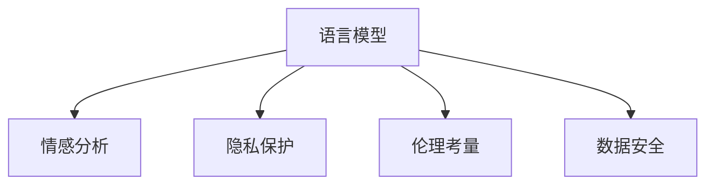

                 

# 语言模型在心理健康领域的应用与伦理

> 关键词：心理健康,自然语言处理(NLP),语言模型,情感分析,隐私保护,伦理考量,数据安全

## 1. 背景介绍

### 1.1 问题由来
近年来，随着人工智能技术的迅猛发展，尤其是自然语言处理（Natural Language Processing, NLP）技术的进步，语言模型在心理健康领域的应用逐渐引起广泛关注。心理健康是一个全球性的问题，特别是在疫情冲击下，人们面临的心理压力和情绪问题日益加剧。传统的心理健康干预往往依赖于专业人员的面对面咨询，不仅成本高昂，且难以覆盖广泛的人群。借助语言模型，可以提供大规模、低成本的心理健康支持服务，满足更多人的心理需求。

### 1.2 问题核心关键点
语言模型在心理健康领域的应用，主要是通过分析用户的语言表达，识别其情绪和心理状态，从而提供个性化的心理健康干预措施。这一过程中，涉及多个关键技术环节，如数据收集、模型训练、情感分析等，同时也面临一系列伦理和隐私问题，如用户数据的保护、结果的可靠性等。

## 2. 核心概念与联系

### 2.1 核心概念概述

为更好地理解语言模型在心理健康领域的应用，本节将介绍几个密切相关的核心概念：

- 语言模型（Language Model）：指能够根据已知文本预测后续文本的概率分布的模型。常见的语言模型包括RNN、LSTM、GRU和Transformer等。
- 情感分析（Sentiment Analysis）：指通过自然语言处理技术，分析文本中的情感倾向，如正面、负面或中性。
- 隐私保护（Privacy Protection）：指在数据收集、存储和处理过程中，保护用户隐私不被泄露的技术和策略。
- 伦理考量（Ethical Consideration）：指在心理健康应用中，应遵守的伦理原则，如尊重用户隐私、避免偏见等。
- 数据安全（Data Security）：指在心理健康应用中，保障用户数据不被未授权访问和篡改的技术措施。

这些核心概念之间的逻辑关系可以通过以下Mermaid流程图来展示：



这个流程图展示了一系列语言模型在心理健康领域应用的核心概念及其之间的关系：

1. 语言模型通过对用户输入的文本进行分析，预测其情感倾向。
2. 情感分析从语言模型输出的结果中进一步识别用户的情绪状态。
3. 隐私保护、伦理考量和数据安全是确保心理健康应用安全性的重要保障。

## 3. 核心算法原理 & 具体操作步骤
### 3.1 算法原理概述

基于语言模型的心理健康应用，核心在于利用深度学习模型对用户的语言表达进行分析，以识别其情绪和心理状态。这一过程可以分为两个阶段：

1. 预训练阶段：使用大规模无标签文本数据训练语言模型，使其能够捕捉语言的统计规律，具备良好的文本生成和理解能力。
2. 微调阶段：针对特定的心理健康任务，如情绪识别、心理健康评估等，对预训练模型进行微调，使其能够准确识别文本中的情绪和心理状态，并输出相应的干预建议。

### 3.2 算法步骤详解

#### 3.2.1 数据收集与预处理

1. **数据收集**：收集大量的用户语言数据，包括聊天记录、社交媒体帖子、心理健康调查问卷等。这些数据应涵盖多种语言形式，以确保模型的泛化能力。
2. **数据清洗**：对收集到的数据进行清洗，去除噪声、无关信息等，确保数据的质量和一致性。
3. **数据标注**：对于涉及情感分析或心理评估的任务，需要对数据进行标注，标记出文本中的情绪和心理状态。

#### 3.2.2 模型训练

1. **选择模型**：根据任务需求，选择合适的语言模型，如BERT、GPT-2等。
2. **预训练**：使用大规模无标签文本数据对模型进行预训练，训练其捕捉语言的统计规律。
3. **微调**：针对特定的心理健康任务，对预训练模型进行微调，调整顶层分类器或解码器，使其能够识别情绪和心理状态。

#### 3.2.3 结果输出

1. **情感分析**：将用户输入的文本输入微调后的语言模型，模型输出情感标签，如正面、负面或中性。
2. **心理健康评估**：基于情感分析结果，进一步评估用户的心理健康状态，输出相应的心理健康建议。
3. **结果反馈**：对用户的心理健康建议进行反馈，并提供进一步的心理咨询或治疗建议。

### 3.3 算法优缺点

基于语言模型的心理健康应用具有以下优点：

1. **规模化应用**：能够处理大规模用户数据，提供广泛的心理健康支持。
2. **成本低廉**：相较于传统心理咨询，语言模型应用成本更低，可覆盖更多用户。
3. **实时性**：能够实时分析用户的语言表达，提供即时的心理健康支持。

同时，该方法也存在一定的局限性：

1. **隐私风险**：用户的语言数据包含大量个人隐私信息，存在泄露风险。
2. **结果可靠性**：语言模型可能无法准确识别用户情绪和心理状态，导致错误建议。
3. **伦理挑战**：心理健康应用涉及伦理问题，如责任归属、数据使用等。
4. **技术局限**：当前语言模型的准确性和泛化能力仍有待提升。

### 3.4 算法应用领域

语言模型在心理健康领域的应用，主要集中在以下几个方面：

1. **情绪识别**：通过分析用户的语言表达，识别其情绪状态，如焦虑、抑郁等。
2. **心理健康评估**：基于用户语言数据，评估其心理健康状态，如压力水平、睡眠质量等。
3. **心理咨询**：结合情感分析和心理健康评估结果，提供个性化的心理咨询建议。
4. **危机干预**：识别用户的危机信号，如自杀倾向，及时进行干预和救助。
5. **心理健康监测**：对用户的心理健康状态进行持续监测，及时发现异常情况。

## 4. 数学模型和公式 & 详细讲解
### 4.1 数学模型构建

基于语言模型的心理健康应用，主要涉及两个数学模型：

1. **语言模型**：用于捕捉语言的统计规律，预测文本的分布。常见的语言模型包括RNN、LSTM、GRU和Transformer等。
2. **情感分析模型**：用于识别文本中的情感倾向，如正面、负面或中性。

假设语言模型为 $M_{\theta}$，其中 $\theta$ 为模型参数。情感分析任务可以视为一个分类任务，即预测文本 $x$ 的情感标签 $y \in \{0, 1\}$，其中 $0$ 表示负面情感，$1$ 表示正面或中性情感。情感分析模型的损失函数为交叉熵损失函数：

$$
\mathcal{L}(M_{\theta}, x) = -y\log M_{\theta}(x) - (1-y)\log(1-M_{\theta}(x))
$$

### 4.2 公式推导过程

对于情感分析任务，我们采用二分类交叉熵损失函数。假设模型 $M_{\theta}$ 的输出为 $\hat{y} \in [0,1]$，表示预测为正面情感的概率。则损失函数为：

$$
\mathcal{L}(M_{\theta}, x) = -y\log \hat{y} - (1-y)\log(1-\hat{y})
$$

其中 $y$ 为真实的情感标签，$\log$ 为自然对数。将情感分析任务作为微调任务，训练模型 $M_{\theta}$ 使其能够准确预测情感标签。

### 4.3 案例分析与讲解

假设我们收集到以下两个样本数据：

1. 文本："我很高兴，因为我通过了考试。"
   - 情感标签：$y=1$

2. 文本："我感到非常沮丧，因为我的工作没完成。"
   - 情感标签：$y=0$

对于这两个样本，我们使用情感分析模型进行预测，输出结果为：

1. $\hat{y} = 0.95$
   - 损失：$\mathcal{L}(M_{\theta}, x_1) = -1\log 0.95 - 0\log(1-0.95) \approx 0.069$

2. $\hat{y} = 0.1$
   - 损失：$\mathcal{L}(M_{\theta}, x_2) = -0\log 0.1 - 1\log(1-0.1) \approx 0.783$

我们可以使用随机梯度下降等优化算法，不断调整模型参数 $\theta$，以最小化损失函数 $\mathcal{L}(M_{\theta}, x)$。在经过若干轮迭代后，模型输出的情感预测将更加准确。

## 5. 项目实践：代码实例和详细解释说明
### 5.1 开发环境搭建

在进行心理健康应用开发前，我们需要准备好开发环境。以下是使用Python进行PyTorch开发的环境配置流程：

1. 安装Anaconda：从官网下载并安装Anaconda，用于创建独立的Python环境。

2. 创建并激活虚拟环境：
```bash
conda create -n pytorch-env python=3.8 
conda activate pytorch-env
```

3. 安装PyTorch：根据CUDA版本，从官网获取对应的安装命令。例如：
```bash
conda install pytorch torchvision torchaudio cudatoolkit=11.1 -c pytorch -c conda-forge
```

4. 安装Transformers库：
```bash
pip install transformers
```

5. 安装各类工具包：
```bash
pip install numpy pandas scikit-learn matplotlib tqdm jupyter notebook ipython
```

完成上述步骤后，即可在`pytorch-env`环境中开始心理健康应用开发。

### 5.2 源代码详细实现

这里我们以情绪识别任务为例，给出使用Transformers库对BERT模型进行微调的PyTorch代码实现。

首先，定义数据集和模型：

```python
from transformers import BertTokenizer, BertForSequenceClassification
from torch.utils.data import Dataset, DataLoader
from torch import nn

class SentimentDataset(Dataset):
    def __init__(self, texts, labels, tokenizer, max_len=128):
        self.texts = texts
        self.labels = labels
        self.tokenizer = tokenizer
        self.max_len = max_len
        
    def __len__(self):
        return len(self.texts)
    
    def __getitem__(self, item):
        text = self.texts[item]
        label = self.labels[item]
        
        encoding = self.tokenizer(text, return_tensors='pt', max_length=self.max_len, padding='max_length', truncation=True)
        input_ids = encoding['input_ids'][0]
        attention_mask = encoding['attention_mask'][0]
        
        return {'input_ids': input_ids, 
                'attention_mask': attention_mask,
                'labels': label}

# 定义模型
model = BertForSequenceClassification.from_pretrained('bert-base-cased', num_labels=2)

# 定义损失函数和优化器
criterion = nn.CrossEntropyLoss()
optimizer = AdamW(model.parameters(), lr=2e-5)

# 加载数据集
train_dataset = SentimentDataset(train_texts, train_labels, tokenizer)
val_dataset = SentimentDataset(val_texts, val_labels, tokenizer)
test_dataset = SentimentDataset(test_texts, test_labels, tokenizer)
```

然后，定义训练和评估函数：

```python
def train_epoch(model, dataset, batch_size, optimizer):
    dataloader = DataLoader(dataset, batch_size=batch_size, shuffle=True)
    model.train()
    epoch_loss = 0
    for batch in dataloader:
        input_ids = batch['input_ids'].to(device)
        attention_mask = batch['attention_mask'].to(device)
        labels = batch['labels'].to(device)
        model.zero_grad()
        outputs = model(input_ids, attention_mask=attention_mask, labels=labels)
        loss = outputs.loss
        epoch_loss += loss.item()
        loss.backward()
        optimizer.step()
    return epoch_loss / len(dataloader)

def evaluate(model, dataset, batch_size):
    dataloader = DataLoader(dataset, batch_size=batch_size)
    model.eval()
    preds, labels = [], []
    with torch.no_grad():
        for batch in dataloader:
            input_ids = batch['input_ids'].to(device)
            attention_mask = batch['attention_mask'].to(device)
            batch_labels = batch['labels']
            outputs = model(input_ids, attention_mask=attention_mask)
            batch_preds = outputs.logits.argmax(dim=1).to('cpu').tolist()
            batch_labels = batch_labels.to('cpu').tolist()
            for pred, label in zip(batch_preds, batch_labels):
                preds.append(pred)
                labels.append(label)
    
    print(classification_report(labels, preds))
```

最后，启动训练流程并在测试集上评估：

```python
epochs = 5
batch_size = 16

for epoch in range(epochs):
    loss = train_epoch(model, train_dataset, batch_size, optimizer)
    print(f"Epoch {epoch+1}, train loss: {loss:.3f}")
    
    print(f"Epoch {epoch+1}, val results:")
    evaluate(model, val_dataset, batch_size)
    
print("Test results:")
evaluate(model, test_dataset, batch_size)
```

以上就是使用PyTorch对BERT进行情绪识别任务微调的完整代码实现。可以看到，得益于Transformers库的强大封装，我们可以用相对简洁的代码完成BERT模型的加载和微调。

### 5.3 代码解读与分析

让我们再详细解读一下关键代码的实现细节：

**SentimentDataset类**：
- `__init__`方法：初始化文本、标签、分词器等关键组件。
- `__len__`方法：返回数据集的样本数量。
- `__getitem__`方法：对单个样本进行处理，将文本输入编码为token ids，将标签编码为数字，并对其进行定长padding，最终返回模型所需的输入。

**标签与id的映射**：
- 定义了标签与数字id之间的映射关系，用于将token-wise的预测结果解码回真实的标签。

**训练和评估函数**：
- 使用PyTorch的DataLoader对数据集进行批次化加载，供模型训练和推理使用。
- 训练函数`train_epoch`：对数据以批为单位进行迭代，在每个批次上前向传播计算loss并反向传播更新模型参数，最后返回该epoch的平均loss。
- 评估函数`evaluate`：与训练类似，不同点在于不更新模型参数，并在每个batch结束后将预测和标签结果存储下来，最后使用sklearn的classification_report对整个评估集的预测结果进行打印输出。

**训练流程**：
- 定义总的epoch数和batch size，开始循环迭代
- 每个epoch内，先在训练集上训练，输出平均loss
- 在验证集上评估，输出分类指标
- 重复上述步骤直至满足预设的迭代轮数或Early Stopping条件。

可以看到，PyTorch配合Transformers库使得BERT微调的代码实现变得简洁高效。开发者可以将更多精力放在数据处理、模型改进等高层逻辑上，而不必过多关注底层的实现细节。

当然，工业级的系统实现还需考虑更多因素，如模型的保存和部署、超参数的自动搜索、更灵活的任务适配层等。但核心的微调范式基本与此类似。

## 6. 实际应用场景
### 6.1 智能心理诊断

智能心理诊断系统利用语言模型对用户的语言数据进行情感和情绪分析，结合心理健康问卷评估结果，自动诊断用户的心理健康状态。

具体而言，智能心理诊断系统可以与社交媒体、即时通讯软件等应用集成，通过实时监测用户的语言表达，识别情绪和心理状态，并在必要时提供心理干预。用户只需简单填写一份心理健康问卷，系统即可根据其语言数据和问卷结果综合评估其心理健康状况，并提供个性化的心理健康建议。

### 6.2 心理健康热线

心理健康热线系统通过语言模型对用户来电内容进行分析，识别其情绪和心理状态，自动分流到相应的心理咨询师。系统还具备智能对话功能，能够根据用户的情感状态，提供初步的情绪安抚和心理辅导，缓解用户的焦虑和压力。

例如，用户拨打心理健康热线时，系统会实时采集语音和文字输入，使用语言模型分析用户的情感和情绪状态。根据分析结果，系统将用户转接到合适的心理咨询师，或自动回复初步的情绪安抚建议。对于情绪极度不稳定的情况，系统还可自动报警，通知相关人员进行紧急干预。

### 6.3 情绪监测与预警

情绪监测系统通过持续监测用户的语言数据，实时分析其情绪变化趋势，及时预警可能存在的心理问题。

例如，学校可以对学生在校期间的社交媒体和电子邮件进行监测，使用语言模型分析学生的情绪表达，识别潜在的心理问题。系统可以设置情绪监测阈值，一旦学生的情绪表达超过预设阈值，系统会立即报警，通知学校心理健康老师进行干预。

## 7. 工具和资源推荐
### 7.1 学习资源推荐

为了帮助开发者系统掌握语言模型在心理健康领域的应用，这里推荐一些优质的学习资源：

1. 《Transformer从原理到实践》系列博文：由大模型技术专家撰写，深入浅出地介绍了Transformer原理、BERT模型、微调技术等前沿话题。

2. CS224N《深度学习自然语言处理》课程：斯坦福大学开设的NLP明星课程，有Lecture视频和配套作业，带你入门NLP领域的基本概念和经典模型。

3. 《Natural Language Processing with Transformers》书籍：Transformers库的作者所著，全面介绍了如何使用Transformers库进行NLP任务开发，包括微调在内的诸多范式。

4. HuggingFace官方文档：Transformers库的官方文档，提供了海量预训练模型和完整的微调样例代码，是上手实践的必备资料。

5. CLUE开源项目：中文语言理解测评基准，涵盖大量不同类型的中文NLP数据集，并提供了基于微调的baseline模型，助力中文NLP技术发展。

通过对这些资源的学习实践，相信你一定能够快速掌握语言模型在心理健康领域的应用，并用于解决实际的NLP问题。

### 7.2 开发工具推荐

高效的开发离不开优秀的工具支持。以下是几款用于心理健康应用开发的常用工具：

1. PyTorch：基于Python的开源深度学习框架，灵活动态的计算图，适合快速迭代研究。大部分预训练语言模型都有PyTorch版本的实现。

2. TensorFlow：由Google主导开发的开源深度学习框架，生产部署方便，适合大规模工程应用。同样有丰富的预训练语言模型资源。

3. Transformers库：HuggingFace开发的NLP工具库，集成了众多SOTA语言模型，支持PyTorch和TensorFlow，是进行心理健康应用开发的利器。

4. Weights & Biases：模型训练的实验跟踪工具，可以记录和可视化模型训练过程中的各项指标，方便对比和调优。与主流深度学习框架无缝集成。

5. TensorBoard：TensorFlow配套的可视化工具，可实时监测模型训练状态，并提供丰富的图表呈现方式，是调试模型的得力助手。

6. Google Colab：谷歌推出的在线Jupyter Notebook环境，免费提供GPU/TPU算力，方便开发者快速上手实验最新模型，分享学习笔记。

合理利用这些工具，可以显著提升心理健康应用开发的效率，加快创新迭代的步伐。

### 7.3 相关论文推荐

语言模型在心理健康领域的应用，源于学界的持续研究。以下是几篇奠基性的相关论文，推荐阅读：

1. Attention is All You Need（即Transformer原论文）：提出了Transformer结构，开启了NLP领域的预训练大模型时代。

2. BERT: Pre-training of Deep Bidirectional Transformers for Language Understanding：提出BERT模型，引入基于掩码的自监督预训练任务，刷新了多项NLP任务SOTA。

3. Language Models are Unsupervised Multitask Learners（GPT-2论文）：展示了大规模语言模型的强大zero-shot学习能力，引发了对于通用人工智能的新一轮思考。

4. Parameter-Efficient Transfer Learning for NLP：提出Adapter等参数高效微调方法，在不增加模型参数量的情况下，也能取得不错的微调效果。

5. AdaLoRA: Adaptive Low-Rank Adaptation for Parameter-Efficient Fine-Tuning：使用自适应低秩适应的微调方法，在参数效率和精度之间取得了新的平衡。

6. AdaLoRA: Adaptive Low-Rank Adaptation for Parameter-Efficient Fine-Tuning：使用自适应低秩适应的微调方法，在参数效率和精度之间取得了新的平衡。

这些论文代表了大语言模型在心理健康领域应用的发展脉络。通过学习这些前沿成果，可以帮助研究者把握学科前进方向，激发更多的创新灵感。

## 8. 总结：未来发展趋势与挑战
### 8.1 总结

本文对语言模型在心理健康领域的应用进行了全面系统的介绍。首先阐述了心理健康问题的大背景和语言模型应用的动机，明确了心理健康应用中语言模型的核心任务和关键技术。其次，从原理到实践，详细讲解了语言模型的构建和训练流程，给出了心理健康应用开发的完整代码实例。同时，本文还广泛探讨了语言模型在心理健康应用中面临的隐私、伦理和安全性等挑战，展示了语言模型应用的多样性和复杂性。

通过本文的系统梳理，可以看到，语言模型在心理健康领域的应用具有广阔的前景，为心理健康服务提供了新的可能。未来，伴随语言模型的不断演进，结合更多前沿技术，语言模型必将在心理健康领域发挥更大的作用，为构建安全、高效、可解释的心理健康支持系统提供新的思路。

### 8.2 未来发展趋势

展望未来，语言模型在心理健康领域的应用将呈现以下几个发展趋势：

1. **模型的复杂度提升**：未来的语言模型将具备更强的复杂度，能够处理更加多样化的心理健康任务，如复杂情绪识别、认知评估等。

2. **隐私保护技术的提升**：随着隐私保护技术的发展，未来的心理健康应用将更加注重用户数据的保护，采用更加安全的存储和传输方式。

3. **伦理考量的强化**：未来的心理健康应用将更加重视伦理问题，通过算法透明性和可解释性，增强用户对系统的信任。

4. **跨领域融合**：心理健康应用将与其他领域的技术进行更深层次的融合，如与医学、心理学、社会学等领域的结合，形成更加全面、综合的心理健康支持系统。

5. **个性化和动态化**：未来的心理健康应用将更加注重个性化和动态化，根据用户的实时反馈和需求，动态调整干预策略。

6. **多模态融合**：心理健康应用将不仅限于语言数据，结合语音、图像、生理信号等多模态数据，提供更全面、准确的评估和干预。

以上趋势凸显了语言模型在心理健康领域应用的多样性和前景。这些方向的探索发展，必将进一步提升心理健康应用的效果和应用范围，为构建更加全面、高效的心理健康支持系统提供新的动力。

### 8.3 面临的挑战

尽管语言模型在心理健康领域的应用已经取得了一些进展，但在迈向更加智能化、普适化应用的过程中，它仍面临着诸多挑战：

1. **数据的隐私和安全问题**：心理健康应用涉及大量个人隐私信息，如何保护用户数据不被泄露是关键问题。
2. **模型的可靠性问题**：语言模型在情绪和心理状态识别上的准确性和可靠性仍需进一步提升。
3. **伦理和法律问题**：心理健康应用涉及伦理和法律问题，如数据使用、算法透明性等。
4. **模型的可解释性问题**：心理健康应用需要较强的可解释性，以便用户理解和信任系统。
5. **算力需求高**：大规模心理健康应用对算力和存储空间的需求较高，需要高效的资源管理策略。
6. **系统稳定性问题**：心理健康应用需要高稳定性和鲁棒性，以应对异常情况和数据噪声。

这些挑战需要我们在数据、模型、工程、伦理等多个方面进行全面优化和改进，才能实现语言模型在心理健康领域的应用价值。

### 8.4 研究展望

面对语言模型在心理健康领域面临的诸多挑战，未来的研究需要在以下几个方面寻求新的突破：

1. **隐私保护技术的研究**：开发更加安全的数据加密、匿名化和访问控制技术，保护用户隐私。
2. **多模态融合技术的研究**：结合语音、图像、生理信号等多模态数据，提供更全面的心理健康评估。
3. **模型透明性和可解释性的研究**：增强模型的透明性和可解释性，提供清晰的决策过程和推理逻辑。
4. **伦理和法律框架的研究**：建立完善的伦理和法律框架，确保心理健康应用符合相关标准和规范。
5. **智能决策和干预策略的研究**：开发更加智能的决策和干预策略，提供个性化的心理健康支持。

这些研究方向的研究突破，将有助于进一步提升语言模型在心理健康领域的应用效果，为构建安全、高效、可解释的心理健康支持系统铺平道路。面向未来，语言模型将在心理健康领域发挥更大的作用，成为推动心理健康技术发展的关键力量。

## 9. 附录：常见问题与解答
**Q1：心理健康应用中，用户数据隐私保护如何实现？**

A: 心理健康应用中，用户数据隐私保护是关键问题。以下是一些实现隐私保护的技术：

1. **数据加密**：对用户数据进行加密处理，确保数据在传输和存储过程中不被未授权访问。
2. **数据匿名化**：对用户数据进行匿名化处理，去除可能识别用户身份的信息。
3. **访问控制**：通过权限控制和身份验证机制，确保只有授权人员能够访问敏感数据。
4. **差分隐私**：在数据分析过程中，通过引入随机噪声，保护用户隐私。

以上技术手段可以有效保护用户数据隐私，但需要结合具体的应用场景和隐私保护需求，进行综合设计和实施。

**Q2：心理健康应用中，如何提升语言模型的可靠性？**

A: 提升心理健康应用中语言模型的可靠性，可以从以下几个方面入手：

1. **数据质量**：收集高质量、多样化的数据，确保数据覆盖全面，避免数据偏差和噪声。
2. **模型优化**：使用更先进的模型结构，如Transformer、BERT等，提升模型的性能和泛化能力。
3. **多任务学习**：结合多项心理健康任务，进行多任务学习，提升模型的鲁棒性和准确性。
4. **模型验证**：在模型训练和评估过程中，引入更多的验证数据和指标，确保模型在不同场景下的稳定性和可靠性。

这些措施可以有效提升心理健康应用中语言模型的可靠性，确保其能够准确识别用户情绪和心理状态，提供高质量的心理健康支持。

**Q3：心理健康应用中，如何增强模型的透明性和可解释性？**

A: 增强心理健康应用中语言模型的透明性和可解释性，可以从以下几个方面入手：

1. **可视化技术**：使用可视化技术，展示模型的决策过程和中间特征，帮助用户理解模型的推理逻辑。
2. **可解释性模型**：使用可解释性模型，如决策树、规则模型等，提供清晰的决策过程和推理逻辑。
3. **用户反馈**：收集用户反馈，分析用户对系统输出的理解和满意程度，进一步优化模型的透明性和可解释性。

这些措施可以有效增强心理健康应用中语言模型的透明性和可解释性，增强用户对系统的信任和满意度。

**Q4：心理健康应用中，如何处理算力资源限制？**

A: 心理健康应用对算力资源的需求较高，但受限于硬件资源的限制。以下是一些优化算力的技术：

1. **模型压缩**：使用模型压缩技术，如剪枝、量化等，减小模型尺寸，提升推理速度。
2. **模型并行**：使用模型并行技术，如分布式训练、混合精度训练等，提升训练效率和模型性能。
3. **硬件优化**：使用GPU、TPU等高性能硬件设备，提升计算速度和存储效率。

这些技术手段可以有效优化心理健康应用中的算力资源使用，提升系统的性能和效率。

**Q5：心理健康应用中，如何保证系统的稳定性？**

A: 心理健康应用需要高稳定性和鲁棒性，以应对异常情况和数据噪声。以下是一些保证系统稳定性的技术：

1. **异常检测**：使用异常检测技术，及时发现异常情况和噪声数据，并进行处理。
2. **容错设计**：设计容错机制，确保系统在出现异常情况时仍能正常运行。
3. **多模态融合**：结合语音、图像、生理信号等多模态数据，提供更全面、准确的评估和干预。

这些措施可以有效保证心理健康应用中的系统稳定性，提升系统的可靠性和鲁棒性。

---

作者：禅与计算机程序设计艺术 / Zen and the Art of Computer Programming

