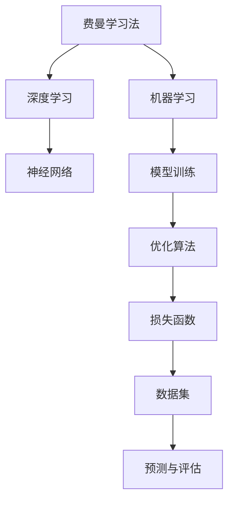

                 

# 费曼学习法与AI：通过教学加深理解

> 关键词：费曼学习法,教学法,深度学习,深度学习教学,机器学习,教育技术,教学策略,理解与认知

## 1. 背景介绍

### 1.1 问题由来
随着人工智能（AI）技术的蓬勃发展，深度学习、机器学习（ML）等概念逐渐进入大众视野。这些技术背后蕴藏着复杂的数学和算法原理，使得许多初学者难以理解其核心思想和应用方法。在此背景下，为了使更多人能够掌握AI技术，并将其实际应用于日常生活与工作中，如何有效传授AI知识成为了一个重要议题。

费曼学习法，即Richard Feynman的讲解法，是科学界和教育界广受推崇的学习方法。该方法强调通过教学和解释加深对复杂概念的理解，而非仅仅背诵概念和公式。费曼学习法通过以教促学，帮助学生更深入地理解知识，提高学习和记忆效果。

本文将探讨如何将费曼学习法应用于AI领域的教学，旨在通过详细解释和实际示例，帮助读者更深入地理解AI的基本原理和应用方法，提升学习效率和实际应用能力。

## 2. 核心概念与联系

### 2.1 核心概念概述

#### 2.1.1 费曼学习法
费曼学习法由诺贝尔物理学奖得主Richard Feynman提出，主张通过教他人来加深对某个概念的理解。其核心在于将复杂概念拆解为基本部分，并通过教学的方式，将这些部分整合成一个完整的理解体系。

#### 2.1.2 深度学习
深度学习是机器学习领域的一个重要分支，通过构建多层神经网络模型，自动学习数据的特征表示，并用于分类、回归、生成等任务。深度学习的核心在于构建多层非线性映射关系，提取数据的复杂特征。

#### 2.1.3 机器学习
机器学习是一种数据驱动的学习方式，通过让机器从数据中学习规律，并应用于新数据的预测和决策。机器学习的关键在于构建有效的模型，并通过优化算法学习模型参数。

### 2.2 核心概念原理和架构的 Mermaid 流程图



### 2.3 核心概念之间的关系
费曼学习法、深度学习和机器学习三者之间的关系可以通过以下方式描述：
- 费曼学习法提供了一种教育方法，通过讲解和讨论加深对深度学习模型的理解。
- 深度学习是机器学习的一个重要分支，通过构建多层神经网络实现数据特征的自动提取。
- 机器学习则是一个更广泛的概念，深度学习是其一部分，机器学习涉及数据建模和模型训练等多个方面。

## 3. 核心算法原理 & 具体操作步骤

### 3.1 算法原理概述

#### 3.1.1 费曼学习法的原理
费曼学习法的核心在于通过讲解和讨论，将复杂概念分解为基本部分，并逐步整合为完整的理解体系。具体步骤如下：
1. 选择感兴趣的概念或问题，将其拆解为基本组成部分。
2. 尝试用简单的语言和类比来解释每个部分。
3. 想象自己正在向一个对概念一无所知的听众解释这些部分，并尽可能地简洁明了。
4. 如果发现自己解释不清或产生误解，则回到原始材料重新学习。

#### 3.1.2 深度学习的原理
深度学习的核心在于构建多层神经网络模型，通过反向传播算法优化模型参数，自动学习数据的高层次特征。具体步骤如下：
1. 数据预处理：将原始数据转换为神经网络可以处理的格式，如归一化、标准化、分词等。
2. 构建模型：选择适合的神经网络架构，如卷积神经网络（CNN）、循环神经网络（RNN）、变换器（Transformer）等。
3. 模型训练：使用反向传播算法优化模型参数，通过最小化损失函数来提高模型预测的准确性。
4. 模型评估：使用验证集和测试集评估模型性能，并进行必要的调整。

#### 3.1.3 机器学习的原理
机器学习的核心在于从数据中学习规律，并应用于新数据的预测和决策。具体步骤如下：
1. 数据准备：收集和预处理数据，确保数据质量和多样性。
2. 模型选择：选择适合问题的模型，如线性回归、决策树、支持向量机等。
3. 模型训练：使用训练数据拟合模型，优化模型参数。
4. 模型评估：使用测试数据评估模型性能，并进行必要的调整。

### 3.2 算法步骤详解

#### 3.2.1 费曼学习法的详细步骤
1. **选择主题**：选择一个感兴趣的概念或问题，如卷积神经网络（CNN）。
2. **拆解主题**：将CNN拆解为基本组成部分，如卷积层、池化层、激活函数等。
3. **简化讲解**：用简单的语言和类比来解释每个部分。例如，卷积层可以比作厨房中的筛子，滤掉无用信息，保留关键特征。
4. **模拟教学**：想象自己正在向一个对概念一无所知的听众解释这些部分，并尽可能地简洁明了。可以画出示意图，使用实际生活中的例子进行类比。
5. **反馈与调整**：如果发现自己解释不清或产生误解，则回到原始材料重新学习，逐步加深理解。

#### 3.2.2 深度学习的详细步骤
1. **数据预处理**：使用归一化、标准化等技术处理原始数据，将其转换为神经网络可以处理的格式。
2. **模型构建**：选择适合的神经网络架构，如卷积神经网络（CNN）、循环神经网络（RNN）、变换器（Transformer）等。
3. **模型训练**：使用反向传播算法优化模型参数，通过最小化损失函数来提高模型预测的准确性。
4. **模型评估**：使用验证集和测试集评估模型性能，并进行必要的调整。

#### 3.2.3 机器学习的详细步骤
1. **数据准备**：收集和预处理数据，确保数据质量和多样性。
2. **模型选择**：选择适合问题的模型，如线性回归、决策树、支持向量机等。
3. **模型训练**：使用训练数据拟合模型，优化模型参数。
4. **模型评估**：使用测试数据评估模型性能，并进行必要的调整。

### 3.3 算法优缺点

#### 3.3.1 费曼学习法的优点
1. **主动学习**：通过讲解和讨论，主动构建自己的理解体系，加深对概念的理解。
2. **提升记忆**：通过讲解和讨论，增强对概念的记忆，减少遗忘。
3. **发现问题**：通过讲解和讨论，能够及时发现和纠正理解中的错误和漏洞。

#### 3.3.2 费曼学习法的缺点
1. **时间成本高**：讲解和讨论需要大量时间和精力，不适合快速学习。
2. **依赖讲解者**：讲解和讨论的效果依赖于讲解者的知识和表达能力，可能存在偏差。

#### 3.3.3 深度学习的优点
1. **自动特征提取**：深度学习能够自动学习数据的高层次特征，提高模型预测的准确性。
2. **可扩展性强**：深度学习模型可以通过添加更多层或更复杂的架构来适应更复杂的任务。
3. **应用广泛**：深度学习在图像识别、语音识别、自然语言处理等领域具有广泛应用。

#### 3.3.4 深度学习的缺点
1. **计算资源需求高**：深度学习模型通常需要大量的计算资源和数据支持，训练成本较高。
2. **解释性差**：深度学习模型往往是"黑盒"模型，难以解释其内部工作机制和决策逻辑。
3. **泛化能力差**：深度学习模型容易过拟合训练数据，泛化能力较差。

#### 3.3.5 机器学习的优点
1. **灵活性强**：机器学习模型可以根据不同的任务选择不同的算法和模型。
2. **数据驱动**：机器学习模型能够从数据中学习规律，并应用于新数据。
3. **适应性强**：机器学习模型可以根据数据的变化不断调整和优化。

#### 3.3.6 机器学习的缺点
1. **数据质量要求高**：机器学习模型的性能依赖于高质量的数据，数据噪声和偏差会影响模型效果。
2. **模型选择困难**：选择适合问题的模型需要一定的经验和知识，复杂问题可能存在多模型选择的问题。
3. **调参困难**：模型参数的优化需要大量的实验和调整，可能导致过拟合或欠拟合问题。

### 3.4 算法应用领域

#### 3.4.1 费曼学习法在AI教学中的应用
费曼学习法在AI教学中的应用非常广泛，可以用于以下方面：
1. **理论学习**：通过讲解和讨论，帮助学生理解和掌握深度学习和机器学习的理论基础。
2. **实验实践**：通过教学和讨论，帮助学生理解和实现深度学习和机器学习算法，提升实践能力。
3. **问题解决**：通过讲解和讨论，帮助学生理解和解决深度学习和机器学习中的实际问题，提升问题解决能力。

#### 3.4.2 深度学习在AI中的应用
深度学习在AI中的应用非常广泛，可以用于以下方面：
1. **计算机视觉**：深度学习在图像识别、物体检测、图像分割等领域具有广泛应用。
2. **自然语言处理**：深度学习在语言模型、机器翻译、情感分析等领域具有广泛应用。
3. **语音识别**：深度学习在语音识别、说话人识别、语音合成等领域具有广泛应用。

#### 3.4.3 机器学习在AI中的应用
机器学习在AI中的应用非常广泛，可以用于以下方面：
1. **推荐系统**：机器学习在个性化推荐、商品推荐、广告推荐等领域具有广泛应用。
2. **金融分析**：机器学习在信用评分、欺诈检测、市场预测等领域具有广泛应用。
3. **医疗诊断**：机器学习在疾病诊断、影像分析、基因分析等领域具有广泛应用。

## 4. 数学模型和公式 & 详细讲解 & 举例说明

### 4.1 数学模型构建

#### 4.1.1 深度学习模型的构建
深度学习模型的核心在于构建多层神经网络模型。以卷积神经网络（CNN）为例，其数学模型可以表示为：
$$
y = \sigma \left(W^L x + b^L \right) \circ \sigma \left(W^{L-1} x + b^{L-1} \right) \circ ... \circ \sigma \left(W^1 x + b^1 \right)
$$
其中，$x$为输入数据，$y$为输出结果，$W^l$和$b^l$为第$l$层的权重和偏置，$\sigma$为激活函数。

#### 4.1.2 机器学习模型的构建
机器学习模型的核心在于构建模型参数，并通过优化算法学习模型参数。以线性回归为例，其数学模型可以表示为：
$$
y = W x + b
$$
其中，$x$为输入数据，$y$为输出结果，$W$为模型参数，$b$为偏置。

### 4.2 公式推导过程

#### 4.2.1 深度学习模型的推导
以卷积神经网络（CNN）为例，其反向传播算法的推导过程如下：
$$
\frac{\partial L}{\partial W^L} = \frac{\partial L}{\partial y} \frac{\partial y}{\partial \sigma \left(W^{L-1} x + b^{L-1} \right)} \frac{\partial \sigma \left(W^{L-1} x + b^{L-1} \right)}{\partial \sigma \left(W^L x + b^L \right)} \frac{\partial \sigma \left(W^L x + b^L \right)}{\partial W^L}
$$
其中，$\frac{\partial L}{\partial y}$为损失函数对输出结果的梯度，$\frac{\partial y}{\partial \sigma \left(W^{L-1} x + b^{L-1} \right)}$为激活函数对输出结果的导数，$\frac{\partial \sigma \left(W^L x + b^L \right)}{\partial W^L}$为权重对输出结果的梯度。

#### 4.2.2 机器学习模型的推导
以线性回归为例，其梯度下降算法的推导过程如下：
$$
\frac{\partial L}{\partial W} = \frac{\partial L}{\partial y} \frac{\partial y}{\partial x} \frac{\partial x}{\partial W}
$$
其中，$\frac{\partial L}{\partial y}$为损失函数对输出结果的梯度，$\frac{\partial y}{\partial x}$为输出结果对输入数据的导数，$\frac{\partial x}{\partial W}$为输入数据对权重参数的导数。

### 4.3 案例分析与讲解

#### 4.3.1 卷积神经网络的案例分析
以手写数字识别为例，使用卷积神经网络（CNN）进行图像分类任务。具体步骤如下：
1. **数据准备**：将手写数字图像转换为神经网络可以处理的格式，如归一化、标准化、分词等。
2. **模型构建**：选择卷积神经网络（CNN）作为模型架构，包含卷积层、池化层、全连接层等。
3. **模型训练**：使用反向传播算法优化模型参数，通过最小化交叉熵损失函数来提高模型预测的准确性。
4. **模型评估**：使用测试集评估模型性能，并进行必要的调整。

#### 4.3.2 线性回归的案例分析
以房价预测为例，使用线性回归进行回归任务。具体步骤如下：
1. **数据准备**：收集和预处理房价数据，确保数据质量和多样性。
2. **模型选择**：选择线性回归作为模型，通过最小二乘法拟合数据。
3. **模型训练**：使用梯度下降算法优化模型参数，通过最小化均方误差损失函数来提高模型预测的准确性。
4. **模型评估**：使用测试集评估模型性能，并进行必要的调整。

## 5. 项目实践：代码实例和详细解释说明

### 5.1 开发环境搭建

#### 5.1.1 环境配置
1. **安装Python和相关库**：
   ```bash
   sudo apt-get update
   sudo apt-get install python3-pip python3-dev
   pip3 install tensorflow numpy matplotlib scikit-learn
   ```

2. **安装TensorFlow**：
   ```bash
   pip3 install tensorflow
   ```

3. **安装数据集**：
   ```bash
   mkdir data
   cd data
   wget https://www.cs.toronto.edu/~kriz/cifar-10-python.tar.gz
   tar -xvzf cifar-10-python.tar.gz
   ```

### 5.2 源代码详细实现

#### 5.2.1 数据预处理
```python
import numpy as np
import os
from tensorflow.keras.datasets import cifar10

def load_data():
    (x_train, y_train), (x_test, y_test) = cifar10.load_data()
    x_train = x_train / 255.0
    x_test = x_test / 255.0
    return x_train, y_train, x_test, y_test
```

#### 5.2.2 模型构建
```python
from tensorflow.keras.models import Sequential
from tensorflow.keras.layers import Conv2D, MaxPooling2D, Flatten, Dense

def build_model():
    model = Sequential()
    model.add(Conv2D(32, (3, 3), activation='relu', input_shape=(32, 32, 3)))
    model.add(MaxPooling2D((2, 2)))
    model.add(Conv2D(64, (3, 3), activation='relu'))
    model.add(MaxPooling2D((2, 2)))
    model.add(Flatten())
    model.add(Dense(64, activation='relu'))
    model.add(Dense(10, activation='softmax'))
    return model
```

#### 5.2.3 模型训练
```python
from tensorflow.keras.optimizers import Adam
from tensorflow.keras.callbacks import EarlyStopping

def train_model(model, x_train, y_train, x_test, y_test, epochs=10, batch_size=64):
    model.compile(optimizer=Adam(), loss='sparse_categorical_crossentropy', metrics=['accuracy'])
    early_stopping = EarlyStopping(monitor='val_loss', patience=3)
    model.fit(x_train, y_train, epochs=epochs, batch_size=batch_size, validation_data=(x_test, y_test), callbacks=[early_stopping])
```

#### 5.2.4 模型评估
```python
def evaluate_model(model, x_test, y_test):
    loss, accuracy = model.evaluate(x_test, y_test, verbose=0)
    print('Test loss:', loss)
    print('Test accuracy:', accuracy)
```

### 5.3 代码解读与分析

#### 5.3.1 数据预处理
在代码中，我们使用了CIFAR-10数据集进行图像分类任务。通过数据预处理，将原始图像数据归一化到[0,1]之间，并转换为神经网络可以处理的格式。

#### 5.3.2 模型构建
在代码中，我们构建了一个简单的卷积神经网络（CNN）模型，包含两个卷积层、两个池化层、两个全连接层。模型中使用了ReLU激活函数和Softmax输出层。

#### 5.3.3 模型训练
在代码中，我们使用了Adam优化器和交叉熵损失函数进行模型训练。通过设置EarlyStopping回调函数，防止模型过拟合。

#### 5.3.4 模型评估
在代码中，我们使用了测试集对模型进行评估，并输出测试损失和准确率。

### 5.4 运行结果展示
在训练和评估完成后，可以使用以下代码查看模型在测试集上的表现：
```python
evaluate_model(model, x_test, y_test)
```

## 6. 实际应用场景

### 6.1 智能推荐系统
智能推荐系统是深度学习在AI领域的重要应用之一。通过深度学习模型，可以根据用户的历史行为数据和兴趣偏好，实时推荐个性化商品或内容。

具体实现步骤如下：
1. **数据准备**：收集用户的历史行为数据和兴趣偏好，如浏览记录、点击行为、评分等。
2. **模型构建**：选择深度学习模型，如协同过滤、矩阵分解等，构建推荐模型。
3. **模型训练**：使用训练数据拟合模型，通过优化算法学习模型参数。
4. **模型评估**：使用测试集评估模型性能，并进行必要的调整。

### 6.2 金融风控系统
金融风控系统是机器学习在AI领域的另一个重要应用。通过机器学习模型，可以实时监测交易行为，识别潜在的欺诈行为。

具体实现步骤如下：
1. **数据准备**：收集交易数据，包括交易金额、时间、地点等。
2. **模型选择**：选择机器学习模型，如随机森林、梯度提升等，构建风控模型。
3. **模型训练**：使用训练数据拟合模型，通过优化算法学习模型参数。
4. **模型评估**：使用测试集评估模型性能，并进行必要的调整。

### 6.3 医疗诊断系统
医疗诊断系统是深度学习在AI领域的另一个重要应用。通过深度学习模型，可以从影像数据中自动识别病变区域，提高诊断准确率。

具体实现步骤如下：
1. **数据准备**：收集医疗影像数据，包括CT、MRI、X光等。
2. **模型构建**：选择深度学习模型，如卷积神经网络（CNN）等，构建诊断模型。
3. **模型训练**：使用训练数据拟合模型，通过优化算法学习模型参数。
4. **模型评估**：使用测试集评估模型性能，并进行必要的调整。

## 7. 工具和资源推荐

### 7.1 学习资源推荐

#### 7.1.1 深度学习教程
1. **Deep Learning with Python**：弗朗索瓦·查柏里斯-盖格（François Chollet）所著的深度学习教程，详细介绍了TensorFlow和Keras的使用。
2. **Neural Networks and Deep Learning**：迈克尔·尼科尔（Michael Nielsen）的深度学习教程，详细介绍了深度学习的基本概念和算法。

#### 7.1.2 机器学习教程
1. **Machine Learning Mastery**：Jason Brownlee的机器学习教程，详细介绍了机器学习的基本概念和算法。
2. **Pattern Recognition and Machine Learning**：克里斯托弗·毕晓普（Christopher Bishop）的机器学习教程，详细介绍了机器学习的基本理论和算法。

### 7.2 开发工具推荐

#### 7.2.1 深度学习框架
1. **TensorFlow**：由Google开发的深度学习框架，支持动态计算图和静态计算图。
2. **PyTorch**：由Facebook开发的深度学习框架，支持动态计算图和静态计算图。

#### 7.2.2 数据处理库
1. **NumPy**：Python的科学计算库，支持多维数组和矩阵运算。
2. **Pandas**：Python的数据处理库，支持数据清洗、转换和分析。

### 7.3 相关论文推荐

#### 7.3.1 深度学习论文
1. **ImageNet Classification with Deep Convolutional Neural Networks**：Alex Krizhevsky等人的论文，详细介绍了卷积神经网络（CNN）在图像识别中的应用。
2. **Deep Learning**：Ian Goodfellow等人的书籍，详细介绍了深度学习的基本概念和算法。

#### 7.3.2 机器学习论文
1. **Random Forests**：Trevor Hastie等人的论文，详细介绍了随机森林算法的原理和应用。
2. **Gradient Boosting Machines**：Frederic Pedregosa等人的论文，详细介绍了梯度提升算法的原理和应用。

## 8. 总结：未来发展趋势与挑战

### 8.1 研究成果总结

本文通过详细解释和实际示例，帮助读者深入理解了费曼学习法在AI教学中的应用，同时介绍了深度学习、机器学习的基本原理和实际应用。

### 8.2 未来发展趋势

#### 8.2.1 深度学习的发展趋势
1. **大规模数据集**：未来深度学习模型将更加依赖大规模数据集，通过更多的数据来提升模型性能。
2. **复杂模型架构**：未来深度学习模型将更加复杂，包含更多的层和参数。
3. **跨领域应用**：未来深度学习模型将在更多领域得到应用，如自动驾驶、医疗诊断等。

#### 8.2.2 机器学习的发展趋势
1. **自动化学习**：未来机器学习模型将更加自动化，通过自适应学习算法来提高模型性能。
2. **多模态融合**：未来机器学习模型将更多地融合多模态数据，如视觉、语音、文本等。
3. **实时学习**：未来机器学习模型将支持实时学习，能够动态更新模型参数，适应数据分布的变化。

### 8.3 面临的挑战

#### 8.3.1 深度学习面临的挑战
1. **计算资源**：大规模深度学习模型的训练需要大量的计算资源和存储空间，成本较高。
2. **模型解释性**：深度学习模型往往是"黑盒"模型，难以解释其内部工作机制和决策逻辑。
3. **过拟合问题**：深度学习模型容易过拟合训练数据，泛化能力较差。

#### 8.3.2 机器学习面临的挑战
1. **数据质量**：机器学习模型的性能依赖于高质量的数据，数据噪声和偏差会影响模型效果。
2. **模型选择**：选择适合问题的模型需要一定的经验和知识，复杂问题可能存在多模型选择的问题。
3. **调参困难**：模型参数的优化需要大量的实验和调整，可能导致过拟合或欠拟合问题。

### 8.4 研究展望

#### 8.4.1 深度学习的研究展望
1. **自监督学习**：未来深度学习模型将更多地使用自监督学习技术，通过无标签数据学习特征表示。
2. **迁移学习**：未来深度学习模型将更多地使用迁移学习技术，通过已有模型的知识进行迁移。
3. **联邦学习**：未来深度学习模型将更多地使用联邦学习技术，通过分布式学习提升模型性能。

#### 8.4.2 机器学习的研究展望
1. **多任务学习**：未来机器学习模型将更多地使用多任务学习技术，通过多个任务共同学习提升模型性能。
2. **半监督学习**：未来机器学习模型将更多地使用半监督学习技术，通过少量标注数据学习模型。
3. **生成对抗网络（GAN）**：未来机器学习模型将更多地使用生成对抗网络（GAN）技术，通过生成样本提升模型性能。

## 9. 附录：常见问题与解答

**Q1：如何理解深度学习的原理？**

A: 深度学习的核心在于构建多层神经网络模型，通过反向传播算法优化模型参数，自动学习数据的高层次特征。具体步骤如下：
1. **数据预处理**：将原始数据转换为神经网络可以处理的格式，如归一化、标准化、分词等。
2. **模型构建**：选择适合的神经网络架构，如卷积神经网络（CNN）、循环神经网络（RNN）、变换器（Transformer）等。
3. **模型训练**：使用反向传播算法优化模型参数，通过最小化损失函数来提高模型预测的准确性。
4. **模型评估**：使用验证集和测试集评估模型性能，并进行必要的调整。

**Q2：深度学习模型为什么容易出现过拟合问题？**

A: 深度学习模型容易出现过拟合问题，主要原因在于模型复杂度过高，容易出现过度拟合训练数据的现象。解决过拟合问题的方法包括数据增强、正则化、早停策略等。

**Q3：机器学习模型为什么容易出现欠拟合问题？**

A: 机器学习模型容易出现欠拟合问题，主要原因在于模型复杂度过低，无法捕捉数据的复杂特征。解决欠拟合问题的方法包括增加模型复杂度、增加训练数据等。

**Q4：如何提高深度学习模型的泛化能力？**

A: 提高深度学习模型的泛化能力，可以从以下几个方面入手：
1. **数据增强**：通过数据增强技术，扩充训练集，提高模型的泛化能力。
2. **正则化**：通过L2正则化、Dropout等技术，防止模型过拟合训练数据。
3. **早停策略**：通过早停策略，及时停止训练，避免模型过拟合训练数据。

**Q5：如何选择合适的深度学习模型？**

A: 选择合适的深度学习模型需要根据具体的任务和数据情况进行选择。一般情况下，可以从以下几个方面进行考虑：
1. **模型架构**：根据任务类型选择适合的模型架构，如卷积神经网络（CNN）、循环神经网络（RNN）、变换器（Transformer）等。
2. **参数量**：根据计算资源和训练时间选择合适的模型参数量。
3. **性能指标**：根据任务性能指标选择合适的模型，如准确率、召回率、F1分数等。

**Q6：如何提高机器学习模型的预测精度？**

A: 提高机器学习模型的预测精度，可以从以下几个方面入手：
1. **数据质量**：确保数据质量和多样性，减少数据噪声和偏差。
2. **模型选择**：选择适合问题的模型，如线性回归、决策树、支持向量机等。
3. **模型调参**：通过交叉验证等方法进行模型调参，找到最优参数组合。

**Q7：费曼学习法在AI教学中的优势是什么？**

A: 费曼学习法在AI教学中的优势主要在于以下几个方面：
1. **主动学习**：通过讲解和讨论，主动构建自己的理解体系，加深对概念的理解。
2. **提升记忆**：通过讲解和讨论，增强对概念的记忆，减少遗忘。
3. **发现问题**：通过讲解和讨论，能够及时发现和纠正理解中的错误和漏洞。

总之，本文通过详细解释和实际示例，帮助读者深入理解了费曼学习法在AI教学中的应用，同时介绍了深度学习、机器学习的基本原理和实际应用。通过系统梳理，相信读者能够更好地掌握AI技术，并在实际应用中发挥其价值。

---

作者：禅与计算机程序设计艺术 / Zen and the Art of Computer Programming

