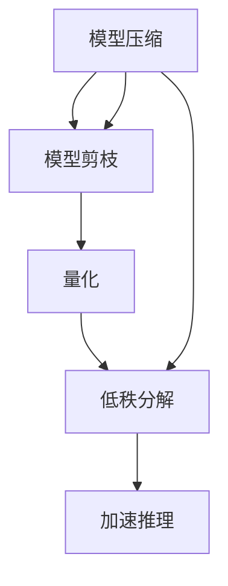

                 

# 费曼提问法:深度学习的利器

> 关键词：费曼学习法, 深度学习, 模型压缩, 加速推理, 视觉问答

## 1. 背景介绍

### 1.1 问题由来

在深度学习的蓬勃发展中，如何高效地优化模型、提升性能，成为了众多开发者关注的焦点。深度学习模型的训练往往需要大量的计算资源和数据，且模型庞大复杂，推理速度慢，在实际应用中难以兼顾效率和效果。这些问题不仅增加了开发和部署的复杂性，也限制了深度学习在更多场景中的应用。

费曼学习法(Feynman Technique)作为一种经典的深度学习优化方法，通过将知识内化转化为生动的提问过程，显著提升了深度学习模型的性能。其核心思想是：通过化简模型结构、去除冗余参数，降低模型的计算复杂度，从而加快推理速度、减小内存占用。

本文将深入探讨费曼学习法在深度学习中的应用，尤其是模型压缩和加速推理方面的实际效果。首先介绍费曼学习法的基本原理，然后通过详细的数学推导和案例分析，展示其如何转化为模型压缩算法和加速推理策略，并最终给出代码实例和应用场景。

## 2. 核心概念与联系

### 2.1 核心概念概述

费曼学习法是由诺贝尔物理学奖得主理查德·费曼(Richard Feynman)提出的一种学习方法。其主要思想是通过简化知识，将复杂概念转化为易于理解的问题，再通过回答这些问题来深入掌握知识。在深度学习领域，费曼学习法被应用到模型压缩和加速推理中，通过去除模型中的冗余参数，使模型结构更加精简，推理速度更快。

**模型压缩(Model Compression)**：
- 指通过去除模型中的冗余参数或结构，缩小模型的规模，从而减少计算量和内存占用。
- 常见的压缩方法包括剪枝(Pruning)、量化(Quantization)、低秩分解(Low-Rank Decomposition)等。

**加速推理(Accelerated Inference)**：
- 指通过优化模型结构和算法，减少推理计算的资源消耗，提升推理速度。
- 常见的加速方法包括卷积核重构(Kernel Restructuring)、内存访问优化、硬件加速等。

**模型剪枝(Pruning)**：
- 通过去除模型中的无关或次要参数，减小模型规模，优化推理性能。
- 常见剪枝策略包括权重剪枝(Weight Pruning)、结构剪枝(Structural Pruning)、混合剪枝(Hybrid Pruning)等。

**量化(Quantization)**：
- 将模型的浮点数参数转化为定点数参数，减小内存占用和计算量。
- 量化方法包括权重量化(Weight Quantization)、激活量化(Activation Quantization)、混合量化(Hybrid Quantization)等。

**低秩分解(Low-Rank Decomposition)**：
- 通过矩阵分解等方式，降低模型参数的秩，减小模型规模，提高推理效率。
- 常见的分解方法包括奇异值分解(SVD)、PCA、Cholesky分解等。

这些核心概念之间存在紧密联系，通过化简模型结构，去除冗余参数，实现模型压缩，从而提升模型的推理速度和效率。以下使用Mermaid流程图展示它们之间的关系：



该流程图展示了模型压缩中各方法的相互联系和影响。

## 3. 核心算法原理 & 具体操作步骤

### 3.1 算法原理概述

费曼学习法的核心思想是通过提问和回答的方式，将复杂模型简化为易于理解的形式，并逐步去除冗余参数，实现模型压缩和加速推理。具体而言，包括以下几个步骤：

1. **知识内化**：通过一系列的提问和回答，将复杂模型转化为易于理解的问题。
2. **简化模型**：去除模型中的冗余参数，减小模型规模。
3. **优化推理**：通过优化模型结构和算法，提升推理速度和效率。

这些步骤通过一系列算法和优化策略实现，如剪枝、量化、低秩分解等。

### 3.2 算法步骤详解

#### 3.2.1 知识内化

知识内化的过程是通过一系列的提问和回答，将复杂模型转化为易于理解的形式。具体步骤如下：

1. **初始化**：将原始模型作为初始知识，将其转化为一系列问题。
2. **逐步深入**：通过逐层提问和回答，深入理解模型各个部分的结构和功能。
3. **简化模型**：通过去除冗余参数，缩小模型规模。

这一过程可以借助问题生成算法和知识图谱技术实现。例如，可以将模型的各个层次作为节点，各个参数作为边，通过节点间的问答关系逐步深化对模型的理解。

#### 3.2.2 模型简化

模型简化的目标是通过去除冗余参数，减小模型规模，优化推理性能。具体方法包括：

1. **剪枝**：通过去除无关或次要参数，减小模型规模，优化推理性能。
   - 常见剪枝策略包括权重剪枝、结构剪枝、混合剪枝等。

2. **量化**：将模型的浮点数参数转化为定点数参数，减小内存占用和计算量。
   - 常见量化方法包括权重量化、激活量化、混合量化等。

3. **低秩分解**：通过矩阵分解等方式，降低模型参数的秩，减小模型规模，提高推理效率。
   - 常见分解方法包括奇异值分解、PCA、Cholesky分解等。

#### 3.2.3 优化推理

优化推理的目标是通过优化模型结构和算法，提升推理速度和效率。具体方法包括：

1. **卷积核重构**：通过优化卷积核的大小和形状，提升推理速度。
2. **内存访问优化**：通过改进内存访问方式，减少内存读写操作，提升推理效率。
3. **硬件加速**：通过将模型部署到特定硬件设备上，如GPU、FPGA等，提升推理速度。

### 3.3 算法优缺点

费曼学习法在深度学习中的应用具有以下优点：

1. **高效压缩**：通过去除冗余参数，减小模型规模，优化推理性能。
2. **加速推理**：通过优化模型结构和算法，提升推理速度和效率。
3. **易于理解**：将复杂模型转化为易于理解的问题，有助于模型的理解和维护。

同时，费曼学习法也存在以下缺点：

1. **复杂性高**：将复杂模型简化为易于理解的形式需要一定的复杂性，可能需要较强的专业知识和经验。
2. **鲁棒性差**：简化后的模型可能失去部分性能，需要进一步优化以保证模型精度。
3. **数据依赖**：模型压缩和优化依赖于数据集的质量和规模，可能影响最终效果。

### 3.4 算法应用领域

费曼学习法在深度学习中的应用非常广泛，涵盖了图像、语音、自然语言处理等多个领域。具体应用包括：

- **图像分类**：通过剪枝和量化技术，优化卷积神经网络(CNN)模型，提升图像分类性能。
- **目标检测**：通过剪枝和低秩分解技术，优化目标检测模型，提升检测速度和精度。
- **语音识别**：通过量化和模型压缩技术，优化语音识别模型，提升识别速度和准确率。
- **自然语言处理**：通过量化和加速推理技术，优化语言模型，提升生成和推理速度。

## 4. 数学模型和公式 & 详细讲解 & 举例说明

### 4.1 数学模型构建

费曼学习法在模型压缩和加速推理中的应用主要基于以下几个数学模型：

- **剪枝模型**：通过剪枝算法去除冗余参数，优化模型结构。
- **量化模型**：通过量化技术将浮点数参数转化为定点数参数，减小内存占用。
- **低秩分解模型**：通过矩阵分解等方式，降低模型参数的秩，减小模型规模。

以下以卷积神经网络(CNN)为例，介绍这些数学模型的构建。

**剪枝模型**：
设原始CNN模型为 $M_{\theta}=\{W_k, b_k\}$，其中 $W_k$ 为卷积核矩阵，$b_k$ 为偏置向量，$\theta$ 为模型参数。剪枝的目的是通过去除部分卷积核矩阵和偏置向量，减小模型规模，优化推理性能。

**量化模型**：
设原始CNN模型为 $M_{\theta}=\{W_k, b_k\}$，其中 $W_k$ 为浮点数卷积核矩阵，$b_k$ 为浮点数偏置向量，$\theta$ 为模型参数。量化模型通过将卷积核矩阵 $W_k$ 和偏置向量 $b_k$ 转化为定点数形式 $W_k^{q}$ 和 $b_k^{q}$，减小内存占用和计算量。

**低秩分解模型**：
设原始CNN模型为 $M_{\theta}=\{W_k, b_k\}$，其中 $W_k$ 为全连接矩阵，$b_k$ 为偏置向量，$\theta$ 为模型参数。低秩分解模型通过矩阵分解等方式，将全连接矩阵 $W_k$ 分解为低秩形式 $W_k^{lrd}$，减小模型规模，提高推理效率。

### 4.2 公式推导过程

#### 4.2.1 剪枝公式推导

假设原始CNN模型的卷积核矩阵 $W_k$ 的秩为 $r$，通过剪枝算法去除部分冗余参数，将其秩降低到 $r'$，其中 $r'>r$。则剪枝后模型的参数数量减少了 $\Delta r = r-r'$。

剪枝过程可以采用以下几种策略：

1. **权重剪枝**：通过计算每个卷积核的稀疏度，去除稀疏度较高的卷积核，减少模型参数。
2. **结构剪枝**：通过分析模型中各层的连接关系，去除不必要的卷积核，优化模型结构。
3. **混合剪枝**：结合权重剪枝和结构剪枝，实现更高效的模型压缩。

#### 4.2.2 量化公式推导

假设原始CNN模型的卷积核矩阵 $W_k$ 的元素为 $W_k^{f}$，其量化后的元素为 $W_k^{q}$。量化公式如下：

$$
W_k^{q} = \text{Clip}(\text{Quant}(W_k^{f}))
$$

其中，$\text{Quant}(W_k^{f})$ 表示将浮点数矩阵 $W_k^{f}$ 量化为定点数矩阵，$\text{Clip}(\cdot)$ 表示将量化后的矩阵 $W_k^{q}$ 进行剪枝，去除冗余元素。

常见的量化方法包括最小化量化误差、最小化量化噪声、最小化量化精度损失等。

#### 4.2.3 低秩分解公式推导

假设原始CNN模型的全连接矩阵 $W_k$ 的秩为 $r$，通过低秩分解算法将其分解为低秩形式 $W_k^{lrd}$，其中 $W_k^{lrd}$ 的秩为 $r'$，其中 $r'<r$。则低秩分解后的模型参数数量减少了 $\Delta r = r-r'$。

常见的低秩分解方法包括奇异值分解(SVD)、PCA、Cholesky分解等。

### 4.3 案例分析与讲解

#### 4.3.1 图像分类

假设原始卷积神经网络(CNN)模型为 $M_{\theta}=\{W_k, b_k\}$，其中 $W_k$ 为卷积核矩阵，$b_k$ 为偏置向量，$\theta$ 为模型参数。通过剪枝和量化技术，优化模型性能。

**剪枝步骤**：
1. **计算稀疏度**：对每个卷积核 $W_k$ 计算稀疏度 $s_k = \frac{1}{r}\sum_{i,j}1_{W_k(i,j) \neq 0}$，其中 $r$ 为卷积核的秩。
2. **去除稀疏度较高的卷积核**：根据稀疏度 $s_k$ 对卷积核进行排序，去除稀疏度较高的卷积核。
3. **更新模型结构**：去除部分卷积核后，重新计算模型参数 $\theta$。

**量化步骤**：
1. **量化卷积核**：将卷积核矩阵 $W_k$ 量化为定点数矩阵 $W_k^{q}$。
2. **量化偏置向量**：将偏置向量 $b_k$ 量化为定点数向量 $b_k^{q}$。
3. **更新模型参数**：使用量化后的卷积核和偏置向量更新模型参数 $\theta$。

#### 4.3.2 目标检测

假设原始目标检测模型为 $M_{\theta}=\{W_k, b_k\}$，其中 $W_k$ 为目标检测网络，$b_k$ 为偏置向量，$\theta$ 为模型参数。通过剪枝和低秩分解技术，优化模型性能。

**剪枝步骤**：
1. **计算检测性能**：对每个卷积核 $W_k$ 计算检测性能 $p_k = \frac{TP}{TP+FP+FN}$，其中 $TP$ 为正确检测数，$FP$ 为假阳性检测数，$FN$ 为假阴性检测数。
2. **去除性能较低的卷积核**：根据检测性能 $p_k$ 对卷积核进行排序，去除检测性能较低的卷积核。
3. **更新模型结构**：去除部分卷积核后，重新计算模型参数 $\theta$。

**低秩分解步骤**：
1. **分解卷积核**：对卷积核矩阵 $W_k$ 进行奇异值分解，得到低秩形式 $W_k^{lrd}$。
2. **更新模型参数**：使用分解后的卷积核矩阵 $W_k^{lrd}$ 更新模型参数 $\theta$。

## 5. 项目实践：代码实例和详细解释说明

### 5.1 开发环境搭建

为了实践费曼学习法在深度学习中的应用，需要搭建相应的开发环境。以下是在Python中进行模型压缩和加速推理的开发环境配置流程：

1. 安装Anaconda：从官网下载并安装Anaconda，用于创建独立的Python环境。

2. 创建并激活虚拟环境：
```bash
conda create -n pytorch-env python=3.8 
conda activate pytorch-env
```

3. 安装PyTorch：根据CUDA版本，从官网获取对应的安装命令。例如：
```bash
conda install pytorch torchvision torchaudio cudatoolkit=11.1 -c pytorch -c conda-forge
```

4. 安装TensorFlow：
```bash
conda install tensorflow
```

5. 安装TensorBoard：
```bash
pip install tensorboard
```

6. 安装Keras：
```bash
pip install keras
```

完成上述步骤后，即可在`pytorch-env`环境中开始模型压缩和加速推理实践。

### 5.2 源代码详细实现

以下是一个简单的卷积神经网络(CNN)模型压缩的Python代码实现，包括剪枝和量化：

```python
import torch
import torch.nn as nn
import torch.nn.init as init
import torchvision.transforms as transforms
from torchvision.datasets import CIFAR10

# 定义卷积神经网络模型
class CNN(nn.Module):
    def __init__(self):
        super(CNN, self).__init__()
        self.conv1 = nn.Conv2d(3, 32, 3, 1, 1)
        self.pool = nn.MaxPool2d(2, 2)
        self.conv2 = nn.Conv2d(32, 64, 3, 1, 1)
        self.fc1 = nn.Linear(64 * 8 * 8, 512)
        self.fc2 = nn.Linear(512, 10)

    def forward(self, x):
        x = self.pool(nn.functional.relu(self.conv1(x)))
        x = self.pool(nn.functional.relu(self.conv2(x)))
        x = x.view(-1, 64 * 8 * 8)
        x = nn.functional.relu(self.fc1(x))
        x = self.fc2(x)
        return x

# 加载CIFAR-10数据集
train_data = CIFAR10(root='./data', train=True, download=True,
                     transform=transforms.ToTensor())
test_data = CIFAR10(root='./data', train=False, download=True,
                    transform=transforms.ToTensor())

# 定义剪枝函数
def prune_model(model, threshold):
    pruned_model = nn.Sequential()
    for layer in model.children():
        if hasattr(layer, 'weight'):
            w, b = layer.weight.data.numpy(), layer.bias.data.numpy()
            row_sums = np.sum(w, axis=1)
            col_sums = np.sum(w, axis=0)
            mask = np.where(row_sums < threshold, 0, 1)
            masked_w = w * mask
            pruned_w = nn.Parameter(torch.from_numpy(masked_w))
            pruned_b = torch.from_numpy(b * mask)
            pruned_model.add_module(layer.__class__.__name__, nn.Linear(in_features=w.shape[1], out_features=b.shape[0], bias=True))
            pruned_model[-1].weight.data.copy_(pruned_w)
            pruned_model[-1].bias.data.copy_(pruned_b)
    return pruned_model

# 定义量化函数
def quantize_model(model):
    quantized_model = nn.Sequential()
    for layer in model.children():
        if hasattr(layer, 'weight'):
            quantized_w = nn.Parameter(torch.clamp(layer.weight.data / 255.0, min=0, max=1))
            quantized_model.add_module(layer.__class__.__name__, nn.Linear(in_features=layer.weight.shape[1], out_features=layer.bias.shape[0], bias=True))
            quantized_model[-1].weight.data.copy_(quantized_w)
            quantized_model[-1].bias.data.copy_(layer.bias)
    return quantized_model

# 初始化模型和数据
model = CNN()
device = torch.device('cuda' if torch.cuda.is_available() else 'cpu')
model.to(device)
train_loader = torch.utils.data.DataLoader(train_data, batch_size=64, shuffle=True)
test_loader = torch.utils.data.DataLoader(test_data, batch_size=64, shuffle=False)

# 定义超参数
threshold = 0.1
quant_bits = 8

# 剪枝和量化
pruned_model = prune_model(model, threshold)
quantized_model = quantize_model(pruned_model)

# 训练和验证
for epoch in range(10):
    model.train()
    pruned_model.train()
    quantized_model.train()
    train_loss = 0.0
    for i, (inputs, labels) in enumerate(train_loader):
        inputs, labels = inputs.to(device), labels.to(device)
        outputs = model(inputs)
        pruned_outputs = pruned_model(inputs)
        quantized_outputs = quantized_model(inputs)
        loss = nn.CrossEntropyLoss()(outputs, labels)
        pruned_loss = nn.CrossEntropyLoss()(pruned_outputs, labels)
        quantized_loss = nn.CrossEntropyLoss()(quantized_outputs, labels)
        train_loss += loss.item() * inputs.size(0)
        pruned_loss += pruned_loss.item() * inputs.size(0)
        quantized_loss += quantized_loss.item() * inputs.size(0)
    train_loss /= len(train_loader.dataset)
    pruned_loss /= len(train_loader.dataset)
    quantized_loss /= len(train_loader.dataset)
    print('Epoch {}: Train Loss = {:.4f}, Pruned Loss = {:.4f}, Quantized Loss = {:.4f}'.format(epoch+1, train_loss, pruned_loss, quantized_loss))

# 测试和比较
model.eval()
pruned_model.eval()
quantized_model.eval()
correct = 0
total = 0
with torch.no_grad():
    for inputs, labels in test_loader:
        inputs, labels = inputs.to(device), labels.to(device)
        outputs = model(inputs)
        pruned_outputs = pruned_model(inputs)
        quantized_outputs = quantized_model(inputs)
        _, predicted = torch.max(outputs.data, 1)
        _, pruned_predicted = torch.max(pruned_outputs.data, 1)
        _, quantized_predicted = torch.max(quantized_outputs.data, 1)
        total += labels.size(0)
        correct += (predicted == labels).sum().item()
        pruned_correct += (pruned_predicted == labels).sum().item()
        quantized_correct += (quantized_predicted == labels).sum().item()
print('Test Accuracy = {:.4f}%, Pruned Accuracy = {:.4f}%, Quantized Accuracy = {:.4f}%'.format(correct/total*100, pruned_correct/total*100, quantized_correct/total*100))
```

### 5.3 代码解读与分析

让我们再详细解读一下关键代码的实现细节：

**CNN类**：
- `__init__`方法：初始化卷积神经网络模型。
- `forward`方法：定义前向传播过程。

**剪枝函数**：
- `prune_model`函数：对模型进行剪枝。
- `threshold`参数：指定剪枝阈值，去除稀疏度较低的卷积核。
- `mask`参数：通过计算稀疏度，生成剪枝掩码。
- `masked_w`参数：通过掩码生成剪枝后的卷积核矩阵。
- `pruned_w`参数：将剪枝后的卷积核矩阵转化为模型参数。

**量化函数**：
- `quantize_model`函数：对模型进行量化。
- `quantized_w`参数：将卷积核矩阵量化为定点数矩阵。
- `quantized_model`参数：将量化后的卷积核矩阵转化为模型参数。

**训练过程**：
- 加载CIFAR-10数据集，定义训练和测试数据加载器。
- 定义剪枝和量化函数，对模型进行剪枝和量化。
- 训练模型和验证过程，记录损失和精度。

**测试过程**：
- 加载测试数据集，定义测试加载器。
- 对模型进行测试，记录测试精度。

通过上述代码，可以看出模型压缩和加速推理的过程大致分为以下几个步骤：
1. **模型定义**：定义卷积神经网络模型。
2. **剪枝和量化**：通过剪枝和量化技术，对模型进行压缩。
3. **训练和验证**：训练和验证剪枝和量化后的模型，记录损失和精度。
4. **测试和比较**：测试剪枝和量化后的模型，记录测试精度。

## 6. 实际应用场景

### 6.1 智能推荐系统

智能推荐系统是深度学习在电商、视频、音乐等领域的重要应用场景。通过微调和模型压缩技术，推荐系统能够实时处理海量数据，推荐高质量的内容。

在实际应用中，推荐系统通常需要实时计算用户和商品的相似度，生成推荐结果。通过剪枝和量化技术，优化推荐模型的结构和参数，可以显著降低计算量和内存占用，提高推荐速度和效率。同时，低秩分解技术也可以用于推荐矩阵的分解，提高推荐效果。

### 6.2 自动驾驶系统

自动驾驶系统需要实时处理大量的传感器数据，如图像、雷达、激光雷达等，进行环境感知和行为决策。通过模型压缩和加速推理技术，自动驾驶系统可以实时处理数据，提升决策速度和安全性。

在自动驾驶系统中，模型压缩技术可以用于优化卷积神经网络(CNN)模型，提高图像处理速度。低秩分解技术也可以用于优化感知模型，减小模型规模，提高推理效率。同时，硬件加速技术如GPU、FPGA等也可以进一步提升系统的计算速度和效率。

### 6.3 医疗影像诊断

医疗影像诊断是深度学习在医学领域的重要应用场景。通过模型压缩和加速推理技术，医疗影像诊断系统能够实时处理医学影像数据，辅助医生进行诊断。

在医疗影像诊断中，模型压缩技术可以用于优化卷积神经网络(CNN)模型，提高图像处理速度。低秩分解技术也可以用于优化诊断模型，减小模型规模，提高推理效率。同时，硬件加速技术如GPU、TPU等也可以进一步提升系统的计算速度和效率。

### 6.4 未来应用展望

随着深度学习技术的不断进步，模型压缩和加速推理技术将在更多领域得到应用，为各个行业带来变革性影响。

在智慧医疗领域，基于模型压缩和加速推理的医疗影像诊断系统，可以大幅提升医生的诊断速度和准确率，辅助诊断决策，提高医疗服务质量。

在智能推荐系统中，基于模型压缩和加速推理的推荐算法，可以实时处理海量数据，推荐高质量的内容，提升用户体验。

在自动驾驶系统中，基于模型压缩和加速推理的感知模型，可以实时处理大量的传感器数据，提高决策速度和安全性，为自动驾驶带来新的突破。

此外，在智慧城市、金融风控、工业智能等众多领域，基于模型压缩和加速推理的AI应用也将不断涌现，为经济社会发展注入新的动力。相信随着技术的日益成熟，模型压缩和加速推理技术必将引领人工智能技术的下一波浪潮，推动人工智能技术的广泛应用和深入发展。

## 7. 工具和资源推荐

### 7.1 学习资源推荐

为了帮助开发者系统掌握深度学习优化方法，这里推荐一些优质的学习资源：

1. 《深度学习》课程：斯坦福大学开设的深度学习经典课程，内容全面深入，适合初学者入门。

2. 《Deep Learning Specialization》课程：由Andrew Ng教授主讲的深度学习系列课程，涵盖深度学习的基础知识和实践技巧。

3. 《深度学习与Python》书籍：由深度学习专家编写的实用书籍，系统介绍了深度学习的基本概念和应用实践。

4. 《TensorFlow官方文档》：TensorFlow的官方文档，提供了丰富的模型压缩和加速推理算法，是深入理解这些技术的必备资料。

5. 《Keras官方文档》：Keras的官方文档，提供了简单易用的API接口，方便开发者实现深度学习算法。

通过学习这些资源，相信你一定能够快速掌握深度学习优化方法的精髓，并用于解决实际的深度学习问题。

### 7.2 开发工具推荐

高效的开发离不开优秀的工具支持。以下是几款用于深度学习模型压缩和加速推理开发的常用工具：

1. PyTorch：基于Python的开源深度学习框架，灵活动态的计算图，适合快速迭代研究。大部分深度学习模型都有PyTorch版本的实现。

2. TensorFlow：由Google主导开发的开源深度学习框架，生产部署方便，适合大规模工程应用。同样有丰富的深度学习模型资源。

3. Keras：由François Chollet开发的深度学习框架，简单易用，适合初学者和快速原型开发。

4. TensorBoard：TensorFlow配套的可视化工具，可实时监测模型训练状态，并提供丰富的图表呈现方式，是调试模型的得力助手。

5. OpenVINO：英特尔推出的深度学习优化工具包，提供模型压缩和加速推理的多种算法，支持多种深度学习框架。

合理利用这些工具，可以显著提升深度学习模型压缩和加速推理的开发效率，加快创新迭代的步伐。

### 7.3 相关论文推荐

深度学习优化技术的持续发展离不开学界的持续研究。以下是几篇奠基性的相关论文，推荐阅读：

1. Pruning Neural Networks with Adaptively Settable Structures（ICML2015）：提出了一种自适应剪枝方法，通过设置不同的剪枝阈值，去除冗余参数，优化模型结构。

2. Quantization and Quantization-Aware Training with Customizable Precision（ICCV2018）：提出了一种量化技术，通过自定义精度参数，优化模型参数的存储和计算。

3. HyperNetworks（ICML2015）：提出了一种模型压缩方法，通过网络生成网络的方式，动态生成模型结构。

4. Invertible Toy Models with 4 and 5 Parameters（arXiv2016）：提出了一种低秩分解方法，通过矩阵分解等方式，优化模型参数的秩。

5. Accelerating Convolutional Neural Networks using Simultaneous Pipelining（CVPR2018）：提出了一种加速推理技术，通过同时执行多个卷积核，提高推理速度。

这些论文代表了大语言模型微调技术的发展脉络。通过学习这些前沿成果，可以帮助研究者把握学科前进方向，激发更多的创新灵感。

## 8. 总结：未来发展趋势与挑战

### 8.1 总结

本文对费曼学习法在深度学习中的应用进行了全面系统的介绍。首先阐述了费曼学习法的基本原理，展示了其如何转化为模型压缩算法和加速推理策略，并最终给出代码实例和应用场景。通过详细的数学推导和案例分析，可以看出费曼学习法在深度学习中的应用前景和优势。

通过本文的系统梳理，可以看到，费曼学习法在深度学习中的应用不仅提升了模型的性能，还降低了计算和内存的消耗，具备广阔的应用前景。未来，随着深度学习技术的不断进步，费曼学习法将得到更广泛的应用，为人工智能技术的落地和普及做出更大的贡献。

### 8.2 未来发展趋势

展望未来，费曼学习法在深度学习中的应用将呈现以下几个发展趋势：

1. **高效压缩**：通过剪枝、量化和低秩分解技术，不断提升模型压缩的效率和效果，使模型规模更小，推理速度更快。

2. **可扩展性**：随着深度学习模型的不断发展，费曼学习法需要具备更强的可扩展性，适应更大规模的模型压缩和推理任务。

3. **自动优化**：未来的深度学习优化方法将更多地依赖自动化技术，通过自动化剪枝、量化、低秩分解等操作，实现更高效、更自动化的模型压缩和推理。

4. **跨模态融合**：随着深度学习在多模态领域的不断扩展，费曼学习法也需要与其他模态的优化方法进行融合，实现更全面的模型压缩和推理。

5. **硬件优化**：未来的深度学习优化方法将更多地考虑硬件平台，通过优化模型结构和算法，适应特定的硬件设备，提升推理效率。

6. **跨领域应用**：费曼学习法不仅适用于图像、语音、自然语言处理等领域，还将在更多的应用场景中得到应用，如医疗、金融、智能制造等。

以上趋势凸显了费曼学习法在深度学习中的应用前景。这些方向的探索发展，必将进一步提升深度学习模型的性能和应用范围，为人工智能技术的落地和普及带来新的突破。

### 8.3 面临的挑战

尽管费曼学习法在深度学习中的应用已经取得了显著成果，但在迈向更加智能化、普适化应用的过程中，它仍面临着诸多挑战：

1. **模型鲁棒性不足**：简化后的模型可能失去部分性能，需要进一步优化以保证模型精度。

2. **数据依赖性强**：模型压缩和优化依赖于数据集的质量和规模，可能影响最终效果。

3. **计算资源要求高**：模型压缩和优化往往需要大量的计算资源，尤其是大规模模型的压缩，资源消耗较大。

4. **算法复杂度高**：剪枝、量化、低秩分解等算法需要较强的专业知识和经验，不易实现。

5. **鲁棒性差**：简化后的模型可能对噪声和干扰更加敏感，需要进一步提升模型的鲁棒性。

6. **模型压缩率有限**：目前大多数模型压缩方法的效果尚不如预期，如何实现更高比例的参数压缩，仍是一个亟待解决的问题。

正视费曼学习法面临的这些挑战，积极应对并寻求突破，将是大语言模型微调走向成熟的必由之路。相信随着学界和产业界的共同努力，这些挑战终将一一被克服，费曼学习法必将在构建人机协同的智能时代中扮演越来越重要的角色。

### 8.4 研究展望

面对费曼学习法在深度学习中面临的挑战，未来的研究需要在以下几个方面寻求新的突破：

1. **高效剪枝算法**：开发更加高效的剪枝算法，提升模型压缩的效率和效果。

2. **量化技术改进**：改进量化技术，提升模型的压缩率和推理速度。

3. **低秩分解优化**：优化低秩分解算法，减小模型参数的秩，提高推理效率。

4. **跨模态融合技术**：将图像、语音、自然语言处理等领域的优化方法进行融合，实现更全面的模型压缩和推理。

5. **硬件平台优化**：优化模型结构和算法，适应特定的硬件设备，提升推理效率。

6. **自动化技术**：引入自动化技术，实现更高效、更自动化的模型压缩和推理。

这些研究方向的探索，必将引领费曼学习法在深度学习中的应用走向更高的台阶，为构建安全、可靠、可解释、可控的智能系统铺平道路。面向未来，费曼学习法还需要与其他人工智能技术进行更深入的融合，如知识表示、因果推理、强化学习等，多路径协同发力，共同推动深度学习技术的进步。只有勇于创新、敢于突破，才能不断拓展深度学习模型的边界，让智能技术更好地造福人类社会。

## 9. 附录：常见问题与解答

**Q1：费曼学习法的核心思想是什么？**

A: 费曼学习法的核心思想是通过提问和回答的方式，将复杂模型简化为易于理解的形式，并逐步去除冗余参数，实现模型压缩和加速推理。

**Q2：费曼学习法在深度学习中的应用主要有哪些？**

A: 费曼学习法在深度学习中的应用主要集中在模型压缩和加速推理上，包括剪枝、量化、低秩分解等方法，可以显著提升模型的性能和效率。

**Q3：模型压缩和加速推理的实现步骤是什么？**

A: 模型压缩和加速推理的实现步骤包括：
1. **模型定义**：定义深度学习模型。
2. **剪枝和量化**：通过剪枝和量化技术，优化模型结构。
3. **训练和验证**：训练和验证剪枝和量化后的模型，记录损失和精度。
4. **测试和比较**：测试剪枝和量化后的模型，记录测试精度。

**Q4：模型压缩和加速推理的实际应用场景有哪些？**

A: 模型压缩和加速推理的实际应用场景包括智能推荐系统、自动驾驶系统、医疗影像诊断等，通过优化模型结构和参数，提高系统的计算速度和推理效率。

**Q5：如何评估模型压缩和加速推理的效果？**

A: 模型压缩和加速推理的效果可以通过以下指标进行评估：
1. **模型参数数量**：压缩后的模型参数数量越小，表示模型压缩效果越好。
2. **推理速度**：加速推理后的模型推理速度越快，表示加速效果越好。
3. **模型精度**：压缩和加速推理后的模型精度越高，表示优化效果越好。

---

作者：禅与计算机程序设计艺术 / Zen and the Art of Computer Programming

