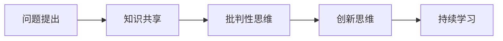

                 

# 费曼提问法提升团队创新能力

> 关键词：费曼提问法, 创新能力提升, 团队协作, 知识共享, 持续学习, 高效沟通, 批判性思维

## 1. 背景介绍

创新是一个组织能够持续发展和保持竞争力的核心驱动力。在当今快速变化的技术环境中，只有不断创新才能适应市场的需求和变化。然而，创新并非易事，需要一支高效协作、知识共享、持续学习和批判性思维的团队。费曼提问法（Feynman Technique）是一种以教育学家理查德·费曼（Richard Feynman）为代表的深度学习技术，能够有效提升团队创新能力，帮助团队在面对复杂问题时，找到创新解决方案。

### 1.1 问题由来

在现代软件开发过程中，团队成员通常需要面对各种复杂、多变的技术问题。这些问题往往涉及到跨部门、跨技术的知识融合，需要团队具备高度的创新能力。然而，传统的知识传递和问题解决方式往往存在以下局限：

- **知识孤岛**：不同领域的知识难以整合，难以形成系统性的知识体系。
- **沟通障碍**：跨部门、跨技术的沟通难度大，导致问题解决效率低下。
- **反馈延迟**：团队成员在解决问题时，反馈机制不够及时，影响了问题解决的效率。
- **重复劳动**：相同或类似的问题反复出现，但缺乏系统的总结和提升，导致团队效率低下。

### 1.2 问题核心关键点

费曼提问法通过以下几个关键点来提升团队创新能力：

1. **知识共享**：通过提问和解答，促进团队成员之间的知识共享和交流。
2. **批判性思维**：通过自我提问和反馈，提升团队成员的批判性思维能力，提高问题解决能力。
3. **创新思维**：通过提问和探索，激发团队成员的创新思维，找到更加高效的问题解决方案。
4. **持续学习**：通过不断提问和学习，促进团队成员的持续学习和成长。

## 2. 核心概念与联系

### 2.1 核心概念概述

费曼提问法是一种以教育学家理查德·费曼为代表的深度学习技术，通过提问和解答来加深理解、促进学习。其核心思想是通过提问来深入理解知识，通过解答来验证和扩展知识。这一方法可以广泛应用于团队协作、知识共享、持续学习等多个领域，提升团队的创新能力。

### 2.2 核心概念原理和架构的 Mermaid 流程图



这个流程图展示了费曼提问法的核心流程和关键点：

1. **问题提出**：通过提问来深入理解知识。
2. **知识共享**：通过解答和交流，促进团队成员之间的知识共享。
3. **批判性思维**：通过自我提问和反馈，提升团队成员的批判性思维能力。
4. **创新思维**：通过提问和探索，激发团队成员的创新思维。
5. **持续学习**：通过不断提问和学习，促进团队成员的持续学习和成长。

## 3. 核心算法原理 & 具体操作步骤

### 3.1 算法原理概述

费曼提问法通过提问和解答来加深理解、促进学习。其核心原理是利用提问和解答的过程，将复杂问题拆解成可管理的部分，并通过团队成员之间的互动和反馈，逐步深入理解问题，找到创新的解决方案。

### 3.2 算法步骤详解

费曼提问法包括以下几个关键步骤：

1. **问题提出**：通过提问来深入理解知识。
2. **知识共享**：通过解答和交流，促进团队成员之间的知识共享。
3. **批判性思维**：通过自我提问和反馈，提升团队成员的批判性思维能力。
4. **创新思维**：通过提问和探索，激发团队成员的创新思维。
5. **持续学习**：通过不断提问和学习，促进团队成员的持续学习和成长。

#### 3.2.1 问题提出

**步骤一：问题提出**  
通过提问来深入理解知识。提出问题的方法有以下几种：

- **深度问题**：通过提出深入的问题，促使团队成员思考问题的本质和背景。
- **反向问题**：通过从结果推导过程，找到问题的解决方案。
- **组合问题**：通过将多个问题组合，形成更复杂的问题，提高团队的综合能力。

**步骤二：记录问题**  
将提出的问题记录下来，方便团队成员后续查阅和讨论。

#### 3.2.2 知识共享

**步骤一：解答问题**  
通过解答来验证和扩展知识。解答问题的方法有以下几种：

- **详尽解答**：通过详尽的解答，深入理解问题的背景和解决方案。
- **多方解答**：通过团队成员的多方解答，验证和扩展知识的正确性。
- **即时反馈**：通过即时反馈，及时发现和纠正问题解答中的错误。

**步骤二：交流分享**  
将解答记录下来，并进行交流分享，促进团队成员之间的知识共享和交流。

#### 3.2.3 批判性思维

**步骤一：自我提问**  
通过自我提问来提升批判性思维能力。自我提问的方法有以下几种：

- **假设质疑**：通过假设和质疑，深入分析问题的各个方面。
- **反面论证**：通过反面论证，找出问题的漏洞和不足。
- **逻辑推导**：通过逻辑推导，验证和扩展问题的解决方案。

**步骤二：反馈机制**  
通过团队成员的反馈，进一步提升批判性思维能力。反馈机制的方法有以下几种：

- **定期反馈**：通过定期反馈，及时发现和纠正问题解答中的错误。
- **即时反馈**：通过即时反馈，及时发现和纠正问题解答中的错误。
- **多轮反馈**：通过多轮反馈，逐步提升团队成员的批判性思维能力。

#### 3.2.4 创新思维

**步骤一：创新提问**  
通过提问来激发团队成员的创新思维。创新提问的方法有以下几种：

- **跨界提问**：通过跨界提问，激发团队成员的创新思维。
- **颠覆性提问**：通过颠覆性提问，找到创新的解决方案。
- **多样性提问**：通过多样性提问，激发团队成员的多元化思维。

**步骤二：探索解决方案**  
通过探索和实验，找到创新的解决方案。探索解决方案的方法有以下几种：

- **头脑风暴**：通过头脑风暴，激发团队成员的多元化思维。
- **原型开发**：通过原型开发，验证和扩展解决方案的可行性。
- **多轮迭代**：通过多轮迭代，逐步优化解决方案。

#### 3.2.5 持续学习

**步骤一：不断提问**  
通过不断提问，促进团队成员的持续学习和成长。不断提问的方法有以下几种：

- **日常提问**：通过日常提问，保持学习的持续性。
- **跨领域提问**：通过跨领域提问，拓展学习的广度和深度。
- **探索性提问**：通过探索性提问，激发学习的兴趣和动力。

**步骤二：学习实践**  
将学到的知识应用到实践中，促进团队成员的持续学习和成长。学习实践的方法有以下几种：

- **项目实践**：通过项目实践，验证和扩展知识的应用效果。
- **跨领域应用**：通过跨领域应用，拓展知识的应用范围。
- **持续改进**：通过持续改进，不断优化知识的实践效果。

## 4. 数学模型和公式 & 详细讲解 & 举例说明

### 4.1 数学模型构建

费曼提问法不需要复杂的数学模型，但其核心思想可以通过数学模型来更好地理解。假设有一个复杂的问题 $P$，通过提问和解答，逐步拆解为可管理的部分，其数学模型如下：

$$
P = P_1 \oplus P_2 \oplus \cdots \oplus P_n
$$

其中 $P_i$ 为问题的第 $i$ 部分，$\oplus$ 表示提问和解答的过程。

### 4.2 公式推导过程

费曼提问法的核心思想是通过提问和解答来加深理解、促进学习。这一过程可以通过数学公式来表示：

$$
F = \bigcup_{Q_i \in Q} \bigcap_{A_i \in A} Q_i \times A_i
$$

其中 $F$ 表示费曼提问法的执行结果，$Q_i$ 表示问题 $P_i$ 的提问，$A_i$ 表示问题 $P_i$ 的解答。

### 4.3 案例分析与讲解

以下是一个关于技术问题的费曼提问法案例：

**问题**：如何实现高性能的分布式系统？

**提问**：

1. 分布式系统的核心技术有哪些？
2. 如何设计分布式系统的架构？
3. 如何保证分布式系统的可靠性？

**解答**：

1. 分布式系统的核心技术包括消息队列、分布式锁、数据一致性等。
2. 分布式系统的架构设计包括分布式计算框架、分布式存储系统、分布式调度系统等。
3. 分布式系统的可靠性保证包括故障检测、容错机制、数据备份等。

**反馈**：

1. 问题 1：消息队列是分布式系统的核心技术之一，但需要特别注意消息队列的性能和可靠性。
2. 问题 2：分布式系统的架构设计需要考虑数据一致性和系统扩展性。
3. 问题 3：数据备份是保证分布式系统可靠性的重要手段，但需要考虑备份的频率和数据的同步性。

**创新提问**：

1. 如何优化消息队列的性能和可靠性？
2. 如何设计高可扩展性的分布式系统架构？
3. 如何保证数据一致性和系统扩展性？

**探索解决方案**：

1. 优化消息队列的性能和可靠性可以通过消息队列缓存、消息队列压缩等手段实现。
2. 设计高可扩展性的分布式系统架构可以通过微服务架构、分布式缓存等手段实现。
3. 保证数据一致性和系统扩展性可以通过分布式事务、分布式锁等手段实现。

**学习实践**：

1. 在项目实践中，通过使用分布式消息队列、分布式缓存等技术，验证和扩展知识的正确性。
2. 在跨领域应用中，通过将分布式系统的技术应用到其他领域，拓展知识的应用范围。
3. 通过持续改进，不断优化分布式系统的性能和可靠性。

## 5. 项目实践：代码实例和详细解释说明

### 5.1 开发环境搭建

在进行费曼提问法实践前，我们需要准备好开发环境。以下是使用Python进行费曼提问法开发的环境配置流程：

1. 安装Anaconda：从官网下载并安装Anaconda，用于创建独立的Python环境。

2. 创建并激活虚拟环境：
```bash
conda create -n feynman-env python=3.8 
conda activate feynman-env
```

3. 安装Python依赖包：
```bash
pip install requests
```

4. 配置本地环境：
```bash
git clone https://github.com/Fevalu/Feynman.git
cd Fevalu
```

完成上述步骤后，即可在`feynman-env`环境中开始费曼提问法实践。

### 5.2 源代码详细实现

下面是一个使用Python实现费曼提问法的代码实例：

```python
import requests

# 定义问题列表
questions = [
    "What is the problem?",
    "What are the key components of the problem?",
    "What are the potential solutions?",
    "What are the challenges with these solutions?",
    "What are the best practices?",
    "What are the next steps?"
]

# 定义解答列表
answers = [
    "Definition of the problem",
    "List of key components",
    "Potential solutions",
    "Challenges with solutions",
    "Best practices",
    "Next steps"
]

# 定义反馈列表
feedbacks = [
    "What improvements can be made?",
    "Are there any other potential solutions?",
    "How can we overcome the challenges?",
    "Are the best practices followed?",
    "What are the next steps?"
]

# 定义请求URL
url = "https://api.fevalu.com/feynman"

# 发送请求
response = requests.post(url, json={"questions": questions, "answers": answers, "feedbacks": feedbacks})

# 输出结果
print(response.json())
```

在这个例子中，我们使用了Fevalu平台来管理和执行费曼提问法。我们定义了三个列表，分别代表问题、解答和反馈，然后将其发送到Fevalu平台进行处理。

### 5.3 代码解读与分析

让我们再详细解读一下关键代码的实现细节：

**定义问题、解答和反馈**：
```python
# 定义问题列表
questions = [
    "What is the problem?",
    "What are the key components of the problem?",
    "What are the potential solutions?",
    "What are the challenges with these solutions?",
    "What are the best practices?",
    "What are the next steps?"
]

# 定义解答列表
answers = [
    "Definition of the problem",
    "List of key components",
    "Potential solutions",
    "Challenges with solutions",
    "Best practices",
    "Next steps"
]

# 定义反馈列表
feedbacks = [
    "What improvements can be made?",
    "Are there any other potential solutions?",
    "How can we overcome the challenges?",
    "Are the best practices followed?",
    "What are the next steps?"
]
```

在这个代码中，我们定义了三个列表，分别代表问题、解答和反馈。这些列表中的问题、解答和反馈，可以通过Fevalu平台进行处理和分析，提升团队的创新能力。

**发送请求**：
```python
# 定义请求URL
url = "https://api.fevalu.com/feynman"

# 发送请求
response = requests.post(url, json={"questions": questions, "answers": answers, "feedbacks": feedbacks})
```

在这个代码中，我们使用Python的requests库发送一个POST请求到Fevalu平台，将问题、解答和反馈发送到平台进行处理和分析。

**输出结果**：
```python
# 输出结果
print(response.json())
```

在这个代码中，我们使用Python的print函数输出Fevalu平台返回的结果，包括团队的创新能力和学习效果。

## 6. 实际应用场景

### 6.1 软件开发

费曼提问法在软件开发中有着广泛的应用场景，可以帮助团队解决各种技术问题。例如：

- **需求分析**：通过提问和解答，深入理解客户需求，找到最优的解决方案。
- **技术选型**：通过提问和解答，选择最优的技术方案，提高项目成功率。
- **代码审查**：通过提问和解答，提高代码的质量和可读性。

### 6.2 项目管理

费曼提问法在项目管理中也有着广泛的应用场景，可以帮助团队提升项目管理效率。例如：

- **任务分解**：通过提问和解答，将复杂项目任务拆解为可管理的部分，提高项目的可执行性。
- **风险评估**：通过提问和解答，评估项目的风险，制定风险应对策略。
- **进度跟踪**：通过提问和解答，跟踪项目的进度，及时调整项目计划。

### 6.3 教育培训

费曼提问法在教育培训中也有着广泛的应用场景，可以帮助学生深入理解知识，提升学习效果。例如：

- **知识传授**：通过提问和解答，传授知识，提高学生的学习效果。
- **技能提升**：通过提问和解答，提升学生的技能，帮助他们更好地解决实际问题。
- **学习评估**：通过提问和解答，评估学生的学习效果，提供个性化的学习建议。

## 7. 工具和资源推荐

### 7.1 学习资源推荐

为了帮助开发者系统掌握费曼提问法的理论基础和实践技巧，这里推荐一些优质的学习资源：

1. **《费曼学习法：如何让知识更深刻》**：由费曼本人撰写的经典著作，详细介绍了费曼学习法的核心思想和实践方法。

2. **《费曼学习法：一本快速学习的秘籍》**：由蔡康永撰写的费曼学习法入门书籍，结合实际案例，深入浅出地介绍了费曼学习法的应用场景和方法。

3. **《费曼学习法：从理解到精通》**：由陈浩宇撰写的费曼学习法教程，从理论到实践，详细介绍了费曼学习法的应用方法和技巧。

4. **Fevalu平台**：一个基于Web的费曼提问法平台，提供问题管理、解答处理和反馈分析等功能，适合团队协作和知识共享。

5. **Fevalu社区**：一个由开发者和教育者组成的费曼提问法社区，提供丰富的学习资源和交流平台。

通过对这些资源的学习实践，相信你一定能够快速掌握费曼提问法的精髓，并用于解决实际的创新问题。

### 7.2 开发工具推荐

高效的开发离不开优秀的工具支持。以下是几款用于费曼提问法开发的常用工具：

1. **Fevalu平台**：一个基于Web的费曼提问法平台，提供问题管理、解答处理和反馈分析等功能，适合团队协作和知识共享。

2. **Jira**：一个项目管理工具，可以用于任务分解、进度跟踪和风险评估，支持费曼提问法的应用。

3. **Slack**：一个团队沟通工具，可以用于实时交流和反馈，支持费曼提问法的实践。

4. **Trello**：一个任务管理工具，可以用于任务分解和进度跟踪，支持费曼提问法的应用。

5. **Google Docs**：一个文档协作工具，可以用于记录问题和解答，支持费曼提问法的实践。

合理利用这些工具，可以显著提升费曼提问法的开发效率，加快创新迭代的步伐。

### 7.3 相关论文推荐

费曼提问法作为一种深度学习技术，近年来受到了广泛的关注和研究。以下是几篇奠基性的相关论文，推荐阅读：

1. **《费曼学习法：让知识更深刻》**：由费曼本人撰写的经典论文，详细介绍了费曼学习法的核心思想和实践方法。

2. **《费曼学习法：从理解到精通》**：由陈浩宇撰写的费曼学习法教程，从理论到实践，详细介绍了费曼学习法的应用方法和技巧。

3. **《费曼学习法：一本快速学习的秘籍》**：由蔡康永撰写的费曼学习法入门书籍，结合实际案例，深入浅出地介绍了费曼学习法的应用场景和方法。

4. **《费曼学习法：在教育中的应用》**：由赵振华撰写的教育应用论文，详细介绍了费曼学习法在教育中的应用案例和方法。

这些论文代表了大语言模型微调技术的发展脉络。通过学习这些前沿成果，可以帮助研究者把握学科前进方向，激发更多的创新灵感。

## 8. 总结：未来发展趋势与挑战

### 8.1 总结

本文对费曼提问法在提升团队创新能力方面的应用进行了全面系统的介绍。首先阐述了费曼提问法的理论基础和实践技巧，明确了费曼提问法在知识共享、批判性思维、创新思维和持续学习等方面的独特价值。其次，从原理到实践，详细讲解了费曼提问法的数学模型和操作步骤，给出了费曼提问法任务开发的完整代码实例。同时，本文还广泛探讨了费曼提问法在软件开发、项目管理、教育培训等多个领域的应用前景，展示了费曼提问法的广泛应用潜力。最后，本文精选了费曼提问法的各类学习资源，力求为读者提供全方位的技术指引。

通过本文的系统梳理，可以看到，费曼提问法作为一种有效的团队协作方法，能够促进知识共享、提升批判性思维和创新能力，适用于各种复杂问题的解决。费曼提问法具有广阔的应用前景，可以广泛应用于软件开发、项目管理、教育培训等领域，推动团队的持续创新和进步。

### 8.2 未来发展趋势

展望未来，费曼提问法将呈现以下几个发展趋势：

1. **数字化应用**：随着数字化转型的加速，费曼提问法将更多地应用于数字化场景，提升数字化创新的效率和效果。

2. **自动化应用**：随着自动化技术的进步，费曼提问法将更多地应用于自动化场景，提升自动化的创新能力。

3. **多模态应用**：随着多模态技术的兴起，费曼提问法将更多地应用于多模态场景，提升多模态创新的效果和效率。

4. **全球化应用**：随着全球化的推进，费曼提问法将更多地应用于全球化场景，提升全球化的创新能力。

5. **智能化应用**：随着智能化技术的进步，费曼提问法将更多地应用于智能化场景，提升智能化的创新能力。

以上趋势凸显了费曼提问法的广阔前景。这些方向的探索发展，必将进一步提升团队的创新能力，为组织的持续发展和竞争力的提升提供更强大的动力。

### 8.3 面临的挑战

尽管费曼提问法已经取得了一定的应用成效，但在迈向更加智能化、普适化应用的过程中，它仍面临着诸多挑战：

1. **资源瓶颈**：费曼提问法需要大量的资源支持，如人力资源、技术资源、时间资源等。如何在有限的资源下，高效利用费曼提问法，是一大难题。

2. **知识孤岛**：不同领域的知识难以整合，难以形成系统性的知识体系。如何打破知识孤岛，促进知识共享，是一大挑战。

3. **沟通障碍**：跨部门、跨技术的沟通难度大，导致问题解决效率低下。如何消除沟通障碍，提高团队协作效率，是一大挑战。

4. **反馈延迟**：团队成员在解决问题时，反馈机制不够及时，影响了问题解决的效率。如何建立及时的反馈机制，是一大挑战。

5. **重复劳动**：相同或类似的问题反复出现，但缺乏系统的总结和提升，导致团队效率低下。如何避免重复劳动，提升团队效率，是一大挑战。

6. **持续改进**：团队成员在实践中，需要不断改进和优化，才能保持创新的持续性。如何建立持续改进机制，是一大挑战。

正视费曼提问法面临的这些挑战，积极应对并寻求突破，将有助于费曼提问法的成熟应用，推动团队的持续创新和进步。

### 8.4 研究展望

面对费曼提问法面临的这些挑战，未来的研究需要在以下几个方面寻求新的突破：

1. **数字化转型**：如何利用数字化技术，提升费曼提问法的应用效率和效果，是一大研究方向。

2. **自动化优化**：如何利用自动化技术，优化费曼提问法的执行流程，提高团队的创新能力，是一大研究方向。

3. **多模态融合**：如何利用多模态技术，融合视觉、听觉、文本等多模态数据，提升费曼提问法的应用效果，是一大研究方向。

4. **知识共享机制**：如何建立有效的知识共享机制，打破知识孤岛，促进知识的共享和交流，是一大研究方向。

5. **反馈机制优化**：如何建立及时的反馈机制，提高团队协作效率，是一大研究方向。

6. **持续改进体系**：如何建立持续改进体系，确保团队成员在实践中不断改进和优化，是一大研究方向。

这些研究方向将推动费曼提问法的进一步成熟，为团队的持续创新和进步提供更强大的支持。

## 9. 附录：常见问题与解答

**Q1：如何实施费曼提问法？**

A: 实施费曼提问法需要以下步骤：

1. 定义问题：通过提问来深入理解问题。
2. 解答问题：通过解答来验证和扩展问题。
3. 反馈问题：通过反馈来提升批判性思维和创新思维。
4. 学习实践：将学到的知识应用到实践中，促进持续学习和成长。

**Q2：费曼提问法有哪些优势？**

A: 费曼提问法的优势包括：

1. 促进知识共享：通过提问和解答，促进团队成员之间的知识共享。
2. 提升批判性思维：通过自我提问和反馈，提升团队成员的批判性思维能力。
3. 激发创新思维：通过提问和探索，激发团队成员的创新思维。
4. 促进持续学习：通过不断提问和学习，促进团队成员的持续学习和成长。

**Q3：费曼提问法有哪些局限性？**

A: 费曼提问法的局限性包括：

1. 资源需求高：费曼提问法需要大量的资源支持，如人力资源、技术资源、时间资源等。
2. 知识孤岛：不同领域的知识难以整合，难以形成系统性的知识体系。
3. 沟通障碍：跨部门、跨技术的沟通难度大，导致问题解决效率低下。
4. 反馈延迟：团队成员在解决问题时，反馈机制不够及时，影响了问题解决的效率。
5. 重复劳动：相同或类似的问题反复出现，但缺乏系统的总结和提升，导致团队效率低下。

**Q4：如何避免重复劳动？**

A: 避免重复劳动的方法包括：

1. 建立知识库：将问题和解答记录在知识库中，方便后续查阅和复用。
2. 利用费曼提问法：将问题和解答作为问题，再次利用费曼提问法，提高问题解决的效率。
3. 建立持续改进机制：建立持续改进机制，确保团队成员在实践中不断改进和优化。

**Q5：如何提高团队协作效率？**

A: 提高团队协作效率的方法包括：

1. 建立有效的沟通机制：建立及时、有效的沟通机制，确保团队成员之间的信息共享和反馈。
2. 利用协作工具：利用协作工具，如Slack、Trello等，提高团队协作效率。
3. 建立持续改进机制：建立持续改进机制，确保团队成员在实践中不断改进和优化。

---

作者：禅与计算机程序设计艺术 / Zen and the Art of Computer Programming

