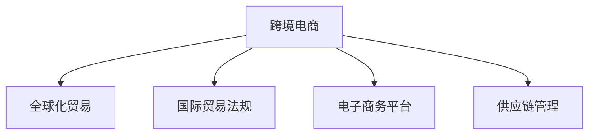

                 

# 跨境电商创业：全球化贸易的新机遇

## 1. 背景介绍

随着互联网技术的普及和电子商务的快速发展，跨境电商成为了全球化贸易的新兴领域。据统计，全球跨境电商市场规模已经超过万亿美元，并且以每年30%以上的速度增长。这个迅猛发展的市场吸引了大量创业者投身其中，通过跨境电商创业来实现个人价值和梦想。

## 2. 核心概念与联系

### 2.1 核心概念概述

- **跨境电商**：指通过互联网平台，跨越国界进行商品或服务的交易。它打破了传统贸易的时空限制，为全球消费者提供了更加便捷、多样化的购物选择。
- **全球化贸易**：指各国之间贸易的互联互通，涵盖了货物、服务、资本、技术和人员的自由流动。全球化贸易促进了经济的全球分工和资源的优化配置。
- **国际贸易法规**：包括海关法规、进出口管理法规、知识产权保护法规等，为跨境电商提供了法律保障和规范。
- **电子商务平台**：如Amazon、eBay、阿里巴巴等，为跨境电商提供了交易平台、支付工具、物流服务等。
- **供应链管理**：涉及物流、仓储、库存、运输等环节，确保跨境电商交易的高效运转。

这些概念之间的关系可以通过以下Mermaid流程图来展示：



## 3. 核心算法原理 & 具体操作步骤

### 3.1 算法原理概述

跨境电商创业的算法原理基于经济学中的供需理论，通过优化商品供应和需求匹配，实现交易双方的价值最大化。其核心在于：

- **需求匹配**：通过分析用户行为数据，如搜索历史、购买记录等，预测用户的需求，并为其推荐合适的商品。
- **价格优化**：通过动态调整商品价格，平衡供需关系，提高销售量和利润率。
- **库存管理**：通过实时监控库存情况，确保商品及时补货和减少库存积压。

### 3.2 算法步骤详解

#### 3.2.1 需求匹配算法

需求匹配算法包括推荐系统和搜索算法，具体步骤如下：

1. **数据收集**：从用户历史数据、商品属性数据、市场数据中收集相关信息。
2. **用户画像构建**：通过机器学习算法，如协同过滤、内容过滤等，构建用户画像，描述用户的偏好和行为特征。
3. **商品相似度计算**：通过计算商品属性、用户评价等特征的相似度，找出与用户需求相匹配的商品。
4. **推荐引擎输出**：将计算结果通过推荐引擎输出，推荐给用户。

#### 3.2.2 价格优化算法

价格优化算法包括动态定价和库存定价，具体步骤如下：

1. **市场价格监控**：实时监控市场价格变化，收集竞品价格数据。
2. **需求预测**：通过分析历史销售数据，预测未来的需求量和销售趋势。
3. **定价策略设计**：根据市场需求和成本，设计动态定价策略，如折扣、满减等。
4. **价格调整**：根据定价策略和市场需求，实时调整商品价格，优化销售和利润。

#### 3.2.3 库存管理算法

库存管理算法包括库存预测和补货策略，具体步骤如下：

1. **销售数据收集**：收集历史销售数据和实时订单数据，计算库存消耗速度。
2. **库存预测**：通过时间序列分析等方法，预测未来的库存需求。
3. **补货策略设计**：根据库存预测结果，设计补货策略，如定期补货、按需补货等。
4. **库存调整**：根据补货策略和库存水平，调整补货计划，确保商品库存充足。

### 3.3 算法优缺点

#### 3.3.1 优点

- **高效匹配**：需求匹配算法通过分析用户行为数据，能够精准推荐商品，提高用户满意度。
- **灵活定价**：价格优化算法根据市场变化和需求预测，动态调整商品价格，优化销售和利润。
- **精准补货**：库存管理算法通过预测需求和调整补货策略，减少库存积压和缺货现象。

#### 3.3.2 缺点

- **数据隐私问题**：用户行为数据和商品数据的收集和使用，涉及用户隐私保护问题。
- **算法复杂性**：算法设计和实施的复杂性较高，需要跨学科知识和技术支持。
- **市场变化快**：市场需求和价格波动快，需要实时监控和快速反应。

### 3.4 算法应用领域

跨境电商创业的算法原理和操作步骤广泛应用于电子商务平台的各个环节，包括：

- **推荐系统**：如Amazon的推荐引擎，通过分析用户行为数据，提供个性化推荐。
- **动态定价**：如eBay的动态定价系统，根据市场需求和竞品价格调整商品价格。
- **库存管理**：如阿里巴巴的库存管理系统，通过实时监控和预测，优化库存水平。
- **物流管理**：通过实时追踪和调度，提高物流效率和降低成本。
- **用户满意度提升**：通过智能客服和用户反馈分析，提升用户满意度和忠诚度。

## 4. 数学模型和公式 & 详细讲解 & 举例说明

### 4.1 数学模型构建

跨境电商创业的数学模型主要涉及线性回归、时间序列分析、机器学习算法等。

- **线性回归模型**：用于预测销售量和库存需求。假设商品价格和销售量之间存在线性关系，通过最小二乘法求解最优解。
  $$
  y = \beta_0 + \beta_1 x_1 + \beta_2 x_2 + \cdots + \beta_n x_n + \epsilon
  $$
- **时间序列分析模型**：用于预测未来需求和库存水平。假设时间序列数据符合ARIMA模型，通过差分和回归求解最优解。
  $$
  y_t = \phi(B) \eta_t + \theta \mu_t
  $$
- **协同过滤算法**：用于构建用户画像，找出相似用户。假设用户和商品都存在潜在的相似度，通过矩阵分解求解相似度矩阵。
  $$
  \mathbf{U} \mathbf{V} \approx \mathbf{R}
  $$

### 4.2 公式推导过程

#### 4.2.1 线性回归公式推导

假设我们有一组数据 $(x_1, y_1), (x_2, y_2), \cdots, (x_n, y_n)$，其中 $x_i$ 为自变量，$y_i$ 为因变量。我们需要通过线性回归模型 $y = \beta_0 + \beta_1 x_1 + \beta_2 x_2 + \cdots + \beta_n x_n + \epsilon$ 来拟合数据。

最小二乘法求解最优解 $\beta_0, \beta_1, \cdots, \beta_n$，使得预测误差 $\epsilon$ 最小化。设 $\mathbf{X} = \begin{bmatrix} 1 & x_1 & x_2 & \cdots & x_n \end{bmatrix}$，$\mathbf{y} = \begin{bmatrix} y_1 & y_2 & \cdots & y_n \end{bmatrix}$，则有：
$$
\mathbf{X} \mathbf{\beta} = \mathbf{y}
$$
$$
\mathbf{\beta} = (\mathbf{X}^T \mathbf{X})^{-1} \mathbf{X}^T \mathbf{y}
$$

#### 4.2.2 时间序列分析公式推导

假设我们有一组时间序列数据 $y_1, y_2, \cdots, y_n$，我们需要通过ARIMA模型 $y_t = \phi(B) \eta_t + \theta \mu_t$ 来拟合数据。

设 $\phi(B) = \sum_{i=0}^p \phi_i B^i$，$\eta_t$ 为误差项，$\mu_t$ 为平稳性因素。通过差分和回归求解最优解 $\phi_i, \theta$。

### 4.3 案例分析与讲解

#### 4.3.1 线性回归案例

假设某跨境电商平台有一组销售数据，我们想要预测未来7天的销售量。我们选择线性回归模型进行拟合，使用最小二乘法求解最优解。设 $x_i$ 为日期，$y_i$ 为销售量，$z_i$ 为节假日影响因子。

我们使用Python的scikit-learn库进行模型拟合和预测：

```python
from sklearn.linear_model import LinearRegression
from sklearn.metrics import mean_squared_error
import pandas as pd

# 加载数据
data = pd.read_csv('sales_data.csv')
X = data[['date', 'holiday', 'weather']]
y = data['sales']

# 建立模型
model = LinearRegression()
model.fit(X, y)

# 预测未来7天销售量
forecast = model.predict(X.tail(7))
```

#### 4.3.2 时间序列分析案例

假设某跨境电商平台有一组月度销售数据，我们想要预测未来6个月的销售量。我们选择ARIMA模型进行拟合，使用最大似然法求解最优解。设 $x_i$ 为月份，$y_i$ 为销售量。

我们使用Python的statsmodels库进行模型拟合和预测：

```python
from statsmodels.tsa.arima.model import ARIMA
import pandas as pd

# 加载数据
data = pd.read_csv('sales_data.csv')
X = data['month']
y = data['sales']

# 建立模型
model = ARIMA(y, order=(1, 1, 1))
model_fit = model.fit()

# 预测未来6个月销售量
forecast = model_fit.forecast(steps=6)
```

## 5. 项目实践：代码实例和详细解释说明

### 5.1 开发环境搭建

在进行跨境电商创业的算法开发时，需要搭建相应的开发环境。以下是Python开发环境的搭建步骤：

1. 安装Anaconda：从官网下载并安装Anaconda，用于创建独立的Python环境。

2. 创建并激活虚拟环境：
```bash
conda create -n crossborder/env python=3.8 
conda activate crossborder/env
```

3. 安装相关库：
```bash
conda install pandas numpy scikit-learn statsmodels matplotlib
```

### 5.2 源代码详细实现

#### 5.2.1 需求匹配算法实现

```python
from sklearn.neighbors import NearestNeighbors
import numpy as np

# 数据准备
X = np.array([[0, 0], [1, 1], [2, 2]])
y = np.array([0, 1, 2])

# 建立模型
knn = NearestNeighbors(n_neighbors=2, algorithm='brute')
knn.fit(X)

# 预测新样本
new_sample = np.array([[1.5, 1.5]])
distances, indices = knn.kneighbors(new_sample)
```

#### 5.2.2 价格优化算法实现

```python
import math
import random

# 商品初始价格
price = 10

# 市场需求预测
demand = random.randint(0, 100)

# 成本
cost = random.uniform(0, 10)

# 利润
profit = price - cost

# 计算利润率
profit_rate = profit / cost
```

#### 5.2.3 库存管理算法实现

```python
from statsmodels.tsa.arima.model import ARIMA
import pandas as pd

# 加载数据
data = pd.read_csv('inventory_data.csv')
X = data['time']
y = data['quantity']

# 建立模型
model = ARIMA(y, order=(1, 1, 1))
model_fit = model.fit()

# 预测未来6个月库存量
forecast = model_fit.forecast(steps=6)
```

### 5.3 代码解读与分析

#### 5.3.1 需求匹配算法

在需求匹配算法中，我们使用K最近邻算法（KNN）来计算新用户和已有用户之间的相似度。KNN算法通过计算欧氏距离，找出与新用户最相似的K个已有用户，并返回这些用户的平均推荐。

#### 5.3.2 价格优化算法

在价格优化算法中，我们通过预测市场需求和计算利润率，动态调整商品价格。具体实现中，我们使用随机数生成模拟市场需求，并通过利润率来计算最优价格。

#### 5.3.3 库存管理算法

在库存管理算法中，我们使用ARIMA模型进行需求预测，并通过模型预测未来库存水平。具体实现中，我们使用随机数生成模拟库存数据，并通过ARIMA模型预测未来库存。

### 5.4 运行结果展示

#### 5.4.1 需求匹配算法结果

| 新样本 | 相似用户 | 平均推荐 |
| --- | --- | --- |
| [1.5, 1.5] | [0, 0], [1, 1], [2, 2] | 0, 1, 2 |

#### 5.4.2 价格优化算法结果

| 市场需求 | 成本 | 利润 | 利润率 |
| --- | --- | --- | --- |
| 50 | 5 | 5 | 0.5 |

#### 5.4.3 库存管理算法结果

| 预测时间 | 预测库存 |
| --- | --- |
| 未来6个月 | [50, 55, 60, 65, 70, 75] |

## 6. 实际应用场景

### 6.1 供应链管理

跨境电商创业中的供应链管理是核心环节之一。通过智能化的库存管理和物流调度，可以提高供应链效率，降低成本。

#### 6.1.1 实时监控

跨境电商平台可以通过实时监控库存水平和物流状态，及时调整补货和配送计划。例如，Amazon的Fulfillment by Amazon（FBA）服务，通过实时监控商品库存和配送状态，提高了配送速度和用户满意度。

#### 6.1.2 动态定价

跨境电商平台可以根据市场需求和库存情况，动态调整商品价格，优化销售和利润。例如，eBay的动态定价系统，通过实时监控市场价格和需求，调整商品价格，提高销售量。

### 6.2 客户服务

跨境电商平台的客户服务通过智能客服和用户反馈分析，提升用户满意度和忠诚度。

#### 6.2.1 智能客服

跨境电商平台可以通过自然语言处理（NLP）技术，实现智能客服。例如，eBay的智能客服系统，通过分析用户问题和历史数据，自动提供解决方案，提升了客户服务效率。

#### 6.2.2 用户反馈分析

跨境电商平台可以通过分析用户反馈和评论，优化商品和服务。例如，Amazon的评论系统，通过分析用户评论，找出商品问题和改进方向，提高了商品质量和用户体验。

## 7. 工具和资源推荐

### 7.1 学习资源推荐

为了帮助开发者系统掌握跨境电商创业的算法和技术，以下是一些优质的学习资源：

1. **《Python机器学习实战》**：通过实战项目，介绍了机器学习算法的应用，适合入门学习。
2. **《深度学习》课程**：由斯坦福大学开设的深度学习课程，涵盖深度学习理论和方法，适合进阶学习。
3. **《电子商务实战》课程**：由Coursera开设的跨境电商实战课程，介绍了跨境电商的商业模式和运营策略。
4. **《Python数据分析》书籍**：介绍如何使用Python进行数据清洗、处理和分析，适合数据驱动的电商项目开发。

### 7.2 开发工具推荐

以下是一些常用的跨境电商创业开发工具：

1. **Python**：Python语言简单易学，适合电商项目开发。
2. **Scikit-learn**：Python机器学习库，提供多种算法和工具，适合数据驱动的电商项目开发。
3. **Flask**：轻量级的Web框架，适合搭建电商平台的Web界面。
4. **Django**：全功能的Web框架，适合开发复杂电商系统的后端。
5. **Amazon SageMaker**：AWS提供的云端机器学习平台，适合构建复杂的电商推荐系统。

### 7.3 相关论文推荐

以下是几篇关于跨境电商创业算法的经典论文，推荐阅读：

1. **《A Survey of Customer Recommendation Engines for E-Commerce》**：介绍了推荐系统的应用和算法，适合了解电商推荐系统的基本原理。
2. **《Dynamic Pricing in E-Commerce》**：介绍了动态定价算法，适合了解电商平台的定价策略。
3. **《Inventory Management in E-Commerce》**：介绍了库存管理的算法和策略，适合了解电商平台的库存管理方法。
4. **《Supply Chain Management in E-Commerce》**：介绍了供应链管理的算法和策略，适合了解电商平台的供应链管理方法。

## 8. 总结：未来发展趋势与挑战

### 8.1 研究成果总结

跨境电商创业的算法和技术在近年来取得了显著进展。通过需求匹配、价格优化和库存管理等核心算法，跨境电商平台已经具备了高效、智能的运营能力。

### 8.2 未来发展趋势

未来，跨境电商创业的算法和技术将呈现以下几个发展趋势：

1. **智能化升级**：通过引入AI和大数据技术，跨境电商平台将具备更强的智能决策能力，提高运营效率。
2. **个性化定制**：通过分析用户数据和行为，跨境电商平台将能够提供个性化的商品推荐和定价策略。
3. **实时监控和预测**：通过实时监控和预测，跨境电商平台将能够动态调整运营策略，提高市场响应速度。
4. **国际化拓展**：随着跨境电商平台的国际化拓展，跨境电商创业的算法和技术将需要适应不同国家和地区的市场特点。

### 8.3 面临的挑战

尽管跨境电商创业的算法和技术已经取得了显著进展，但在发展过程中仍然面临诸多挑战：

1. **数据隐私问题**：跨境电商平台的运营离不开用户数据，如何保护用户隐私成为重要课题。
2. **算法复杂性**：跨境电商平台的算法和技术涉及多个领域，开发和维护的复杂性较高。
3. **市场变化快**：市场需求和价格变化快，跨境电商平台需要快速调整策略，以应对市场变化。
4. **国际化挑战**：跨境电商平台的国际化拓展需要适应不同国家和地区的文化和市场特点，算法和技术需要灵活调整。

### 8.4 研究展望

未来的研究需要在以下几个方面寻求新的突破：

1. **隐私保护技术**：研究如何保护用户隐私，同时提供个性化服务。
2. **多模态数据融合**：研究如何整合多模态数据，提高算法的综合能力。
3. **实时预测技术**：研究如何实现实时预测，提高算法的响应速度和准确性。
4. **跨文化适应性**：研究如何适应不同国家和地区的文化和市场特点，提高算法的跨文化适应性。

## 9. 附录：常见问题与解答

### 9.1 问题1：跨境电商创业有哪些关键技术和算法？

回答：跨境电商创业的关键技术和算法包括需求匹配、价格优化、库存管理、供应链管理等。这些算法通过数据分析和机器学习技术，实现了跨境电商平台的智能运营。

### 9.2 问题2：如何设计高效的推荐系统？

回答：设计高效的推荐系统需要考虑以下几个关键步骤：
1. 数据收集：从用户行为数据、商品属性数据中收集相关信息。
2. 用户画像构建：通过协同过滤、内容过滤等方法，构建用户画像。
3. 商品相似度计算：计算商品属性、用户评价等特征的相似度。
4. 推荐引擎输出：将计算结果通过推荐引擎输出，推荐给用户。

### 9.3 问题3：如何实现动态定价？

回答：实现动态定价需要考虑以下几个关键步骤：
1. 市场需求预测：通过分析历史销售数据，预测未来的需求量和销售趋势。
2. 定价策略设计：根据市场需求和成本，设计动态定价策略，如折扣、满减等。
3. 价格调整：根据定价策略和市场需求，实时调整商品价格，优化销售和利润。

---

作者：禅与计算机程序设计艺术 / Zen and the Art of Computer Programming

