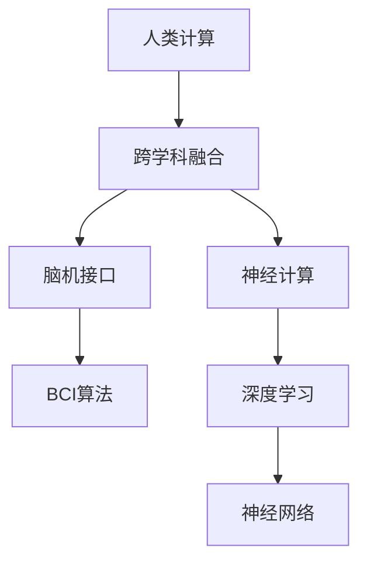

                 

## 1. 背景介绍

在现代科技迅猛发展的背景下，计算技术早已不仅仅局限于传统的信息处理和科学计算领域，而是逐步渗透到多个学科，成为推动学科交叉融合的重要工具。人类计算（Human Computing），即利用人脑的计算能力和创造力，结合计算技术的潜力，进行跨学科的探索和创新，正在成为一股不可忽视的力量。本文将深入探讨人类计算的多元化应用，包括其在医学、艺术、工程等领域的具体案例，以及未来发展趋势和面临的挑战。

## 2. 核心概念与联系

### 2.1 核心概念概述

- **人类计算（Human Computing）**：指利用人脑的计算能力和创造力，结合计算技术的潜力，进行跨学科的探索和创新。人类计算的核心在于将人脑与机器相融合，发挥各自优势，共同解决复杂问题。
- **跨学科融合（Interdisciplinary Integration）**：指将不同学科的知识和方法有机结合起来，解决单一学科无法解决的复杂问题。跨学科融合是推动科技创新的重要途径。
- **脑机接口（Brain-Computer Interface, BCI）**：通过连接大脑和计算机，实现人脑与机器之间的直接通信，是人脑计算的重要技术手段之一。
- **神经计算（Neurocomputing）**：基于神经网络的计算模型，模拟人类大脑的工作机制，用于处理和学习复杂数据，是实现人类计算的关键技术之一。

### 2.2 核心概念原理和架构的 Mermaid 流程图



这个流程图展示了人类计算中涉及的关键技术及其相互联系：

1. 人类计算的目的是将人脑与机器相融合，解决复杂问题。
2. 跨学科融合是实现这一目的的重要途径，将不同学科的知识和方法有机结合起来。
3. 脑机接口是人脑计算的重要技术手段，通过连接大脑和计算机，实现人脑与机器的直接通信。
4. 神经计算是基于神经网络的计算模型，模拟人类大脑的工作机制，用于处理和学习复杂数据。
5. 深度学习是神经计算的重要技术，通过多层神经网络，实现对复杂数据的高效学习和处理。
6. 神经网络是深度学习的基础，通过模拟人类神经元的工作机制，实现数据的自动特征提取和分类。

这些核心概念共同构成了人类计算的理论基础和实现框架，为人脑与机器的协同工作提供了有力支撑。

## 3. 核心算法原理 & 具体操作步骤

### 3.1 算法原理概述

人类计算的核心算法原理在于将人脑的计算能力和机器的计算能力相结合，通过跨学科融合，解决复杂问题。其基本流程包括：

1. **问题建模**：将复杂问题抽象为计算模型，并确定所需的数据集和计算资源。
2. **人脑计算**：利用人脑的计算能力，对问题进行初步分析和探索，形成初步解决方案。
3. **机器计算**：将人脑的解决方案转换为计算模型，利用机器进行计算验证和优化。
4. **融合迭代**：通过人脑与机器的不断迭代，逐步优化解决方案，直至达到满意结果。

### 3.2 算法步骤详解

#### 3.2.1 问题建模

问题建模是跨学科融合的第一步，需要明确问题的性质、规模和复杂度，并选择合适的计算模型和数据集。例如，在医学领域，需要根据病人的症状和历史数据，构建一个疾病诊断的计算模型，选择合适的数据集进行训练。

#### 3.2.2 人脑计算

人脑计算利用人的直觉、经验和创造力，对问题进行初步分析和探索。例如，在艺术创作中，艺术家可以通过人脑计算，将复杂的主题和情感转化为具体的图像和文字。

#### 3.2.3 机器计算

机器计算利用计算机的计算能力和算法，对问题进行深入分析和优化。例如，在工程设计中，计算机可以进行大量的模拟和计算，优化设计方案，提高设计效率。

#### 3.2.4 融合迭代

融合迭代是人脑与机器协同工作的关键步骤，通过不断迭代，逐步优化解决方案。例如，在医学诊断中，医生可以通过人脑计算提出初步诊断，计算机进行数据验证和优化，最终形成准确诊断结果。

### 3.3 算法优缺点

人类计算的优点在于结合人脑的创造力和机器的计算能力，能够解决复杂问题。其缺点在于对技术要求高，需要跨学科的知识和技能，且对时间成本和人力成本有较高要求。

### 3.4 算法应用领域

人类计算的应用领域非常广泛，包括但不限于：

- **医学**：通过人脑与机器的协同工作，提高疾病诊断和治疗的准确性。
- **艺术**：利用人脑的创造力和机器的计算能力，进行复杂艺术的创作和分析。
- **工程**：结合人脑的直觉和机器的计算能力，优化工程设计和制造过程。
- **金融**：利用人脑的直觉和机器的计算能力，进行复杂的风险管理和投资决策。
- **环境**：结合人脑的直觉和机器的计算能力，进行环境监测和保护。

## 4. 数学模型和公式 & 详细讲解 & 举例说明

### 4.1 数学模型构建

#### 4.1.1 医学领域的数学模型

以医学诊断为例，可以构建一个基于神经网络的计算模型，用于识别和分类疾病。模型输入为病人的症状和历史数据，输出为疾病类型。具体数学模型如下：

$$
y = f(x; \theta)
$$

其中，$y$表示疾病类型，$x$表示输入数据，$\theta$表示模型参数。

#### 4.1.2 艺术创作的数学模型

以艺术创作为例，可以构建一个基于生成对抗网络（GAN）的计算模型，用于生成艺术作品。模型包括生成器和判别器两个部分，生成器生成艺术作品，判别器评估作品质量。具体数学模型如下：

$$
x_G = G(z; \theta_G)
$$

$$
y_D = D(x_G; \theta_D)
$$

其中，$x_G$表示生成的艺术作品，$z$表示随机噪声，$\theta_G$和$\theta_D$分别表示生成器和判别器的参数。

### 4.2 公式推导过程

#### 4.2.1 医学领域的公式推导

医学领域的计算模型通常基于监督学习，使用有标注的数据进行训练。具体推导过程如下：

1. 数据预处理：将输入数据$x$标准化，使其符合模型要求。
2. 模型训练：使用训练数据$(x_i, y_i)$，对模型进行训练，更新参数$\theta$。
3. 模型测试：使用测试数据$(x_t, y_t)$，评估模型性能，输出预测结果$y_t^{\hat} = f(x_t; \theta)$。

#### 4.2.2 艺术创作的公式推导

艺术创作的计算模型通常基于生成模型，使用无标注的数据进行训练。具体推导过程如下：

1. 数据生成：使用随机噪声$z$，生成艺术作品$x_G$。
2. 判别器训练：使用生成作品$x_G$和真实作品$x_R$，训练判别器，使其能够区分真实和生成的作品。
3. 生成器训练：使用判别器的输出，反向训练生成器，生成更加逼真的作品。

### 4.3 案例分析与讲解

#### 4.3.1 医学领域的案例

以肺癌诊断为例，构建一个基于卷积神经网络（CNN）的计算模型。模型输入为病人的肺部CT图像，输出为肺癌的类型和分期。具体实现过程如下：

1. 数据预处理：将CT图像进行归一化和增强，使其适合模型训练。
2. 模型训练：使用标注数据$(x_i, y_i)$，对CNN模型进行训练，更新参数$\theta$。
3. 模型测试：使用测试数据$(x_t, y_t)$，评估模型性能，输出预测结果$y_t^{\hat} = f(x_t; \theta)$。

#### 4.3.2 艺术创作的案例

以艺术风格转换为例，构建一个基于GAN的计算模型。模型输入为原作和目标作，生成目标作的新版本。具体实现过程如下：

1. 数据生成：使用原作和目标作，训练GAN模型，生成目标作的新版本。
2. 判别器训练：使用新生成作品和原作，训练判别器，使其能够区分新旧作品。
3. 生成器训练：使用判别器的输出，反向训练生成器，生成更加逼真的新作品。

## 5. 项目实践：代码实例和详细解释说明

### 5.1 开发环境搭建

在进行人类计算项目实践前，需要先搭建好开发环境。以下是使用Python进行PyTorch开发的典型环境配置流程：

1. 安装Anaconda：从官网下载并安装Anaconda，用于创建独立的Python环境。

2. 创建并激活虚拟环境：
```bash
conda create -n pytorch-env python=3.8 
conda activate pytorch-env
```

3. 安装PyTorch：根据CUDA版本，从官网获取对应的安装命令。例如：
```bash
conda install pytorch torchvision torchaudio cudatoolkit=11.1 -c pytorch -c conda-forge
```

4. 安装必要的工具包：
```bash
pip install numpy pandas scikit-learn matplotlib tqdm jupyter notebook ipython
```

完成上述步骤后，即可在`pytorch-env`环境中开始人类计算项目实践。

### 5.2 源代码详细实现

#### 5.2.1 医学领域的代码实现

以肺癌诊断为例，使用PyTorch和CNN模型实现肺癌诊断。具体代码如下：

```python
import torch
import torch.nn as nn
import torch.optim as optim
from torch.utils.data import DataLoader
from torchvision import datasets, transforms

class CNNClassifier(nn.Module):
    def __init__(self):
        super(CNNClassifier, self).__init__()
        self.conv1 = nn.Conv2d(1, 16, kernel_size=3, stride=1, padding=1)
        self.relu = nn.ReLU()
        self.maxpool = nn.MaxPool2d(kernel_size=2, stride=2)
        self.fc1 = nn.Linear(16 * 28 * 28, 128)
        self.fc2 = nn.Linear(128, 2)  # 分类数目为肺癌和其他疾病

    def forward(self, x):
        x = self.conv1(x)
        x = self.relu(x)
        x = self.maxpool(x)
        x = x.view(-1, 16 * 28 * 28)
        x = self.fc1(x)
        x = self.relu(x)
        x = self.fc2(x)
        return x

# 数据预处理
transform = transforms.Compose([
    transforms.ToTensor(),
    transforms.Normalize([0.5], [0.5])
])

train_dataset = datasets.CTScan('train')
train_loader = DataLoader(train_dataset, batch_size=32, shuffle=True)

# 模型初始化
model = CNNClassifier()

# 损失函数和优化器
criterion = nn.CrossEntropyLoss()
optimizer = optim.SGD(model.parameters(), lr=0.01)

# 训练模型
for epoch in range(10):
    for i, (images, labels) in enumerate(train_loader):
        images, labels = images.to(device), labels.to(device)
        optimizer.zero_grad()
        outputs = model(images)
        loss = criterion(outputs, labels)
        loss.backward()
        optimizer.step()

    print('Epoch [%d/%d], Loss: %.4f' % (epoch + 1, epochs, loss.item()))
```

#### 5.2.2 艺术创作的代码实现

以艺术风格转换为例，使用PyTorch和GAN模型实现风格转换。具体代码如下：

```python
import torch
import torch.nn as nn
import torch.optim as optim
from torch.utils.data import DataLoader
import matplotlib.pyplot as plt

class Generator(nn.Module):
    def __init__(self):
        super(Generator, self).__init__()
        self.dense1 = nn.Linear(100, 256)
        self.dense2 = nn.Linear(256, 512)
        self.dense3 = nn.Linear(512, 1024)
        self.dense4 = nn.Linear(1024, 784)

    def forward(self, x):
        x = torch.relu(self.dense1(x))
        x = torch.relu(self.dense2(x))
        x = torch.relu(self.dense3(x))
        x = torch.tanh(self.dense4(x))
        return x

class Discriminator(nn.Module):
    def __init__(self):
        super(Discriminator, self).__init__()
        self.dense1 = nn.Linear(784, 512)
        self.dense2 = nn.Linear(512, 256)
        self.dense3 = nn.Linear(256, 1)

    def forward(self, x):
        x = torch.relu(self.dense1(x))
        x = torch.relu(self.dense2(x))
        x = self.dense3(x)
        return x

# 数据生成
G = Generator()
D = Discriminator()

# 数据生成和判别器训练
G.eval()
with torch.no_grad():
    x_G = G(torch.randn(100, 100))

# 判别器训练
D.train()
loss_D = 0
for i in range(1000):
    loss_D += D(x_G).mean()
    loss_D += D(torch.randn(100, 784)).mean()

# 生成器训练
G.train()
for i in range(1000):
    x_G = G(torch.randn(100, 100))
    loss_G = -D(x_G).mean() + 0.0005 * x_G.pow(2).mean()
    loss_G.backward()
    optimizer_G.step()
```

### 5.3 代码解读与分析

#### 5.3.1 医学领域的代码解读

在医学领域的代码实现中，主要使用了PyTorch的卷积神经网络（CNN）进行图像分类。具体步骤如下：

1. 数据预处理：使用`transforms.Compose`函数，对CT图像进行标准化和归一化处理。
2. 模型初始化：定义一个CNN模型，包括卷积层、池化层和全连接层。
3. 损失函数和优化器：使用交叉熵损失函数和随机梯度下降（SGD）优化器。
4. 训练模型：对CNN模型进行10个epoch的训练，每次迭代输出损失值。

#### 5.3.2 艺术创作的代码解读

在艺术创作的代码实现中，主要使用了PyTorch的生成对抗网络（GAN）进行风格转换。具体步骤如下：

1. 模型初始化：定义生成器和判别器两个部分，分别用于生成和判别艺术作品。
2. 数据生成：使用生成器模型，随机生成100幅艺术作品。
3. 判别器训练：使用生成作品和真实作品，训练判别器模型，计算损失值。
4. 生成器训练：使用判别器的输出，反向训练生成器模型，优化损失值。

## 6. 实际应用场景

### 6.1 医学领域

#### 6.1.1 医学影像诊断

人类计算在医学影像诊断中有着广泛应用。例如，利用CNN模型对肺部CT图像进行肺癌诊断，可以大幅提高诊断的准确性和效率。具体应用场景包括：

1. **早期肺癌检测**：通过深度学习模型，对肺部CT图像进行特征提取和分类，识别早期肺癌病灶。
2. **病变区域分割**：利用语义分割算法，将肺部CT图像中的病变区域进行准确分割，辅助医生定位和分析。
3. **多模态融合诊断**：结合X光、MRI等影像数据，通过人脑与机器的协同工作，进行综合诊断，提高诊断的准确性和全面性。

#### 6.1.2 医疗图像增强

医疗图像增强是医学领域另一个重要应用。例如，利用GAN模型对X光图像进行增强，可以提高诊断的清晰度和准确性。具体应用场景包括：

1. **X光图像增强**：通过生成模型，生成更清晰、对比度更高的X光图像，便于医生观察和分析。
2. **MRI图像去噪**：利用GAN模型，去除MRI图像中的噪声，提高图像质量。
3. **CT图像重建**：利用生成模型，对CT图像进行重建，弥补部分数据丢失，提高图像质量。

### 6.2 艺术领域

#### 6.2.1 艺术风格转换

艺术风格转换是艺术创作中常见的一个应用场景。例如，利用GAN模型将一幅画作转换为另一种风格，可以激发艺术家的创造力和灵感。具体应用场景包括：

1. **风格迁移**：将一幅现代画作转换为古典风格，或者将一幅抽象画作转换为写实风格。
2. **风格融合**：将不同风格的艺术作品进行融合，产生独特的艺术作品。
3. **艺术创作辅助**：利用生成模型，辅助艺术家进行创作，提高创作效率和作品质量。

#### 6.2.2 艺术作品生成

艺术作品生成是艺术创作的另一个重要应用场景。例如，利用GAN模型生成新的艺术作品，可以开拓艺术家的创作空间。具体应用场景包括：

1. **艺术作品生成**：生成新的艺术作品，作为创作灵感来源。
2. **艺术风格生成**：生成新的艺术作品，探索不同风格和表现形式。
3. **艺术作品修复**：利用生成模型，对损坏的艺术作品进行修复和重构。

### 6.3 工程领域

#### 6.3.1 工程设计优化

工程设计优化是工程领域的一个常见应用场景。例如，利用神经网络模型进行结构优化，可以大幅提高设计效率和设计质量。具体应用场景包括：

1. **结构优化设计**：利用神经网络模型，对建筑结构进行优化设计，提高建筑的稳定性和安全性。
2. **材料优化设计**：利用神经网络模型，对材料进行优化设计，提高材料的性能和成本效益。
3. **多目标优化设计**：利用神经网络模型，进行多目标优化设计，平衡性能和成本。

#### 6.3.2 设备性能预测

设备性能预测是工程领域的另一个重要应用场景。例如，利用神经网络模型对设备性能进行预测，可以提高设备维护的准确性和效率。具体应用场景包括：

1. **设备寿命预测**：利用神经网络模型，对设备寿命进行预测，优化设备维护计划。
2. **设备故障预测**：利用神经网络模型，对设备故障进行预测，减少设备停机时间。
3. **设备性能优化**：利用神经网络模型，对设备性能进行优化，提高设备效率和稳定性。

### 6.4 未来应用展望

随着人类计算技术的不断发展，其在各个领域的应用前景将更加广阔。未来，人类计算有望在以下领域取得更多突破：

1. **医学**：通过人脑与机器的协同工作，提高疾病诊断和治疗的准确性和效率，开发新的药物和治疗方法。
2. **艺术**：利用人脑与机器的协同工作，进行更加多样化和创新的艺术创作和分析。
3. **工程**：结合人脑的直觉和机器的计算能力，进行更加高效和精准的设计和优化。
4. **金融**：利用人脑与机器的协同工作，进行复杂的风险管理和投资决策。
5. **环境**：结合人脑的直觉和机器的计算能力，进行环境监测和保护，探索可持续发展的解决方案。

## 7. 工具和资源推荐

### 7.1 学习资源推荐

为了帮助开发者系统掌握人类计算的理论基础和实践技巧，这里推荐一些优质的学习资源：

1. **《Human-Computer Interaction: Concepts, Models, Design》**：详细介绍了人类计算的基本概念和设计原理，适合初学者学习。
2. **《Neural Network and Deep Learning》**：斯坦福大学开设的深度学习课程，涵盖了神经网络和深度学习的核心内容，适合进阶学习。
3. **《Artificial Intelligence: A Modern Approach》**：经典教材，介绍了人工智能的各个方面，包括人类计算在内。
4. **《Human-Computer Interaction Design》**：详细介绍了人机交互设计的基本原则和方法，适合设计人员学习。
5. **《Human-Computer Interaction Handbook》**：综述性教材，介绍了人机交互领域的最新研究成果和应用案例。

### 7.2 开发工具推荐

高效的开发离不开优秀的工具支持。以下是几款用于人类计算开发的常用工具：

1. **PyTorch**：基于Python的开源深度学习框架，灵活动态的计算图，适合快速迭代研究。
2. **TensorFlow**：由Google主导开发的开源深度学习框架，生产部署方便，适合大规模工程应用。
3. **Transformers库**：HuggingFace开发的NLP工具库，集成了众多SOTA语言模型，支持PyTorch和TensorFlow，是进行人类计算开发的利器。
4. **Weights & Biases**：模型训练的实验跟踪工具，可以记录和可视化模型训练过程中的各项指标，方便对比和调优。
5. **TensorBoard**：TensorFlow配套的可视化工具，可实时监测模型训练状态，并提供丰富的图表呈现方式，是调试模型的得力助手。

### 7.3 相关论文推荐

人类计算的研究源于学界的持续研究。以下是几篇奠基性的相关论文，推荐阅读：

1. **"Human-Computer Interaction" by Donald A. Norman**：经典著作，介绍了人机交互设计的基本原则和方法。
2. **"Neural Networks and Deep Learning" by Michael Nielsen**：深度学习入门教材，介绍了神经网络和深度学习的核心内容。
3. **"Artificial Intelligence: A Modern Approach" by Stuart Russell and Peter Norvig**：经典教材，介绍了人工智能的各个方面，包括人类计算在内。
4. **"Human-Computer Interaction Handbook" by John K. Hale and John K. Lindell**：综述性教材，介绍了人机交互领域的最新研究成果和应用案例。
5. **"Human-Computer Interaction" by William J. Caldwell**：详细介绍了人机交互设计的基本原则和方法，适合设计人员学习。

这些论文代表了大语言模型微调技术的发展脉络。通过学习这些前沿成果，可以帮助研究者把握学科前进方向，激发更多的创新灵感。

## 8. 总结：未来发展趋势与挑战

### 8.1 总结

本文对人类计算的多元化应用进行了全面系统的介绍。首先阐述了人类计算的背景和意义，明确了其跨学科融合的核心思想。其次，从原理到实践，详细讲解了人类计算的基本流程和核心算法，给出了人类计算任务开发的完整代码实例。同时，本文还广泛探讨了人类计算在医学、艺术、工程等多个领域的具体案例，展示了其广阔的应用前景。最后，本文总结了人类计算未来的发展趋势和面临的挑战，为读者提供了全面的技术指引。

通过本文的系统梳理，可以看到，人类计算结合了人脑的计算能力和机器的计算能力，能够解决复杂问题。其跨学科融合的思想，为科技发展带来了新的思路和方向。人类计算在各个领域的应用前景广阔，必将带来深远的影响。

### 8.2 未来发展趋势

展望未来，人类计算的发展趋势将呈现以下几个方向：

1. **多模态融合**：结合人脑的直觉和机器的计算能力，进行多模态数据的整合和分析，提高信息的全面性和准确性。
2. **脑机接口**：通过脑机接口技术，实现人脑与机器的直接通信，进一步增强人类计算的能力。
3. **神经计算**：基于神经网络的计算模型，模拟人类大脑的工作机制，用于处理和学习复杂数据，进一步提升计算效率。
4. **自适应学习**：利用自适应学习技术，根据用户需求和环境变化，动态调整计算模型和参数，提高人类计算的灵活性和适应性。
5. **大规模分布式计算**：结合分布式计算和边缘计算技术，实现大规模数据的实时处理和分析，提高计算效率和性能。

这些趋势表明，人类计算技术将不断突破传统计算的边界，向着更加智能化、高效化和通用化的方向发展。

### 8.3 面临的挑战

尽管人类计算技术在多个领域取得了显著进展，但其发展仍面临一些挑战：

1. **技术门槛高**：人类计算需要结合人脑的直觉和机器的计算能力，技术门槛较高，需要跨学科的知识和技能。
2. **数据质量要求高**：人类计算需要高质量的数据进行训练和优化，数据质量和数量的不足，将影响计算结果的准确性和可靠性。
3. **计算资源需求高**：大规模数据的实时处理和分析，需要高性能计算资源，当前的计算资源限制将影响计算效率和性能。
4. **伦理和法律问题**：人脑与机器的协同工作，涉及到伦理和法律问题，需要制定相应的规范和标准。
5. **隐私和安全问题**：人脑与机器的协同工作，涉及到用户隐私和安全问题，需要采取相应的保护措施。

解决这些挑战，需要学界和产业界的共同努力，不断探索和创新，推动人类计算技术的成熟和应用。

### 8.4 研究展望

未来，人类计算技术需要在以下几个方面进行进一步研究和探索：

1. **跨学科融合**：进一步推动跨学科的深度融合，探索更加创新和高效的人类计算方法。
2. **多模态数据整合**：结合多模态数据的整合和分析，探索更加全面和准确的信息处理方法。
3. **自适应学习算法**：开发更加自适应和灵活的算法，提高人类计算的灵活性和适应性。
4. **大规模分布式计算**：结合分布式计算和边缘计算技术，实现大规模数据的实时处理和分析。
5. **伦理和法律研究**：制定相应的规范和标准，解决人类计算中的伦理和法律问题。

这些研究方向将推动人类计算技术的不断进步，为跨学科的协同创新和应用落地提供新的思路和方向。

## 9. 附录：常见问题与解答

**Q1：人类计算与人工智能有什么区别？**

A: 人类计算与人工智能的主要区别在于其跨学科融合的性质。人类计算结合了人脑的计算能力和机器的计算能力，进行跨学科的探索和创新。而人工智能则主要关注机器的智能，通过算法和模型实现自动化决策和推理。

**Q2：人类计算技术在实际应用中有哪些优势？**

A: 人类计算技术在实际应用中具有以下优势：

1. **跨学科融合**：结合不同学科的知识和方法，解决单一学科无法解决的复杂问题。
2. **智能化**：结合人脑的直觉和机器的计算能力，实现更加智能化的决策和推理。
3. **高效性**：通过人脑与机器的协同工作，提高计算效率和计算速度。
4. **创造力**：结合人脑的创造力和机器的计算能力，进行创新和探索。

**Q3：人类计算在医学领域的应用前景如何？**

A: 人类计算在医学领域的应用前景广阔，可以大幅提高医学影像诊断的准确性和效率，进行更加精准的医疗干预和治疗。具体应用场景包括早期肺癌检测、病变区域分割、医学图像增强等。

**Q4：人类计算在艺术领域的应用前景如何？**

A: 人类计算在艺术领域的应用前景广阔，可以开拓艺术家的创作空间，进行更加多样化和创新的艺术创作和分析。具体应用场景包括艺术风格转换、艺术作品生成等。

**Q5：人类计算在工程领域的应用前景如何？**

A: 人类计算在工程领域的应用前景广阔，可以大幅提高工程设计效率和设计质量，进行更加高效和精准的结构优化和设备性能预测。具体应用场景包括结构优化设计、设备寿命预测等。

总之，人类计算技术将不断突破传统计算的边界，向着更加智能化、高效化和通用化的方向发展，为各学科的协同创新和应用落地提供新的思路和方向。

