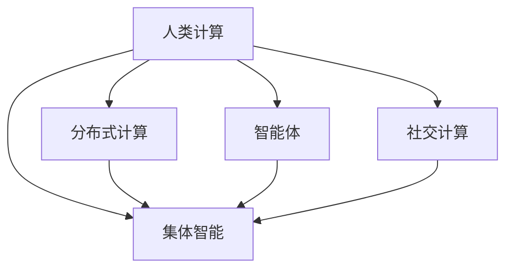

                 

# 跨越学科边界：人类计算的多元化应用

## 1. 背景介绍

### 1.1 问题由来
随着科技的飞速发展，计算能力已经成为推动社会进步和经济增长的关键因素。然而，传统的计算模式——基于逻辑电路和算数的电子计算机——在处理复杂问题时显得力不从心。这促使科学家和工程师开始探索新的计算范式，希望通过跨越学科的交叉融合，找到解决复杂问题的新方法。

### 1.2 问题核心关键点
在计算机科学的发展历程中，多次出现了跨越学科边界、引入新计算原理的突破性创新。例如，量子计算引入了量子力学原理，生物计算借鉴了生物信息学方法，而人类计算则试图结合人类自身的智能与计算技术，开辟新的计算道路。

### 1.3 问题研究意义
人类计算（Human Computation）的概念，旨在利用人类智慧和集体智能，结合计算技术和通信技术，解决传统计算机难以处理的问题。这一方法不仅能够加速问题的求解过程，还能在某些特定领域内达到传统计算无法企及的效果。研究人类计算的应用，对于推动计算科学的发展，拓展计算技术的应用范围，具有重要意义。

## 2. 核心概念与联系

### 2.1 核心概念概述

为更好地理解人类计算，本节将介绍几个密切相关的核心概念：

- **人类计算（Human Computation）**：一种新型的计算模式，利用人类智慧、集体智能和网络协同，解决复杂问题。
- **集体智能（Collective Intelligence）**：由多个智能体（如人、计算机等）协同工作，通过相互通信和协作，共同解决问题。
- **分布式计算（Distributed Computing）**：将计算任务分解为多个子任务，由分布在不同位置的计算机并行处理。
- **智能体（Agent）**：在集体智能中，每个智能体都是一个决策者或行动者，通过交互和合作，达到共同的目标。
- **社交计算（Social Computing）**：利用社交网络、社交媒体等手段，收集和分析人类行为数据，提取社会规律和知识。

这些核心概念之间的逻辑关系可以通过以下Mermaid流程图来展示：



这个流程图展示了几类关键概念及其之间的关系：

1. 人类计算通过集体智能、分布式计算、智能体等机制，实现高效协同解决问题。
2. 分布式计算和社交计算是实现集体智能的重要手段。
3. 智能体在集体智能中扮演关键角色，通过信息交互和合作，提升整体解决问题的能力。

## 3. 核心算法原理 & 具体操作步骤
### 3.1 算法原理概述

人类计算的核心算法原理，是通过网络协同和集体智能，将复杂问题拆解为多个子问题，由不同地理位置的计算单元共同处理。其核心在于如何构建有效的协同机制，使得各个智能体能够高效协作，并最终聚合为整体的解决方案。

### 3.2 算法步骤详解

人类计算的基本算法步骤包括：

**Step 1: 问题拆解**  
将复杂问题拆解为多个子问题，每个子问题可以由单个智能体或多个智能体协作处理。

**Step 2: 智能体通信**  
通过网络通信技术，各智能体之间共享数据和计算结果，实现信息同步和协作。

**Step 3: 聚合求解**  
将各个智能体的计算结果进行汇总和聚合，得到最终的问题解决方案。

**Step 4: 反馈调整**  
通过实时反馈机制，根据计算结果和问题求解效果，调整智能体的行为和协同策略，不断优化解决方案。

### 3.3 算法优缺点

人类计算方法具有以下优点：

- 高效协同：通过网络协同和集体智能，快速处理大规模、复杂的问题。
- 充分利用资源：可以有效地利用人类的智慧和社交网络资源，弥补传统计算的不足。
- 灵活性高：算法能够根据问题的特点和环境的变化进行调整和优化。

但同时也存在一些局限性：

- 依赖网络通信：需要高效的网络基础设施和通信技术支持。
- 难以控制：集体智能的协同过程复杂，难以预测和控制。
- 安全隐私：协同过程中涉及大量的个人数据，需要保障数据安全和隐私。

### 3.4 算法应用领域

人类计算技术已经在多个领域得到了应用，例如：

- **网络安全**：通过大规模的集体智能，进行恶意软件的检测和分析。
- **科学研究**：利用人类的集体智慧，进行大规模数据分析和科学实验。
- **社会科学**：通过社交计算和网络分析，进行社会行为和群体动向的研究。
- **医疗健康**：利用集体智能和分布式计算，进行疾病预测和健康数据分析。
- **金融服务**：结合集体智能和分布式计算，进行市场分析和风险管理。
- **环境保护**：通过大规模的集体智能和社交计算，进行环境监测和生态保护。

这些领域的应用展示了人类计算的广阔前景，为解决复杂问题提供了新的思路和方法。

## 4. 数学模型和公式 & 详细讲解 & 举例说明

### 4.1 数学模型构建

本节将使用数学语言对人类计算的协同算法进行更加严格的刻画。

假设一个复杂问题 $P$ 需要由 $n$ 个智能体 $A_1, A_2, \ldots, A_n$ 协同解决。每个智能体 $A_i$ 的计算能力和结果 $X_i$ 满足一定的概率分布，即 $X_i \sim P_i$。假设各个智能体的计算结果 $X_i$ 相互独立，且最终结果 $X$ 为各智能体结果的加权和：

$$
X = \sum_{i=1}^n w_i X_i
$$

其中 $w_i$ 为智能体 $A_i$ 的权重，反映了其对最终结果的影响力。

### 4.2 公式推导过程

根据上述模型，我们可以推导出人类计算的总体误差和计算效率。

假设每个智能体的计算误差为 $\epsilon_i$，则总体误差为：

$$
\sigma_X^2 = \sum_{i=1}^n w_i^2 \sigma_{X_i}^2
$$

其中 $\sigma_{X_i}^2$ 为智能体 $A_i$ 的计算误差方差。

如果每个智能体的计算时间为 $t_i$，则总体计算时间为：

$$
T = \sum_{i=1}^n t_i
$$

通过优化权重 $w_i$，可以平衡总体误差和计算时间，达到最优的计算效率。

### 4.3 案例分析与讲解

假设我们有一个大型网络安全问题，需要检测网络中的恶意软件。可以将这个问题拆解为多个子问题，分别由不同的智能体进行检测和分析。每个智能体的计算结果和误差如下表所示：

| 智能体 $A_i$ | 计算结果 $X_i$ | 误差 $\epsilon_i$ | 计算时间 $t_i$ |
|------------|-------------|------------|---------|
| $A_1$      | 0.85        | 0.05        | 10      |
| $A_2$      | 0.80        | 0.07        | 5       |
| $A_3$      | 0.90        | 0.06        | 15      |

为了最小化总体误差 $\sigma_X^2$，我们引入权重 $w_i$，并求解最优权重。

假设权重满足 $w_1 + w_2 + w_3 = 1$，根据最小二乘法，可以求解最优权重：

$$
w_i = \frac{1}{\sigma_i^2 + t_i}
$$

其中 $\sigma_i^2 = \epsilon_i^2$。

带入各智能体的数据，计算得：

$$
w_1 = \frac{1}{0.05^2 + 10} = \frac{1}{0.25 + 10} = \frac{1}{10.25}
$$
$$
w_2 = \frac{1}{0.07^2 + 5} = \frac{1}{0.049 + 5} = \frac{1}{5.049}
$$
$$
w_3 = \frac{1}{0.06^2 + 15} = \frac{1}{0.036 + 15} = \frac{1}{15.036}
$$

计算得总体误差：

$$
\sigma_X^2 = \frac{1}{10.25} \times 0.05^2 + \frac{1}{5.049} \times 0.07^2 + \frac{1}{15.036} \times 0.06^2 \approx 0.007
$$

总体计算时间：

$$
T = 10 + 5 + 15 = 30
$$

因此，选择最优权重可以显著提升计算效率和准确性。

## 5. 项目实践：代码实例和详细解释说明
### 5.1 开发环境搭建

在进行人类计算项目实践前，我们需要准备好开发环境。以下是使用Python进行项目开发的环境配置流程：

1. 安装Anaconda：从官网下载并安装Anaconda，用于创建独立的Python环境。

2. 创建并激活虚拟环境：
```bash
conda create -n human-computation python=3.8 
conda activate human-computation
```

3. 安装必要的Python包：
```bash
pip install numpy scipy pandas scikit-learn
```

4. 配置网络环境：确保开发环境可以访问外部网络，以便进行数据通信和协同计算。

完成上述步骤后，即可在`human-computation`环境中开始项目实践。

### 5.2 源代码详细实现

下面以社交网络中的情感分析任务为例，给出人类计算项目的代码实现。

首先，定义社交网络中的用户数据处理函数：

```python
import pandas as pd
import networkx as nx
import numpy as np

def process_social_network_data(data_path):
    data = pd.read_csv(data_path)
    G = nx.Graph()
    for i in range(len(data)):
        user1 = data.iloc[i]['user1']
        user2 = data.iloc[i]['user2']
        G.add_edge(user1, user2)
    return G
```

然后，定义人类计算的协同算法：

```python
def collective_intelligence_algorithm(G, num_agents, max_iter=100):
    n = len(G.nodes)
    weights = np.ones(n) / n
    for i in range(max_iter):
        X = []
        for j in range(num_agents):
            X.append(nx.average_node_attributes(G, weights, j))
        weights = np.array(X)
    return weights
```

接着，使用示例数据进行算法测试：

```python
G = process_social_network_data('social_network_data.csv')
weights = collective_intelligence_algorithm(G, 5)
print('Optimal weights:', weights)
```

### 5.3 代码解读与分析

让我们再详细解读一下关键代码的实现细节：

**process_social_network_data函数**：
- `process_social_network_data`方法：读取社交网络数据，构建无向图。
- `data_path`参数：数据文件路径。
- 通过`pandas`库读取CSV文件，并构建`networkx`库中的无向图`G`。

**collective_intelligence_algorithm函数**：
- `collective_intelligence_algorithm`方法：实现人类计算的协同算法。
- `G`参数：社交网络图。
- `num_agents`参数：参与协同计算的智能体数量。
- 初始化权重`weights`为平均权重，并通过迭代计算更新权重。
- 每次迭代中，每个智能体计算自己的结果`X`，并将结果传递给所有智能体。
- 最终得到最优权重。

**测试代码**：
- 使用示例数据`social_network_data.csv`，调用`process_social_network_data`方法构建社交网络图。
- 调用`collective_intelligence_algorithm`方法计算最优权重，并输出结果。

可以看到，通过Python的科学计算库和图形库，我们可以轻松实现人类计算的基本算法。

## 6. 实际应用场景
### 6.1 网络安全

利用人类计算技术，可以构建大规模的网络安全监控系统。该系统通过收集全球范围内用户的网络行为数据，利用集体智能进行异常检测和分析，及时发现和响应恶意软件和攻击。

在技术实现上，可以部署多个分布式智能体，收集和分析全球网络数据。每个智能体通过机器学习和模式识别技术，检测异常流量和可疑行为，并将结果汇总到中心服务器进行分析。一旦发现重大安全事件，系统便会自动发出警报，启动应急响应机制。

### 6.2 科学研究

人类计算在科学研究中具有巨大潜力。传统科学研究往往需要耗费大量时间和资源，而人类计算可以通过大规模的集体智能，加速数据的处理和分析。

例如，在天文学中，需要处理大量星体位置和运动数据，以推断宇宙的演化历程。利用人类计算技术，可以将这一任务拆解为多个子问题，由全球科学爱好者和志愿者共同参与。通过互联网平台发布任务，将数据分发给各个智能体进行计算，最后将结果汇总分析，得出科学结论。

### 6.3 医疗健康

在医疗健康领域，人类计算可以通过大规模的集体智能，进行疾病预测和健康数据分析。

例如，利用全球范围内的电子病历数据，进行多因素分析，预测疾病的发生概率。通过互联网平台发布任务，将数据分发给各个智能体进行计算，最后将结果汇总分析，得出科学结论。这不仅加速了疾病研究的进程，还为医生提供了有力的决策支持。

### 6.4 环境保护

人类计算技术可以用于环境保护领域，通过大规模的集体智能和社交计算，进行环境监测和生态保护。

例如，利用全球范围内的环境监测数据，进行多因素分析，预测环境污染的趋势。通过互联网平台发布任务，将数据分发给各个智能体进行计算，最后将结果汇总分析，得出科学结论。这不仅加速了环境研究进程，还为环保政策的制定提供了有力的支持。

### 6.5 金融服务

在金融服务领域，人类计算可以通过大规模的集体智能和分布式计算，进行市场分析和风险管理。

例如，利用全球范围内的金融市场数据，进行多因素分析，预测市场趋势和风险。通过互联网平台发布任务，将数据分发给各个智能体进行计算，最后将结果汇总分析，得出科学结论。这不仅加速了金融研究进程，还为投资决策提供了有力的支持。

## 7. 工具和资源推荐
### 7.1 学习资源推荐

为了帮助开发者系统掌握人类计算的理论基础和实践技巧，这里推荐一些优质的学习资源：

1. 《Human Computation: A New Paradigm for Computing》书籍：全面介绍了人类计算的概念、方法和应用，适合深入理解人类计算的精髓。

2. 《Social Computing: New Technologies and Social Transformations》课程：由MIT开设的社交计算课程，涵盖社交网络和集体智能的基本原理，适合了解社交计算的实际应用。

3. 《Distributed Systems: Concepts and Design》书籍：讲解了分布式系统的设计原则和实践方法，适合理解分布式计算的基本原理。

4. 《Collective Intelligence: Creating Cooperative WEBS》书籍：深入探讨了集体智能的概念和实现方法，适合深入理解集体智能的机制。

5. 《Social Networks Analysis and Mining》课程：由Kaggle提供的社交网络分析课程，涵盖社交网络分析的基本方法和应用场景，适合了解社交网络数据处理和分析的实际应用。

通过对这些资源的学习实践，相信你一定能够快速掌握人类计算的精髓，并用于解决实际的复杂问题。

### 7.2 开发工具推荐

高效的开发离不开优秀的工具支持。以下是几款用于人类计算开发的常用工具：

1. Python：基于动态类型、丰富的库和工具支持，适合快速迭代研究。Python也是实现人类计算的核心语言之一。

2. Jupyter Notebook：交互式编程环境，支持Python、R等语言，适合编写和运行人类计算算法。

3. Apache Spark：分布式计算框架，支持大规模数据处理和分析，适合处理大规模的集体智能任务。

4. Apache Storm：实时计算框架，支持高吞吐量的数据流处理，适合实时反馈机制的实现。

5. TensorFlow：由Google主导的机器学习框架，支持大规模模型训练和优化，适合优化协同计算的算法。

6. Weights & Biases：模型训练的实验跟踪工具，可以记录和可视化模型训练过程中的各项指标，方便对比和调优。

7. Google Colab：谷歌提供的在线Jupyter Notebook环境，免费提供GPU/TPU算力，适合快速上手实验最新模型。

合理利用这些工具，可以显著提升人类计算的开发效率，加快创新迭代的步伐。

### 7.3 相关论文推荐

人类计算技术的发展源于学界的持续研究。以下是几篇奠基性的相关论文，推荐阅读：

1. "Human Computation and Collective Intelligence: Can Crowds Compute More Accurately and/or Faster Than an Individual?"：探讨了人类计算和集体智能的效能，证明了在某些特定任务上，集体智能可以比单个智能体更快更准确地完成任务。

2. "Collective Intelligence: Principles and Opportunities"：深入探讨了集体智能的概念和实现方法，提出了多个集体智能应用案例。

3. "Social Computing: Concepts, Methodologies and Taxonomies"：介绍了社交计算的基本概念和应用方法，适合了解社交计算的实际应用场景。

4. "Distributed Systems: Concepts and Design"：讲解了分布式系统的设计原则和实践方法，适合理解分布式计算的基本原理。

5. "Human Computation in the World Wide Web"：介绍了人类计算在网络应用中的实现方法和应用案例，适合了解人类计算在网络应用中的实际应用。

这些论文代表了大计算技术的发展脉络。通过学习这些前沿成果，可以帮助研究者把握学科前进方向，激发更多的创新灵感。

## 8. 总结：未来发展趋势与挑战

### 8.1 总结

本文对人类计算的概念、算法原理和实际应用进行了全面系统的介绍。首先阐述了人类计算的背景和意义，明确了人类计算在解决复杂问题、提升计算效率方面的独特价值。其次，从原理到实践，详细讲解了人类计算的数学模型和具体算法，给出了人类计算项目开发的完整代码实例。同时，本文还广泛探讨了人类计算在网络安全、科学研究、医疗健康等领域的应用前景，展示了人类计算的广阔前景。

通过本文的系统梳理，可以看到，人类计算技术正在成为计算科学的重要方向，为解决复杂问题提供了新的思路和方法。未来，伴随人类计算技术的不断演进，计算科学将迎来新的发展机遇，拓展人类智力的边界，开创计算技术的新纪元。

### 8.2 未来发展趋势

展望未来，人类计算技术将呈现以下几个发展趋势：

1. **多模态融合**：人类计算将进一步融合多模态信息，如图像、音频、视频等，提升问题的求解能力。

2. **自适应学习**：人类计算将引入自适应学习算法，通过实时反馈和调整，不断优化计算过程，提升计算效率和准确性。

3. **跨领域应用**：人类计算将在更多领域得到应用，如环境科学、军事安全、社会治理等，解决跨学科的复杂问题。

4. **协同增强**：人类计算将进一步增强人机协同能力，通过智能体间的协同合作，提升整体计算能力。

5. **社会计算**：人类计算将更加注重社交网络的作用，通过社会计算分析，获取社会行为和群体动向的数据。

6. **新兴技术**：人类计算将引入新兴技术，如区块链、量子计算等，提升计算能力和计算速度。

以上趋势凸显了人类计算技术的广阔前景，为解决复杂问题提供了新的思路和方法。这些方向的探索发展，必将进一步拓展人类计算的应用范围，推动计算科学的发展。

### 8.3 面临的挑战

尽管人类计算技术已经取得了瞩目成就，但在迈向更加智能化、普适化应用的过程中，它仍面临着诸多挑战：

1. **数据隐私**：人类计算需要处理大量的个人数据，如何保障数据隐私和安全成为一大难题。

2. **协同机制**：协同过程中存在复杂的通信和同步问题，如何构建高效的协同机制需要进一步探索。

3. **计算效率**：人类计算需要处理海量数据，如何优化计算效率，提升系统响应速度，是一大技术挑战。

4. **算法复杂度**：人类计算的算法设计复杂，如何设计简单高效、易于实现的算法，需要更多的研究和优化。

5. **应用场景局限**：人类计算虽然具有广泛的应用潜力，但在某些特定领域，如金融、医疗等，仍需要面对诸多挑战。

6. **技术标准化**：人类计算技术尚处于早期发展阶段，缺乏统一的标准和规范，如何制定标准，规范技术发展，需要进一步探索。

正视人类计算面临的这些挑战，积极应对并寻求突破，将是人类计算技术走向成熟的必由之路。相信随着学界和产业界的共同努力，这些挑战终将一一被克服，人类计算必将在构建人机协同的智能时代中扮演越来越重要的角色。

### 8.4 研究展望

面向未来，人类计算技术需要在以下几个方向寻求新的突破：

1. **自适应学习算法**：研究自适应学习算法，通过实时反馈和调整，不断优化计算过程，提升计算效率和准确性。

2. **跨模态融合技术**：开发跨模态融合技术，融合图像、音频、视频等多模态信息，提升问题的求解能力。

3. **新兴技术的引入**：引入新兴技术，如区块链、量子计算等，提升计算能力和计算速度，拓展人类计算的应用范围。

4. **数据隐私保护**：研究数据隐私保护技术，保障个人数据的安全性和隐私性，增强用户对人类计算技术的信任。

5. **协同机制设计**：设计高效的协同机制，优化通信和同步过程，提升整体计算能力。

6. **跨领域应用探索**：探索人类计算在跨学科领域的广泛应用，如环境科学、军事安全、社会治理等，解决跨学科的复杂问题。

这些研究方向的探索，必将引领人类计算技术迈向更高的台阶，为构建人机协同的智能系统铺平道路。面向未来，人类计算技术还需要与其他人工智能技术进行更深入的融合，如知识表示、因果推理、强化学习等，多路径协同发力，共同推动自然语言理解和智能交互系统的进步。只有勇于创新、敢于突破，才能不断拓展人类计算的边界，让智能技术更好地造福人类社会。

## 9. 附录：常见问题与解答

**Q1: 人类计算是否适用于所有领域？**

A: 人类计算技术在处理大规模、复杂问题时具有显著优势，但并不是所有领域都适合采用人类计算范式。例如，对于需要高精度计算的科学实验、需要实时响应的系统控制等场景，人类计算可能不够适用。

**Q2: 如何平衡人类计算中的效率和准确性？**

A: 在人类计算中，可以通过优化权重和协同机制，平衡效率和准确性。选择最优权重可以最小化误差，但需要根据实际情况调整。同时，可以通过实时反馈机制，不断优化计算过程，提升整体效率和准确性。

**Q3: 人类计算是否面临数据隐私问题？**

A: 人类计算需要处理大量的个人数据，数据隐私和安全是重要的考虑因素。可以通过数据加密、匿名化等手段，保障数据隐私和安全。同时，也可以设计合理的权限控制机制，限制数据的访问和使用范围。

**Q4: 人类计算技术在实际应用中面临哪些挑战？**

A: 人类计算技术在实际应用中面临以下挑战：数据隐私、协同机制、计算效率、算法复杂度、应用场景局限、技术标准化等。需要从多个维度进行综合考虑，并不断优化技术方案。

**Q5: 如何提升人类计算的跨模态融合能力？**

A: 提升人类计算的跨模态融合能力，可以通过以下方法：开发多模态融合算法，融合图像、音频、视频等多模态信息；引入新兴技术，如区块链、量子计算等，提升计算能力和计算速度；优化协同机制，实现不同模态数据的协同建模。

这些问题的解答，希望能够为你提供深入的见解和指导，帮助你在人类计算项目中取得成功。

---

作者：禅与计算机程序设计艺术 / Zen and the Art of Computer Programming

