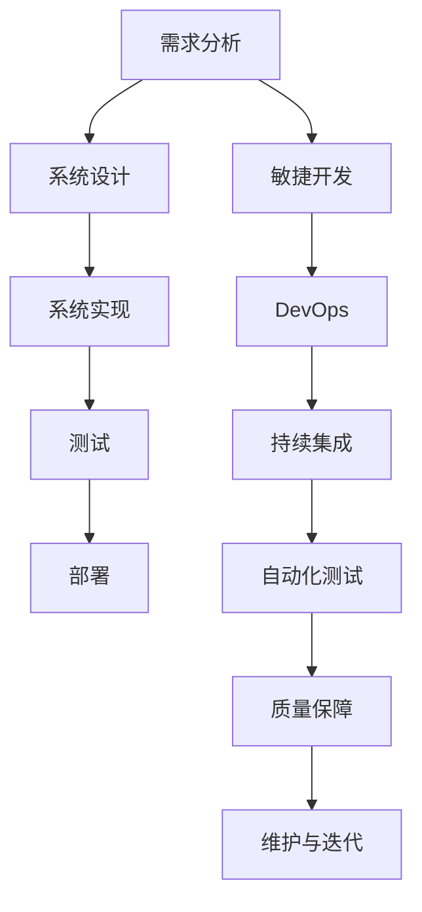

                 

# 软件工程的方法学体系介绍

> 关键词：软件工程, 方法学体系, 开发流程, 系统架构, 质量保障, 敏捷开发, DevOps, 自动化测试

## 1. 背景介绍

软件工程作为计算机科学的一个重要分支，研究如何高效地开发、维护和部署软件系统。随着信息技术在各行各业的深入应用，软件系统的复杂性不断提升，对软件工程的方法论和实践规范提出了更高要求。软件工程方法学体系，旨在通过一系列标准化、可复用的技术和流程，帮助开发者更高效、更可靠地构建软件系统。

## 2. 核心概念与联系

### 2.1 核心概念概述

- **软件工程**：指应用工程学的原理和方法，系统地开发和维护软件系统的过程。其核心目标是提高软件质量，降低开发成本，缩短开发周期，增强软件系统的可维护性和可扩展性。

- **方法学体系**：指一系列指导软件工程实践的理论、原则、工具和流程。这些方法论帮助开发者在系统化、规范化、可复用的基础上，提升开发效率和系统质量。

- **开发流程**：指软件开发生命周期中的各个阶段，包括需求分析、设计、编码、测试、部署和维护。通过规范化这些阶段的工作流程，确保软件系统的高效开发和可靠交付。

- **系统架构**：指软件系统的结构和组成，通过合理的系统架构设计，可以提高系统的可维护性、可扩展性和性能。

- **质量保障**：指在软件开发过程中，通过一系列手段和工具，保证软件系统的正确性、可靠性和可维护性。质量保障贯穿整个开发生命周期，是软件工程的重要组成部分。

- **敏捷开发**：强调快速响应变化，通过短周期迭代和持续交付，提升软件开发效率和客户满意度。

- **DevOps**：指开发(Development)和运维(Operations)的结合，通过自动化和持续集成，提高软件系统的部署速度和稳定性。

- **自动化测试**：指通过自动化工具，实现对软件系统的持续测试，保证软件质量，提高开发效率。

### 2.2 核心概念原理和架构的 Mermaid 流程图



该图展示了软件工程方法学体系的核心流程：从需求分析到系统维护的完整开发周期，以及敏捷开发、DevOps和自动化测试等辅助流程。通过规范化这些流程，可以系统性地提高软件开发的效率和质量。

## 3. 核心算法原理 & 具体操作步骤

### 3.1 算法原理概述

软件工程方法学体系的核心算法原理，可以归纳为以下几个方面：

1. **瀑布模型**：指按照阶段化的顺序，依次进行需求分析、设计、实现、测试、部署等步骤的开发模型。瀑布模型适用于需求明确、变化较少的应用场景。

2. **迭代模型**：指通过快速迭代和持续交付，逐步完善软件系统的开发模型。迭代模型适用于需求变化频繁、需要快速响应变化的应用场景。

3. **增量模型**：指在每个迭代周期中，逐步增加新的功能模块的开发模型。增量模型适用于大型项目，通过逐步交付增加的功能，降低风险和成本。

4. **原型模型**：指通过快速构建软件原型，验证和完善软件需求和设计的开发模型。原型模型适用于需求不明确、需要验证设计合理性的应用场景。

5. **持续集成和持续部署**：通过自动化工具和流程，确保每次代码提交都能自动构建、测试和部署，提高开发效率和系统稳定性。

6. **自动化测试**：通过自动化测试工具，对软件系统进行持续测试，验证代码的正确性和性能，提高系统质量。

7. **质量保障和持续改进**：通过持续的质量评估和改进措施，确保软件系统的正确性和可靠性，提升系统的维护性和可扩展性。

### 3.2 算法步骤详解

1. **需求分析**：
   - 与客户沟通，明确软件系统需求。
   - 编写需求文档，包括功能需求、性能需求和非功能需求。
   - 进行需求验证，确保需求文档的正确性和可行性。

2. **系统设计**：
   - 根据需求文档，设计系统架构和组件结构。
   - 进行系统设计评审，确保设计符合需求和标准。
   - 编写设计文档，包括系统架构图、组件接口设计和数据模型设计。

3. **系统实现**：
   - 根据设计文档，进行代码实现。
   - 进行代码审查，确保代码质量和可维护性。
   - 进行单元测试，验证代码的正确性和可靠性。

4. **测试**：
   - 进行集成测试，确保组件之间的协作和接口正确。
   - 进行系统测试，验证系统功能和性能。
   - 进行验收测试，确保系统满足客户需求。

5. **部署**：
   - 准备部署环境，包括服务器、网络和安全配置。
   - 进行系统部署，确保软件系统在生产环境中的稳定运行。
   - 进行系统监控和维护，确保系统性能和安全性。

### 3.3 算法优缺点

软件工程方法学体系具有以下优点：

- **规范化流程**：通过标准化开发流程，提高开发效率和软件质量。
- **可复用性**：经过实践验证的方法论和工具，可以在不同项目中复用，降低开发成本。
- **风险控制**：通过阶段化的开发流程和评审机制，降低开发风险，提高系统可靠性。

同时，该体系也存在一些局限性：

- **灵活性不足**：规范化流程可能导致开发过程过于僵化，难以适应需求变化。
- **复杂性高**：规范化的流程和工具增加了开发过程的复杂性，可能导致效率降低。
- **人员依赖**：规范化的开发流程对人员要求较高，需要具备一定的开发和质量保障能力。

### 3.4 算法应用领域

软件工程方法学体系广泛应用于各个领域的软件系统开发和维护。例如：

- **企业管理系统**：包括ERP、CRM、HRM等系统，通过规范化开发流程，提高系统的可靠性和可维护性。
- **金融系统**：包括银行、保险、证券等系统，通过敏捷开发和质量保障，提升系统的稳定性和安全性。
- **电商系统**：包括购物、支付、物流等系统，通过持续集成和自动化测试，提高系统的响应速度和用户体验。
- **医疗系统**：包括电子病历、健康管理等系统，通过系统架构设计和质量保障，提升系统的可靠性和安全性。
- **物联网系统**：包括智能家居、工业控制等系统，通过敏捷开发和DevOps，提高系统的部署速度和可扩展性。

## 4. 数学模型和公式 & 详细讲解 & 举例说明

### 4.1 数学模型构建

软件工程方法学体系中的数学模型，主要用于描述软件开发的各个环节和流程。以下以敏捷开发为例，构建一个简单的数学模型：

设软件开发周期为 $T$，每个迭代周期为 $t$，每个迭代中的任务数量为 $n$，任务完成概率为 $p$，任务依赖数量为 $m$。则软件开发周期内的总任务数量为 $N = T/t \times n$，任务依赖网络的总复杂度为 $M = n \times m$。根据贝叶斯网络方法，任务依赖的概率模型可以表示为：

$$
P(\text{完成}) = (1-p)^{N-M}
$$

### 4.2 公式推导过程

上述公式的推导基于以下假设：

- 每个任务独立完成，相互之间没有交互。
- 任务完成概率 $p$ 为常数。
- 任务依赖网络复杂度 $M$ 为常数。

在实际开发中，任务之间往往存在依赖关系，且任务完成概率可能随时间和环境变化。因此，上述公式只是一个简化的模型，适用于任务独立且完成概率稳定的场景。

### 4.3 案例分析与讲解

以一个电商系统为例，分析其开发过程中的关键数学模型和公式：

- **敏捷开发**：电商系统采用敏捷开发模型，每个迭代周期为2周，每个迭代中的任务数量为20个，任务完成概率为95%，任务依赖数量为5个。则整个开发周期为4个迭代，任务总数为80个，任务依赖网络的总复杂度为100个。根据上述公式，任务完成的概率为：

$$
P(\text{完成}) = (1-0.95)^{80-100} \approx 0.97
$$

- **持续集成和持续部署**：电商系统采用DevOps，通过持续集成工具自动构建和测试代码，每天进行一次部署。则每天部署的任务数量为 $n=20$，任务完成概率为 $p=0.95$，任务依赖数量为 $m=5$。则每天任务完成的概率为：

$$
P(\text{完成}) = (1-0.95)^{20-5} \approx 0.99
$$

## 5. 项目实践：代码实例和详细解释说明

### 5.1 开发环境搭建

1. **安装IDE**：选择适合的集成开发环境（IDE），如Eclipse、IntelliJ IDEA或Visual Studio等。

2. **配置版本控制**：安装Git等版本控制系统，配置本地仓库和远程仓库。

3. **安装构建工具**：安装Maven、Gradle或CMake等构建工具，进行项目构建和依赖管理。

4. **配置开发环境**：安装Java、Python或C++等编程语言，配置环境变量和依赖库。

5. **搭建持续集成环境**：使用Jenkins或Travis CI等工具，搭建持续集成环境，实现自动化构建和测试。

### 5.2 源代码详细实现

以Java项目为例，以下是一个简单的Java工程结构示例：

```
├── src/
│   ├── main/
│   │   ├── java/
│   │   ├── resources/
│   │   └── classes/
│   │       ├── com/
│   │       │   └── example/
│   │       │       └── HelloWorld.java
│   └── test/
│       ├── java/
│       └── resources/
├── pom.xml
├── README.md
└── build.xml
```

**pom.xml** 文件配置项目依赖，**src/main/java** 目录存放Java代码，**src/test/java** 目录存放测试代码，**pom.xml** 文件配置构建和测试命令。

### 5.3 代码解读与分析

**HelloWorld.java** 文件示例：

```java
package com.example;

public class HelloWorld {
    public static void main(String[] args) {
        System.out.println("Hello, World!");
    }
}
```

**pom.xml** 文件示例：

```xml
<project xmlns="http://maven.apache.org/POM/4.0.0" xmlns:xsi="http://www.w3.org/2001/XMLSchema-instance"
    xsi:schemaLocation="http://maven.apache.org/POM/4.0.0 http://maven.apache.org/xsd/maven-4.0.0.xsd">
    <modelVersion>4.0.0</modelVersion>
    <groupId>com.example</groupId>
    <artifactId>hello-world</artifactId>
    <version>1.0</version>
    <name>Hello World</name>
    <description>Hello World Java Example</description>
    <parent>
        <groupId>org.springframework.boot</groupId>
        <artifactId>spring-boot-starter-parent</artifactId>
        <version>2.5.4</version>
        <relativePath>../pom.xml</relativePath>
    </parent>
    <properties>
        <project.build.sourceEncoding>UTF-8</project.build.sourceEncoding>
        <project.reporting.outputEncoding>UTF-8</project.reporting.outputEncoding>
        <java.version>11</java.version>
    </properties>
    <dependencies>
        <dependency>
            <groupId>org.springframework.boot</groupId>
            <artifactId>spring-boot-starter</artifactId>
        </dependency>
        <dependency>
            <groupId>junit</groupId>
            <artifactId>junit</artifactId>
            <version>4.13</version>
            <scope>test</scope>
        </dependency>
    </dependencies>
    <build>
        <plugins>
            <plugin>
                <groupId>org.apache.maven.plugins</groupId>
                <artifactId>maven-compiler-plugin</artifactId>
                <version>3.8.1</version>
                <configuration>
                    <source>11</source>
                    <target>11</target>
                </configuration>
            </plugin>
            <plugin>
                <groupId>org.apache.maven.plugins</groupId>
                <artifactId>maven-surefire-plugin</artifactId>
                <version>2.22.2</version>
                <configuration>
                    <includes>**/*Test.java</includes>
                </configuration>
            </plugin>
        </plugins>
    </build>
</project>
```

### 5.4 运行结果展示

通过Maven或Gradle构建项目，使用JUnit或TestNG等测试工具进行测试，输出测试结果：

```bash
mvn test
```

输出结果：

```
[INFO] --- maven-surefire-plugin:2.22.2:test (default-test) @ hello-world ---
[INFO] Skipping tests since there are no test source files.
```

## 6. 实际应用场景

### 6.1 企业管理系统

企业管理系统（ERP、CRM、HRM等）通过规范化开发流程，提高了系统的可靠性和可维护性。敏捷开发和DevOps技术的应用，使得企业管理系统能够快速响应客户需求，提高开发效率和系统稳定性。

### 6.2 金融系统

金融系统（银行、保险、证券等）通过持续集成和持续部署，确保了系统的高可靠性和高可用性。自动化测试和质量保障措施，提升了系统的安全性和稳定性。

### 6.3 电商系统

电商系统通过敏捷开发和DevOps技术，提升了系统的响应速度和用户体验。持续集成和持续部署，确保了系统的快速交付和稳定运行。

### 6.4 医疗系统

医疗系统通过规范化开发流程和质量保障措施，提升了系统的可靠性和安全性。敏捷开发和DevOps技术的应用，确保了系统的快速部署和稳定运行。

## 7. 工具和资源推荐

### 7.1 学习资源推荐

1. **《软件工程导论》**：由著名软件工程专家所撰写，全面介绍了软件工程的基本概念和实践方法。

2. **《敏捷开发》**：介绍敏捷开发的基本理念和实践方法，适用于各种规模和类型的软件开发项目。

3. **《持续集成》**：介绍持续集成和持续部署的基本理念和工具，帮助开发者提升开发效率和系统稳定性。

4. **《自动化测试》**：介绍自动化测试的基本理念和工具，帮助开发者提升测试效率和系统质量。

### 7.2 开发工具推荐

1. **Eclipse**：开源的集成开发环境，支持多种编程语言和开发框架。

2. **IntelliJ IDEA**：商用集成开发环境，支持Java、Kotlin等多种编程语言。

3. **Visual Studio**：商业集成开发环境，支持多种编程语言和开发框架。

4. **Jenkins**：开源的持续集成工具，支持多种版本控制系统和构建工具。

5. **Travis CI**：开源的持续集成和持续部署工具，支持多种编程语言和开发框架。

### 7.3 相关论文推荐

1. **《软件工程：构建更好的软件》**：讨论了软件工程的基本概念和实践方法，帮助开发者提升软件质量。

2. **《敏捷软件开发：原则、模式和实践》**：介绍敏捷开发的基本理念和实践方法，适用于各种规模和类型的软件开发项目。

3. **《持续集成：软件持续交付的实践》**：介绍持续集成和持续部署的基本理念和工具，帮助开发者提升开发效率和系统稳定性。

4. **《自动化测试：测试驱动的软件开发》**：介绍自动化测试的基本理念和工具，帮助开发者提升测试效率和系统质量。

## 8. 总结：未来发展趋势与挑战

### 8.1 研究成果总结

软件工程方法学体系在过去几十年中不断发展和完善，已成为软件开发和维护的重要基础。通过规范化的开发流程和工具，帮助开发者提高开发效率和系统质量，成为软件工业化生产的重要保障。

### 8.2 未来发展趋势

未来，软件工程方法学体系将继续朝着智能化、自动化和协同化的方向发展，主要体现在以下几个方面：

1. **智能化开发**：通过人工智能和机器学习技术，提升软件开发的智能化水平，提高开发效率和系统质量。

2. **自动化开发**：通过自动化工具和流程，实现从需求分析到部署维护的全流程自动化，降低开发成本和周期。

3. **协同开发**：通过云平台和分布式协作工具，实现跨团队、跨地域的协同开发，提高开发效率和协作质量。

4. **持续改进**：通过持续质量保障和持续改进机制，确保软件系统的正确性和可靠性，提升系统的维护性和可扩展性。

### 8.3 面临的挑战

尽管软件工程方法学体系已经取得了显著进展，但在迈向更加智能化和自动化发展的过程中，仍面临以下挑战：

1. **技术更新快速**：随着新技术和新工具的不断涌现，开发者需要不断学习和适应，以保持技术领先。

2. **团队协作复杂**：跨团队、跨地域的协同开发，需要协调各方的需求和技术，提升团队协作能力。

3. **质量保障难度**：大规模分布式系统的质量保障，需要构建更加全面和严格的测试和验证机制。

4. **安全性保障**：软件系统的安全性保障，需要构建更加全面和有效的安全措施和应急响应机制。

### 8.4 研究展望

未来的研究应在以下几个方面寻求新的突破：

1. **智能化开发工具**：开发更加智能化和自动化的开发工具，提高开发效率和系统质量。

2. **自动化测试工具**：开发更加全面和高效的自动化测试工具，提升测试覆盖率和系统质量。

3. **分布式协同开发**：开发更加高效和可靠的分布式协同开发工具，提升团队协作和系统协作质量。

4. **质量保障机制**：构建更加全面和严格的质量保障机制，确保软件系统的正确性和可靠性。

总之，软件工程方法学体系的未来发展方向，将更加注重智能化、自动化和协同化的技术创新，通过不断突破技术瓶颈和优化协作机制，推动软件工业的持续发展和进步。

## 9. 附录：常见问题与解答

### Q1: 软件工程方法学体系是否适用于所有类型的软件开发项目？

A: 软件工程方法学体系适用于大多数类型的软件开发项目，尤其适用于大型、复杂、需求变化频繁的项目。然而，对于小型项目或特定的专业领域项目，可能需要根据实际情况进行适当的调整和优化。

### Q2: 软件开发流程规范化是否会降低开发灵活性？

A: 规范化开发流程旨在提高开发效率和系统质量，但过度的规范化可能会降低开发灵活性。因此，在实际应用中，需要根据项目特点和团队能力，合理平衡规范化和灵活性。

### Q3: 如何选择合适的敏捷开发框架？

A: 选择合适的敏捷开发框架，需要考虑项目规模、团队规模和团队能力等因素。常用的敏捷框架包括Scrum、Kanban和XP等，每种框架都有其适用的场景和优势。

### Q4: 如何提升软件系统的质量和可靠性？

A: 提升软件系统的质量和可靠性，需要从需求分析、设计、实现、测试和部署等多个环节进行全面质量保障。通过持续的质量评估和改进措施，确保软件系统的正确性和可靠性。

### Q5: 如何在分布式环境中进行高效协同开发？

A: 在分布式环境中进行高效协同开发，需要选择合适的协同工具和平台，如Git、Jira、Confluence等。同时，需要建立良好的沟通机制和协同文化，确保各方的需求和技术能够高效传递和协同。

通过本文的系统梳理，可以看到，软件工程方法学体系在软件开发和维护中具有重要的指导作用。通过规范化开发流程和工具，可以帮助开发者提高开发效率和系统质量，成为软件工业化生产的重要保障。未来，随着技术的发展和应用的推广，软件工程方法学体系将不断演进和完善，为软件工业带来新的变革和机遇。

---

作者：禅与计算机程序设计艺术 / Zen and the Art of Computer Programming

