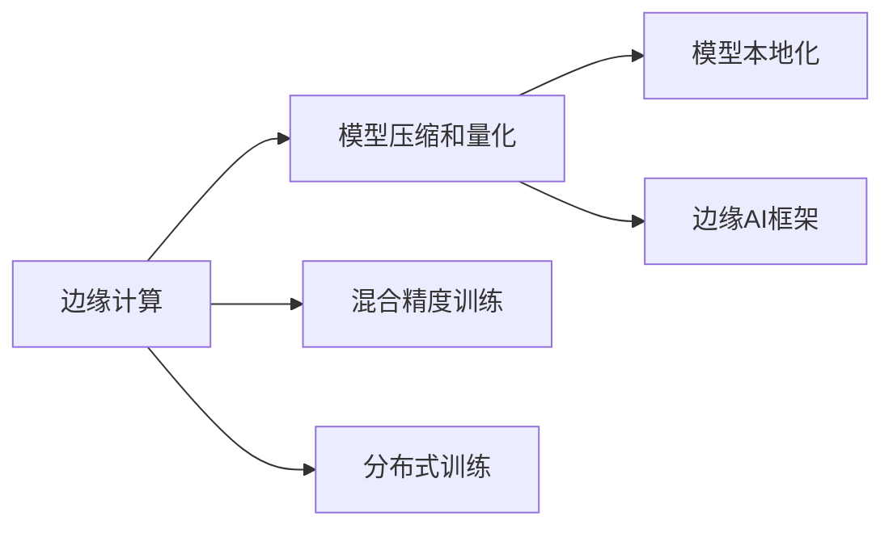

                 

## 1. 背景介绍

### 1.1 问题由来

在当前的计算生态中，机器学习（ML）模型越来越多地依赖于高性能计算资源，如CPU、GPU或TPU。然而，这些计算资源通常集中在云端或服务器端，而数据却分散在各种设备上，如手机、物联网（IoT）设备、边缘计算节点等。这种数据和计算资源的不匹配，使得传统的基于云端的ML模型难以直接应用于这些分散的设备。

### 1.2 问题核心关键点

边缘AI（Edge AI）是指将机器学习模型部署到靠近数据源的本地设备上，实现实时处理和推理。相比传统的云端部署，边缘AI能够降低延迟、保护数据隐私、减少带宽占用，并提升系统的可靠性和响应速度。

边缘AI的核心关键点包括：
1. **模型压缩和量化**：将大型ML模型压缩为轻量级模型，以适应资源有限的设备。
2. **模型剪枝和剪枝算法**：通过剪枝算法，移除不必要的权重，减少计算量和内存占用。
3. **混合精度训练**：使用混合精度训练，在保持精度的同时，减少训练时间和内存消耗。
4. **模型分割和分布式训练**：将模型分割成多个部分，并行训练，提升训练效率。
5. **模型本地化**：在本地设备上运行推理，减少数据传输和云端计算的依赖。
6. **边缘计算框架**：如TensorFlow Lite、ONNX Runtime等，提供了边缘设备上的推理支持。

这些关键技术能够帮助ML模型在边缘设备上高效运行，从而实现实时智能应用。

## 2. 核心概念与联系

### 2.1 核心概念概述

为了更好地理解边缘AI的概念和实施方式，本节将介绍几个核心概念及其之间的联系：

1. **边缘计算（Edge Computing）**：在网络边缘设备上进行计算和数据处理，以减少数据传输和提高处理速度。边缘计算通常包括数据收集、预处理、分析和应用的本地化。

2. **模型压缩和量化（Model Compression and Quantization）**：通过减少模型的参数量和计算量，使其能够在资源受限的设备上高效运行。模型压缩和量化技术包括剪枝、蒸馏、量化等。

3. **混合精度训练（Mixed Precision Training）**：使用不同位宽的数据类型（如16位浮点型FP16、32位浮点型FP32等）进行训练，以提高计算效率和内存利用率。

4. **分布式训练（Distributed Training）**：将训练任务分布在多个设备上，以提升训练速度和处理能力。

5. **边缘AI框架（Edge AI Frameworks）**：如TensorFlow Lite、ONNX Runtime、PyTorch Mobile等，提供了在边缘设备上部署和运行ML模型的工具和库。

### 2.2 核心概念原理和架构的 Mermaid 流程图



这个流程图展示了边缘AI的核心概念及其之间的联系：

1. 边缘计算是边缘AI的基础，负责数据收集和预处理。
2. 模型压缩和量化可以减少模型大小，提高边缘设备上的推理速度。
3. 混合精度训练进一步优化了模型的计算效率和内存占用。
4. 分布式训练能够充分利用多个边缘设备，提升训练速度。
5. 模型本地化使得模型能够在边缘设备上直接运行，减少云端计算的依赖。
6. 边缘AI框架提供了工具和库，使得模型在边缘设备上的部署和运行更加便捷。

这些概念共同构成了边缘AI的技术体系，使得ML模型能够在边缘设备上高效运行。

## 3. 核心算法原理 & 具体操作步骤

### 3.1 算法原理概述

边缘AI的算法原理主要围绕着如何优化模型以适应边缘设备的资源限制，以及如何在边缘设备上进行高效的推理。核心思想是：

1. **模型压缩和量化**：通过减少模型的参数量和计算量，使其能够在资源有限的设备上高效运行。
2. **模型剪枝**：通过剪枝算法，移除不必要的权重，减少计算量和内存占用。
3. **混合精度训练**：使用不同位宽的数据类型进行训练，以提高计算效率和内存利用率。
4. **分布式训练**：将训练任务分布在多个设备上，提升训练速度和处理能力。
5. **模型本地化**：在本地设备上运行推理，减少数据传输和云端计算的依赖。

### 3.2 算法步骤详解

以下是边缘AI的详细步骤：

**Step 1: 数据收集和预处理**
- 收集设备上的数据，并进行必要的预处理，如去噪、归一化、采样等。

**Step 2: 模型选择和压缩**
- 选择适合目标设备的ML模型，如MobileNet、SqueezeNet等。
- 使用模型压缩和量化技术，减少模型的参数量和计算量。

**Step 3: 模型剪枝**
- 使用剪枝算法，移除不重要的权重，进一步压缩模型。
- 可以使用权重剪枝、通道剪枝、网络剪枝等方法。

**Step 4: 混合精度训练**
- 在训练过程中，使用不同位宽的数据类型，如FP16、FP32等。
- 使用混合精度训练框架，如TensorFlow Lite、ONNX Runtime等，进行混合精度训练。

**Step 5: 分布式训练**
- 将训练任务分布在多个边缘设备上，如智能手机、物联网设备等。
- 使用分布式训练框架，如TensorFlow分布式训练、PyTorch分布式训练等，实现并行训练。

**Step 6: 模型本地化**
- 将训练好的模型部署到目标设备上。
- 使用边缘AI框架，如TensorFlow Lite、ONNX Runtime等，在设备上运行推理。

**Step 7: 评估和优化**
- 在目标设备上评估模型性能，如推理速度、准确率等。
- 根据评估结果，对模型进行优化，如调整参数、增加训练数据等。

### 3.3 算法优缺点

边缘AI的算法有以下优点：
1. **低延迟**：模型在本地设备上进行推理，减少了数据传输和计算延迟。
2. **保护数据隐私**：数据在本地处理，减少了数据传输和存储的风险。
3. **减少带宽占用**：减少了数据传输的带宽占用，降低网络成本。
4. **提升系统可靠性和响应速度**：减少了对云端的依赖，提升了系统的可靠性和响应速度。

但同时，也存在一些缺点：
1. **资源受限**：边缘设备上的计算资源和存储资源有限，限制了模型的规模和复杂度。
2. **开发和维护成本高**：需要将模型部署到多个设备上，增加了开发和维护的复杂度。
3. **边缘设备的安全性**：边缘设备的安全性问题需要特别注意，如设备锁控、数据加密等。

### 3.4 算法应用领域

边缘AI的应用领域非常广泛，包括但不限于：

- **智能家居**：智能音箱、智能灯泡、智能安防等设备上的语音识别、图像识别等。
- **工业物联网（IIoT）**：工业设备上的状态监测、故障预测等。
- **智能交通**：自动驾驶汽车、智能交通信号灯等设备上的图像处理、路径规划等。
- **智能医疗**：可穿戴设备上的健康监测、图像诊断等。
- **智能城市**：公共设施、智能停车场等设备上的视频分析、行为识别等。

## 4. 数学模型和公式 & 详细讲解 & 举例说明

### 4.1 数学模型构建

在边缘AI中，模型的数学模型构建与传统ML模型类似，主要包括以下几个步骤：

1. **数据准备**：收集和预处理数据集，如图像数据、文本数据等。
2. **模型选择**：选择合适的ML模型，如卷积神经网络（CNN）、循环神经网络（RNN）、Transformer等。
3. **模型训练**：在训练集上进行模型训练，最小化损失函数。
4. **模型评估**：在验证集上进行模型评估，如准确率、召回率等。
5. **模型压缩和量化**：对训练好的模型进行压缩和量化，减少参数量和计算量。
6. **模型本地化**：将压缩后的模型部署到目标设备上，并进行本地推理。

### 4.2 公式推导过程

以卷积神经网络（CNN）为例，其基本模型结构如图：

$$
y = W \cdot x + b
$$

其中，$x$ 是输入数据，$y$ 是输出结果，$W$ 是权重矩阵，$b$ 是偏置向量。

在边缘AI中，为了适应资源有限的设备，需要进行模型压缩和量化。以权重剪枝为例，其基本流程如下：

1. **计算重要性分数**：对每个权重进行重要性分数计算，如使用L1范数、L2范数、Hessian矩阵等方法。
2. **移除不重要的权重**：根据重要性分数，移除不重要的权重，减少计算量和内存占用。
3. **调整网络结构**：调整网络结构，以适应剪枝后的权重分布。

### 4.3 案例分析与讲解

以智能交通中的自动驾驶为例，其核心任务是实时图像识别和路径规划。以下是边缘AI在该应用中的具体实现：

1. **数据收集**：收集自动驾驶车辆上的摄像头图像。
2. **模型选择和训练**：选择适合的CNN模型，如MobileNet，在训练集上进行训练。
3. **模型压缩和量化**：对训练好的模型进行压缩和量化，减少计算量和内存占用。
4. **模型本地化**：将压缩后的模型部署到自动驾驶车辆上，进行本地推理。
5. **评估和优化**：在测试集上进行模型评估，如准确率、召回率等，根据评估结果对模型进行优化。

## 5. 项目实践：代码实例和详细解释说明

### 5.1 开发环境搭建

边缘AI项目通常需要跨平台和跨设备的支持，因此开发环境的选择非常重要。以下是常用的开发环境：

1. **Linux系统**：如Ubuntu、CentOS等，是主流的操作系统，支持多种编程语言和开发工具。
2. **Android平台**：如Android Studio，是移动设备开发的常用工具，支持TensorFlow Lite等边缘AI框架。
3. **iOS平台**：如Xcode，是iOS设备开发的常用工具，支持CoreML等框架。
4. **边缘计算平台**：如AWS Greengrass、Azure IoT Edge等，提供了边缘设备的支持。

### 5.2 源代码详细实现

以下是使用TensorFlow Lite实现边缘AI的代码示例：

```python
import tensorflow as tf
import tensorflow_lite as tflite

# 加载预训练模型
model = tf.keras.models.load_model('model.h5')

# 转换模型为TensorFlow Lite格式
converter = tf.lite.TFLiteConverter.from_keras_model(model)
tflite_model = converter.convert()

# 保存模型到本地
with open('model.tflite', 'wb') as f:
    f.write(tflite_model)
```

### 5.3 代码解读与分析

上述代码将一个预训练的Keras模型转换为TensorFlow Lite格式，并保存到本地。具体步骤如下：

1. **加载预训练模型**：使用`tf.keras.models.load_model`方法加载预训练模型。
2. **转换模型为TensorFlow Lite格式**：使用`tf.lite.TFLiteConverter`方法将模型转换为TensorFlow Lite格式。
3. **保存模型到本地**：将转换后的TensorFlow Lite模型保存到本地文件中。

### 5.4 运行结果展示

运行上述代码后，模型文件`model.tflite`生成，即可在目标设备上使用TensorFlow Lite进行推理。例如，在Android设备上使用以下代码进行推理：

```java
import org.tensorflow.lite.Interpreter;
import org.tensorflow.lite.InterpreterFactory;

// 加载模型文件
byte[] model = Files.readAllBytes(Paths.get("model.tflite"));

// 创建Interpreter对象
Interpreter interpreter = new InterpreterFactory().create(new ModelLoader.Options(model).config(new Config.Builder().setNumThreads(4).build()));

// 进行推理
float[] input = {0.1f, 0.2f, 0.3f, 0.4f};
float[] output = new float[1];
interpreter.run(input, output);

// 输出结果
System.out.println(Arrays.toString(output));
```

## 6. 实际应用场景

### 6.1 智能家居

在智能家居中，边缘AI可以用于智能音箱、智能灯泡等设备上的语音识别和图像识别。例如，智能音箱可以通过本地推理实时识别用户的语音指令，并提供相应的音频响应。智能灯泡可以通过图像识别实时监测环境光线，自动调整亮度。

### 6.2 工业物联网（IIoT）

在工业物联网中，边缘AI可以用于设备状态监测、故障预测等。例如，智能工厂可以通过本地推理实时监测设备的运行状态，提前预测设备故障，并自动调整生产参数，提高生产效率。

### 6.3 智能交通

在智能交通中，边缘AI可以用于自动驾驶汽车、智能交通信号灯等设备上的图像处理、路径规划等。例如，自动驾驶汽车可以通过本地推理实时识别道路上的车辆和行人，自动规划最优路径，避免交通事故。智能交通信号灯可以通过图像识别实时监测交通情况，自动调整信号灯的时长，提高交通效率。

### 6.4 智能医疗

在智能医疗中，边缘AI可以用于可穿戴设备上的健康监测、图像诊断等。例如，智能手表可以通过本地推理实时监测用户的健康数据，如心率、血氧等，提供个性化的健康建议。智能影像设备可以通过图像识别实时诊断疾病，提高诊断准确率。

### 6.5 智能城市

在智能城市中，边缘AI可以用于公共设施、智能停车场等设备上的视频分析、行为识别等。例如，智能视频监控可以通过本地推理实时监测公共场所的行为，发现异常情况，提高公共安全。智能停车场可以通过图像识别实时监测车辆进出情况，自动调整停车位置，提高停车效率。

## 7. 工具和资源推荐

### 7.1 学习资源推荐

为了帮助开发者系统掌握边缘AI的理论基础和实践技巧，这里推荐一些优质的学习资源：

1. **TensorFlow Lite官方文档**：详细介绍了TensorFlow Lite的使用方法、优化技巧、案例应用等。
2. **ONNX Runtime官方文档**：提供了ONNX Runtime的使用方法、模型转换、推理加速等。
3. **PyTorch Mobile官方文档**：提供了PyTorch Mobile的使用方法、模型部署、推理加速等。
4. **Edge AI博客**：来自边缘AI领域的专家分享了边缘AI的前沿技术和实践经验。
5. **Coursera边缘AI课程**：斯坦福大学开设的边缘AI课程，涵盖了边缘计算、模型压缩、量化等技术。

通过对这些资源的学习实践，相信你一定能够快速掌握边缘AI的核心技术，并用于解决实际的智能应用问题。

### 7.2 开发工具推荐

高效的开发离不开优秀的工具支持。以下是几款用于边缘AI开发的常用工具：

1. **TensorFlow Lite**：Google开发的轻量级机器学习框架，支持移动设备和嵌入式设备。
2. **ONNX Runtime**：Microsoft开发的开源推理框架，支持多种硬件平台和编程语言。
3. **PyTorch Mobile**：Facebook开发的PyTorch扩展，支持移动设备和嵌入式设备。
4. **TensorFlow Lite Studio**：Google开发的可视化编辑器，支持TensorFlow Lite模型的创建、编辑和优化。
5. **ModelScope**：由华为开源的模型社区，提供了大量预训练模型和优化算法。

合理利用这些工具，可以显著提升边缘AI项目的开发效率，加快创新迭代的步伐。

### 7.3 相关论文推荐

边缘AI的发展得益于学界的持续研究。以下是几篇奠基性的相关论文，推荐阅读：

1. **Edge computing for Internet of Things: A survey**：综述了边缘计算在物联网中的应用，提供了丰富的案例和分析。
2. **Edge AI: Edge Devices, Edge Computing, and Machine Learning**：详细介绍了边缘AI的核心技术，包括边缘计算、模型压缩、量化等。
3. **Towards Edge AI: Moving Machine Learning to the Edge**：介绍了边缘AI的发展历程和未来方向，提供了前沿技术和实践经验。
4. **MobileNetV2: Inverted Residuals and Linear Bottlenecks**：介绍了MobileNet等轻量级模型的实现方法，适用于移动设备。
5. **TensorFlow Lite: A Compilation Toolchain for Mobile and Edge ML**：介绍了TensorFlow Lite的使用方法、优化技巧和案例应用。

这些论文代表了边缘AI的发展脉络，通过学习这些前沿成果，可以帮助研究者把握学科前进方向，激发更多的创新灵感。

## 8. 总结：未来发展趋势与挑战

### 8.1 总结

本文对边缘AI的概念、技术、应用进行了全面系统的介绍。首先阐述了边缘AI的背景和核心关键点，明确了其在资源受限设备上的优势。其次，从原理到实践，详细讲解了边缘AI的算法原理和具体操作步骤，给出了边缘AI任务开发的完整代码实例。同时，本文还广泛探讨了边缘AI在智能家居、工业物联网、智能交通、智能医疗、智能城市等领域的实际应用前景，展示了边缘AI技术的广阔前景。此外，本文精选了边缘AI的技术学习资源，力求为读者提供全方位的技术指引。

通过本文的系统梳理，可以看到，边缘AI技术的不断发展，正在成为智能设备上的重要支撑。边缘AI的应用不仅能够提升设备的智能化水平，还能在资源受限的条件下，实现高效、实时、低成本的智能推理，为各行业带来巨大的商业价值。

### 8.2 未来发展趋势

展望未来，边缘AI将呈现以下几个发展趋势：

1. **模型压缩和量化技术**：随着硬件计算能力的提升，更多的先进模型将被压缩到边缘设备上，如Transformer、BERT等。
2. **边缘计算框架**：新的边缘计算框架将不断涌现，提升模型的推理速度和计算效率。
3. **多模态边缘AI**：边缘AI将逐渐从单一模态向多模态发展，支持图像、语音、视频等多种数据类型的融合处理。
4. **分布式边缘AI**：边缘计算将变得更加分布式，能够支持更多的边缘设备，提升整体的计算能力和处理速度。
5. **联邦学习**：在边缘设备上进行模型训练，保护用户隐私的同时，提升模型的泛化能力。
6. **自适应边缘AI**：边缘AI将具备自适应学习能力，能够根据环境变化动态调整模型参数和推理策略。

以上趋势凸显了边缘AI技术的广阔前景，这些方向的探索发展，必将进一步提升边缘设备的智能化水平，为各行业带来更深远的商业和社会价值。

### 8.3 面临的挑战

尽管边缘AI技术已经取得了瞩目成就，但在迈向更加智能化、普适化应用的过程中，仍面临诸多挑战：

1. **资源受限**：边缘设备的计算资源和存储资源有限，限制了模型的规模和复杂度。
2. **开发和维护成本高**：需要将模型部署到多个设备上，增加了开发和维护的复杂度。
3. **设备安全性**：边缘设备的安全性问题需要特别注意，如设备锁控、数据加密等。
4. **网络带宽限制**：边缘设备的通信带宽有限，限制了数据传输和模型的更新频率。
5. **算法优化**：如何在资源受限的设备上优化模型性能，提升推理速度和计算效率，是重要的研究方向。

### 8.4 研究展望

面对边缘AI所面临的挑战，未来的研究需要在以下几个方面寻求新的突破：

1. **模型压缩和量化技术**：开发更高效的模型压缩和量化方法，如蒸馏、剪枝、量化等。
2. **分布式边缘计算**：研究和实现更加高效的分布式边缘计算框架，提升边缘设备的计算能力和处理速度。
3. **自适应学习算法**：开发能够自适应环境变化的算法，提升边缘AI的鲁棒性和泛化能力。
4. **联邦学习**：研究和实现联邦学习算法，在保护用户隐私的同时，提升模型的泛化能力。
5. **多模态数据融合**：研究和实现多模态数据的融合算法，提升边缘AI的感知能力和理解能力。

这些研究方向的探索，必将引领边缘AI技术迈向更高的台阶，为构建更智能、更普适的智能系统铺平道路。面向未来，边缘AI技术还需要与其他人工智能技术进行更深入的融合，如知识表示、因果推理、强化学习等，多路径协同发力，共同推动自然语言理解和智能交互系统的进步。只有勇于创新、敢于突破，才能不断拓展边缘AI的边界，让智能技术更好地造福人类社会。

## 9. 附录：常见问题与解答

**Q1：什么是边缘计算（Edge Computing）？**

A: 边缘计算是指在网络边缘设备上进行计算和数据处理，以减少数据传输和提高处理速度。边缘计算通常包括数据收集、预处理、分析和应用的本地化。

**Q2：边缘AI的优势是什么？**

A: 边缘AI的优势主要包括：
1. 低延迟：模型在本地设备上进行推理，减少了数据传输和计算延迟。
2. 保护数据隐私：数据在本地处理，减少了数据传输和存储的风险。
3. 减少带宽占用：减少了数据传输的带宽占用，降低网络成本。
4. 提升系统可靠性和响应速度：减少了对云端的依赖，提升了系统的可靠性和响应速度。

**Q3：如何进行边缘AI模型的压缩和量化？**

A: 边缘AI模型的压缩和量化主要包括以下几个步骤：
1. 计算重要性分数：对每个权重进行重要性分数计算，如使用L1范数、L2范数、Hessian矩阵等方法。
2. 移除不重要的权重：根据重要性分数，移除不重要的权重，减少计算量和内存占用。
3. 调整网络结构：调整网络结构，以适应剪枝后的权重分布。

**Q4：如何进行边缘AI模型的分布式训练？**

A: 边缘AI模型的分布式训练主要包括以下几个步骤：
1. 将训练任务分布在多个边缘设备上。
2. 使用分布式训练框架，如TensorFlow分布式训练、PyTorch分布式训练等，实现并行训练。

**Q5：如何进行边缘AI模型的本地化部署？**

A: 边缘AI模型的本地化部署主要包括以下几个步骤：
1. 将训练好的模型转换为轻量级格式，如TensorFlow Lite、ONNX等。
2. 使用边缘AI框架，如TensorFlow Lite、ONNX Runtime等，在目标设备上部署和运行推理。

通过本文的系统梳理，可以看到，边缘AI技术的不断发展，正在成为智能设备上的重要支撑。边缘AI的应用不仅能够提升设备的智能化水平，还能在资源受限的条件下，实现高效、实时、低成本的智能推理，为各行业带来巨大的商业价值。未来，随着边缘AI技术的不断成熟和优化，边缘AI将在更多领域得到应用，为人类认知智能的进化带来深远影响。

