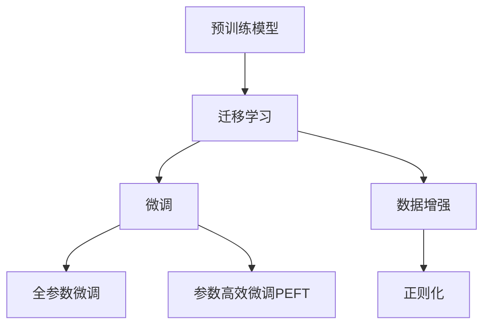

                 

# 迁移学习：利用预训练模型提高AI效率

## 1. 背景介绍

### 1.1 问题由来

人工智能（AI）在近年来取得了飞速发展，特别是深度学习在图像、语音、自然语言处理等领域的应用。然而，深度学习模型的训练需要大量的数据和计算资源，这使得模型的开发和部署成本非常高。为了应对这一挑战，迁移学习应运而生，它利用已经训练好的预训练模型（Pre-trained Models）来加速新任务的训练过程，提高了AI模型的效率。

### 1.2 问题核心关键点

迁移学习的核心在于利用预训练模型学到的知识，将其迁移到新的任务上，从而在保证模型效果的同时，大大降低了训练的时间和资源成本。预训练模型通常是基于大规模无监督学习任务训练的，如自编码器、生成对抗网络（GANs）等，它们可以学习到广泛的特征和表示，对新的任务有一定的通用性。

迁移学习主要包括以下几个关键点：
1. 选择合适的预训练模型和任务。
2. 确定模型的微调策略，包括冻结哪些层、更新哪些层、使用哪些优化器等。
3. 选择合适的损失函数，以及如何评估模型的性能。
4. 数据增强和正则化等技术的应用，以提高模型泛化能力和鲁棒性。

迁移学习被广泛应用于计算机视觉、自然语言处理、语音识别等领域，显著提高了AI应用的效率和效果。

### 1.3 问题研究意义

迁移学习的研究和应用对AI技术的发展具有重要意义：

1. 降低开发成本。迁移学习可以加速新任务的开发，减少了从头开始训练模型的需求，节约了大量的时间和计算资源。
2. 提高模型泛化能力。预训练模型通常具有较强的泛化能力，能够在不同的数据集上取得较好的性能。
3. 加速模型部署。迁移学习可以在较短时间内训练出高质量的模型，加速模型的部署和应用。
4. 促进跨领域研究。迁移学习推动了跨领域的知识共享和研究，促进了不同领域之间的合作与融合。

## 2. 核心概念与联系

### 2.1 核心概念概述

为更好地理解迁移学习，本节将介绍几个密切相关的核心概念：

- 预训练模型(Pre-trained Models)：在大量无监督数据上训练得到的模型，如自编码器、卷积神经网络（CNNs）、Transformer等。预训练模型能够学习到广泛的特征和表示，对新任务有一定的通用性。
- 迁移学习(Transfer Learning)：利用预训练模型学到的知识，将其迁移到新的任务上，从而在保证模型效果的同时，大大降低了训练的时间和资源成本。
- 微调(Fine-tuning)：在预训练模型的基础上，使用下游任务的少量标注数据，通过有监督地训练来优化模型在特定任务上的性能。微调是迁移学习的一种常见形式。
- 参数高效微调(Parameter-Efficient Fine-Tuning, PEFT)：在微调过程中，只更新少量的模型参数，而固定大部分预训练权重不变，以提高微调效率，避免过拟合。
- 数据增强(Data Augmentation)：通过对训练样本进行一系列变换，增加训练集的多样性，提高模型的泛化能力。
- 正则化(Regularization)：通过在损失函数中加入正则项，防止模型过拟合。

这些核心概念之间的逻辑关系可以通过以下Mermaid流程图来展示：



这个流程图展示了大规模预训练模型的核心概念及其之间的关系：

1. 预训练模型通过在大规模无监督数据上进行训练，学习到广泛的特征和表示。
2. 迁移学习利用预训练模型学到的知识，将其迁移到新的任务上。
3. 微调是迁移学习的一种常见形式，通过有监督的训练优化模型在特定任务上的性能。
4. 参数高效微调通过只更新少量的模型参数，提高微调效率，避免过拟合。
5. 数据增强和正则化技术进一步提高模型的泛化能力和鲁棒性。

## 3. 核心算法原理 & 具体操作步骤

### 3.1 算法原理概述

迁移学习的核心思想是利用预训练模型学到的知识，将其迁移到新的任务上。具体而言，迁移学习包括以下几个步骤：

1. 选择合适的预训练模型，将其作为初始化参数。
2. 确定新任务的标注数据集，使用下游任务的少量标注数据来微调预训练模型。
3. 选择适当的优化算法和损失函数，最小化模型在特定任务上的误差。
4. 应用数据增强和正则化技术，提高模型的泛化能力和鲁棒性。
5. 评估模型的性能，确保其在新任务上表现良好。

迁移学习的核心在于如何利用预训练模型学到的知识，最大程度地发挥其在新任务上的作用。在迁移学习中，预训练模型通常起到以下两个作用：

1. 提供特征表示：预训练模型通过在大规模无监督数据上进行训练，学习到广泛的特征和表示，这些特征表示可以作为新任务的输入特征。
2. 提供迁移能力：预训练模型在处理新任务时，可以利用已经学习到的知识，加速模型的收敛和泛化。

### 3.2 算法步骤详解

以下是迁移学习的一般步骤：

**Step 1: 准备预训练模型和数据集**
- 选择合适的预训练模型，如BERT、GPT、ResNet等。
- 准备下游任务的数据集，划分为训练集、验证集和测试集。

**Step 2: 确定微调策略**
- 确定微调的策略，包括冻结哪些层、更新哪些层、使用哪些优化器等。通常只微调预训练模型的顶层，以避免破坏底层特征表示。
- 选择合适的优化器，如SGD、Adam等。

**Step 3: 执行梯度训练**
- 将训练集数据分批次输入模型，前向传播计算损失函数。
- 反向传播计算参数梯度，根据设定的优化算法和学习率更新模型参数。
- 周期性在验证集上评估模型性能，根据性能指标决定是否触发Early Stopping。
- 重复上述步骤直到满足预设的迭代轮数或Early Stopping条件。

**Step 4: 测试和部署**
- 在测试集上评估微调后模型在新任务上的性能。
- 使用微调后的模型对新样本进行推理预测，集成到实际的应用系统中。
- 持续收集新的数据，定期重新微调模型，以适应数据分布的变化。

以上是迁移学习的一般流程。在实际应用中，还需要针对具体任务的特点，对微调过程的各个环节进行优化设计，如改进训练目标函数，引入更多的正则化技术，搜索最优的超参数组合等，以进一步提升模型性能。

### 3.3 算法优缺点

迁移学习具有以下优点：

1. 降低开发成本。利用预训练模型可以大大减少从头开始训练所需的时间和计算资源。
2. 提高模型泛化能力。预训练模型通常具有较强的泛化能力，能够在不同的数据集上取得较好的性能。
3. 加速模型部署。迁移学习可以在较短时间内训练出高质量的模型，加速模型的部署和应用。

同时，迁移学习也存在一些局限性：

1. 数据质量要求高。下游任务的标注数据需要具有高质量和代表性，否则可能会引入噪声，影响模型性能。
2. 微调后的模型可能出现泛化性能下降。在新的数据集上，微调后的模型可能会面临泛化性能下降的问题。
3. 模型复杂度增加。预训练模型通常具有较大的参数量和计算量，这可能会增加部署和推理的复杂度。

尽管存在这些局限性，但迁移学习仍然是当前AI领域中最为有效的范式之一，广泛应用于计算机视觉、自然语言处理、语音识别等领域。未来，随着预训练模型和迁移学习方法的不断进步，相信迁移学习将会在更广泛的应用领域大放异彩。

### 3.4 算法应用领域

迁移学习在计算机视觉、自然语言处理、语音识别等领域具有广泛的应用，以下是几个典型应用：

- 图像分类：利用预训练的图像分类模型，如ResNet、VGG等，通过微调进行新的分类任务。
- 目标检测：利用预训练的目标检测模型，如Faster R-CNN、YOLO等，通过微调进行新的检测任务。
- 文本分类：利用预训练的语言模型，如BERT、GPT等，通过微调进行新的分类任务。
- 机器翻译：利用预训练的机器翻译模型，如Transformer等，通过微调进行新的翻译任务。
- 语音识别：利用预训练的语音识别模型，如DeepSpeech等，通过微调进行新的识别任务。

除了这些传统应用外，迁移学习还在许多新兴领域中得到了应用，如自动驾驶、医疗诊断、金融分析等，为AI技术带来了新的发展方向。

## 4. 数学模型和公式 & 详细讲解  
### 4.1 数学模型构建

本节将使用数学语言对迁移学习的基本模型进行更加严格的刻画。

记预训练模型为 $M_{\theta}$，其中 $\theta$ 为预训练得到的模型参数。假设下游任务为分类任务，训练集为 $D=\{(x_i, y_i)\}_{i=1}^N, x_i \in \mathcal{X}, y_i \in \{0,1\}$。

定义模型 $M_{\theta}$ 在输入 $x$ 上的输出为 $\hat{y}=M_{\theta}(x)$，即分类预测。训练集上的经验风险为：

$$
\mathcal{L}(\theta) = \frac{1}{N}\sum_{i=1}^N \ell(M_{\theta}(x_i),y_i)
$$

其中 $\ell$ 为分类任务常用的交叉熵损失函数。微调的目标是最小化经验风险，即找到最优参数：

$$
\theta^* = \mathop{\arg\min}_{\theta} \mathcal{L}(\theta)
$$

在实践中，我们通常使用基于梯度的优化算法（如SGD、Adam等）来近似求解上述最优化问题。设 $\eta$ 为学习率，则参数的更新公式为：

$$
\theta \leftarrow \theta - \eta \nabla_{\theta}\mathcal{L}(\theta)
$$

其中 $\nabla_{\theta}\mathcal{L}(\theta)$ 为损失函数对参数 $\theta$ 的梯度，可通过反向传播算法高效计算。

### 4.2 公式推导过程

以下我们以二分类任务为例，推导交叉熵损失函数及其梯度的计算公式。

假设模型 $M_{\theta}$ 在输入 $x$ 上的输出为 $\hat{y}=M_{\theta}(x)$，表示样本属于正类的概率。真实标签 $y \in \{0,1\}$。则二分类交叉熵损失函数定义为：

$$
\ell(M_{\theta}(x),y) = -[y\log \hat{y} + (1-y)\log (1-\hat{y})]
$$

将其代入经验风险公式，得：

$$
\mathcal{L}(\theta) = -\frac{1}{N}\sum_{i=1}^N [y_i\log M_{\theta}(x_i)+(1-y_i)\log(1-M_{\theta}(x_i))]
$$

根据链式法则，损失函数对参数 $\theta_k$ 的梯度为：

$$
\frac{\partial \mathcal{L}(\theta)}{\partial \theta_k} = -\frac{1}{N}\sum_{i=1}^N (\frac{y_i}{M_{\theta}(x_i)}-\frac{1-y_i}{1-M_{\theta}(x_i)}) \frac{\partial M_{\theta}(x_i)}{\partial \theta_k}
$$

其中 $\frac{\partial M_{\theta}(x_i)}{\partial \theta_k}$ 可进一步递归展开，利用自动微分技术完成计算。

在得到损失函数的梯度后，即可带入参数更新公式，完成模型的迭代优化。重复上述过程直至收敛，最终得到适应下游任务的最优模型参数 $\theta^*$。

## 5. 项目实践：代码实例和详细解释说明

### 5.1 开发环境搭建

在进行迁移学习实践前，我们需要准备好开发环境。以下是使用Python进行PyTorch开发的环境配置流程：

1. 安装Anaconda：从官网下载并安装Anaconda，用于创建独立的Python环境。

2. 创建并激活虚拟环境：
```bash
conda create -n pytorch-env python=3.8 
conda activate pytorch-env
```

3. 安装PyTorch：根据CUDA版本，从官网获取对应的安装命令。例如：
```bash
conda install pytorch torchvision torchaudio cudatoolkit=11.1 -c pytorch -c conda-forge
```

4. 安装各类工具包：
```bash
pip install numpy pandas scikit-learn matplotlib tqdm jupyter notebook ipython
```

完成上述步骤后，即可在`pytorch-env`环境中开始迁移学习实践。

### 5.2 源代码详细实现

这里我们以图像分类任务为例，给出使用PyTorch进行迁移学习的PyTorch代码实现。

首先，定义图像分类任务的数据处理函数：

```python
from torchvision import datasets, transforms
from torch.utils.data import DataLoader
import torch

# 定义数据预处理函数
transform = transforms.Compose([
    transforms.Resize(256),
    transforms.CenterCrop(224),
    transforms.ToTensor(),
    transforms.Normalize(mean=[0.485, 0.456, 0.406], std=[0.229, 0.224, 0.225])
])

# 加载CIFAR-10数据集
train_dataset = datasets.CIFAR10(root='./data', train=True, download=True, transform=transform)
test_dataset = datasets.CIFAR10(root='./data', train=False, download=True, transform=transform)
```

然后，定义模型和优化器：

```python
from torchvision.models import resnet18

# 加载预训练的ResNet-18模型
pretrained_model = resnet18(pretrained=True)

# 替换全连接层
num_ftrs = pretrained_model.fc.in_features
pretrained_model.fc = torch.nn.Linear(num_ftrs, 10)

# 冻结底层特征提取部分
for param in pretrained_model.parameters():
    param.requires_grad = False
pretrained_model.fc.parameters().requires_grad = True

# 定义优化器
optimizer = torch.optim.SGD(pretrained_model.fc.parameters(), lr=0.001, momentum=0.9)
```

接着，定义训练和评估函数：

```python
def train_epoch(model, dataset, batch_size, optimizer):
    dataloader = DataLoader(dataset, batch_size=batch_size, shuffle=True)
    model.train()
    epoch_loss = 0
    for batch in dataloader:
        input = batch[0].to(device)
        label = batch[1].to(device)
        model.zero_grad()
        outputs = model(input)
        loss = F.cross_entropy(outputs, label)
        epoch_loss += loss.item()
        loss.backward()
        optimizer.step()
    return epoch_loss / len(dataloader)

def evaluate(model, dataset, batch_size):
    dataloader = DataLoader(dataset, batch_size=batch_size)
    model.eval()
    preds, labels = [], []
    with torch.no_grad():
        for batch in dataloader:
            input = batch[0].to(device)
            label = batch[1].to(device)
            outputs = model(input)
            batch_preds = outputs.argmax(dim=1).to('cpu').tolist()
            batch_labels = label.to('cpu').tolist()
            for pred, label in zip(batch_preds, batch_labels):
                preds.append(pred)
                labels.append(label)
                
    return preds, labels

# 训练模型
device = torch.device('cuda' if torch.cuda.is_available() else 'cpu')
model = pretrained_model.to(device)

epochs = 5
batch_size = 32

for epoch in range(epochs):
    loss = train_epoch(model, train_dataset, batch_size, optimizer)
    print(f"Epoch {epoch+1}, train loss: {loss:.3f}")
    
    print(f"Epoch {epoch+1}, dev results:")
    preds, labels = evaluate(model, test_dataset, batch_size)
    print(classification_report(labels, preds))
```

以上就是使用PyTorch对预训练模型进行迁移学习的完整代码实现。可以看到，得益于PyTorch的强大封装，我们可以用相对简洁的代码完成迁移学习任务的开发。

### 5.3 代码解读与分析

让我们再详细解读一下关键代码的实现细节：

**CIFAR-10数据集预处理**：
- `transforms`模块提供了数据预处理函数，用于对图像进行归一化、缩放、裁剪等操作，使得不同数据集的图像尺寸和通道数统一，方便模型的输入。
- 使用`datasets.CIFAR10`加载CIFAR-10数据集，并使用预处理函数将其转换为适合模型输入的形式。

**模型加载和微调**：
- `resnet18`模块提供了预训练的ResNet-18模型，加载时已预训练。
- 替换全连接层为10个分类的线性层，使其输出类别数与CIFAR-10任务一致。
- 冻结模型底层特征提取部分，只微调顶层分类器，以避免破坏底层特征表示。
- 定义优化器为SGD，并设置学习率、动量等参数。

**训练和评估函数**：
- `train_epoch`函数：对数据以批为单位进行迭代，在每个批次上前向传播计算损失函数，反向传播更新模型参数，最后返回该epoch的平均loss。
- `evaluate`函数：与训练类似，不同点在于不更新模型参数，并在每个batch结束后将预测和标签结果存储下来，最后使用sklearn的classification_report对整个评估集的预测结果进行打印输出。

**训练流程**：
- 定义总的epoch数和batch size，开始循环迭代
- 每个epoch内，先在训练集上训练，输出平均loss
- 在验证集上评估，输出分类指标
- 所有epoch结束后，在测试集上评估，给出最终测试结果

可以看到，PyTorch配合torchvision库使得迁移学习的代码实现变得简洁高效。开发者可以将更多精力放在数据处理、模型改进等高层逻辑上，而不必过多关注底层的实现细节。

当然，工业级的系统实现还需考虑更多因素，如模型的保存和部署、超参数的自动搜索、更灵活的任务适配层等。但核心的迁移学习范式基本与此类似。

## 6. 实际应用场景

### 6.1 智能安防系统

智能安防系统通过人脸识别、物体检测等技术，实时监控和分析公共场所的安全情况。传统的人工监控方式需要大量人力，效率低下且容易疲劳。

基于迁移学习，可以利用预训练的目标检测模型（如Faster R-CNN、YOLO等），通过微调进行实时检测和分析。微调后的模型可以迅速适应新的安防场景，识别出可疑物品或人员，并及时通知安保人员进行处理。

### 6.2 工业检测

在工业生产中，产品检测是质量控制的重要环节。传统的手动检测方式效率低下且容易出错。利用迁移学习，可以利用预训练的图像分类模型（如ResNet、VGG等），通过微调进行新产品的检测。微调后的模型可以自动识别出产品的缺陷或损坏，极大提升检测效率和准确性。

### 6.3 金融风险管理

金融风险管理需要实时监控市场数据，预测金融风险。传统的人工分析方式耗费大量时间和精力，且难以覆盖所有数据源。

基于迁移学习，可以利用预训练的语言模型（如BERT、GPT等），通过微调进行市场分析和风险预测。微调后的模型可以实时分析新闻、报告、公告等文本数据，预测股票涨跌、汇率波动等金融风险，为投资者提供决策支持。

### 6.4 未来应用展望

随着迁移学习的不断发展，其在AI领域的应用前景将更加广阔：

1. 图像和视频处理：迁移学习在图像和视频处理中的应用将不断深化，如图像生成、视频剪辑、增强现实等。
2. 自然语言处理：迁移学习在自然语言处理中的应用将更加多样，如情感分析、机器翻译、文本摘要等。
3. 机器人与自动化：迁移学习将推动机器人和自动化的发展，如自动驾驶、智能客服、智能家居等。
4. 医学诊断：迁移学习在医学诊断中的应用将更加广泛，如影像识别、基因分析等。

随着迁移学习算法的不断进步，其在各个领域的应用也将更加深入和广泛，为AI技术的落地和发展提供新的动力。

## 7. 工具和资源推荐

### 7.1 学习资源推荐

为了帮助开发者系统掌握迁移学习的基本概念和实践技巧，这里推荐一些优质的学习资源：

1. 《深度学习》系列书籍：Ian Goodfellow等人所著，全面介绍了深度学习的理论基础和实践技巧，包括迁移学习等前沿技术。
2. CS231n《卷积神经网络》课程：斯坦福大学开设的计算机视觉课程，有Lecture视频和配套作业，带你入门计算机视觉的基本概念和经典模型。
3. Deep Learning Specialization：Andrew Ng在Coursera上开设的深度学习课程，系统介绍了深度学习的理论和实践，涵盖迁移学习等重要内容。
4. Fast.ai课程：Hastie等人开发的数据科学课程，重点介绍了深度学习在实践中的应用，包括迁移学习等前沿技术。

通过对这些资源的学习实践，相信你一定能够快速掌握迁移学习的基本概念和实践技巧，并用于解决实际的NLP问题。

### 7.2 开发工具推荐

高效的开发离不开优秀的工具支持。以下是几款用于迁移学习开发的常用工具：

1. PyTorch：基于Python的开源深度学习框架，灵活动态的计算图，适合快速迭代研究。
2. TensorFlow：由Google主导开发的开源深度学习框架，生产部署方便，适合大规模工程应用。
3. TensorFlow Hub：提供预训练模型的库，方便开发者快速接入并使用预训练模型。
4. HuggingFace Transformers：提供丰富的预训练语言模型，支持多种NLP任务，方便开发者快速开发。
5. Weights & Biases：模型训练的实验跟踪工具，可以记录和可视化模型训练过程中的各项指标，方便对比和调优。
6. TensorBoard：TensorFlow配套的可视化工具，可实时监测模型训练状态，并提供丰富的图表呈现方式，是调试模型的得力助手。

合理利用这些工具，可以显著提升迁移学习的开发效率，加快创新迭代的步伐。

### 7.3 相关论文推荐

迁移学习的研究和应用涉及多个领域，以下是几篇奠基性的相关论文，推荐阅读：

1. Transfer Learning with Data Distribution Shifts：Kathleen Chuang等人，研究如何迁移学习到分布不同的新任务，提出了基于自监督学习的方法。
2. Fine-Grained Image Recognition with Deep Residual Networks and Semantic Segmentation：Kaiming He等人，提出了一种基于残差网络的结构，用于迁移学习。
3. Domain-Adaptive Transfer Learning for Speaker Recognition：Giuseppe Nicolici等人，研究如何将迁移学习应用于语音识别领域，提出了跨领域迁移学习的方法。
4. An Experimental Analysis of Transfer Learning：Bradford Nemirovsky等人，对迁移学习的有效性进行了实验分析，提出了多种迁移学习策略。
5. Pre-training of Document Representations：Johnathan Schuster等人，提出了一种基于预训练文档表示的方法，用于迁移学习。

这些论文代表了大规模预训练模型和迁移学习的发展脉络。通过学习这些前沿成果，可以帮助研究者把握学科前进方向，激发更多的创新灵感。

## 8. 总结：未来发展趋势与挑战

### 8.1 总结

本文对迁移学习的基本原理和应用进行了全面系统的介绍。首先阐述了迁移学习的背景和研究意义，明确了迁移学习在提高AI模型效率方面的独特价值。其次，从原理到实践，详细讲解了迁移学习的数学模型和关键步骤，给出了迁移学习任务开发的完整代码实例。同时，本文还探讨了迁移学习在智能安防、工业检测、金融风险管理等领域的实际应用，展示了迁移学习技术的广阔前景。

通过本文的系统梳理，可以看到，迁移学习通过利用预训练模型学到的知识，显著降低了新任务训练的时间和资源成本，极大地提高了AI模型的效率。预训练模型通常具有较强的泛化能力，能够在不同的数据集上取得较好的性能，这一点在迁移学习中尤为突出。未来，随着预训练模型和迁移学习方法的不断进步，相信迁移学习将会在更广泛的应用领域大放异彩，为AI技术的落地和发展提供新的动力。

### 8.2 未来发展趋势

展望未来，迁移学习的发展将呈现以下几个趋势：

1. 预训练模型规模持续增大。随着算力成本的下降和数据规模的扩张，预训练模型的参数量还将持续增长。超大规模预训练模型蕴含的丰富特征表示，将推动迁移学习在更多领域的应用。
2. 迁移学习范式更加多样化。除了传统的微调方法外，未来会涌现更多迁移学习范式，如参数高效微调、联邦学习等，提高迁移学习的灵活性和可扩展性。
3. 跨领域迁移学习成为热点。未来的迁移学习将更加注重跨领域的知识迁移，推动不同领域之间的融合和创新。
4. 迁移学习与强化学习结合。结合强化学习算法，迁移学习将更加注重学习过程的动态调整和优化，提升模型的智能性和适应性。
5. 迁移学习与多模态学习结合。未来的迁移学习将更加注重多模态信息的融合，提升模型的跨模态理解和推理能力。

这些趋势凸显了迁移学习技术的发展潜力，为AI技术的应用提供了新的方向和思路。

### 8.3 面临的挑战

尽管迁移学习技术已经取得了显著进展，但在实际应用中仍面临以下挑战：

1. 标注数据质量要求高。下游任务的标注数据需要具有高质量和代表性，否则可能会引入噪声，影响模型性能。
2. 微调后的模型泛化性能可能下降。在新的数据集上，微调后的模型可能会面临泛化性能下降的问题。
3. 模型复杂度增加。预训练模型通常具有较大的参数量和计算量，这可能会增加部署和推理的复杂度。
4. 迁移学习范式的灵活性有限。在特定任务上，微调后的模型可能无法很好地适应新的场景和数据分布。
5. 迁移学习效果的评价困难。迁移学习的效果评价通常比从头训练更加复杂，需要综合考虑多个指标。

尽管存在这些挑战，但迁移学习仍然是当前AI领域中最为有效的范式之一，广泛应用于计算机视觉、自然语言处理、语音识别等领域。未来，随着迁移学习算法的不断进步，相信迁移学习将会在更广泛的应用领域大放异彩，为AI技术的落地和发展提供新的动力。

### 8.4 研究展望

未来的迁移学习研究需要在以下几个方面寻求新的突破：

1. 探索无监督和半监督迁移学习。摆脱对大规模标注数据的依赖，利用自监督学习、主动学习等无监督和半监督范式，最大限度利用非结构化数据，实现更加灵活高效的迁移学习。
2. 研究参数高效和计算高效的迁移学习范式。开发更加参数高效的迁移方法，在固定大部分预训练参数的同时，只更新极少量的任务相关参数。同时优化迁移学习模型的计算图，减少前向传播和反向传播的资源消耗，实现更加轻量级、实时性的部署。
3. 融合因果和对比学习范式。通过引入因果推断和对比学习思想，增强迁移学习模型建立稳定因果关系的能力，学习更加普适、鲁棒的语言表征，从而提升模型泛化性和抗干扰能力。
4. 引入更多先验知识。将符号化的先验知识，如知识图谱、逻辑规则等，与神经网络模型进行巧妙融合，引导迁移学习过程学习更准确、合理的语言模型。同时加强不同模态数据的整合，实现视觉、语音等多模态信息与文本信息的协同建模。
5. 结合因果分析和博弈论工具。将因果分析方法引入迁移学习模型，识别出模型决策的关键特征，增强输出解释的因果性和逻辑性。借助博弈论工具刻画人机交互过程，主动探索并规避模型的脆弱点，提高系统稳定性。

这些研究方向将推动迁移学习技术的发展，为构建智能、安全、可解释的AI系统提供新的思路和方法。

## 9. 附录：常见问题与解答

**Q1：迁移学习是否适用于所有NLP任务？**

A: 迁移学习在大多数NLP任务上都能取得不错的效果，特别是对于数据量较小的任务。但对于一些特定领域的任务，如医学、法律等，仅仅依靠通用语料预训练的模型可能难以很好地适应。此时需要在特定领域语料上进一步预训练，再进行迁移学习，才能获得理想效果。

**Q2：如何选择合适的预训练模型？**

A: 选择预训练模型的关键在于其通用性和任务的适配性。通常情况下，可以使用在类似任务上训练过的模型作为初始化参数。另外，还需要考虑模型的参数量和计算效率，以确保在新任务上能高效运行。

**Q3：微调过程中如何缓解过拟合问题？**

A: 过拟合是迁移学习面临的主要挑战之一。缓解过拟合的方法包括：
1. 数据增强：通过回译、近义替换等方式扩充训练集。
2. 正则化：使用L2正则、Dropout等方法防止过拟合。
3. 对抗训练：引入对抗样本，提高模型鲁棒性。
4. 参数高效微调：只更新少量的模型参数，减小过拟合风险。

这些方法需要根据具体任务和数据特点进行灵活组合，以提高模型泛化能力和鲁棒性。

**Q4：迁移学习在迁移后性能是否会有提升？**

A: 迁移学习的效果依赖于预训练模型的质量和下游任务的相似性。如果预训练模型学到了广泛且与新任务相关的特征，并且在迁移学习中使用了合适的微调策略，通常能够在迁移后性能有所提升。然而，如果预训练模型与新任务的特征不匹配，或者在迁移学习中微调策略不当，可能反而会降低新任务的性能。

**Q5：迁移学习是否需要全量数据？**

A: 迁移学习不需要全量数据，只需要下游任务的少量标注数据即可。这些数据应该具有高质量和代表性，以确保迁移学习的效果。

**Q6：迁移学习和微调的区别是什么？**

A: 迁移学习和微调是两个不同的概念。迁移学习是指利用预训练模型学到的知识，将其迁移到新的任务上，从而在保证模型效果的同时，降低训练时间和资源成本。微调则是在预训练模型的基础上，使用下游任务的少量标注数据，通过有监督地训练来优化模型在特定任务上的性能。微调是迁移学习的一种常见形式。

---

作者：禅与计算机程序设计艺术 / Zen and the Art of Computer Programming

