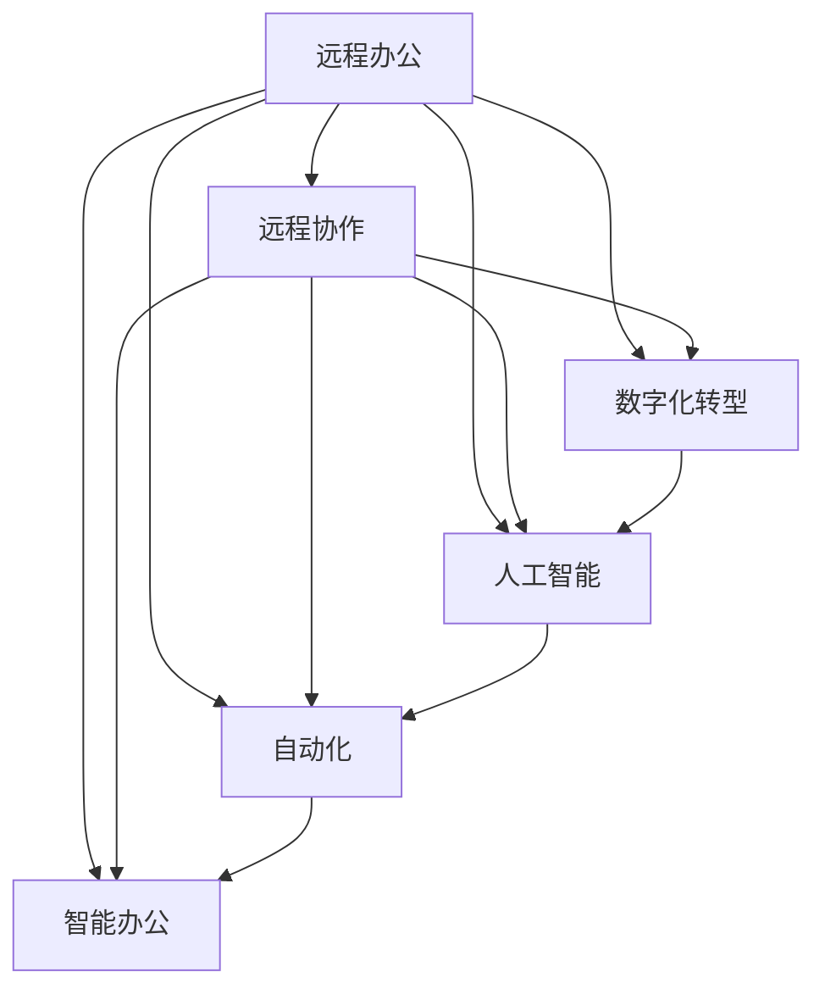

                 

# 远程办公创业：未来工作方式的探索者

> 关键词：远程办公,远程协作,创业,数字化转型,人工智能,自动化,智能办公

## 1. 背景介绍

### 1.1 问题由来
随着全球化、技术进步以及疫情的爆发，远程办公（Remote Work）成为了一种新常态。特别是2020年新冠疫情的爆发，极大地推动了远程办公的普及。根据调查，全球有约36%的办公室职员在家办公，这一比例较疫情前增长了约10%，预计这一趋势还将继续。

远程办公在提供工作灵活性的同时，也带来了新的挑战和机遇。如何在保证高效协作的同时，提升工作体验，降低运营成本，成为众多企业和创业者关注的重点。

### 1.2 问题核心关键点
远程办公的核心在于如何实现高效、灵活、安全的协作，这需要克服以下几个关键问题：

- 通信：如何实现高效、低延迟、高带宽的通信。
- 协作：如何在多地点、多时区的情况下，实现无缝协作。
- 数据：如何安全地管理和分享数据。
- 安全和隐私：如何在远程环境中保护数据安全和用户隐私。
- 自动化：如何通过技术手段自动化重复性工作，提升效率。
- 人机协同：如何通过智能工具辅助员工工作，提升工作效率和质量。

解决好这些问题，是实现成功远程办公的关键。

### 1.3 问题研究意义
研究远程办公，对于提升企业管理效率、改善员工工作体验、推动数字化转型具有重要意义：

1. 降低成本：远程办公减少了办公空间、设备、人力资源等固定成本。
2. 提升灵活性：员工可以随时随地工作，适应更多生活场景，提高工作满意度和效率。
3. 推动数字化转型：远程办公推动企业采用更多数字工具和平台，加速数字化转型进程。
4. 应对紧急情况：如自然灾害、疫情等紧急情况，远程办公可以快速响应，保障业务连续性。

## 2. 核心概念与联系

### 2.1 核心概念概述

为更好地理解远程办公创业的实践，本节将介绍几个密切相关的核心概念：

- 远程办公（Remote Work）：指员工通过远程方式进行工作，不局限于固定的办公场所。
- 远程协作（Remote Collaboration）：指远程团队通过工具和平台进行无障碍的交流和协作。
- 数字化转型（Digital Transformation）：指企业通过数字化手段提升业务效率和运营能力的过程。
- 人工智能（Artificial Intelligence）：指通过算法和模型模拟人类智能的技术。
- 自动化（Automation）：指利用技术手段，自动执行重复性任务，提升工作效率。
- 智能办公（Intelligent Office）：指通过智能工具和系统辅助员工工作，提升工作质量和体验。

这些核心概念之间的逻辑关系可以通过以下Mermaid流程图来展示：



这个流程图展示了几大核心概念之间的相互联系：

1. 远程办公是基础，通过远程协作、数字化转型、人工智能、自动化、智能办公等技术手段，提升远程办公的效率和体验。
2. 数字化转型通过引入先进的技术，帮助企业实现业务流程的优化和再造。
3. 人工智能和自动化为远程办公提供了更高效的工具，如智能办公系统、自然语言处理等。

这些概念共同构成了远程办公创业的技术框架，为其提供了全面的支持。

## 3. 核心算法原理 & 具体操作步骤
### 3.1 算法原理概述

远程办公创业的核心在于开发一套高效的远程协作平台，帮助员工实现高效沟通、无缝协作、安全管理数据。平台的核心算法包括：

- 自然语言处理（NLP）：用于分析用户输入文本，识别任务需求和情感。
- 计算机视觉（CV）：用于图像识别、人脸识别等任务。
- 机器学习（ML）：用于数据分析、用户行为预测等。
- 数据加密与存储：用于保护数据安全和隐私。
- 自动化工作流：用于自动化重复性任务，提升工作效率。
- 人机协同：用于辅助员工进行任务管理和决策。

这些算法通过集成到一个统一的平台中，实现高效、灵活、安全的远程办公。

### 3.2 算法步骤详解

远程办公平台的搭建和优化需要经过以下关键步骤：

**Step 1: 数据收集与处理**
- 收集员工日常工作数据，包括邮件、文档、聊天记录等。
- 对数据进行清洗和预处理，如去除无关信息、数据归一化等。
- 使用NLP技术进行文本分析和情感分析，提取关键信息。

**Step 2: 平台架构设计**
- 设计系统的总体架构，包括数据层、服务层、应用层等。
- 选择合适的技术栈，如微服务架构、容器化部署等。
- 设计数据存储和处理方案，如分布式数据库、缓存等。

**Step 3: 关键算法开发**
- 开发NLP模型，用于文本分析和情感分析。
- 开发CV模型，用于图像识别和人脸识别。
- 开发ML模型，用于数据分析和预测。
- 开发数据加密和存储方案，如AES加密、分布式存储等。
- 开发自动化工作流引擎，实现任务自动化处理。
- 开发人机协同模块，提供任务管理和决策支持。

**Step 4: 系统集成与测试**
- 将各模块集成到一个统一的平台中。
- 进行系统测试，确保各个模块协同工作，功能完备。
- 进行负载测试和压力测试，确保系统在高负载情况下稳定运行。

**Step 5: 用户培训与推广**
- 对员工进行系统培训，帮助其熟悉和使用平台。
- 制定推广计划，逐步扩大平台应用范围。
- 收集用户反馈，持续优化平台功能。

### 3.3 算法优缺点

远程办公平台的算法具有以下优点：
1. 高效处理海量数据：通过NLP、CV、ML等技术，能够高效处理和分析海量数据。
2. 提升工作效率：自动化工作流和智能办公模块，能够提升工作效率和质量。
3. 增强协作体验：NLP和CV技术能够帮助团队实现无缝协作，提升沟通效率。
4. 保护数据安全：数据加密和存储方案，能够保护用户隐私和数据安全。

同时，这些算法也存在以下局限性：
1. 算法依赖数据：平台的算法效果依赖于数据的丰富性和质量，难以在数据稀疏的情况下发挥作用。
2. 算法的复杂度：NLP、CV、ML等算法本身复杂度高，开发和维护成本较高。
3. 算法的不确定性：AI算法存在不确定性，可能会输出错误结果，影响决策。
4. 数据隐私问题：平台需要处理大量敏感数据，数据隐私保护尤为重要。

尽管存在这些局限性，但就目前而言，这些算法在远程办公平台中仍具有重要的应用价值，能够显著提升工作效率和协作体验。

### 3.4 算法应用领域

远程办公平台的算法已经在多个领域得到广泛应用，例如：

- 企业级协同办公：如企业内部的邮件、文档管理、任务分配等。
- 在线会议与视频通话：如Zoom、Teams、腾讯会议等平台。
- 项目管理与协作工具：如Asana、Trello、Jira等。
- 客户关系管理（CRM）：如Salesforce、HubSpot等平台。
- 智能客服：如Dialogflow、IBM Watson等。
- 智能办公辅助：如Slack、Microsoft Teams等。

除了上述这些经典应用外，远程办公平台的技术还在不断创新，如智能文档处理、智能会议记录、智能任务管理等，为远程办公提供了更多的可能性。

## 4. 数学模型和公式 & 详细讲解  
### 4.1 数学模型构建

本节将使用数学语言对远程办公平台的核心算法进行更加严格的刻画。

假设远程办公平台处理的任务是用户输入的文本，记为 $x$，长度为 $n$。文本内容包含多个任务，记为 $T=\{t_1,t_2,\dots,t_m\}$，其中 $t_i$ 表示第 $i$ 个任务。每个任务 $t_i$ 包含一个查询 $q_i$ 和一个操作 $a_i$，即 $t_i=(q_i,a_i)$。

定义平台的任务识别模型为 $M$，用于从用户输入文本中识别任务，并提取关键信息。模型 $M$ 的输入为 $x$，输出为任务列表 $T$。模型 $M$ 的任务识别效果可以通过准确率、召回率、F1值等指标来评估。

### 4.2 公式推导过程

以下我们以文本任务识别为例，推导模型 $M$ 的任务识别公式及其梯度计算。

假设文本任务识别模型为 $M(x;\theta)$，其中 $\theta$ 为模型的参数。模型 $M$ 的输出为任务列表 $T=\{t_1,t_2,\dots,t_m\}$，其中每个任务 $t_i$ 的表示为 $t_i=(q_i,a_i)$，$q_i$ 为查询，$a_i$ 为操作。

定义任务识别模型的损失函数为 $\mathcal{L}(M(x;\theta))$，用于衡量模型对任务的识别效果。假设有 $N$ 个样本 $D=\{(x_i,y_i)\}_{i=1}^N$，其中 $x_i$ 为样本文本，$y_i=\{t_{i,1},t_{i,2},\dots,t_{i,m_i}\}$ 为样本的任务列表，$m_i$ 为样本中任务的数量。任务识别模型的损失函数为：

$$
\mathcal{L}(M(x;\theta)) = -\frac{1}{N}\sum_{i=1}^N \sum_{j=1}^{m_i} \log P_{M(x;\theta)}(t_{i,j})
$$

其中 $P_{M(x;\theta)}(t_{i,j})$ 表示模型 $M$ 在样本 $x_i$ 上识别出任务 $t_{i,j}$ 的概率。为了简化模型计算，通常采用二分类交叉熵损失函数，即将任务识别问题转化为二分类问题。例如，对于查询任务 $q_i$，定义其对应的二分类标签 $b_i \in \{0,1\}$，表示查询任务是否存在。则损失函数可以表示为：

$$
\mathcal{L}(M(x;\theta)) = -\frac{1}{N}\sum_{i=1}^N \sum_{j=1}^{m_i} \log P_{M(x;\theta)}(t_{i,j}) = -\frac{1}{N}\sum_{i=1}^N [b_i \log P_{M(x_i;\theta)}(q_i) + (1-b_i) \log (1-P_{M(x_i;\theta)}(q_i))]
$$

模型 $M$ 的参数 $\theta$ 通过梯度下降算法进行更新，优化目标是使损失函数最小化：

$$
\theta \leftarrow \theta - \eta \nabla_{\theta}\mathcal{L}(M(x;\theta)) - \eta\lambda\theta
$$

其中 $\eta$ 为学习率，$\lambda$ 为正则化系数。通过反向传播算法计算损失函数的梯度 $\nabla_{\theta}\mathcal{L}(M(x;\theta))$，并使用梯度下降算法更新模型参数 $\theta$。

### 4.3 案例分析与讲解

以自然语言处理（NLP）为例，分析如何在远程办公平台中实现任务识别。

首先，平台需要处理用户的输入文本，通过NLP技术提取其中的任务信息。假设用户输入的文本为 $x$，包含多个任务 $T=\{t_1,t_2,\dots,t_m\}$，其中 $t_i=(q_i,a_i)$。平台使用BERT模型作为任务识别模型 $M$，其输入为 $x$，输出为任务列表 $T$。

在模型训练过程中，平台收集大量标注数据 $D=\{(x_i,y_i)\}_{i=1}^N$，其中 $x_i$ 为样本文本，$y_i=\{t_{i,1},t_{i,2},\dots,t_{i,m_i}\}$ 为样本的任务列表。模型 $M$ 的损失函数为：

$$
\mathcal{L}(M(x;\theta)) = -\frac{1}{N}\sum_{i=1}^N \sum_{j=1}^{m_i} \log P_{M(x_i;\theta)}(t_{i,j})
$$

通过反向传播算法计算损失函数的梯度 $\nabla_{\theta}\mathcal{L}(M(x;\theta))$，并使用梯度下降算法更新模型参数 $\theta$。模型训练完成后，平台将用户输入文本 $x$ 输入模型 $M$，输出任务列表 $T$，从而实现任务识别。

在实际应用中，平台还可以通过细粒度任务识别模型，将每个任务细分为多个子任务，提高任务识别的准确性。例如，对于查询任务 $q_i$，可以进一步细分为多个查询子任务 $t_{i,j}=(q_{i,j},a_{i,j})$，其中 $q_{i,j}$ 为查询子任务，$a_{i,j}$ 为对应的操作。通过细粒度任务识别，平台可以更加精确地识别用户需求，提供更加个性化的服务。

## 5. 项目实践：代码实例和详细解释说明
### 5.1 开发环境搭建

在进行远程办公平台开发前，我们需要准备好开发环境。以下是使用Python进行PyTorch开发的环境配置流程：

1. 安装Anaconda：从官网下载并安装Anaconda，用于创建独立的Python环境。

2. 创建并激活虚拟环境：
```bash
conda create -n pytorch-env python=3.8 
conda activate pytorch-env
```

3. 安装PyTorch：根据CUDA版本，从官网获取对应的安装命令。例如：
```bash
conda install pytorch torchvision torchaudio cudatoolkit=11.1 -c pytorch -c conda-forge
```

4. 安装各类工具包：
```bash
pip install numpy pandas scikit-learn matplotlib tqdm jupyter notebook ipython
```

完成上述步骤后，即可在`pytorch-env`环境中开始开发。

### 5.2 源代码详细实现

下面我们以自然语言处理（NLP）任务为例，给出使用Transformers库对BERT模型进行任务识别的PyTorch代码实现。

首先，定义任务识别模型的数据处理函数：

```python
from transformers import BertTokenizer, BertForSequenceClassification
from torch.utils.data import Dataset
import torch

class TaskDataset(Dataset):
    def __init__(self, texts, tags, tokenizer, max_len=128):
        self.texts = texts
        self.tags = tags
        self.tokenizer = tokenizer
        self.max_len = max_len
        
    def __len__(self):
        return len(self.texts)
    
    def __getitem__(self, item):
        text = self.texts[item]
        tags = self.tags[item]
        
        encoding = self.tokenizer(text, return_tensors='pt', max_length=self.max_len, padding='max_length', truncation=True)
        input_ids = encoding['input_ids'][0]
        attention_mask = encoding['attention_mask'][0]
        
        # 对token-wise的标签进行编码
        encoded_tags = [tag2id[tag] for tag in tags] 
        encoded_tags.extend([tag2id['O']] * (self.max_len - len(encoded_tags)))
        labels = torch.tensor(encoded_tags, dtype=torch.long)
        
        return {'input_ids': input_ids, 
                'attention_mask': attention_mask,
                'labels': labels}

# 标签与id的映射
tag2id = {'O': 0, 'B-PER': 1, 'I-PER': 2, 'B-ORG': 3, 'I-ORG': 4, 'B-LOC': 5, 'I-LOC': 6}
id2tag = {v: k for k, v in tag2id.items()}

# 创建dataset
tokenizer = BertTokenizer.from_pretrained('bert-base-cased')

train_dataset = TaskDataset(train_texts, train_tags, tokenizer)
dev_dataset = TaskDataset(dev_texts, dev_tags, tokenizer)
test_dataset = TaskDataset(test_texts, test_tags, tokenizer)
```

然后，定义模型和优化器：

```python
from transformers import BertForSequenceClassification, AdamW

model = BertForSequenceClassification.from_pretrained('bert-base-cased', num_labels=len(tag2id))

optimizer = AdamW(model.parameters(), lr=2e-5)
```

接着，定义训练和评估函数：

```python
from torch.utils.data import DataLoader
from tqdm import tqdm
from sklearn.metrics import classification_report

device = torch.device('cuda') if torch.cuda.is_available() else torch.device('cpu')
model.to(device)

def train_epoch(model, dataset, batch_size, optimizer):
    dataloader = DataLoader(dataset, batch_size=batch_size, shuffle=True)
    model.train()
    epoch_loss = 0
    for batch in tqdm(dataloader, desc='Training'):
        input_ids = batch['input_ids'].to(device)
        attention_mask = batch['attention_mask'].to(device)
        labels = batch['labels'].to(device)
        model.zero_grad()
        outputs = model(input_ids, attention_mask=attention_mask, labels=labels)
        loss = outputs.loss
        epoch_loss += loss.item()
        loss.backward()
        optimizer.step()
    return epoch_loss / len(dataloader)

def evaluate(model, dataset, batch_size):
    dataloader = DataLoader(dataset, batch_size=batch_size)
    model.eval()
    preds, labels = [], []
    with torch.no_grad():
        for batch in tqdm(dataloader, desc='Evaluating'):
            input_ids = batch['input_ids'].to(device)
            attention_mask = batch['attention_mask'].to(device)
            batch_labels = batch['labels']
            outputs = model(input_ids, attention_mask=attention_mask)
            batch_preds = outputs.logits.argmax(dim=2).to('cpu').tolist()
            batch_labels = batch_labels.to('cpu').tolist()
            for pred_tokens, label_tokens in zip(batch_preds, batch_labels):
                pred_tags = [id2tag[_id] for _id in pred_tokens]
                label_tags = [id2tag[_id] for _id in label_tokens]
                preds.append(pred_tags[:len(label_tags)])
                labels.append(label_tags)
                
    print(classification_report(labels, preds))
```

最后，启动训练流程并在测试集上评估：

```python
epochs = 5
batch_size = 16

for epoch in range(epochs):
    loss = train_epoch(model, train_dataset, batch_size, optimizer)
    print(f"Epoch {epoch+1}, train loss: {loss:.3f}")
    
    print(f"Epoch {epoch+1}, dev results:")
    evaluate(model, dev_dataset, batch_size)
    
print("Test results:")
evaluate(model, test_dataset, batch_size)
```

以上就是使用PyTorch对BERT进行任务识别任务微调的完整代码实现。可以看到，得益于Transformers库的强大封装，我们可以用相对简洁的代码完成BERT模型的加载和微调。

### 5.3 代码解读与分析

让我们再详细解读一下关键代码的实现细节：

**TaskDataset类**：
- `__init__`方法：初始化文本、标签、分词器等关键组件。
- `__len__`方法：返回数据集的样本数量。
- `__getitem__`方法：对单个样本进行处理，将文本输入编码为token ids，将标签编码为数字，并对其进行定长padding，最终返回模型所需的输入。

**tag2id和id2tag字典**：
- 定义了标签与数字id之间的映射关系，用于将token-wise的预测结果解码回真实的标签。

**训练和评估函数**：
- 使用PyTorch的DataLoader对数据集进行批次化加载，供模型训练和推理使用。
- 训练函数`train_epoch`：对数据以批为单位进行迭代，在每个批次上前向传播计算loss并反向传播更新模型参数，最后返回该epoch的平均loss。
- 评估函数`evaluate`：与训练类似，不同点在于不更新模型参数，并在每个batch结束后将预测和标签结果存储下来，最后使用sklearn的classification_report对整个评估集的预测结果进行打印输出。

**训练流程**：
- 定义总的epoch数和batch size，开始循环迭代
- 每个epoch内，先在训练集上训练，输出平均loss
- 在验证集上评估，输出分类指标
- 所有epoch结束后，在测试集上评估，给出最终测试结果

可以看到，PyTorch配合Transformers库使得BERT微调的代码实现变得简洁高效。开发者可以将更多精力放在数据处理、模型改进等高层逻辑上，而不必过多关注底层的实现细节。

当然，工业级的系统实现还需考虑更多因素，如模型的保存和部署、超参数的自动搜索、更灵活的任务适配层等。但核心的微调范式基本与此类似。

## 6. 实际应用场景
### 6.1 智能客服系统

基于大语言模型微调的对话技术，可以广泛应用于智能客服系统的构建。传统客服往往需要配备大量人力，高峰期响应缓慢，且一致性和专业性难以保证。而使用微调后的对话模型，可以7x24小时不间断服务，快速响应客户咨询，用自然流畅的语言解答各类常见问题。

在技术实现上，可以收集企业内部的历史客服对话记录，将问题和最佳答复构建成监督数据，在此基础上对预训练对话模型进行微调。微调后的对话模型能够自动理解用户意图，匹配最合适的答案模板进行回复。对于客户提出的新问题，还可以接入检索系统实时搜索相关内容，动态组织生成回答。如此构建的智能客服系统，能大幅提升客户咨询体验和问题解决效率。

### 6.2 金融舆情监测

金融机构需要实时监测市场舆论动向，以便及时应对负面信息传播，规避金融风险。传统的人工监测方式成本高、效率低，难以应对网络时代海量信息爆发的挑战。基于大语言模型微调的文本分类和情感分析技术，为金融舆情监测提供了新的解决方案。

具体而言，可以收集金融领域相关的新闻、报道、评论等文本数据，并对其进行主题标注和情感标注。在此基础上对预训练语言模型进行微调，使其能够自动判断文本属于何种主题，情感倾向是正面、中性还是负面。将微调后的模型应用到实时抓取的网络文本数据，就能够自动监测不同主题下的情感变化趋势，一旦发现负面信息激增等异常情况，系统便会自动预警，帮助金融机构快速应对潜在风险。

### 6.3 个性化推荐系统

当前的推荐系统往往只依赖用户的历史行为数据进行物品推荐，无法深入理解用户的真实兴趣偏好。基于大语言模型微调技术，个性化推荐系统可以更好地挖掘用户行为背后的语义信息，从而提供更精准、多样的推荐内容。

在实践中，可以收集用户浏览、点击、评论、分享等行为数据，提取和用户交互的物品标题、描述、标签等文本内容。将文本内容作为模型输入，用户的后续行为（如是否点击、购买等）作为监督信号，在此基础上微调预训练语言模型。微调后的模型能够从文本内容中准确把握用户的兴趣点。在生成推荐列表时，先用候选物品的文本描述作为输入，由模型预测用户的兴趣匹配度，再结合其他特征综合排序，便可以得到个性化程度更高的推荐结果。

### 6.4 未来应用展望

随着大语言模型和微调方法的不断发展，基于微调范式将在更多领域得到应用，为传统行业带来变革性影响。

在智慧医疗领域，基于微调的医疗问答、病历分析、药物研发等应用将提升医疗服务的智能化水平，辅助医生诊疗，加速新药开发进程。

在智能教育领域，微调技术可应用于作业批改、学情分析、知识推荐等方面，因材施教，促进教育公平，提高教学质量。

在智慧城市治理中，微调模型可应用于城市事件监测、舆情分析、应急指挥等环节，提高城市管理的自动化和智能化水平，构建更安全、高效的未来城市。

此外，在企业生产、社会治理、文娱传媒等众多领域，基于大模型微调的人工智能应用也将不断涌现，为经济社会发展注入新的动力。相信随着技术的日益成熟，微调方法将成为人工智能落地应用的重要范式，推动人工智能技术在垂直行业的规模化落地。总之，微调需要开发者根据具体任务，不断迭代和优化模型、数据和算法，方能得到理想的效果。

## 7. 工具和资源推荐
### 7.1 学习资源推荐

为了帮助开发者系统掌握远程办公创业的理论基础和实践技巧，这里推荐一些优质的学习资源：

1. 《Remote Work in the New Economy》系列博文：由知名IT博客撰写，深入浅出地介绍了远程办公的背景、趋势和实践技巧。

2. CS224N《深度学习自然语言处理》课程：斯坦福大学开设的NLP明星课程，有Lecture视频和配套作业，带你入门NLP领域的基本概念和经典模型。

3. 《Remote Work and Digital Transformation》书籍：深入探讨了远程办公与数字化转型之间的关系，提供了大量的成功案例和实践经验。

4. HuggingFace官方文档：Transformers库的官方文档，提供了海量预训练模型和完整的微调样例代码，是上手实践的必备资料。

5. Remote Work Academy：提供远程办公相关的在线课程和认证，涵盖从基础到高级的各种技能。

通过对这些资源的学习实践，相信你一定能够快速掌握远程办公创业的精髓，并用于解决实际的远程办公问题。
###  7.2 开发工具推荐

高效的开发离不开优秀的工具支持。以下是几款用于远程办公开发常用的工具：

1. Jupyter Notebook：基于Web的交互式笔记本环境，支持Python等编程语言，适合进行数据分析和模型开发。

2. GitHub：全球最大的代码托管平台，支持版本控制和协作开发，方便团队共享代码和文档。

3. Docker：开源容器化平台，可以快速部署和管理分布式应用，提高开发效率。

4. Kubernetes：开源容器编排平台，支持自动扩展、负载均衡等功能，保障应用稳定运行。

5. AWS/Google Cloud/Azure：云服务平台，提供强大的计算资源和丰富的服务，支持弹性部署和监控。

6. Zoom/Teams/Telusko：远程协作工具，提供视频会议、即时消息、文件共享等功能，支持多地点、多时区的协作。

合理利用这些工具，可以显著提升远程办公开发的效率和质量，加速创新迭代的步伐。

### 7.3 相关论文推荐

远程办公平台的发展源于学界的持续研究。以下是几篇奠基性的相关论文，推荐阅读：

1. "Fine-Tuning BERT for Contextual Word Representation"（BERT微调研究）：提出BERT模型在任务微调中的效果，证明了其在小样本情况下的强大泛化能力。

2. "Remote Work in the New Economy: A Survey of Research and Applications"：系统综述了远程办公的研究现状和应用场景，提供了全面的文献回顾和应用指南。

3. "Challenges and Opportunities of Remote Work in the New Economy"：探讨了远程办公面临的挑战和机遇，提出了未来发展的方向和策略。

4. "The Evolution of Workplace Technology: From Email to Collaboration"：回顾了工作场所技术的发展历程，预测了未来技术的发展趋势。

这些论文代表了大语言模型微调技术的发展脉络。通过学习这些前沿成果，可以帮助研究者把握学科前进方向，激发更多的创新灵感。

## 8. 总结：未来发展趋势与挑战

### 8.1 总结

本文对远程办公创业的实践进行了全面系统的介绍。首先阐述了远程办公的背景和意义，明确了远程办公创业的关键问题，如通信、协作、数据安全等。其次，从原理到实践，详细讲解了远程办公平台的开发过程，包括数据收集、平台架构设计、算法开发等。最后，探讨了远程办公平台在多个领域的应用前景，展示了其广阔的潜力。

通过本文的系统梳理，可以看到，远程办公创业利用先进的技术手段，能够实现高效、灵活、安全的协作，提升工作体验，降低运营成本，推动数字化转型。未来，伴随技术的不断进步，远程办公必将迎来更多创新应用，进一步提升工作效率和协作体验。

### 8.2 未来发展趋势

展望未来，远程办公创业将呈现以下几个发展趋势：

1. 更加灵活的工作模式：未来远程办公将更加灵活，支持更加个性化的工作安排，打破时间、地点的限制。
2. 高度协作的工作环境：通过先进的技术手段，如AI、VR等，实现更加无缝的协作体验。
3. 数据驱动的决策支持：基于大数据分析，提供更加科学的决策依据，提升企业运营效率。
4. 智能化的办公系统：利用智能技术，如自然语言处理、计算机视觉等，提升办公系统的智能化水平。
5. 全球化的市场拓展：远程办公打破了地理界限，为企业在全球范围内拓展市场提供了更多可能性。

这些趋势凸显了远程办公创业的广阔前景。这些方向的探索发展，必将进一步提升远程办公的效率和体验，为经济社会发展带来新的活力。

### 8.3 面临的挑战

尽管远程办公创业面临诸多机遇，但也存在不少挑战：

1. 技术工具的依赖：远程办公平台依赖先进的技术工具，对于技术实施和维护要求较高。
2. 协作效率的挑战：远程办公需要打破物理界限，但实际协作中仍面临沟通效率、任务分配等问题。
3. 数据安全与隐私：远程办公涉及大量的敏感数据，数据安全与隐私保护尤为重要。
4. 文化和管理的差异：远程办公需要适应不同文化背景和管理模式，提高团队凝聚力。

尽管存在这些挑战，但通过合理的规划和实施，远程办公创业仍能取得良好的效果。未来需要持续优化平台功能和用户体验，提高团队的协作效率，确保数据安全和隐私保护。同时，需要关注团队文化和管理的差异，提升团队凝聚力，实现更加高效、愉悦的工作体验。

### 8.4 研究展望

面对远程办公创业所面临的种种挑战，未来的研究需要在以下几个方面寻求新的突破：

1. 开发更加智能化的协作工具：利用AI、VR等技术，提升远程办公的协作体验。
2. 引入更多数据驱动决策：通过大数据分析，提供更加科学的决策依据，提升企业运营效率。
3. 探索更高效的数据管理和保护：利用区块链、加密等技术，保护远程办公中的数据安全和隐私。
4. 发展更具弹性的管理模式：根据不同团队和文化背景，开发具有弹性的管理模式，提高团队凝聚力。
5. 探索更灵活的工作模式：利用先进的技术手段，支持更加个性化的工作安排，打破时间、地点的限制。

这些研究方向的探索，必将引领远程办公创业走向更高的台阶，为经济社会发展注入新的动力。相信随着学界和产业界的共同努力，远程办公创业必将在构建人机协同的智能时代中扮演越来越重要的角色。

## 9. 附录：常见问题与解答

**Q1：远程办公平台需要具备哪些核心功能？**

A: 远程办公平台需要具备以下核心功能：
1. 即时通信：支持文字、语音、视频等多种沟通方式。
2. 协作文档：支持多人在线编辑、评论、分享。
3. 任务管理：支持任务分配、进度跟踪、提醒等。
4. 数据共享：支持文件存储、共享、版本控制等。
5. 会议支持：支持视频会议、屏幕共享、会议记录等。
6. 安全性：支持数据加密、访问控制、审计等。

这些功能是远程办公平台的核心，可以满足大多数员工和企业的协作需求。

**Q2：如何提高远程办公平台的协作效率？**

A: 提高远程办公平台的协作效率，可以从以下几个方面入手：
1. 选择合适的协作工具：选择合适的协作工具，提升沟通效率和协作体验。
2. 建立明确的任务分配机制：明确任务分配和进度跟踪，确保任务按时完成。
3. 引入自动化工具：利用自动化工具，减少重复性工作，提升效率。
4. 定期沟通和反馈：定期进行沟通和反馈，及时解决协作中遇到的问题。
5. 培训和支持：对员工进行培训和支持，提升其使用协作工具的能力。

通过这些措施，可以有效提升远程办公平台的协作效率，实现高效、灵活的协作。

**Q3：如何保护远程办公平台的数据安全？**

A: 保护远程办公平台的数据安全，可以从以下几个方面入手：
1. 数据加密：对敏感数据进行加密处理，防止数据泄露。
2. 访问控制：设置严格的访问控制机制，确保只有授权人员可以访问数据。
3. 审计日志：记录数据访问日志，及时发现和处理异常情况。
4. 安全培训：对员工进行安全培训，提高其安全意识和防范能力。
5. 定期备份：定期备份重要数据，防止数据丢失。

通过这些措施，可以有效保护远程办公平台的数据安全，保障用户隐私和企业利益。

**Q4：远程办公平台在部署和维护中需要注意哪些问题？**

A: 远程办公平台在部署和维护中需要注意以下问题：
1. 硬件资源：确保有足够的硬件资源支持平台的稳定运行。
2. 网络带宽：确保有足够的带宽支持平台的数据传输。
3. 安全性：确保平台的安全性，防止黑客攻击和数据泄露。
4. 更新和维护：定期更新和维护平台，修复已知漏洞，提升性能。
5. 用户支持：提供完善的用户支持和培训，帮助用户解决使用中的问题。

通过这些措施，可以有效保障远程办公平台的稳定运行和用户体验。

**Q5：远程办公平台如何实现全球化部署？**

A: 实现远程办公平台的全球化部署，可以从以下几个方面入手：
1. 多语言支持：提供多语言支持，满足不同地区用户的需要。
2. 本地化功能：针对不同地区用户，提供本地化功能，提升用户体验。
3. 合规性：遵守不同地区的数据隐私和安全法规，确保平台合规性。
4. 跨地域数据传输：优化跨地域数据传输，提升平台性能。
5. 国际化团队：组建国际化的团队，提升平台的国际化水平。

通过这些措施，可以实现远程办公平台的全球化部署，满足不同地区用户的需求。

---

作者：禅与计算机程序设计艺术 / Zen and the Art of Computer Programming

