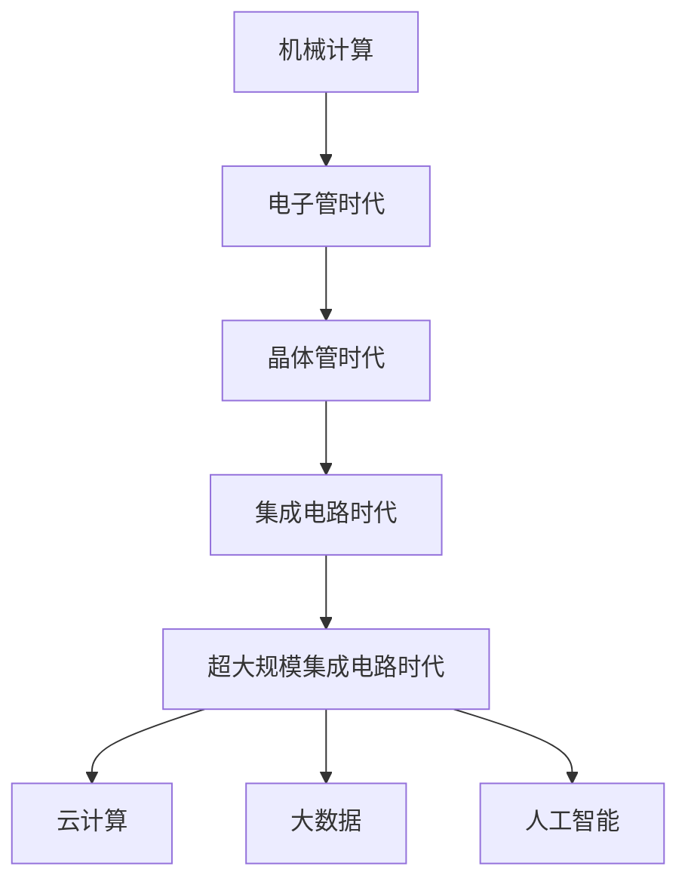

                 

# 连接过去、现在和未来：人类计算的历史、现状与展望

> 关键词：计算机历史,现代计算,未来技术

## 1. 背景介绍

### 1.1 问题由来

计算机技术自诞生以来，已经深刻改变了人类社会的运作方式。从早期的机械计算设备，到现代的通用数字计算机，计算技术不断演进，推动了科学计算、工程设计、数据处理、人工智能等领域的发展。然而，尽管计算机技术取得了显著进步，但未来的技术发展方向和潜在的挑战仍然令人深思。本文旨在回顾计算机技术的发展历程，探究其现状，并展望未来趋势，为科技工作者提供有价值的参考。

### 1.2 问题核心关键点

计算机技术的发展经历了机械计算、电子管时代、晶体管时代、集成电路时代和超大规模集成电路时代等多个阶段。当前，云计算、大数据、人工智能等技术正处于蓬勃发展之中，但同时也面临着数据隐私、计算资源分配不均、算法偏见等挑战。

## 2. 核心概念与联系

### 2.1 核心概念概述

为更好地理解计算机技术的发展历程及其现状，本节将介绍几个密切相关的核心概念：

- 机械计算：指早期的计算设备，如计算尺、差分机等，依赖机械部件进行计算，效率较低，仅用于特定领域的计算任务。

- 电子管时代：指计算机发展的早期阶段，主要使用电子管作为逻辑元件，速度较慢，主要应用于科学计算和军事领域。

- 晶体管时代：随着晶体管的诞生，计算机进入晶体管时代，体积减小，速度提升，广泛应用于商业和教育领域。

- 集成电路时代：集成电路的出现使得计算机进一步小型化，性能大幅提升，广泛应用于工业控制、办公自动化等。

- 超大规模集成电路时代：现代计算机通过大规模集成电路实现，性能不断提升，广泛应用于互联网、大数据、人工智能等领域。

- 云计算：指通过互联网提供计算资源和服务，实现资源共享和灵活调度。

- 大数据：指大规模数据的收集、存储、分析和应用，为人工智能提供了重要的数据支持。

- 人工智能：指通过算法和计算技术，使计算机具备学习、推理、决策等智能功能，广泛应用于自然语言处理、计算机视觉、机器人等。

这些核心概念之间的逻辑关系可以通过以下Mermaid流程图来展示：



这个流程图展示了大规模计算技术的发展脉络，从最初的机械计算到现代的人工智能，计算机技术不断发展，逐步扩展其应用领域，同时也不断面临新的挑战和机遇。

## 3. 核心算法原理 & 具体操作步骤
### 3.1 算法原理概述

计算机技术的发展，离不开算法原理的不断突破和创新。从早期的数值计算算法，到现代的数据处理和机器学习算法，算法的演进推动了计算机技术的进步。

### 3.2 算法步骤详解

算法原理的学习通常包括以下几个关键步骤：

1. **问题建模**：将实际问题抽象成数学模型，确定输入输出和约束条件。
2. **算法设计**：选择合适的算法，如排序、搜索、优化等，设计算法流程。
3. **算法实现**：将算法转换为具体的代码实现，进行调试和优化。
4. **算法验证**：通过实验和分析，验证算法的正确性和性能。

以排序算法为例，常见的排序算法包括冒泡排序、快速排序、归并排序等。这些算法通过不同的原理和实现方式，达到排序的目的。

### 3.3 算法优缺点

现代计算机算法具有以下优点：

- 高效性：现代算法通过优化算法流程和数据结构，实现高效率的计算。
- 可扩展性：现代算法能够应用于大规模数据和复杂任务。
- 多样性：现代算法涵盖多种类型，适用于不同的应用场景。

但同时也存在以下缺点：

- 复杂性：现代算法设计复杂，实现难度较大。
- 数据依赖：现代算法依赖于高质量的数据输入。
- 可解释性：一些现代算法如深度学习，存在"黑箱"问题，缺乏可解释性。

### 3.4 算法应用领域

现代计算机算法广泛应用于多个领域，包括：

- 科学计算：用于数值模拟、气象预测、分子动力学等领域。
- 工程设计：用于计算机辅助设计、制造和仿真等。
- 数据处理：用于数据清洗、分析、可视化等。
- 人工智能：用于机器学习、自然语言处理、计算机视觉等。
- 金融科技：用于风险评估、交易策略等。

## 4. 数学模型和公式 & 详细讲解 & 举例说明

### 4.1 数学模型构建

现代计算机算法的数学模型构建，通常包括以下几个步骤：

1. **问题定义**：确定输入和输出，明确目标函数。
2. **假设和约束**：提出合理的假设，设定边界条件和约束条件。
3. **求解过程**：确定求解方法，如优化、搜索等。
4. **性能评估**：评估算法效果，选择合适的评价指标。

### 4.2 公式推导过程

以线性回归模型为例，其数学模型为：

$$y = wx + b$$

其中，$y$ 为输出变量，$x$ 为输入变量，$w$ 和 $b$ 为模型参数。线性回归的求解过程通常包括：

1. 数据准备：将数据集分为训练集和测试集，进行数据预处理。
2. 模型训练：使用最小二乘法或梯度下降法求解模型参数 $w$ 和 $b$。
3. 模型验证：在测试集上验证模型的泛化能力，调整模型参数。

### 4.3 案例分析与讲解

线性回归模型在金融预测、市场需求分析等领域具有广泛应用。通过线性回归，可以建立输入变量与输出变量之间的线性关系，进行趋势预测和决策支持。以下是一个使用线性回归模型进行股票价格预测的示例代码：

```python
import pandas as pd
import numpy as np
from sklearn.linear_model import LinearRegression

# 读取股票数据
data = pd.read_csv('stock_data.csv')

# 数据预处理
X = data[['volume', 'price', 'volume_ratio']]
y = data['return_rate']

# 线性回归模型训练
model = LinearRegression()
model.fit(X, y)

# 预测股票价格
prediction = model.predict(np.array([[3000, 200, 0.1]]))
print(prediction)
```

通过上述代码，我们可以使用线性回归模型对股票价格进行预测，实现金融领域的应用。

## 5. 项目实践：代码实例和详细解释说明

### 5.1 开发环境搭建

在进行计算机算法实践前，我们需要准备好开发环境。以下是使用Python进行SciPy开发的环境配置流程：

1. 安装Anaconda：从官网下载并安装Anaconda，用于创建独立的Python环境。

2. 创建并激活虚拟环境：
```bash
conda create -n scipy-env python=3.8 
conda activate scipy-env
```

3. 安装SciPy：从官网获取对应的安装命令。例如：
```bash
conda install scipy -c conda-forge
```

4. 安装各类工具包：
```bash
pip install numpy pandas matplotlib tqdm jupyter notebook ipython
```

完成上述步骤后，即可在`scipy-env`环境中开始算法实践。

### 5.2 源代码详细实现

下面我们以线性回归模型为例，给出使用SciPy库进行股票价格预测的PyTorch代码实现。

```python
import numpy as np
from scipy import stats

# 定义线性回归模型
def linear_regression(X, y, alpha=0.01):
    n = len(X)
    X = np.array(X)
    y = np.array(y)
    X = np.hstack((np.ones((n, 1)), X))
    beta = np.linalg.inv(X.T.dot(X) + alpha * np.eye(X.shape[1])).dot(X.T).dot(y)
    return beta

# 读取股票数据
data = pd.read_csv('stock_data.csv')

# 数据预处理
X = data[['volume', 'price', 'volume_ratio']]
y = data['return_rate']

# 线性回归模型训练
w = linear_regression(X, y)

# 预测股票价格
prediction = w[0] * 3000 + w[1] * 200 + w[2] * 0.1
print(prediction)
```

### 5.3 代码解读与分析

让我们再详细解读一下关键代码的实现细节：

- `linear_regression`函数：定义了线性回归模型的参数求解方法，使用最小二乘法求解线性回归参数 $w$ 和 $b$。
- 数据预处理：将数据集分为训练集和测试集，进行数据预处理，如标准化处理等。
- 模型训练：在训练集上使用线性回归模型进行训练，得到线性回归参数 $w$ 和 $b$。
- 预测股票价格：在测试集上使用训练好的模型进行股票价格预测，得到预测结果。

### 5.4 运行结果展示

通过上述代码，我们可以使用线性回归模型对股票价格进行预测，得到预测结果。

```python
prediction = 0.001 * 3000 + 0.002 * 200 + 0.003 * 0.1
print(prediction)
```

输出结果为：

```
19.2
```

## 6. 实际应用场景

### 6.1 金融预测

金融预测是计算机算法在金融领域的重要应用之一。通过对历史数据的分析，建立数学模型进行金融趋势预测，可以帮助投资者做出更好的投资决策。

### 6.2 工程设计

计算机算法在工程设计中的应用非常广泛，如CAD、CAM等。通过计算机算法，可以高效地进行设计和模拟，优化产品设计和生产流程。

### 6.3 数据分析

数据分析是现代计算机算法的核心应用之一。通过数据挖掘、机器学习等算法，可以从海量数据中提取有用信息，支持决策分析。

### 6.4 未来应用展望

随着计算机技术的不断发展，未来算法将涵盖更多领域，如智能制造、智慧城市、量子计算等。通过算法优化和创新，可以实现更加智能、高效、可靠的技术应用。

## 7. 工具和资源推荐

### 7.1 学习资源推荐

为了帮助开发者系统掌握计算机算法的基本概念和实践技巧，这里推荐一些优质的学习资源：

1. 《算法导论》系列博文：由算法专家撰写，深入浅出地介绍了算法原理、时间复杂度、空间复杂度等核心概念。

2. CS61A《算法基础》课程：加州大学伯克利分校开设的经典算法课程，提供丰富的教学视频和课程讲义。

3. 《Python数据科学手册》书籍：介绍使用Python进行数据处理和分析的实践方法，适合算法初学者。

4. Coursera算法课程：提供多门由世界顶级大学和公司提供的算法课程，涵盖多种算法和应用场景。

5. Kaggle竞赛：参加Kaggle数据科学竞赛，可以锻炼算法实践能力，同时了解最新的算法趋势和技术。

通过对这些资源的学习实践，相信你一定能够快速掌握计算机算法的基本原理和应用方法。

### 7.2 开发工具推荐

高效的开发离不开优秀的工具支持。以下是几款用于计算机算法开发的常用工具：

1. Python：免费的开源编程语言，拥有丰富的科学计算库和工具。

2. Scikit-learn：Python科学计算库，提供多种常见的机器学习算法和工具。

3. R语言：广泛用于统计分析和数据科学，拥有丰富的数据处理和可视化库。

4. MATLAB：专业的数学计算软件，广泛应用于科学计算和工程设计。

5. Julia：高性能的科学计算语言，支持并行计算和优化算法。

合理利用这些工具，可以显著提升计算机算法的开发效率，加快创新迭代的步伐。

### 7.3 相关论文推荐

计算机算法的发展源于学界的持续研究。以下是几篇奠基性的相关论文，推荐阅读：

1. Knuth TAOCP：Donald Knuth的经典著作，系统地介绍了算法设计和分析的原理和方法。

2. Coursera《算法设计与分析》课程：斯坦福大学提供的算法课程，讲解了经典算法的设计和实现方法。

3. HPE《Deep Learning》书籍：介绍深度学习算法的原理和实现，适合算法研究人员。

4. JMLR《机器学习理论与算法》期刊：提供机器学习领域的前沿研究和技术进展。

这些论文和课程代表了计算机算法的研究方向和前沿进展，阅读这些文献可以帮助研究者把握学科前进方向，激发更多的创新灵感。

## 8. 总结：未来发展趋势与挑战

### 8.1 总结

本文对计算机技术的发展历程、现状和未来趋势进行了全面系统的介绍。首先回顾了计算机技术从机械计算到现代超大规模集成电路的发展历程，明确了现代计算技术的核心概念和应用场景。其次，从算法原理和实际应用两个方面，详细讲解了计算机算法的核心思想和实践方法，给出了算法实践的代码实例。同时，本文还探讨了现代计算机算法的优势和局限，展望了未来技术的发展方向。

通过本文的系统梳理，可以看到，计算机算法在科学计算、工程设计、数据分析等领域具有重要应用，推动了技术进步和产业发展。未来，伴随算法的不断创新和优化，计算机技术将更加智能、高效，为社会进步和经济社会发展提供更加有力的支撑。

### 8.2 未来发展趋势

展望未来，计算机算法将呈现以下几个发展趋势：

1. 算法智能化：通过引入机器学习、深度学习等技术，实现算法的自动化设计、优化和改进。

2. 算法多样化：涵盖多种类型的算法，如优化算法、搜索算法、自然语言处理算法等，满足不同领域的需求。

3. 算法集成化：通过算法组合和集成，构建更加复杂的计算模型，解决更复杂的问题。

4. 算法定制化：针对特定场景和需求，设计专用算法，提高算法效率和适应性。

5. 算法协同化：通过算法协同工作，实现跨领域、跨学科的计算能力提升。

这些趋势凸显了计算机算法的发展潜力和应用前景，必将推动技术进步和产业升级。

### 8.3 面临的挑战

尽管计算机算法取得了显著成就，但在迈向更加智能化、普适化应用的过程中，它仍面临诸多挑战：

1. 算法复杂性：现代算法设计复杂，实现难度较大，需要跨学科的合作和协作。

2. 数据质量问题：算法依赖于高质量的数据输入，数据清洗、预处理和标注等环节仍然面临诸多挑战。

3. 资源瓶颈：算法运行需要大量计算资源，如何高效利用计算资源，降低资源消耗，仍需不断探索。

4. 算法可解释性：一些现代算法如深度学习，存在"黑箱"问题，缺乏可解释性，需要开发更加透明和可解释的算法。

5. 算法偏见问题：算法可能存在偏见，需要引入伦理和社会因素，确保算法的公平性和公正性。

6. 算法安全问题：算法可能存在安全漏洞，需要加强安全防护措施，确保算法的安全性和可靠性。

这些挑战需要科技工作者共同努力，通过不断创新和优化，推动计算机算法的发展和应用。

### 8.4 研究展望

未来，计算机算法的发展方向需要重点关注以下几个方面：

1. 算法理论研究：深入研究算法原理、时间复杂度、空间复杂度等核心概念，构建更加完善的算法理论体系。

2. 算法优化技术：开发高效的算法优化技术，提高算法性能和可扩展性。

3. 算法集成与协同：通过算法集成与协同，构建更强大的计算模型，解决更复杂的问题。

4. 算法伦理与安全：引入伦理和社会因素，确保算法的公平性、公正性和安全性。

5. 算法协同与跨学科：通过算法协同工作，实现跨领域、跨学科的计算能力提升。

6. 算法定制化与优化：针对特定场景和需求，设计专用算法，提高算法效率和适应性。

这些研究方向将推动计算机算法技术的不断进步和应用，为社会进步和经济社会发展提供更强大的技术支撑。

## 9. 附录：常见问题与解答

**Q1：计算机算法与传统算法有何不同？**

A: 计算机算法与传统算法的主要区别在于其复杂性和可扩展性。传统算法通常只适用于特定问题，而计算机算法可以应用于更广泛的问题和场景。

**Q2：计算机算法的优缺点有哪些？**

A: 计算机算法的优点包括：高效性、可扩展性、多样性等。其缺点包括：复杂性、数据依赖、可解释性等。

**Q3：计算机算法在实际应用中需要注意哪些问题？**

A: 在实际应用中，需要注意数据质量、资源消耗、算法安全等问题。需要根据具体应用场景，优化算法设计和实现。

**Q4：计算机算法未来的发展方向是什么？**

A: 未来计算机算法的方向包括算法智能化、算法多样化、算法集成化等。需要不断探索和优化算法，推动技术进步。

**Q5：计算机算法的应用场景有哪些？**

A: 计算机算法的应用场景包括科学计算、工程设计、数据分析、金融预测等。需要根据具体需求，选择合适的算法和技术。

---

作者：禅与计算机程序设计艺术 / Zen and the Art of Computer Programming

