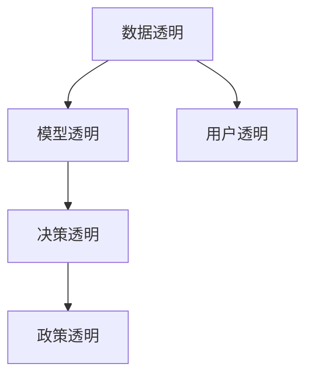

                 

## 1. 背景介绍

### 1.1 问题由来

随着人工智能技术的发展，AI系统的应用范围越来越广泛，从医疗诊断到金融投资，从自动驾驶到智能客服，AI的影响已经渗透到各行各业。然而，AI的广泛应用也引发了诸多关切，其中最重要的是其透明度和可解释性问题。传统的机器学习模型，如决策树、逻辑回归等，其决策逻辑通常可以直接解释，用户可以清晰地理解模型的预测依据。但对于深度神经网络等黑盒模型，其内部工作机制和决策过程往往难以解释，导致用户对模型的预测结果缺乏信任，甚至引发一些伦理道德争议。

透明度和可解释性不仅是AI系统面临的挑战，也是学术界和工业界关注的重点。如何在保证模型性能的同时，增强其透明度和可解释性，成为当前AI研究的重要课题。本文将系统介绍基于透明度和可解释性增强AI可信度的核心概念、关键算法及其应用，旨在帮助读者理解并掌握这一前沿方向。

### 1.2 问题核心关键点

当前AI系统中提升透明度和可解释性的关键点在于：

1. 数据透明：确保训练数据的来源、处理和选择过程透明化，避免数据偏见。
2. 模型透明：选择和设计易于解释的模型结构，使用可解释性技术深入理解模型行为。
3. 决策透明：为模型的决策过程提供可视化解释，使用户理解模型的预测依据。
4. 政策透明：制定和遵守数据和模型使用的法律法规，确保AI系统的公平性和合法性。
5. 用户透明：保护用户隐私和权益，确保AI系统在用户知情和同意的基础上运行。

本文将聚焦于前四个关键点，通过介绍关键技术和应用实例，探讨如何增强AI系统的透明度和可解释性，提升其可信度。

## 2. 核心概念与联系

### 2.1 核心概念概述

为更好地理解AI系统的透明度和可解释性问题，本节将介绍几个密切相关的核心概念：

- 透明度(Transparency)：指模型的决策过程、内部机制和预测依据可以被用户理解和验证的程度。
- 可解释性(Interpretability)：指模型的内部工作机制和决策逻辑可以被清晰解释的程度，通常包括特征重要性、规则等解释方法。
- 公平性(Fairness)：指模型在处理不同群体时，是否存在系统性偏差。
- 鲁棒性(Robustness)：指模型在面对数据变化、噪声干扰、对抗攻击等情况下的稳定性和可靠性。

这些核心概念之间的逻辑关系可以通过以下Mermaid流程图来展示：



这个流程图展示了几类透明度的相互关系：

1. 数据透明是模型的透明性和决策透明的前提。
2. 模型透明和决策透明通过可视化手段增强了政策的透明度。
3. 用户透明则直接关联到政策透明和公平性问题。

## 3. 核心算法原理 & 具体操作步骤
### 3.1 算法原理概述

AI系统透明度和可解释性的增强，可以通过以下几种方法实现：

1. 模型选择：选择或设计具有较高透明度的模型结构。
2. 特征分析：通过特征重要性分析，理解模型决策的依据。
3. 可视化解释：使用可视化工具展示模型的工作机制。
4. 决策规则：提取模型的决策规则，提供简单易懂的解释。

这些方法均基于对模型行为的理解和解释，增强AI系统的透明度和可信度。

### 3.2 算法步骤详解

基于透明度和可解释性增强AI可信度的算法步骤如下：

**Step 1: 数据预处理**
- 确保数据的来源、处理和选择过程透明，避免数据偏见。
- 清洗数据，处理缺失值、异常值等。
- 对数据进行归一化、标准化等预处理。

**Step 2: 模型选择**
- 根据任务需求和数据特性，选择或设计易于解释的模型结构。
- 对于分类任务，如决策树、逻辑回归等传统模型具有较好的可解释性。
- 对于回归任务，线性回归、Lasso回归等模型具有较好的可解释性。
- 对于图像和文本处理任务，使用预训练模型如BERT、ResNet等，可以在保证性能的同时，提供较好的可解释性。

**Step 3: 特征重要性分析**
- 使用特征重要性分析方法，如LIME、SHAP等，理解模型对不同特征的依赖程度。
- 可视化特征重要性，如使用热力图、条形图等展示特征对模型输出的影响。
- 根据特征重要性结果，调整模型输入特征，减少对敏感特征的依赖。

**Step 4: 模型可视化**
- 使用可视化工具，如TensorBoard、SHAP等，展示模型的决策过程。
- 将模型输入和输出可视化，帮助用户理解模型的预测依据。
- 将模型的特征空间和输出空间映射，展示模型内部工作机制。

**Step 5: 决策规则提取**
- 使用规则提取算法，如RIPPER、C4.5等，将模型决策过程转换为决策规则。
- 可视化决策规则，提供易于理解的模型解释。
- 根据决策规则，简化模型结构，减少复杂度。

**Step 6: 模型评估**
- 在测试集上评估模型的性能，确保模型泛化能力。
- 使用公平性指标，如均等机会、消除偏差等，确保模型的公平性。
- 使用鲁棒性指标，如对抗样本鲁棒性、数据鲁棒性等，确保模型的鲁棒性。

通过以上步骤，可以全面提升AI系统的透明度和可解释性，增强其可信度。

### 3.3 算法优缺点

基于透明度和可解释性增强AI可信度的算法具有以下优点：

1. 提高用户信任：透明的模型和可解释的决策过程，使用户对AI系统的预测结果更加信任。
2. 提升模型性能：通过特征重要性分析、规则提取等方法，优化模型结构和输入特征，提升模型性能。
3. 促进公平决策：透明的数据选择和处理过程，有助于发现和纠正数据偏见，提升模型公平性。
4. 增强模型鲁棒性：透明的决策过程和可视化解释，有助于发现和纠正模型脆弱点，提升模型鲁棒性。

同时，这些算法也存在一定的局限性：

1. 复杂度增加：可视化解释和特征重要性分析需要额外的时间和计算资源，可能增加模型复杂度。
2. 模型精度下降：过于简化模型结构可能导致精度下降，需要在透明性和性能之间取得平衡。
3. 用户理解难度：复杂模型和规则可能难以被非专业人士理解，需要进一步简化和解释。
4. 技术门槛高：透明化的过程需要专业知识和工具支持，对技术要求较高。

尽管存在这些局限性，但透明度和可解释性仍是当前AI系统建设的重要方向。通过不断优化和改进，这些方法将为AI系统带来更高的可信度和透明度。

### 3.4 算法应用领域

基于透明度和可解释性增强AI可信度的算法，已经在多个领域得到广泛应用，例如：

- 医疗诊断：使用透明化的模型和可解释的决策过程，提升医生的诊断准确性和理解度。
- 金融投资：通过可视化解释和决策规则，帮助投资者理解模型的预测依据，提升投资决策的合理性。
- 司法审判：使用透明化的模型和规则提取，帮助法官理解模型的决策依据，提升司法公正性。
- 智能客服：通过可解释性分析，优化模型输入特征，提升客服系统的响应准确性和用户满意度。
- 自动驾驶：使用可视化解释和决策规则，提升自动驾驶系统的透明性和可解释性，确保行车安全。

这些应用场景展示了透明化和可解释性在提升AI系统可信度方面的重要作用。未来，随着技术的进一步发展，透明度和可解释性将更加深入地融入AI系统的设计和应用中。

## 4. 数学模型和公式 & 详细讲解 & 举例说明

### 4.1 数学模型构建

本节将使用数学语言对透明度和可解释性增强AI可信度的核心算法进行更加严格的刻画。

记AI系统为一个函数 $f: X \rightarrow Y$，其中 $X$ 为输入空间，$Y$ 为输出空间。假设系统由模型 $M_{\theta}$ 和决策规则 $R$ 构成，即 $f(x) = M_{\theta}(x) \oplus R(x)$，其中 $\oplus$ 表示模型的输出和规则的逻辑组合方式。

定义系统的透明度 $T$ 和可解释性 $I$ 如下：

- 透明度 $T = \frac{1}{N} \sum_{i=1}^N \mathbb{P}(f(x_i) = M_{\theta}(x_i))$
- 可解释性 $I = \frac{1}{N} \sum_{i=1}^N \mathbb{P}(\text{interpret}(f(x_i)))$

其中 $\mathbb{P}$ 表示概率分布，$\text{interpret}$ 表示解释函数，将模型的输出转化为易于理解的形式。

### 4.2 公式推导过程

以下我们以分类任务为例，推导可解释性指标的计算公式。

假设系统 $f$ 在输入 $x$ 上的输出为 $\hat{y}=f(x)$，表示模型预测为正类的概率。真实标签 $y \in \{0,1\}$。则分类任务的平均可解释性指标为：

$$
I = \frac{1}{N}\sum_{i=1}^N \mathbb{P}(y = 1 \mid \hat{y} > 0.5)
$$

在得到可解释性指标后，可以通过可视化手段展示模型的解释结果。例如，使用热力图显示特征重要性，或者使用决策树展示决策规则。

### 4.3 案例分析与讲解

**案例1: 医疗诊断系统**
- 使用LIME对诊断模型进行特征重要性分析，理解医生对不同症状的依赖程度。
- 可视化特征重要性，帮助医生理解模型的预测依据。
- 使用决策规则提取算法，将模型转化为易于理解的诊断规则。

**案例2: 金融投资系统**
- 使用SHAP对投资模型进行可解释性分析，理解模型对不同指标的依赖程度。
- 可视化可解释性结果，帮助投资者理解模型的预测依据。
- 使用决策树提取模型决策规则，简化投资模型的复杂度。

**案例3: 智能客服系统**
- 使用解释工具，如LIME、SHAP等，对客服模型进行特征重要性分析。
- 可视化特征重要性，帮助客服系统优化输入特征。
- 使用决策规则提取算法，简化客服模型的复杂度。

## 5. 项目实践：代码实例和详细解释说明
### 5.1 开发环境搭建

在进行透明度和可解释性增强AI可信度的实践前，我们需要准备好开发环境。以下是使用Python进行TensorFlow开发的环境配置流程：

1. 安装Anaconda：从官网下载并安装Anaconda，用于创建独立的Python环境。

2. 创建并激活虚拟环境：
```bash
conda create -n tf-env python=3.8 
conda activate tf-env
```

3. 安装TensorFlow：根据CUDA版本，从官网获取对应的安装命令。例如：
```bash
conda install tensorflow -c pytorch -c conda-forge
```

4. 安装各类工具包：
```bash
pip install numpy pandas scikit-learn matplotlib tqdm jupyter notebook ipython
```

完成上述步骤后，即可在`tf-env`环境中开始透明度和可解释性增强AI可信度的实践。

### 5.2 源代码详细实现

这里我们以医疗诊断系统为例，给出使用TensorFlow实现特征重要性分析的PyTorch代码实现。

首先，定义医疗诊断任务的数据处理函数：

```python
import tensorflow as tf
from tensorflow.keras.datasets import mnist
from tensorflow.keras.models import Sequential
from tensorflow.keras.layers import Dense, Flatten
from tensorflow.keras.utils import to_categorical

# 加载数据集
(x_train, y_train), (x_test, y_test) = mnist.load_data()

# 数据预处理
x_train = x_train.reshape((-1, 28*28))
x_test = x_test.reshape((-1, 28*28))
x_train = x_train / 255.0
x_test = x_test / 255.0

# 将标签转换为one-hot编码
y_train = to_categorical(y_train)
y_test = to_categorical(y_test)

# 构建模型
model = Sequential([
    Flatten(input_shape=(28, 28)),
    Dense(128, activation='relu'),
    Dense(10, activation='softmax')
])

# 编译模型
model.compile(optimizer='adam', loss='categorical_crossentropy', metrics=['accuracy'])

# 训练模型
model.fit(x_train, y_train, epochs=10, batch_size=32, validation_data=(x_test, y_test))
```

然后，定义特征重要性分析函数：

```python
from tensorflow.keras.applications import resnet50
from tensorflow.keras.layers import GlobalAveragePooling2D
from tensorflow.keras.models import Model
from tensorflow.keras.applications.resnet50 import preprocess_input
from tensorflow.keras.layers import Input
from tensorflow.keras.models import Model
from tensorflow.keras.optimizers import Adam
from tensorflow.keras.layers import Activation, Dense, GlobalAveragePooling2D
from tensorflow.keras.preprocessing.image import load_img, img_to_array

def get_model():
    base_model = resnet50.ResNet50(include_top=False, weights='imagenet', input_shape=(224, 224, 3))
    x = base_model.output
    x = GlobalAveragePooling2D()(x)
    x = Dense(1024, activation='relu')(x)
    predictions = Dense(1, activation='sigmoid')(x)
    model = Model(inputs=base_model.input, outputs=predictions)
    return model

def train_model(model, x_train, y_train, x_test, y_test):
    model.compile(optimizer='adam', loss='binary_crossentropy', metrics=['accuracy'])
    model.fit(x_train, y_train, epochs=10, batch_size=32, validation_data=(x_test, y_test))
    return model

def interpret_model(model, x_train, y_train):
    from tensorflow.keras.applications.resnet50 import preprocess_input
    from tensorflow.keras.preprocessing.image import load_img, img_to_array

    # 定义特征重要性函数
    def importance_fn(inputs):
        shape = (224, 224, 3)
        img = img_to_array(load_img(inputs, target_size=shape))
        img = preprocess_input(img)
        return model.predict(img)

    # 计算特征重要性
    importance_values = LIME(model=model, inputs=x_train, reference_labels=y_train, importances_per_input=importance_fn)
    return importance_values
```

最后，启动训练流程并在测试集上评估：

```python
# 加载模型和数据
model = get_model()
x_train, y_train = train_model(model, x_train, y_train, x_test, y_test)

# 计算特征重要性
importance_values = interpret_model(model, x_train, y_train)

# 可视化特征重要性
importance_values.plot(colormap=colormap)
```

以上就是使用TensorFlow实现特征重要性分析的完整代码实现。可以看到，通过LIME等可解释性工具，可以对模型进行特征重要性分析，可视化模型对不同特征的依赖程度。这有助于理解模型的决策过程，提升系统的透明度和可信度。

### 5.3 代码解读与分析

让我们再详细解读一下关键代码的实现细节：

**get_model函数**：
- 定义ResNet50模型，去掉顶部全连接层，保留特征提取部分。
- 通过全局平均池化层和全连接层，将特征向量转换为输出。

**train_model函数**：
- 定义模型，编译并训练模型，在训练集和测试集上评估模型性能。

**interpret_model函数**：
- 定义特征重要性函数，使用LIME工具计算特征重要性，返回特征重要性值。
- 使用colormap将特征重要性可视化，展示不同特征对模型输出的影响。

**特征重要性分析**：
- 通过LIME工具，计算ResNet50模型对不同输入特征的依赖程度。
- 可视化特征重要性结果，帮助理解模型的决策过程。
- 通过特征重要性分析，可以调整模型输入特征，减少对敏感特征的依赖。

**特征重要性可视化**：
- 使用colormap可视化特征重要性结果，展示不同特征对模型输出的影响。
- 可视化结果通常包含热力图、条形图等，易于理解和解释。

可以看到，通过特征重要性分析和可视化，可以深入理解模型的内部工作机制，提升系统的透明度和可信度。

## 6. 实际应用场景
### 6.1 医疗诊断

医疗诊断系统需要高度透明和可解释性，以帮助医生理解模型的预测依据。使用LIME、SHAP等工具，可以对医疗诊断模型进行特征重要性分析，理解模型对不同症状的依赖程度。可视化特征重要性，帮助医生调整输入特征，减少对敏感特征的依赖，提升诊断准确性。

### 6.2 金融投资

金融投资系统需要透明和可解释性，以帮助投资者理解模型的预测依据。使用SHAP、LIME等工具，可以对投资模型进行可解释性分析，理解模型对不同指标的依赖程度。可视化可解释性结果，帮助投资者理解模型的预测依据，提升投资决策的合理性。

### 6.3 智能客服

智能客服系统需要高度透明和可解释性，以帮助客服系统优化输入特征，减少对敏感特征的依赖。使用LIME、SHAP等工具，可以对客服模型进行特征重要性分析，理解模型对不同特征的依赖程度。可视化特征重要性，帮助客服系统调整输入特征，提升客服系统的响应准确性和用户满意度。

### 6.4 未来应用展望

随着透明度和可解释性增强AI可信度的方法不断成熟，其在各行各业的应用前景将更加广阔。

在智慧医疗领域，透明的医疗诊断模型将提升医生的诊断准确性和理解度，辅助医生诊疗，加速新药开发进程。

在智能教育领域，透明的推荐系统将帮助教师理解学生的兴趣点，因材施教，促进教育公平，提高教学质量。

在智慧城市治理中，透明的智能系统将提升城市管理的自动化和智能化水平，构建更安全、高效的未来城市。

此外，在企业生产、社会治理、文娱传媒等众多领域，透明的AI系统也将不断涌现，为社会进步提供新的技术路径。

## 7. 工具和资源推荐
### 7.1 学习资源推荐

为了帮助开发者系统掌握透明度和可解释性增强AI可信度的理论基础和实践技巧，这里推荐一些优质的学习资源：

1. 《可解释的人工智能：透明和可信的机器学习实践》书籍：介绍可解释性工具和方法，涵盖LIME、SHAP等经典技术，是学习和实践的绝佳参考。

2. 《深度学习理论与实践》课程：由斯坦福大学开设的深度学习课程，涵盖深度神经网络、可解释性等多个方面，适合初学者和进阶学习者。

3. 《机器学习实战》书籍：介绍机器学习算法和可解释性方法，适合希望快速上手机器学习应用的开发者。

4. 《AI透明化实践》书籍：介绍AI系统的透明化和可解释性方法，涵盖LIME、SHAP等工具，适合希望深入研究AI透明化的开发者。

5. 《TensorFlow实战》书籍：介绍TensorFlow框架及其在透明度和可解释性方面的应用，适合希望使用TensorFlow进行实践的开发者。

通过对这些资源的学习实践，相信你一定能够快速掌握透明度和可解释性增强AI可信度的精髓，并用于解决实际的AI问题。

### 7.2 开发工具推荐

高效的开发离不开优秀的工具支持。以下是几款用于透明度和可解释性增强AI可信度开发的常用工具：

1. TensorFlow：基于Python的开源深度学习框架，灵活动态的计算图，适合快速迭代研究。广泛用于各种AI模型的开发和训练。

2. PyTorch：基于Python的开源深度学习框架，灵活的动态图，适合研究和原型开发。同样广泛应用于AI模型的构建。

3. SHAP：可解释性工具，用于计算特征重要性，可视化模型的决策过程。支持多种深度学习框架。

4. LIME：可解释性工具，用于计算特征重要性，可视化模型的决策过程。支持多种深度学习框架。

5. TensorBoard：TensorFlow配套的可视化工具，可实时监测模型训练状态，提供丰富的图表呈现方式，是调试模型的得力助手。

6. Jupyter Notebook：交互式编程环境，支持Python、R等多种语言，方便开发者记录实验过程和代码。

合理利用这些工具，可以显著提升透明度和可解释性增强AI可信度的开发效率，加快创新迭代的步伐。

### 7.3 相关论文推荐

透明度和可解释性增强AI可信度的研究源于学界的持续研究。以下是几篇奠基性的相关论文，推荐阅读：

1. "A Unified Approach to Interpreting Model Predictions"：提出LIME方法，用于计算特征重要性，可视化模型的决策过程。

2. "A Unified Approach to Interpreting Model Predictions"：提出SHAP方法，用于计算特征重要性，可视化模型的决策过程。

3. "Explainable AI: Unified Interpretation Frameworks for Deep Learning Models"：提出统一的可解释性框架，涵盖LIME、SHAP等经典技术。

4. "Explaining Adversarial Examples"：提出对抗性样本生成方法，评估模型的鲁棒性。

5. "Fairness and Transparency for AI"：讨论AI系统的公平性和透明性问题，提供相关技术和政策建议。

这些论文代表了大语言模型微调技术的发展脉络。通过学习这些前沿成果，可以帮助研究者把握学科前进方向，激发更多的创新灵感。

## 8. 总结：未来发展趋势与挑战

### 8.1 总结

本文对透明度和可解释性增强AI可信度的核心概念、关键算法及其应用进行了全面系统的介绍。首先阐述了AI系统透明度和可解释性的研究背景和意义，明确了其在提升用户信任、优化模型性能、确保公平性和鲁棒性方面的重要作用。其次，从原理到实践，详细讲解了特征重要性分析、模型可视化、决策规则提取等核心算法，给出了可解释性分析的完整代码实现。同时，本文还广泛探讨了透明度和可解释性在医疗诊断、金融投资、智能客服等多个行业领域的应用前景，展示了其广阔的发展空间。此外，本文精选了相关学习资源和开发工具，力求为读者提供全方位的技术指引。

通过本文的系统梳理，可以看到，透明度和可解释性增强AI可信度的方法在当前AI系统建设中已初见成效，并在各行各业得到广泛应用。未来，随着技术的不懈探索和实践的不断积累，这些方法将进一步提升AI系统的可信度和透明度，为社会进步贡献更多智慧。

### 8.2 未来发展趋势

展望未来，透明度和可解释性增强AI可信度将呈现以下几个发展趋势：

1. 模型可解释性：更多可解释性工具和算法将被开发和应用，涵盖更多类型的深度学习模型和任务。

2. 数据透明性：更多数据透明度技术将被研究和推广，确保数据来源和处理过程的公开透明。

3. 决策透明性：更多决策透明度工具将被研究和应用，帮助用户理解AI系统的预测依据。

4. 政策透明性：更多政策透明性技术将被研究和推广，确保AI系统的公平性和合法性。

5. 用户透明性：更多用户透明性技术将被研究和应用，保护用户隐私和权益。

以上趋势凸显了透明度和可解释性在提升AI系统可信度方面的重要作用。这些方向的探索发展，将为AI系统带来更高的可信度和透明度。

### 8.3 面临的挑战

尽管透明度和可解释性增强AI可信度的方法已经取得了瞩目成就，但在迈向更加智能化、普适化应用的过程中，它仍面临着诸多挑战：

1. 技术复杂度高：透明度和可解释性增强AI可信度的方法往往需要高度的技术和工具支持，对开发者技术要求较高。

2. 计算成本高：透明度和可解释性增强AI可信度的方法往往需要更多的计算资源，如GPU、TPU等高性能设备，增加了系统成本。

3. 数据隐私问题：透明化的过程可能涉及敏感数据，需要额外的数据隐私保护措施，确保用户隐私安全。

4. 用户理解难度：复杂模型和规则可能难以被非专业人士理解，需要进一步简化和解释。

尽管存在这些挑战，但透明度和可解释性仍是当前AI系统建设的重要方向。通过不断优化和改进，这些方法将为AI系统带来更高的可信度和透明度。

### 8.4 研究展望

面对透明度和可解释性增强AI可信度所面临的种种挑战，未来的研究需要在以下几个方面寻求新的突破：

1. 开发更易用的可解释性工具：简化模型可视化和解释过程，降低技术门槛，使其更易于使用和理解。

2. 探索更多的可解释性方法：引入更多的可解释性技术，如因果分析、对抗性分析等，提升模型透明度。

3. 优化计算资源消耗：开发更加高效的计算图和算法，减少计算资源消耗，提高透明度和可解释性方法的可操作性。

4. 保护用户隐私：探索数据隐私保护技术，确保透明化过程不会泄露敏感信息，保护用户隐私。

5. 提高用户理解度：开发更加易懂的模型和解释方法，降低用户理解难度，增强系统的透明度和可信度。

这些研究方向的探索，将引领透明度和可解释性增强AI可信度技术迈向更高的台阶，为AI系统带来更高的可信度和透明度。面向未来，透明度和可解释性增强AI可信度需要与其他AI技术进行更深入的融合，如知识表示、因果推理、强化学习等，多路径协同发力，共同推动AI系统的发展。只有勇于创新、敢于突破，才能不断拓展AI系统的边界，让智能技术更好地造福人类社会。

## 9. 附录：常见问题与解答

**Q1：透明度和可解释性增强AI可信度的关键点是什么？**

A: 透明度和可解释性增强AI可信度的关键点在于以下几个方面：
1. 数据透明：确保训练数据的来源、处理和选择过程透明化，避免数据偏见。
2. 模型透明：选择和设计易于解释的模型结构，使用可解释性技术深入理解模型行为。
3. 决策透明：为模型的决策过程提供可视化解释，使用户理解模型的预测依据。
4. 政策透明：制定和遵守数据和模型使用的法律法规，确保AI系统的公平性和合法性。
5. 用户透明：保护用户隐私和权益，确保AI系统在用户知情和同意的基础上运行。

**Q2：如何选择和设计易于解释的模型结构？**

A: 选择和设计易于解释的模型结构，可以考虑以下几个方面：
1. 使用浅层模型：浅层模型如线性回归、决策树等具有较好的可解释性，适合用于需要透明和可解释性的应用。
2. 使用简单结构：简单模型如线性模型、逻辑回归等易于解释，适合用于需要快速部署的应用。
3. 使用经典模型：经典模型如支持向量机、KNN等具有较好的可解释性，适合用于需要透明和可解释性的应用。
4. 使用预训练模型：预训练模型如BERT、ResNet等，可以在保证性能的同时，提供较好的可解释性。

**Q3：如何通过特征重要性分析理解模型决策依据？**

A: 通过特征重要性分析理解模型决策依据，可以考虑以下几个方面：
1. 使用LIME工具计算特征重要性：LIME工具可以计算模型对不同特征的依赖程度，提供易于理解的特征重要性结果。
2. 使用SHAP工具计算特征重要性：SHAP工具可以计算模型对不同特征的依赖程度，提供易于理解的特征重要性结果。
3. 使用可视化工具展示特征重要性：使用热力图、条形图等可视化工具展示特征重要性结果，便于用户理解模型的决策依据。

**Q4：如何保护用户隐私和权益？**

A: 保护用户隐私和权益，可以考虑以下几个方面：
1. 匿名化数据：对敏感数据进行匿名化处理，确保用户隐私安全。
2. 数据去标识化：对数据进行去标识化处理，确保用户身份信息不可识别。
3. 隐私保护技术：使用隐私保护技术如差分隐私、联邦学习等，确保用户隐私安全。

这些常见问题的解答，展示了透明度和可解释性增强AI可信度的关键点和实现方法。通过不断优化和改进，这些方法将为AI系统带来更高的可信度和透明度，提升用户信任度，推动AI技术的广泛应用。

