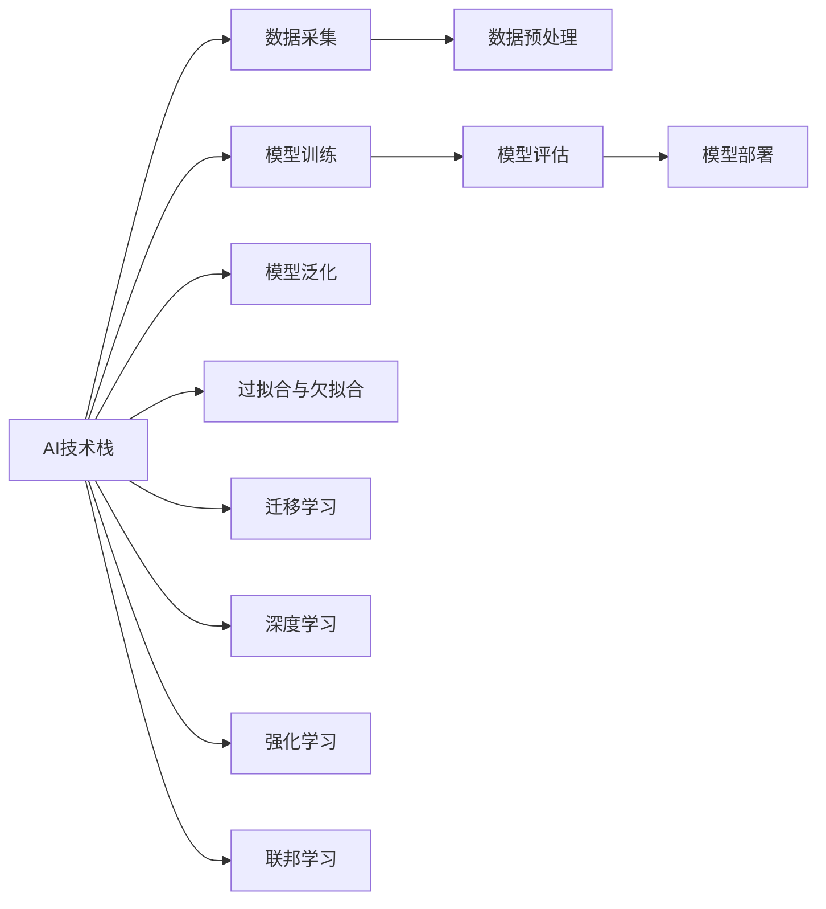

                 

## 1. 背景介绍

### 1.1 问题由来
在人工智能(AI)发展初期，我们认为技术至高无上，能够解决一切问题。但随着技术日益深入，我们逐渐认识到，技术并非万能，而是在不同场景下各有优劣。Lepton AI 提出的技术哲学，即速度与成本的平衡，旨在帮助开发者和用户更好地理解、运用 AI 技术，以最合适的方式达成目标。

### 1.2 问题核心关键点
Lepton AI 的技术哲学主要聚焦于以下几个方面：
- 速度与成本的平衡：在不同应用场景下，如何在速度和成本之间做出选择。
- 适用性与可行性：如何根据具体需求，选择最适合的技术方案。
- 优化与评估：如何在模型训练和应用部署中，进行合理优化，以提升性能。
- 安全与伦理：如何在技术应用中，保障数据安全，符合伦理规范。

## 2. 核心概念与联系

### 2.1 核心概念概述

为更好地理解 Lepton AI 的技术哲学，本节将介绍几个密切相关的核心概念：

- **AI技术栈**：由多个层级构成，包括数据采集、数据预处理、模型训练、模型评估、模型部署等环节，每个层级需要不同的工具和技术支持。
- **模型泛化**：指模型在不同数据集上的表现一致性，泛化能力强的模型在新的数据上也能取得良好效果。
- **过拟合与欠拟合**：过拟合指模型在训练集上表现优异，但在测试集或实际应用中表现不佳；欠拟合则相反，模型无法捕捉数据的全局模式。
- **迁移学习**：指将一个领域学习到的知识，迁移到另一个相关领域的学习范式，可以提高新任务的训练效率和效果。
- **深度学习**：使用深度神经网络进行模式识别、分类、预测等的学习范式，具有强大的特征提取能力。
- **强化学习**：通过与环境交互，逐步学习最优策略的机器学习范式，广泛应用于游戏、机器人等领域。
- **联邦学习**：一种分布式机器学习技术，参与方在不共享数据的情况下，协同训练模型。

这些核心概念之间的逻辑关系可以通过以下 Mermaid 流程图来展示：



这个流程图展示了许多核心概念之间的联系：

1. AI技术栈是构建AI应用的基础。
2. 数据是模型的"粮食"，采集和预处理的数据质量直接影响模型效果。
3. 模型训练是AI的核心过程，通过大量数据和计算资源得到训练好的模型。
4. 模型评估用来验证模型的泛化能力，决定模型是否可用。
5. 模型部署将训练好的模型应用于实际场景。
6. 过拟合和欠拟合是模型训练中常见问题，需要通过正则化、早停等手段避免。
7. 迁移学习、深度学习、强化学习、联邦学习等技术，都是提升模型泛化能力和性能的途径。

这些概念共同构成了AI技术的基础框架，使得AI技术在各种场景下得以应用。通过理解这些核心概念，我们可以更好地把握AI技术的本质和应用方向。

## 3. 核心算法原理 & 具体操作步骤
### 3.1 算法原理概述

Lepton AI 的技术哲学主张在模型训练和应用部署中，平衡速度与成本，以适应用户需求。这一哲学在算法层面具体体现为：

- **速度优先**：在资源受限的场景下，如移动设备、边缘计算等，优先考虑模型的推理速度。
- **成本最优**：在资源丰富的场景下，如云计算、大数据中心等，优先考虑模型的精度和泛化能力。
- **折中方案**：在资源适度的情况下，如个人PC、小型企业等，在速度和成本间找到最优平衡。

### 3.2 算法步骤详解

Lepton AI 的技术哲学在实际应用中，主要通过以下步骤来实现速度与成本的平衡：

**Step 1: 需求分析**
- 明确应用场景和需求，决定模型性能和资源需求。
- 分析用户侧性能要求，如响应时间、吞吐量等，决定模型推理速度的要求。
- 分析数据侧需求，如数据量、数据特征、标注质量等，决定模型的训练成本和效果。

**Step 2: 选择技术方案**
- 根据需求分析结果，选择合适的算法和技术栈。
- 如速度优先，选择轻量级模型和优化技术，如剪枝、量化、模型压缩等。
- 如成本最优，选择大模型和复杂算法，如深度学习、迁移学习等。
- 如折中方案，选择中等模型和技术，平衡速度和成本。

**Step 3: 模型训练**
- 根据选择的模型和技术，进行数据采集、预处理、模型训练等环节。
- 使用合适的优化器和正则化技术，防止过拟合和欠拟合。
- 在训练过程中，逐步调整学习率、批大小等超参数，找到最优的模型配置。

**Step 4: 模型评估**
- 在训练集和验证集上进行评估，验证模型的泛化能力。
- 使用常用的评估指标，如精度、召回率、F1值等，评估模型效果。
- 根据评估结果，调整模型和训练参数，以提升模型性能。

**Step 5: 模型部署**
- 将训练好的模型部署到实际应用环境中。
- 根据部署环境的特点，选择合适的部署方案。
- 如移动端，使用模型推理加速技术，如TensorFlow Lite、ONNX Runtime等。
- 如云平台，使用模型优化和压缩技术，如剪枝、量化、蒸馏等。
- 持续监控模型性能，根据用户反馈进行优化。

**Step 6: 持续优化**
- 在实际应用中，持续收集数据和反馈，进行模型再训练和优化。
- 引入A/B测试等技术，评估不同方案的效果，选择最优的配置。
- 定期进行模型更新和迭代，以提升模型性能和用户体验。

### 3.3 算法优缺点

Lepton AI 的技术哲学在模型训练和应用部署中，具有以下优点：

- **灵活性高**：能够根据不同场景，选择最适合的技术方案，提升应用效果。
- **适应性强**：能够适应资源受限和资源丰富的不同环境，确保模型效果和用户体验。
- **成本低**：在资源受限的场景下，通过轻量级模型和优化技术，减少计算资源和时间成本。
- **精度高**：在资源丰富的场景下，通过大模型和复杂算法，提升模型的泛化能力和精度。

同时，该哲学也存在一定的局限性：

- **复杂度增加**：需要根据不同场景选择合适的技术方案，增加了决策难度。
- **调试困难**：模型优化和调整过程中，需要不断实验和验证，调试成本较高。
- **资源消耗**：在资源丰富的场景下，大模型和复杂算法需要更多的计算资源和时间。

尽管存在这些局限性，但就目前而言，Lepton AI 的技术哲学仍是大模型训练和应用的重要指导原则。未来相关研究的重点在于如何进一步简化优化过程，降低调试难度，同时兼顾不同场景下的速度和成本。

### 3.4 算法应用领域

Lepton AI 的技术哲学在多个领域中得到了广泛应用，例如：

- **移动应用**：如智能音箱、智能家居等，需要在移动设备上实现快速响应和低延迟。
- **云服务**：如推荐系统、金融分析等，需要高效处理大规模数据，提供高精度预测。
- **边缘计算**：如自动驾驶、工业物联网等，需要在边缘设备上实时处理数据，提升决策速度。
- **医疗健康**：如病历分析、影像诊断等，需要高精度预测和快速推理。

除了上述这些经典应用外，Lepton AI 的技术哲学还被创新性地应用到更多场景中，如智慧城市、智能制造、教育培训等，为各行各业提供智能解决方案。

## 4. 数学模型和公式 & 详细讲解  
### 4.1 数学模型构建

Lepton AI 的技术哲学在数学模型层面，强调在模型训练和推理中的速度与成本平衡。以深度学习模型为例，数学模型构建通常包括以下几个关键步骤：

**Step 1: 数据集划分**
- 将数据集划分为训练集、验证集和测试集。
- 训练集用于模型训练，验证集用于超参数调整，测试集用于最终评估。

**Step 2: 模型选择**
- 根据需求选择合适的模型架构，如CNN、RNN、Transformer等。
- 确定模型参数配置，如层数、神经元数、激活函数等。

**Step 3: 损失函数选择**
- 选择合适的损失函数，如交叉熵、均方误差等。
- 根据任务类型，选择相应的损失函数，如二分类任务使用二元交叉熵。

**Step 4: 优化器选择**
- 选择合适的优化器，如SGD、Adam等。
- 确定学习率、批大小、迭代轮数等超参数。

**Step 5: 正则化技术**
- 引入正则化技术，如L2正则、Dropout等。
- 防止过拟合和欠拟合，提升模型泛化能力。

**Step 6: 模型评估**
- 在验证集上进行模型评估，计算评估指标。
- 根据评估结果，调整模型和超参数。

**Step 7: 模型推理**
- 将训练好的模型部署到实际应用中。
- 根据应用场景，选择推理加速技术，如TensorFlow Lite、ONNX Runtime等。

### 4.2 公式推导过程

以下我们以二分类任务为例，推导交叉熵损失函数及其梯度的计算公式。

假设模型 $M_{\theta}$ 在输入 $x$ 上的输出为 $\hat{y}=M_{\theta}(x) \in [0,1]$，表示样本属于正类的概率。真实标签 $y \in \{0,1\}$。则二分类交叉熵损失函数定义为：

$$
\ell(M_{\theta}(x),y) = -[y\log \hat{y} + (1-y)\log (1-\hat{y})]
$$

将其代入模型输出，得：

$$
\mathcal{L}(\theta) = -\frac{1}{N}\sum_{i=1}^N \ell(M_{\theta}(x_i),y_i)
$$

根据链式法则，损失函数对参数 $\theta_k$ 的梯度为：

$$
\frac{\partial \mathcal{L}(\theta)}{\partial \theta_k} = -\frac{1}{N}\sum_{i=1}^N (\frac{y_i}{\hat{y_i}}-\frac{1-y_i}{1-\hat{y_i}});
$$

其中 $\hat{y_i}=M_{\theta}(x_i)$。

在得到损失函数的梯度后，即可带入参数更新公式，完成模型的迭代优化。重复上述过程直至收敛，最终得到适应下游任务的最优模型参数 $\theta^*$。

## 5. 项目实践：代码实例和详细解释说明
### 5.1 开发环境搭建

在进行模型训练和推理前，我们需要准备好开发环境。以下是使用Python进行TensorFlow开发的环境配置流程：

1. 安装Anaconda：从官网下载并安装Anaconda，用于创建独立的Python环境。

2. 创建并激活虚拟环境：
```bash
conda create -n tf-env python=3.8 
conda activate tf-env
```

3. 安装TensorFlow：根据CUDA版本，从官网获取对应的安装命令。例如：
```bash
conda install tensorflow -c pytorch -c conda-forge
```

4. 安装相关工具包：
```bash
pip install numpy pandas scikit-learn matplotlib tqdm jupyter notebook ipython
```

完成上述步骤后，即可在`tf-env`环境中开始模型训练和推理。

### 5.2 源代码详细实现

这里我们以二分类任务为例，给出使用TensorFlow进行深度学习模型训练的PyTorch代码实现。

首先，定义二分类任务的数据处理函数：

```python
import tensorflow as tf
from tensorflow.keras import datasets

def load_data(batch_size):
    (train_images, train_labels), (test_images, test_labels) = datasets.mnist.load_data()
    train_images = train_images / 255.0
    test_images = test_images / 255.0
    train_dataset = tf.data.Dataset.from_tensor_slices((train_images, train_labels)).shuffle(60000).batch(batch_size)
    test_dataset = tf.data.Dataset.from_tensor_slices((test_images, test_labels)).batch(batch_size)
    return train_dataset, test_dataset
```

然后，定义模型和损失函数：

```python
import tensorflow as tf
from tensorflow.keras import layers

def build_model(input_shape):
    model = tf.keras.Sequential([
        layers.Dense(128, activation='relu', input_shape=input_shape),
        layers.Dense(1, activation='sigmoid')
    ])
    return model

def compile_model(model):
    model.compile(optimizer='adam', loss='binary_crossentropy', metrics=['accuracy'])
```

接着，定义训练和评估函数：

```python
import tensorflow as tf
from tensorflow.keras import callbacks

def train_epoch(model, dataset, batch_size, epochs):
    model.fit(dataset, epochs=epochs, batch_size=batch_size, validation_split=0.2, callbacks=[callbacks.EarlyStopping(patience=5)])
    return model

def evaluate_model(model, dataset, batch_size):
    model.evaluate(dataset, batch_size=batch_size)
```

最后，启动训练流程并在测试集上评估：

```python
batch_size = 32
epochs = 20

model = build_model(input_shape=(28, 28))
compile_model(model)

train_dataset, test_dataset = load_data(batch_size)
model = train_epoch(model, train_dataset, batch_size, epochs)
evaluate_model(model, test_dataset, batch_size)
```

以上就是使用TensorFlow进行二分类任务深度学习模型训练的完整代码实现。可以看到，TensorFlow提供的高层API使得模型构建和训练变得简洁高效。

### 5.3 代码解读与分析

让我们再详细解读一下关键代码的实现细节：

**load_data函数**：
- 使用TensorFlow内置的MNIST数据集，加载训练集和测试集。
- 对数据进行归一化处理，使得输入值在0到1之间。
- 将数据集封装为TensorFlow的Dataset对象，并进行打乱和批处理。

**build_model函数**：
- 定义深度学习模型的结构，包含一个输入层、一个隐藏层和一个输出层。
- 输入层和隐藏层使用ReLU激活函数，输出层使用sigmoid激活函数。
- 返回定义好的模型。

**compile_model函数**：
- 使用TensorFlow的Keras API，编译定义好的模型。
- 设置优化器、损失函数和评估指标。

**train_epoch函数**：
- 在训练集上训练模型，设置一定的epoch数。
- 设置EarlyStopping回调函数，防止过拟合。

**evaluate_model函数**：
- 在测试集上评估模型性能。
- 返回模型的评估指标。

**训练流程**：
- 定义输入形状，构建模型。
- 编译模型，设置超参数。
- 加载数据集，进行模型训练。
- 在测试集上评估模型性能。

可以看到，TensorFlow提供的高层API使得模型构建和训练变得简洁高效。开发者可以将更多精力放在数据处理、模型改进等高层逻辑上，而不必过多关注底层的实现细节。

当然，工业级的系统实现还需考虑更多因素，如模型的保存和部署、超参数的自动搜索、更灵活的任务适配层等。但核心的速度与成本平衡思想基本与此类似。

## 6. 实际应用场景
### 6.1 智能音箱

智能音箱需要实时响应用户语音指令，具有极高的实时性和低延迟要求。Lepton AI 的技术哲学通过轻量级模型和推理加速技术，实现了智能音箱的快速响应和低延迟处理。

在技术实现上，可以将智能音箱的语音指令转化为文本，使用预训练的语言模型进行理解，然后根据理解生成响应文本，并转化为语音输出。通过剪枝、量化等优化技术，将模型压缩到适合智能音箱的硬件环境中，实现快速推理和低延迟响应。

### 6.2 推荐系统

推荐系统需要高效处理大规模数据，提供高精度预测。Lepton AI 的技术哲学通过大模型和复杂算法，实现了推荐系统的高精度预测和高性能推理。

在技术实现上，可以构建深度学习模型，使用大规模用户行为数据进行训练，学习用户兴趣和商品特征之间的关系。通过迁移学习等技术，提升模型在新领域的表现。在推理过程中，使用模型蒸馏、模型压缩等技术，提升模型的计算效率和推理速度。

### 6.3 自动驾驶

自动驾驶需要实时处理图像和视频数据，提升决策速度和鲁棒性。Lepton AI 的技术哲学通过深度学习和强化学习，实现了自动驾驶的高精度决策和实时处理。

在技术实现上，可以使用深度学习模型，处理图像和视频数据，提取车辆、行人、交通灯等关键信息。通过强化学习技术，学习最优的决策策略，提升自动驾驶的鲁棒性和安全性。在推理过程中，使用模型蒸馏、模型压缩等技术，提升模型的计算效率和实时性。

### 6.4 未来应用展望

随着Lepton AI 的技术哲学不断发展，未来将在更多领域得到应用，为各行各业带来变革性影响。

在智慧医疗领域，基于Lepton AI 的技术哲学，智能医疗设备将能够实时处理医疗数据，提升诊断和治疗的准确性和效率。

在智能教育领域，基于Lepton AI 的技术哲学，个性化推荐系统将能够实时推荐学习内容，提升学习效果和体验。

在智慧城市治理中，基于Lepton AI 的技术哲学，智能监控系统将能够实时处理海量视频数据，提升公共安全和社会治理的智能化水平。

此外，在企业生产、社会治理、文娱传媒等众多领域，基于Lepton AI 的技术哲学的人工智能应用也将不断涌现，为经济社会发展注入新的动力。

## 7. 工具和资源推荐
### 7.1 学习资源推荐

为了帮助开发者系统掌握Lepton AI 的技术哲学，这里推荐一些优质的学习资源：

1. 《深度学习入门》系列博文：由Lepton AI 专家撰写，深入浅出地介绍了深度学习的基本概念和前沿技术。

2. Coursera《深度学习专项课程》：斯坦福大学开设的深度学习系列课程，系统讲解深度学习的基本原理和应用场景。

3. 《TensorFlow实战》书籍：TensorFlow官方文档，全面介绍了TensorFlow的使用方法，包括模型构建、训练、推理等环节。

4. Kaggle数据集与竞赛平台：收集和共享大量数据集，支持数据分析、模型训练、模型评估等。

5. 论文库arXiv：收录了大量人工智能领域的学术论文，涵盖深度学习、强化学习、迁移学习等前沿技术。

通过对这些资源的学习实践，相信你一定能够快速掌握Lepton AI 的技术哲学，并用于解决实际的AI问题。

### 7.2 开发工具推荐

高效的开发离不开优秀的工具支持。以下是几款用于AI模型训练和推理开发的常用工具：

1. TensorFlow：由Google主导开发的开源深度学习框架，生产部署方便，适合大规模工程应用。

2. PyTorch：基于Python的开源深度学习框架，灵活动态的计算图，适合快速迭代研究。

3. Keras：高层次API，能够快速搭建深度学习模型，适合快速原型开发和实验。

4. TensorFlow Lite：将TensorFlow模型转换为轻量级移动端模型，支持在移动设备上快速推理。

5. ONNX Runtime：将多种深度学习模型的转换和推理，支持跨平台部署。

6. Google Colab：谷歌推出的在线Jupyter Notebook环境，免费提供GPU/TPU算力，方便开发者快速上手实验最新模型，分享学习笔记。

合理利用这些工具，可以显著提升AI模型训练和推理的开发效率，加快创新迭代的步伐。

### 7.3 相关论文推荐

Lepton AI 的技术哲学源于学界的持续研究。以下是几篇奠基性的相关论文，推荐阅读：

1. "Convolutional Neural Networks for Visual Recognition"（卷积神经网络图像识别）：Yann LeCun, Yoshua Bengio, Geoffrey Hinton, 2015年。

2. "On the Importance of Initialization and Momentum in Deeper Neural Networks"（深度神经网络初始化和动量）：Kaiming He, Xiangyu Zhang, Shaoqing Ren, Jian Sun, 2015年。

3. "Fast R-CNN"（快速区域卷积神经网络）：Shaoqing Ren, Kaiming He, Ross Girshick, Jian Sun, 2015年。

4. "ImageNet Classification with Deep Convolutional Neural Networks"（使用深度卷积神经网络进行图像分类）：Karen Simonyan, Andrew Zisserman, 2014年。

5. "A Tutorial on Transfer Learning with Deep Neural Networks"（深度神经网络迁移学习教程）：Yann LeCun, 2012年。

这些论文代表了大模型训练和应用的发展脉络。通过学习这些前沿成果，可以帮助研究者把握学科前进方向，激发更多的创新灵感。

## 8. 总结：未来发展趋势与挑战

### 8.1 总结

本文对Lepton AI 的技术哲学进行了全面系统的介绍。首先阐述了速度与成本的平衡在大模型训练和应用中的重要性，明确了在资源受限、资源丰富、资源适度等不同场景下，如何合理选择模型和优化技术。其次，从原理到实践，详细讲解了基于深度学习的模型构建和训练流程，给出了具体的代码实现和分析。同时，本文还广泛探讨了Lepton AI 的技术哲学在多个领域中的应用前景，展示了其广阔的应用空间。此外，本文精选了技术哲学相关的学习资源、开发工具和论文，力求为读者提供全方位的技术指引。

通过本文的系统梳理，可以看到，Lepton AI 的技术哲学在大模型训练和应用中具有重要的指导意义。该哲学通过平衡速度和成本，使得AI技术能够在不同场景下充分发挥其优势，提升模型的性能和用户体验。未来，伴随技术的不断发展，Lepton AI 的技术哲学必将在AI技术落地应用中发挥更大的作用。

### 8.2 未来发展趋势

展望未来，Lepton AI 的技术哲学将呈现以下几个发展趋势：

1. 模型压缩和优化技术将进一步发展，使得大模型在资源受限的环境中也能高效运行。
2. 多模态融合技术将得到广泛应用，提升AI系统的智能化和普适性。
3. 联邦学习和分布式训练技术将逐渐普及，提升数据安全和隐私保护。
4. 对抗训练和鲁棒性提升技术将进一步研究，提升模型的泛化能力和鲁棒性。
5. 人工智能伦理和安全技术将受到更多关注，确保AI系统的可解释性和安全性。

以上趋势凸显了Lepton AI 的技术哲学在大模型训练和应用中的重要性和前沿性。这些方向的探索发展，必将进一步提升AI系统的性能和应用范围，为人类认知智能的进化带来深远影响。

### 8.3 面临的挑战

尽管Lepton AI 的技术哲学已经取得了瞩目成就，但在迈向更加智能化、普适化应用的过程中，它仍面临诸多挑战：

1. 数据质量问题。在大模型训练中，数据的质量和多样性直接影响模型效果，需要持续收集和标注高质量数据。
2. 模型复杂度增加。在资源受限的环境下，如何通过模型压缩和优化技术，在保证性能的同时减小模型规模，是一个重要挑战。
3. 计算资源消耗。在资源丰富的环境中，大模型的计算资源消耗较大，如何优化模型推理和部署，降低计算成本，需要持续探索。
4. 模型公平性和可解释性。如何确保模型输出公平、透明，避免偏见和歧视，提升模型可解释性，是AI系统应用的重要考量。
5. 模型安全和隐私保护。如何防止模型被恶意攻击和滥用，保护数据隐私和安全，是AI系统应用的重要保障。

正视Lepton AI 的技术哲学面临的这些挑战，积极应对并寻求突破，将是大模型训练和应用走向成熟的必由之路。相信随着学界和产业界的共同努力，这些挑战终将一一被克服，Lepton AI 的技术哲学必将在构建智能系统时发挥更大的作用。

### 8.4 研究展望

面向未来，Lepton AI 的技术哲学需要在以下几个方面进行深入研究：

1. 深度学习与符号学习的融合。探索符号化知识如何与神经网络结合，提升模型解释性和逻辑性。
2. 多模态信息融合。研究如何通过视觉、语音、文本等多模态信息融合，提升模型的全面性和普适性。
3. 联邦学习与分布式优化。研究如何在保护数据隐私的前提下，进行分布式模型训练和优化。
4. 对抗训练与鲁棒性提升。研究如何通过对抗训练和鲁棒性提升技术，确保模型的泛化能力和鲁棒性。
5. 人工智能伦理与安全。研究如何在技术应用中，确保AI系统的公平性、透明性和安全性。

这些研究方向将引领Lepton AI 的技术哲学迈向更高台阶，为构建安全、可靠、可解释、可控的智能系统提供新的技术路径。面向未来，Lepton AI 的技术哲学需要与其他人工智能技术进行更深入的融合，协同发力，共同推动人工智能技术的进步。

## 9. 附录：常见问题与解答

**Q1：Lepton AI 的技术哲学如何在不同场景下选择最优模型？**

A: 在大模型训练和应用中，Lepton AI 的技术哲学主张根据不同场景，选择最优的技术方案。一般遵循以下步骤：
1. 分析应用场景和需求，确定性能和资源需求。
2. 根据需求，选择合适的模型架构和算法。
3. 根据模型和算法特点，选择优化技术和正则化技术，避免过拟合和欠拟合。
4. 在训练集和验证集上进行评估，选择最优的模型配置。

**Q2：如何在模型训练过程中避免过拟合和欠拟合？**

A: 在模型训练过程中，过拟合和欠拟合是常见问题，需要通过正则化技术和优化技术进行避免。
1. 过拟合问题：使用L2正则、Dropout、Early Stopping等技术，防止模型过度适应训练集。
2. 欠拟合问题：增加模型复杂度，如增加层数、神经元数等，提升模型表达能力。
3. 使用数据增强技术，如回译、近义替换等，扩充训练集。

**Q3：如何提升大模型的推理速度和效率？**

A: 在实际应用中，提升大模型的推理速度和效率，可以通过以下技术实现：
1. 模型剪枝：去除不重要的参数和层，减小模型规模。
2. 模型量化：将浮点模型转化为定点模型，减小计算资源消耗。
3. 推理加速：使用TensorFlow Lite、ONNX Runtime等工具，加速模型推理。
4. 模型并行：使用分布式计算，提升模型推理速度。

**Q4：如何在模型部署中保证数据安全和隐私保护？**

A: 在模型部署中，保证数据安全和隐私保护，可以通过以下技术实现：
1. 数据脱敏：对敏感数据进行加密和伪装，防止数据泄露。
2. 访问控制：设置访问权限，确保只有授权用户可以访问模型和数据。
3. 数据加密：对数据进行加密存储和传输，防止数据被恶意攻击。
4. 模型蒸馏：将大模型压缩为小模型，减少计算资源消耗，降低数据泄露风险。

这些技术可以在不同场景下，帮助Lepton AI 的技术哲学实现模型部署的安全和隐私保护。

**Q5：如何在模型训练中提高模型的公平性和可解释性？**

A: 在模型训练中，提高模型的公平性和可解释性，可以通过以下技术实现：
1. 公平性约束：在模型训练目标中引入公平性约束，防止模型输出偏见和歧视。
2. 可解释性技术：使用可解释性模型，如LIME、SHAP等，提升模型输出的可解释性。
3. 数据多样性：收集多样化的数据集，避免模型过拟合训练数据，提升模型泛化能力。

这些技术可以在不同场景下，帮助Lepton AI 的技术哲学实现模型的公平性和可解释性。

---

作者：禅与计算机程序设计艺术 / Zen and the Art of Computer Programming

