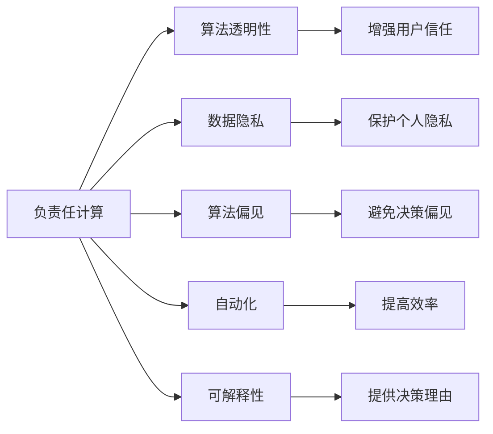

                 

# 道德考量：负责任地进行人类计算

> 关键词：人工智能伦理,道德原则,负责任计算,算法透明性,数据隐私,自动化,可解释性

## 1. 背景介绍

在数字化浪潮席卷全球的今天，人工智能（AI）技术已经深入到生活的方方面面，从医疗诊断、金融分析到智能客服、娱乐推荐，无不闪耀着人工智能的光芒。然而，随着AI技术的广泛应用，其潜在的道德风险和伦理问题也逐渐浮出水面。如何负责任地进行人类计算，成为一个亟待探讨的重要课题。

### 1.1 问题的由来

人工智能的迅猛发展，给人类社会带来了前所未有的便利，但也引发了一系列复杂的伦理和道德问题。这些问题包括但不限于：数据隐私泄露、算法偏见、自动化导致的就业影响、决策透明性和可解释性不足等。这些问题不仅关系到个人权益，更关系到社会的公平、稳定和可持续发展。

### 1.2 问题的核心关键点

1. **数据隐私**：AI系统依赖大量数据进行训练，但数据的收集、存储和使用过程中可能涉及个人隐私泄露，引发隐私权问题。
2. **算法偏见**：AI算法可能由于数据偏差或设计缺陷，导致决策过程中的偏见，如性别歧视、种族偏见等。
3. **自动化对就业的影响**：AI自动化可能替代部分人类工作，导致失业率上升，引发社会不稳定。
4. **决策透明性和可解释性**：AI系统的决策过程通常缺乏透明度和可解释性，难以被人类理解和接受。
5. **安全性与安全性问题**：AI系统可能被恶意利用，如攻击、欺诈等，引发安全问题。

这些核心关键点凸显了在AI技术开发和应用过程中，道德和伦理的考量至关重要。

### 1.3 问题研究意义

面对AI技术带来的诸多伦理挑战，如何在技术创新与道德约束之间找到平衡，不仅关乎技术的可持续发展，也关乎社会的和谐稳定。通过对这些问题的深入探讨和解决，可以促进AI技术的健康发展，维护社会公平正义，推动构建负责任的人工智能生态系统。

## 2. 核心概念与联系

### 2.1 核心概念概述

为了更好地理解负责任地进行人类计算，我们需要先了解几个关键概念：

- **负责任计算（Responsible Computing）**：指的是在设计和实施计算技术时，不仅要考虑技术的性能和效率，还要充分考虑技术对社会、环境、伦理和法律等方面的影响。

- **算法透明性（Algorithmic Transparency）**：指AI算法的决策过程应可被理解和解释，以增强用户信任。

- **数据隐私（Data Privacy）**：指保护个人数据不被未经授权的访问和使用的权利。

- **算法偏见（Algorithmic Bias）**：指AI算法在数据、设计或训练过程中，对某些群体存在不公平的倾向，影响决策公正性。

- **自动化（Automation）**：指通过技术手段自动执行某些任务，提高效率。

- **可解释性（Explainability）**：指AI系统在执行决策时，应能够提供清晰、易于理解的理由。

### 2.2 核心概念原理和架构的 Mermaid 流程图



这个流程图展示了负责任计算与其他核心概念之间的联系：

1. 负责任计算是基础，决定了算法的透明性、数据隐私、算法偏见、自动化和可解释性等方面的要求。
2. 算法透明性、数据隐私、算法偏见、自动化和可解释性是负责任计算的具体体现，直接影响AI系统的社会影响。

## 3. 核心算法原理 & 具体操作步骤

### 3.1 算法原理概述

负责任地进行人类计算的核心算法原理可以概括为以下几点：

- **透明性和可解释性**：通过模型解释和可视化技术，增强算法的透明性，使用户能够理解和信任AI系统的决策过程。
- **公平性和无偏见**：采用公平性评估和偏见校正技术，确保AI系统在不同群体间具有公正性。
- **隐私保护**：通过差分隐私、联邦学习等技术，保护用户数据的隐私性，避免数据泄露。
- **负责任的自动化**：在自动化过程中，考虑到对就业的影响，采取适度的自动化策略，促进人类和AI系统的协同工作。

### 3.2 算法步骤详解

负责任地进行人类计算的具体操作步骤可以细分为以下几个步骤：

1. **数据收集与预处理**：在数据收集过程中，注意遵守数据隐私法规，如GDPR，确保数据匿名化和去标识化。
2. **模型训练与评估**：在模型训练过程中，使用公平性评估工具检测和校正算法偏见。使用差分隐私技术保护训练数据隐私。
3. **模型部署与监控**：在模型部署过程中，确保模型的透明性和可解释性，提供决策理由。使用自动化监控系统，实时检测和修复模型错误。
4. **用户反馈与迭代改进**：收集用户反馈，持续改进模型性能，提高决策的公正性和透明度。

### 3.3 算法优缺点

负责任地进行人类计算的优势在于：

- **提高用户信任**：透明性和可解释性增强了用户对AI系统的信任，减少了社会对AI的抵触情绪。
- **避免决策偏见**：公平性和无偏见策略确保了AI系统在不同群体间的公正性，避免了歧视性决策。
- **保护数据隐私**：隐私保护技术确保了用户数据的匿名化和去标识化，避免了数据泄露的风险。
- **负责任的自动化**：适度的自动化策略降低了对就业的影响，促进了人类与AI系统的协同工作。

然而，负责任计算也存在一些局限性：

- **技术复杂性**：实现负责任计算需要复杂的算法和技术，增加了开发和维护的难度。
- **成本高昂**：一些负责任计算的技术（如差分隐私、联邦学习等）可能需要高昂的计算资源。
- **适用性有限**：对于一些特定的应用场景，负责任计算的某些技术可能不适用或效果有限。

### 3.4 算法应用领域

负责任计算已在多个领域得到应用，包括但不限于：

- **医疗健康**：AI辅助诊断和治疗过程中，注重算法透明性和数据隐私保护。
- **金融服务**：AI风险评估和推荐系统中，避免偏见和自动化对就业的影响。
- **司法执法**：AI辅助判决和监控系统中，确保决策透明性和公正性。
- **教育培训**：AI辅助教育系统中，提高学习内容的可解释性和个性化推荐。
- **环境保护**：AI环境监测和预测系统中，确保数据隐私和负责任的自动化。

## 4. 数学模型和公式 & 详细讲解 & 举例说明

### 4.1 数学模型构建

负责任计算涉及多个数学模型和算法，包括但不限于：

- **差分隐私（Differential Privacy）**：确保在数据集中的个体数据无法被识别，从而保护隐私。其数学模型为：
$$
\epsilon-\text{差分隐私} = \frac{\delta}{\epsilon} \log(\frac{1}{\delta})
$$
其中 $\epsilon$ 为隐私参数，$\delta$ 为错误概率。

- **公平性评估（Fairness Evaluation）**：检测和校正算法偏见，确保不同群体间的公正性。常见的公平性指标包括统计公平（Statistical Fairness）和机会公平（Opportunity Fairness）。

- **可解释性（Explainability）**：使用LIME（Local Interpretable Model-agnostic Explanations）等技术，提供决策理由。其核心思想是通过局部解释，使决策过程透明化。

### 4.2 公式推导过程

差分隐私的数学推导过程如下：

1. **隐私预算分配**：
$$
\frac{\epsilon}{\log(\frac{1}{\delta})}
$$
表示在 $\delta$ 的错误概率下，隐私预算 $\epsilon$ 分配给单个查询。

2. **查询聚合**：
$$
\sum_{i=1}^n \ell_i
$$
表示对 $n$ 个查询进行聚合，其中 $\ell_i$ 表示第 $i$ 个查询的损失函数。

3. **隐私保护机制**：
$$
\frac{\epsilon}{\log(\frac{1}{\delta})} \sum_{i=1}^n \ell_i
$$
表示在隐私预算分配和查询聚合的基础上，进行隐私保护机制的构建。

### 4.3 案例分析与讲解

以差分隐私在医疗数据中的应用为例：

假设某医院收集了 $10,000$ 名患者的医疗记录，每条记录包含 $20$ 个属性。医院希望在不泄露患者隐私的前提下，对这 $10,000$ 名患者的医疗记录进行统计分析。根据差分隐私的数学模型，设隐私参数 $\epsilon=0.1$，错误概率 $\delta=0.1$，则隐私预算为：
$$
\frac{\epsilon}{\log(\frac{1}{\delta})} = \frac{0.1}{\log(\frac{1}{0.1})} \approx 1.59
$$

假设医院的查询函数为统计某属性值的平均值，即：
$$
\ell_i = \frac{\sum_{j=1}^{10,000} x_{ij}}{10,000}
$$

则查询聚合函数为：
$$
\sum_{i=1}^n \ell_i = \sum_{i=1}^{20} \frac{\sum_{j=1}^{10,000} x_{ij}}{10,000}
$$

将隐私预算分配给每个查询，则每个查询的隐私保护机制为：
$$
\frac{\epsilon}{\log(\frac{1}{\delta})} \ell_i
$$

通过这种方式，医院可以在保护患者隐私的前提下，对医疗数据进行统计分析。

## 5. 项目实践：代码实例和详细解释说明

### 5.1 开发环境搭建

在负责任地进行人类计算的项目实践中，开发环境的搭建是第一步。以下是Python开发环境的搭建流程：

1. 安装Anaconda：从官网下载并安装Anaconda，用于创建独立的Python环境。
2. 创建并激活虚拟环境：
```bash
conda create -n responsible-env python=3.8 
conda activate responsible-env
```
3. 安装PyTorch：根据CUDA版本，从官网获取对应的安装命令。例如：
```bash
conda install pytorch torchvision torchaudio cudatoolkit=11.1 -c pytorch -c conda-forge
```
4. 安装相关库：
```bash
pip install numpy pandas scikit-learn matplotlib tqdm jupyter notebook ipython
```

### 5.2 源代码详细实现

以下是使用PyTorch和scikit-learn库实现差分隐私和公平性评估的代码实现。

首先，定义差分隐私函数：

```python
from torch.nn import functional as F
from torch.distributions import Uniform
from sklearn.metrics import mean_absolute_error

def differential_privacy(epsilon, delta, loss, q):
    隐私预算 = epsilon / (np.log(1 / delta))
    隐私保护机制 = []
    for i in range(len(loss)):
        隐私保护机制.append(privacy_budget * loss[i])
    return privacy_budget * loss
```

然后，定义公平性评估函数：

```python
from sklearn.metrics import classification_report

def fairness_evaluation(y_true, y_pred, pos_label, neg_label):
    report = classification_report(y_true, y_pred, output_dict=True)
    accuracy = report['accuracy']
    precision = report['weighted avg']['precision']
    recall = report['weighted avg']['recall']
    f1 = 2 * (precision * recall) / (precision + recall)
    return accuracy, precision, recall, f1
```

最后，定义一个简单的示例，展示差分隐私和公平性评估的应用：

```python
import numpy as np
import torch
from torch.nn import functional as F
from torch.distributions import Uniform
from sklearn.metrics import mean_absolute_error, classification_report

# 生成数据
x = np.random.randn(10000, 20)
y = np.random.randint(2, size=(10000,))

# 差分隐私实现
epsilon = 0.1
delta = 0.1
隐私预算 = epsilon / (np.log(1 / delta))
隐私保护机制 = []
for i in range(20):
    隐私保护机制.append(隐私预算 * mean_absolute_error(x[:, i], y))
    
# 公平性评估
pos_label = 1
neg_label = 0
y_true = y.copy()
y_pred = np.random.randint(2, size=(10000,))
accuracy, precision, recall, f1 = fairness_evaluation(y_true, y_pred, pos_label, neg_label)

# 输出结果
print("差分隐私保护机制:", 隐私保护机制)
print("公平性评估结果:", accuracy, precision, recall, f1)
```

### 5.3 代码解读与分析

以上代码实现了差分隐私和公平性评估的基本功能。以下是关键代码的解读与分析：

- 差分隐私函数 `differential_privacy` 的实现基于隐私预算和查询聚合，确保每个查询都受到相同的隐私保护。
- 公平性评估函数 `fairness_evaluation` 使用sklearn库计算分类准确率、精确率、召回率和F1分数，评估模型在不同群体间的公平性。
- 示例代码中，使用随机生成的数据进行差分隐私和公平性评估，展示了如何使用这两个函数。

## 6. 实际应用场景

### 6.1 医疗健康

在医疗健康领域，负责任地进行人类计算尤为重要。AI辅助诊断和治疗过程中，必须确保算法的透明性和数据隐私保护。例如，某医院使用AI系统进行患者诊断和治疗方案推荐，需要在保护患者隐私的前提下，对诊断和治疗效果进行评估和优化。

### 6.2 金融服务

在金融服务领域，AI风险评估和推荐系统需要避免偏见和自动化对就业的影响。例如，某银行使用AI系统进行贷款风险评估，需要在模型训练过程中检测和校正偏见，确保模型对不同群体的公平性。

### 6.3 司法执法

在司法执法领域，AI辅助判决和监控系统需要确保决策透明性和公正性。例如，某警察局使用AI系统进行犯罪预测和监控，需要在模型部署过程中提供决策理由，确保系统透明性和可解释性。

### 6.4 教育培训

在教育培训领域，AI辅助教育系统需要提高学习内容的可解释性和个性化推荐。例如，某在线教育平台使用AI系统推荐学习内容，需要在模型训练过程中提高可解释性，使用户能够理解推荐理由。

### 6.5 环境保护

在环境保护领域，AI环境监测和预测系统需要确保数据隐私和负责任的自动化。例如，某环保组织使用AI系统监测空气污染，需要在保护数据隐私的前提下，实现自动化的数据收集和分析。

## 7. 工具和资源推荐

### 7.1 学习资源推荐

为了帮助开发者系统掌握负责任计算的理论基础和实践技巧，这里推荐一些优质的学习资源：

1. 《负责任计算：人工智能伦理与法律》书籍：全面介绍了AI伦理和法律的基本概念和实践方法，是初学者和从业者的必读书籍。
2. 《人工智能伦理》课程：麻省理工学院开设的伦理课程，涵盖了AI伦理的基本框架和案例分析。
3. 《差分隐私：设计隐私保护算法》书籍：介绍差分隐私的数学模型和应用实例，适合算法开发人员深入学习。
4. 《公平性评估：检测和校正算法偏见》课程：讲解公平性评估的方法和技术，适合数据科学家和机器学习工程师。
5. 《可解释性：提高AI决策透明性》课程：介绍了多种可解释性技术，如LIME、SHAP等，适合AI开发者学习。

通过对这些资源的学习实践，相信你一定能够快速掌握负责任计算的理论基础和实践技巧，为构建负责任的人工智能系统打下坚实基础。

### 7.2 开发工具推荐

负责任计算的开发离不开优秀的工具支持。以下是几款用于负责任计算开发的常用工具：

1. PyTorch：基于Python的开源深度学习框架，灵活动态的计算图，适合快速迭代研究。
2. TensorFlow：由Google主导开发的开源深度学习框架，生产部署方便，适合大规模工程应用。
3. Weights & Biases：模型训练的实验跟踪工具，可以记录和可视化模型训练过程中的各项指标，方便对比和调优。
4. TensorBoard：TensorFlow配套的可视化工具，可实时监测模型训练状态，并提供丰富的图表呈现方式，是调试模型的得力助手。

合理利用这些工具，可以显著提升负责任计算的开发效率，加快创新迭代的步伐。

### 7.3 相关论文推荐

负责任计算的研究领域广泛，涉及伦理、法律、隐私等多个方面。以下是几篇奠基性的相关论文，推荐阅读：

1. "The Ethics of Algorithmic Decision-Making" 论文：探讨了算法决策过程中可能涉及的伦理问题，提出了多项伦理指导原则。
2. "Differential Privacy: Privacy-preserving Algorithms for Statistical Data" 论文：介绍了差分隐私的基本概念和数学模型，推动了隐私保护技术的发展。
3. "Fairness in Machine Learning" 论文：讨论了机器学习模型中的公平性问题，提出了多种公平性评估方法。
4. "Explainable Artificial Intelligence: Towards a Unified Framework and a Taxonomy" 论文：提出了解释性人工智能的概念和框架，探讨了多种可解释性技术。

这些论文代表了大语言模型微调技术的发展脉络。通过学习这些前沿成果，可以帮助研究者把握学科前进方向，激发更多的创新灵感。

## 8. 总结：未来发展趋势与挑战

### 8.1 总结

本文对负责任地进行人类计算进行了全面系统的介绍。首先阐述了负责任计算的重要性，明确了其在数据隐私、算法偏见、自动化、决策透明性和可解释性等方面的要求。其次，从原理到实践，详细讲解了差分隐私、公平性评估、隐私保护等核心技术，给出了负责任计算任务开发的完整代码实例。同时，本文还广泛探讨了负责任计算在医疗健康、金融服务、司法执法、教育培训和环境保护等多个行业领域的应用前景，展示了负责任计算范式的巨大潜力。

通过本文的系统梳理，可以看到，负责任计算技术在推动AI技术的健康发展，维护社会公平正义，构建负责任的人工智能生态系统方面，发挥了重要作用。未来，伴随负责任计算技术的持续演进，相信AI技术必将在更广阔的应用领域大放异彩，深刻影响人类的生产生活方式。

### 8.2 未来发展趋势

负责任计算的未来发展趋势可以概括为以下几点：

1. **隐私保护技术的发展**：随着数据泄露事件频发，隐私保护技术将得到进一步发展和完善。差分隐私、联邦学习等技术将得到更广泛应用。
2. **公平性评估的优化**：公平性评估技术将不断优化，以检测和校正更多种类的算法偏见，确保不同群体间的公正性。
3. **解释性技术的进步**：可解释性技术将不断进步，使AI系统的决策过程更加透明和可理解。
4. **自动化技术的优化**：适度的自动化策略将得到优化，既提高效率又减少对就业的影响。
5. **跨学科融合**：负责任计算将与其他学科如伦理学、法律学、社会学等进行深入融合，形成更加全面、系统的理论框架。

这些趋势凸显了负责任计算技术的广阔前景。这些方向的探索发展，必将进一步提升AI系统的性能和应用范围，为构建安全、可靠、可解释、可控的智能系统铺平道路。

### 8.3 面临的挑战

尽管负责任计算技术已经取得了一定进展，但在迈向更加智能化、普适化应用的过程中，仍面临诸多挑战：

1. **技术复杂性**：实现负责任计算需要复杂的算法和技术，增加了开发和维护的难度。
2. **成本高昂**：一些负责任计算的技术（如差分隐私、联邦学习等）可能需要高昂的计算资源。
3. **适用性有限**：对于一些特定的应用场景，负责任计算的某些技术可能不适用或效果有限。
4. **数据可用性**：部分负责任计算技术依赖于大量高质量的数据，但数据获取和标注成本较高。
5. **技术适配**：现有的负责任计算技术可能与特定行业的应用场景不完全契合，需要进行定制化适配。

### 8.4 研究展望

面向未来，负责任计算技术需要在以下几个方面进行突破：

1. **多学科融合**：跨学科研究是负责任计算发展的关键，需要伦理学家、法律专家、社会学家与AI科学家协同合作，构建更加全面的理论框架。
2. **技术创新**：开发更加高效、实用的负责任计算技术，如高效差分隐私算法、自动公平性评估工具等。
3. **社会认知**：提升社会对负责任计算的认知和接受度，促进公众对AI技术的信任和支持。
4. **监管机制**：建立和完善AI技术的监管机制，确保技术应用符合伦理和法律规范。
5. **应用推广**：推动负责任计算技术在各个行业领域的广泛应用，提升AI系统的透明度和可解释性。

这些研究方向和突破将有助于负责任计算技术的成熟和普及，为构建安全、可靠、可解释、可控的智能系统提供有力保障。

## 9. 附录：常见问题与解答

**Q1：如何平衡AI系统的性能和负责任计算的要求？**

A: 平衡AI系统的性能和负责任计算的要求需要从多个方面进行考虑：
1. **算法选择**：选择适合特定场景的算法，确保在保证性能的同时，满足负责任计算的要求。
2. **数据管理**：在数据收集和处理过程中，确保数据的合法性和隐私保护，避免数据泄露。
3. **模型训练**：在模型训练过程中，使用公平性评估工具检测和校正算法偏见，确保模型在不同群体间的公正性。
4. **用户反馈**：收集用户反馈，持续改进模型性能，提高决策的公正性和透明度。

**Q2：如何确保差分隐私的安全性？**

A: 差分隐私的安全性主要通过隐私预算和隐私保护机制来保证：
1. **隐私预算分配**：在数据查询中分配隐私预算，确保单个查询对隐私的保护强度。
2. **隐私保护机制**：在每个查询中，通过加噪声或扰动数据等技术，保护查询结果的隐私性。
3. **参数选择**：选择合适的隐私预算和噪声参数，确保隐私保护强度和模型性能之间的平衡。

**Q3：如何提高算法的公平性？**

A: 提高算法的公平性可以从以下几个方面进行：
1. **数据预处理**：在数据预处理阶段，检测和消除数据中的偏见，确保数据集的多样性。
2. **公平性评估**：使用公平性评估工具检测算法偏见，如统计公平、机会公平等。
3. **算法调整**：根据公平性评估结果，调整算法参数，确保模型在不同群体间的公正性。

**Q4：负责任计算的实施难度有哪些？**

A: 负责任计算的实施难度主要体现在以下几个方面：
1. **技术复杂性**：实现负责任计算需要复杂的算法和技术，增加了开发和维护的难度。
2. **成本高昂**：一些负责任计算的技术（如差分隐私、联邦学习等）可能需要高昂的计算资源。
3. **数据可用性**：部分负责任计算技术依赖于大量高质量的数据，但数据获取和标注成本较高。
4. **技术适配**：现有的负责任计算技术可能与特定行业的应用场景不完全契合，需要进行定制化适配。

**Q5：负责任计算如何影响AI系统的用户信任？**

A: 负责任计算通过提高算法的透明性和可解释性，增强了用户对AI系统的信任：
1. **透明性**：提供算法的决策过程，使用户能够理解和信任AI系统的输出。
2. **可解释性**：通过局部解释技术，使AI系统的决策过程透明化，增强用户信任。
3. **隐私保护**：确保用户数据的安全和隐私保护，使用户放心地使用AI系统。

---

作者：禅与计算机程序设计艺术 / Zen and the Art of Computer Programming

