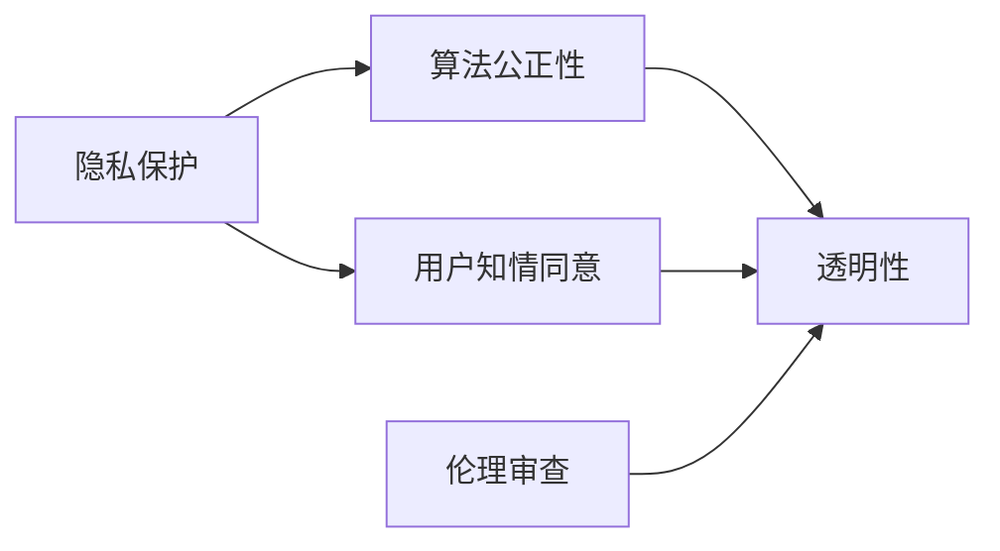

                 

# 道德考量：负责任地进行人类计算

## 1. 背景介绍

在过去的几十年里，人类计算已经经历了从传统计算到现代计算的巨大转变。随着计算技术的不断进步，计算能力已经变得越来越强大，但与此同时，我们也需要重新审视计算的道德维度，以确保在追求技术进步的同时，不忽视对社会的负面影响。

### 1.1 计算技术的发展

随着计算技术的飞速发展，我们已经从个人计算机进入了云计算和大数据时代。数据中心、超级计算机和分布式计算系统的出现，使得我们能够处理和分析前所未有的数据量。这些技术的广泛应用，不仅改变了我们的生产方式，也重塑了我们的生活和社会结构。

### 1.2 计算技术的影响

尽管计算技术带来了诸多便利，但也不可避免地带来了一些负面影响。这些影响包括但不限于：

- **隐私泄露**：大量个人数据被收集和存储，增加了隐私泄露的风险。
- **算法偏见**：基于有偏差的训练数据，机器学习模型可能产生偏见，对某些群体产生不公平的待遇。
- **失业问题**：自动化技术的发展可能导致某些行业出现大量失业现象。
- **伦理问题**：计算技术在医疗、司法等领域的广泛应用，引发了诸多伦理问题，如AI辅助决策的公正性、透明性等。

### 1.3 道德考量的必要性

计算技术的发展速度远超我们的伦理和法律框架，导致了一系列道德和伦理问题。为了应对这些挑战，我们需要重新审视人类计算的道德维度，确保技术进步不会对社会造成负面影响。本文将探讨如何负责任地进行人类计算，以期为计算技术的未来发展提供一些有益的指导。

## 2. 核心概念与联系

### 2.1 核心概念概述

在进行负责任的人类计算时，需要考虑多个核心概念，包括但不限于：

- **隐私保护**：确保个人信息的隐私不被侵犯。
- **算法公正性**：确保机器学习模型不带有偏见，对所有用户公平。
- **伦理审查**：对计算技术的应用进行伦理审查，确保其符合道德标准。
- **用户知情同意**：确保用户对数据的收集和处理过程有充分的知情权和选择权。
- **透明性**：确保计算过程的透明，以便于审查和改进。

这些概念之间相互关联，共同构成了负责任人类计算的基础框架。

### 2.2 核心概念的联系

这些核心概念之间的关系可以通过以下Mermaid流程图来展示：



这个流程图展示了各个核心概念之间的联系：

- 隐私保护和用户知情同意是用户权利的基础，确保用户能够掌控自己的数据。
- 算法公正性和透明性是确保技术应用的公平性和可信度的关键。
- 伦理审查是对整个计算过程的监督和评估，确保符合道德标准。

这些概念之间的联系和相互作用，构成了负责任人类计算的完整框架。

## 3. 核心算法原理 & 具体操作步骤

### 3.1 算法原理概述

在进行负责任的人类计算时，我们需要考虑如何平衡技术进步和道德约束。以下是一些核心算法原理：

- **数据隐私保护**：通过数据匿名化、差分隐私等技术，保护用户隐私。
- **算法公正性**：使用公平性约束、正则化等技术，减少算法偏见。
- **透明性**：通过可解释的模型、透明的决策过程，提高计算过程的透明性。

### 3.2 算法步骤详解

以下是对应的算法步骤：

1. **数据隐私保护**：
   - 使用数据匿名化技术，如泛化、去标识化等，保护用户隐私。
   - 应用差分隐私技术，如添加噪声、剪枝等，防止数据泄露。

2. **算法公正性**：
   - 引入公平性约束，如使用公平性损失函数、对抗性采样等，减少模型偏见。
   - 应用正则化技术，如L2正则、Dropout等，提高模型稳定性。

3. **透明性**：
   - 使用可解释的模型，如决策树、规则模型等，提供透明的决策过程。
   - 应用可视化工具，如TensorBoard、W&B等，监控模型训练和推理过程。

### 3.3 算法优缺点

负责任的人类计算算法具有以下优点：

- **提高用户信任**：通过保护隐私、减少偏见，提升用户对技术的信任度。
- **增强模型公正性**：减少模型偏见，提高模型的公正性。
- **提高透明度**：通过透明的决策过程和可视化工具，提高计算过程的透明度。

同时，这些算法也存在一些局限性：

- **计算成本**：隐私保护和公正性约束会增加计算成本。
- **模型复杂性**：可解释模型和可视化工具可能增加模型复杂性。
- **隐私保护效果**：某些隐私保护技术可能会影响数据质量。

### 3.4 算法应用领域

负责任的人类计算算法广泛应用于多个领域，包括但不限于：

- **医疗**：保护患者隐私，确保医疗决策的公正性和透明性。
- **金融**：确保金融服务的公平性和透明性，防止算法偏见。
- **司法**：保护嫌疑人和证人的隐私，确保司法过程的公正性和透明性。
- **社交媒体**：保护用户隐私，防止算法偏见，确保内容审查的公正性和透明性。

## 4. 数学模型和公式 & 详细讲解 & 举例说明

### 4.1 数学模型构建

在进行负责任的人类计算时，数学模型和公式的选择至关重要。以下是一些关键的数学模型：

- **差分隐私模型**：用于保护数据隐私，确保单个数据点的隐私不被泄露。
- **公平性损失函数**：用于减少算法偏见，确保模型的公平性。
- **可解释性模型**：如决策树、规则模型等，提供透明的决策过程。

### 4.2 公式推导过程

以下是一些关键公式的推导过程：

1. **差分隐私模型**：
   - 差分隐私的目标是确保单个数据点的隐私不被泄露。其公式为：
     $$
     \epsilon-\text{privacy} = \mathcal{L}(\mathcal{D}) - \mathcal{L}(\mathcal{D}')
     $$
     其中 $\mathcal{D}$ 为原始数据集，$\mathcal{D}'$ 为扰动后的数据集，$\epsilon$ 为隐私保护程度。

2. **公平性损失函数**：
   - 公平性损失函数的公式为：
     $$
     \mathcal{L}_{\text{fair}} = \frac{1}{N} \sum_{i=1}^N \sum_{j=1}^C |y_i^j - \hat{y}_i^j|^2
     $$
     其中 $N$ 为样本数量，$C$ 为类别数量，$y_i^j$ 为样本 $i$ 的真实标签，$\hat{y}_i^j$ 为模型预测的标签。

3. **可解释性模型**：
   - 决策树的公式为：
     $$
     \text{tree} = \text{root}(\text{split}(\text{features}, \text{thresholds}))
     $$
     其中 $\text{root}$ 为决策树的根节点，$\text{split}$ 为分割函数，$\text{features}$ 为特征集，$\text{thresholds}$ 为分割阈值。

### 4.3 案例分析与讲解

下面我们以一个具体案例来分析负责任的人类计算：

假设我们正在开发一个基于机器学习模型的医疗诊断系统。在这个系统中，我们需要考虑以下几个关键问题：

1. **隐私保护**：患者的医疗记录非常敏感，必须确保其隐私不被泄露。我们可以使用差分隐私技术，通过添加噪声保护患者隐私。
   
2. **算法公正性**：不同的患者可能由于种族、性别等因素导致治疗结果不同。我们需要使用公平性约束，确保模型对所有患者公平。
   
3. **透明性**：我们需要确保医疗诊断过程的透明，以便于医生和患者理解和审查。我们可以使用可解释的模型，如决策树，提供透明的决策过程。

## 5. 项目实践：代码实例和详细解释说明

### 5.1 开发环境搭建

在进行负责任的人类计算时，我们需要构建一个开发环境，以支持各种算法和工具。以下是一些关键步骤：

1. **安装依赖**：
   - 安装Python、PyTorch等基础依赖。
   - 安装差分隐私、公平性约束等算法库。
   - 安装可视化工具，如TensorBoard、W&B等。

2. **设置环境**：
   - 使用虚拟环境，避免版本冲突。
   - 配置数据匿名化、差分隐私等隐私保护工具。

### 5.2 源代码详细实现

以下是一个使用差分隐私和公平性约束的PyTorch代码实现：

```python
import torch
from torch import nn, optim
from torch.utils.data import Dataset, DataLoader

class MedicalDataset(Dataset):
    def __init__(self, data, targets):
        self.data = data
        self.targets = targets
    
    def __len__(self):
        return len(self.data)
    
    def __getitem__(self, idx):
        return self.data[idx], self.targets[idx]

class MedicalModel(nn.Module):
    def __init__(self):
        super(MedicalModel, self).__init__()
        self.fc1 = nn.Linear(784, 128)
        self.fc2 = nn.Linear(128, 128)
        self.fc3 = nn.Linear(128, 10)
    
    def forward(self, x):
        x = torch.relu(self.fc1(x))
        x = torch.relu(self.fc2(x))
        x = self.fc3(x)
        return x

# 数据集
data = ...
targets = ...

# 模型
model = MedicalModel()

# 训练参数
criterion = nn.CrossEntropyLoss()
optimizer = optim.Adam(model.parameters(), lr=0.001)

# 差分隐私和公平性约束
privacy_budget = 1.0
epsilon = privacy_budget / (2 * n_samples)
model.add_noise(epsilon)
fairness_constraint = nn.FairnessConstraint()

# 训练过程
for epoch in range(num_epochs):
    for idx, (x, target) in enumerate(train_loader):
        x = x.to(device)
        target = target.to(device)
        optimizer.zero_grad()
        output = model(x)
        loss = criterion(output, target)
        loss += fairness_constraint(model, target)
        loss /= n_samples
        loss.backward()
        optimizer.step()

        # 差分隐私约束
        if idx % 100 == 0:
            model.add_noise(epsilon)
```

### 5.3 代码解读与分析

在这个代码实现中，我们使用了差分隐私和公平性约束。具体步骤如下：

1. **数据集和模型**：我们定义了一个简单的医疗数据集和模型，用于训练和推理。
2. **损失函数和优化器**：我们使用交叉熵损失函数和Adam优化器。
3. **差分隐私约束**：我们使用差分隐私技术，通过添加噪声保护患者隐私。
4. **公平性约束**：我们使用公平性约束，确保模型对所有患者公平。
5. **训练过程**：在每个epoch中，我们对模型进行训练，并加入差分隐私和公平性约束。

## 6. 实际应用场景

### 6.1 医疗诊断

在医疗诊断领域，负责任的人类计算尤为重要。患者医疗记录的隐私保护和模型公正性直接影响患者的信任和治疗效果。以下是一些具体应用场景：

1. **隐私保护**：医疗数据非常敏感，必须确保患者隐私不被泄露。我们可以使用差分隐私技术，通过添加噪声保护患者隐私。
   
2. **算法公正性**：不同的患者可能由于种族、性别等因素导致治疗结果不同。我们需要使用公平性约束，确保模型对所有患者公平。

3. **透明性**：我们需要确保医疗诊断过程的透明，以便于医生和患者理解和审查。我们可以使用可解释的模型，如决策树，提供透明的决策过程。

### 6.2 金融服务

金融服务领域也面临着许多伦理和道德问题。以下是一些具体应用场景：

1. **隐私保护**：金融数据非常敏感，必须确保用户隐私不被泄露。我们可以使用差分隐私技术，通过添加噪声保护用户隐私。
   
2. **算法公正性**：金融服务可能带有偏见，如针对某些客户的贷款审批。我们需要使用公平性约束，确保模型对所有用户公平。

3. **透明性**：我们需要确保金融服务的透明，以便于用户理解和审查。我们可以使用可解释的模型，如规则模型，提供透明的决策过程。

### 6.3 社交媒体

社交媒体平台需要处理大量的用户数据，包括用户的个人信息、兴趣爱好等。以下是一些具体应用场景：

1. **隐私保护**：用户的个人信息非常敏感，必须确保用户隐私不被泄露。我们可以使用差分隐私技术，通过添加噪声保护用户隐私。
   
2. **算法公正性**：社交媒体算法可能带有偏见，如针对某些群体的推荐。我们需要使用公平性约束，确保算法对所有用户公平。

3. **透明性**：我们需要确保社交媒体算法的透明，以便于用户理解和审查。我们可以使用可解释的模型，如规则模型，提供透明的决策过程。

## 7. 工具和资源推荐

### 7.1 学习资源推荐

为了帮助开发者系统掌握负责任的人类计算的理论基础和实践技巧，这里推荐一些优质的学习资源：

1. **《人工智能伦理与法律》课程**：斯坦福大学开设的AI伦理和法律课程，涵盖隐私保护、算法公正性等关键内容。
   
2. **《数据科学伦理》书籍**：介绍了数据科学中的伦理问题，包括隐私保护、算法偏见等。
   
3. **《负责任的AI》论文集**：收集了AI伦理和道德方面的最新研究成果，提供了丰富的理论依据和实践指南。

### 7.2 开发工具推荐

负责任的人类计算需要多种工具的支持。以下是一些推荐的开发工具：

1. **PyTorch**：支持差分隐私、公平性约束等隐私保护技术。
2. **TensorFlow**：支持差分隐私和公平性约束等隐私保护技术。
3. **TensorBoard**：可视化工具，监控模型训练和推理过程。
4. **W&B**：监控工具，记录和分析模型的训练和推理过程。

### 7.3 相关论文推荐

负责任的人类计算领域有许多重要的研究论文。以下是一些推荐的论文：

1. **《差分隐私：设计与分析》**：介绍了差分隐私的基本概念和实现方法。
   
2. **《公平性约束：方法与挑战》**：探讨了公平性约束在机器学习中的应用，包括公平性损失函数、对抗性采样等。
   
3. **《可解释性AI：理论与实践》**：介绍了可解释性AI的基本概念和技术，如决策树、规则模型等。

## 8. 总结：未来发展趋势与挑战

### 8.1 研究成果总结

本文对负责任的人类计算进行了全面系统的介绍。首先，阐述了计算技术的快速发展带来的诸多伦理和道德问题。其次，从隐私保护、算法公正性、透明性等关键概念出发，详细讲解了负责任的人类计算的理论基础和实践技巧。最后，通过具体的代码实现和案例分析，展示了负责任的人类计算在医疗、金融、社交媒体等领域的实际应用。

### 8.2 未来发展趋势

负责任的人类计算将呈现以下几个发展趋势：

1. **隐私保护技术**：随着数据量的不断增加，隐私保护技术将更加重要。差分隐私、联邦学习等技术将广泛应用于各个领域。
   
2. **算法公正性**：公平性约束、对抗性采样等技术将进一步发展，确保算法对所有用户公平。

3. **透明性**：可解释的模型和可视化工具将进一步普及，提高计算过程的透明性。

4. **伦理审查**：随着计算技术的应用范围不断扩大，伦理审查将变得更加重要，确保计算技术的合法性和道德性。

### 8.3 面临的挑战

负责任的人类计算在发展过程中也面临着一些挑战：

1. **计算成本**：隐私保护和公正性约束会增加计算成本，需要更多的资源支持。
   
2. **模型复杂性**：可解释模型和可视化工具可能增加模型复杂性，需要更多的开发和维护成本。

3. **隐私保护效果**：差分隐私技术可能会影响数据质量，需要权衡隐私保护和数据质量之间的关系。

### 8.4 研究展望

未来的研究方向包括：

1. **隐私保护技术**：开发更高效的差分隐私和联邦学习技术，保护用户隐私。
   
2. **算法公正性**：引入更多的公平性约束和对抗性采样技术，提高算法公正性。

3. **透明性**：开发更可解释的模型和可视化工具，提高计算过程的透明性。

4. **伦理审查**：建立完善的伦理审查机制，确保计算技术的合法性和道德性。

通过持续的研究和探索，负责任的人类计算将进一步发展，为计算技术的未来应用提供更有力的保障。

## 9. 附录：常见问题与解答

**Q1: 什么是差分隐私？**

A: 差分隐私是一种保护数据隐私的技术，通过在数据中添加噪声，使得单个数据点的隐私不被泄露。具体来说，差分隐私的目标是使得攻击者无法从单个数据点的添加噪声中推断出其他数据点的信息。

**Q2: 公平性约束有哪些方法？**

A: 公平性约束有多种方法，包括公平性损失函数、对抗性采样等。公平性损失函数通过对模型预测结果进行惩罚，减少模型偏见。对抗性采样通过在训练数据中添加对抗样本，提高模型对偏见样本的鲁棒性。

**Q3: 可解释性模型有哪些类型？**

A: 可解释性模型包括决策树、规则模型等。这些模型提供透明的决策过程，便于审查和改进。

**Q4: 负责任的人类计算如何平衡隐私保护和数据质量？**

A: 在隐私保护和数据质量之间需要权衡。差分隐私技术通过添加噪声保护用户隐私，但可能会影响数据质量。因此，需要根据具体应用场景选择合适的隐私保护策略，并评估其对数据质量的影响。

**Q5: 如何确保计算过程的透明性？**

A: 确保计算过程的透明性需要开发可解释的模型和可视化工具。可解释模型提供透明的决策过程，可视化工具记录和分析模型的训练和推理过程，便于审查和改进。

---

作者：禅与计算机程序设计艺术 / Zen and the Art of Computer Programming

