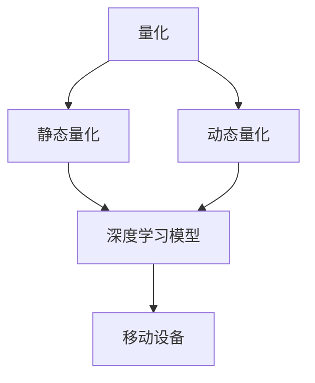

                 

# 量化在移动设备中的应用

> 关键词：量化,移动设备,深度学习,模型优化,加速推理,低功耗,资源管理

## 1. 背景介绍

### 1.1 问题由来

随着移动设备的普及，越来越多的应用程序依赖于深度学习模型，如计算机视觉、自然语言处理、推荐系统等。然而，由于移动设备的计算资源和功耗限制，直接运行大型深度学习模型（如ResNet、BERT等）面临巨大挑战。量化（Quantization）技术作为一种有效的手段，可以在不损失精度的情况下显著降低模型计算和存储开销，从而适应移动设备的计算和功耗要求。

量化技术通过将模型中的权重和激活值从高精度浮点数转换为低精度整数或固定点数，显著减少了模型的存储空间和计算开销。这在移动设备上尤为重要，因为这些设备通常具有有限的存储和计算能力。此外，量化还可以加速模型的推理速度，提高应用的响应性能。

### 1.2 问题核心关键点

量化技术可以分为静态量化和动态量化两类：

- **静态量化**：在模型训练阶段完成量化过程。这种方法通常需要较长的训练时间，但可以在模型推理时显著减少计算开销。
- **动态量化**：在模型推理时，根据输入数据的实际分布动态调整量化位宽，通常可以在不显著增加训练时间的情况下，提升模型推理效率。

本文将重点介绍如何在移动设备上应用静态量化技术，以提升应用性能和减少功耗。

## 2. 核心概念与联系

### 2.1 核心概念概述

为更好地理解量化技术在移动设备中的应用，本节将介绍几个密切相关的核心概念：

- **量化**（Quantization）：将模型中的权重和激活值从高精度浮点数转换为低精度整数或固定点数的技术。
- **静态量化**（Static Quantization）：在模型训练阶段完成量化过程，以减少推理时计算开销的技术。
- **动态量化**（Dynamic Quantization）：在模型推理时根据输入数据的实际分布动态调整量化位宽，以提升推理效率的技术。
- **深度学习**（Deep Learning）：基于多层神经网络的机器学习方法，广泛应用于图像、语音、自然语言处理等领域。
- **移动设备**（Mobile Devices）：指支持移动应用的各类设备，如智能手机、平板电脑、智能手表等。

这些核心概念之间的逻辑关系可以通过以下Mermaid流程图来展示：



这个流程图展示了几者之间的联系：量化技术通过对深度学习模型的量化，可以适应移动设备的计算和功耗要求；静态量化和动态量化是量化技术的两种不同应用方式；移动设备是量化技术的目标平台，通过量化提升应用的性能和能效。

## 3. 核心算法原理 & 具体操作步骤
### 3.1 算法原理概述

量化技术通过将模型中的权重和激活值转换为低精度整数或固定点数的技术，减少模型的存储空间和计算开销。在移动设备上，这可以显著提高应用的响应性能和降低功耗。

量化技术的基本原理如下：

1. **量化范围**：确定量化后的数值范围。例如，8位量化范围为[-128,127]。
2. **量化步骤**：将原始数值映射到量化范围内。这通常通过查找表（LUT）来实现。
3. **反量化**：将量化后的数值映射回原始数值。

量化后的模型可以通过乘以量化步长和偏移量进行反量化。例如，对于一个8位量化模型，量化步长为256，偏移量为0，则反量化公式为：

$$
x = \text{floor}\left(\frac{(x - \text{offset})}{\text{scale}}\right) \times \text{scale} + \text{offset}
$$

其中，$\text{floor}$表示向下取整，$x$为量化前的原始数值，$\text{offset}$为量化偏移量，$\text{scale}$为量化步长。

### 3.2 算法步骤详解

基于量化技术的应用流程如下：

1. **选择量化位宽**：选择8位或16位量化位宽，具体取决于应用场景。
2. **训练阶段量化**：在训练阶段，将模型的权重和激活值转换为低精度整数或固定点数的表示。
3. **模型优化**：对量化后的模型进行优化，如权重剪枝、激活值压缩等。
4. **测试阶段量化**：在测试阶段，对输入数据进行量化，并将其与量化后的模型结合进行推理。

具体步骤如下：

- **权重量化**：将模型中的权重值转换为低精度整数或固定点数。例如，对于8位量化，权重值将转换为[-128,127]区间内的整数。
- **激活值量化**：将模型中的激活值转换为低精度整数或固定点数。例如，对于8位量化，激活值将转换为[-128,127]区间内的整数。
- **推理过程**：在推理时，将量化后的权重和激活值结合，进行乘法和加法运算。
- **反量化输出**：将推理结果反量化，恢复为高精度浮点数。

### 3.3 算法优缺点

量化技术的优点包括：

1. **计算效率提升**：量化显著减少了模型的存储空间和计算开销。
2. **功耗降低**：量化后的模型计算更为高效，减少了设备的能耗。
3. **推理速度加快**：量化后的模型推理速度更快，提高应用的响应性能。

其缺点包括：

1. **精度损失**：量化后的模型可能会产生精度损失，尤其是在输入数据分布与训练数据不一致时。
2. **模型训练复杂度增加**：量化后的模型训练可能需要更多时间，特别是在选择合适量化位宽时。
3. **硬件支持需求**：量化技术需要特定硬件支持，如量化加速器，才能充分发挥其优势。

### 3.4 算法应用领域

量化技术在深度学习模型的应用领域广泛，特别是在移动设备上具有重要应用价值。以下是一些主要应用场景：

- **图像处理**：在移动设备上运行图像识别、物体检测等应用，如人脸识别、图像分类等。
- **语音识别**：在移动设备上运行语音识别、语音翻译等应用，如智能助手、语音搜索等。
- **自然语言处理**：在移动设备上运行文本分类、情感分析等应用，如聊天机器人、智能客服等。
- **推荐系统**：在移动设备上运行个性化推荐应用，如电商平台、社交网络等。

此外，量化技术还广泛应用于嵌入式系统、物联网、自动驾驶等领域，在这些领域中，计算资源和功耗都是重要的考虑因素。

## 4. 数学模型和公式 & 详细讲解 & 举例说明

### 4.1 数学模型构建

量化技术的数学模型可以表示为：

$$
Q(X) = \text{floor}\left(\frac{(X - \text{offset})}{\text{scale}}\right) \times \text{scale} + \text{offset}
$$

其中，$X$为原始数值，$\text{offset}$为量化偏移量，$\text{scale}$为量化步长，$\text{floor}$表示向下取整。

### 4.2 公式推导过程

以8位量化为例，推导量化公式如下：

设$X$为原始数值，$Q(X)$为量化后的数值，则有：

$$
Q(X) = \text{floor}\left(\frac{(X - \text{offset})}{\text{scale}}\right) \times \text{scale} + \text{offset}
$$

其中，$\text{offset}$为偏移量，通常取[-128,127]区间的中点0。$\text{scale}$为量化步长，通常为256。因此，量化公式可以简化为：

$$
Q(X) = \text{floor}\left(\frac{X}{256}\right) \times 256
$$

### 4.3 案例分析与讲解

以一个简单的图像分类模型为例，说明量化技术的应用过程。

假设原始模型中，卷积层的权重为$W$，激活值为$A$，输出为$O$。量化后的模型中，卷积层的权重为$Q(W)$，激活值为$Q(A)$，输出为$Q(O)$。则量化后的卷积层运算过程如下：

$$
Q(O) = \text{floor}\left(\frac{(Q(W) \times Q(A))}{256}\right) \times 256
$$

其中，$\text{floor}$表示向下取整，$256$为量化步长。

## 5. 项目实践：代码实例和详细解释说明
### 5.1 开发环境搭建

量化技术的开发通常需要依赖特定的硬件平台和软件工具。以下是使用TensorFlow进行量化技术的开发环境搭建流程：

1. **安装TensorFlow**：
```bash
pip install tensorflow
```

2. **安装TensorFlow量化工具**：
```bash
pip install tensorflow-quantization
```

3. **安装量化工具支持库**：
```bash
pip install qint8-tf
```

完成上述步骤后，即可在Python环境中使用TensorFlow进行量化开发。

### 5.2 源代码详细实现

以下是使用TensorFlow进行静态量化的代码实现：

```python
import tensorflow as tf
import qint8_tf as q8

# 定义量化位宽
quantize_bits = 8

# 定义量化模型
def quantize_model(model):
    quantized_model = tf.quantization.quantize(model, quantize_bits)
    return quantized_model

# 加载原始模型
model = tf.keras.models.load_model('original_model.h5')

# 量化模型
quantized_model = quantize_model(model)

# 保存量化模型
quantized_model.save('quantized_model.h5')
```

### 5.3 代码解读与分析

上述代码主要实现以下几个步骤：

1. **安装依赖库**：安装TensorFlow和TensorFlow量化工具等依赖库。
2. **定义量化位宽**：定义量化位宽为8位。
3. **定义量化模型**：定义量化模型函数，使用TensorFlow的`quantize`函数进行量化。
4. **加载原始模型**：加载原始模型文件。
5. **量化模型**：使用`quantize_model`函数对原始模型进行量化。
6. **保存量化模型**：将量化后的模型保存到文件中。

### 5.4 运行结果展示

运行上述代码后，即可生成量化后的模型文件。使用该模型文件，可以显著降低模型的存储空间和计算开销，同时提升推理速度和降低功耗。

## 6. 实际应用场景
### 6.1 移动设备应用

量化技术在移动设备上的应用可以显著提升应用的性能和用户体验。以下是几个典型应用场景：

- **图像识别应用**：在移动设备上运行图像识别应用，如人脸识别、物体检测等。量化技术可以显著减少模型存储和计算开销，提高应用响应速度。
- **语音识别应用**：在移动设备上运行语音识别应用，如智能助手、语音搜索等。量化技术可以降低语音识别应用的功耗，提高应用稳定性。
- **自然语言处理应用**：在移动设备上运行自然语言处理应用，如聊天机器人、智能客服等。量化技术可以提高应用响应速度，降低设备功耗，提升用户体验。
- **推荐系统应用**：在移动设备上运行个性化推荐应用，如电商平台、社交网络等。量化技术可以提高推荐系统的推理速度，降低应用功耗，提升用户满意度。

## 7. 工具和资源推荐
### 7.1 学习资源推荐

为了帮助开发者系统掌握量化技术，这里推荐一些优质的学习资源：

1. **《深度学习中的量化技术》（Deep Learning for Computer Vision with TensorFlow）**：这本书深入浅出地介绍了量化技术在计算机视觉中的应用，是量化技术入门的经典教材。
2. **《TensorFlow量化教程》（TensorFlow Quantization Tutorial）**：TensorFlow官方提供的量化教程，详细介绍了TensorFlow量化工具的使用方法和应用案例。
3. **《移动设备上的深度学习》（Deep Learning on Mobile Devices）**：这篇论文系统地介绍了深度学习在移动设备上的应用，包括量化技术在内的多个关键技术。
4. **《量化技术的最新进展》（Quantization Techniques and Tools）**：这篇综述论文详细介绍了量化技术的最新进展，涵盖了静态量化、动态量化等主流方法。

通过对这些资源的学习实践，相信你一定能够快速掌握量化技术的精髓，并用于解决实际的深度学习问题。

### 7.2 开发工具推荐

高效的开发离不开优秀的工具支持。以下是几款用于量化开发的工具：

1. **TensorFlow**：基于Python的开源深度学习框架，支持静态量化和动态量化，是量化技术开发的主流工具。
2. **ONNX**：一种跨平台模型交换标准，可以将深度学习模型导出为ONNX格式，支持量化、优化等功能。
3. **TensorFlow Lite**：TensorFlow的移动端优化工具，支持模型量化、压缩和优化，适用于移动设备上的深度学习应用开发。
4. **TensorFlow Model Optimizer**：TensorFlow的模型优化工具，支持量化、剪枝、混合精度等优化策略，适用于深度学习模型的高效部署。

合理利用这些工具，可以显著提升量化技术开发的效率，加速创新迭代的步伐。

### 7.3 相关论文推荐

量化技术的发展源于学界的持续研究。以下是几篇奠基性的相关论文，推荐阅读：

1. **《深度学习中的量化技术》（Quantization Techniques for Deep Learning）**：这篇综述论文详细介绍了量化技术在深度学习中的应用，包括静态量化、动态量化等主流方法。
2. **《基于移动设备的深度学习》（Deep Learning on Mobile Devices）**：这篇论文系统地介绍了深度学习在移动设备上的应用，包括量化技术在内的多个关键技术。
3. **《神经网络量化技术综述》（A Survey on Neural Network Quantization）**：这篇综述论文详细介绍了神经网络量化技术的最新进展，涵盖静态量化、动态量化等主流方法。
4. **《移动设备上的深度学习优化》（Optimization for Deep Learning on Mobile Devices）**：这篇论文详细介绍了移动设备上深度学习的优化技术，包括量化、剪枝、混合精度等。

这些论文代表了大模型微调技术的发展脉络。通过学习这些前沿成果，可以帮助研究者把握学科前进方向，激发更多的创新灵感。

## 8. 总结：未来发展趋势与挑战

### 8.1 总结

本文对量化技术在移动设备中的应用进行了全面系统的介绍。首先阐述了量化技术的研究背景和意义，明确了量化技术在提升移动设备上深度学习应用性能和能效方面的独特价值。其次，从原理到实践，详细讲解了量化技术的数学原理和关键步骤，给出了量化技术开发的全流程代码实例。同时，本文还广泛探讨了量化技术在图像识别、语音识别、自然语言处理、推荐系统等多个领域的应用前景，展示了量化技术的巨大潜力。此外，本文精选了量化技术的各类学习资源，力求为读者提供全方位的技术指引。

通过本文的系统梳理，可以看到，量化技术在移动设备上具有广阔的应用前景，显著提高了应用的性能和能效。随着量化技术的不断发展，未来将有更多的应用场景被探索和实践，为深度学习技术的落地带来新的突破。

### 8.2 未来发展趋势

展望未来，量化技术的发展将呈现以下几个趋势：

1. **模型规模持续增大**：随着算力成本的下降和数据规模的扩张，深度学习模型的参数量还将持续增长。量化技术通过减少模型存储和计算开销，为超大模型提供支持。
2. **计算效率持续提升**：量化技术将进一步优化推理速度，提高应用的响应性能。
3. **资源管理更加精细**：量化技术将与资源管理技术（如自适应计算、内存压缩等）相结合，提升系统的能效比。
4. **硬件支持更加广泛**：量化技术将更好地支持多种硬件平台，包括CPU、GPU、移动设备等。
5. **算法优化更加深入**：量化技术将与其他算法优化技术（如剪枝、混合精度等）相结合，进一步提升模型的性能。

这些趋势展示了量化技术在深度学习应用中的重要地位，未来必将在更多应用领域得到广泛应用。

### 8.3 面临的挑战

尽管量化技术在移动设备上取得了显著成果，但在迈向更加智能化、普适化应用的过程中，仍面临诸多挑战：

1. **精度损失问题**：量化后的模型可能会产生精度损失，尤其是在输入数据分布与训练数据不一致时。
2. **训练时间增加**：量化后的模型训练可能需要更多时间，特别是在选择合适量化位宽时。
3. **硬件支持限制**：量化技术需要特定硬件支持，如量化加速器，才能充分发挥其优势。
4. **算法复杂度增加**：量化技术的实现需要考虑多种因素，如量化位宽、输入数据分布等，增加了算法的复杂度。
5. **模型推理精度**：量化后的模型在推理时可能存在精度波动，特别是在模型复杂度较高时。

这些挑战需要学术界和工业界共同努力，进一步提升量化技术的精度和效率，提升其在实际应用中的表现。

### 8.4 研究展望

面向未来，量化技术的发展需要在以下几个方面寻求新的突破：

1. **无损失量化**：进一步提升量化技术的精度，减小量化后的模型与原始模型的差异。
2. **自适应量化**：根据输入数据的实际分布动态调整量化位宽，提高模型的鲁棒性。
3. **混合精度量化**：结合高精度和低精度量化，提升模型的计算效率和精度。
4. **算法优化**：结合剪枝、混合精度等优化技术，进一步提升模型的性能和能效比。
5. **硬件支持**：开发更加高效的硬件平台，支持量化技术的高效实现。

这些研究方向将推动量化技术向更高效、更普适、更精准的方向发展，为深度学习技术在移动设备上的广泛应用提供坚实基础。

## 9. 附录：常见问题与解答

**Q1：量化技术对模型精度有什么影响？**

A: 量化技术在减少模型存储和计算开销的同时，可能会产生一定的精度损失。特别是在量化位宽较低时，精度损失更为显著。然而，通过优化量化技术和选择合适量化位宽，可以在很大程度上减小精度损失。

**Q2：量化技术对模型训练时间有什么影响？**

A: 量化技术的引入可能会增加模型的训练时间，特别是在选择合适量化位宽时。为了减小这一影响，可以采用逐步量化策略，逐步将模型中的权重和激活值量化，以减少训练时间的增加。

**Q3：量化技术对模型推理速度有什么影响？**

A: 量化技术可以显著提高模型的推理速度，特别是在移动设备上。量化后的模型通常比原始模型运行更快，提高应用的响应性能。

**Q4：量化技术在实际应用中需要注意哪些问题？**

A: 量化技术在实际应用中需要注意以下几个问题：

1. 选择合适量化位宽：根据应用场景和硬件平台，选择合适的量化位宽。
2. 数据分布匹配：量化后的模型可能对输入数据分布较为敏感，需要确保训练数据和推理数据分布一致。
3. 硬件支持：选择合适的硬件平台，如量化加速器，以充分发挥量化技术的效果。
4. 模型压缩：结合剪枝、混合精度等技术，进一步提升模型的压缩率和计算效率。

这些问题的解决将有助于量化技术在实际应用中的高效和可靠。

**Q5：量化技术有哪些最新的发展？**

A: 量化技术近年来在多个方向上取得了新的进展：

1. 无损失量化：通过改进量化算法，减小量化后的模型与原始模型的差异。
2. 自适应量化：根据输入数据的实际分布动态调整量化位宽，提高模型的鲁棒性。
3. 混合精度量化：结合高精度和低精度量化，提升模型的计算效率和精度。
4. 算法优化：结合剪枝、混合精度等优化技术，进一步提升模型的性能和能效比。
5. 硬件支持：开发更加高效的硬件平台，支持量化技术的高效实现。

这些最新进展将推动量化技术向更高效、更普适、更精准的方向发展，为深度学习技术在移动设备上的广泛应用提供坚实基础。

---

作者：禅与计算机程序设计艺术 / Zen and the Art of Computer Programming

