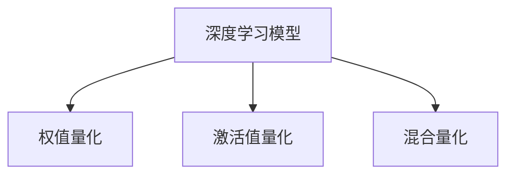

                 

## 1. 背景介绍

### 1.1 问题由来

随着深度学习技术的飞速发展，大模型已经成为实现高性能AI应用的核心工具。然而，大模型的高计算资源需求限制了其在移动设备、嵌入式系统等资源受限环境中的应用。为了解决这一问题，量化技术应运而生。量化通过将模型参数从浮点数转换成低精度整数或定点数，大幅降低了模型的计算和存储开销，使得大模型能够在资源受限的设备上高效运行。

### 1.2 问题核心关键点

量化技术的核心在于将模型参数从浮点数转换为低精度数，从而减少计算和存储需求，提升模型的计算效率。量化技术的引入使得AI模型能够广泛应用于移动设备、嵌入式系统、边缘计算等资源受限场景。量化技术的应用可以分为以下几种类型：

- 权值量化(Wight Quantization)：将模型的权重参数从32位浮点数量化为8位或16位整数。
- 激活值量化(Activation Quantization)：将模型的激活值从32位浮点数量化为8位或16位整数。
- 混合量化(Hybrid Quantization)：同时量化权重和激活值，实现浮点精度和低精度计算之间的折中。

这些量化技术能够显著降低模型的计算和存储开销，同时保证模型的精度不受显著影响，是实现轻量化AI模型的重要手段。

## 2. 核心概念与联系

### 2.1 核心概念概述

为更好地理解量化技术，本节将介绍几个密切相关的核心概念：

- **量化(Qantization)**：将浮点数转换为整数或定点数的过程，通过减少数值表示范围来降低计算和存储开销。量化技术广泛应用于深度学习模型的压缩与加速。

- **权值量化(Wight Quantization)**：将模型的权重参数从32位浮点数量化为8位或16位整数，减少模型存储和计算资源的需求。

- **激活值量化(Activation Quantization)**：将模型的激活值从32位浮点数量化为8位或16位整数，减少模型计算开销。

- **混合量化(Hybrid Quantization)**：同时量化权重和激活值，兼顾模型精度和计算效率。

- **深度学习模型**：基于神经网络结构，通过训练获得模型参数，用于图像识别、语音识别、自然语言处理等任务的人工智能模型。

这些核心概念之间的逻辑关系可以通过以下Mermaid流程图来展示：



这个流程图展示了大模型压缩和加速的关键步骤：

1. 深度学习模型通过大规模数据集训练得到模型参数。
2. 在模型训练或推理过程中，通过量化技术将模型参数转换为低精度数。
3. 不同类型的量化方法可以单独应用，也可以组合使用。

## 3. 核心算法原理 & 具体操作步骤

### 3.1 算法原理概述

量化技术的基本原理是通过将浮点数转换为低精度整数或定点数，减少数值表示范围，从而降低计算和存储开销。量化过程中，需要对每个浮点数进行范围分析，确定其最佳量化级别。通常情况下，量化级别越高，计算和存储开销越低，但模型精度也可能越低。因此，需要在精度和计算效率之间找到平衡点。

量化技术可以分为以下两个步骤：

1. **参数范围分析**：确定模型参数的数值范围，选择合适的量化级别。
2. **量化转换**：将浮点数转换为低精度整数或定点数。

### 3.2 算法步骤详解

**Step 1: 参数范围分析**

在量化之前，首先需要确定每个浮点数参数的数值范围。这可以通过分析模型参数的分布来实现。例如，对于一个典型的卷积神经网络(CNN)模型，可以统计每个卷积核的参数分布，确定其数值范围。对于ReLU激活函数，可以分析其输出值的分布。这些分析结果可以帮助选择合适的量化级别。

**Step 2: 量化转换**

量化转换是将浮点数转换为低精度整数或定点数的过程。常用的量化方法包括：

- **对称量化**：将浮点数映射到一个对称的量化区间，通常使用-127到127的范围。
- **非对称量化**：将浮点数映射到一个非对称的量化区间，通常使用0到255的范围。

在量化转换过程中，需要将每个浮点数参数映射到其对应的低精度整数或定点数。例如，对于8位对称量化，可以将浮点数映射到-128到127之间的整数。

### 3.3 算法优缺点

量化技术的优点包括：

- **计算效率提升**：量化后的模型可以显著降低计算和存储开销，提高计算效率。
- **模型体积缩小**：量化后的模型体积明显缩小，有利于在资源受限的设备上部署。

量化技术的缺点包括：

- **精度损失**：量化过程可能导致模型精度下降，尤其是在低精度量化级别下。
- **训练复杂性增加**：量化过程需要在训练或推理过程中进行，增加了训练和推理的复杂性。

### 3.4 算法应用领域

量化技术广泛应用于深度学习模型的压缩与加速，特别是在移动设备、嵌入式系统、边缘计算等资源受限场景中。以下是一些量化技术的具体应用领域：

- **移动设备**：量化后的模型可以在智能手机、平板电脑等移动设备上高效运行，为用户提供实时、低延迟的AI服务。
- **嵌入式系统**：量化后的模型可以运行在嵌入式设备上，实现高效的图像识别、语音识别、自然语言处理等应用。
- **边缘计算**：量化后的模型可以在边缘设备上进行本地推理，减少数据传输和云端计算开销，提升系统响应速度。
- **自动驾驶**：量化后的模型可以在自动驾驶车辆上进行实时推理，实现高效的物体检测、路径规划等功能。

## 4. 数学模型和公式 & 详细讲解 & 举例说明

### 4.1 数学模型构建

量化技术的数学模型主要涉及浮点数到低精度数的映射。以8位对称量化为例，假设一个浮点数 $x$ 的量化区间为[-127, 127]，其量化后的整数表示为 $q$，则量化公式为：

$$ q = \text{round}(\frac{x}{s}) $$

其中，$s$ 是量化步长，对于8位对称量化，$s = \frac{1}{128}$。

### 4.2 公式推导过程

对于任意浮点数 $x$，其量化后的整数 $q$ 可以表示为：

$$ q = \left\lfloor \frac{x}{s} + \frac{1}{2} \right\rfloor $$

其中，$\left\lfloor \cdot \right\rfloor$ 表示向下取整操作。

### 4.3 案例分析与讲解

以一个简单的例子来说明量化过程。假设有一个浮点数 $x = 0.5$，其量化区间为[-127, 127]，量化步长为 $\frac{1}{128}$。则其量化后的整数为：

$$ q = \left\lfloor \frac{0.5}{\frac{1}{128}} + \frac{1}{2} \right\rfloor = \left\lfloor 64 \right\rfloor = 64 $$

因此，$x$ 的量化结果为 64。

## 5. 项目实践：代码实例和详细解释说明

### 5.1 开发环境搭建

在进行量化实践前，我们需要准备好开发环境。以下是使用Python进行TensorFlow开发的环境配置流程：

1. 安装Anaconda：从官网下载并安装Anaconda，用于创建独立的Python环境。

2. 创建并激活虚拟环境：
```bash
conda create -n tf-env python=3.8 
conda activate tf-env
```

3. 安装TensorFlow：
```bash
pip install tensorflow
```

4. 安装相关工具包：
```bash
pip install numpy scipy matplotlib
```

完成上述步骤后，即可在`tf-env`环境中开始量化实践。

### 5.2 源代码详细实现

以下是一个使用TensorFlow进行权重量化的代码实现示例：

```python
import tensorflow as tf
from tensorflow.keras import layers

# 定义模型
model = tf.keras.Sequential([
    layers.Dense(128, activation='relu'),
    layers.Dense(10, activation='softmax')
])

# 将模型转换为tf.function
@tf.function
def quantized_model(inputs):
    inputs = tf.cast(inputs, tf.float16)
    outputs = model(inputs)
    return tf.cast(outputs, tf.int32)

# 生成随机数据
inputs = tf.random.normal(shape=(1, 10))

# 计算原始模型输出
outputs = model(inputs)

# 计算量化模型输出
quantized_outputs = quantized_model(inputs)
```

在上述代码中，首先定义了一个简单的全连接神经网络模型，并将其转换为tf.function。然后，通过tf.cast将输入数据转换为float16，计算原始模型的输出。最后，将原始模型的输出再次转换为float16，计算量化模型的输出。

### 5.3 代码解读与分析

让我们再详细解读一下关键代码的实现细节：

**tf.function装饰器**：
- 将模型转换为tf.function，提高模型的计算效率。

**tf.cast操作**：
- 用于将数据类型进行转换，支持从浮点数到整数的量化。

**tf.float16类型**：
- 用于表示浮点数，支持16位浮点数计算，减少计算资源开销。

在上述代码中，我们通过tf.cast操作将输入数据转换为float16类型，计算模型的输出。然后，再次将输出转换为float16类型，计算量化模型的输出。这样，原始模型和量化模型的计算路径完全一致，只是数据类型发生了变化。

## 6. 实际应用场景

### 6.1 移动设备

量化技术在移动设备中的应用非常广泛。以智能手机为例，量化后的模型可以在设备上高效运行，为用户提供实时、低延迟的AI服务。例如，量化后的图像识别模型可以在手机相机中实时检测人脸、物体等，提升用户体验。

### 6.2 嵌入式系统

嵌入式系统通常具有计算资源受限的特点，量化技术可以显著降低模型的计算和存储开销，使得大模型能够在嵌入式设备上运行。例如，量化后的语音识别模型可以在智能音箱、智能家居设备中进行实时语音识别，实现自然语言交互。

### 6.3 边缘计算

边缘计算是一种将计算任务分布到网络边缘的设备上进行处理的计算模式，旨在减少数据传输和云端计算开销，提升系统响应速度。量化技术可以使得大模型在边缘设备上进行本地推理，实现高效的图像识别、语音识别、自然语言处理等应用。例如，量化后的交通监控系统可以在边缘设备上实时检测交通违规行为，提升城市管理效率。

### 6.4 自动驾驶

自动驾驶系统需要实时处理大量传感器数据，量化技术可以显著降低计算和存储开销，使得大模型能够在自动驾驶车辆上进行实时推理，实现高效的物体检测、路径规划等功能。例如，量化后的物体检测模型可以在自动驾驶车辆中实时检测道路障碍物，提升行车安全。

## 7. 工具和资源推荐

### 7.1 学习资源推荐

为了帮助开发者系统掌握量化技术，这里推荐一些优质的学习资源：

1. **《深度学习量化技术》**：一本全面介绍量化技术的书籍，涵盖了量化技术的理论基础、实践技巧和最新进展。

2. **《TensorFlow Quantization Tutorial》**：TensorFlow官方提供的量化教程，包含详细的量化示例代码和实际应用案例。

3. **《Quantization in Deep Learning》**：IEEE发表的一篇综述论文，全面回顾了量化技术的现状和发展趋势。

4. **《GPU Deep Learning》**：NVIDIA推出的深度学习教程，介绍了在GPU上实现量化加速的方法和技巧。

5. **《Towards Quantization: A Comprehensive Guide》**：一篇全面介绍量化技术的博文，涵盖量化技术的理论基础、实践技巧和最新进展。

通过对这些资源的学习实践，相信你一定能够快速掌握量化技术的精髓，并用于解决实际的AI问题。

### 7.2 开发工具推荐

高效的开发离不开优秀的工具支持。以下是几款用于量化开发的常用工具：

1. **TensorFlow**：Google主导开发的深度学习框架，支持量化加速，适合大规模工程应用。

2. **ONNX**：开源模型格式，支持多种深度学习框架的量化转换，方便模型部署和优化。

3. **PyTorch Quantization**：PyTorch提供的量化工具，支持模型训练和推理过程中的量化，方便开发者使用。

4. **Quantization Toolkit**：NVIDIA开发的量化工具，支持GPU上的量化加速，提高计算效率。

5. **TensorBoard**：TensorFlow配套的可视化工具，实时监测模型训练状态，提供丰富的图表呈现方式，方便调试模型。

6. **Weights & Biases**：模型训练的实验跟踪工具，记录和可视化模型训练过程中的各项指标，方便对比和调优。

合理利用这些工具，可以显著提升量化任务的开发效率，加快创新迭代的步伐。

### 7.3 相关论文推荐

量化技术的发展源于学界的持续研究。以下是几篇奠基性的相关论文，推荐阅读：

1. **《Deep Compression: A Framework for Model Quantization》**：Google发表的一篇开创性论文，提出了深度压缩框架，实现了模型压缩和量化加速。

2. **《Compact and Fast Quantization》**：Facebook发表的一篇论文，提出了紧凑型量化方法，提高了量化后模型的计算效率。

3. **《Sobol Quantization》**：IBM发表的一篇论文，提出了基于Sobol序列的量化方法，提高了量化后的模型精度。

4. **《Hybrid Quantization》**：Google发表的一篇论文，提出了混合量化方法，同时量化权重和激活值，提高了模型的精度和计算效率。

这些论文代表了大模型压缩和加速技术的发展脉络。通过学习这些前沿成果，可以帮助研究者把握学科前进方向，激发更多的创新灵感。

## 8. 总结：未来发展趋势与挑战

### 8.1 总结

本文对量化技术进行了全面系统的介绍。首先阐述了量化技术的研究背景和意义，明确了量化技术在实现大模型高效运行中的核心作用。其次，从原理到实践，详细讲解了量化技术的数学模型和核心算法，给出了量化任务开发的完整代码实例。同时，本文还广泛探讨了量化技术在移动设备、嵌入式系统、边缘计算等资源受限场景中的应用前景，展示了量化技术的重要价值。最后，本文精选了量化技术的各类学习资源，力求为读者提供全方位的技术指引。

通过本文的系统梳理，可以看到，量化技术是实现大模型高效运行的关键手段，可以显著降低计算和存储开销，提高模型的计算效率。量化技术的应用场景非常广泛，有助于提升AI技术在各领域的落地效果。未来，伴随深度学习模型的不断进步和硬件技术的持续演进，量化技术必将迎来新的发展机遇，为人工智能技术的发展提供更强大的推动力。

### 8.2 未来发展趋势

展望未来，量化技术的发展将呈现以下几个趋势：

1. **更高效的量化算法**：随着硬件技术的不断进步，量化算法也将更加高效，能够更好地支持大模型的压缩和加速。

2. **更广泛的量化应用**：量化技术将不仅仅应用于深度学习模型的压缩和加速，还将扩展到边缘计算、物联网等领域，带来更多的应用场景。

3. **更灵活的量化策略**：未来的量化策略将更加灵活，能够根据具体应用场景选择合适的量化级别，平衡模型精度和计算效率。

4. **更强的可解释性**：量化技术的发展将带来更强的可解释性，使得模型的推理过程更加透明和可理解。

5. **更高的模型精度**：量化技术将进一步提升模型的精度，减少量化带来的精度损失，使得量化后模型能够更好地应用于高精度计算场景。

这些趋势将推动量化技术的发展，使得大模型能够在更多场景下高效运行，为人工智能技术带来更广泛的应用前景。

### 8.3 面临的挑战

尽管量化技术已经取得了显著进展，但在实现更高效、更灵活的量化过程中，仍面临以下挑战：

1. **模型精度损失**：量化过程可能会带来一定的模型精度损失，尤其是在低精度量化级别下。如何最小化精度损失，提高量化后模型的性能，是未来研究的重要方向。

2. **量化计算复杂性**：量化过程需要在训练或推理过程中进行，增加了计算复杂性。如何在保证模型性能的同时，降低计算开销，提高量化效率，是未来研究的重要课题。

3. **量化参数调优**：量化过程需要选择合适的量化级别和策略，不同的量化参数组合对模型的性能和计算开销有不同的影响。如何在保证模型性能的同时，找到最优的量化参数组合，是未来研究的重要方向。

4. **量化后模型的可解释性**：量化后的模型缺乏可解释性，难以理解模型的决策逻辑。如何在量化过程中保持模型的可解释性，是未来研究的重要方向。

5. **量化技术的普及性**：量化技术需要更广泛的应用推广和普及，才能发挥其最大价值。如何降低量化技术的入门门槛，提升开发者和用户的使用体验，是未来研究的重要方向。

这些挑战将推动量化技术的发展，使得量化技术能够更好地应用于实际应用场景，推动人工智能技术的发展。

### 8.4 研究展望

面对量化技术面临的挑战，未来的研究需要在以下几个方面寻求新的突破：

1. **探索更高效的量化算法**：开发更高效的量化算法，提升量化效率，降低计算开销。

2. **引入更多先验知识**：将符号化的先验知识，如知识图谱、逻辑规则等，与量化过程进行结合，提高量化后模型的精度和可解释性。

3. **融合多种量化技术**：探索多种量化技术的融合方法，兼顾模型精度和计算效率。

4. **引入外部知识库**：引入外部知识库、规则库等专家知识，引导量化过程学习更准确的数值表示，提高量化后模型的精度。

5. **加强模型可解释性**：引入可解释性方法，增强量化后模型的推理过程的透明性和可理解性。

6. **优化模型训练过程**：优化量化过程的模型训练过程，降低训练复杂性，提高量化后模型的性能。

这些研究方向的探索，将推动量化技术的发展，使得量化后的大模型能够更好地应用于实际应用场景，推动人工智能技术的发展。面向未来，量化技术需要与其他人工智能技术进行更深入的融合，如知识表示、因果推理、强化学习等，多路径协同发力，共同推动深度学习模型的进步。

## 9. 附录：常见问题与解答

**Q1: 量化后模型的精度如何保证？**

A: 量化后模型的精度主要取决于量化级别和量化策略。一般来说，量化级别越高，模型精度损失越大。量化策略包括对称量化、非对称量化和混合量化等，不同的量化策略对模型精度有不同的影响。

**Q2: 量化后模型的计算效率如何提升？**

A: 量化后模型的计算效率主要取决于量化级别和模型结构。一般来说，量化级别越高，计算效率越高。此外，通过优化模型结构、引入并行计算等方法，也可以进一步提升量化后模型的计算效率。

**Q3: 量化后模型的训练和推理过程如何进行？**

A: 量化后模型的训练和推理过程需要进行量化算法的支持。在训练过程中，需要将模型参数进行量化，并使用量化后的模型进行计算。在推理过程中，需要将输入数据进行量化，并使用量化后的模型进行推理。

**Q4: 量化后模型的部署和应用需要注意哪些问题？**

A: 量化后模型的部署和应用需要注意以下问题：

1. 量化级别和量化策略的选择，需要根据具体应用场景进行选择。
2. 量化后模型的精度和计算效率需要进行评估，确保满足应用需求。
3. 量化后模型的优化，需要结合实际应用场景进行优化，提高模型性能。
4. 量化后模型的部署，需要考虑模型的计算资源需求和部署环境，选择合适的部署方式。

这些问题的解决，将使得量化后的大模型能够更好地应用于实际应用场景，推动人工智能技术的发展。

总之，量化技术是实现大模型高效运行的关键手段，能够显著降低计算和存储开销，提高模型的计算效率。量化技术的应用场景非常广泛，有助于提升AI技术在各领域的落地效果。未来，伴随深度学习模型的不断进步和硬件技术的持续演进，量化技术必将迎来新的发展机遇，为人工智能技术的发展提供更强大的推动力。

