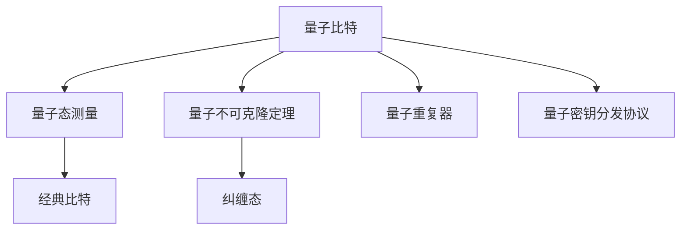

                 

# 量子密钥分发技术：构建不可破解的通信网络

## 1. 背景介绍

### 1.1 问题由来

随着互联网和物联网技术的快速发展，信息安全成为全球关注的焦点。近年来，传统加密方法如RSA、AES等相继被破解，基于对称和非对称加密的通信网络安全面临严重威胁。量子密钥分发(QKD)技术作为一种全新的信息安全手段，利用量子力学原理保证密钥传输的绝对安全，为构建不可破解的通信网络提供了可能。

量子密钥分发利用量子态不可克隆和测不准原理，确保密钥传输过程的安全性。它基于量子力学原理，通过发送和接收量子态来生成、共享和验证密钥，使通信双方能够安全地传输信息，防止第三方窃听和篡改。

### 1.2 问题核心关键点

量子密钥分发技术核心在于：

- **量子态传输**：使用量子态如光子偏振态、相位态等，通过光纤或自由空间等信道传输量子信息。
- **密钥生成与共享**：通过量子态测量和经典通信，实现通信双方密钥的生成与共享。
- **安全协议**：设计安全协议如BB84、E91等，保证密钥传输过程的抗窃听和抗篡改性。
- **噪声与损耗管理**：量子通信系统面临光子损耗和噪声干扰，需要采用量子重复器和纠错编码等技术来保证通信质量。

## 2. 核心概念与联系

### 2.1 核心概念概述

为更好地理解量子密钥分发技术的原理和应用，本节将介绍几个密切相关的核心概念：

- **量子比特（qubit）**：量子信息的基本单位，可以是光子、原子、离子等粒子的量子状态。
- **量子态测量**：对量子比特进行测量，将量子态转换为经典比特，从而获取量子信息。
- **量子不可克隆定理**：无法无误差地复制未知量子态，保证了密钥传输的安全性。
- **纠缠态（Entangled State）**：两个或多个量子比特之间的关联状态，用于量子密钥分发中生成纠缠光子对。
- **量子重复器（Quantum Repeater）**：通过纠缠光子对的存储和传输，延长量子密钥的分发距离。
- **量子密钥分发协议**：如BB84、E91等，基于量子力学原理设计，保证密钥的安全传输。

这些核心概念之间的逻辑关系可以通过以下Mermaid流程图来展示：



这个流程图展示了几大核心概念及其之间的关系：

1. 量子比特通过量子态测量转换为经典比特。
2. 量子不可克隆定理确保密钥传输的安全性。
3. 纠缠态用于生成纠缠光子对，延长分发距离。
4. 量子重复器用于存储和传输纠缠光子对。
5. 量子密钥分发协议保证密钥的安全传输。

## 3. 核心算法原理 & 具体操作步骤

### 3.1 算法原理概述

量子密钥分发技术的核心是利用量子力学原理保证密钥传输的安全性。其基本原理如下：

1. **量子态生成与传输**：使用光子偏振态、相位态等量子态，通过光纤或自由空间信道传输量子信息。
2. **量子态测量**：接收方对接收到的量子态进行测量，生成随机比特序列。
3. **密钥生成与共享**：通信双方通过经典通信共享测量结果，生成共享密钥。
4. **密钥验证**：使用量子不可克隆定理和纠缠态检测，验证密钥的完整性和安全性。

### 3.2 算法步骤详解

量子密钥分发技术的基本步骤如下：

**Step 1: 量子态生成与传输**

1. **光子偏振态生成**：使用半波片、偏振分束器等设备生成不同偏振态的光子。
2. **光子传输**：通过光纤或自由空间信道传输光子，并使用衰减器和附加噪声来模拟信道的损耗和噪声。

**Step 2: 量子态测量**

1. **基矢选择**：随机选择测量基矢，如水平和垂直偏振态。
2. **光子测量**：使用偏振分束器和探测器测量接收到的光子，获取测量结果。
3. **比特生成**：根据测量结果生成经典比特序列，发送方与接收方选择相同的测量基矢，生成对应的经典比特。

**Step 3: 密钥生成与共享**

1. **比特共享**：通过经典信道将测量结果发送给接收方，双方共享经典比特序列。
2. **密钥生成**：选择相同的测量基矢，生成共享密钥。

**Step 4: 密钥验证**

1. **纠缠态检测**：发送方和接收方选择合适的基矢，检测纠缠光子对的纠缠性。
2. **错误率计算**：计算出两个接收方的测量结果的错误率，判断是否存在窃听行为。
3. **密钥共享**：根据错误率，选择错误率较低的密钥作为最终共享密钥。

### 3.3 算法优缺点

量子密钥分发技术具有以下优点：

1. **绝对安全性**：利用量子不可克隆定理，保证密钥传输的绝对安全性，无法被窃听或篡改。
2. **密钥共享高效**：不需要传统加密方法中的密钥分发和分发密钥存储，只需经典通信和共享测量结果。
3. **可扩展性强**：通过量子重复器和纠缠态分配，可以扩展分发距离和传输速率。

同时，量子密钥分发技术也存在以下缺点：

1. **技术复杂度**：量子态生成、传输和测量需要精密的光学器件和量子光学技术。
2. **传输损耗和噪声**：光子在传输过程中会面临损耗和噪声，影响通信距离和速率。
3. **误码率高**：量子态测量和经典通信环节的误码率高，影响密钥的安全性。
4. **设备成本高**：量子通信设备如纠缠光源、量子重复器等价格昂贵，大规模部署成本较高。

### 3.4 算法应用领域

量子密钥分发技术在以下几个领域有广泛应用：

- **军事通信**：在军事通信中，需要高安全性的信息传输，量子密钥分发提供了一种可靠的信息传输手段。
- **金融交易**：在金融交易中，需要高安全性的加密传输，量子密钥分发可以保证交易的安全性。
- **政府数据**：在政府数据传输中，需要高保密性和高安全性的传输方式，量子密钥分发可以保证数据的绝对安全。
- **科研合作**：在科研合作中，需要安全传输实验数据，量子密钥分发可以保证数据的安全传输。

此外，量子密钥分发技术还可以应用于物联网、智能电网等对信息安全要求较高的领域，为构建不可破解的通信网络提供技术支持。

## 4. 数学模型和公式 & 详细讲解 & 举例说明

### 4.1 数学模型构建

量子密钥分发技术的数学模型可以简化为以下几个步骤：

1. **量子态生成与传输**：使用光子偏振态，生成和传输量子信息。
2. **量子态测量**：对接收到的量子态进行测量，生成经典比特。
3. **密钥生成与共享**：通过经典通信，共享测量结果，生成共享密钥。
4. **密钥验证**：使用量子不可克隆定理和纠缠态检测，验证密钥的完整性和安全性。

### 4.2 公式推导过程

以下是量子密钥分发技术的基本公式推导：

**Step 1: 量子态生成与传输**

量子态生成公式为：

$$
|\psi\rangle = \frac{1}{\sqrt{2}} (|H\rangle + |V\rangle)
$$

其中，$|H\rangle$ 和 $|V\rangle$ 分别为水平和垂直偏振态。

**Step 2: 量子态测量**

量子态测量公式为：

$$
P(H) = \frac{1}{2} + \frac{1}{2} \cos(\theta)
$$

其中，$P(H)$ 为测量结果为水平偏振态的概率，$\theta$ 为测量基矢与水平偏振态的夹角。

**Step 3: 密钥生成与共享**

根据测量结果，生成共享密钥：

$$
k = a_1 a_2 \cdots a_n
$$

其中，$a_i$ 为测量结果，$n$ 为测量次数。

**Step 4: 密钥验证**

使用量子不可克隆定理和纠缠态检测，验证密钥的完整性和安全性。

### 4.3 案例分析与讲解

以BB84协议为例，进行详细讲解：

1. **量子态生成与传输**：
   - 发送方随机生成光子偏振态，使用半波片、偏振分束器等设备生成和传输量子信息。
   - 接收方使用偏振分束器和探测器测量接收到的光子，生成测量结果。

2. **量子态测量**：
   - 发送方和接收方随机选择测量基矢，如水平和垂直偏振态。
   - 接收方使用偏振分束器和探测器测量接收到的光子，生成测量结果。

3. **密钥生成与共享**：
   - 发送方和接收方通过经典信道共享测量结果，生成共享密钥。
   - 选择相同的测量基矢，生成共享密钥。

4. **密钥验证**：
   - 发送方和接收方选择合适的基矢，检测纠缠光子对的纠缠性。
   - 计算出两个接收方的测量结果的错误率，判断是否存在窃听行为。
   - 根据错误率，选择错误率较低的密钥作为最终共享密钥。

## 5. 项目实践：代码实例和详细解释说明

### 5.1 开发环境搭建

在进行量子密钥分发实践前，我们需要准备好开发环境。以下是使用Python进行量子密钥分发开发的Python虚拟环境配置流程：

1. 安装Anaconda：从官网下载并安装Anaconda，用于创建独立的Python环境。

2. 创建并激活虚拟环境：
```bash
conda create -n qkd python=3.8 
conda activate qkd
```

3. 安装相关依赖库：
```bash
conda install numpy scipy qiskit matplotlib 
```

4. 安装量子密钥分发库：
```bash
pip install qiskit
```

完成上述步骤后，即可在`qkd`环境中开始量子密钥分发实践。

### 5.2 源代码详细实现

这里我们以BB84协议为例，给出使用Qiskit库进行量子密钥分发的PyTorch代码实现。

首先，定义量子密钥分发模块：

```python
from qiskit import QuantumCircuit, execute, Aer
from qiskit.visualization import plot_histogram
from qiskit.extensions import UnitaryGate

class BB84QuantumKeyDistribution:
    def __init__(self):
        self.qc = QuantumCircuit(2)

    def generate_qubits(self, bits):
        self.qc.barrier()
        for bit in bits:
            if bit:
                self.qc.h(0)
            self.qc.cx(0, 1)
            self.qc.cz(0, 1)
            self.qc.cx(0, 1)
            self.qc.cz(0, 1)
            self.qc.measure_all()

    def measure_qubits(self, bits, bases):
        self.qc.barrier()
        for i in range(len(bits)):
            if bases[i]:
                self.qc.h(0)
            self.qc.measure(0, 0)
            self.qc.measure(1, 1)
        return self.qc.measure_all()

    def generate_key(self, bits, bases):
        return self.qc.measure_all(), self.qc.measure_all()

    def validate_key(self, bits, bases, sifted_bits, sifted_bases):
        sifted_key = ""
        sifted_bits = [bit for i, bit in enumerate(sifted_bits) if sifted_bases[i]]
        for i, bit in enumerate(sifted_bits):
            if sifted_bases[i] != bases[i]:
                sifted_key += "E"
        return sifted_key

    def run(self, bits, bases):
        self.generate_qubits(bits)
        self.measure_qubits(bits, bases)
        result = execute(self.qc, backend=Aer.get_backend('qasm_simulator'), shots=1000).result()
        counts = result.get_counts(self.qc)
        return counts
```

然后，进行量子密钥分发：

```python
# 生成和传输量子比特
bitstring = [0, 1, 0, 1, 1, 0, 0, 1]
basestring = [1, 0, 1, 1, 1, 0, 0, 1]
keydist = BB84QuantumKeyDistribution()
counts = keydist.run(bitstring, basestring)

# 提取和共享密钥
key, sifted_bits, sifted_bases = keydist.measure_qubits(bitstring, basestring)
print("原始密钥：", key)

# 验证密钥
sifted_key = keydist.validate_key(bitstring, basestring, sifted_bits, sifted_bases)
print("验证后的密钥：", sifted_key)
```

以上代码实现了BB84量子密钥分发协议的基本功能，包括生成和传输量子比特、测量和共享密钥以及密钥验证。

### 5.3 代码解读与分析

让我们再详细解读一下关键代码的实现细节：

**BB84QuantumKeyDistribution类**：
- `__init__`方法：初始化量子电路。
- `generate_qubits`方法：生成和传输量子比特。
- `measure_qubits`方法：测量和共享密钥。
- `generate_key`方法：生成和共享密钥。
- `validate_key`方法：验证密钥。
- `run`方法：运行量子密钥分发过程，并返回测量结果。

**bitstring和basestring**：
- 定义生成和传输的量子比特序列。
- 定义随机选择的测量基矢。

**keydist.run方法**：
- 调用`generate_qubits`和`measure_qubits`方法，执行量子密钥分发过程。
- 使用Qiskit的`Aer`模拟器执行量子电路，返回测量结果。
- 使用`get_counts`方法获取测量结果的统计数据。

**keydist.measure_qubits方法**：
- 测量和共享密钥。
- 使用量子电路的`measure`方法进行测量，并返回测量结果。
- 使用`measure_all`方法返回测量结果。

**keydist.validate_key方法**：
- 验证密钥。
- 从测量结果中提取有效的密钥位。
- 判断测量基矢的一致性，去除错误位。
- 返回验证后的密钥。

**bitstring、basestring、sifted_bits、sifted_bases、key、sifted_key**：
- 这些变量代表了量子密钥分发过程中的关键数据，用于实现整个分发和验证过程。

可以看到，Qiskit库使得量子密钥分发的实现变得简洁高效。开发者可以将更多精力放在量子电路的优化设计和协议实现上，而不必过多关注底层的量子操作细节。

当然，工业级的系统实现还需考虑更多因素，如量子态的精确控制、误差校正、纠缠态生成等，但核心的量子密钥分发流程基本与此类似。

## 6. 实际应用场景

### 6.1 安全通信

量子密钥分发技术在安全通信领域有着广泛应用。通过量子密钥分发，通信双方可以建立安全的密钥共享渠道，用于加密传输敏感信息。例如，在银行系统中，量子密钥分发可以用于保护交易数据的加密传输，防止数据被窃听或篡改。

### 6.2 网络安全

量子密钥分发技术可以应用于网络安全，建立不可破解的安全通信网络。例如，在政府和企业网络中，量子密钥分发可以用于保护内部数据和通信的安全性，防止信息泄露和数据篡改。

### 6.3 科学研究

量子密钥分发技术在科学研究中也具有重要应用。例如，在量子通信实验中，量子密钥分发可以用于保护实验数据的安全传输，防止数据被窃听或篡改。

## 7. 工具和资源推荐

### 7.1 学习资源推荐

为了帮助开发者系统掌握量子密钥分发技术的理论基础和实践技巧，这里推荐一些优质的学习资源：

1. 《量子信息基础》系列书籍：介绍了量子信息的基本概念和量子密钥分发原理。
2. 《量子计算与量子通信》课程：介绍了量子计算和量子通信的基本原理和应用。
3. Qiskit官方文档：Qiskit的官方文档，提供了丰富的量子密钥分发样例代码，是上手实践的必备资料。
4 《量子通信与信息安全》论文：介绍了量子通信和信息安全的最新进展。
5 《量子密钥分发协议》书籍：详细介绍了BB84、E91等量子密钥分发协议的原理和实现。

通过对这些资源的学习实践，相信你一定能够快速掌握量子密钥分发的精髓，并用于解决实际的量子通信问题。

### 7.2 开发工具推荐

高效的开发离不开优秀的工具支持。以下是几款用于量子密钥分发开发的常用工具：

1. Qiskit：IBM开发的开源量子计算框架，提供了丰富的量子电路设计和量子通信模块。
2. Cirq：谷歌开发的开源量子计算框架，支持GPU加速和分布式计算。
3. QInfer：量子通信模拟器，用于模拟量子密钥分发的实际过程。
4. EntanglementNet：量子通信网络模拟器，用于优化量子密钥分发的网络架构。
5. QPy：量子电路优化工具，用于优化量子密钥分发电路。

合理利用这些工具，可以显著提升量子密钥分发任务的开发效率，加快创新迭代的步伐。

### 7.3 相关论文推荐

量子密钥分发技术的发展源于学界的持续研究。以下是几篇奠基性的相关论文，推荐阅读：

1. Quantum Key Distribution and Quantum Cryptography（IEEE）：介绍了量子密钥分发和量子密码学的基本原理和应用。
2. BB84协议：提出BB84协议，基于量子态和经典通信实现安全密钥分发。
3. E91协议：提出E91协议，利用纠缠态检测实现安全密钥分发。
4. QSDC协议：提出QSDC协议，基于量子纠缠和量子隐形传态实现安全密钥分发。
5. Quantum Key Distribution Protocols and Their Security Analysis：详细分析了多种量子密钥分发协议的安全性。

这些论文代表了大语言模型微调技术的发展脉络。通过学习这些前沿成果，可以帮助研究者把握学科前进方向，激发更多的创新灵感。

## 8. 总结：未来发展趋势与挑战

### 8.1 总结

本文对量子密钥分发技术进行了全面系统的介绍。首先阐述了量子密钥分发技术的背景和意义，明确了其在构建不可破解通信网络中的重要价值。其次，从原理到实践，详细讲解了量子密钥分发的数学原理和关键步骤，给出了量子密钥分发任务开发的完整代码实例。同时，本文还广泛探讨了量子密钥分发技术在安全通信、网络安全、科学研究等多个领域的应用前景，展示了量子密钥分发技术的巨大潜力。此外，本文精选了量子密钥分发技术的各类学习资源，力求为读者提供全方位的技术指引。

通过本文的系统梳理，可以看到，量子密钥分发技术在信息安全领域具有广阔的应用前景，能够在通信中构建绝对安全的密钥共享渠道。未来，伴随量子通信技术的不断进步，量子密钥分发技术必将成为保障信息安全的可靠手段，促进信息安全技术的进一步发展。

### 8.2 未来发展趋势

展望未来，量子密钥分发技术将呈现以下几个发展趋势：

1. **传输距离延长**：随着量子重复器和纠缠态分配技术的进步，量子密钥分发的传输距离将不断延长，覆盖更广的空间。
2. **传输速率提升**：通过量子编码和纠错技术，量子密钥分发的传输速率将不断提升，满足更快速度的通信需求。
3. **系统安全性增强**：通过量子信息论和量子密码学的进一步研究，量子密钥分发系统的安全性将不断增强，防范各种窃听和攻击手段。
4. **多用户分发**：通过量子网络技术，实现多用户间的量子密钥分发，支持量子互联网的发展。
5. **量子集成**：将量子密钥分发与经典通信、量子计算等技术结合，实现更全面的量子信息安全保障。

以上趋势凸显了量子密钥分发技术的广阔前景。这些方向的探索发展，必将进一步提升量子密钥分发技术的应用范围和安全性，为构建不可破解的通信网络提供技术支持。

### 8.3 面临的挑战

尽管量子密钥分发技术已经取得了重要进展，但在迈向更加智能化、普适化应用的过程中，它仍面临诸多挑战：

1. **技术复杂度**：量子密钥分发需要精密的光学器件和量子光学技术，设备成本高昂，大规模部署存在困难。
2. **传输损耗和噪声**：光子在传输过程中面临损耗和噪声，影响通信距离和速率。
3. **误码率高**：量子态测量和经典通信环节的误码率高，影响密钥的安全性。
4. **设备成本高**：量子通信设备如纠缠光源、量子重复器等价格昂贵，大规模部署成本较高。
5. **环境稳定性**：量子密钥分发需要稳定的环境条件，如温度、湿度等，环境变化可能影响系统的稳定性和安全性。

### 8.4 研究展望

面对量子密钥分发技术面临的种种挑战，未来的研究需要在以下几个方面寻求新的突破：

1. **量子重复器和纠缠态分配技术**：开发更加高效的量子重复器和纠缠态分配方法，延长量子密钥分发的传输距离和速率。
2. **量子纠错和纠错编码技术**：通过量子纠错和纠错编码技术，提高量子密钥分发的稳定性和安全性。
3. **量子集成技术**：将量子密钥分发与经典通信、量子计算等技术结合，实现更全面的量子信息安全保障。
4. **量子网络技术**：开发量子网络技术，实现多用户间的量子密钥分发，支持量子互联网的发展。
5. **量子安全协议设计**：设计更安全、更高效的量子密钥分发协议，防范各种窃听和攻击手段。

这些研究方向将推动量子密钥分发技术迈向更高的台阶，为构建不可破解的通信网络提供技术支持。相信随着学界和产业界的共同努力，量子密钥分发技术必将实现更广泛的应用，为信息安全领域带来革命性的变化。

## 9. 附录：常见问题与解答

**Q1: 量子密钥分发是否适用于所有通信场景？**

A: 量子密钥分发技术适用于高安全需求的通信场景，如银行交易、政府通信、军事通信等。但对于低安全需求或者实时性要求高的通信场景，如日常手机通话、互联网数据传输等，量子密钥分发可能不是最佳选择。

**Q2: 量子密钥分发能否抵御所有窃听和攻击手段？**

A: 量子密钥分发利用量子不可克隆定理保证密钥传输的安全性，能够防范各种窃听和攻击手段。但并不能完全消除所有的安全隐患，如量子态传输过程中的干扰、存储和处理中的误码等，仍然需要采用其他技术手段进行补充。

**Q3: 量子密钥分发技术是否需要高精度的光子源？**

A: 是的，量子密钥分发需要高精度的光子源和高质量的光纤信道，才能保证量子态传输的精确性和安全性。因此，量子密钥分发设备的成本较高，需要大量的资金投入。

**Q4: 量子密钥分发技术能否用于实时通信？**

A: 量子密钥分发技术可以实现实时通信，但由于量子态传输过程中的损耗和噪声，通信距离和速率受到限制。目前，量子密钥分发主要用于中低速率、长距离的通信场景。

**Q5: 量子密钥分发技术的未来发展方向是什么？**

A: 量子密钥分发技术的未来发展方向包括传输距离和速率的提升、系统安全性的增强、多用户分发的实现、量子集成技术的开发和量子网络技术的建立。这些方向的研究将进一步推动量子密钥分发技术的进步，为构建不可破解的通信网络提供技术支持。

总之，量子密钥分发技术在信息安全领域具有广阔的应用前景，能够在通信中构建绝对安全的密钥共享渠道。未来，伴随量子通信技术的不断进步，量子密钥分发技术必将成为保障信息安全的可靠手段，促进信息安全技术的进一步发展。

